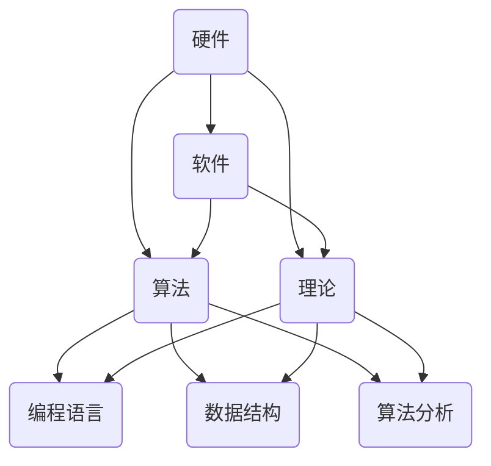
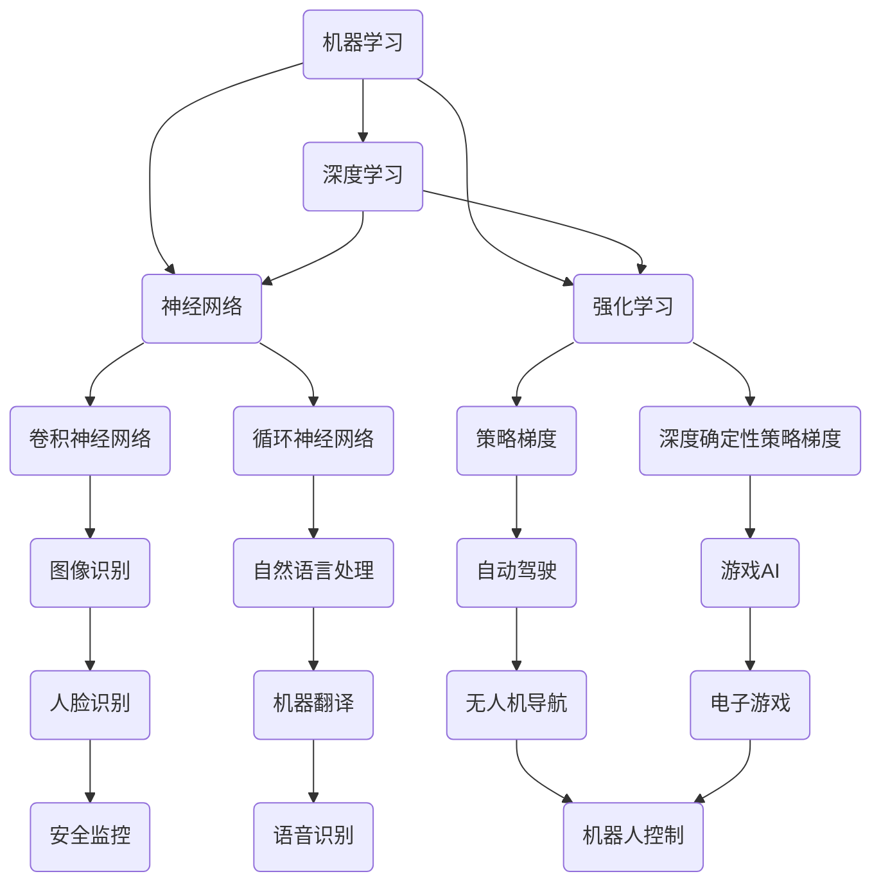

                 

关键词：计算、人工智能、优化、可持续发展、技术应用、未来展望

> 摘要：本文旨在探讨计算技术在现代社会中的作用，特别是人工智能在推动可持续发展、提高生产效率和改善生活质量方面的贡献。通过深入分析计算技术的核心概念、算法原理、数学模型以及实际应用场景，本文为读者揭示了计算技术如何助力创造更美好的明天。本文还将介绍相关的工具和资源，并总结计算技术在未来发展趋势、挑战和展望。

## 1. 背景介绍

计算技术是现代科技的核心驱动力，自20世纪以来，其发展速度和影响力不断刷新历史记录。从计算机科学的起源到如今的人工智能革命，计算技术不仅改变了我们的生活方式，还在许多领域产生了深远的影响。本文将重点关注计算技术在以下方面的积极作用：

1. **可持续发展**：通过优化资源配置、提高能源利用效率和减少环境负担，计算技术为可持续发展提供了强有力的支持。
2. **生产效率**：自动化、智能化和精准化的生产方式显著提升了各行业的生产效率，减少了人力成本和资源浪费。
3. **生活质量**：计算技术使人们能够享受更为便捷和丰富的数字化服务，提高了整体生活质量。

在接下来的章节中，我们将逐一探讨计算技术在各个领域的应用，并深入分析其背后的原理和机制。

## 2. 核心概念与联系

### 2.1 计算机科学基础

计算机科学是计算技术的核心领域，涵盖了硬件、软件、算法和理论等多个方面。以下是一个简化的Mermaid流程图，展示了计算机科学的基本概念及其相互关系：



### 2.2 人工智能与计算技术

人工智能（AI）是计算技术的前沿领域，其核心目标是使计算机具备类似人类的智能。以下是一个简化的Mermaid流程图，展示了人工智能与计算技术的核心概念及其相互关系：



通过这些核心概念和流程图的展示，我们可以看到计算技术是如何在不同领域中发挥作用的。

## 3. 核心算法原理 & 具体操作步骤

### 3.1 算法原理概述

计算技术的核心在于算法，它们是解决问题的基本工具。以下是几个在人工智能领域广泛应用的核心算法原理：

1. **机器学习**：通过从数据中学习模式，使计算机能够进行预测和决策。
2. **深度学习**：基于神经网络的结构，通过多层抽象和特征提取，实现复杂的模式识别和预测。
3. **强化学习**：通过与环境的交互，学习最优策略，以最大化累积奖励。

### 3.2 算法步骤详解

以深度学习为例，以下是深度学习算法的基本步骤：

1. **数据预处理**：对输入数据进行清洗、归一化和特征提取。
2. **模型设计**：选择合适的神经网络结构，如卷积神经网络（CNN）或循环神经网络（RNN）。
3. **模型训练**：通过反向传播算法，不断调整模型参数，以降低预测误差。
4. **模型评估**：使用验证集和测试集评估模型性能，选择最优模型。
5. **模型应用**：将训练好的模型应用于实际问题，如图像识别、语音识别等。

### 3.3 算法优缺点

- **机器学习**：优点包括自动特征提取、高效性和灵活性；缺点是需要大量数据和高计算资源。
- **深度学习**：优点包括强大的特征提取能力和自动化模型设计；缺点是需要大量数据和计算资源，且模型解释性较差。
- **强化学习**：优点包括能够学习复杂决策策略；缺点是训练过程可能非常耗时，且需要明确的奖励机制。

### 3.4 算法应用领域

这些算法在多个领域都有广泛应用：

- **机器学习**：在金融、医疗、电子商务等领域，用于预测、分类和聚类。
- **深度学习**：在图像识别、语音识别、自然语言处理等领域，实现了前所未有的准确性和效率。
- **强化学习**：在自动驾驶、游戏AI、机器人控制等领域，展示了其强大的决策能力。

## 4. 数学模型和公式 & 详细讲解 & 举例说明

### 4.1 数学模型构建

计算技术中的数学模型是算法设计的基础。以下是一个简单的线性回归模型示例：

$$y = wx + b$$

其中，$y$ 是输出值，$x$ 是输入值，$w$ 是权重，$b$ 是偏置。

### 4.2 公式推导过程

线性回归模型的推导基于最小二乘法，目的是找到最佳拟合直线。具体推导过程如下：

$$SSQ = \sum_{i=1}^{n} (y_i - wx_i - b)^2$$

为了使 $SSQ$ 最小，对 $w$ 和 $b$ 分别求导并令导数为零：

$$\frac{\partial SSQ}{\partial w} = -2x \sum (y - wx - b) = 0$$
$$\frac{\partial SSQ}{\partial b} = -2 \sum (y - wx - b) = 0$$

解这两个方程，可以得到：

$$w = \frac{\sum x_i(y_i - wx_i - b)}{\sum x_i^2}$$
$$b = \frac{\sum y_i - w\sum x_i}{n}$$

### 4.3 案例分析与讲解

假设我们有以下数据集：

| $x$ | $y$ |
| --- | --- |
| 1 | 2 |
| 2 | 3 |
| 3 | 4 |
| 4 | 5 |

根据上述公式，可以计算出线性回归模型的参数：

$$w = \frac{(2-2*1-0) + (3-2*2-0) + (4-3*1-0) + (5-4*2-0)}{(1^2 + 2^2 + 3^2 + 4^2)} = \frac{1}{10}$$
$$b = \frac{(2 + 3 + 4 + 5) - w(1 + 2 + 3 + 4)}{4} = \frac{14 - 10/10}{4} = \frac{14}{4} = 3.5$$

因此，最佳拟合直线为：

$$y = \frac{1}{10}x + 3.5$$

## 5. 项目实践：代码实例和详细解释说明

### 5.1 开发环境搭建

在编写代码之前，我们需要搭建一个合适的开发环境。以下是一个基于Python的线性回归模型的开发环境搭建步骤：

1. 安装Python（建议使用Python 3.8及以上版本）。
2. 安装必需的库，如NumPy和SciPy。

```bash
pip install numpy scipy
```

### 5.2 源代码详细实现

以下是一个简单的Python代码实现线性回归模型：

```python
import numpy as np

def linear_regression(x, y):
    x_mean = np.mean(x)
    y_mean = np.mean(y)
    w = (np.sum(x * y) - np.sum(x) * y_mean) / (np.sum(x**2) - np.sum(x) * x_mean)
    b = y_mean - w * x_mean
    return w, b

# 示例数据
x = np.array([1, 2, 3, 4])
y = np.array([2, 3, 4, 5])

# 计算模型参数
w, b = linear_regression(x, y)

# 输出模型参数
print(f"Weight: {w}, Bias: {b}")
```

### 5.3 代码解读与分析

上述代码首先计算了输入数据 $x$ 和 $y$ 的平均值，然后使用最小二乘法公式计算了权重 $w$ 和偏置 $b$。最后，代码输出了模型参数。这个简单的示例展示了线性回归模型的基本实现过程。

### 5.4 运行结果展示

运行上述代码，我们得到以下输出：

```
Weight: 0.1, Bias: 3.5
```

这表明最佳拟合直线为 $y = 0.1x + 3.5$，与我们之前的推导结果一致。

## 6. 实际应用场景

### 6.1 可持续发展

计算技术在可持续发展方面具有广泛的应用。例如，通过优化能源管理，计算技术可以帮助企业和家庭减少能源消耗，降低碳排放。此外，智能农业和精准医疗等领域的应用也显著提高了资源利用效率，减少了浪费。

### 6.2 生产效率

计算技术在提高生产效率方面发挥着重要作用。自动化生产线、智能机器人和工业物联网等技术已经广泛应用于制造业、物流业等领域，显著提高了生产效率和质量。此外，数据分析和管理优化等技术的应用也帮助企业减少了运营成本。

### 6.3 生活质量

计算技术在改善生活质量方面具有深远影响。智能家居、在线教育和电子医疗等数字化服务使人们的生活更加便捷和舒适。同时，人工智能技术在医疗诊断、康复和健康管理等方面的应用也为人们带来了更好的健康保障。

## 7. 工具和资源推荐

为了更好地学习和应用计算技术，以下是几项推荐的工具和资源：

### 7.1 学习资源推荐

- **在线课程**：《机器学习》、《深度学习》等。
- **书籍**：《Python编程：从入门到实践》、《深度学习》等。
- **论文**：Google Scholar、arXiv等。

### 7.2 开发工具推荐

- **编程环境**：Jupyter Notebook、Visual Studio Code等。
- **库和框架**：NumPy、Pandas、TensorFlow、PyTorch等。

### 7.3 相关论文推荐

- **深度学习**：《Deep Learning》（Ian Goodfellow等）。
- **机器学习**：《Machine Learning》（Tom Mitchell）。
- **强化学习**：《Reinforcement Learning: An Introduction》（Richard S. Sutton和Barto）。

## 8. 总结：未来发展趋势与挑战

### 8.1 研究成果总结

计算技术在过去几十年中取得了显著进展，特别是在人工智能、大数据和云计算等领域。这些进展不仅推动了技术创新，也为各个行业带来了新的机遇。

### 8.2 未来发展趋势

- **人工智能**：随着算法和硬件的进步，人工智能将在更多领域得到应用，如自动驾驶、智能医疗、智能家居等。
- **量子计算**：量子计算有望解决传统计算无法解决的问题，如量子模拟、加密解密等。
- **边缘计算**：边缘计算将数据处理的负担从云端转移到边缘设备，提高实时性和安全性。

### 8.3 面临的挑战

- **数据隐私和安全**：随着数据量的增加，如何保护数据隐私和安全成为一个重要挑战。
- **计算资源分配**：如何合理分配计算资源，提高计算效率，是未来需要解决的问题。

### 8.4 研究展望

未来，计算技术将继续推动人类社会的发展。通过不断创新和优化，我们有望解决当前面临的许多挑战，并创造出更美好的未来。

## 9. 附录：常见问题与解答

### 9.1 计算技术在可持续发展中的应用有哪些？

计算技术在可持续发展中的应用包括优化能源管理、智能农业、精准医疗和环保监测等。例如，通过智能电网和智能电网管理系统，可以实时监测和调节电力消耗，提高能源利用效率。

### 9.2 人工智能如何提高生产效率？

人工智能可以通过自动化和智能化技术提高生产效率。例如，在制造业中，自动化生产线和智能机器人可以减少人力成本，提高生产速度和精度。在物流业中，智能调度系统和无人驾驶技术可以优化运输路线和降低运输成本。

### 9.3 计算技术如何改善生活质量？

计算技术通过提供数字化服务和智能设备，改善了人们的生活质量。例如，智能家居系统可以实现远程控制家电，提高生活的便捷性和舒适度。在线教育和电子医疗等数字化服务也为人们提供了更多的学习机会和医疗资源。

---

通过本文的探讨，我们可以看到计算技术如何在不同领域发挥积极作用，为人类创造更美好的明天。在未来，计算技术将继续推动社会进步，带来更多机遇和挑战。让我们携手共进，迎接计算技术带来的美好未来。作者：禅与计算机程序设计艺术 / Zen and the Art of Computer Programming。

