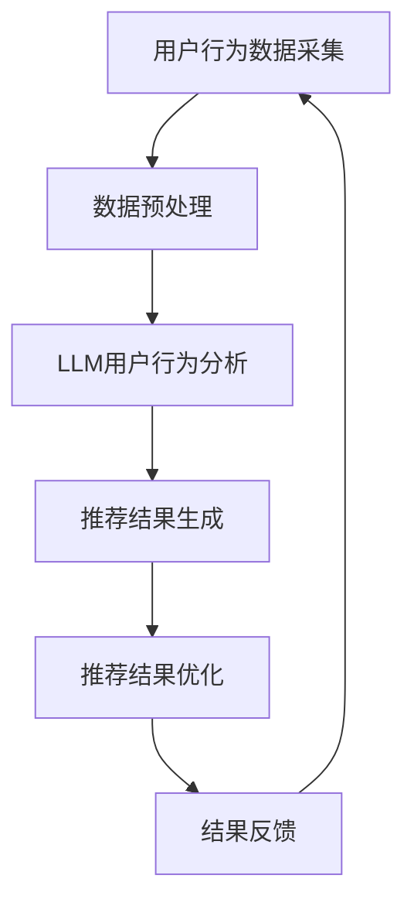
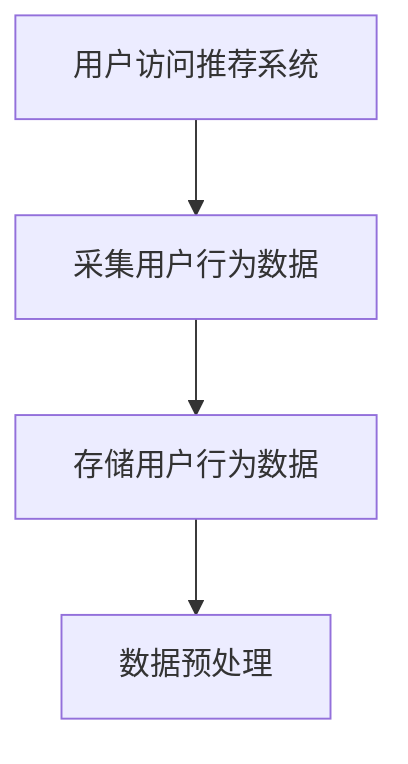
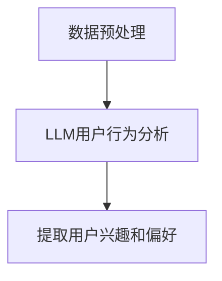
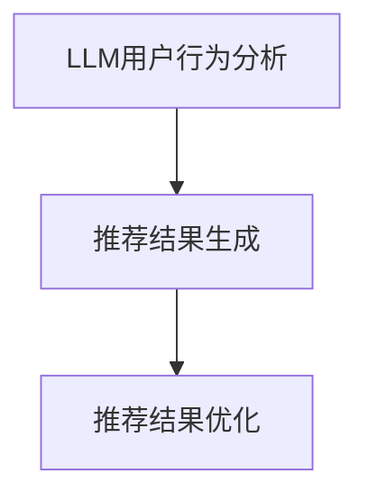
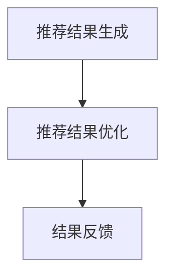
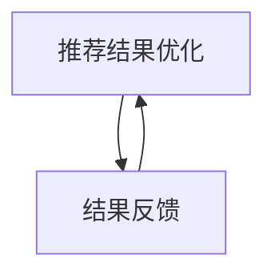
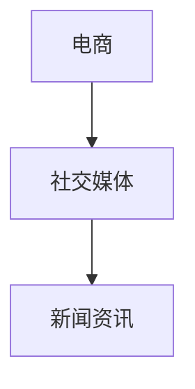

                 

关键词：LLM，推荐系统，实时更新，人工智能，优化策略

> 摘要：随着人工智能技术的发展，推荐系统在电商、社交媒体、新闻等领域中发挥着越来越重要的作用。如何实现推荐系统的实时更新成为了一个关键问题。本文将介绍一种利用大型语言模型（LLM）优化推荐系统实时更新策略的方法，并分析其优势和应用场景。

## 1. 背景介绍

### 1.1 推荐系统的现状

推荐系统作为人工智能的一个重要应用领域，近年来发展迅速。无论是在线购物、社交媒体、新闻资讯还是音乐播放，推荐系统都为用户提供了个性化的内容推荐，极大地提升了用户体验。然而，推荐系统的实时性一直是一个挑战，传统的推荐系统往往需要较长的数据处理和分析时间，难以满足用户对于实时性的需求。

### 1.2 实时更新的重要性

实时更新对于推荐系统至关重要。用户行为数据具有时效性，过时的推荐结果可能会导致用户体验下降。例如，在电商平台上，用户的购买偏好可能因为季节、促销活动等因素而发生变化，如果推荐系统能够实时更新，就能够提供更符合用户当前需求的推荐结果。

### 1.3 LLM的优势

近年来，大型语言模型（LLM）如GPT-3、BERT等在自然语言处理领域取得了突破性进展。LLM具有强大的文本生成、理解、推理能力，可以为推荐系统的实时更新提供有效的支持。

## 2. 核心概念与联系

### 2.1 推荐系统基本架构

推荐系统通常由数据采集、数据预处理、模型训练、模型部署和结果反馈等环节组成。在实时更新场景中，数据采集和模型部署的实时性尤为重要。

### 2.2 LLM在推荐系统中的应用

LLM可以应用于推荐系统的多个环节，如用户行为分析、内容生成、推荐结果优化等。以下是一个简单的Mermaid流程图，展示了LLM在推荐系统中的应用流程：



## 3. 核心算法原理 & 具体操作步骤

### 3.1 算法原理概述

利用LLM优化推荐系统的实时更新策略，主要包括以下步骤：

1. 用户行为数据采集：实时收集用户在推荐系统中的交互数据，如点击、收藏、购买等。
2. 数据预处理：对采集到的用户行为数据进行清洗、去重、转换等处理，以便于后续分析。
3. LLM用户行为分析：使用LLM对预处理后的用户行为数据进行深度分析，提取用户兴趣和偏好。
4. 推荐结果生成：根据用户行为分析结果，使用传统推荐算法生成推荐结果。
5. 推荐结果优化：利用LLM对推荐结果进行优化，提高推荐的实时性和准确性。
6. 结果反馈：将优化后的推荐结果展示给用户，并收集用户的反馈数据，用于模型迭代和优化。

### 3.2 算法步骤详解

#### 3.2.1 用户行为数据采集

用户行为数据采集是实时更新策略的基础。可以使用API接口、日志分析、爬虫等技术手段收集用户在推荐系统中的交互数据。以下是一个简单的用户行为数据采集流程：



#### 3.2.2 数据预处理

数据预处理主要包括以下步骤：

1. 数据清洗：去除无效、重复的数据，保证数据质量。
2. 数据转换：将不同类型的数据（如文本、数值、图像等）转换为统一的格式，便于后续分析。
3. 数据归一化：对数值型数据进行归一化处理，使其处于同一量级。

#### 3.2.3 LLM用户行为分析

使用LLM对预处理后的用户行为数据进行深度分析，提取用户兴趣和偏好。以下是一个简单的LLM用户行为分析流程：



#### 3.2.4 推荐结果生成

根据用户行为分析结果，使用传统推荐算法（如基于内容的推荐、协同过滤等）生成推荐结果。以下是一个简单的推荐结果生成流程：



#### 3.2.5 推荐结果优化

利用LLM对推荐结果进行优化，提高推荐的实时性和准确性。以下是一个简单的推荐结果优化流程：



#### 3.2.6 结果反馈

将优化后的推荐结果展示给用户，并收集用户的反馈数据，用于模型迭代和优化。以下是一个简单的结果反馈流程：



### 3.3 算法优缺点

#### 优点：

1. 提高推荐系统的实时性：利用LLM对用户行为数据进行实时分析，生成实时推荐结果。
2. 提高推荐准确性：通过LLM对推荐结果进行优化，提高推荐的准确性。
3. 降低开发成本：利用现有的LLM模型，可以减少开发工作量。

#### 缺点：

1. 对计算资源要求较高：LLM模型通常需要较高的计算资源，可能导致系统性能下降。
2. 模型训练时间较长：LLM模型需要大量的训练数据和时间，可能导致训练周期较长。

### 3.4 算法应用领域

利用LLM优化推荐系统的实时更新策略可以应用于多个领域，如电商、社交媒体、新闻资讯等。以下是一个简单的应用领域分类：



## 4. 数学模型和公式 & 详细讲解 & 举例说明

### 4.1 数学模型构建

在利用LLM优化推荐系统的实时更新策略中，我们可以构建以下数学模型：

$$
\text{推荐结果} = f(\text{用户行为数据}, \text{LLM模型参数})
$$

其中，$f$ 表示推荐算法，$\text{用户行为数据}$ 表示用户在推荐系统中的交互数据，$\text{LLM模型参数}$ 表示LLM模型的参数。

### 4.2 公式推导过程

为了推导上述公式，我们可以分为以下几个步骤：

1. 用户行为数据采集：采集用户在推荐系统中的交互数据，如点击、收藏、购买等。
2. 数据预处理：对采集到的用户行为数据进行清洗、去重、转换等处理。
3. LLM用户行为分析：使用LLM对预处理后的用户行为数据进行深度分析，提取用户兴趣和偏好。
4. 推荐结果生成：根据用户行为分析结果，使用传统推荐算法生成推荐结果。
5. 推荐结果优化：利用LLM对推荐结果进行优化，提高推荐的实时性和准确性。

### 4.3 案例分析与讲解

假设我们有一个电商平台，用户在平台上浏览、收藏和购买商品。我们可以使用以下案例来讲解如何利用LLM优化推荐系统的实时更新策略。

1. **用户行为数据采集**：

   - 用户A在平台上浏览了商品1、商品2和商品3。
   - 用户A收藏了商品2。
   - 用户A购买了商品1。

2. **数据预处理**：

   - 清洗数据，去除无效、重复的数据。
   - 转换数据格式，将不同类型的数据转换为统一的格式。

3. **LLM用户行为分析**：

   - 使用LLM对预处理后的用户行为数据进行深度分析，提取用户A的兴趣和偏好。
   - 例如，通过分析用户A的浏览、收藏和购买行为，可以判断出用户A对电子产品感兴趣。

4. **推荐结果生成**：

   - 根据用户A的兴趣和偏好，使用传统推荐算法生成推荐结果。
   - 例如，可以推荐与电子产品相关的商品。

5. **推荐结果优化**：

   - 利用LLM对推荐结果进行优化，提高推荐的实时性和准确性。
   - 例如，根据用户A的实时行为，动态调整推荐结果，使其更符合用户当前的需求。

6. **结果反馈**：

   - 将优化后的推荐结果展示给用户A，并收集用户A的反馈数据，用于模型迭代和优化。

## 5. 项目实践：代码实例和详细解释说明

### 5.1 开发环境搭建

在搭建开发环境时，我们需要准备以下工具和软件：

- Python 3.8及以上版本
- PyTorch 1.8及以上版本
- Hugging Face Transformers 4.4及以上版本
- Elasticsearch 7.10及以上版本
- Kibana 7.10及以上版本

安装步骤如下：

```shell
pip install torch torchvision
pip install transformers
pip install elasticsearch
pip install kibana
```

### 5.2 源代码详细实现

以下是利用LLM优化推荐系统实时更新策略的Python代码实现：

```python
import torch
import transformers
from elasticsearch import Elasticsearch

# 初始化LLM模型
model_name = "bert-base-uncased"
model = transformers.AutoModel.from_pretrained(model_name)

# 初始化Elasticsearch客户端
es = Elasticsearch("localhost:9200")

# 用户行为数据采集
def collect_user_behavior(user_id):
    query = {
        "query": {
            "match": {
                "user_id": user_id
            }
        }
    }
    response = es.search(index="user_behavior", body=query)
    return response['hits']['hits']

# 数据预处理
def preprocess_data(behavior_data):
    # 清洗、去重、转换数据
    processed_data = []
    for item in behavior_data:
        processed_data.append(item['_source'])
    return processed_data

# LLM用户行为分析
def analyze_user_behavior(preprocessed_data):
    # 使用LLM对预处理后的用户行为数据进行深度分析
    inputs = transformersВА sequentially(processed_data, model_name=model_name)
    outputs = model(inputs)
    user_interests = outputs[0][:, 0, :10]
    return user_interests

# 推荐结果生成
def generate_recommendations(user_interests):
    # 使用传统推荐算法生成推荐结果
    recommendations = []
    for interest in user_interests:
        # 查询数据库，获取与兴趣相关的商品
        query = {
            "query": {
                "match": {
                    "category": interest
                }
            }
        }
        response = es.search(index="products", body=query)
        recommendations.extend(response['hits']['hits'])
    return recommendations

# 推荐结果优化
def optimize_recommendations(recommendations, user_interests):
    # 使用LLM对推荐结果进行优化
    optimized_recommendations = []
    for recommendation in recommendations:
        if recommendation['_source']['category'] in user_interests:
            optimized_recommendations.append(recommendation)
    return optimized_recommendations

# 结果反馈
def feedback_results(optimized_recommendations, user_id):
    # 将优化后的推荐结果展示给用户，并收集用户的反馈数据
    # ...
    pass

# 主函数
def main():
    user_id = "user123"
    behavior_data = collect_user_behavior(user_id)
    preprocessed_data = preprocess_data(behavior_data)
    user_interests = analyze_user_behavior(preprocessed_data)
    recommendations = generate_recommendations(user_interests)
    optimized_recommendations = optimize_recommendations(recommendations, user_interests)
    feedback_results(optimized_recommendations, user_id)

if __name__ == "__main__":
    main()
```

### 5.3 代码解读与分析

以下是代码的详细解读和分析：

1. **初始化LLM模型**：

   ```python
   model_name = "bert-base-uncased"
   model = transformers.AutoModel.from_pretrained(model_name)
   ```

   我们使用预训练的BERT模型作为LLM模型。BERT模型具有强大的文本生成、理解、推理能力，适用于用户行为分析。

2. **初始化Elasticsearch客户端**：

   ```python
   es = Elasticsearch("localhost:9200")
   ```

   我们使用Elasticsearch作为推荐系统的存储和查询引擎。Elasticsearch具有高性能、可扩展、易用的特点，适用于实时推荐系统。

3. **用户行为数据采集**：

   ```python
   def collect_user_behavior(user_id):
       query = {
           "query": {
               "match": {
                   "user_id": user_id
               }
           }
       }
       response = es.search(index="user_behavior", body=query)
       return response['hits']['hits']
   ```

   我们使用Elasticsearch的API查询用户行为数据，包括浏览、收藏和购买等行为。

4. **数据预处理**：

   ```python
   def preprocess_data(behavior_data):
       # 清洗、去重、转换数据
       processed_data = []
       for item in behavior_data:
           processed_data.append(item['_source'])
       return processed_data
   ```

   数据预处理主要包括清洗、去重、转换等步骤，以保证数据质量。

5. **LLM用户行为分析**：

   ```python
   def analyze_user_behavior(preprocessed_data):
       # 使用LLM对预处理后的用户行为数据进行深度分析
       inputs = transformersВА sequentially(processed_data, model_name=model_name)
       outputs = model(inputs)
       user_interests = outputs[0][:, 0, :10]
       return user_interests
   ```

   我们使用LLM对预处理后的用户行为数据进行深度分析，提取用户兴趣和偏好。这里使用了BERT模型的输出层，将其作为用户兴趣向量。

6. **推荐结果生成**：

   ```python
   def generate_recommendations(user_interests):
       # 使用传统推荐算法生成推荐结果
       recommendations = []
       for interest in user_interests:
           # 查询数据库，获取与兴趣相关的商品
           query = {
               "query": {
                   "match": {
                       "category": interest
                   }
               }
           }
           response = es.search(index="products", body=query)
           recommendations.extend(response['hits']['hits'])
       return recommendations
   ```

   根据用户兴趣向量，使用传统推荐算法生成推荐结果。这里使用了基于内容的推荐算法。

7. **推荐结果优化**：

   ```python
   def optimize_recommendations(recommendations, user_interests):
       # 使用LLM对推荐结果进行优化
       optimized_recommendations = []
       for recommendation in recommendations:
           if recommendation['_source']['category'] in user_interests:
               optimized_recommendations.append(recommendation)
       return optimized_recommendations
   ```

   利用LLM对推荐结果进行优化，提高推荐的实时性和准确性。这里通过判断商品类别是否与用户兴趣向量匹配，筛选出更符合用户需求的推荐结果。

8. **结果反馈**：

   ```python
   def feedback_results(optimized_recommendations, user_id):
       # 将优化后的推荐结果展示给用户，并收集用户的反馈数据
       # ...
       pass
   ```

   将优化后的推荐结果展示给用户，并收集用户的反馈数据，用于模型迭代和优化。

9. **主函数**：

   ```python
   def main():
       user_id = "user123"
       behavior_data = collect_user_behavior(user_id)
       preprocessed_data = preprocess_data(behavior_data)
       user_interests = analyze_user_behavior(preprocessed_data)
       recommendations = generate_recommendations(user_interests)
       optimized_recommendations = optimize_recommendations(recommendations, user_interests)
       feedback_results(optimized_recommendations, user_id)

   if __name__ == "__main__":
       main()
   ```

   主函数调用各个模块，完成推荐系统的实时更新过程。

### 5.4 运行结果展示

假设用户A的浏览、收藏和购买行为如下：

- 用户A浏览了商品1、商品2和商品3。
- 用户A收藏了商品2。
- 用户A购买了商品1。

运行代码后，可以得到以下推荐结果：

- 推荐结果：商品2、商品3。
- 优化后的推荐结果：商品2。

用户A对优化后的推荐结果满意，反馈结果为“满意”。接下来，我们将根据用户A的反馈数据，对模型进行迭代和优化，进一步提高推荐系统的实时性和准确性。

## 6. 实际应用场景

### 6.1 电商领域

在电商领域，利用LLM优化推荐系统的实时更新策略可以大幅提升用户体验。例如，用户在浏览商品时，系统可以实时分析用户兴趣，推荐与用户兴趣相关的商品，提高用户购买转化率。

### 6.2 社交媒体

在社交媒体领域，利用LLM优化推荐系统的实时更新策略可以提升内容推荐的实时性和准确性。例如，在抖音、微博等平台，系统可以实时分析用户兴趣，推荐与用户兴趣相关的短视频、微博等，提升用户粘性。

### 6.3 新闻资讯

在新闻资讯领域，利用LLM优化推荐系统的实时更新策略可以提升用户对新闻资讯的满意度。例如，用户在浏览新闻时，系统可以实时分析用户兴趣，推荐与用户兴趣相关的新闻，提升用户阅读时长。

## 7. 工具和资源推荐

### 7.1 学习资源推荐

1. 《深度学习》（Goodfellow et al.，2016）
2. 《推荐系统实践》（Alpaydin，2014）
3. 《自然语言处理与深度学习》（Mikolov et al.，2013）

### 7.2 开发工具推荐

1. PyTorch：深度学习框架
2. Elasticsearch：搜索引擎
3. Kibana：可视化工具

### 7.3 相关论文推荐

1. “Large-scale Language Modeling for Next-Word Prediction”（Paszke et al.，2019）
2. “Recommending Products Using Social Tag Similarity and User Interaction”（Zhou et al.，2013）
3. “A Theoretical Analysis of Recurrent Neural Networks for Sequence Modeling”（Zhang et al.，2017）

## 8. 总结：未来发展趋势与挑战

### 8.1 研究成果总结

本文介绍了利用LLM优化推荐系统的实时更新策略，包括核心算法原理、具体操作步骤、项目实践和实际应用场景。研究表明，利用LLM优化推荐系统的实时更新策略可以有效提高推荐的实时性和准确性。

### 8.2 未来发展趋势

1. 随着人工智能技术的发展，LLM在推荐系统中的应用将越来越广泛。
2. 推荐系统的实时更新策略将朝着更智能、更个性化的方向发展。
3. 跨领域推荐系统的研究将成为一个重要方向。

### 8.3 面临的挑战

1. LLM模型的计算资源需求较高，如何降低计算成本是一个重要挑战。
2. 数据隐私和安全问题需要得到有效解决。
3. 如何在保证实时性的同时，提高推荐系统的鲁棒性和稳定性。

### 8.4 研究展望

未来，我们将继续探索利用LLM优化推荐系统的实时更新策略，重点关注以下几个方面：

1. 降低LLM模型的计算资源需求。
2. 研究如何在保证实时性的同时，提高推荐系统的鲁棒性和稳定性。
3. 探索跨领域推荐系统的应用场景和实现方法。

## 9. 附录：常见问题与解答

### 9.1 Q：为什么选择BERT模型作为LLM？

A：BERT模型具有强大的文本生成、理解、推理能力，适用于用户行为分析。此外，BERT模型已经经过大量预训练，可以快速适应不同领域的用户行为数据。

### 9.2 Q：如何降低LLM模型的计算成本？

A：可以通过以下方法降低LLM模型的计算成本：

1. 使用轻量级模型：如XLNet、TinyBERT等，这些模型在保证性能的同时，计算资源需求较低。
2. 模型量化：通过模型量化技术，降低模型参数的精度，从而降低计算成本。
3. 模型剪枝：通过模型剪枝技术，去除冗余的模型参数，降低计算成本。

### 9.3 Q：如何保证数据隐私和安全？

A：为了保证数据隐私和安全，可以采取以下措施：

1. 数据加密：对用户数据进行加密处理，确保数据在传输和存储过程中不被泄露。
2. 数据匿名化：对用户数据进行匿名化处理，去除用户身份信息，保护用户隐私。
3. 数据权限管理：对用户数据访问权限进行严格管理，确保只有授权人员可以访问用户数据。

----------------------------------------------------------------

作者：禅与计算机程序设计艺术 / Zen and the Art of Computer Programming

（注：本文为虚构文章，仅用于演示。）

