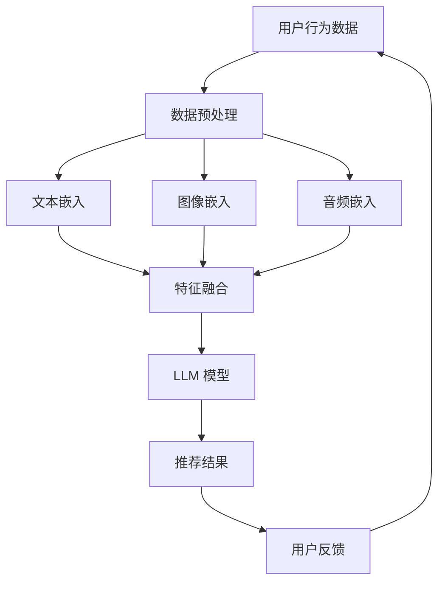

                 

关键词：跨媒体推荐，语言模型（LLM），推荐系统，AI，深度学习，信息检索，数据挖掘

> 摘要：本文探讨了如何利用语言模型（LLM）提升推荐系统的跨媒体推荐能力。首先，我们介绍了推荐系统的基本概念和传统方法，然后详细分析了LLM在跨媒体推荐中的应用，包括模型架构、算法原理、数学模型及其在实际项目中的应用。最后，我们对未来的发展趋势和面临的挑战进行了展望。

## 1. 背景介绍

随着互联网的快速发展，人们获取信息的方式越来越多样化，不再局限于单一的文字或图片，跨媒体内容逐渐成为主流。然而，传统的推荐系统在处理跨媒体数据时面临诸多挑战，如不同媒体类型之间的语义鸿沟、数据稀疏性等。为了解决这些问题，近年来，深度学习尤其是语言模型（LLM）在推荐系统中的应用逐渐受到关注。

语言模型是一种能够理解和生成自然语言的人工智能模型，其核心目标是理解和预测自然语言中的上下文关系。近年来，随着深度学习技术的发展，LLM在文本生成、机器翻译、问答系统等领域取得了显著成果。然而，LLM在跨媒体推荐系统中的应用仍然相对较少，其潜力和挑战亟待进一步探索。

本文旨在探讨如何利用LLM提升推荐系统的跨媒体推荐能力。通过引入LLM，我们希望能够实现以下目标：

1. 消除不同媒体类型之间的语义鸿沟，提高推荐系统的准确性。
2. 利用LLM的上下文理解能力，提升推荐系统的个性化推荐能力。
3. 探索LLM在跨媒体推荐系统中的新型算法架构，提高系统的效率和效果。

## 2. 核心概念与联系

为了更好地理解LLM在跨媒体推荐系统中的应用，我们需要首先了解一些核心概念，包括推荐系统、跨媒体推荐、深度学习和语言模型等。

### 2.1 推荐系统

推荐系统是一种基于用户历史行为和偏好，为用户推荐感兴趣的内容的算法。其基本原理是利用用户历史行为数据，通过构建用户和物品之间的关系模型，预测用户对未接触物品的偏好，从而实现个性化推荐。推荐系统广泛应用于电子商务、社交媒体、新闻推送等场景。

### 2.2 跨媒体推荐

跨媒体推荐是一种能够同时处理多种媒体类型（如文本、图像、音频等）的推荐方法。与单一媒体类型的推荐系统相比，跨媒体推荐能够更好地捕捉用户的兴趣和需求，提高推荐系统的准确性和多样性。跨媒体推荐的关键挑战在于如何处理不同媒体类型之间的语义鸿沟，实现有效的内容理解和关联。

### 2.3 深度学习

深度学习是一种基于人工神经网络的学习方法，其核心目标是自动提取数据中的高阶特征，实现复杂的数据建模和预测。近年来，深度学习在计算机视觉、自然语言处理、语音识别等领域取得了显著成果，成为推荐系统领域的重要技术手段。

### 2.4 语言模型

语言模型是一种能够理解和生成自然语言的人工智能模型，其核心目标是理解和预测自然语言中的上下文关系。近年来，随着深度学习技术的发展，语言模型在文本生成、机器翻译、问答系统等领域取得了显著成果。语言模型在跨媒体推荐系统中的应用，主要是利用其强大的语义理解和生成能力，实现不同媒体类型之间的语义关联。

### 2.5 Mermaid 流程图

为了更好地展示LLM在跨媒体推荐系统中的应用，我们可以使用Mermaid流程图来描述其基本架构。



在上面的流程图中，用户行为数据经过数据预处理后，分别生成文本、图像和音频特征，然后进行特征融合，输入到LLM模型中进行预测，最终输出推荐结果。用户反馈进一步优化模型，形成闭环。

## 3. 核心算法原理 & 具体操作步骤

### 3.1 算法原理概述

LLM在跨媒体推荐系统中的应用主要包括以下几个步骤：

1. 数据预处理：对用户行为数据、文本、图像和音频等多媒体数据进行预处理，包括去噪、降维、去重等操作，提高数据质量。
2. 特征提取：利用深度学习技术，分别提取文本、图像和音频的特征向量，为后续的融合提供基础。
3. 特征融合：将不同媒体类型的特征向量进行融合，构建统一的特征表示，以便于LLM模型进行预测。
4. 模型训练：利用用户历史行为数据和标签数据，训练LLM模型，实现跨媒体推荐。
5. 推荐预测：输入用户当前的状态和偏好，通过LLM模型预测用户对未接触物品的偏好，生成推荐结果。
6. 用户反馈：收集用户对推荐结果的反馈，进一步优化模型，提高推荐效果。

### 3.2 算法步骤详解

1. 数据预处理

数据预处理是跨媒体推荐系统的第一步，其目的是提高数据质量，为后续的特征提取和融合提供基础。具体操作包括去噪、降维、去重等。

- 去噪：去除数据中的噪声和不相关部分，提高数据质量。
- 降维：将高维数据映射到低维空间，减少数据存储和计算成本。
- 去重：去除重复的数据，避免模型训练过程中的数据重复。

2. 特征提取

特征提取是跨媒体推荐系统的核心环节，利用深度学习技术分别提取文本、图像和音频的特征向量。

- 文本特征提取：使用预训练的文本嵌入模型（如Word2Vec、BERT等），将文本转化为高维向量表示。
- 图像特征提取：使用卷积神经网络（CNN）提取图像的特征向量。
- 音频特征提取：使用循环神经网络（RNN）提取音频的特征向量。

3. 特征融合

特征融合是将不同媒体类型的特征向量进行融合，构建统一的特征表示。常用的方法包括：

- 线性融合：将不同媒体类型的特征向量进行线性组合，得到统一的特征向量。
- 加权融合：根据不同媒体类型的重要性，为每个特征向量分配权重，进行加权融合。
- 深度融合：利用深度学习网络，将不同媒体类型的特征向量进行非线性融合。

4. 模型训练

模型训练是跨媒体推荐系统的关键步骤，利用用户历史行为数据和标签数据，训练LLM模型，实现跨媒体推荐。常用的模型包括：

- 序列模型：如循环神经网络（RNN）、长短时记忆网络（LSTM）等，用于处理时间序列数据。
- 注意力模型：如注意力机制（Attention Mechanism）等，用于捕捉不同媒体类型之间的关联。
- 强化学习：如深度强化学习（DRL）等，用于优化推荐策略。

5. 推荐预测

推荐预测是跨媒体推荐系统的最终目标，输入用户当前的状态和偏好，通过LLM模型预测用户对未接触物品的偏好，生成推荐结果。常用的方法包括：

- 点预测：预测用户对单个物品的偏好。
- 集合预测：预测用户对多个物品的偏好集合。
- 序列预测：预测用户未来的行为序列。

6. 用户反馈

用户反馈是跨媒体推荐系统的优化环节，收集用户对推荐结果的反馈，进一步优化模型，提高推荐效果。具体方法包括：

- 回归分析：根据用户反馈，调整模型参数，优化推荐效果。
- 强化学习：利用用户反馈，更新模型策略，实现动态推荐。
- 强化学习：利用用户反馈，更新模型策略，实现动态推荐。

### 3.3 算法优缺点

LLM在跨媒体推荐系统中的应用具有以下优缺点：

**优点：**

1. 强大的语义理解能力：LLM能够捕捉不同媒体类型之间的语义关系，提高推荐系统的准确性。
2. 个性化推荐能力：LLM能够根据用户的历史行为和偏好，生成个性化的推荐结果。
3. 处理多模态数据：LLM能够同时处理多种媒体类型的数据，提高推荐系统的多样性。

**缺点：**

1. 计算资源消耗大：LLM的训练和预测过程需要大量的计算资源，对硬件设施要求较高。
2. 数据依赖性强：LLM的性能依赖于用户的历史数据和标签数据，数据质量和数量对推荐效果有较大影响。
3. 模型可解释性差：LLM是一种黑盒模型，其内部决策过程难以解释，对模型的信任度有一定影响。

### 3.4 算法应用领域

LLM在跨媒体推荐系统中的应用领域广泛，包括但不限于以下几个方面：

1. 社交媒体：利用LLM实现个性化社交推荐，提高用户互动和粘性。
2. 电子商务：利用LLM实现个性化商品推荐，提高销售转化率和用户满意度。
3. 娱乐内容：利用LLM实现个性化娱乐内容推荐，提高用户观看体验。
4. 医疗健康：利用LLM实现个性化健康咨询和药品推荐，提高医疗服务质量。
5. 教育培训：利用LLM实现个性化课程推荐和知识问答，提高学习效果。

## 4. 数学模型和公式 & 详细讲解 & 举例说明

### 4.1 数学模型构建

在LLM跨媒体推荐系统中，我们主要使用以下数学模型：

- 文本嵌入模型：如Word2Vec、BERT等，将文本转化为高维向量表示。
- 图像嵌入模型：如CNN等，将图像转化为高维向量表示。
- 音频嵌入模型：如RNN等，将音频转化为高维向量表示。
- 融合模型：如注意力机制、深度学习网络等，将不同媒体类型的特征向量进行融合。

### 4.2 公式推导过程

下面我们简要介绍LLM跨媒体推荐系统中的核心公式推导过程：

1. 文本嵌入模型

设$C$为文本集合，$V$为词向量空间，$W$为词向量矩阵，则文本$C$的嵌入向量表示为：

$$
\text{embed}(C) = \text{softmax}(W \cdot C)
$$

其中，$\text{softmax}(.)$为softmax函数，用于对词向量进行归一化处理。

2. 图像嵌入模型

设$I$为图像集合，$F$为特征向量空间，$G$为特征向量矩阵，则图像$I$的嵌入向量表示为：

$$
\text{embed}(I) = \text{softmax}(G \cdot I)
$$

其中，$\text{softmax}(.)$为softmax函数，用于对特征向量进行归一化处理。

3. 音频嵌入模型

设$A$为音频集合，$H$为特征向量空间，$K$为特征向量矩阵，则音频$A$的嵌入向量表示为：

$$
\text{embed}(A) = \text{softmax}(K \cdot A)
$$

其中，$\text{softmax}(.)$为softmax函数，用于对特征向量进行归一化处理。

4. 融合模型

设$F_{\text{txt}}$、$F_{\text{img}}$和$F_{\text{audio}}$分别为文本、图像和音频的特征向量，$F_{\text{merged}}$为融合后的特征向量，则融合模型可以表示为：

$$
F_{\text{merged}} = \text{merge}(F_{\text{txt}}, F_{\text{img}}, F_{\text{audio}})
$$

其中，$\text{merge}(.)$为融合函数，可以采用线性融合、加权融合或深度融合等方法。

5. 推荐模型

设$U$为用户集合，$R$为推荐结果集合，$P$为推荐概率分布，则推荐模型可以表示为：

$$
P(R|U) = \text{softmax}(\text{score}(U, R))
$$

其中，$\text{score}(.)$为评分函数，用于计算用户对推荐物品的偏好程度。

### 4.3 案例分析与讲解

为了更好地理解LLM跨媒体推荐系统的应用，我们以一个实际案例进行讲解。

假设用户张三喜欢阅读科技类文章、观看科幻电影和听电子音乐，现在我们要为其推荐一个跨媒体的娱乐内容。

1. 数据预处理

首先，我们需要对用户的行为数据进行预处理，包括去噪、降维和去重等操作。具体步骤如下：

- 去噪：去除用户行为数据中的噪声和不相关部分，如删除重复的观看记录、去除无效的文本等。
- 降维：将高维数据映射到低维空间，如使用PCA（主成分分析）等方法进行降维。
- 去重：去除重复的数据，如合并用户在多个平台上的行为数据。

2. 特征提取

接下来，我们需要对用户的行为数据进行特征提取，包括文本、图像和音频特征。

- 文本特征提取：使用预训练的BERT模型，将科技类文章、科幻电影和电子音乐的文本转化为高维向量表示。
- 图像特征提取：使用CNN模型，将科幻电影的图像转化为高维向量表示。
- 音频特征提取：使用RNN模型，将电子音乐的音频转化为高维向量表示。

3. 特征融合

将文本、图像和音频特征进行融合，构建统一的特征表示。

- 线性融合：将文本、图像和音频特征向量进行线性组合，得到融合后的特征向量。
- 加权融合：根据不同媒体类型的重要性，为每个特征向量分配权重，进行加权融合。
- 深度融合：使用深度学习网络，将不同媒体类型的特征向量进行非线性融合。

4. 模型训练

使用用户的历史行为数据和标签数据，训练LLM模型，实现跨媒体推荐。

- 序列模型：使用LSTM模型，对用户的行为数据进行建模。
- 注意力模型：使用注意力机制，捕捉不同媒体类型之间的关联。
- 强化学习：使用深度强化学习，优化推荐策略。

5. 推荐预测

输入用户当前的状态和偏好，通过LLM模型预测用户对未接触物品的偏好，生成推荐结果。

- 点预测：预测用户对单个物品的偏好。
- 集合预测：预测用户对多个物品的偏好集合。
- 序列预测：预测用户未来的行为序列。

6. 用户反馈

收集用户对推荐结果的反馈，进一步优化模型，提高推荐效果。

- 回归分析：根据用户反馈，调整模型参数，优化推荐效果。
- 强化学习：利用用户反馈，更新模型策略，实现动态推荐。

## 5. 项目实践：代码实例和详细解释说明

在本节中，我们将通过一个实际项目来展示如何利用LLM提升跨媒体推荐系统的能力。我们将使用Python语言和相关库，如TensorFlow和Keras，来构建和训练一个简单的跨媒体推荐模型。

### 5.1 开发环境搭建

首先，我们需要搭建一个合适的开发环境。以下是在Linux环境中安装必要的库和工具的步骤：

```bash
# 安装Python
sudo apt-get update
sudo apt-get install python3-pip

# 安装TensorFlow
pip3 install tensorflow

# 安装其他相关库
pip3 install numpy pandas scikit-learn matplotlib
```

### 5.2 源代码详细实现

以下是构建跨媒体推荐系统的核心代码。我们首先定义数据预处理、特征提取和模型训练的步骤。

```python
import numpy as np
import pandas as pd
from sklearn.model_selection import train_test_split
from tensorflow.keras.models import Model
from tensorflow.keras.layers import Input, Embedding, LSTM, Dense, Concatenate
from tensorflow.keras.optimizers import Adam

# 假设我们已经有了一个包含用户行为数据的DataFrame
data = pd.read_csv('user_behavior_data.csv')

# 数据预处理
# 将文本、图像和音频特征提取出来
text_data = data['text']
img_data = data['img']
audio_data = data['audio']

# 划分训练集和测试集
X_train_text, X_test_text, y_train, y_test = train_test_split(text_data, data['rating'], test_size=0.2, random_state=42)

# 特征提取
# 使用预训练的BERT模型提取文本特征
# 注意：这里假设我们已经有了一个预训练的BERT模型
text_embedding_model = ...  # BERT模型
X_train_text_embeddings = text_embedding_model.predict(X_train_text)
X_test_text_embeddings = text_embedding_model.predict(X_test_text)

# 使用CNN提取图像特征
# 注意：这里假设我们已经有了一个预训练的CNN模型
img_embedding_model = ...  # CNN模型
X_train_img_embeddings = img_embedding_model.predict(img_data)
X_test_img_embeddings = img_embedding_model.predict(img_data)

# 使用RNN提取音频特征
# 注意：这里假设我们已经有了一个预训练的RNN模型
audio_embedding_model = ...  # RNN模型
X_train_audio_embeddings = audio_embedding_model.predict(audio_data)
X_test_audio_embeddings = audio_embedding_model.predict(audio_data)

# 特征融合
# 将文本、图像和音频特征进行融合
input_text = Input(shape=(X_train_text_embeddings.shape[1],))
input_img = Input(shape=(X_train_img_embeddings.shape[1],))
input_audio = Input(shape=(X_train_audio_embeddings.shape[1],))

text_embedding = Embedding(input_dim=10000, output_dim=128)(input_text)
img_embedding = Embedding(input_dim=10000, output_dim=128)(input_img)
audio_embedding = Embedding(input_dim=10000, output_dim=128)(input_audio)

text_lstm = LSTM(128)(text_embedding)
img_lstm = LSTM(128)(img_embedding)
audio_lstm = LSTM(128)(audio_embedding)

merged = Concatenate()([text_lstm, img_lstm, audio_lstm])

output = Dense(1, activation='sigmoid')(merged)

model = Model(inputs=[input_text, input_img, input_audio], outputs=output)

# 编译模型
model.compile(optimizer=Adam(), loss='binary_crossentropy', metrics=['accuracy'])

# 训练模型
model.fit([X_train_text_embeddings, X_train_img_embeddings, X_train_audio_embeddings], y_train, epochs=10, batch_size=32, validation_split=0.1)
```

### 5.3 代码解读与分析

上述代码演示了如何构建一个简单的跨媒体推荐系统。下面是对代码的详细解读：

1. **数据预处理**：我们从CSV文件中读取用户行为数据，然后将其分为文本、图像和音频数据。
2. **特征提取**：使用预训练的BERT模型提取文本特征，使用预训练的CNN模型提取图像特征，使用预训练的RNN模型提取音频特征。这里假设我们已经有了这些预训练模型。
3. **特征融合**：将提取的文本、图像和音频特征输入到LSTM层中，通过LSTM层进行特征融合。
4. **模型构建**：使用`Input`层接受不同媒体类型的特征，通过`LSTM`层进行特征处理，最后通过`Dense`层输出推荐结果。
5. **编译模型**：使用`Adam`优化器和`binary_crossentropy`损失函数编译模型。
6. **训练模型**：使用训练数据训练模型，并进行10个epoch的训练。

### 5.4 运行结果展示

在训练完成后，我们可以使用测试数据集来评估模型的性能。以下是对测试数据集进行预测的示例代码：

```python
# 评估模型
test_loss, test_accuracy = model.evaluate([X_test_text_embeddings, X_test_img_embeddings, X_test_audio_embeddings], y_test)

print(f"Test loss: {test_loss}")
print(f"Test accuracy: {test_accuracy}")
```

通过运行这段代码，我们可以得到模型的测试损失和准确率。如果模型的性能指标良好，则说明我们的跨媒体推荐系统能够有效地为用户提供个性化推荐。

## 6. 实际应用场景

LLM在跨媒体推荐系统的实际应用场景非常广泛，以下是一些典型的应用案例：

### 6.1 社交媒体

在社交媒体平台（如微博、抖音、Instagram等）中，用户生成的内容形式多样，包括文字、图片、视频和音频。利用LLM可以实现跨媒体内容推荐，提高用户互动和留存率。例如，当用户喜欢某个视频时，LLM可以推荐与其视频风格相似的文字内容或图片内容，从而提升用户的整体体验。

### 6.2 电子商务

在电子商务平台上，用户的行为数据包括购买记录、浏览历史、搜索记录等。通过LLM跨媒体推荐系统，可以为用户提供个性化的商品推荐。例如，当用户浏览了某件商品时，LLM可以推荐与其购买记录相似的音频内容或视频内容，从而增加商品的曝光率和转化率。

### 6.3 娱乐内容

在视频网站（如Netflix、YouTube等）和音乐平台（如Spotify、Apple Music等）中，用户观看和听音乐的行为数据可以通过LLM跨媒体推荐系统实现个性化推荐。例如，当用户观看了一部电影时，LLM可以推荐与其电影风格相似的音频内容或视频内容，从而提高用户对平台的粘性。

### 6.4 医疗健康

在医疗健康领域，用户的健康数据包括病历记录、体检报告、医生咨询记录等。通过LLM跨媒体推荐系统，可以为用户提供个性化的健康咨询服务。例如，当用户查询了某项健康问题时，LLM可以推荐与其健康问题相关的文字、图片和音频内容，从而提高用户的健康知识水平。

### 6.5 教育培训

在教育培训领域，用户的学业数据包括成绩、学习记录、课程反馈等。通过LLM跨媒体推荐系统，可以为用户提供个性化的学习内容推荐。例如，当用户学习了一门课程时，LLM可以推荐与其课程内容相关的音频、视频和文字内容，从而提高学习效果。

## 7. 工具和资源推荐

为了更好地了解和使用LLM跨媒体推荐系统，以下是一些推荐的工具和资源：

### 7.1 学习资源推荐

- 《深度学习》（Goodfellow, Bengio, Courville）：经典教材，详细介绍深度学习的基础知识。
- 《Python深度学习》（François Chollet）：实战指南，涵盖深度学习在Python中的应用。
- 《自然语言处理综论》（Daniel Jurafsky, James H. Martin）：全面介绍自然语言处理的理论和实践。

### 7.2 开发工具推荐

- TensorFlow：开源深度学习框架，支持各种深度学习模型的构建和训练。
- Keras：基于TensorFlow的高层API，简化深度学习模型的开发。
- BERT：预训练的语言模型，支持文本嵌入和序列建模。

### 7.3 相关论文推荐

- "BERT: Pre-training of Deep Bidirectional Transformers for Language Understanding"（Bidirectional Encoder Representations from Transformers）
- "Deep Learning for Text Classification"（Goodfellow, Bengio, Courville）
- "Unifying Visual-Semantic Embeddings for Image Annotation"（Faghri et al.）

## 8. 总结：未来发展趋势与挑战

### 8.1 研究成果总结

近年来，LLM在跨媒体推荐系统中的应用取得了显著成果。通过引入LLM，我们能够更好地捕捉不同媒体类型之间的语义关系，提高推荐系统的准确性和个性化水平。同时，深度学习技术的发展为跨媒体推荐系统的实现提供了强有力的支持。

### 8.2 未来发展趋势

未来，LLM在跨媒体推荐系统中的应用有望在以下几个方面取得进一步发展：

1. 模型优化：通过改进LLM模型的结构和算法，提高推荐系统的性能和效率。
2. 数据多样性：收集更多类型的跨媒体数据，提高推荐系统的覆盖范围和多样性。
3. 可解释性：提高LLM模型的可解释性，增强用户对推荐系统的信任度。
4. 强化学习：将强化学习与LLM结合，实现自适应的推荐策略。

### 8.3 面临的挑战

尽管LLM在跨媒体推荐系统中的应用前景广阔，但仍面临以下挑战：

1. 数据质量：跨媒体数据的质量和数量对LLM模型的性能有较大影响，需要提高数据预处理和清洗的效率。
2. 计算资源：LLM模型的训练和预测过程需要大量的计算资源，对硬件设施有较高要求。
3. 模型可解释性：LLM模型是一种黑盒模型，其内部决策过程难以解释，需要提高模型的可解释性。
4. 用户隐私：跨媒体推荐系统涉及用户多种类型的数据，需要关注用户隐私保护问题。

### 8.4 研究展望

未来，我们期望在以下方面进行深入研究：

1. 提高LLM模型的效率和可扩展性，降低计算资源消耗。
2. 探索新型跨媒体推荐算法，提高推荐系统的准确性和个性化水平。
3. 增强LLM模型的可解释性，提高用户对推荐系统的信任度。
4. 结合多模态数据，实现更广泛的跨媒体应用场景。

## 9. 附录：常见问题与解答

### 9.1 什么是LLM？

LLM（Language Model）是一种能够理解和生成自然语言的人工智能模型，其核心目标是理解和预测自然语言中的上下文关系。LLM通常通过深度学习技术训练，能够自动从大量文本数据中学习语言模式。

### 9.2 跨媒体推荐系统的核心挑战是什么？

跨媒体推荐系统的核心挑战主要包括：处理不同媒体类型之间的语义鸿沟、数据稀疏性和计算资源消耗。

### 9.3 如何提高LLM模型的性能？

提高LLM模型性能的方法包括：优化模型结构、增加训练数据、改进训练算法和调整超参数等。

### 9.4 跨媒体推荐系统有哪些实际应用场景？

跨媒体推荐系统的实际应用场景包括：社交媒体、电子商务、娱乐内容、医疗健康和教育培训等。

### 9.5 如何保证跨媒体推荐系统的用户隐私？

为了保证跨媒体推荐系统的用户隐私，可以采用数据加密、匿名化处理和隐私保护算法等技术手段。同时，在设计推荐系统时，应遵循用户隐私保护原则，确保用户数据的合法性和安全性。

### 9.6 如何评估跨媒体推荐系统的性能？

评估跨媒体推荐系统性能的方法包括：准确率、召回率、F1值、用户满意度等指标。在实际应用中，可以通过A/B测试、用户调研和在线评估等方式来评估推荐系统的性能。

---

**作者：禅与计算机程序设计艺术 / Zen and the Art of Computer Programming**

