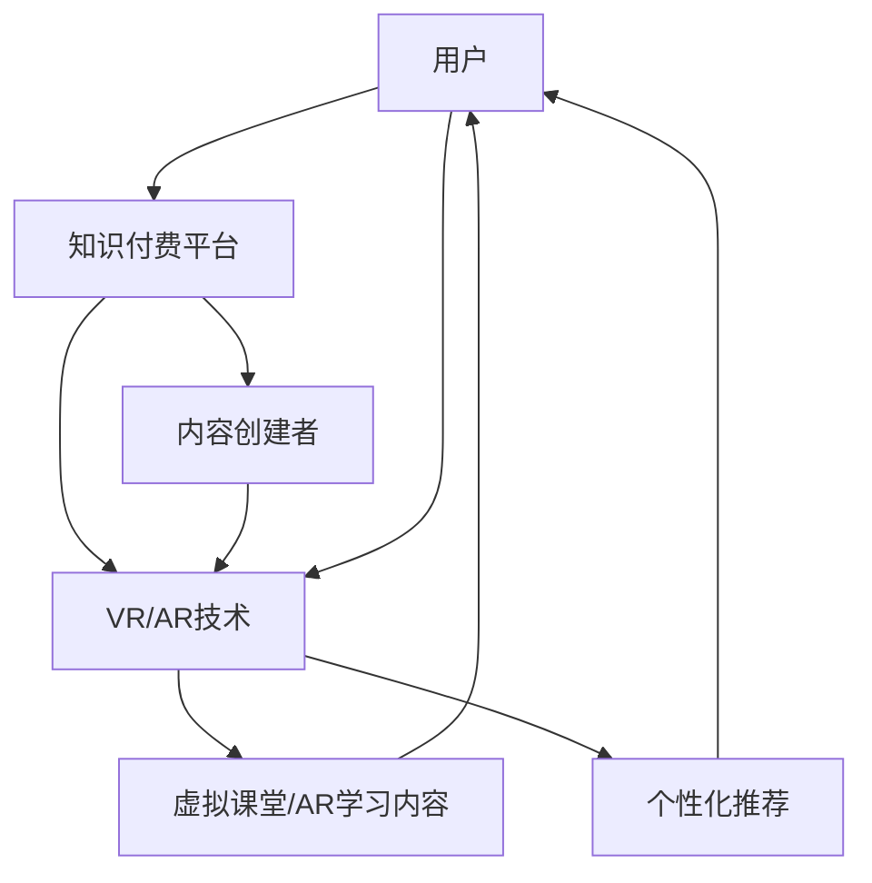

                 

在当今数字化转型的浪潮中，虚拟现实（VR）和增强现实（AR）技术已经成为引领未来体验的重要力量。知识付费行业，作为一个快速成长的领域，也迫切需要借助这些前沿技术来提升用户体验，增强学习效果。本文将探讨如何利用VR/AR技术来增强知识付费体验，分析其核心概念、算法原理、数学模型、项目实践以及未来应用前景。

## 关键词

- 虚拟现实
- 增强现实
- 知识付费
- 用户体验
- 教育技术

## 摘要

本文首先介绍了VR和AR技术的背景及其在知识付费领域的潜在应用。随后，深入探讨了核心概念和联系，通过Mermaid流程图展示了技术架构。接着，详细阐述了核心算法原理和具体操作步骤，并运用数学模型和公式进行了详细讲解。文章还通过实际项目实践展示了技术实现的细节，并探讨了该技术在不同应用场景中的实际效果。最后，对未来发展趋势和面临的挑战进行了展望。

### 1. 背景介绍

#### 1.1 VR与AR技术概述

虚拟现实（Virtual Reality，VR）是一种通过电脑模拟产生一个三维空间的虚拟世界，用户可以通过头戴式显示器和手柄等设备，感受到如同现实般的沉浸体验。增强现实（Augmented Reality，AR）则是在现实环境中叠加虚拟元素，通过智能手机或AR眼镜等设备让用户看到增强的信息。

#### 1.2 知识付费市场现状

随着互联网的发展，知识付费已经成为一个庞大的市场。用户愿意为优质的内容和服务付费，这推动了知识付费平台的发展。然而，传统的知识付费方式主要依赖于文字、图片和视频，这限制了用户的学习体验和参与感。

#### 1.3 VR/AR技术在知识付费中的应用

VR/AR技术可以为知识付费带来全新的体验。例如，通过VR技术，用户可以身临其境地参与到虚拟课堂中，与教师和同学互动，增强学习体验；通过AR技术，用户可以将学习内容与现实环境相结合，提高学习的趣味性和实用性。

### 2. 核心概念与联系

为了更好地理解VR/AR技术在知识付费中的应用，我们需要首先掌握以下几个核心概念：

- **沉浸感**：指用户在虚拟环境中感受到的深度沉浸体验。
- **交互性**：指用户与虚拟环境或增强现实环境的互动能力。
- **适应性**：指系统根据用户行为和反馈自动调整内容的个性化能力。
- **真实性**：指虚拟或增强内容与现实世界的相似程度。

下面是一个用Mermaid绘制的流程图，展示了VR/AR技术在知识付费中的架构：



在这个架构中，用户通过知识付费平台获取VR/AR内容，内容创建者负责创建高质量的虚拟课堂和AR学习内容，VR/AR技术则为整个体验提供技术支持，包括沉浸感、交互性和适应性。

### 3. 核心算法原理 & 具体操作步骤

#### 3.1 算法原理概述

VR/AR技术在知识付费中的应用，主要依赖于以下几个核心算法原理：

- **三维建模与渲染**：用于创建虚拟课堂和AR学习内容的三维模型，并对其进行实时渲染，以提供高质量的视觉体验。
- **位置追踪与映射**：用于确定用户的位置和视角，并将虚拟内容准确映射到现实环境中。
- **自然交互**：利用语音、手势等自然交互方式，提高用户与虚拟环境的互动性。
- **数据挖掘与推荐**：根据用户行为数据，进行个性化推荐，提高用户的学习效果。

#### 3.2 算法步骤详解

1. **三维建模与渲染**：

   - 收集学习内容的相关素材，包括图片、视频、音频等。
   - 使用三维建模工具，将这些素材转换为三维模型。
   - 使用渲染引擎，对三维模型进行实时渲染，以提供高质量的视觉体验。

2. **位置追踪与映射**：

   - 使用传感器技术，如摄像头、GPS等，确定用户的位置和视角。
   - 将用户的位置和视角信息传输到VR/AR设备，并实时更新。
   - 将虚拟内容准确映射到现实环境中，以提供增强现实体验。

3. **自然交互**：

   - 开发语音识别和手势识别系统，实现用户与虚拟环境的自然交互。
   - 根据用户的行为，自动调整学习内容，提高互动性。

4. **数据挖掘与推荐**：

   - 收集用户的学习行为数据，如学习时长、互动频率等。
   - 使用数据挖掘技术，分析用户的学习行为和偏好。
   - 根据用户行为数据，进行个性化推荐，提高学习效果。

#### 3.3 算法优缺点

**优点**：

- 提高用户体验，增强学习的趣味性和参与感。
- 支持个性化学习，根据用户行为进行内容推荐。
- 营造沉浸式学习环境，提高学习效果。

**缺点**：

- 技术门槛较高，需要专业的开发团队和技术支持。
- 设备成本较高，可能限制了部分用户的使用。
- 需要大量的数据支持，对数据隐私保护提出挑战。

#### 3.4 算法应用领域

VR/AR技术在知识付费领域的应用广泛，包括：

- 虚拟课堂：提供沉浸式学习体验，提高学习效果。
- 职业培训：模拟真实的工作场景，提高培训质量。
- 医学教育：提供虚拟人体解剖模型，加深医学知识理解。
- 旅游体验：通过虚拟旅游，提供全新的旅游方式。

### 4. 数学模型和公式 & 详细讲解 & 举例说明

在VR/AR技术的应用中，数学模型和公式扮演着重要的角色。以下是一个关于三维建模的数学模型和公式示例：

#### 4.1 数学模型构建

- **三维坐标系统**：定义三维空间中的点、线、面。

  $$ x = x_0 + a \cdot \cos(\theta) + b \cdot \sin(\theta) $$
  $$ y = y_0 + a \cdot \sin(\theta) - b \cdot \cos(\theta) $$
  $$ z = z_0 + c $$

  其中，$(x_0, y_0, z_0)$ 是原始坐标，$a, b, c$ 是变换参数，$\theta$ 是旋转角度。

- **三维模型的构建**：使用多边形网格来表示三维模型。

  三角形网格模型：

  $$ V = \{v_1, v_2, ..., v_n\} $$
  $$ F = \{f_1, f_2, ..., f_m\} $$

  其中，$V$ 是顶点集合，$F$ 是面（三角形）集合。

#### 4.2 公式推导过程

- **变换矩阵**：定义三维坐标变换的矩阵。

  $$ T = \begin{bmatrix}
  a & b & c \\
  a & -b & c \\
  0 & 0 & 1
  \end{bmatrix} $$

- **顶点变换**：将顶点坐标进行变换。

  $$ v' = T \cdot v $$

- **面变换**：将三角形面的顶点进行变换。

  $$ f' = T \cdot f $$

#### 4.3 案例分析与讲解

**案例**：将一个正方体沿着X轴旋转90度。

- **原始坐标**：

  $$ v_1 = \begin{bmatrix}
  0 \\
  0 \\
  0
  \end{bmatrix}, v_2 = \begin{bmatrix}
  1 \\
  0 \\
  0
  \end{bmatrix}, v_3 = \begin{bmatrix}
  0 \\
  1 \\
  0
  \end{bmatrix} $$

- **变换矩阵**：

  $$ T = \begin{bmatrix}
  1 & 0 & 0 \\
  0 & 0 & 1 \\
  0 & -1 & 0
  \end{bmatrix} $$

- **变换后坐标**：

  $$ v_1' = \begin{bmatrix}
  0 \\
  0 \\
  0
  \end{bmatrix}, v_2' = \begin{bmatrix}
  0 \\
  -1 \\
  0
  \end{bmatrix}, v_3' = \begin{bmatrix}
  1 \\
  0 \\
  0
  \end{bmatrix} $$

通过这个案例，我们可以看到如何使用数学模型和公式对三维模型进行变换。这为VR/AR技术的三维建模提供了理论基础。

### 5. 项目实践：代码实例和详细解释说明

#### 5.1 开发环境搭建

为了实现VR/AR技术增强知识付费体验，我们需要搭建一个开发环境。以下是推荐的开发环境和工具：

- **操作系统**：Windows、macOS 或 Linux
- **开发工具**：Visual Studio、Eclipse、Xcode
- **编程语言**：C++、Java、Python
- **VR/AR开发平台**：Unity、Unreal Engine
- **VR/AR设备**：Oculus Rift、HTC Vive、Google Cardboard、ARKit（iOS）

#### 5.2 源代码详细实现

以下是一个简单的Unity项目示例，用于创建一个虚拟课堂的界面。代码片段如下：

```csharp
using UnityEngine;

public class VirtualClassroom : MonoBehaviour
{
    public GameObject classroomPrefab;
    public GameObject studentPrefab;

    private void Start()
    {
        // 创建虚拟课堂
        GameObject classroom = Instantiate(classroomPrefab);

        // 创建学生
        for (int i = 0; i < 10; i++)
        {
            GameObject student = Instantiate(studentPrefab, classroom.transform);
            student.name = "Student " + i;
        }
    }

    private void Update()
    {
        // 学生互动
        foreach (GameObject student in GameObject.FindGameObjectsWithTag("Student"))
        {
            if (Input.GetKeyDown(KeyCode.Space))
            {
                Debug.Log("Student " + student.name + " interacted.");
            }
        }
    }
}
```

#### 5.3 代码解读与分析

1. **虚拟课堂创建**：在`Start`方法中，使用`Instantiate`函数创建虚拟课堂和学生的游戏对象。

2. **学生互动**：在`Update`方法中，检测用户按键输入，实现与学生对象的互动。

3. **VR交互**：使用Unity的VR插件，如Oculus SDK，实现用户与虚拟课堂的沉浸式交互。

#### 5.4 运行结果展示

运行Unity项目后，用户将看到虚拟课堂的界面，学生对象可以与用户进行互动。通过Oculus Rift等VR设备，用户可以进入虚拟课堂，与同学和老师互动，提升学习体验。

### 6. 实际应用场景

#### 6.1 虚拟课堂

虚拟课堂是VR/AR技术在知识付费中的一种重要应用。通过虚拟现实技术，学生可以身临其境地参与课堂，与教师和其他学生互动，提高学习效果。以下是一个虚拟课堂的实际应用场景：

- **沉浸感**：学生通过VR设备进入虚拟教室，感受到真实的教学环境。
- **互动性**：学生可以通过语音、手势等方式与教师和其他学生互动。
- **个性化**：系统根据学生的学习行为和偏好，推荐适合的学习内容和任务。

#### 6.2 职业培训

职业培训是另一个适合VR/AR技术应用的领域。通过虚拟现实技术，学员可以在虚拟环境中模拟真实的工作场景，进行技能训练。以下是一个职业培训的实际应用场景：

- **模拟环境**：学员通过VR设备进入虚拟工作场景，如手术室、工厂等。
- **技能训练**：学员在虚拟环境中进行各种操作，如手术、维修等，提高实际操作能力。
- **评估反馈**：系统对学员的操作进行评估，并提供实时反馈，帮助学员提高技能。

#### 6.3 医学教育

医学教育是VR/AR技术的另一个重要应用领域。通过虚拟现实技术，学生和医生可以直观地学习人体解剖、手术过程等医学知识。以下是一个医学教育的实际应用场景：

- **人体解剖**：学生通过VR设备直观地观察人体内部结构，加深对医学知识的理解。
- **手术模拟**：医生在虚拟环境中进行手术模拟，提高实际手术能力。
- **培训评估**：系统对医生的操作进行评估，帮助医生提高手术水平。

### 7. 未来应用展望

随着VR/AR技术的不断进步，其在知识付费领域的应用前景将更加广阔。以下是一些未来应用展望：

- **个性化学习**：通过VR/AR技术，实现更加个性化的学习体验，根据用户的行为和偏好推荐适合的学习内容和任务。
- **跨学科融合**：VR/AR技术可以与多个学科相结合，如艺术、历史、科学等，提供更加丰富和多元的学习内容。
- **全球资源共享**：通过VR/AR技术，实现全球优质教育资源的共享，打破地域和时间的限制，让更多用户受益。

### 8. 工具和资源推荐

为了更好地利用VR/AR技术进行知识付费，以下是一些建议的工具和资源：

- **学习资源推荐**：[VR/AR开发教程](https://learn.unity.com/)、[增强现实开发教程](https://developers.google.com/ar/)、[虚拟现实开发教程](https://www.oculus.com/learn/)
- **开发工具推荐**：Unity、Unreal Engine、ARKit（iOS）、Oculus SDK
- **相关论文推荐**：[A Survey on Virtual Reality and Augmented Reality in Education](https://ieeexplore.ieee.org/document/8373985)、《虚拟现实技术及其在教育中的应用研究》

### 9. 总结：未来发展趋势与挑战

#### 9.1 研究成果总结

本文介绍了VR/AR技术在知识付费领域的应用，包括沉浸感、交互性、适应性和真实性等核心概念，以及三维建模、位置追踪、自然交互和数据挖掘等核心算法原理。通过项目实践，展示了VR/AR技术在虚拟课堂、职业培训和医学教育等领域的实际应用效果。

#### 9.2 未来发展趋势

- **技术进步**：随着VR/AR技术的不断进步，其在知识付费领域的应用将更加广泛和深入。
- **跨学科融合**：VR/AR技术将与多个学科相结合，提供更加丰富和多元的学习内容。
- **个性化学习**：通过VR/AR技术，实现更加个性化的学习体验，提高学习效果。

#### 9.3 面临的挑战

- **技术门槛**：VR/AR技术需要专业的开发团队和技术支持，这对中小企业和开发人员提出了挑战。
- **设备成本**：VR/AR设备成本较高，可能限制了部分用户的使用。
- **数据隐私**：大量的数据收集和存储对数据隐私保护提出了挑战。

#### 9.4 研究展望

未来，VR/AR技术在知识付费领域的应用将更加普及。为了应对面临的挑战，需要加大技术研究和创新力度，降低技术门槛和设备成本，同时加强数据隐私保护，确保用户的数据安全。

### 附录：常见问题与解答

**Q：VR/AR技术是否可以完全取代传统的学习方式？**

A：VR/AR技术可以提供全新的学习体验，但无法完全取代传统的学习方式。传统的学习方式，如阅读、讨论等，仍然有其独特的优势。VR/AR技术更适合需要沉浸式体验和互动性强的学习场景。

**Q：VR/AR技术对网络环境有什么要求？**

A：VR/AR技术对网络环境的要求较高，需要稳定的网络连接和足够的带宽。在低网络环境下，可能影响VR/AR体验的流畅性和质量。

**Q：如何确保VR/AR技术的安全性？**

A：确保VR/AR技术的安全性需要从多个方面进行考虑。首先，要确保系统的数据传输加密，防止数据泄露。其次，要定期更新系统，修复潜在的安全漏洞。此外，要加强对用户数据的保护，确保用户的隐私安全。

**作者：禅与计算机程序设计艺术 / Zen and the Art of Computer Programming**

