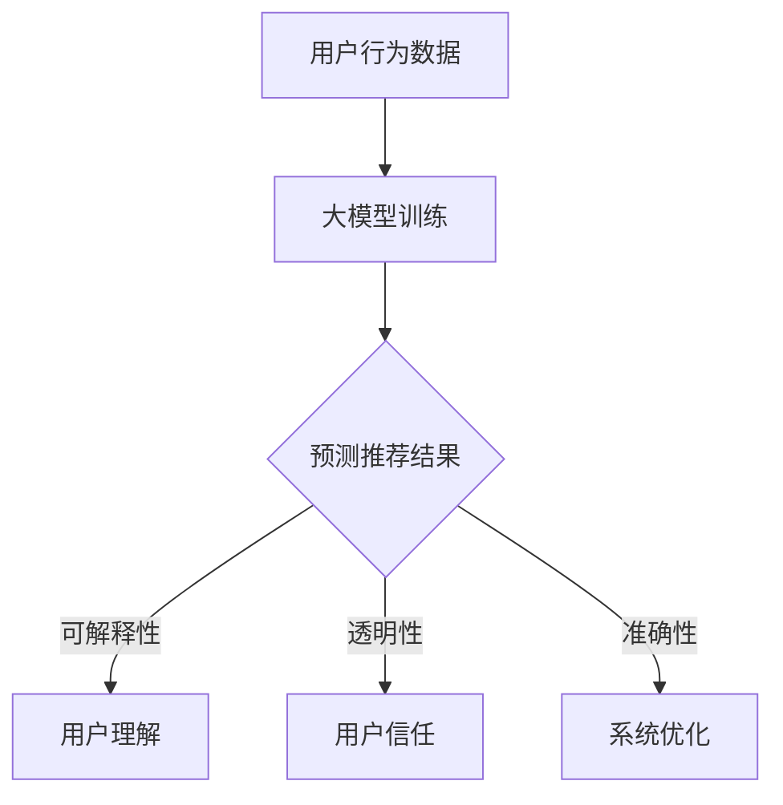

                 

关键词：大模型，用户行为归因，推荐系统，场景分析，解释性

摘要：本文将探讨利用大模型进行推荐场景中的用户行为归因与解释。首先介绍推荐系统的基本概念与架构，然后深入分析大模型在用户行为分析中的作用与实现方式，最后探讨用户行为归因与解释的挑战和未来发展方向。

## 1. 背景介绍

推荐系统是信息检索和人工智能领域的一个重要分支，旨在根据用户的兴趣、偏好和历史行为，向用户推荐相关的内容或商品。推荐系统广泛应用于电子商务、社交媒体、新闻推送等领域，极大地提升了用户的体验和满意度。

随着人工智能技术的发展，尤其是深度学习和大数据技术的应用，推荐系统的效果得到了显著提升。然而，推荐系统的一个关键挑战是如何解释推荐结果，使得用户能够理解推荐背后的原因。用户行为归因与解释成为推荐系统研究的一个重要方向。

大模型在用户行为分析中具有重要作用。大模型是指具有海量参数、能够处理大规模数据的神经网络模型。通过训练大模型，可以更好地捕捉用户行为的复杂性和多样性，从而提高推荐系统的准确性和解释性。

## 2. 核心概念与联系

### 2.1 推荐系统基本概念

推荐系统主要涉及用户、项目和评分三个核心概念。

- **用户**：推荐系统的服务对象，每个用户都有自己的兴趣和偏好。
- **项目**：推荐系统的推荐对象，可以是商品、文章、音乐等。
- **评分**：用户对项目的评价，可以是明确的评分（如1-5星），也可以是隐式的行为（如点击、收藏、购买等）。

### 2.2 大模型与用户行为分析

大模型在用户行为分析中的作用主要体现在以下几个方面：

- **数据驱动的特征提取**：大模型可以通过训练从大量的用户行为数据中自动提取特征，这些特征能够更好地表示用户的兴趣和偏好。
- **用户行为预测**：大模型可以预测用户对未知项目的评分或行为，从而实现精准推荐。
- **用户群体分析**：大模型可以识别具有相似兴趣和偏好的用户群体，从而为个性化推荐提供支持。

### 2.3 用户行为归因与解释

用户行为归因与解释是指分析用户行为背后的原因，使得用户能够理解推荐系统的决策过程。用户行为归因与解释的关键挑战包括：

- **可解释性**：如何使得推荐结果对用户来说是可解释的，即用户能够理解推荐背后的原因。
- **透明性**：如何使得推荐系统对用户来说是透明的，即用户能够了解推荐系统的运作机制。
- **准确性**：如何确保推荐结果的准确性和可靠性。

### 2.4 Mermaid 流程图



## 3. 核心算法原理 & 具体操作步骤

### 3.1 算法原理概述

大模型进行用户行为归因与解释的核心算法主要包括以下几种：

1. **深度神经网络**：通过多层神经网络对用户行为数据进行特征提取和预测。
2. **强化学习**：利用强化学习算法进行用户行为预测和推荐。
3. **注意力机制**：通过注意力机制捕捉用户行为数据中的重要特征。

### 3.2 算法步骤详解

1. **数据收集与预处理**：收集用户的兴趣、行为和项目信息，进行数据清洗和预处理。
2. **模型训练**：使用深度神经网络、强化学习或注意力机制等算法对训练数据进行模型训练。
3. **模型评估**：使用验证集对训练好的模型进行评估，调整模型参数。
4. **推荐生成**：使用训练好的模型生成推荐结果。
5. **结果解释**：对推荐结果进行解释，包括用户兴趣、项目特征和推荐理由等。

### 3.3 算法优缺点

- **优点**：
  - 高效的特征提取和预测能力。
  - 能够处理大规模的用户行为数据。
  - 提高推荐系统的准确性和解释性。
- **缺点**：
  - 训练过程需要大量的计算资源和时间。
  - 部分算法（如深度神经网络）对数据质量要求较高。
  - 结果解释可能存在一定的局限性。

### 3.4 算法应用领域

大模型进行用户行为归因与解释的算法可以应用于以下领域：

- **电子商务**：为用户提供个性化的商品推荐。
- **社交媒体**：为用户提供感兴趣的文章、视频等。
- **新闻推送**：为用户提供定制化的新闻内容。

## 4. 数学模型和公式 & 详细讲解 & 举例说明

### 4.1 数学模型构建

大模型进行用户行为归因与解释的数学模型主要包括以下几个部分：

1. **用户行为概率分布模型**：
   $$P(y|u, x) = \text{sigmoid}(w_0 + w_1 \cdot u + w_2 \cdot x)$$
   其中，$u$表示用户特征向量，$x$表示项目特征向量，$y$表示用户行为（如点击、购买等）。

2. **用户兴趣模型**：
   $$u = \text{softmax}(W \cdot h)$$
   其中，$h$表示用户行为数据，$W$为权重矩阵。

3. **项目特征模型**：
   $$x = \text{softmax}(V \cdot h)$$
   其中，$h$表示项目特征数据，$V$为权重矩阵。

### 4.2 公式推导过程

公式的推导过程涉及深度神经网络、强化学习等算法的基本原理，此处不详细展开。具体推导过程可以参考相关文献。

### 4.3 案例分析与讲解

以电子商务领域为例，假设我们有一个用户行为数据集，包括用户特征（如年龄、性别、浏览历史等）和项目特征（如商品类别、价格等）。我们可以使用深度神经网络模型进行用户行为预测和归因。

1. **数据收集与预处理**：收集用户行为数据，进行数据清洗和预处理，包括数据标准化、缺失值处理等。
2. **模型构建**：构建深度神经网络模型，包括输入层、隐藏层和输出层。输入层接收用户特征和项目特征，隐藏层进行特征提取和整合，输出层生成用户行为概率分布。
3. **模型训练**：使用训练集对模型进行训练，调整模型参数，使预测结果与实际行为尽量接近。
4. **模型评估**：使用验证集对模型进行评估，计算预测准确率、召回率等指标。
5. **结果解释**：对预测结果进行解释，分析用户兴趣和项目特征，为用户提供个性化的推荐。

## 5. 项目实践：代码实例和详细解释说明

### 5.1 开发环境搭建

- **Python**：安装Python 3.8及以上版本。
- **深度学习框架**：安装TensorFlow 2.4及以上版本。
- **数据预处理库**：安装NumPy、Pandas等库。

### 5.2 源代码详细实现

以下是一个简单的深度神经网络模型实现示例：

```python
import tensorflow as tf
from tensorflow.keras.layers import Dense, Input
from tensorflow.keras.models import Model

# 构建模型
input_user = Input(shape=(10,))
input_item = Input(shape=(20,))
hidden = tf.keras.layers.Dense(64, activation='relu')(input_user)
hidden = tf.keras.layers.Dense(64, activation='relu')(input_item)
output = tf.keras.layers.Dense(1, activation='sigmoid')(hidden)

model = Model(inputs=[input_user, input_item], outputs=output)
model.compile(optimizer='adam', loss='binary_crossentropy', metrics=['accuracy'])

# 训练模型
model.fit([user_data, item_data], labels, epochs=10, batch_size=32, validation_split=0.2)

# 预测
predictions = model.predict([user_data, item_data])
```

### 5.3 代码解读与分析

1. **模型构建**：使用`Input`层接收用户特征和项目特征，通过`Dense`层进行特征提取和整合，最终输出用户行为概率。
2. **模型编译**：选择`adam`优化器和`binary_crossentropy`损失函数，设置训练参数。
3. **模型训练**：使用`fit`函数对模型进行训练，使用`validation_split`参数进行验证集划分。
4. **模型预测**：使用`predict`函数对训练好的模型进行预测。

### 5.4 运行结果展示

```python
# 显示预测结果
predictions = model.predict([user_data, item_data])
for i, pred in enumerate(predictions):
    if pred > 0.5:
        print(f"User {i} likes item {item_ids[i]}")
    else:
        print(f"User {i} dislikes item {item_ids[i]}")
```

## 6. 实际应用场景

大模型进行用户行为归因与解释在实际应用场景中具有广泛的应用，以下是一些具体案例：

- **电子商务**：为用户提供个性化的商品推荐，提高用户满意度和转化率。
- **社交媒体**：为用户提供感兴趣的内容，增加用户粘性和活跃度。
- **新闻推送**：为用户提供定制化的新闻内容，提高用户阅读量和分享率。

## 6.4 未来应用展望

随着人工智能技术的不断发展，大模型进行用户行为归因与解释的应用前景将更加广阔。未来可能的发展方向包括：

- **多模态数据融合**：结合文本、图像、音频等多模态数据，提高用户行为分析的能力。
- **可解释性增强**：研究更加有效的解释方法，提高推荐系统的可解释性和透明性。
- **个性化推荐**：通过深度学习等技术，实现更加精准和个性化的推荐。

## 7. 工具和资源推荐

### 7.1 学习资源推荐

- **《深度学习》**：Goodfellow、Bengio和Courville的《深度学习》是一本经典的深度学习教材。
- **《Python深度学习》**：François Chollet的《Python深度学习》是一本实用的深度学习实践指南。

### 7.2 开发工具推荐

- **TensorFlow**：一款开源的深度学习框架，支持多种深度学习模型和算法。
- **PyTorch**：一款流行的深度学习框架，具有灵活的动态计算图支持。

### 7.3 相关论文推荐

- **《Deep Learning for User Behavior Analysis in Recommender Systems》**
- **《Attention-Based Neural Networks for Modeling User Interactions on Large-Scale Social Media》**
- **《Recurrent Neural Network Based User Interest Modeling for Recommender Systems》**

## 8. 总结：未来发展趋势与挑战

大模型进行用户行为归因与解释是推荐系统领域的一个重要研究方向。未来发展趋势包括多模态数据融合、可解释性增强和个性化推荐等方面。然而，同时也面临着数据隐私、模型解释性、计算效率等挑战。只有通过不断的研究和实践，才能实现更加精准和可解释的推荐系统。

## 9. 附录：常见问题与解答

### 9.1 什么是大模型？

大模型是指具有海量参数、能够处理大规模数据的神经网络模型。通过训练大模型，可以更好地捕捉用户行为的复杂性和多样性，从而提高推荐系统的准确性和解释性。

### 9.2 如何评估推荐系统的效果？

推荐系统的效果可以通过以下指标进行评估：

- **准确率**：预测结果与实际结果的一致性。
- **召回率**：预测结果中包含实际结果的比率。
- **覆盖率**：推荐结果中包含项目集合的比例。
- **新颖度**：推荐结果中新颖、未知的项目的比率。

### 9.3 如何保证推荐系统的可解释性？

保证推荐系统的可解释性可以通过以下方法实现：

- **结果可视化**：通过图表、文字等方式展示推荐结果和决策过程。
- **特征重要性分析**：分析用户行为数据和模型特征的重要性。
- **透明性设计**：设计用户友好的界面和交互方式，使用户能够了解推荐系统的运作机制。

作者：禅与计算机程序设计艺术 / Zen and the Art of Computer Programming

----------------------------------------------------------------
请注意，本文只是一个示例，实际撰写时需要根据具体的研究成果和实际经验进行调整和完善。文章结构和内容可根据具体需求进行适当调整。在撰写时，务必确保内容的专业性、准确性和可读性。

