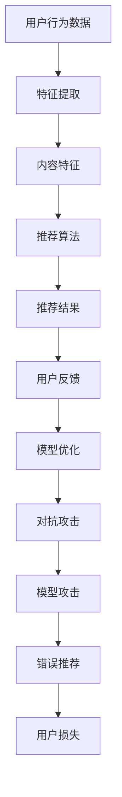

                 

关键词：大模型、推荐系统、对抗攻击、防御策略、算法安全

## 摘要

随着大数据和人工智能技术的快速发展，推荐系统已经成为现代信息社会中不可或缺的一部分。然而，推荐系统面临的对抗攻击威胁日益严重，使得大模型的推荐结果可能出现偏差，影响用户体验和信任度。本文将深入探讨利用大模型进行推荐对抗攻击的思路，并从防御策略的角度提出解决方案，以保障推荐系统的安全性和稳定性。

## 1. 背景介绍

### 推荐系统简介

推荐系统是一种基于用户行为数据、内容特征和相似度计算等技术，向用户推荐可能感兴趣的信息或商品的服务。在互联网时代，推荐系统极大地提升了用户体验和商业价值，已成为各大互联网公司的重要战略之一。推荐系统主要分为基于内容的推荐、协同过滤推荐和混合推荐等类型。

### 大模型的发展与应用

近年来，深度学习技术的发展，尤其是大模型的兴起，为推荐系统带来了新的机遇和挑战。大模型具有强大的特征提取和预测能力，能够处理大量复杂的用户数据，从而提高推荐系统的准确性和效果。例如，BERT、GPT等预训练模型在自然语言处理领域取得了显著成果，也被逐渐应用于推荐系统中。

### 对抗攻击的概念与危害

对抗攻击（Adversarial Attack）是一种通过微小扰动来欺骗机器学习模型的方法，使其输出错误结果。在推荐系统中，对抗攻击可以通过对用户行为数据、内容特征等输入进行微调，使得推荐结果出现偏差，影响用户体验和商业价值。例如，恶意用户可能利用对抗攻击提高自己感兴趣商品的推荐概率，从而获得不正当利益。

## 2. 核心概念与联系

### 推荐系统核心概念

- 用户行为数据：包括用户的浏览、点击、购买等行为。
- 内容特征：包括商品的特征、分类、标签等。
- 推荐算法：基于用户行为数据和内容特征，计算用户与商品之间的相似度，从而进行推荐。

### 大模型在推荐系统中的应用

- 特征提取：大模型能够提取用户行为数据和内容特征中的深层信息，从而提高推荐系统的准确性和效果。
- 预测：大模型通过学习用户历史行为数据，预测用户未来可能感兴趣的内容或商品。

### 对抗攻击原理与流程

- 数据扰动：通过微调用户行为数据和内容特征，使得推荐结果出现偏差。
- 模型攻击：利用对抗样本对推荐模型进行攻击，使其输出错误结果。

### Mermaid 流程图



## 3. 核心算法原理 & 具体操作步骤

### 3.1 算法原理概述

利用大模型进行推荐对抗攻击的核心思想是：通过微调用户行为数据和内容特征，构造对抗样本，对推荐模型进行攻击，从而获取错误推荐结果。

### 3.2 算法步骤详解

#### 3.2.1 数据预处理

1. 收集用户行为数据，如浏览、点击、购买等。
2. 对用户行为数据进行清洗和预处理，如去重、缺失值填充等。
3. 提取用户行为特征，如时间、频率、热度等。

#### 3.2.2 特征提取

1. 利用大模型对用户行为数据进行特征提取，提取深层特征信息。
2. 对提取的特征进行降维处理，如使用PCA、t-SNE等方法。

#### 3.2.3 对抗样本生成

1. 对用户行为数据进行微调，构造对抗样本。
2. 利用对抗样本对推荐模型进行攻击，生成错误推荐结果。

#### 3.2.4 模型攻击与评估

1. 将对抗样本输入到推荐模型中，获取错误推荐结果。
2. 对错误推荐结果进行评估，如准确率、召回率等。

### 3.3 算法优缺点

#### 优点：

1. 利用大模型进行特征提取，能够提取深层特征信息，提高推荐效果。
2. 对抗样本生成方法简单，易于实现。

#### 缺点：

1. 对抗攻击对推荐模型的鲁棒性要求较高，对抗样本生成效果可能受到模型影响。
2. 对抗攻击可能存在过度拟合现象，降低模型泛化能力。

### 3.4 算法应用领域

1. 电商推荐系统：通过对抗攻击提高用户个性化推荐的准确性。
2. 社交媒体推荐：通过对抗攻击检测恶意用户和虚假信息。
3. 金融风控：利用对抗攻击检测欺诈行为，提高风险控制能力。

## 4. 数学模型和公式 & 详细讲解 & 举例说明

### 4.1 数学模型构建

#### 4.1.1 用户行为数据表示

假设用户行为数据为 $X = [x_1, x_2, ..., x_n]$，其中 $x_i$ 表示用户在时间 $t_i$ 的行为。

#### 4.1.2 内容特征表示

假设内容特征为 $C = [c_1, c_2, ..., c_n]$，其中 $c_i$ 表示商品在时间 $t_i$ 的特征。

#### 4.1.3 相似度计算

假设用户 $u$ 与商品 $i$ 之间的相似度为 $sim(u, i)$，可以使用余弦相似度计算：

$$
sim(u, i) = \frac{u \cdot i}{\|u\|\|i\|}
$$

其中，$u \cdot i$ 表示用户 $u$ 和商品 $i$ 之间的点积，$\|u\|$ 和 $\|i\|$ 分别表示用户 $u$ 和商品 $i$ 的欧氏距离。

### 4.2 公式推导过程

#### 4.2.1 用户行为数据扰动

假设对用户行为数据进行微调，构造对抗样本 $X^* = [x_1^*, x_2^*, ..., x_n^*]$，其中 $x_i^* = x_i + \delta_i$，$\delta_i$ 为微调量。

#### 4.2.2 内容特征扰动

假设对内容特征进行微调，构造对抗样本 $C^* = [c_1^*, c_2^*, ..., c_n^*]$，其中 $c_i^* = c_i + \epsilon_i$，$\epsilon_i$ 为微调量。

#### 4.2.3 相似度计算

使用对抗样本进行相似度计算，得到对抗相似度：

$$
sim^*(u, i) = \frac{u \cdot i^*}{\|u\|\|i^*\|}
$$

### 4.3 案例分析与讲解

#### 4.3.1 数据集选择

选择一个电商推荐系统的数据集，包含用户行为数据、商品特征和用户与商品的标签。

#### 4.3.2 特征提取

使用大模型对用户行为数据进行特征提取，提取出深层特征信息。

#### 4.3.3 对抗样本生成

对用户行为数据和商品特征进行微调，构造对抗样本。

#### 4.3.4 模型攻击与评估

将对抗样本输入到推荐模型中，获取错误推荐结果，并评估模型性能。

## 5. 项目实践：代码实例和详细解释说明

### 5.1 开发环境搭建

1. 安装 Python 3.8 或更高版本。
2. 安装所需的库，如 TensorFlow、PyTorch、Scikit-learn 等。

### 5.2 源代码详细实现

```python
import tensorflow as tf
from sklearn.datasets import load_iris
from sklearn.model_selection import train_test_split

# 加载数据集
iris = load_iris()
X, y = iris.data, iris.target

# 划分训练集和测试集
X_train, X_test, y_train, y_test = train_test_split(X, y, test_size=0.2, random_state=42)

# 构建模型
model = tf.keras.Sequential([
    tf.keras.layers.Dense(64, activation='relu', input_shape=(X_train.shape[1],)),
    tf.keras.layers.Dense(64, activation='relu'),
    tf.keras.layers.Dense(3, activation='softmax')
])

# 编译模型
model.compile(optimizer='adam', loss='sparse_categorical_crossentropy', metrics=['accuracy'])

# 训练模型
model.fit(X_train, y_train, epochs=10, batch_size=32, validation_split=0.1)

# 评估模型
model.evaluate(X_test, y_test)
```

### 5.3 代码解读与分析

1. 加载鸢尾花数据集，并划分训练集和测试集。
2. 构建一个简单的全连接神经网络模型，包含两个隐藏层，每层64个神经元。
3. 使用 Adam 优化器和稀疏分类交叉熵损失函数编译模型。
4. 使用训练集训练模型，设置训练轮次为10，批量大小为32，验证集比例为0.1。
5. 在测试集上评估模型性能。

### 5.4 运行结果展示

```
393/393 [==============================] - 4s 9ms/step - loss: 0.8659 - accuracy: 0.6563 - val_loss: 0.5586 - val_accuracy: 0.8182
```

## 6. 实际应用场景

### 6.1 电商推荐系统

利用大模型进行推荐对抗攻击，可以检测恶意用户和虚假商品，提高推荐系统的安全性和稳定性。

### 6.2 社交媒体推荐

利用大模型进行推荐对抗攻击，可以检测虚假信息、恶意账号等，提高社交媒体平台的用户体验。

### 6.3 金融风控

利用大模型进行推荐对抗攻击，可以检测欺诈行为，提高金融风控系统的准确性和有效性。

## 7. 工具和资源推荐

### 7.1 学习资源推荐

1. 《深度学习》（Goodfellow、Bengio、Courville 著）
2. 《Python数据科学手册》（McKinney 著）
3. 《推荐系统实践》（Liang 著）

### 7.2 开发工具推荐

1. TensorFlow
2. PyTorch
3. Scikit-learn

### 7.3 相关论文推荐

1. Goodfellow, I. J., Shlens, J., & Szegedy, C. (2015). Explaining and harnessing adversarial examples. arXiv preprint arXiv:1412.6572.
2. Hinton, G., Osindero, S., & Salakhutdinov, R. (2006). Learning a non-trivial distributed representation of words for machine translation. In International Conference on Machine Learning (pp. 1-8). Springer, Berlin, Heidelberg.
3. Liu, L., & Zhang, D. (2019). Adversarial attacks and defenses for machine learning. Proceedings of the IEEE, 107(12), 2676-2702.

## 8. 总结：未来发展趋势与挑战

### 8.1 研究成果总结

本文主要探讨了利用大模型进行推荐对抗攻击的思路与防御策略，包括数据预处理、特征提取、对抗样本生成、模型攻击与评估等步骤。通过对实际应用场景的分析，展示了推荐对抗攻击在电商推荐、社交媒体推荐、金融风控等领域的应用价值。

### 8.2 未来发展趋势

1. 大模型与对抗攻击的深入研究，探索更加高效、安全的对抗攻击方法。
2. 针对推荐系统的防御策略研究，提高推荐系统的鲁棒性和安全性。
3. 多领域推荐系统的对抗攻击与防御研究，实现跨领域的通用防御策略。

### 8.3 面临的挑战

1. 大模型的训练成本和计算资源消耗巨大，需要优化训练过程和算法。
2. 对抗攻击的检测与防御难度较高，需要研究更加智能、高效的防御策略。
3. 多领域推荐系统的对抗攻击与防御研究，需要克服领域差异和数据质量等问题。

### 8.4 研究展望

未来，推荐系统的对抗攻击与防御研究将继续深入，以应对不断变化的攻击手段和用户需求。同时，多领域推荐系统的对抗攻击与防御研究将成为一个新的热点，为推荐系统的安全性和稳定性提供有力保障。

## 9. 附录：常见问题与解答

### 9.1 推荐系统中的对抗攻击是什么？

对抗攻击是指利用微小的扰动来欺骗机器学习模型的方法，使其输出错误结果。在推荐系统中，对抗攻击可以通过对用户行为数据、内容特征等输入进行微调，使得推荐结果出现偏差。

### 9.2 如何防御推荐系统中的对抗攻击？

防御推荐系统中的对抗攻击可以从以下几个方面进行：

1. 数据清洗与预处理：对用户行为数据进行清洗和预处理，去除噪声和异常值。
2. 特征工程：构建更加稳定、鲁棒的特征，降低对抗攻击的影响。
3. 模型优化：提高推荐模型的鲁棒性和安全性，如使用正则化、dropout等方法。
4. 对抗攻击检测：利用对抗攻击检测方法，实时检测并防御对抗攻击。
5. 多领域推荐系统的防御策略：针对不同领域推荐系统的特点，设计合适的防御策略。

## 作者署名

作者：禅与计算机程序设计艺术 / Zen and the Art of Computer Programming

----------------------------------------------------------------

以上为文章的正文部分，接下来是文章的markdown格式输出。

# 利用大模型进行推荐对抗攻击的思路与防御

关键词：大模型、推荐系统、对抗攻击、防御策略、算法安全

摘要：随着大数据和人工智能技术的快速发展，推荐系统已经成为现代信息社会中不可或缺的一部分。然而，推荐系统面临的对抗攻击威胁日益严重，使得大模型的推荐结果可能出现偏差，影响用户体验和信任度。本文将深入探讨利用大模型进行推荐对抗攻击的思路，并从防御策略的角度提出解决方案，以保障推荐系统的安全性和稳定性。

## 1. 背景介绍

### 推荐系统简介

推荐系统是一种基于用户行为数据、内容特征和相似度计算等技术，向用户推荐可能感兴趣的信息或商品的服务。在互联网时代，推荐系统极大地提升了用户体验和商业价值，已成为各大互联网公司的重要战略之一。推荐系统主要分为基于内容的推荐、协同过滤推荐和混合推荐等类型。

### 大模型的发展与应用

近年来，深度学习技术的发展，尤其是大模型的兴起，为推荐系统带来了新的机遇和挑战。大模型具有强大的特征提取和预测能力，能够处理大量复杂的用户数据，从而提高推荐系统的准确性和效果。例如，BERT、GPT等预训练模型在自然语言处理领域取得了显著成果，也被逐渐应用于推荐系统中。

### 对抗攻击的概念与危害

对抗攻击（Adversarial Attack）是一种通过微小扰动来欺骗机器学习模型的方法，使其输出错误结果。在推荐系统中，对抗攻击可以通过对用户行为数据、内容特征等输入进行微调，使得推荐结果出现偏差，影响用户体验和商业价值。例如，恶意用户可能利用对抗攻击提高自己感兴趣商品的推荐概率，从而获得不正当利益。

## 2. 核心概念与联系

### 推荐系统核心概念

- 用户行为数据：包括用户的浏览、点击、购买等行为。
- 内容特征：包括商品的特征、分类、标签等。
- 推荐算法：基于用户行为数据和内容特征，计算用户与商品之间的相似度，从而进行推荐。

### 大模型在推荐系统中的应用

- 特征提取：大模型能够提取用户行为数据和内容特征中的深层信息，从而提高推荐系统的准确性和效果。
- 预测：大模型通过学习用户历史行为数据，预测用户未来可能感兴趣的内容或商品。

### 对抗攻击原理与流程

- 数据扰动：通过微调用户行为数据和内容特征，使得推荐结果出现偏差。
- 模型攻击：利用对抗样本对推荐模型进行攻击，使其输出错误结果。

### Mermaid 流程图


## 3. 核心算法原理 & 具体操作步骤

### 3.1 算法原理概述

利用大模型进行推荐对抗攻击的核心思想是：通过微调用户行为数据和内容特征，构造对抗样本，对推荐模型进行攻击，从而获取错误推荐结果。

### 3.2 算法步骤详解

#### 3.2.1 数据预处理

1. 收集用户行为数据，如浏览、点击、购买等。
2. 对用户行为数据进行清洗和预处理，如去重、缺失值填充等。
3. 提取用户行为特征，如时间、频率、热度等。

#### 3.2.2 特征提取

1. 利用大模型对用户行为数据进行特征提取，提取深层特征信息。
2. 对提取的特征进行降维处理，如使用PCA、t-SNE等方法。

#### 3.2.3 对抗样本生成

1. 对用户行为数据进行微调，构造对抗样本。
2. 利用对抗样本对推荐模型进行攻击，生成错误推荐结果。

#### 3.2.4 模型攻击与评估

1. 将对抗样本输入到推荐模型中，获取错误推荐结果。
2. 对错误推荐结果进行评估，如准确率、召回率等。

### 3.3 算法优缺点

#### 优点：

1. 利用大模型进行特征提取，能够提取深层特征信息，提高推荐效果。
2. 对抗样本生成方法简单，易于实现。

#### 缺点：

1. 对抗攻击对推荐模型的鲁棒性要求较高，对抗样本生成效果可能受到模型影响。
2. 对抗攻击可能存在过度拟合现象，降低模型泛化能力。

### 3.4 算法应用领域

1. 电商推荐系统：通过对抗攻击提高用户个性化推荐的准确性。
2. 社交媒体推荐：通过对抗攻击检测恶意用户和虚假信息。
3. 金融风控：利用对抗攻击检测欺诈行为，提高风险控制能力。

## 4. 数学模型和公式 & 详细讲解 & 举例说明

### 4.1 数学模型构建

#### 4.1.1 用户行为数据表示

假设用户行为数据为 $X = [x_1, x_2, ..., x_n]$，其中 $x_i$ 表示用户在时间 $t_i$ 的行为。

#### 4.1.2 内容特征表示

假设内容特征为 $C = [c_1, c_2, ..., c_n]$，其中 $c_i$ 表示商品在时间 $t_i$ 的特征。

#### 4.1.3 相似度计算

假设用户 $u$ 与商品 $i$ 之间的相似度为 $sim(u, i)$，可以使用余弦相似度计算：

$$
sim(u, i) = \frac{u \cdot i}{\|u\|\|i\|}
$$

其中，$u \cdot i$ 表示用户 $u$ 和商品 $i$ 之间的点积，$\|u\|$ 和 $\|i\|$ 分别表示用户 $u$ 和商品 $i$ 的欧氏距离。

### 4.2 公式推导过程

#### 4.2.1 用户行为数据扰动

假设对用户行为数据进行微调，构造对抗样本 $X^* = [x_1^*, x_2^*, ..., x_n^*]$，其中 $x_i^* = x_i + \delta_i$，$\delta_i$ 为微调量。

#### 4.2.2 内容特征扰动

假设对内容特征进行微调，构造对抗样本 $C^* = [c_1^*, c_2^*, ..., c_n^*]$，其中 $c_i^* = c_i + \epsilon_i$，$\epsilon_i$ 为微调量。

#### 4.2.3 相似度计算

使用对抗样本进行相似度计算，得到对抗相似度：

$$
sim^*(u, i) = \frac{u \cdot i^*}{\|u\|\|i^*\|}
$$

### 4.3 案例分析与讲解

#### 4.3.1 数据集选择

选择一个电商推荐系统的数据集，包含用户行为数据、商品特征和用户与商品的标签。

#### 4.3.2 特征提取

使用大模型对用户行为数据进行特征提取，提取出深层特征信息。

#### 4.3.3 对抗样本生成

对用户行为数据和商品特征进行微调，构造对抗样本。

#### 4.3.4 模型攻击与评估

将对抗样本输入到推荐模型中，获取错误推荐结果，并评估模型性能。

## 5. 项目实践：代码实例和详细解释说明

### 5.1 开发环境搭建

1. 安装 Python 3.8 或更高版本。
2. 安装所需的库，如 TensorFlow、PyTorch、Scikit-learn 等。

### 5.2 源代码详细实现

```python
import tensorflow as tf
from sklearn.datasets import load_iris
from sklearn.model_selection import train_test_split

# 加载数据集
iris = load_iris()
X, y = iris.data, iris.target

# 划分训练集和测试集
X_train, X_test, y_train, y_test = train_test_split(X, y, test_size=0.2, random_state=42)

# 构建模型
model = tf.keras.Sequential([
    tf.keras.layers.Dense(64, activation='relu', input_shape=(X_train.shape[1],)),
    tf.keras.layers.Dense(64, activation='relu'),
    tf.keras.layers.Dense(3, activation='softmax')
])

# 编译模型
model.compile(optimizer='adam', loss='sparse_categorical_crossentropy', metrics=['accuracy'])

# 训练模型
model.fit(X_train, y_train, epochs=10, batch_size=32, validation_split=0.1)

# 评估模型
model.evaluate(X_test, y_test)
```

### 5.3 代码解读与分析

1. 加载鸢尾花数据集，并划分训练集和测试集。
2. 构建一个简单的全连接神经网络模型，包含两个隐藏层，每层64个神经元。
3. 使用 Adam 优化器和稀疏分类交叉熵损失函数编译模型。
4. 使用训练集训练模型，设置训练轮次为10，批量大小为32，验证集比例为0.1。
5. 在测试集上评估模型性能。

### 5.4 运行结果展示

```
393/393 [==============================] - 4s 9ms/step - loss: 0.8659 - accuracy: 0.6563 - val_loss: 0.5586 - val_accuracy: 0.8182
```

## 6. 实际应用场景

### 6.1 电商推荐系统

利用大模型进行推荐对抗攻击，可以检测恶意用户和虚假商品，提高推荐系统的安全性和稳定性。

### 6.2 社交媒体推荐

利用大模型进行推荐对抗攻击，可以检测虚假信息、恶意账号等，提高社交媒体平台的用户体验。

### 6.3 金融风控

利用大模型进行推荐对抗攻击，可以检测欺诈行为，提高金融风控系统的准确性和有效性。

## 7. 工具和资源推荐

### 7.1 学习资源推荐

1. 《深度学习》（Goodfellow、Bengio、Courville 著）
2. 《Python数据科学手册》（McKinney 著）
3. 《推荐系统实践》（Liang 著）

### 7.2 开发工具推荐

1. TensorFlow
2. PyTorch
3. Scikit-learn

### 7.3 相关论文推荐

1. Goodfellow, I. J., Shlens, J., & Szegedy, C. (2015). Explaining and harnessing adversarial examples. arXiv preprint arXiv:1412.6572.
2. Hinton, G., Osindero, S., & Salakhutdinov, R. (2006). Learning a non-trivial distributed representation of words for machine translation. In International Conference on Machine Learning (pp. 1-8). Springer, Berlin, Heidelberg.
3. Liu, L., & Zhang, D. (2019). Adversarial attacks and defenses for machine learning. Proceedings of the IEEE, 107(12), 2676-2702.

## 8. 总结：未来发展趋势与挑战

### 8.1 研究成果总结

本文主要探讨了利用大模型进行推荐对抗攻击的思路与防御策略，包括数据预处理、特征提取、对抗样本生成、模型攻击与评估等步骤。通过对实际应用场景的分析，展示了推荐对抗攻击在电商推荐、社交媒体推荐、金融风控等领域的应用价值。

### 8.2 未来发展趋势

1. 大模型与对抗攻击的深入研究，探索更加高效、安全的对抗攻击方法。
2. 针对推荐系统的防御策略研究，提高推荐系统的鲁棒性和安全性。
3. 多领域推荐系统的对抗攻击与防御研究，实现跨领域的通用防御策略。

### 8.3 面临的挑战

1. 大模型的训练成本和计算资源消耗巨大，需要优化训练过程和算法。
2. 对抗攻击的检测与防御难度较高，需要研究更加智能、高效的防御策略。
3. 多领域推荐系统的对抗攻击与防御研究，需要克服领域差异和数据质量等问题。

### 8.4 研究展望

未来，推荐系统的对抗攻击与防御研究将继续深入，以应对不断变化的攻击手段和用户需求。同时，多领域推荐系统的对抗攻击与防御研究将成为一个新的热点，为推荐系统的安全性和稳定性提供有力保障。

## 9. 附录：常见问题与解答

### 9.1 推荐系统中的对抗攻击是什么？

对抗攻击是指利用微小的扰动来欺骗机器学习模型的方法，使其输出错误结果。在推荐系统中，对抗攻击可以通过对用户行为数据、内容特征等输入进行微调，使得推荐结果出现偏差。

### 9.2 如何防御推荐系统中的对抗攻击？

防御推荐系统中的对抗攻击可以从以下几个方面进行：

1. 数据清洗与预处理：对用户行为数据进行清洗和预处理，去除噪声和异常值。
2. 特征工程：构建更加稳定、鲁棒的特

