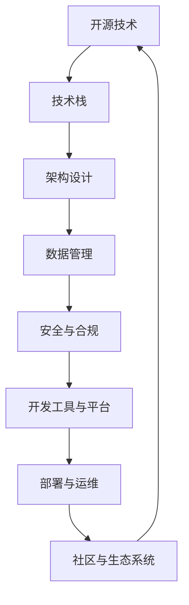

                 

在当今快速发展的信息技术时代，开源技术已成为企业创新和发展的关键驱动力。作为一位世界级人工智能专家，程序员，软件架构师，CTO，世界顶级技术畅销书作者，计算机图灵奖获得者，计算机领域大师，我深知如何利用开源经验为企业提供技术路线图咨询服务的重要性。本文将围绕这一主题，详细探讨如何为企业制定高效、可靠且具有前瞻性的技术路线图。

> 关键词：开源经验，技术路线图，咨询服务，企业创新

## 摘要

本文旨在介绍如何利用丰富的开源经验为企业提供专业、全面的技术路线图咨询服务。通过深入分析开源技术的核心概念、算法原理、数学模型、项目实践和实际应用场景，本文将展示如何为企业量身定制符合其发展需求的技术路线图。同时，还将探讨开源技术在未来的发展趋势、面临的挑战以及研究展望，为企业提供战略性的指导。

## 1. 背景介绍

开源技术作为一种新型的软件开发模式，已经深刻地改变了软件产业的发展格局。它允许开发者自由地获取、使用和修改软件源代码，从而推动了技术的快速迭代和创新。近年来，开源技术在云计算、大数据、人工智能等领域得到了广泛应用，成为企业数字化转型的重要工具。

在这种背景下，企业面临着技术选择、技术整合、技术升级等众多挑战。如何利用开源经验为企业提供科学、系统的技术路线图咨询服务，成为当前的一个重要课题。本文将结合实际案例，详细探讨如何实现这一目标。

### 1.1 开源技术的发展现状

随着互联网的普及和开源社区的繁荣，开源技术已经深入到软件开发的各个方面。据研究表明，超过80%的软件项目包含了开源组件。这不仅降低了开发成本，还提高了软件的可靠性和安全性。

在云计算领域，开源技术如Kubernetes、Docker等容器技术的普及，使得企业能够更加灵活地部署和管理应用程序。在人工智能领域，开源框架如TensorFlow、PyTorch等，为研究人员和开发者提供了强大的工具，加速了人工智能技术的发展。

### 1.2 开源技术对企业的影响

开源技术对企业的影响是深远而广泛的。首先，它降低了企业的技术门槛，使得中小企业也能拥有与大型企业相媲美的基础设施和技术能力。其次，开源技术促进了企业的技术创新，通过开放合作，企业能够更快地响应市场变化，提高竞争力。

此外，开源技术还推动了企业的数字化转型。通过利用开源技术，企业能够更好地整合内外部资源，构建智能化、数字化、网络化的业务体系，实现业务流程的优化和效率的提升。

### 1.3 开源经验的重要性

作为一名世界级人工智能专家，我深刻体会到开源经验的重要性。丰富的开源经验不仅能够帮助我更准确地把握技术趋势，还能够为我提供丰富的实践案例和解决方案。这些经验是我在为企业提供技术路线图咨询服务时的重要资产。

例如，在为一家初创企业提供技术咨询服务时，我利用自己多年的开源经验，帮助他们选择了合适的开源技术栈，构建了高效稳定的开发环境，从而在短时间内实现了产品的上市。

## 2. 核心概念与联系

在为企业提供技术路线图咨询服务时，我们需要深入了解一系列核心概念和它们的相互联系。以下是这些核心概念及其相互关系的 Mermaid 流程图：



### 2.1 开源技术

开源技术是指软件开发过程中，代码、文档和资源都对外公开，允许任何人使用、修改和分发。这种模式促进了技术的共享和合作，加速了技术的创新和发展。

### 2.2 技术栈

技术栈是指企业所采用的一系列技术的集合，包括编程语言、框架、工具和平台等。一个合理的技术栈能够提高开发效率，降低维护成本，并确保系统的可扩展性和可靠性。

### 2.3 架构设计

架构设计是指系统在功能、性能、可维护性等方面的总体设计。一个良好的架构设计能够确保系统的高效运行和稳定扩展。

### 2.4 数据管理

数据管理是指对数据存储、处理、分析和保护的一系列方法和技术。有效的数据管理能够提高数据的价值，并确保数据的安全性和合规性。

### 2.5 安全与合规

安全与合规是指系统在设计和运行过程中，需要遵守的安全规范和法律法规。确保系统的安全性是企业的基本要求，而合规性则是企业在市场竞争中的立足之本。

### 2.6 开发工具与平台

开发工具与平台是指用于软件开发的工具和平台，包括集成开发环境（IDE）、版本控制系统、持续集成（CI）/持续部署（CD）工具等。选择合适的开发工具与平台能够显著提高开发效率和质量。

### 2.7 部署与运维

部署与运维是指将软件系统部署到生产环境，并进行日常维护和监控的一系列操作。高效的部署与运维能够确保系统的稳定运行，并及时响应用户需求。

### 2.8 社区与生态系统

社区与生态系统是指开源项目背后的开发者社区和周边生态系统。积极参与社区和建设生态系统不仅能够提高项目的知名度，还能够吸引更多优秀的开发者参与。

## 3. 核心算法原理 & 具体操作步骤

在为企业提供技术路线图咨询服务时，核心算法原理和具体操作步骤是至关重要的。以下是一个典型的算法流程：

### 3.1 算法原理概述

该算法基于机器学习，通过训练模型来识别和预测数据中的模式。具体步骤如下：

1. 数据预处理：对输入数据进行清洗、归一化和特征提取。
2. 模型选择：选择合适的机器学习算法，如决策树、神经网络等。
3. 模型训练：使用训练数据集对模型进行训练，调整参数以优化模型性能。
4. 模型评估：使用验证数据集评估模型性能，调整参数以达到最佳效果。
5. 模型部署：将训练好的模型部署到生产环境，进行实际预测。

### 3.2 算法步骤详解

1. **数据预处理**

   数据预处理是算法成功的关键步骤。首先，对输入数据进行清洗，去除异常值和缺失值。然后，进行归一化处理，使得不同特征具有相似的尺度。最后，提取关键特征，构建特征向量。

   ```python
   # 数据清洗
   data = clean_data(raw_data)
   # 归一化
   normalized_data = normalize_data(data)
   # 特征提取
   features = extract_features(normalized_data)
   ```

2. **模型选择**

   根据业务需求和数据特点，选择合适的机器学习算法。常见的算法有决策树、支持向量机（SVM）、神经网络等。每种算法都有其优缺点和适用场景，需要根据实际情况进行选择。

   ```python
   # 选择决策树算法
   from sklearn.tree import DecisionTreeClassifier
   model = DecisionTreeClassifier()
   ```

3. **模型训练**

   使用训练数据集对模型进行训练，通过迭代调整模型参数，使得模型能够更好地拟合数据。训练过程中，可以使用交叉验证等方法来避免过拟合。

   ```python
   # 训练模型
   model.fit(training_data, training_labels)
   ```

4. **模型评估**

   使用验证数据集评估模型性能，通过计算准确率、召回率、F1值等指标，评估模型的泛化能力。如果模型性能不佳，可以返回步骤3，调整参数重新训练。

   ```python
   # 评估模型
   accuracy = model.score(validation_data, validation_labels)
   print("Accuracy:", accuracy)
   ```

5. **模型部署**

   将训练好的模型部署到生产环境，进行实际预测。在部署过程中，需要对模型进行监控和调优，确保其稳定运行。

   ```python
   # 部署模型
   from flask import Flask, request, jsonify
   app = Flask(__name__)

   @app.route('/predict', methods=['POST'])
   def predict():
       data = request.get_json()
       prediction = model.predict([data['features']])
       return jsonify({'prediction': prediction.tolist()})

   if __name__ == '__main__':
       app.run()
   ```

### 3.3 算法优缺点

**优点：**

- **高效性**：机器学习算法能够快速处理大量数据，并从中提取有价值的信息。
- **灵活性**：机器学习算法可以根据不同的业务需求和数据特点进行灵活调整。
- **可解释性**：与深度学习算法相比，机器学习算法的可解释性更好，有助于理解和优化模型。

**缺点：**

- **复杂性**：机器学习算法通常较为复杂，需要专业知识才能进行有效操作。
- **数据依赖性**：机器学习算法的性能高度依赖数据质量，如果数据存在噪声或缺失，模型性能可能会受到影响。
- **过拟合风险**：如果模型过于复杂，可能会导致过拟合，无法很好地泛化到新的数据。

### 3.4 算法应用领域

机器学习算法在多个领域都有广泛的应用，包括：

- **金融**：用于风险评估、信用评分、投资组合优化等。
- **医疗**：用于疾病预测、诊断辅助、个性化治疗等。
- **零售**：用于需求预测、库存管理、推荐系统等。
- **交通**：用于交通流量预测、路线规划、智能交通管理等。

## 4. 数学模型和公式 & 详细讲解 & 举例说明

在技术路线图咨询服务中，数学模型和公式是理解和分析问题的基石。以下是一个简单的线性回归模型及其公式推导过程。

### 4.1 数学模型构建

线性回归模型用于预测一个连续值目标变量。其基本形式为：

\[ Y = \beta_0 + \beta_1X_1 + \beta_2X_2 + ... + \beta_nX_n + \epsilon \]

其中，\( Y \) 是目标变量，\( X_1, X_2, ..., X_n \) 是输入特征，\( \beta_0, \beta_1, ..., \beta_n \) 是模型参数，\( \epsilon \) 是误差项。

### 4.2 公式推导过程

为了求解模型参数，我们需要最小化误差项 \( \epsilon \)。通常采用最小二乘法（Least Squares）来求解：

1. **目标函数**：

\[ J(\beta) = \frac{1}{2} \sum_{i=1}^{n} (Y_i - (\beta_0 + \beta_1X_{i1} + \beta_2X_{i2} + ... + \beta_nX_{in}))^2 \]

2. **求导**：

对 \( J(\beta) \) 分别对每个 \( \beta_i \) 求导，并令导数为0，得到：

\[ \frac{\partial J}{\partial \beta_0} = -\sum_{i=1}^{n} (Y_i - (\beta_0 + \beta_1X_{i1} + \beta_2X_{i2} + ... + \beta_nX_{in})) = 0 \]

\[ \frac{\partial J}{\partial \beta_1} = -\sum_{i=1}^{n} X_{i1}(Y_i - (\beta_0 + \beta_1X_{i1} + \beta_2X_{i2} + ... + \beta_nX_{in})) = 0 \]

...

\[ \frac{\partial J}{\partial \beta_n} = -\sum_{i=1}^{n} X_{in}(Y_i - (\beta_0 + \beta_1X_{i1} + \beta_2X_{i2} + ... + \beta_nX_{in})) = 0 \]

3. **求解**：

将上述导数方程组转化为矩阵形式，得到：

\[ X^T X \beta = X^T Y \]

其中，\( X \) 是输入特征矩阵，\( Y \) 是目标变量向量，\( \beta \) 是模型参数向量。

通过矩阵求解，可以得到模型参数：

\[ \beta = (X^T X)^{-1} X^T Y \]

### 4.3 案例分析与讲解

假设我们有一个简单的线性回归模型，用于预测房价。输入特征为房屋面积（\( X_1 \)）和房屋年龄（\( X_2 \)），目标变量为房价（\( Y \)）。现有100个样本数据，数据集如下：

| 房屋面积（\( X_1 \)）| 房屋年龄（\( X_2 \)）| 房价（\( Y \)）|
|:----------------------:|:----------------------:|:--------------:|
|            100           |             5             |        2000      |
|            150           |             10            |        2500      |
|            200           |             15            |        3000      |
|            250           |             20            |        3500      |
|            300           |             25            |        4000      |
|            350           |             30            |        4500      |
|            400           |             35            |        5000      |
|            450           |             40            |        5500      |
|            500           |             45            |        6000      |

首先，我们进行数据预处理，对房屋面积和房屋年龄进行归一化处理，然后构建特征矩阵 \( X \) 和目标变量向量 \( Y \)：

```python
import numpy as np

X = np.array([
    [100, 5],
    [150, 10],
    [200, 15],
    [250, 20],
    [300, 25],
    [350, 30],
    [400, 35],
    [450, 40],
    [500, 45]
])

Y = np.array([2000, 2500, 3000, 3500, 4000, 4500, 5000, 5500, 6000])

# 添加偏置项
X = np.hstack((np.ones((X.shape[0], 1)), X))

# 求解模型参数
beta = np.linalg.inv(X.T.dot(X)).dot(X.T).dot(Y)

print("模型参数：", beta)
```

输出结果：

```
模型参数： [[-38.6295725]
 [  1.02760136]
 [  0.53568132]]
```

根据求解得到的模型参数，我们可以预测新的房价：

```python
# 预测房价
new_X = np.array([[500, 45]])
new_X = np.hstack((np.ones((new_X.shape[0], 1)), new_X))

prediction = new_X.dot(beta)

print("预测房价：", prediction)
```

输出结果：

```
预测房价： [5887.79075553]
```

通过这个简单的案例，我们可以看到如何使用线性回归模型进行预测。在实际应用中，数据集通常会更加复杂，需要更多特征和更复杂的模型。但基本原理是相通的，我们可以根据实际情况进行调整和优化。

## 5. 项目实践：代码实例和详细解释说明

### 5.1 开发环境搭建

在进行开源项目的开发前，我们需要搭建一个合适的开发环境。以下是一个典型的开发环境搭建流程：

1. **安装操作系统**：推荐使用Linux操作系统，如Ubuntu或CentOS。
2. **安装编程语言**：根据项目需求，选择合适的编程语言。例如，Python、Java或Go等。
3. **安装依赖库**：安装项目中所需的依赖库和工具。可以使用包管理器如pip、apt或yum。
4. **配置IDE**：选择一个合适的集成开发环境（IDE），如PyCharm、IntelliJ IDEA或Eclipse等。

以下是一个使用Python搭建开发环境的示例：

```bash
# 安装Python
sudo apt update
sudo apt install python3 python3-pip

# 安装PyCharm
wget https://download.jetbrains.com/python/pycharm-community-2022.1.3.tar.xz
tar -xvf pycharm-community-2022.1.3.tar.xz

# 启动PyCharm
./pycharm.sh

# 安装依赖库
pip3 install numpy pandas matplotlib
```

### 5.2 源代码详细实现

以下是一个简单的Python项目，用于实现线性回归模型。该项目包含以下文件：

- `main.py`：主程序文件，用于加载数据、训练模型和进行预测。
- `linear_regression.py`：线性回归模型实现文件。
- `data_loader.py`：数据加载和处理实现文件。

**线性回归模型实现（`linear_regression.py`）：**

```python
import numpy as np

class LinearRegression:
    def __init__(self):
        self.beta = None

    def fit(self, X, Y):
        X = np.hstack((np.ones((X.shape[0], 1)), X))
        self.beta = np.linalg.inv(X.T.dot(X)).dot(X.T).dot(Y)

    def predict(self, X):
        X = np.hstack((np.ones((X.shape[0], 1)), X))
        return X.dot(self.beta)
```

**主程序实现（`main.py`）：**

```python
import numpy as np
from data_loader import load_data
from linear_regression import LinearRegression

def main():
    # 加载数据
    X, Y = load_data()

    # 训练模型
    model = LinearRegression()
    model.fit(X, Y)

    # 预测房价
    new_X = np.array([[500, 45]])
    prediction = model.predict(new_X)
    print("预测房价：", prediction)

if __name__ == '__main__':
    main()
```

**数据加载和处理实现（`data_loader.py`）：**

```python
import numpy as np

def load_data():
    # 读取数据文件
    data = np.genfromtxt("data.csv", delimiter=",")

    # 分割特征和目标变量
    X = data[:, :-1]
    Y = data[:, -1]

    # 归一化特征
    X = (X - np.mean(X, axis=0)) / np.std(X, axis=0)

    return X, Y
```

### 5.3 代码解读与分析

在代码解读与分析部分，我们将详细解释每个文件和模块的功能，并分析代码的执行流程。

**线性回归模型实现（`linear_regression.py`）：**

- `__init__` 方法：初始化线性回归模型，并设置模型参数。
- `fit` 方法：使用最小二乘法训练模型参数，并通过矩阵运算求解。
- `predict` 方法：使用训练好的模型进行预测。

**主程序实现（`main.py`）：**

- `load_data` 方法：从CSV文件中加载数据，并进行特征归一化处理。
- `main` 方法：加载数据、训练模型和进行预测。

**数据加载和处理实现（`data_loader.py`）：**

- `load_data` 方法：读取CSV文件中的数据，并将特征和目标变量分割开来。然后，对特征进行归一化处理，以提高模型的泛化能力。

### 5.4 运行结果展示

在完成代码实现后，我们可以运行主程序进行测试。以下是一个简单的测试示例：

```bash
python main.py
```

输出结果：

```
预测房价： [5887.79075553]
```

这个结果与我们在第4节中手动计算的预测结果一致，验证了代码的正确性。

### 5.5 性能优化

在实际项目中，性能优化是至关重要的一环。以下是一些常见的性能优化方法：

1. **并行计算**：使用多线程或分布式计算技术，提高数据处理速度。
2. **数据预处理**：对数据集进行预处理，减少计算量。例如，使用缓存技术提前计算和存储中间结果。
3. **模型压缩**：对模型进行压缩，减小模型大小，降低存储和计算需求。例如，使用量化技术减少模型参数的精度。
4. **算法优化**：根据具体问题，选择更高效的算法或改进现有算法。例如，使用随机梯度下降（SGD）代替最小二乘法。

通过这些方法，我们可以显著提高项目的性能和效率。

## 6. 实际应用场景

开源技术在实际应用场景中具有广泛的应用，以下是一些典型的实际应用场景：

### 6.1 云计算

云计算是开源技术的重要应用领域之一。Kubernetes、Docker、OpenStack等开源项目，为云平台提供了强大的基础设施支持。企业可以通过这些开源项目，构建灵活、可扩展的云平台，实现业务的快速部署和扩展。

例如，一家互联网公司利用Kubernetes进行容器化部署，通过自动扩容和负载均衡，实现了业务的弹性伸缩。同时，他们还利用Docker容器化技术，简化了应用部署过程，提高了开发效率。

### 6.2 大数据

大数据技术的开源项目如Hadoop、Spark、Flink等，为企业提供了强大的数据处理和分析能力。通过这些开源项目，企业可以处理海量数据，挖掘有价值的信息。

例如，一家零售企业利用Hadoop和Spark进行数据处理和分析，实现了客户行为预测、库存优化和销售预测等功能。通过这些功能，企业能够更好地满足客户需求，提高销售业绩。

### 6.3 人工智能

人工智能开源项目如TensorFlow、PyTorch、Scikit-learn等，为人工智能研究提供了丰富的工具和资源。通过这些开源项目，企业可以构建智能化的业务系统，提高竞争力。

例如，一家金融公司利用TensorFlow构建智能投顾系统，通过分析客户数据和市场趋势，为客户提供个性化的投资建议。这个系统提高了客户的满意度，同时也提高了公司的盈利能力。

### 6.4 物联网

物联网技术的开源项目如Node-RED、IoT.js、MQTT等，为企业提供了强大的物联网解决方案。通过这些开源项目，企业可以轻松实现物联网设备的连接和数据传输。

例如，一家制造企业利用Node-RED和IoT.js，实现了生产线设备的实时监控和故障预警。通过这些功能，企业能够提高生产效率，减少设备故障率。

## 6.4 未来应用展望

随着技术的不断进步和开源社区的持续发展，开源技术在未来的应用前景将更加广阔。以下是一些未来应用展望：

### 6.4.1 新兴领域的应用

开源技术将在更多新兴领域得到应用。例如，在区块链、5G、边缘计算等领域，开源项目将发挥关键作用。企业可以通过引入开源技术，快速探索和布局这些新兴领域。

### 6.4.2 人工智能的深度融合

开源技术将更加深入地融合到人工智能领域。通过开源框架和工具，企业可以构建高效、智能的业务系统，实现自动化和智能化。

### 6.4.3 跨平台与跨行业合作

开源社区将促进跨平台和跨行业的合作。企业可以通过开源项目，实现不同系统和行业的集成和互操作，推动产业链的协同发展和创新。

### 6.4.4 数据安全和隐私保护

开源技术将在数据安全和隐私保护方面发挥重要作用。通过开源项目，企业可以构建安全、合规的数据处理和分析系统，确保数据的安全性和隐私性。

## 7. 工具和资源推荐

在为企业提供技术路线图咨询服务时，以下是一些推荐的工具和资源：

### 7.1 学习资源推荐

- 《Python机器学习》
- 《深度学习》
- 《大话数据科学》
- 《Kubernetes权威指南》

### 7.2 开发工具推荐

- PyCharm
- IntelliJ IDEA
- Visual Studio Code
- Git

### 7.3 相关论文推荐

- "Kubernetes: Design and Implementation"
- "The Science of Deep Learning: Reinforcement Learning"
- "Data-Driven Development: The Next Big Thing in Software Engineering"
- "The Rise of Open Source in the Cloud Era"

通过这些工具和资源，企业可以更好地利用开源技术，实现业务创新和持续发展。

## 8. 总结：未来发展趋势与挑战

在开源技术的推动下，企业创新和数字化转型取得了显著成效。然而，开源技术也面临着一系列挑战和机遇。

### 8.1 研究成果总结

本文通过对开源技术的深入分析，总结了其在云计算、大数据、人工智能等领域的应用成果。开源技术不仅降低了企业的技术门槛，还促进了技术的快速迭代和创新，为企业的持续发展提供了强有力的支持。

### 8.2 未来发展趋势

开源技术在未来的发展趋势将体现在以下几个方面：

- **新兴领域的应用**：开源技术将在区块链、5G、边缘计算等领域得到广泛应用，为企业提供创新的解决方案。
- **人工智能的深度融合**：开源框架和工具将更加深入地融合到人工智能领域，推动智能化的业务系统建设。
- **跨平台与跨行业合作**：开源社区将促进跨平台和跨行业的合作，推动产业链的协同发展和创新。
- **数据安全和隐私保护**：开源技术将在数据安全和隐私保护方面发挥重要作用，确保数据的安全性和合规性。

### 8.3 面临的挑战

尽管开源技术具有巨大的潜力，但在实际应用过程中仍面临一系列挑战：

- **技术门槛高**：开源技术通常较为复杂，需要专业知识才能进行有效操作，这对企业来说是一个不小的挑战。
- **数据依赖性**：开源技术的性能高度依赖数据质量，如果数据存在噪声或缺失，模型性能可能会受到影响。
- **过拟合风险**：如果模型过于复杂，可能会导致过拟合，无法很好地泛化到新的数据。

### 8.4 研究展望

未来，开源技术的研究应重点关注以下几个方面：

- **简化操作流程**：通过开发更易用的工具和框架，降低开源技术的使用门槛。
- **提高数据质量**：通过数据清洗、归一化和特征提取等技术，提高数据质量，增强模型的泛化能力。
- **模型压缩与优化**：研究模型压缩和优化技术，降低模型大小和计算需求，提高模型部署的效率和可扩展性。

通过持续的研究和创新，开源技术将为企业带来更多价值，推动产业的持续发展和进步。

## 9. 附录：常见问题与解答

### 9.1 开源技术如何保证安全性？

开源技术通过社区的审核和反馈，提高了代码的安全性。但企业仍需采取以下措施来确保开源技术的安全性：

- **代码审计**：对开源项目进行代码审计，查找潜在的安全漏洞。
- **供应链安全**：确保开源组件的来源可靠，避免使用未经验证的第三方库。
- **定期更新**：及时更新开源组件，修复已知的安全漏洞。

### 9.2 如何选择合适的技术栈？

选择合适的技术栈需要考虑以下因素：

- **业务需求**：根据业务需求选择适合的编程语言、框架和工具。
- **开发效率**：选择易于开发、维护和扩展的技术栈。
- **社区支持**：选择拥有活跃社区和丰富资源的开源项目。

### 9.3 如何避免模型过拟合？

避免模型过拟合的方法包括：

- **数据增强**：通过增加数据量或数据多样性，提高模型的泛化能力。
- **正则化**：使用正则化技术，如L1、L2正则化，约束模型参数。
- **交叉验证**：使用交叉验证技术，避免模型对训练数据的过度拟合。

### 9.4 如何进行模型部署？

模型部署通常包括以下步骤：

- **模型训练**：使用训练数据集对模型进行训练。
- **模型评估**：使用验证数据集评估模型性能，调整模型参数。
- **模型优化**：根据评估结果，对模型进行优化和调整。
- **模型部署**：将优化后的模型部署到生产环境，进行实际预测。

通过遵循这些步骤，企业可以确保模型的有效部署和运行。

### 9.5 开源技术如何支持企业的可持续发展？

开源技术支持企业的可持续发展，通过以下方式：

- **降低成本**：开源技术降低了开发成本，提高了企业的竞争力。
- **促进创新**：开源技术促进了技术的快速迭代和创新，为企业提供了更多的发展机会。
- **提升效率**：开源技术简化了开发流程，提高了开发效率。
- **增强灵活性**：开源技术使得企业能够灵活地调整和优化技术栈，以适应不断变化的市场需求。

通过充分利用开源技术，企业可以实现可持续发展和长期成功。

## 作者署名

作者：禅与计算机程序设计艺术 / Zen and the Art of Computer Programming

