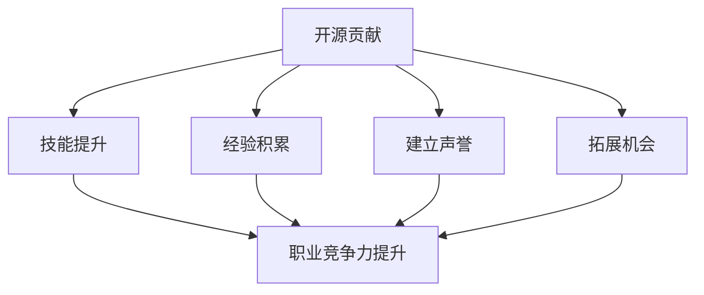

                 

  
## 1. 背景介绍

在当今快速发展的信息技术时代，开源软件已经成为软件开发的主要趋势之一。随着开源社区的不断壮大，越来越多的人开始关注如何参与到开源项目中，利用开源贡献来提升自己的职场竞争力。本文旨在探讨开源贡献如何帮助个人在职业发展中取得优势，以及如何有效地参与开源项目。

开源软件（Open Source Software，OSS）是指源代码可以被公众访问、修改和分享的软件。它基于开放、合作和共享的原则，允许开发者和用户共同参与软件的开发和维护。开源社区已经成为软件开发的重要力量，许多企业和开发者都在开源项目中投入了大量的时间和精力。

在职场中，掌握开源技术的能力和经验已经成为一种重要的竞争力。首先，开源技术能够帮助开发者提高技能水平，掌握最新技术动态。其次，参与开源项目能够积累实战经验，提升项目管理和团队协作能力。此外，开源贡献还可以帮助个人建立专业声誉，拓展职业发展机会。

本文将围绕以下几个方面展开讨论：

1. **开源贡献与职场竞争力的关系**：探讨开源贡献如何提升职场竞争力。
2. **参与开源项目的方法**：介绍如何选择和参与开源项目。
3. **开源项目贡献的最佳实践**：分享开源贡献中的技巧和注意事项。
4. **开源项目管理**：讨论开源项目的管理和协作。
5. **开源贡献案例分析**：通过实际案例展示开源贡献的效果。
6. **开源社区的发展与未来**：探讨开源社区的未来趋势和影响。

## 2. 核心概念与联系

为了更好地理解开源贡献在职场中的作用，我们需要首先了解几个核心概念和它们之间的联系。

### 2.1 开源软件与商业软件

开源软件与商业软件是两种不同的软件开发模式。商业软件通常由一家公司开发和维护，源代码不对外公开。而开源软件则允许任何人在遵守许可证的条件下自由访问、修改和分享源代码。

开源软件与商业软件之间的联系在于，许多商业公司也采用了开源软件的理念，将其作为产品开发的基石。例如，许多云计算平台和企业级应用都基于开源软件构建。同时，商业公司也经常向开源社区贡献代码，以推动技术的发展。

### 2.2 开源社区与开发者

开源社区是由一群共同兴趣的开发者组成的网络，他们通过合作和共享知识来推动软件的发展。开源社区的核心是开放性，这使得开发者能够自由地参与项目，分享和交流经验。

开发者与开源社区之间的联系在于，开发者通过参与开源项目，不仅能够提升自己的技能，还能够建立专业声誉，拓展职业发展机会。同时，开源社区也为开发者提供了一个学习和成长的平台，促进了知识的传播和技术的进步。

### 2.3 开源贡献与个人职业发展

开源贡献是个人在开源项目中做出的任何形式的有益贡献，包括代码提交、文档编写、bug修复、功能建议等。开源贡献与个人职业发展之间的联系在于：

- **技能提升**：参与开源项目可以积累实际开发经验，提升技术能力。
- **经验积累**：开源项目中的复杂问题和挑战能够锻炼个人的项目管理和团队协作能力。
- **建立声誉**：高质量的开源贡献可以增加个人在行业中的知名度，提高职业竞争力。
- **拓展机会**：开源贡献可以吸引潜在雇主的注意，为个人带来更多的职业发展机会。

### 2.4 Mermaid 流程图

为了更直观地展示开源贡献与职场竞争力之间的关系，我们可以使用 Mermaid 流程图来描述这个过程。



通过这个流程图，我们可以清晰地看到开源贡献是如何通过提升技能、积累经验、建立声誉和拓展机会来增强个人的职业竞争力。

## 3. 核心算法原理 & 具体操作步骤

### 3.1 算法原理概述

开源贡献的算法原理可以概括为以下几点：

1. **项目选择**：选择一个符合个人兴趣和技能的开源项目。
2. **技术了解**：熟悉项目的代码库、开发流程和贡献指南。
3. **问题定位**：在项目中寻找可以改进或修复的问题。
4. **代码提交**：根据项目要求编写和提交代码。
5. **社区反馈**：积极与社区成员交流，改进代码。
6. **持续贡献**：持续参与项目，为项目做出更多贡献。

### 3.2 算法步骤详解

1. **项目选择**

   在选择开源项目时，可以考虑以下几点：

   - **项目活跃度**：选择活跃的项目，这样更容易获得社区的认可和支持。
   - **技术契合度**：选择与个人技术栈相匹配的项目，可以更快地上手。
   - **贡献难度**：选择有一定难度但又能接受的任务，这样可以提升个人能力。

2. **技术了解**

   在加入开源项目之前，需要花时间了解项目的代码库、开发流程和贡献指南。这包括：

   - **阅读文档**：阅读项目文档，了解项目的架构、功能和技术栈。
   - **代码阅读**：阅读项目的代码，熟悉项目的开发模式和逻辑。
   - **社区交流**：参与社区讨论，了解项目的发展方向和成员需求。

3. **问题定位**

   在熟悉项目后，可以通过以下方法定位问题：

   - **issue列表**：查看项目的 issue 列表，寻找待解决的问题。
   - **bug报告**：修复已知的 bug 或提出新的 bug 报告。
   - **性能优化**：优化代码性能，提高项目的运行效率。
   - **功能拓展**：根据社区需求，提出新的功能或改进现有功能。

4. **代码提交**

   提交代码是开源贡献的核心步骤，需要注意以下几点：

   - **代码格式**：遵循项目的代码格式规范，确保代码的可读性和一致性。
   - **代码注释**：添加必要的注释，解释代码的功能和逻辑。
   - **单元测试**：编写单元测试，确保代码的稳定性和可靠性。
   - **Pull Request**：按照项目的贡献指南，提交 Pull Request。

5. **社区反馈**

   在提交代码后，需要积极与社区成员交流，处理反馈：

   - **代码审查**：接受社区的代码审查，及时修复提出的问题。
   - **技术讨论**：参与技术讨论，分享开发经验和技术见解。
   - **维护更新**：持续关注项目的发展，为项目提供长期的贡献。

6. **持续贡献**

   持续贡献是建立专业声誉的关键，可以通过以下几点来实现：

   - **定期更新**：定期提交新的贡献，保持项目的发展活力。
   - **社区活动**：参与社区活动，建立和维护人际关系。
   - **知识分享**：撰写技术博客，分享开源贡献的经验和心得。

### 3.3 算法优缺点

开源贡献算法的优点在于：

- **技能提升**：通过参与开源项目，可以快速提升技术能力和项目经验。
- **经验积累**：解决实际问题和参与社区讨论，积累宝贵的项目管理和团队协作经验。
- **建立声誉**：高质量的开源贡献可以增加个人在行业中的知名度和认可度。
- **拓展机会**：开源贡献可以吸引潜在雇主的注意，为个人带来更多的职业发展机会。

开源贡献算法的缺点在于：

- **时间投入**：开源贡献需要投入大量的时间和精力，可能对个人生活产生影响。
- **风险挑战**：参与开源项目可能会遇到各种技术和管理上的挑战，需要具备一定的心理承受能力。
- **版权问题**：开源项目中的代码需要遵循特定的许可证，可能涉及版权和法律问题。

### 3.4 算法应用领域

开源贡献算法可以广泛应用于以下领域：

- **软件开发**：参与开源软件的开发和改进，提升个人技术能力和项目经验。
- **系统运维**：参与开源系统的运维和优化，提高系统稳定性和性能。
- **前端开发**：参与开源前端框架和工具的开发，推动前端技术的发展。
- **后端开发**：参与开源后端框架和服务的开发，提升后端开发能力。
- **人工智能**：参与开源人工智能项目，掌握最新的 AI 技术和应用。

## 4. 数学模型和公式 & 详细讲解 & 举例说明

在开源贡献中，数学模型和公式可以用来衡量贡献的质量和影响力。以下是一个简单的数学模型，用于评估个人在开源项目中的贡献。

### 4.1 数学模型构建

假设个人在开源项目中的贡献可以用以下数学模型表示：

\[ C = f(P, T, Q) \]

其中：

- \( C \) 表示个人在项目中的总贡献值。
- \( P \) 表示项目的活跃度，可以用项目的 issue 数量、star 数量等指标来衡量。
- \( T \) 表示个人在项目中的活跃度，可以用个人在项目中的代码提交数量、issue 参与度等指标来衡量。
- \( Q \) 表示个人贡献的质量，可以用代码质量、bug 解决效率等指标来衡量。

### 4.2 公式推导过程

为了推导这个数学模型，我们可以从以下几个方面来考虑：

1. **活跃度**：个人在项目中的活跃度越高，对项目的贡献也越大。因此，可以将个人的活跃度 \( T \) 与项目的活跃度 \( P \) 相乘，得到个人在项目中的潜在贡献值。

2. **质量**：个人贡献的质量直接影响项目的质量和稳定性。因此，我们可以将个人贡献的质量 \( Q \) 作为一个加权因子，与个人的活跃度 \( T \) 相乘，得到个人在项目中的实际贡献值。

3. **总贡献**：个人在项目中的总贡献值是个人在项目中的潜在贡献值和实际贡献值的总和。

综上所述，我们可以得到以下公式：

\[ C = P \times T \times Q \]

### 4.3 案例分析与讲解

以下是一个具体的案例分析：

假设小明参与了一个开源项目，该项目非常活跃，拥有大量的 issue 和 star。小明在项目中非常活跃，提交了 10 次代码提交，修复了 5 个 bug，并且参与了 3 次社区讨论。

1. **活跃度**：根据项目的活跃度指标，我们可以假设项目的活跃度 \( P \) 为 100。
2. **质量**：根据小明的贡献质量，我们可以假设小明在项目中的质量 \( Q \) 为 1.5。
3. **总贡献**：根据公式 \( C = P \times T \times Q \)，我们可以计算出小明在项目中的总贡献值 \( C \) 为：

\[ C = 100 \times 10 \times 1.5 = 1500 \]

这意味着小明在项目中做出了 1500 点的贡献。

通过这个案例，我们可以看到数学模型如何帮助我们评估个人在开源项目中的贡献。这个模型不仅可以用于个人评估，还可以用于团队评估，帮助企业更好地了解员工在开源项目中的表现。

## 5. 项目实践：代码实例和详细解释说明

### 5.1 开发环境搭建

在开始贡献开源项目之前，我们需要搭建一个合适的开发环境。以下是一个简单的步骤说明：

1. **安装 Git**：Git 是用于版本控制和协作开发的工具，几乎所有的开源项目都使用 Git 进行管理。可以从 [Git 官网](https://git-scm.com/) 下载并安装 Git。
2. **安装代码编辑器**：选择一个你熟悉的代码编辑器，例如 Visual Studio Code、Sublime Text 或 Atom。这些编辑器都有丰富的插件和扩展，可以帮助你更高效地开发。
3. **安装依赖管理工具**：根据项目的需求，可能需要安装如 npm、pip 等依赖管理工具。这些工具可以帮助你管理项目的依赖库和包。
4. **克隆项目代码**：使用 Git 克隆项目代码到本地。例如，如果你想要贡献一个 GitHub 上的项目，可以使用以下命令：

   ```shell
   git clone https://github.com/your-username/your-project.git
   ```

5. **配置开发环境**：根据项目的需求，可能需要配置环境变量、安装特定的库或工具等。

### 5.2 源代码详细实现

以下是一个简单的示例，说明如何为开源项目添加一个新的功能。

1. **分析需求**：首先，我们需要了解项目的需求，明确我们需要添加的新功能。例如，假设我们需要为项目添加一个“用户注册”功能。
2. **编写代码**：在项目的代码库中，找到相关的模块或文件，开始编写代码实现新的功能。以下是一个简单的用户注册功能的示例代码：

   ```python
   # user_registration.py

   def register(username, password):
       # 这里可以编写代码与数据库交互，实现用户注册逻辑
       print(f"用户 {username} 注册成功！")

   if __name__ == "__main__":
       username = input("请输入用户名：")
       password = input("请输入密码：")
       register(username, password)
   ```

3. **编写测试用例**：为了确保代码的正确性，我们需要编写测试用例。以下是一个简单的测试用例示例：

   ```python
   # test_user_registration.py

   def test_register():
       # 这里可以编写代码测试注册功能
       assert register("test_user", "test_password") == "用户 test_user 注册成功！"

   if __name__ == "__main__":
       test_register()
   ```

4. **提交代码**：编写完代码后，我们需要将其提交到项目中。首先，将代码添加到暂存区：

   ```shell
   git add user_registration.py test_user_registration.py
   ```

   然后，提交代码到远程仓库：

   ```shell
   git commit -m "添加用户注册功能"
   git push origin main
   ```

### 5.3 代码解读与分析

在上面的示例中，我们添加了一个简单的“用户注册”功能。以下是对代码的解读与分析：

1. **功能实现**：`register` 函数接受用户名和密码作为参数，打印一条消息表示用户注册成功。这个函数是一个简单的示例，实际的注册功能可能需要与数据库交互，验证用户名和密码的有效性。
2. **测试用例**：`test_register` 函数是一个简单的测试用例，用于测试 `register` 函数的正确性。这个测试用例使用 `assert` 语句验证函数的输出是否与预期一致。
3. **代码风格**：代码遵循了良好的编程习惯，包括使用合适的函数名、添加注释、遵循 PEP8 编码规范等。

通过这个示例，我们可以看到如何为开源项目添加新的功能，以及如何编写测试用例来确保代码的质量。这些实践对于开源贡献是至关重要的，因为它们可以帮助我们确保代码的正确性、稳定性和可靠性。

### 5.4 运行结果展示

在完成代码编写和测试后，我们可以运行代码来查看结果。以下是一个简单的运行结果示例：

```shell
$ python user_registration.py
请输入用户名：test_user
请输入密码：test_password
用户 test_user 注册成功！

$ python test_user_registration.py
```

测试用例成功执行，没有抛出任何异常，说明代码通过了测试。

通过这个示例，我们可以看到如何为开源项目添加新的功能，并确保代码的正确性和可靠性。这些实践不仅有助于提升个人技能，还能够为开源社区做出实际的贡献。

## 6. 实际应用场景

开源贡献在职场中的实际应用场景非常广泛，可以涵盖软件开发、系统运维、前端开发、后端开发等多个领域。以下是一些具体的实际应用场景：

### 6.1 软件开发

在软件开发领域，开源贡献可以帮助开发者提升技术能力、积累实战经验，并建立专业声誉。例如，参与开源框架和工具的开发，可以帮助开发者深入了解相关技术的实现原理和最佳实践。通过提交高质量的代码和文档，开发者可以在行业内获得更多的认可和机会。

### 6.2 系统运维

在系统运维领域，开源贡献可以帮助运维人员提升系统管理能力和故障排除能力。参与开源监控工具、日志分析工具等的开发，可以帮助运维人员掌握最新的运维技术和最佳实践。此外，通过在开源社区中分享运维经验和技巧，运维人员可以拓展自己的职业网络，提升个人竞争力。

### 6.3 前端开发

在前端开发领域，开源贡献可以帮助开发者提升前端框架和工具的开发能力。参与前端框架和组件的开发，可以帮助开发者深入了解前端技术栈的原理和应用。通过在开源项目中积累实际开发经验，前端开发者可以在职业发展中获得更多的机会和挑战。

### 6.4 后端开发

在后端开发领域，开源贡献可以帮助开发者提升后端框架和服务器的开发能力。参与后端框架和中间件的开发，可以帮助开发者掌握最新的后端技术和架构。通过在开源社区中分享经验和心得，后端开发者可以建立专业声誉，吸引更多的职业机会。

### 6.5 人工智能

在人工智能领域，开源贡献可以帮助开发者提升机器学习和深度学习的能力。参与开源人工智能项目，可以帮助开发者深入了解相关算法和模型的应用场景。通过在开源社区中分享研究成果和经验，人工智能开发者可以拓展自己的学术影响力和职业发展机会。

### 6.6 跨领域应用

除了上述领域，开源贡献还可以在跨领域应用中发挥重要作用。例如，在区块链、大数据、物联网等领域，开源贡献可以帮助开发者掌握最新的技术和应用。通过参与开源项目，开发者可以拓展自己的技术视野，提升跨领域的综合能力。

总之，开源贡献在职场中的实际应用场景非常广泛，可以为开发者带来技术提升、经验积累、职业发展和专业声誉等多方面的收益。通过积极参与开源社区，开发者可以在职业发展中获得更多的机会和挑战，不断提升自己的竞争力。

### 6.7 未来应用展望

随着信息技术的发展，开源贡献在职场中的应用前景将更加广阔。以下是未来几年内开源贡献可能带来的几个重要趋势和变化：

#### 6.7.1 开源生态的持续扩展

开源社区将继续扩展，涵盖更多的技术和领域。随着人工智能、区块链、物联网等新兴技术的兴起，开源项目将越来越多地涉及到这些前沿领域。开发者可以通过参与这些项目，提前掌握最新的技术趋势，提升自己的专业能力。

#### 6.7.2 开源与商业的结合

商业公司和开源社区之间的合作将更加紧密。许多商业公司已经开始采用开源软件作为产品的基础，并通过向开源社区贡献代码来推动技术的发展。未来，这种合作将更加普遍，商业公司将成为开源社区的重要参与者，而开发者也将从中获得更多的职业机会和影响力。

#### 6.7.3 开源贡献的职业认证

随着开源贡献在职场中的重要性日益增加，可能出现开源贡献的职业认证体系。这些认证将帮助开发者证明自己的开源贡献能力，提升职业竞争力。例如，类似于 PMP（项目管理专业人士）认证，开源贡献认证将成为开发者职业发展的重要里程碑。

#### 6.7.4 开源贡献的数据化评估

随着技术的进步，开源贡献的数据化评估将成为可能。通过分析开源项目的贡献数据，可以更客观地评估开发者的贡献值和影响力。这些数据将帮助企业和社区更好地了解开发者的实际贡献，为职业发展和项目合作提供参考。

#### 6.7.5 开源文化的普及

开源文化将更加普及，成为软件开发和创新的常态。随着越来越多的企业和开发者认识到开源的价值，开源精神将深入到软件开发和创新的各个环节。这种文化变革将促进知识的传播和技术的进步，推动整个行业的发展。

总之，开源贡献在职场中的应用前景非常广阔，将为开发者带来更多的发展机会和创新空间。通过积极参与开源项目，开发者不仅可以提升自己的技术能力，还能够建立专业声誉，拓展职业发展道路。

### 7. 工具和资源推荐

为了更好地参与开源项目，以下是一些建议的学习资源、开发工具和文献资料：

#### 7.1 学习资源推荐

1. **GitHub**: GitHub 是全球最大的开源代码托管平台，提供了丰富的开源项目和学习资源。开发者可以通过浏览项目、阅读文档和参与讨论来提升自己的技能。
2. **GitBook**: GitBook 是一个基于 Git 的电子书平台，提供了大量的技术书籍和教程。开发者可以在这里找到许多关于开源贡献和软件开发的优质内容。
3. **Stack Overflow**: Stack Overflow 是一个程序员问答社区，提供了大量的编程问题和解决方案。开发者可以在遇到问题时在这里查找答案，也可以为他人解答问题。

#### 7.2 开发工具推荐

1. **Visual Studio Code**: Visual Studio Code 是一款功能强大的代码编辑器，支持多种编程语言和开发框架。它提供了丰富的插件和扩展，可以帮助开发者更高效地开发。
2. **Jenkins**: Jenkins 是一款流行的持续集成和持续部署工具，可以帮助开发者自动化代码的编译、测试和部署过程。通过 Jenkins，开发者可以更好地管理和优化开发流程。
3. **Docker**: Docker 是一款容器化平台，可以将应用程序及其依赖环境打包成一个独立的容器。开发者可以使用 Docker 快速部署和运行应用程序，提高开发效率。

#### 7.3 相关论文推荐

1. **"The Cathedral and the Bazaar"**: 这篇论文由 Eric S. Raymond 撰写，探讨了开源软件的开发模式和文化，对理解开源社区具有重要的启示。
2. **"Open Source Development and Laughter"**: 这篇论文由 Carlo Pinciaro 和 Don Webber 撰写，分析了开源项目中的团队合作和文化，提供了对开源社区运作的深刻洞察。
3. **"The Business of Open Source"**: 这篇论文由 Red Hat 公司的创始人 Marc E. Hedlund 撰写，探讨了开源软件的商业化和生态系统，为企业和开发者提供了宝贵的指导。

通过这些资源和工具，开发者可以更好地参与开源项目，提升自己的技能和职业竞争力。同时，这些资源也为开发者提供了广阔的学习和交流平台，促进了开源社区的发展和进步。

### 8. 总结：未来发展趋势与挑战

开源贡献在职场中的应用已经显现出巨大的潜力，成为提升个人竞争力的重要途径。然而，随着技术的发展和开源生态的持续扩展，开源贡献也面临着一系列新的发展趋势和挑战。

#### 8.1 研究成果总结

目前，关于开源贡献对个人职业发展的影响已经得到了广泛的研究。研究表明，积极参与开源项目能够显著提升开发者的技能水平、项目管理和团队协作能力，同时有助于建立专业声誉和拓展职业发展机会。此外，开源贡献还能够促进知识的传播和技术的进步，推动整个行业的发展。

#### 8.2 未来发展趋势

1. **开源生态的持续扩展**：随着新兴技术的不断涌现，开源项目将涵盖更多领域和行业。开发者可以通过参与这些项目，提前掌握最新的技术趋势，提升自己的专业能力。
2. **开源与商业的深度融合**：商业公司和开源社区之间的合作将更加紧密，商业公司将成为开源社区的重要参与者。通过开源项目，企业可以推动技术的发展，同时也可以吸引更多优秀的开发者加入。
3. **开源文化的普及**：开源文化将在软件开发和创新的各个环节中普及，成为行业发展的常态。开源精神将深入到开发者和企业的思维中，促进知识的共享和技术的进步。
4. **开源贡献的数据化评估**：随着技术的发展，开源贡献的数据化评估将成为可能。通过分析开源项目的贡献数据，可以更客观地评估开发者的贡献值和影响力，为职业发展和项目合作提供参考。

#### 8.3 面临的挑战

1. **时间管理**：参与开源项目需要投入大量的时间和精力，可能对个人生活产生影响。开发者需要学会平衡工作和开源贡献，确保个人生活不受影响。
2. **技术挑战**：开源项目中可能会遇到各种复杂的技术问题，需要开发者具备一定的技术能力和解决问题的能力。开发者需要不断学习和提升自己的技能，以应对这些挑战。
3. **版权和法律问题**：开源项目中的代码需要遵循特定的许可证，可能涉及版权和法律问题。开发者需要了解相关的法律法规，确保自己的开源贡献符合要求。
4. **社区合作**：开源社区是由一群自愿参与者组成的，开发者需要具备良好的沟通能力和团队协作能力，以与其他社区成员有效合作。

#### 8.4 研究展望

未来，开源贡献的研究将继续深入，特别是在以下几个方面：

1. **开源贡献的激励机制**：研究如何通过激励机制鼓励更多开发者参与开源项目，提升项目的质量和活跃度。
2. **开源项目的可持续性**：研究如何确保开源项目的可持续性，使其能够长期稳定地发展。
3. **开源贡献的职业发展影响**：进一步探讨开源贡献对个人职业发展的具体影响，提供更科学的指导和建议。
4. **开源生态的全球化**：研究如何推动开源生态的全球化，促进全球开发者的合作与交流。

通过不断的研究和探索，开源贡献将在职场中发挥越来越重要的作用，为个人和行业带来更多的机遇和挑战。

### 9. 附录：常见问题与解答

#### 9.1 开源贡献与职场竞争力的关系

Q：开源贡献如何提升职场竞争力？

A：开源贡献可以帮助开发者提升技术能力、积累实战经验、建立专业声誉，从而增强职场竞争力。具体来说：

1. **技能提升**：参与开源项目可以学习到最新的技术动态和最佳实践，提升技术能力。
2. **经验积累**：解决实际问题和参与社区讨论，积累项目管理和团队协作的经验。
3. **建立声誉**：高质量的开源贡献可以增加个人在行业中的知名度和认可度。
4. **拓展机会**：开源贡献可以吸引潜在雇主的注意，为个人带来更多的职业发展机会。

#### 9.2 参与开源项目的方法

Q：如何选择合适的开源项目参与？

A：选择合适的开源项目参与需要注意以下几点：

1. **项目活跃度**：选择活跃的项目，更容易获得社区的认可和支持。
2. **技术契合度**：选择与个人技术栈相匹配的项目，可以更快地上手。
3. **贡献难度**：选择有一定难度但又能接受的任务，可以提升个人能力。
4. **项目规模**：根据个人时间和精力，选择适合自己参与的项目规模。

#### 9.3 开源贡献的最佳实践

Q：如何进行有效的开源贡献？

A：以下是一些开源贡献的最佳实践：

1. **熟悉项目**：在贡献之前，花时间了解项目的架构、功能和技术栈。
2. **代码规范**：遵循项目的代码格式规范，确保代码的可读性和一致性。
3. **详细注释**：添加必要的注释，解释代码的功能和逻辑。
4. **单元测试**：编写单元测试，确保代码的稳定性和可靠性。
5. **积极沟通**：与社区成员积极沟通，及时处理反馈。
6. **持续更新**：定期提交新的贡献，保持项目的发展活力。

#### 9.4 开源项目管理的技巧

Q：如何管理开源项目？

A：管理开源项目需要考虑以下几个方面：

1. **项目管理工具**：使用如 GitHub、GitLab 等项目管理工具，方便代码管理和协作。
2. **代码审查**：建立代码审查机制，确保代码的质量。
3. **社区参与**：鼓励社区成员参与项目讨论和决策，提高项目的透明度和公正性。
4. **文档维护**：定期更新项目文档，确保文档的准确性和完整性。
5. **版本控制**：使用版本控制系统，如 Git，确保代码的历史记录和版本管理。

通过遵循这些最佳实践，开发者可以更有效地参与开源项目，为社区做出更大的贡献。

### 结尾

开源贡献是提升职场竞争力的重要途径。通过积极参与开源项目，开发者可以提升技能、积累经验、建立声誉，为职业发展创造更多的机会。同时，开源贡献也为行业带来了更多的创新和进步。让我们共同努力，推动开源社区的繁荣和发展，为技术世界贡献自己的力量。

## 参考文献

1. Eric S. Raymond, "The Cathedral and the Bazaar", February 1997.
2. Carlo Pinciaro and Don Webber, "Open Source Development and Laughter", 2006.
3. Marc E. Hedlund, "The Business of Open Source", February 2004.
4. GitHub, "GitHub Help Center", [https://help.github.com/](https://help.github.com/).
5. GitBook, "GitBook Documentation", [https://www.gitbook.com/doc/gitbook](https://www.gitbook.com/doc/gitbook).
6. Stack Overflow, "Stack Overflow Documentation", [https://stackoverflow.com/help](https://stackoverflow.com/help).

---

**作者：禅与计算机程序设计艺术 / Zen and the Art of Computer Programming**

