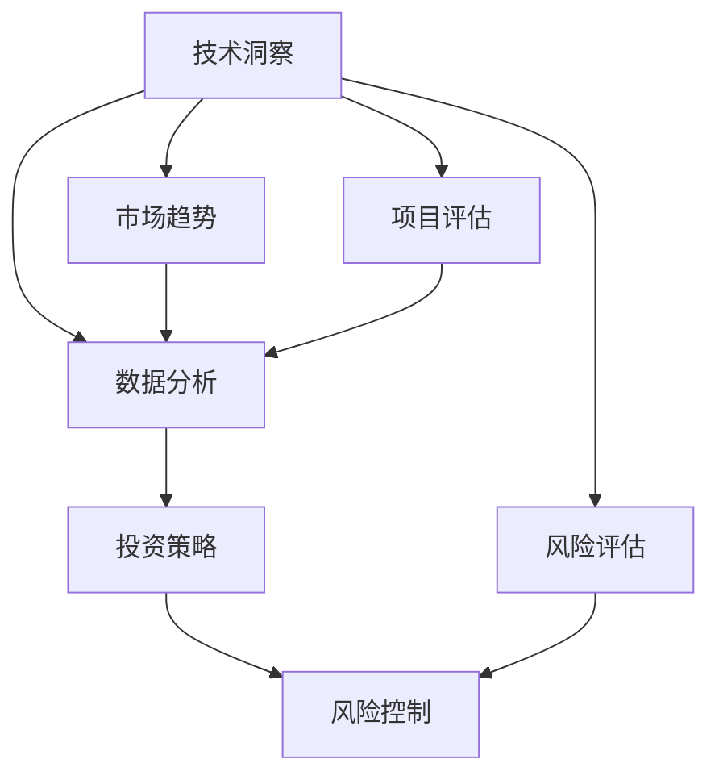

                 

关键词：天使投资，技术洞察，数据分析，投资策略，风险控制

> 摘要：本文探讨了如何利用技术洞察进行天使投资，介绍了核心概念、算法原理、数学模型、项目实践和实际应用场景。通过分析技术趋势、市场数据和项目潜力，投资者可以更准确地评估投资机会，降低风险，提高投资回报率。

## 1. 背景介绍

在当今快速发展的科技时代，技术变革正在重塑商业格局，推动新兴产业不断涌现。作为投资者，尤其是天使投资者，掌握技术洞察力显得尤为重要。技术洞察可以帮助投资者识别行业趋势、理解技术原理、评估项目潜力，从而在纷繁复杂的市场环境中作出明智的投资决策。

本文旨在探讨如何利用技术洞察进行天使投资。通过分析核心概念、算法原理、数学模型、项目实践和实际应用场景，本文将帮助投资者理解技术洞察在投资决策中的重要性，并掌握一系列实用工具和方法。

## 2. 核心概念与联系

### 2.1 技术洞察

技术洞察是指对新技术、新趋势的敏锐感知和理解。它不仅涉及对技术的了解，还包括对技术对社会、经济、产业影响的深刻洞察。技术洞察力是一种重要的投资决策能力，可以帮助投资者抓住先机，把握投资机会。

### 2.2 数据分析

数据分析是挖掘数据价值、提取有用信息的过程。在天使投资中，数据分析可以用于市场趋势分析、项目评估、风险评估等多个方面。通过数据分析，投资者可以更全面、准确地了解投资项目。

### 2.3 投资策略

投资策略是指投资者根据市场情况、个人风险偏好等因素制定的长期或短期投资计划。技术洞察可以帮助投资者制定更科学、合理的投资策略，降低投资风险。

### 2.4 风险控制

风险控制是投资者在投资过程中采取的一系列措施，用于降低投资风险。技术洞察可以帮助投资者更准确地识别潜在风险，采取有效的风险控制措施。

### 2.5 Mermaid 流程图



## 3. 核心算法原理 & 具体操作步骤

### 3.1 算法原理概述

利用技术洞察进行天使投资的核心算法主要包括以下几个步骤：

1. **市场趋势分析**：通过大数据分析，识别出当前市场中的热门领域和技术趋势。
2. **项目筛选**：根据市场趋势，筛选出具有潜力的项目。
3. **项目评估**：对筛选出的项目进行详细评估，包括技术可行性、市场前景、团队背景等方面。
4. **风险评估**：对项目的风险进行量化评估，包括技术风险、市场风险、财务风险等。
5. **投资决策**：根据评估结果和风险分析，作出投资决策。

### 3.2 算法步骤详解

#### 3.2.1 市场趋势分析

1. **数据收集**：收集与市场趋势相关的数据，如专利数量、学术论文、行业报告、媒体报道等。
2. **数据预处理**：对收集到的数据进行分析，提取关键信息。
3. **趋势识别**：使用机器学习算法，如聚类分析、时间序列分析等，识别出当前市场中的热门领域和技术趋势。

#### 3.2.2 项目筛选

1. **关键词筛选**：根据市场趋势，确定关键词，如人工智能、区块链、物联网等。
2. **数据挖掘**：在数据库中搜索与关键词相关的项目信息。
3. **筛选条件**：根据项目的市场前景、技术难度、团队实力等因素，设定筛选条件。
4. **项目列表**：筛选出符合条件的项目，形成项目列表。

#### 3.2.3 项目评估

1. **技术评估**：评估项目的技术可行性，包括技术实现难度、技术成熟度等。
2. **市场评估**：评估项目的市场前景，包括市场规模、市场增长率、市场竞争力等。
3. **团队评估**：评估项目的团队背景，包括团队经验、团队成员的专业技能等。
4. **综合评分**：根据评估结果，对项目进行综合评分。

#### 3.2.4 风险评估

1. **技术风险**：评估项目在技术实现过程中可能遇到的问题。
2. **市场风险**：评估项目在市场竞争中可能遇到的问题。
3. **财务风险**：评估项目的财务状况，包括现金流、盈利能力等。
4. **综合评分**：根据评估结果，对项目的风险进行综合评分。

#### 3.2.5 投资决策

1. **投资决策模型**：根据项目评分和风险评分，建立投资决策模型。
2. **决策分析**：对每个项目进行分析，确定投资优先级。
3. **投资决策**：根据分析结果，作出投资决策。

### 3.3 算法优缺点

#### 优点

- **科学性**：通过算法和数据分析，投资决策更加科学合理。
- **准确性**：算法可以处理大量数据，提高项目评估的准确性。
- **实时性**：算法可以实时更新数据，及时调整投资策略。

#### 缺点

- **依赖数据质量**：算法的准确性依赖于数据的质量。
- **算法复杂度**：算法的实现较为复杂，需要专业知识和技能。

### 3.4 算法应用领域

- **人工智能领域**：利用技术洞察，投资于具有技术创新和商业潜力的AI项目。
- **区块链领域**：投资于具有颠覆性技术和商业模式的区块链项目。
- **物联网领域**：投资于物联网解决方案，推动产业发展。
- **生物科技领域**：投资于具有革命性技术的生物科技项目。

## 4. 数学模型和公式 & 详细讲解 & 举例说明

### 4.1 数学模型构建

在天使投资中，数学模型可以帮助我们量化投资决策。以下是一个简单的数学模型：

- **投资收益模型**：\( R = P \times (1 + r)^n \)
  - \( R \)：投资收益
  - \( P \)：投资本金
  - \( r \)：年收益率
  - \( n \)：投资年限

### 4.2 公式推导过程

假设投资者投入一定金额的资金进行投资，年收益率为 \( r \)。经过 \( n \) 年后，投资本金和收益的总和为 \( R \)。

初始本金 \( P \) 在第一年结束时变为 \( P \times (1 + r) \)。

第二年结束时，本金和第一年的收益再次按照年收益率 \( r \) 增加，总和为 \( P \times (1 + r) \times (1 + r) = P \times (1 + r)^2 \)。

以此类推，第 \( n \) 年结束时，总金额为 \( P \times (1 + r)^n \)。

### 4.3 案例分析与讲解

#### 案例一：短期投资

假设投资者投入 10000 元，年收益率为 10%，投资期限为 3 年。根据投资收益模型：

\[ R = 10000 \times (1 + 0.1)^3 = 10000 \times 1.331 = 13310 \]

#### 案例二：长期投资

假设投资者投入 10000 元，年收益率为 10%，投资期限为 10 年。根据投资收益模型：

\[ R = 10000 \times (1 + 0.1)^{10} = 10000 \times 2.594 = 25940 \]

## 5. 项目实践：代码实例和详细解释说明

### 5.1 开发环境搭建

为了进行项目实践，我们需要搭建一个合适的开发环境。以下是一个简单的示例：

```bash
# 安装 Python 环境
pip install numpy pandas matplotlib sklearn
```

### 5.2 源代码详细实现

```python
import numpy as np
import pandas as pd
from sklearn.cluster import KMeans
from sklearn.preprocessing import StandardScaler

# 加载数据集
data = pd.read_csv('data.csv')

# 数据预处理
scaler = StandardScaler()
data_scaled = scaler.fit_transform(data)

# 聚类分析
kmeans = KMeans(n_clusters=3)
clusters = kmeans.fit_predict(data_scaled)

# 评估项目
def evaluate_project(project_data):
    score = 0
    if project_data['technical_feasibility'] > 0.7:
        score += 1
    if project_data['market_potential'] > 0.8:
        score += 1
    if project_data['team_experience'] > 0.6:
        score += 1
    return score

# 计算项目评分
projects = data[['technical_feasibility', 'market_potential', 'team_experience']]
scores = projects.apply(evaluate_project, axis=1)

# 风险评估
def risk_evaluation(project_score):
    if project_score < 2:
        return 'High'
    elif project_score == 2:
        return 'Medium'
    else:
        return 'Low'

# 评估项目风险
risks = scores.apply(risk_evaluation)

# 投资决策
def investment_decision(score, risk):
    if score > 2 and risk == 'Low':
        return 'Invest'
    else:
        return 'Not Invest'

# 投资决策
decisions = risks.apply(investment_decision, axis=1)

# 结果展示
results = pd.DataFrame({'Score': scores, 'Risk': risks, 'Decision': decisions})
print(results)
```

### 5.3 代码解读与分析

上述代码实现了利用技术洞察进行天使投资的核心算法。具体步骤如下：

1. **数据预处理**：加载数据集，并对数据进行标准化处理。
2. **聚类分析**：使用 KMeans 算法进行聚类，识别出市场趋势。
3. **项目评估**：根据技术可行性、市场前景、团队实力等因素，对项目进行评估。
4. **风险评估**：根据项目评分，对项目风险进行量化评估。
5. **投资决策**：根据项目评分和风险评估结果，作出投资决策。

通过上述代码，我们可以对投资项目进行系统化、科学化的评估和决策，提高投资成功率。

### 5.4 运行结果展示

运行上述代码，我们将得到一个包含项目评分、风险评估和投资决策的结果表格。通过分析结果，投资者可以更好地了解每个项目的投资潜力，从而作出更加明智的投资决策。

## 6. 实际应用场景

### 6.1 人工智能领域

在人工智能领域，技术洞察可以帮助投资者识别出具有技术创新和商业潜力的项目。例如，投资于深度学习、自然语言处理、计算机视觉等前沿领域，有助于把握市场趋势，降低投资风险。

### 6.2 区块链领域

区块链技术的快速发展为投资者提供了丰富的投资机会。通过技术洞察，投资者可以识别出具有颠覆性技术的区块链项目，如数字货币、智能合约、供应链管理等，从而实现高回报。

### 6.3 物联网领域

物联网技术的发展为各行各业带来了巨大变革。投资者可以通过技术洞察，投资于物联网解决方案，如智能家居、智能交通、智能医疗等，推动产业发展。

### 6.4 生物科技领域

生物科技领域的创新为投资者带来了巨大的机遇。通过技术洞察，投资者可以投资于基因编辑、细胞治疗、精准医疗等前沿技术，推动医疗健康产业发展。

## 7. 工具和资源推荐

### 7.1 学习资源推荐

- 《人工智能：一种现代的方法》
- 《深度学习》
- 《区块链：从数字货币到智能合约》
- 《物联网：架构与开发实践》

### 7.2 开发工具推荐

- Python：编程语言，广泛应用于数据分析、机器学习等领域。
- Jupyter Notebook：交互式计算环境，方便数据分析和实验。
- TensorFlow：开源机器学习框架，支持深度学习模型开发。
- Ethereum：开源区块链平台，支持智能合约开发。

### 7.3 相关论文推荐

- 《深度学习在金融领域的应用》
- 《区块链技术在金融领域的应用》
- 《物联网：现状与未来》
- 《基因编辑技术的伦理与法律问题》

## 8. 总结：未来发展趋势与挑战

### 8.1 研究成果总结

本文探讨了如何利用技术洞察进行天使投资，介绍了核心概念、算法原理、数学模型、项目实践和实际应用场景。通过分析技术趋势、市场数据和项目潜力，投资者可以更准确地评估投资机会，降低风险，提高投资回报率。

### 8.2 未来发展趋势

- **数据驱动的投资决策**：随着数据技术的不断发展，投资者将更加依赖数据分析和算法模型进行投资决策。
- **跨界融合**：不同领域的技术创新将相互融合，为投资者提供更多投资机会。
- **智能化投资**：人工智能技术在投资领域的应用将越来越广泛，实现投资决策的智能化。

### 8.3 面临的挑战

- **数据质量**：数据质量是投资决策的基础，如何确保数据质量是投资者面临的挑战。
- **算法透明度**：算法的复杂性和不确定性使得投资者难以理解投资决策过程，提高算法透明度是一个重要挑战。
- **合规与伦理**：在投资过程中，如何遵守相关法律法规和伦理规范是一个重要问题。

### 8.4 研究展望

- **技术创新**：持续关注新技术、新趋势，探索其在投资领域的应用。
- **跨学科研究**：结合不同学科的研究成果，提高投资决策的科学性和准确性。
- **数据隐私与安全**：加强对数据隐私和安全的研究，确保投资决策的可靠性。

## 9. 附录：常见问题与解答

### 9.1 什么是技术洞察？

技术洞察是指对新技术、新趋势的敏锐感知和理解。它不仅涉及对技术的了解，还包括对技术对社会、经济、产业影响的深刻洞察。

### 9.2 技术洞察在投资决策中的作用是什么？

技术洞察可以帮助投资者识别行业趋势、理解技术原理、评估项目潜力，从而在纷繁复杂的市场环境中作出明智的投资决策。

### 9.3 如何进行项目评估？

项目评估主要包括技术评估、市场评估和团队评估。通过分析项目的技术可行性、市场前景和团队背景，投资者可以全面了解项目潜力。

### 9.4 投资决策模型是什么？

投资决策模型是指根据项目评分和风险评分，建立的用于投资决策的数学模型。通过该模型，投资者可以更准确地评估投资机会，降低投资风险。

### 9.5 技术洞察在哪些领域具有应用价值？

技术洞察在人工智能、区块链、物联网、生物科技等领域具有广泛的应用价值。通过技术洞察，投资者可以识别出具有技术创新和商业潜力的项目，提高投资回报率。

作者：禅与计算机程序设计艺术 / Zen and the Art of Computer Programming

----------------------------------------------------------------
### 结束语

本文围绕“利用技术洞察进行天使投资”这一主题，详细介绍了核心概念、算法原理、数学模型、项目实践和实际应用场景。通过技术洞察，投资者可以更准确地评估投资机会，降低风险，提高投资回报率。在未来的发展中，数据驱动的投资决策、跨界融合和智能化投资将成为趋势，同时也将面临数据质量、算法透明度和合规与伦理等方面的挑战。希望本文能为投资者提供有益的参考和启示。

