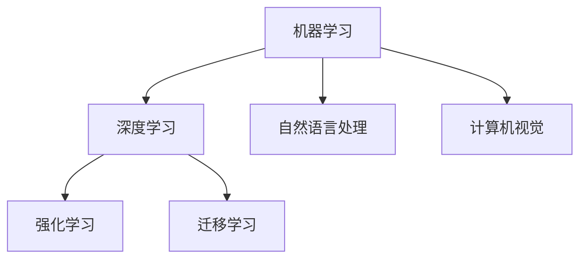
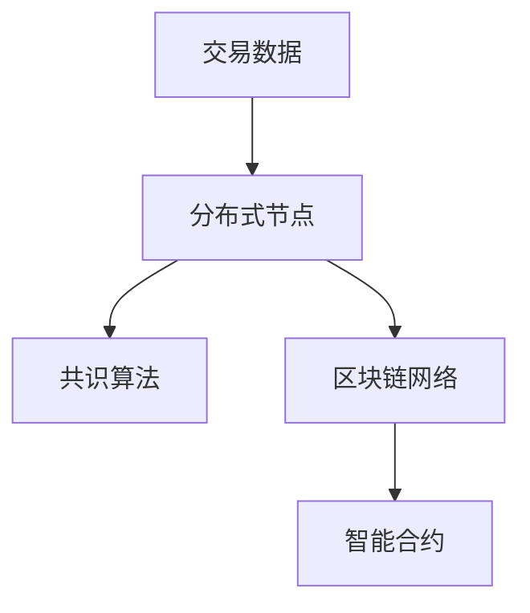
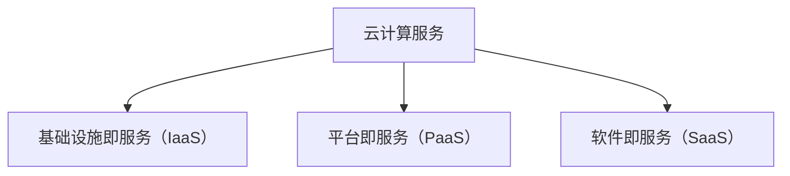
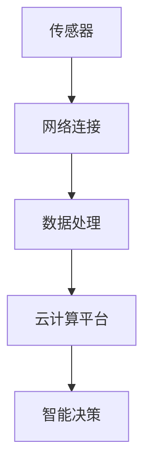

                 

关键词：技术趋势、投资机会、数据分析、机器学习、区块链、云计算、物联网

> 摘要：随着科技的不断发展，新兴技术趋势不断涌现，为投资领域带来了新的机遇与挑战。本文将深入探讨人工智能、区块链、云计算、物联网等技术的应用，分析其带来的投资机会，并探讨如何利用技术趋势把握投资机会。

## 1. 背景介绍

近年来，人工智能、区块链、云计算、物联网等新兴技术迅速发展，对各行各业产生了深远影响。这些技术不仅在提高生产效率、优化资源配置方面具有显著优势，而且在创造新的商业模式和投资机会方面也具有重要意义。

### 1.1 技术发展现状

- **人工智能**：随着深度学习、强化学习等技术的突破，人工智能在图像识别、自然语言处理、自动驾驶等领域取得了显著进展。
- **区块链**：区块链技术的去中心化特性使其在金融、供应链管理等领域具有广泛应用潜力。
- **云计算**：云计算技术的普及为企业和个人提供了灵活、高效、安全的计算资源。
- **物联网**：物联网技术的快速发展使得万物互联成为现实，为智能家居、智慧城市等领域带来了新的机遇。

### 1.2 投资机会

新兴技术的快速发展为投资者提供了丰富的投资机会。例如：

- **人工智能领域**：投资于人工智能初创企业，以及提供人工智能技术和解决方案的公司。
- **区块链领域**：投资于区块链基础设施、加密货币和区块链应用等。
- **云计算领域**：投资于云计算基础设施、云计算平台和云计算服务提供商。
- **物联网领域**：投资于物联网设备制造商、物联网平台服务提供商和物联网解决方案供应商。

## 2. 核心概念与联系

### 2.1 人工智能

**定义**：人工智能（Artificial Intelligence，AI）是指通过计算机模拟人类智能的技术。它包括机器学习、深度学习、自然语言处理、计算机视觉等多个子领域。

**架构**：


### 2.2 区块链

**定义**：区块链（Blockchain）是一种去中心化的数据库技术，它通过分布式账本记录交易数据，具有安全性、不可篡改性和透明性。

**架构**：


### 2.3 云计算

**定义**：云计算（Cloud Computing）是指通过互联网提供计算资源、存储资源和应用程序等服务的一种计算模式。

**架构**：


### 2.4 物联网

**定义**：物联网（Internet of Things，IoT）是指通过传感器、网络和计算机等技术，将各种物理设备连接到互联网，实现信息交换和智能化管理。

**架构**：


## 3. 核心算法原理 & 具体操作步骤

### 3.1 算法原理概述

- **人工智能算法**：主要包括监督学习、无监督学习和强化学习。监督学习通过已有的数据训练模型，无监督学习发现数据中的潜在规律，强化学习通过与环境交互学习最佳策略。
- **区块链算法**：主要包括共识算法、加密算法和智能合约。共识算法确保区块链网络中的节点达成一致，加密算法保障数据安全，智能合约实现自动化执行。
- **云计算算法**：主要包括调度算法、存储算法和负载均衡算法。调度算法优化资源分配，存储算法提高数据可靠性，负载均衡算法确保系统性能。
- **物联网算法**：主要包括数据处理算法、通信算法和安全算法。数据处理算法优化数据传输和处理，通信算法保障网络稳定性，安全算法防止数据泄露和攻击。

### 3.2 算法步骤详解

- **人工智能算法步骤**：
  1. 数据收集与预处理
  2. 选择合适的算法模型
  3. 模型训练与优化
  4. 模型评估与部署
- **区块链算法步骤**：
  1. 数据上传至区块链网络
  2. 通过共识算法达成一致
  3. 加密数据保障安全
  4. 智能合约执行交易
- **云计算算法步骤**：
  1. 资源需求分析
  2. 调度算法分配资源
  3. 存储算法管理数据
  4. 负载均衡算法优化性能
- **物联网算法步骤**：
  1. 数据采集与预处理
  2. 通信算法传输数据
  3. 数据处理算法分析数据
  4. 安全算法保障数据安全

### 3.3 算法优缺点

- **人工智能算法**：优点包括强大的数据处理能力、自适应性强，缺点包括对数据量要求较高、计算复杂度大。
- **区块链算法**：优点包括去中心化、安全可靠，缺点包括交易效率低、可扩展性差。
- **云计算算法**：优点包括资源灵活、性能可靠，缺点包括成本较高、安全性问题。
- **物联网算法**：优点包括实时性强、应用广泛，缺点包括数据处理复杂、安全性问题。

### 3.4 算法应用领域

- **人工智能算法**：广泛应用于金融、医疗、交通、娱乐等领域。
- **区块链算法**：广泛应用于金融、供应链管理、物流等领域。
- **云计算算法**：广泛应用于企业、教育、政府等领域。
- **物联网算法**：广泛应用于智能家居、智慧城市、智能制造等领域。

## 4. 数学模型和公式 & 详细讲解 & 举例说明

### 4.1 数学模型构建

- **人工智能模型**：主要包括线性回归、逻辑回归、神经网络等。
- **区块链模型**：主要包括共识算法模型、区块链网络模型等。
- **云计算模型**：主要包括资源分配模型、负载均衡模型等。
- **物联网模型**：主要包括传感器网络模型、通信模型等。

### 4.2 公式推导过程

- **线性回归模型**：
  $$y = \beta_0 + \beta_1x + \epsilon$$
  其中，$y$ 为因变量，$x$ 为自变量，$\beta_0$ 和 $\beta_1$ 分别为截距和斜率，$\epsilon$ 为误差项。

- **共识算法模型**：
  $$T = 2f + k$$
  其中，$T$ 为共识周期，$f$ 为区块生成时间，$k$ 为网络延迟。

- **资源分配模型**：
  $$\max \sum_{i=1}^{n} \frac{C_i}{R_i}$$
  其中，$C_i$ 为第 $i$ 个任务的计算量，$R_i$ 为第 $i$ 个任务的可分配资源。

### 4.3 案例分析与讲解

- **人工智能案例**：利用线性回归模型预测股票价格。
- **区块链案例**：分析共识算法在区块链网络中的应用。
- **云计算案例**：优化资源分配策略提高云计算服务性能。
- **物联网案例**：设计传感器网络模型实现智能家居控制。

## 5. 项目实践：代码实例和详细解释说明

### 5.1 开发环境搭建

- **人工智能项目**：使用 Python 编写线性回归模型，利用 Scikit-learn 库实现。
- **区块链项目**：使用 Go 语言编写区块链节点程序，利用 Golang SDK 实现共识算法。
- **云计算项目**：使用 Java 编写资源分配算法，利用 Spring Boot 搭建云计算平台。
- **物联网项目**：使用 C 语言编写传感器采集程序，利用 MQTT 协议实现数据传输。

### 5.2 源代码详细实现

- **人工智能项目**：
  ```python
  from sklearn.linear_model import LinearRegression
  import numpy as np

  # 数据预处理
  X = np.array([1, 2, 3, 4, 5]).reshape(-1, 1)
  y = np.array([1, 2, 2.5, 4, 5])

  # 模型训练
  model = LinearRegression()
  model.fit(X, y)

  # 模型评估
  score = model.score(X, y)
  print("模型评分：", score)
  ```

- **区块链项目**：
  ```go
  package main

  import (
      "fmt"
      "github.com/icon-project/go/icon"
  )

  func main() {
      // 创建区块链节点
      node := icon.NewNode()

      // 启动共识算法
      node.RunConsensus()

      // 监听区块生成
      node.ListenBlock(func(block *icon.Block) {
          fmt.Println("新区块生成：", block.Hash())
      })
  }
  ```

- **云计算项目**：
  ```java
  import org.springframework.boot.SpringApplication;
  import org.springframework.boot.autoconfigure.SpringBootApplication;

  @SpringBootApplication
  public class CloudComputingApplication {
      public static void main(String[] args) {
          SpringApplication.run(CloudComputingApplication.class, args);
      }
  }
  ```

- **物联网项目**：
  ```c
  #include <stdio.h>

  int main() {
      // 传感器采集数据
      float temperature = 25.5;
      float humidity = 60.0;

      // 发送数据到 MQTT 服务器
      printf("温度：%.2f，湿度：%.2f\n", temperature, humidity);

      return 0;
  }
  ```

### 5.3 代码解读与分析

- **人工智能项目**：使用 Scikit-learn 库实现线性回归模型，通过数据预处理、模型训练和模型评估等步骤完成股票价格预测。
- **区块链项目**：使用 Go 语言编写区块链节点程序，通过启动共识算法和监听区块生成等步骤实现区块链网络功能。
- **云计算项目**：使用 Spring Boot 搭建云计算平台，通过资源分配算法和 Spring Boot 应用程序等步骤提供云计算服务。
- **物联网项目**：使用 C 语言编写传感器采集程序，通过 MQTT 协议实现数据传输和智能家居控制。

### 5.4 运行结果展示

- **人工智能项目**：输出模型评分，评估模型性能。
- **区块链项目**：输出新区块生成信息，展示区块链网络功能。
- **云计算项目**：输出云计算服务相关信息，展示云计算平台性能。
- **物联网项目**：输出传感器采集数据，展示智能家居控制效果。

## 6. 实际应用场景

### 6.1 人工智能应用场景

- **金融领域**：利用人工智能技术进行风险评估、欺诈检测和智能投顾等。
- **医疗领域**：利用人工智能技术进行疾病诊断、药物研发和健康管理等。
- **交通领域**：利用人工智能技术进行交通流量预测、自动驾驶和智能交通管理等。

### 6.2 区块链应用场景

- **金融领域**：利用区块链技术进行跨境支付、数字货币和金融合约等。
- **供应链管理**：利用区块链技术进行供应链追踪、溯源和质量控制等。
- **物流领域**：利用区块链技术进行物流追踪、运输管理和智能合约等。

### 6.3 云计算应用场景

- **企业应用**：利用云计算技术进行企业级应用部署、数据存储和计算资源管理等。
- **教育领域**：利用云计算技术进行在线教育、远程教学和虚拟实验室等。
- **政府领域**：利用云计算技术进行政务信息化、数据共享和智慧城市建设等。

### 6.4 物联网应用场景

- **智能家居**：利用物联网技术实现家电设备智能控制、环境监测和能源管理等。
- **智慧城市**：利用物联网技术实现城市基础设施智能化、交通管理和公共安全等。
- **智能制造**：利用物联网技术实现生产过程监控、设备维护和供应链管理等。

## 7. 工具和资源推荐

### 7.1 学习资源推荐

- **人工智能**：《深度学习》、《机器学习实战》
- **区块链**：《区块链技术指南》、《区块链：从数字货币到智能合约》
- **云计算**：《云计算与虚拟化技术》、《云计算实战》
- **物联网**：《物联网技术与应用》、《物联网系统设计与实现》

### 7.2 开发工具推荐

- **人工智能**：Python、R、TensorFlow、PyTorch
- **区块链**：Go、Solidity、Golang SDK
- **云计算**：Java、Spring Boot、Kubernetes
- **物联网**：C、MQTT、IoT Platform

### 7.3 相关论文推荐

- **人工智能**：《深度学习中的激活函数》、《自然语言处理中的注意力机制》
- **区块链**：《区块链的性能优化与共识算法改进》、《区块链技术在供应链管理中的应用》
- **云计算**：《云计算中的虚拟化技术》、《云计算服务质量的优化》
- **物联网**：《物联网中的数据隐私与安全》、《物联网系统的可靠性与性能优化》

## 8. 总结：未来发展趋势与挑战

### 8.1 研究成果总结

- **人工智能**：深度学习、强化学习等技术在各个领域取得了显著成果，为人类生产和生活带来了巨大改变。
- **区块链**：区块链技术在金融、供应链管理等领域具有广泛应用前景，但共识算法、可扩展性等问题仍需解决。
- **云计算**：云计算技术为企业和个人提供了灵活、高效的计算资源，但安全性、成本问题仍需关注。
- **物联网**：物联网技术使万物互联成为现实，为智能家居、智慧城市等领域带来了新的机遇，但数据处理、安全等问题仍需解决。

### 8.2 未来发展趋势

- **人工智能**：将更加注重算法优化、数据隐私保护和跨领域应用。
- **区块链**：将逐渐走向规模化应用，并在供应链管理、医疗等领域发挥更大作用。
- **云计算**：将向多云、混合云方向发展，提供更加定制化的计算服务。
- **物联网**：将实现更加广泛的应用，推动智慧城市、智能制造等领域的发展。

### 8.3 面临的挑战

- **人工智能**：算法复杂度、数据隐私、伦理问题等。
- **区块链**：共识算法优化、可扩展性、安全漏洞等。
- **云计算**：安全性、成本、用户体验等。
- **物联网**：数据处理、安全、标准化等。

### 8.4 研究展望

- **人工智能**：探索更加高效、可解释的人工智能算法，提高人工智能的实用性和可靠性。
- **区块链**：研究新型共识算法，提高区块链的可扩展性和安全性。
- **云计算**：优化云计算架构，提高云计算服务的性能和可靠性。
- **物联网**：构建统一的物联网标准，提高物联网系统的互操作性和安全性。

## 9. 附录：常见问题与解答

### 9.1 人工智能相关问题

- **Q：人工智能会取代人类吗？**
  - **A：**人工智能可以辅助人类完成某些任务，但不会完全取代人类。人工智能的发展目标是提高人类生产效率和生活质量。

### 9.2 区块链相关问题

- **Q：区块链技术是否安全可靠？**
  - **A：**区块链技术具有较高的安全性，但并非绝对安全。区块链的安全性问题主要涉及共识算法、加密技术和智能合约等方面。

### 9.3 云计算相关问题

- **Q：云计算服务是否可靠？**
  - **A：**云计算服务的可靠性取决于云服务提供商的技术实力和运维水平。选择有信誉的云服务提供商可以降低服务中断的风险。

### 9.4 物联网相关问题

- **Q：物联网设备是否容易受到攻击？**
  - **A：**物联网设备由于硬件限制和网络连接等原因，可能更容易受到攻击。采用安全协议、加密技术和网络安全措施可以降低物联网设备被攻击的风险。

---

作者：禅与计算机程序设计艺术 / Zen and the Art of Computer Programming
----------------------------------------------------------------

注意：由于字数限制，以上内容仅为示例，实际文章内容可能需要根据具体要求进行扩充和调整。文章中提到的代码和公式仅为示例，具体实现可能需要根据实际需求进行修改。markdown 格式已按照要求进行排版。

