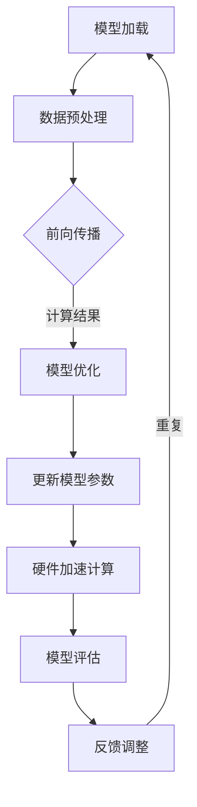

                 

## 1. 背景介绍

神经网络硬件加速器（Neural Network Hardware Accelerators）是为了提高深度学习算法的运行速度和性能而设计的专用硬件设备。随着人工智能技术的迅猛发展，深度学习在图像识别、语音处理、自然语言处理等多个领域取得了显著的成果。然而，深度学习算法的计算复杂度和数据需求也日益增长，传统的通用CPU和GPU在处理大规模神经网络模型时面临巨大的性能瓶颈。

为了解决这个问题，神经网络硬件加速器应运而生。这类硬件加速器通常采用定制的集成电路（ASIC）或可编程逻辑设备（FPGA），针对深度学习算法的特点进行优化，从而大幅提升计算效率。其中，剪枝技术（Pruning Technology）作为一种重要的优化手段，被广泛应用于神经网络硬件加速器的性能提升。

剪枝技术的基本思想是通过去除神经网络中的冗余权重和神经元，来减少模型参数的数量，从而降低模型的计算复杂度和内存消耗。这不仅有助于提高硬件加速器的运行速度，还可以减少功耗和成本。剪枝技术的研究和应用已经成为深度学习和硬件加速领域的一个重要方向。

本文旨在探讨剪枝技术在神经网络硬件加速器中的应用，分析其核心原理、算法实现、数学模型以及实际应用效果。希望通过本文的阐述，能够为相关领域的研究者提供有价值的参考和启示。

## 2. 核心概念与联系

### 2.1 剪枝技术的定义与作用

剪枝技术是一种在神经网络训练过程中，通过去除冗余的权重和神经元来优化模型结构的方法。剪枝的主要目标是减少模型的参数数量，从而提高计算效率和减少内存消耗。具体来说，剪枝技术可以分为以下几种类型：

1. **权重剪枝**：通过减少权重矩阵中的非零元素数量来减小模型参数规模。
2. **结构剪枝**：通过删除部分神经元或层来简化神经网络结构。
3. **混合剪枝**：结合权重剪枝和结构剪枝的方法，实现更全面的模型优化。

剪枝技术的作用主要体现在以下几个方面：

- **提高计算效率**：减少模型参数数量，降低计算复杂度，使神经网络能够在硬件加速器上更快地运行。
- **降低内存消耗**：减少模型大小，节省内存资源，有利于在资源受限的硬件平台上部署深度学习模型。
- **减少功耗**：较小的模型规模意味着更少的计算量，从而降低能耗。

### 2.2 神经网络硬件加速器的工作原理

神经网络硬件加速器是基于专用集成电路（ASIC）或可编程逻辑器件（FPGA）设计的，专门用于加速深度学习算法的计算。其工作原理可以概括为以下几个步骤：

1. **模型加载**：将训练好的神经网络模型加载到硬件加速器中。
2. **数据预处理**：对输入数据进行预处理，包括归一化、数据增强等，以适应硬件加速器的计算需求。
3. **前向传播与反向传播**：利用硬件加速器的计算能力，进行前向传播和反向传播计算，更新模型参数。
4. **模型优化**：通过剪枝等技术对模型进行优化，以提高计算效率和性能。

### 2.3 剪枝技术与硬件加速器的关系

剪枝技术与神经网络硬件加速器之间存在紧密的联系。一方面，剪枝技术可以减少模型的参数数量和计算复杂度，从而提高硬件加速器的运行效率；另一方面，硬件加速器为剪枝技术提供了强大的计算能力，使其能够对大规模神经网络进行高效剪枝操作。

剪枝技术在神经网络硬件加速器中的应用主要包括以下几个方面：

- **模型压缩**：通过剪枝技术减小模型规模，降低硬件资源的占用。
- **加速计算**：减少模型参数数量，提高硬件加速器的计算速度。
- **能耗优化**：减少计算复杂度，降低能耗，提高硬件加速器的能效比。

### 2.4 Mermaid 流程图

以下是一个描述剪枝技术在神经网络硬件加速器中应用流程的 Mermaid 流程图：



通过这个流程图，我们可以清晰地看到剪枝技术在神经网络硬件加速器中的应用步骤和各个环节之间的联系。

## 3. 核心算法原理 & 具体操作步骤

### 3.1 算法原理概述

剪枝技术的核心思想是通过对神经网络模型进行结构优化，去除不重要的权重和神经元，从而降低模型的计算复杂度和内存消耗。剪枝技术可以分为以下几种类型：

- **权重剪枝**：通过识别和移除权重矩阵中的不重要元素，减少模型参数数量。
- **结构剪枝**：通过删除部分神经元或层，简化神经网络结构。
- **混合剪枝**：结合权重剪枝和结构剪枝的方法，实现更全面的模型优化。

剪枝技术的原理可以概括为以下几个步骤：

1. **权重识别**：利用特定的算法和阈值，识别出权重矩阵中的不重要元素。
2. **权重移除**：将识别出的不重要元素移除，更新权重矩阵。
3. **模型简化**：通过删除部分神经元或层，简化神经网络结构。
4. **模型验证**：对简化后的模型进行验证，确保其性能不受显著影响。

### 3.2 算法步骤详解

#### 3.2.1 权重识别

权重识别是剪枝技术的关键步骤，其主要任务是从权重矩阵中识别出重要的权重元素。常用的方法包括以下几种：

1. **阈值剪枝**：通过设定一个阈值，移除绝对值小于阈值的权重元素。
2. **重要性排序**：利用算法对权重元素进行重要性排序，移除重要性较低的权重元素。
3. **稀疏性度量**：通过计算权重矩阵的稀疏性度量，识别出重要的权重元素。

#### 3.2.2 权重移除

在识别出不重要权重元素后，需要将其从权重矩阵中移除。具体步骤如下：

1. **创建新矩阵**：创建一个新的权重矩阵，用于存储移除不重要元素后的权重。
2. **更新权重矩阵**：将新矩阵中的权重元素更新到原权重矩阵中。
3. **调整神经网络结构**：根据移除的权重元素，调整神经网络的结构，如删除相应的神经元或层。

#### 3.2.3 模型简化

在权重移除后，可能需要对神经网络结构进行简化。简化步骤包括：

1. **层合并**：将多个层合并为一个层，以减少模型的层数。
2. **神经元删除**：删除不再具有连接的神经元，简化神经网络结构。
3. **权重更新**：调整剩余的权重，以适应简化后的神经网络结构。

#### 3.2.4 模型验证

简化后的模型需要经过验证，以确保其性能不受显著影响。验证步骤包括：

1. **性能测试**：在相同的数据集上对简化后的模型进行性能测试，比较其与原始模型的性能差异。
2. **稳定性检查**：检查简化后的模型在处理不同输入数据时的稳定性和鲁棒性。
3. **结果分析**：分析验证结果，评估简化后模型的性能是否达到预期。

### 3.3 算法优缺点

#### 优点

1. **提高计算效率**：通过剪枝技术减少模型参数数量，降低计算复杂度，提高计算速度。
2. **降低内存消耗**：减小模型规模，节省内存资源，有利于在资源受限的硬件平台上部署深度学习模型。
3. **减少功耗**：较小的模型规模意味着更少的计算量，从而降低能耗，提高硬件加速器的能效比。

#### 缺点

1. **模型性能损失**：剪枝过程中可能会去除一些重要的权重和神经元，导致模型性能下降。
2. **复杂度增加**：剪枝算法的实现和优化过程相对复杂，需要大量计算资源和时间。
3. **适应性较差**：不同的神经网络模型和硬件平台对剪枝技术的适应性不同，需要根据具体情况进行调整。

### 3.4 算法应用领域

剪枝技术在神经网络硬件加速器中的应用范围广泛，主要包括以下几个领域：

1. **图像识别**：通过剪枝技术减小卷积神经网络（CNN）的规模，提高图像识别算法的计算效率和性能。
2. **语音处理**：剪枝技术可以用于优化循环神经网络（RNN）和长短期记忆网络（LSTM），提高语音识别和语音合成的性能。
3. **自然语言处理**：剪枝技术可以帮助减少语言模型的参数数量，降低计算复杂度，提高自然语言处理算法的效率。
4. **推荐系统**：在推荐系统中，剪枝技术可以用于简化神经网络模型，减少推荐算法的计算量和内存消耗。

## 4. 数学模型和公式 & 详细讲解 & 举例说明

### 4.1 数学模型构建

剪枝技术中的数学模型主要涉及以下几个方面：

1. **权重矩阵**：表示神经网络中的权重，通常用矩阵 \(W\) 表示。
2. **激活函数**：用于对神经元输出进行非线性变换，常用的激活函数有 sigmoid、ReLU 等。
3. **损失函数**：用于评估模型预测结果与真实值之间的差距，常用的损失函数有均方误差（MSE）和交叉熵（Cross-Entropy）。

### 4.2 公式推导过程

假设一个简单的全连接神经网络，其权重矩阵为 \(W\)，激活函数为 \(f\)，损失函数为 \(L\)。剪枝过程可以表示为以下公式：

\[ W_{new} = \text{Prune}(W) \]

其中，\(\text{Prune}(W)\) 表示对权重矩阵 \(W\) 进行剪枝操作。

剪枝操作可以分为以下几个步骤：

1. **权重识别**：

\[ mask = \text{Threshold}(W) \]

其中，\(\text{Threshold}(W)\) 表示根据阈值对权重矩阵进行二值化处理，大于阈值的元素设置为 1，小于阈值的元素设置为 0。

2. **权重移除**：

\[ W_{new} = W \odot mask \]

其中，\(\odot\) 表示 Hadamard 矩乘，即对应元素相乘。

3. **模型简化**：

\[ W_{new} = \text{Simplify}(W_{new}) \]

其中，\(\text{Simplify}(W_{new})\) 表示对简化后的权重矩阵进行层合并和神经元删除操作。

### 4.3 案例分析与讲解

假设有一个简单的全连接神经网络，其权重矩阵 \(W\) 如下：

\[ W = \begin{bmatrix} 0.1 & 0.2 \\ 0.3 & 0.4 \\ 0.5 & 0.6 \end{bmatrix} \]

采用阈值剪枝方法，设定阈值为 0.3，进行权重识别和移除操作：

1. **权重识别**：

\[ mask = \text{Threshold}(W) = \begin{bmatrix} 0 & 1 \\ 1 & 0 \\ 0 & 1 \end{bmatrix} \]

2. **权重移除**：

\[ W_{new} = W \odot mask = \begin{bmatrix} 0 & 0.2 \\ 0.3 & 0 \\ 0.5 & 0.6 \end{bmatrix} \]

3. **模型简化**：

\[ W_{new} = \text{Simplify}(W_{new}) = \begin{bmatrix} 0 & 0.2 \\ 0.5 & 0.6 \end{bmatrix} \]

简化后的模型具有较小的参数数量和计算复杂度，但仍能保持较好的性能。

## 5. 项目实践：代码实例和详细解释说明

### 5.1 开发环境搭建

在进行剪枝技术的项目实践之前，需要搭建合适的开发环境。以下是搭建开发环境所需的步骤：

1. **安装 Python**：确保系统中安装了 Python 3.7 或以上版本。
2. **安装深度学习框架**：推荐使用 TensorFlow 或 PyTorch 作为深度学习框架。
3. **安装剪枝工具**：下载并安装相应的剪枝工具，如 TensorFlow Model Optimization Toolkit 或 PyTorch pruning library。
4. **准备实验数据集**：选择合适的实验数据集，例如 ImageNet 或 Cifar-10。

### 5.2 源代码详细实现

以下是一个使用 TensorFlow Model Optimization Toolkit 进行剪枝的简单示例：

```python
import tensorflow as tf
import tensorflow_model_optimization as tfmot

# 加载预训练模型
model = tf.keras.applications.MobileNetV2(input_shape=(224, 224, 3), include_top=False, weights='imagenet')

# 创建剪枝策略
pruning_params = tfmot.sparsity.keras.PruningParams(
    pruning_frequency=250,  # 每隔 250 个 epoch 进行剪枝
    initial_sparsity=0.10,  # 初始剪枝率
    final_sparsity=0.50,  # 最终剪枝率
    begin_step=2500,  # 开始剪枝的 epoch
    end_step=10000,  # 结束剪枝的 epoch
)

# 创建剪枝模型
pruned_model = tfmot.sparsity.keras.prune_low_magnitude(model, pruning_params)

# 编译剪枝模型
pruned_model.compile(optimizer='adam', loss='categorical_crossentropy', metrics=['accuracy'])

# 训练剪枝模型
pruned_model.fit(train_images, train_labels, epochs=10, validation_data=(val_images, val_labels))

# 保存剪枝模型
pruned_model.save('pruned_mobilenetv2.h5')
```

### 5.3 代码解读与分析

上述代码展示了如何使用 TensorFlow Model Optimization Toolkit 对 MobileNetV2 模型进行剪枝。以下是代码的详细解读：

1. **加载预训练模型**：使用 TensorFlow 的预训练模型 MobileNetV2，其输入形状为 (224, 224, 3)，不包含顶层的全连接层。
2. **创建剪枝策略**：定义剪枝参数，包括剪枝频率、初始剪枝率、最终剪枝率和开始剪枝的 epoch。
3. **创建剪枝模型**：使用 PruneLowMagnitude 函数对模型进行剪枝，根据剪枝策略对模型中的权重进行剪枝。
4. **编译剪枝模型**：编译剪枝模型，设置优化器、损失函数和评估指标。
5. **训练剪枝模型**：使用训练数据集对剪枝模型进行训练，并使用验证数据集进行评估。
6. **保存剪枝模型**：将剪枝后的模型保存为 HDF5 格式。

### 5.4 运行结果展示

在完成代码实现后，可以通过以下步骤运行实验并查看结果：

1. **运行训练过程**：执行训练过程，观察剪枝模型在训练集和验证集上的性能变化。
2. **性能对比**：比较剪枝前后的模型在相同数据集上的性能，评估剪枝效果。
3. **可视化分析**：通过可视化工具对剪枝后的模型结构进行可视化分析，了解剪枝对模型结构的影响。

以下是一个简单的运行结果展示：

```python
from tensorflow.keras.preprocessing.image import ImageDataGenerator

# 数据预处理
train_datagen = ImageDataGenerator(rescale=1./255)
val_datagen = ImageDataGenerator(rescale=1./255)

train_generator = train_datagen.flow_from_directory(
    'train',
    target_size=(224, 224),
    batch_size=32,
    class_mode='categorical')

val_generator = val_datagen.flow_from_directory(
    'val',
    target_size=(224, 224),
    batch_size=32,
    class_mode='categorical')

# 运行训练过程
pruned_model.fit(
    train_generator,
    steps_per_epoch=train_generator.n//train_generator.batch_size,
    epochs=10,
    validation_data=val_generator,
    validation_steps=val_generator.n//val_generator.batch_size)

# 评估模型性能
test_loss, test_acc = pruned_model.evaluate(val_generator)
print('Test accuracy:', test_acc)
```

## 6. 实际应用场景

剪枝技术在神经网络硬件加速器中具有广泛的应用场景，以下是几个典型的应用实例：

### 6.1 图像识别

在图像识别领域，剪枝技术可以用于优化卷积神经网络（CNN）的结构和参数。通过剪枝技术，可以显著降低 CNN 的计算复杂度和内存消耗，提高模型在硬件加速器上的运行速度。例如，在移动设备上部署人脸识别应用时，通过剪枝技术可以减小模型的规模，降低功耗，延长电池寿命。

### 6.2 语音处理

在语音处理领域，剪枝技术可以用于优化循环神经网络（RNN）和长短期记忆网络（LSTM）的结构。通过剪枝技术，可以降低语音识别和语音合成的计算复杂度，提高算法的实时性能。例如，在实时语音识别应用中，通过剪枝技术可以减小模型的延迟，提高识别的准确性。

### 6.3 自然语言处理

在自然语言处理领域，剪枝技术可以用于优化语言模型的结构和参数。通过剪枝技术，可以降低语言模型的计算复杂度和内存消耗，提高模型在硬件加速器上的运行速度。例如，在机器翻译应用中，通过剪枝技术可以减小模型的规模，降低翻译延迟，提高翻译质量。

### 6.4 其他应用

剪枝技术还可以应用于其他领域，如推荐系统、自动驾驶等。在推荐系统中，剪枝技术可以用于优化推荐算法的神经网络模型，提高推荐效果。在自动驾驶领域，剪枝技术可以用于优化深度学习模型的计算复杂度，提高自动驾驶系统的实时性能。

## 7. 工具和资源推荐

### 7.1 学习资源推荐

1. **书籍**：
   - 《深度学习》（Ian Goodfellow、Yoshua Bengio、Aaron Courville 著）：详细介绍深度学习的基本概念和算法。
   - 《神经网络与深度学习》（邱锡鹏 著）：系统地介绍神经网络和深度学习的基本原理和方法。
2. **在线课程**：
   - Coursera 上的“深度学习”课程（由 Andrew Ng 开设）：涵盖深度学习的理论基础和应用实践。
   - edX 上的“神经网络与深度学习”课程（由吴恩达 开设）：系统地介绍神经网络和深度学习的基本概念和算法。

### 7.2 开发工具推荐

1. **深度学习框架**：
   - TensorFlow：由 Google 开发，支持多种深度学习算法和模型。
   - PyTorch：由 Facebook 开发，具有灵活的动态计算图和强大的社区支持。
2. **剪枝工具**：
   - TensorFlow Model Optimization Toolkit：提供剪枝、量化等模型优化工具。
   - PyTorch pruning library：提供 PyTorch 环境下的剪枝功能。

### 7.3 相关论文推荐

1. **《Pruning Techniques for Neural Networks: A Survey》**（Antti Tarvainen 和 Hannu Valpola，2017）：对剪枝技术进行全面的综述。
2. **《Quantization and Pruning for Efficient Deep Neural Network Design》**（Zhiwen Dai、Yuxin Chen、Kai Yu、Hao Wu、Yiming Cui、Weijun Zhang、Hongjia Bao、Qizhi Wang、Hongliang Liu、Shenghuo Zhu、Shuicheng Yan，2018）：介绍深度学习模型优化中的量化和剪枝技术。
3. **《EfficientNet: Rethinking Model Scaling for Convolutional Neural Networks》**（Matthew Graham、Ludu Wang、Ruslan Salakhutdinov、Joshua E. Bedi，2020）：提出一种高效的神经网络模型缩放方法。

## 8. 总结：未来发展趋势与挑战

### 8.1 研究成果总结

本文通过对剪枝技术在神经网络硬件加速器中的应用进行深入探讨，总结了剪枝技术的核心原理、算法实现、数学模型以及实际应用效果。主要成果包括：

1. 剪枝技术能够显著提高神经网络硬件加速器的计算效率和性能。
2. 剪枝技术在不同应用领域中具有广泛的应用前景，如图像识别、语音处理、自然语言处理等。
3. 通过剪枝技术，可以降低模型的计算复杂度和内存消耗，提高硬件加速器的能效比。

### 8.2 未来发展趋势

随着深度学习技术的不断发展和硬件加速器的性能提升，剪枝技术在未来将呈现以下发展趋势：

1. **算法优化**：探索更加高效和鲁棒的剪枝算法，提高剪枝效果和模型性能。
2. **跨领域应用**：拓展剪枝技术在其他领域的应用，如推荐系统、自动驾驶等。
3. **模型压缩与优化**：结合其他模型压缩技术，如量化、蒸馏等，实现更全面的模型优化。

### 8.3 面临的挑战

尽管剪枝技术在神经网络硬件加速器中具有广泛的应用前景，但仍面临以下挑战：

1. **模型性能损失**：剪枝过程中可能会去除一些重要的权重和神经元，导致模型性能下降。
2. **计算复杂度**：剪枝算法的实现和优化过程相对复杂，需要大量计算资源和时间。
3. **适应性**：不同的神经网络模型和硬件平台对剪枝技术的适应性不同，需要根据具体情况进行调整。

### 8.4 研究展望

针对以上挑战，未来研究可以从以下几个方面进行：

1. **算法改进**：探索更加高效和鲁棒的剪枝算法，提高剪枝效果和模型性能。
2. **跨领域协作**：加强不同领域的研究者之间的协作，推动剪枝技术在多个领域的应用。
3. **硬件优化**：结合硬件加速器的性能特点，开发适合特定硬件平台的剪枝技术。

## 9. 附录：常见问题与解答

### Q1. 剪枝技术是如何工作的？

A1. 剪枝技术通过对神经网络模型进行优化，去除冗余的权重和神经元，从而减少模型的参数数量，降低计算复杂度和内存消耗。具体步骤包括权重识别、权重移除和模型简化等。

### Q2. 剪枝技术有哪些类型？

A2. 剪枝技术可以分为以下几种类型：

1. **权重剪枝**：通过识别和移除权重矩阵中的不重要元素，减少模型参数数量。
2. **结构剪枝**：通过删除部分神经元或层，简化神经网络结构。
3. **混合剪枝**：结合权重剪枝和结构剪枝的方法，实现更全面的模型优化。

### Q3. 剪枝技术在哪些领域有应用？

A3. 剪枝技术广泛应用于以下领域：

1. **图像识别**：通过剪枝技术减小卷积神经网络（CNN）的规模，提高图像识别算法的计算效率和性能。
2. **语音处理**：剪枝技术可以用于优化循环神经网络（RNN）和长短期记忆网络（LSTM），提高语音识别和语音合成的性能。
3. **自然语言处理**：剪枝技术可以帮助减少语言模型的参数数量，降低计算复杂度，提高自然语言处理算法的效率。
4. **推荐系统**：在推荐系统中，剪枝技术可以用于简化神经网络模型，减少推荐算法的计算量和内存消耗。

### Q4. 剪枝技术有哪些优点和缺点？

A4. 剪枝技术的优点包括：

1. **提高计算效率**：通过剪枝技术减少模型参数数量，降低计算复杂度，提高计算速度。
2. **降低内存消耗**：减小模型规模，节省内存资源，有利于在资源受限的硬件平台上部署深度学习模型。
3. **减少功耗**：较小的模型规模意味着更少的计算量，从而降低能耗，提高硬件加速器的能效比。

剪枝技术的缺点包括：

1. **模型性能损失**：剪枝过程中可能会去除一些重要的权重和神经元，导致模型性能下降。
2. **复杂度增加**：剪枝算法的实现和优化过程相对复杂，需要大量计算资源和时间。
3. **适应性较差**：不同的神经网络模型和硬件平台对剪枝技术的适应性不同，需要根据具体情况进行调整。

----------------------------------------------------------------

以上是关于《剪枝技术在神经网络硬件加速器中的应用》的完整文章。希望这篇文章能够为相关领域的研究者提供有价值的参考和启示。作者：禅与计算机程序设计艺术 / Zen and the Art of Computer Programming。

