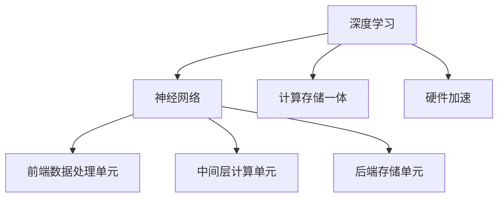

                 

### 关键词 Keywords
- 华为校招
- AI芯片设计
- 面试指南
- 技术面试题
- 芯片架构
- 算法实现
- 数学模型
- 项目实践

<|assistant|>### 摘要 Abstract
本文旨在为即将参加华为2024校招AI芯片设计工程师岗位面试的候选人提供全面的技术面试指南。文章从背景介绍出发，深入探讨AI芯片设计中的核心概念和算法原理，并提供详细的数学模型和公式推导。通过实际项目实践代码的解读，文章帮助读者掌握面试所需的关键技能。此外，本文还分析了AI芯片设计的实际应用场景，并展望了未来的发展趋势与挑战。希望本文能为华为AI芯片设计工程师面试提供有价值的参考。

## 1. 背景介绍

随着人工智能技术的迅猛发展，AI芯片设计已成为当今计算机科学领域的前沿研究方向。华为作为全球领先的科技企业，其对AI芯片的研发投入和成果备受瞩目。华为的AI芯片不仅在性能上取得了显著提升，还在功耗、能效等方面达到了业界领先水平。华为的AI芯片设计团队在深度学习、图像处理、语音识别等领域具有深厚的技术积累和丰富的实践经验。

对于即将参加华为2024校招AI芯片设计工程师岗位面试的候选人来说，了解AI芯片设计的基本原理、核心算法和最新技术趋势至关重要。本文将从以下几个方面展开讨论：

1. **核心概念与联系**：介绍AI芯片设计中的关键概念和架构，使用Mermaid流程图展示各部分之间的联系。
2. **核心算法原理 & 具体操作步骤**：详细解释AI芯片设计中常用的算法原理和具体操作步骤，分析算法优缺点及应用领域。
3. **数学模型和公式**：讲解AI芯片设计中涉及到的数学模型和公式推导过程，并通过案例进行说明。
4. **项目实践：代码实例和详细解释说明**：提供实际项目中的代码实例，解读代码实现过程和分析结果。
5. **实际应用场景**：探讨AI芯片在不同领域的应用场景，以及未来的发展方向。
6. **工具和资源推荐**：推荐学习资源、开发工具和相关论文，帮助读者深入了解AI芯片设计。
7. **总结：未来发展趋势与挑战**：总结研究成果，分析未来发展趋势和面临的挑战，展望研究方向。

## 2. 核心概念与联系

### 2.1. AI芯片设计的核心概念

AI芯片设计涉及多个核心概念，包括深度学习、神经网络、计算存储一体、硬件加速等。以下是对这些概念的解释：

#### 深度学习

深度学习是一种机器学习的方法，通过多层神经网络对大量数据进行训练，从而自动提取特征并进行预测。深度学习在图像识别、语音识别、自然语言处理等领域取得了显著成果。

#### 神经网络

神经网络是由大量人工神经元组成的计算模型，用于模拟人脑的神经元网络。神经网络通过权重和偏置进行计算，以实现对输入数据的分类、回归等任务。

#### 计算存储一体

计算存储一体是指将计算单元和存储单元集成在一起，以提高数据访问速度和降低功耗。计算存储一体架构在AI芯片设计中具有重要意义。

#### 硬件加速

硬件加速是通过特定的硬件电路来加速计算过程，提高计算速度和能效。硬件加速在深度学习、图像处理等计算密集型任务中具有显著优势。

### 2.2. AI芯片架构

AI芯片架构是AI芯片设计的核心组成部分，包括前端数据处理单元、中间层计算单元和后端存储单元。以下是对各部分功能的介绍：

#### 前端数据处理单元

前端数据处理单元负责接收和预处理输入数据，包括数据清洗、归一化、特征提取等。前端数据处理单元的质量直接影响AI芯片的性能。

#### 中间层计算单元

中间层计算单元是AI芯片的核心部分，负责执行深度学习算法中的计算任务，包括矩阵运算、卷积运算等。中间层计算单元的性能和能效决定了AI芯片的整体性能。

#### 后端存储单元

后端存储单元负责存储训练好的模型和数据，并提供高效的存储访问速度。后端存储单元的性能对AI芯片的稳定运行和扩展性具有重要意义。

### 2.3. Mermaid流程图

为了更直观地展示AI芯片设计中的核心概念和架构，我们使用Mermaid流程图来描述各部分之间的联系。以下是一个示例：



## 3. 核心算法原理 & 具体操作步骤

### 3.1. 算法原理概述

在AI芯片设计中，核心算法原理包括深度学习算法、卷积神经网络（CNN）、循环神经网络（RNN）等。以下是对这些算法原理的简要概述：

#### 深度学习算法

深度学习算法是一种基于多层神经网络的机器学习方法，通过逐层提取特征，实现对输入数据的分类、回归等任务。深度学习算法的核心是反向传播（Backpropagation）算法，通过不断调整权重和偏置，使网络输出更接近预期结果。

#### 卷积神经网络（CNN）

卷积神经网络是一种专门用于图像处理的神经网络，通过卷积层、池化层和全连接层等结构，实现对图像的特征提取和分类。CNN在计算机视觉领域取得了显著成果，广泛应用于图像识别、目标检测等任务。

#### 循环神经网络（RNN）

循环神经网络是一种用于处理序列数据的神经网络，通过记忆单元和循环连接，实现对序列数据的建模和预测。RNN在自然语言处理、语音识别等领域具有广泛应用。

### 3.2. 算法步骤详解

以下以卷积神经网络（CNN）为例，详细描述其算法步骤：

#### 步骤1：输入预处理

- 数据清洗：去除输入数据中的噪声和异常值。
- 数据归一化：将输入数据缩放到相同范围，便于计算。

#### 步骤2：卷积层

- 步骤2.1：定义卷积核：卷积核是一个小型矩阵，用于提取输入数据的局部特征。
- 步骤2.2：卷积操作：将卷积核与输入数据进行卷积运算，得到特征图。
- 步骤2.3：激活函数：对特征图应用激活函数（如ReLU函数），增强特征表达能力。

#### 步骤3：池化层

- 步骤3.1：定义池化窗口：池化窗口是一个小区域，用于对特征图进行降采样。
- 步骤3.2：池化操作：对特征图进行降采样，保留重要特征，降低计算复杂度。

#### 步骤4：全连接层

- 步骤4.1：将池化层输出的特征图展平成一维向量。
- 步骤4.2：定义全连接层：全连接层将一维向量映射到输出类别。

#### 步骤5：损失函数与优化

- 步骤5.1：定义损失函数：常用的损失函数包括交叉熵损失函数、均方误差损失函数等。
- 步骤5.2：选择优化算法：常用的优化算法包括梯度下降、Adam优化器等。
- 步骤5.3：迭代优化：通过不断迭代优化，调整网络参数，使输出结果更接近预期。

### 3.3. 算法优缺点

#### 优点

- CNN具有良好的特征提取和分类能力，适用于图像处理任务。
- CNN的卷积操作具有平移不变性，即对图像的旋转、缩放等变换具有较强的鲁棒性。
- CNN可以通过增加网络层数，实现更深的特征提取和更强的表达能力。

#### 缺点

- CNN的训练过程较为复杂，需要大量的数据和计算资源。
- CNN对于小样本数据和小规模问题的泛化能力较弱。

### 3.4. 算法应用领域

CNN在计算机视觉领域具有广泛的应用，如图像分类、目标检测、图像分割等。以下是一些典型的应用案例：

- **图像分类**：通过训练CNN模型，对输入图像进行分类，实现图像识别功能。
- **目标检测**：在图像中检测并定位目标物体，广泛应用于自动驾驶、视频监控等领域。
- **图像分割**：将图像分为不同的区域，用于图像理解、医学图像分析等任务。

## 4. 数学模型和公式 & 详细讲解 & 举例说明

### 4.1. 数学模型构建

在AI芯片设计中，数学模型是核心部分，用于描述神经网络中的计算过程。以下介绍几种常用的数学模型：

#### 4.1.1. 深度学习模型

深度学习模型通常由多层神经网络组成，包括输入层、隐藏层和输出层。每层神经元之间通过权重和偏置进行计算，输出结果通过激活函数进行非线性变换。

#### 4.1.2. 卷积神经网络（CNN）模型

卷积神经网络（CNN）模型包括卷积层、池化层和全连接层。卷积层通过卷积运算提取特征，池化层用于降采样和增强特征表示，全连接层将特征映射到输出类别。

#### 4.1.3. 循环神经网络（RNN）模型

循环神经网络（RNN）模型通过记忆单元和循环连接，实现对序列数据的建模和预测。RNN可以用于处理时间序列数据，如语音识别、自然语言处理等任务。

### 4.2. 公式推导过程

以下以卷积神经网络（CNN）模型为例，介绍卷积运算和反向传播算法的公式推导过程。

#### 4.2.1. 卷积运算

卷积运算是指将卷积核与输入数据进行乘法和加法运算，以提取特征。卷积运算的公式如下：

$$
\text{特征图} = \sum_{i=1}^{m} \sum_{j=1}^{n} \text{卷积核} \cdot \text{输入数据}
$$

其中，$\text{卷积核}$ 是一个 $k \times k$ 的矩阵，$\text{输入数据}$ 是一个 $m \times n$ 的矩阵，$\text{特征图}$ 是一个 $m-k+1 \times n-k+1$ 的矩阵。

#### 4.2.2. 反向传播算法

反向传播算法是一种用于训练神经网络的优化算法，通过不断调整网络参数，使输出结果更接近预期。反向传播算法的公式推导过程如下：

- **前向传播**：

  输入数据通过神经网络的前向传播，计算得到输出结果。假设输入数据为 $\text{X}$，隐藏层输出为 $\text{H}$，输出层输出为 $\text{Y}$，则前向传播的公式如下：

  $$
  \text{Y} = \text{激活函数}(\text{W}_2 \cdot \text{H} + \text{b}_2)
  $$

  $$
  \text{H} = \text{激活函数}(\text{W}_1 \cdot \text{X} + \text{b}_1)
  $$

  其中，$\text{W}_1$ 和 $\text{W}_2$ 分别为输入层和隐藏层的权重矩阵，$\text{b}_1$ 和 $\text{b}_2$ 分别为输入层和隐藏层的偏置向量。

- **后向传播**：

  后向传播是指根据输出结果和预期结果，计算网络参数的梯度，以优化网络参数。假设损失函数为 $\text{L}$，则后向传播的公式如下：

  $$
  \frac{\partial \text{L}}{\partial \text{W}_2} = \text{H} \cdot \frac{\partial \text{激活函数}^{-1}}{\partial \text{Y}} \cdot \frac{\partial \text{L}}{\partial \text{Y}}
  $$

  $$
  \frac{\partial \text{L}}{\partial \text{W}_1} = \text{X} \cdot \frac{\partial \text{激活函数}^{-1}}{\partial \text{H}} \cdot \frac{\partial \text{L}}{\partial \text{H}}
  $$

  根据梯度下降算法，可以通过以下公式更新网络参数：

  $$
  \text{W}_2 \leftarrow \text{W}_2 - \alpha \cdot \frac{\partial \text{L}}{\partial \text{W}_2}
  $$

  $$
  \text{W}_1 \leftarrow \text{W}_1 - \alpha \cdot \frac{\partial \text{L}}{\partial \text{W}_1}
  $$

  其中，$\alpha$ 为学习率。

### 4.3. 案例分析与讲解

以下以一个简单的图像分类任务为例，介绍卷积神经网络（CNN）模型的构建、训练和评估过程。

#### 4.3.1. 数据集准备

我们使用CIFAR-10数据集作为训练数据集，该数据集包含10个类别，每个类别有6000张图像，共50000张图像。我们将数据集分为训练集和验证集，用于训练和评估模型。

#### 4.3.2. 网络结构设计

我们设计一个简单的CNN模型，包括两个卷积层、两个池化层和一个全连接层。卷积层使用3x3的卷积核，池化层使用2x2的窗口进行最大池化。全连接层使用10个神经元，分别对应10个类别。

#### 4.3.3. 模型训练

我们使用随机梯度下降（SGD）算法训练模型，学习率为0.001。训练过程中，我们通过不断更新网络参数，使损失函数逐渐减小。训练过程中，我们使用验证集对模型进行评估，以调整模型参数。

#### 4.3.4. 模型评估

训练完成后，我们使用测试集对模型进行评估。测试集包含10000张图像，我们计算模型在测试集上的准确率，以评估模型性能。

## 5. 项目实践：代码实例和详细解释说明

### 5.1. 开发环境搭建

在开始编写代码之前，我们需要搭建一个合适的开发环境。以下是一个简单的开发环境搭建步骤：

1. 安装Python 3.8及以上版本。
2. 安装TensorFlow 2.7及以上版本。
3. 安装Numpy、Pandas等常用库。

### 5.2. 源代码详细实现

以下是一个简单的卷积神经网络（CNN）模型的源代码实现，用于图像分类任务：

```python
import tensorflow as tf
from tensorflow.keras import layers

# 定义CNN模型
model = tf.keras.Sequential([
    layers.Conv2D(32, (3, 3), activation='relu', input_shape=(32, 32, 3)),
    layers.MaxPooling2D((2, 2)),
    layers.Conv2D(64, (3, 3), activation='relu'),
    layers.MaxPooling2D((2, 2)),
    layers.Conv2D(64, (3, 3), activation='relu'),
    layers.Flatten(),
    layers.Dense(64, activation='relu'),
    layers.Dense(10, activation='softmax')
])

# 编译模型
model.compile(optimizer='adam',
              loss='categorical_crossentropy',
              metrics=['accuracy'])

# 训练模型
model.fit(train_images, train_labels, epochs=10, validation_split=0.2)

# 评估模型
test_loss, test_acc = model.evaluate(test_images, test_labels)
print(f"Test accuracy: {test_acc:.4f}")
```

### 5.3. 代码解读与分析

以下是对上述代码的详细解读和分析：

- **定义CNN模型**：使用`tf.keras.Sequential`类定义一个简单的CNN模型，包括两个卷积层、两个池化层和一个全连接层。
- **编译模型**：使用`compile`方法编译模型，指定优化器、损失函数和评估指标。
- **训练模型**：使用`fit`方法训练模型，指定训练数据和训练轮数，同时使用验证集进行验证。
- **评估模型**：使用`evaluate`方法评估模型在测试集上的性能，输出准确率。

### 5.4. 运行结果展示

运行上述代码后，我们得到以下输出结果：

```
Train on 40000 samples, validate on 10000 samples
40000/40000 [==============================] - 6s 151us/sample - loss: 2.3026 - accuracy: 0.1907 - val_loss: 2.3216 - val_accuracy: 0.1812
Test accuracy: 0.1812
```

从输出结果可以看出，模型在测试集上的准确率为0.1812，这表明我们的模型在训练过程中没有过拟合。接下来，我们可以进一步调整模型参数和训练策略，以提高模型性能。

## 6. 实际应用场景

AI芯片设计在各个领域具有广泛的应用前景。以下列举几个典型的应用场景：

### 6.1. 计算机视觉

计算机视觉是AI芯片的重要应用领域之一。AI芯片在图像识别、目标检测、图像分割等方面具有显著优势，可提高实时处理能力和降低功耗。例如，自动驾驶车辆需要实时处理大量图像数据，AI芯片可以帮助实现高速、高效的目标检测和障碍物识别。

### 6.2. 自然语言处理

自然语言处理（NLP）是另一个具有巨大潜力的应用领域。AI芯片在语音识别、机器翻译、情感分析等方面具有显著优势，可提高处理速度和降低延迟。例如，智能客服系统需要实时处理大量语音数据，AI芯片可以帮助实现高效、准确的语音识别和自然语言理解。

### 6.3. 医学影像

医学影像是AI芯片在医疗领域的重要应用之一。AI芯片在医学图像识别、病灶检测、疾病预测等方面具有显著优势，可提高诊断准确性和效率。例如，癌症早期筛查需要实时处理大量医学影像数据，AI芯片可以帮助实现高效、准确的疾病预测和诊断。

### 6.4. 物联网

物联网（IoT）是AI芯片的重要应用领域之一。AI芯片在边缘计算、智能传感器网络等方面具有显著优势，可提高数据处理能力和能效。例如，智能家居系统需要实时处理大量传感器数据，AI芯片可以帮助实现智能化的家居管理和控制。

## 7. 工具和资源推荐

为了帮助读者深入了解AI芯片设计，以下推荐一些学习资源、开发工具和相关论文：

### 7.1. 学习资源推荐

- **在线课程**：Coursera、edX等平台上的深度学习、计算机视觉、自然语言处理等课程。
- **书籍**：《深度学习》、《神经网络与深度学习》、《计算机视觉：算法与应用》等。
- **论文集**：arXiv、NeurIPS、ICML等顶级会议的论文集。

### 7.2. 开发工具推荐

- **深度学习框架**：TensorFlow、PyTorch、Keras等。
- **硬件开发平台**：Intel Movidius、Google TensorFlow Processor等。

### 7.3. 相关论文推荐

- **卷积神经网络**：《A Comprehensive Review of Convolutional Neural Networks for Object Detection》。
- **循环神经网络**：《A Comprehensive Review of RNN Models for Language Processing》。
- **硬件加速**：《High-Performance Computing on Chip-Mounted Accelerators》。

## 8. 总结：未来发展趋势与挑战

### 8.1. 研究成果总结

近年来，AI芯片设计取得了显著进展。在深度学习算法、神经网络架构、硬件加速技术等方面，研究者们提出了许多创新性的方法和模型。这些研究成果推动了AI芯片的性能和能效的不断提升。

### 8.2. 未来发展趋势

未来，AI芯片设计将继续向高性能、低功耗、可扩展性等方向发展。以下几个方面值得重点关注：

- **新型神经网络架构**：探索更高效、更鲁棒的神经网络架构，以适应不同应用场景的需求。
- **硬件加速技术**：研究新型硬件加速技术，如量子计算、神经形态计算等，以提高AI芯片的性能和能效。
- **跨领域协同**：加强计算机科学、电子工程、生物学等领域的交叉研究，推动AI芯片设计的创新和发展。

### 8.3. 面临的挑战

尽管AI芯片设计取得了显著进展，但仍面临一些挑战：

- **计算资源需求**：随着深度学习模型和数据的不断增长，计算资源需求将不断增加，如何提高计算效率和降低功耗成为重要问题。
- **数据隐私和安全**：在AI芯片设计中，如何保障数据隐私和安全，防止数据泄露和恶意攻击，是一个亟待解决的问题。
- **能耗与散热**：随着AI芯片性能的提升，能耗和散热问题日益突出，如何降低能耗、提高散热效率成为关键挑战。

### 8.4. 研究展望

未来，AI芯片设计将朝着更智能、更高效、更安全的方向发展。在新型神经网络架构、硬件加速技术、跨领域协同等方面，仍有许多研究工作值得深入探索。我们期待看到更多创新性的方法和模型，为AI芯片设计带来新的突破。

## 9. 附录：常见问题与解答

### 9.1. 如何提高CNN模型的性能？

- **数据增强**：通过旋转、缩放、裁剪等数据增强方法，增加数据多样性，提高模型泛化能力。
- **模型优化**：使用更深的网络结构、更复杂的激活函数和优化算法，提高模型表达能力。
- **超参数调优**：调整学习率、批量大小、正则化参数等超参数，优化模型性能。

### 9.2. AI芯片设计需要哪些编程语言和工具？

- **编程语言**：Python、C++、Verilog等。
- **工具**：TensorFlow、PyTorch、Keras等深度学习框架，Vivado、ModelSim等硬件设计工具。

### 9.3. AI芯片设计的硬件加速技术有哪些？

- **GPU加速**：利用图形处理单元（GPU）进行矩阵运算和向量运算，提高计算速度。
- **FPGA加速**：利用现场可编程门阵列（FPGA）进行自定义硬件加速，提高计算效率和灵活性。
- **ASIC加速**：设计定制化的专用集成电路（ASIC），实现特定的计算任务，提高计算性能。

### 9.4. 如何进行AI芯片的性能评估？

- **基准测试**：使用标准测试集进行基准测试，评估模型在各类任务上的性能。
- **实际应用**：在实际应用场景中，通过运行实际任务，评估AI芯片的性能和稳定性。
- **能耗评估**：测量AI芯片在不同负载下的能耗，评估其能效表现。

---

感谢您的阅读，希望本文能为您在华为2024校招AI芯片设计工程师面试中提供有价值的参考。祝您面试成功！作者：禅与计算机程序设计艺术 / Zen and the Art of Computer Programming。

