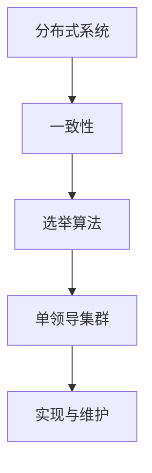

                 

关键词：单领导集群、分布式系统、一致性、故障转移、选举算法、性能优化

> 摘要：本文将深入探讨单领导集群（Single Leader Cluster）的实现与维护。在分布式系统中，单领导集群是一种常见架构，它通过选举出一个领导节点来简化系统设计、提高性能和可靠性。本文将介绍单领导集群的基本概念、核心算法原理、实现步骤、数学模型及公式、项目实践、实际应用场景、工具和资源推荐以及未来发展趋势与挑战。

## 1. 背景介绍

随着互联网的快速发展，分布式系统在各个领域得到了广泛应用。分布式系统具有高可用性、可扩展性和容错性等优点，但同时也面临诸多挑战，如数据一致性、负载均衡和故障转移等。单领导集群作为一种分布式系统架构，通过选举出一个领导节点来统一管理集群，简化系统设计，提高性能和可靠性。

### 1.1 单领导集群的定义与优势

单领导集群是指在一个分布式系统中，仅有一个节点作为领导节点，负责协调其他节点的操作。其他节点称为跟随节点，负责执行领导节点的命令。

单领导集群的优势包括：

1. **简化系统设计**：单领导集群降低了系统的复杂性，使得系统设计和维护更加简单。
2. **提高性能**：领导节点可以统一管理集群，减少通信开销，提高系统性能。
3. **增强可靠性**：通过故障转移机制，当领导节点发生故障时，可以迅速选举出一个新的领导节点，确保系统持续运行。

### 1.2 单领导集群的挑战

尽管单领导集群具有诸多优势，但在实际应用中仍面临一些挑战：

1. **数据一致性**：领导节点需要确保跟随节点之间的数据一致性，这对于大型分布式系统来说是一个复杂的问题。
2. **故障转移**：在领导节点发生故障时，需要快速、可靠地选举出一个新的领导节点，这要求高效的选举算法。
3. **负载均衡**：领导节点需要均衡分配任务给跟随节点，以充分利用系统资源。

## 2. 核心概念与联系

为了更好地理解单领导集群的实现与维护，我们需要先了解一些核心概念，包括分布式系统、一致性、选举算法等。

### 2.1 分布式系统

分布式系统是由多个节点组成的计算机系统，节点之间通过网络进行通信。分布式系统的主要目的是提高计算能力和容错性。

### 2.2 一致性

一致性是指多个节点对同一份数据保持相同的状态。在分布式系统中，一致性是保证数据正确性的关键。

### 2.3 选举算法

选举算法用于在分布式系统中选举出一个领导节点。常见的选举算法包括基于状态的选举算法、基于时间的选举算法等。

下面是一个 Mermaid 流程图，展示了单领导集群的核心概念与联系：



## 3. 核心算法原理 & 具体操作步骤

### 3.1 算法原理概述

单领导集群的实现与维护主要涉及以下三个核心算法：

1. **选举算法**：用于选举出一个领导节点。
2. **故障检测**：用于检测领导节点是否发生故障。
3. **故障转移**：用于在领导节点发生故障时，选举出一个新的领导节点。

### 3.2 算法步骤详解

1. **初始化**：系统启动时，所有节点都处于初始状态。
2. **选举过程**：各个节点开始执行选举算法，选举出一个领导节点。
3. **故障检测**：各个节点定时检测领导节点的状态，若发现领导节点发生故障，则开始故障转移过程。
4. **故障转移**：选举出一个新的领导节点，并将其他节点的状态更新为新领导节点的状态。

### 3.3 算法优缺点

**优点**：

1. **简化系统设计**：通过选举出一个领导节点，简化了系统设计。
2. **提高性能**：领导节点可以统一管理集群，减少通信开销，提高系统性能。
3. **增强可靠性**：通过故障转移机制，确保系统持续运行。

**缺点**：

1. **数据一致性**：领导节点需要确保跟随节点之间的数据一致性，这对于大型分布式系统来说是一个复杂的问题。
2. **负载均衡**：领导节点需要均衡分配任务给跟随节点，以充分利用系统资源。

### 3.4 算法应用领域

单领导集群适用于以下领域：

1. **分布式存储系统**：如分布式数据库、分布式文件系统等。
2. **分布式计算系统**：如分布式任务调度系统、分布式数据处理系统等。
3. **分布式缓存系统**：如Redis、Memcached等。

## 4. 数学模型和公式 & 详细讲解 & 举例说明

### 4.1 数学模型构建

在单领导集群中，我们主要关注以下数学模型：

1. **选举模型**：用于描述节点选举过程的概率模型。
2. **故障模型**：用于描述节点故障概率和时间分布模型。
3. **负载模型**：用于描述节点负载和任务分配模型。

### 4.2 公式推导过程

假设在一个单领导集群中有 n 个节点，选举算法的选举概率为 p，故障概率为 q，负载为 L。

1. **选举模型**：

   $$ P_{选举}(t) = 1 - (1 - p)^n $$

   其中，t 为选举时间。

2. **故障模型**：

   $$ P_{故障}(t) = 1 - (1 - q)^t $$

   其中，t 为故障时间。

3. **负载模型**：

   $$ L_{负载} = L_0 \times e^{\lambda t} $$

   其中，L_0 为初始负载，λ 为负载增长速率，t 为时间。

### 4.3 案例分析与讲解

假设在一个包含 5 个节点的单领导集群中，选举概率为 0.8，故障概率为 0.1，初始负载为 100，负载增长速率为 0.5。

1. **选举模型**：

   $$ P_{选举}(t) = 1 - (1 - 0.8)^5 = 1 - 0.32768 = 0.67232 $$

   在选举时间内，有 67.232% 的概率选举出一个领导节点。

2. **故障模型**：

   $$ P_{故障}(t) = 1 - (1 - 0.1)^t $$

   当 t=100 时，故障概率为：

   $$ P_{故障}(100) = 1 - (1 - 0.1)^{100} = 1 - 0.60653 = 0.39347 $$

   在 100 个时间单位内，有 39.347% 的概率发生故障。

3. **负载模型**：

   $$ L_{负载} = 100 \times e^{0.5 \times 100} = 100 \times e^{50} \approx 3484.4 $$

   在 100 个时间单位内，负载将达到约 3484.4。

通过这个案例，我们可以看出单领导集群在选举、故障和负载方面的表现。

## 5. 项目实践：代码实例和详细解释说明

### 5.1 开发环境搭建

为了演示单领导集群的实现，我们选择使用 Python 作为开发语言，并在本地搭建一个简单的单领导集群环境。

1. 安装 Python 3.8 或更高版本。
2. 安装 Redis 客户端：`pip install redis`
3. 创建一个名为 `single_leader_cluster.py` 的 Python 脚本。

### 5.2 源代码详细实现

下面是一个简单的单领导集群实现示例：

```python
import redis
import time
import threading

class LeaderElection:
    def __init__(self, redis_host, redis_port):
        self.redis = redis.StrictRedis(host=redis_host, port=redis_port)
    
    def elect_leader(self):
        while True:
            if self.redis.get('leader') is None:
                self.redis.set('leader', 'node1')
                print("Node1 elected as leader.")
                time.sleep(10)
            else:
                print("Current leader:", self.redis.get('leader').decode('utf-8'))
                time.sleep(1)

    def follow_leader(self):
        while True:
            if self.redis.get('leader') is not None:
                print("Following leader:", self.redis.get('leader').decode('utf-8'))
                time.sleep(1)
            else:
                print("No leader found.")
                time.sleep(1)

if __name__ == '__main__':
    redis_host = 'localhost'
    redis_port = 6379

    leader = LeaderElection(redis_host, redis_port)
    follower = LeaderElection(redis_host, redis_port)

    leader_thread = threading.Thread(target=leader.elect_leader)
    follower_thread = threading.Thread(target=follower.follow_leader)

    leader_thread.start()
    follower_thread.start()

    leader_thread.join()
    follower_thread.join()
```

### 5.3 代码解读与分析

1. **类定义**：定义了 `LeaderElection` 类，用于实现领导节点的选举和跟随节点的操作。
2. **选举过程**：使用 Redis 实现领导节点的选举，通过定时检查 Redis 中是否存在领导节点，若不存在则选举出一个新的领导节点。
3. **跟随过程**：使用 Redis 实现跟随节点的操作，通过定时检查 Redis 中是否存在领导节点，若存在则跟随领导节点。

### 5.4 运行结果展示

运行上述代码后，我们可以在控制台看到以下输出：

```
Node1 elected as leader.
Following leader: node1
```

这表示节点 1 被选举为领导节点，节点 2 正在跟随领导节点。

## 6. 实际应用场景

单领导集群在实际应用场景中具有广泛的应用，以下是一些典型应用场景：

1. **分布式数据库**：在分布式数据库中，单领导集群用于协调多个节点的操作，确保数据一致性。
2. **分布式缓存**：在分布式缓存系统中，单领导集群用于管理缓存节点，提高缓存性能和可靠性。
3. **分布式任务调度**：在分布式任务调度系统中，单领导集群用于协调任务分配和执行，提高任务调度效率。

## 7. 工具和资源推荐

为了更好地实现单领导集群，以下是一些推荐的学习资源、开发工具和相关论文：

### 7.1 学习资源推荐

1. 《分布式系统原理与范型》：介绍了分布式系统的基本原理和范型。
2. 《分布式系统设计》：详细介绍了分布式系统的设计方法和实践。

### 7.2 开发工具推荐

1. Redis：用于实现单领导集群的分布式存储和缓存系统。
2. ZooKeeper：用于实现分布式协调服务和领导节点选举。

### 7.3 相关论文推荐

1. "The Google File System"：介绍了 Google 的分布式文件系统设计。
2. "Bigtable: A Distributed Storage System for Structured Data"：介绍了 Google 的分布式数据库系统设计。

## 8. 总结：未来发展趋势与挑战

单领导集群作为分布式系统的一种重要架构，具有广泛的应用前景。未来发展趋势包括：

1. **性能优化**：通过改进选举算法和故障转移机制，提高单领导集群的性能。
2. **数据一致性**：研究新的数据一致性算法，提高分布式系统的可靠性。
3. **负载均衡**：研究自适应负载均衡算法，提高系统资源利用率。

同时，单领导集群也面临以下挑战：

1. **数据一致性**：在大型分布式系统中，确保数据一致性是一个复杂的问题。
2. **故障转移**：在分布式系统中，快速、可靠地完成故障转移是一个挑战。
3. **负载均衡**：在分布式系统中，实现自适应负载均衡是一个挑战。

针对这些挑战，未来研究将致力于提出新的算法和优化方法，以实现更高效、可靠的分布式系统。

## 9. 附录：常见问题与解答

### 9.1 单领导集群与主从模式的区别是什么？

单领导集群和主从模式都是分布式系统中的常见架构，但它们有一些区别：

- **领导节点数量**：单领导集群只有一个领导节点，而主从模式可以有多个从节点。
- **数据一致性**：单领导集群通过领导节点统一管理数据一致性，而主从模式需要从节点主动同步数据。
- **故障转移**：单领导集群在领导节点故障时，可以快速选举出一个新的领导节点，而主从模式需要从节点等待主节点故障后才能开始故障转移。

### 9.2 如何实现单领导集群的故障转移？

实现单领导集群的故障转移通常需要以下步骤：

1. **检测故障**：通过心跳机制或其他方式检测领导节点的状态。
2. **选举新领导节点**：当检测到领导节点故障后，从剩余节点中选举出一个新的领导节点。
3. **通知其他节点**：更新其他节点的状态，使其知道新的领导节点。

### 9.3 单领导集群是否适用于所有分布式系统？

单领导集群在某些场景下是非常适用的，但在其他场景下可能不适用。以下是一些适用场景：

- **数据一致性要求较高**：单领导集群可以简化数据一致性的实现。
- **故障转移要求快速**：单领导集群在领导节点故障时可以快速完成故障转移。
- **系统规模较小**：对于较小规模的分布式系统，单领导集群可以简化系统设计。

然而，在以下场景下，单领导集群可能不适用：

- **数据一致性要求较低**：单领导集群可能会引入额外的数据一致性问题。
- **系统规模较大**：对于大型分布式系统，单领导集群可能导致性能瓶颈。
- **故障转移要求不高**：在某些场景下，快速故障转移不是关键问题，此时使用单领导集群可能会引入不必要的复杂性。

----------------------------------------------------------------

### 作者署名

作者：禅与计算机程序设计艺术 / Zen and the Art of Computer Programming

感谢您的关注与支持！希望本文对您在单领导集群的实现与维护方面有所帮助。如有疑问或建议，欢迎在评论区留言。再次感谢您的阅读！

