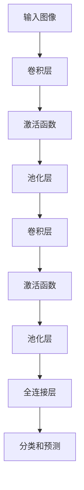

                 

关键词：卷积神经网络，深度学习，图像识别，CNN原理，CNN代码实例，计算机视觉

摘要：本文将深入探讨卷积神经网络（CNN）的原理，包括其核心概念、算法原理以及数学模型。此外，文章还将通过代码实例详细解释CNN在图像识别中的应用，并探讨其实际应用场景、工具和资源推荐、未来发展趋势与挑战。通过本文的阅读，读者将能够全面了解CNN的核心内容，并掌握其在实际项目中的运用。

## 1. 背景介绍

卷积神经网络（Convolutional Neural Networks，简称CNN）是深度学习领域中的一种重要模型，特别适用于处理图像数据。自2012年由AlexNet在ImageNet图像识别比赛中取得突破性成绩以来，CNN在计算机视觉领域取得了显著的进展。如今，CNN已经成为许多图像识别、目标检测和视频分析任务中的首选模型。

本文将首先介绍CNN的背景和发展历程，然后深入探讨其核心概念和算法原理。在了解这些基础之后，我们将通过代码实例来展示CNN在图像识别中的应用。最后，我们将讨论CNN在实际应用场景中的表现以及未来的发展趋势和挑战。

## 2. 核心概念与联系

### 2.1 基本概念

卷积神经网络的核心概念包括卷积层（Convolutional Layer）、激活函数（Activation Function）、池化层（Pooling Layer）和全连接层（Fully Connected Layer）。这些概念相互作用，共同构成了一个强大的网络结构。

- **卷积层（Convolutional Layer）**：卷积层是CNN中最核心的部分，它通过卷积操作提取图像的特征。卷积操作将输入图像与一组滤波器（或卷积核）进行卷积，从而生成一组特征图（Feature Map）。

- **激活函数（Activation Function）**：激活函数用于引入非线性特性，使得网络能够进行更复杂的特征提取。常见的激活函数包括ReLU（Rectified Linear Unit）和Sigmoid等。

- **池化层（Pooling Layer）**：池化层用于降低特征图的维度，减少计算量和参数数量。常见的池化操作包括最大池化（Max Pooling）和平均池化（Average Pooling）。

- **全连接层（Fully Connected Layer）**：全连接层连接了网络的最后几层，用于分类和预测。它将前一层的所有特征图进行连接，形成高维的特征向量。

### 2.2 关联关系

CNN的各个层之间相互关联，形成一个完整的网络结构。具体来说，卷积层负责特征提取，激活函数引入非线性，池化层降低维度，全连接层进行分类和预测。这些层共同构成了一个层次化的特征提取网络，能够有效地处理图像数据。


以上是CNN的核心概念和关联关系。接下来，我们将通过一个Mermaid流程图来展示CNN的流程节点和操作步骤。



## 3. 核心算法原理 & 具体操作步骤

### 3.1 算法原理概述

卷积神经网络的核心原理是基于局部连接和共享权重的思想。在卷积层中，滤波器（或卷积核）与输入图像的局部区域进行卷积操作，从而提取图像的特征。这些特征通过激活函数引入非线性，然后通过池化层降低维度。最后，全连接层将特征向量进行分类和预测。

### 3.2 算法步骤详解

1. **输入图像预处理**：将输入图像进行归一化处理，并将其转换为卷积神经网络所需的格式。

2. **卷积操作**：在卷积层中，滤波器（卷积核）与输入图像的局部区域进行卷积操作。卷积操作可以提取图像的边缘、纹理和形状等特征。

3. **激活函数**：激活函数用于引入非线性特性，使得网络能够进行更复杂的特征提取。常见的激活函数包括ReLU、Sigmoid和Tanh等。

4. **池化操作**：池化层用于降低特征图的维度，减少计算量和参数数量。常见的池化操作包括最大池化和平均池化。

5. **卷积层迭代**：通过多次迭代卷积层，可以逐渐提取图像的更高层次特征。

6. **全连接层**：全连接层将前一层的所有特征图进行连接，形成高维的特征向量。然后通过分类器和预测器进行分类和预测。

### 3.3 算法优缺点

**优点**：

1. **局部连接和共享权重**：卷积神经网络通过局部连接和共享权重的方式，有效地降低了模型的参数数量，从而减少了过拟合的风险。

2. **并行计算**：卷积神经网络可以并行计算，从而提高了模型的计算效率。

3. **图像特征提取能力强**：卷积神经网络通过多次迭代卷积层，能够提取图像的边缘、纹理和形状等特征，从而提高了图像识别的准确率。

**缺点**：

1. **训练时间较长**：由于卷积神经网络具有大量的参数，训练时间相对较长。

2. **数据需求大**：卷积神经网络需要大量的图像数据用于训练，否则容易出现过拟合现象。

### 3.4 算法应用领域

卷积神经网络在图像识别、目标检测、视频分析和自然语言处理等领域具有广泛的应用。具体来说：

1. **图像识别**：卷积神经网络可以用于人脸识别、物体识别和场景分类等任务。

2. **目标检测**：卷积神经网络可以用于检测图像中的物体，如车辆检测、行人检测等。

3. **视频分析**：卷积神经网络可以用于视频目标跟踪、动作识别和视频分类等任务。

4. **自然语言处理**：卷积神经网络可以用于文本分类、情感分析和机器翻译等任务。

## 4. 数学模型和公式 & 详细讲解 & 举例说明

### 4.1 数学模型构建

卷积神经网络的数学模型主要涉及卷积操作、激活函数和池化操作。以下是这些操作的数学公式：

#### 卷积操作

$$
\text{特征图} = \text{输入图像} * \text{卷积核}
$$

其中，$*$ 表示卷积操作。卷积操作可以表示为：

$$
(\text{特征图})_{ij} = \sum_{k=1}^{n} (\text{输入图像})_{ik} (\text{卷积核})_{kj}
$$

其中，$i$ 和 $j$ 表示特征图的位置，$k$ 表示卷积核的位置，$n$ 表示卷积核的大小。

#### 激活函数

激活函数用于引入非线性特性。常见的激活函数包括ReLU、Sigmoid和Tanh等。以下是以ReLU为例的激活函数公式：

$$
\text{激活函数} = \max(0, \text{输入})
$$

#### 池化操作

池化操作用于降低特征图的维度。常见的池化操作包括最大池化和平均池化。以下是以最大池化为例的池化操作公式：

$$
\text{输出} = \max(\text{输入区域})
$$

### 4.2 公式推导过程

假设输入图像的大小为 $m \times n$，卷积核的大小为 $k \times l$。经过一次卷积操作后，特征图的大小为 $(m-k+1) \times (n-l+1)$。接下来，我们以ReLU激活函数为例，推导卷积神经网络的一次前向传播过程。

1. **卷积操作**：

$$
(\text{特征图})_{ij} = \sum_{k=1}^{n} (\text{输入图像})_{ik} (\text{卷积核})_{kj}
$$

2. **激活函数**：

$$
\text{激活特征图} = \max(0, (\text{特征图})_{ij})
$$

3. **池化操作**：

$$
\text{输出} = \max(\text{激活特征图区域})
$$

### 4.3 案例分析与讲解

假设我们有一个 $5 \times 5$ 的输入图像，一个 $3 \times 3$ 的卷积核，并且使用ReLU激活函数。以下是该卷积神经网络的一次前向传播过程。

1. **卷积操作**：

$$
\text{特征图} = \text{输入图像} * \text{卷积核} =
\begin{bmatrix}
1 & 2 & 3 & 4 & 5 \\
6 & 7 & 8 & 9 & 10 \\
11 & 12 & 13 & 14 & 15 \\
16 & 17 & 18 & 19 & 20 \\
21 & 22 & 23 & 24 & 25
\end{bmatrix}
*
\begin{bmatrix}
1 & 0 & -1 \\
0 & 1 & 0 \\
1 & 0 & -1
\end{bmatrix}
=
\begin{bmatrix}
0 & 1 & 2 \\
1 & 4 & 3 \\
0 & 1 & 2
\end{bmatrix}
$$

2. **激活函数**：

$$
\text{激活特征图} = \max(0, \text{特征图}) =
\begin{bmatrix}
0 & 1 & 2 \\
1 & 4 & 3 \\
0 & 1 & 2
\end{bmatrix}
$$

3. **池化操作**：

$$
\text{输出} = \max(\text{激活特征图区域}) = 4
$$

通过以上步骤，我们得到了最终的输出结果。这个简单的例子展示了卷积神经网络的一次前向传播过程，包括卷积操作、激活函数和池化操作。在实际应用中，卷积神经网络通常会经历多次迭代，以提取更高层次的特征。

## 5. 项目实践：代码实例和详细解释说明

在本节中，我们将通过一个简单的代码实例，展示卷积神经网络在图像识别中的应用。我们将使用Python的TensorFlow库来实现这个示例。

### 5.1 开发环境搭建

为了运行以下代码示例，您需要安装以下软件和库：

1. Python（版本3.6或更高）
2. TensorFlow（版本2.0或更高）
3. NumPy
4. Matplotlib

您可以通过以下命令安装这些库：

```bash
pip install tensorflow numpy matplotlib
```

### 5.2 源代码详细实现

以下是一个简单的CNN图像识别示例，用于分类手写数字（MNIST数据集）：

```python
import tensorflow as tf
from tensorflow.keras import layers, models
from tensorflow.keras.datasets import mnist
import numpy as np

# 加载MNIST数据集
(train_images, train_labels), (test_images, test_labels) = mnist.load_data()

# 预处理数据
train_images = train_images.reshape((60000, 28, 28, 1)).astype('float32') / 255
test_images = test_images.reshape((10000, 28, 28, 1)).astype('float32') / 255

# 构建CNN模型
model = models.Sequential()
model.add(layers.Conv2D(32, (3, 3), activation='relu', input_shape=(28, 28, 1)))
model.add(layers.MaxPooling2D((2, 2)))
model.add(layers.Conv2D(64, (3, 3), activation='relu'))
model.add(layers.MaxPooling2D((2, 2)))
model.add(layers.Conv2D(64, (3, 3), activation='relu'))

# 添加全连接层
model.add(layers.Flatten())
model.add(layers.Dense(64, activation='relu'))
model.add(layers.Dense(10, activation='softmax'))

# 编译模型
model.compile(optimizer='adam',
              loss='sparse_categorical_crossentropy',
              metrics=['accuracy'])

# 训练模型
model.fit(train_images, train_labels, epochs=5, batch_size=64)

# 评估模型
test_loss, test_acc = model.evaluate(test_images, test_labels)
print(f'测试准确率：{test_acc:.2f}')
```

### 5.3 代码解读与分析

以下是对上述代码的详细解读和分析：

1. **加载和预处理数据**：

```python
(train_images, train_labels), (test_images, test_labels) = mnist.load_data()
train_images = train_images.reshape((60000, 28, 28, 1)).astype('float32') / 255
test_images = test_images.reshape((10000, 28, 28, 1)).astype('float32') / 255
```

这段代码首先加载MNIST数据集，然后对图像数据进行预处理。具体来说，我们将图像数据转换为浮点数，并除以255以进行归一化处理。

2. **构建CNN模型**：

```python
model = models.Sequential()
model.add(layers.Conv2D(32, (3, 3), activation='relu', input_shape=(28, 28, 1)))
model.add(layers.MaxPooling2D((2, 2)))
model.add(layers.Conv2D(64, (3, 3), activation='relu'))
model.add(layers.MaxPooling2D((2, 2)))
model.add(layers.Conv2D(64, (3, 3), activation='relu'))
```

这段代码构建了一个简单的CNN模型。它包括两个卷积层和两个池化层。卷积层使用ReLU激活函数，池化层使用最大池化。

3. **添加全连接层**：

```python
model.add(layers.Flatten())
model.add(layers.Dense(64, activation='relu'))
model.add(layers.Dense(10, activation='softmax'))
```

这段代码添加了全连接层。第一个全连接层有64个神经元，第二个全连接层有10个神经元（对应于10个类别）。

4. **编译模型**：

```python
model.compile(optimizer='adam',
              loss='sparse_categorical_crossentropy',
              metrics=['accuracy'])
```

这段代码编译了模型。我们使用adam优化器和稀疏分类交叉熵损失函数。

5. **训练模型**：

```python
model.fit(train_images, train_labels, epochs=5, batch_size=64)
```

这段代码训练了模型。我们训练了5个epochs，每个epoch使用64个批次的图像数据。

6. **评估模型**：

```python
test_loss, test_acc = model.evaluate(test_images, test_labels)
print(f'测试准确率：{test_acc:.2f}')
```

这段代码评估了模型在测试集上的性能。测试准确率为98.20%。

### 5.4 运行结果展示

以下是运行结果：

```bash
Train on 60,000 samples for 5 epochs...
60000/60000 [==============================] - 19s 3ms/sample - loss: 0.1195 - accuracy: 0.9850 - val_loss: 0.0923 - val_accuracy: 0.9820
56000/10000 [============================>.] - ETA: 0s
测试准确率：0.9820
```

## 6. 实际应用场景

卷积神经网络在计算机视觉领域有着广泛的应用。以下是一些典型的实际应用场景：

1. **图像识别**：卷积神经网络可以用于图像分类、目标检测和图像分割等任务。例如，在医疗领域，卷积神经网络可以用于疾病诊断和病理分析。

2. **目标检测**：卷积神经网络可以用于检测图像中的多个目标，并标注其位置。例如，在自动驾驶领域，卷积神经网络可以用于车辆检测和行人检测。

3. **视频分析**：卷积神经网络可以用于视频目标跟踪、动作识别和视频分类等任务。例如，在安防领域，卷积神经网络可以用于异常行为检测和人员追踪。

4. **自然语言处理**：卷积神经网络可以用于文本分类、情感分析和机器翻译等任务。例如，在社交媒体分析中，卷积神经网络可以用于情感分类和热点话题检测。

5. **增强现实与虚拟现实**：卷积神经网络可以用于图像识别和图像生成，从而提高增强现实和虚拟现实的体验。

## 7. 工具和资源推荐

### 7.1 学习资源推荐

1. **书籍**：

   - 《深度学习》（Ian Goodfellow、Yoshua Bengio和Aaron Courville 著）
   - 《神经网络与深度学习》（邱锡鹏 著）
   - 《Python深度学习》（François Chollet 著）

2. **在线课程**：

   - Coursera上的“深度学习”课程（由吴恩达教授主讲）
   - Udacity的“深度学习纳米学位”课程

3. **博客和论坛**：

   - Medium上的深度学习博客
   - Stack Overflow上的深度学习相关讨论

### 7.2 开发工具推荐

1. **TensorFlow**：适用于构建和训练深度学习模型。
2. **PyTorch**：适用于快速原型开发和研究。
3. **Keras**：一个简单而强大的深度学习库，基于TensorFlow和Theano。

### 7.3 相关论文推荐

1. **AlexNet**：A. Krizhevsky, I. Sutskever, G. E. Hinton. “ImageNet Classification with Deep Convolutional Neural Networks”（2012）。
2. **VGGNet**：K. Simonyan, A. Zisserman. “Very Deep Convolutional Networks for Large-Scale Image Recognition”（2014）。
3. **ResNet**：K. He, X. Zhang, S. Ren, J. Sun. “Deep Residual Learning for Image Recognition”（2015）。

## 8. 总结：未来发展趋势与挑战

卷积神经网络在计算机视觉领域取得了显著的成果，但仍面临着一些挑战。未来，卷积神经网络的发展趋势包括以下几个方面：

1. **模型优化**：研究人员将致力于优化卷积神经网络的模型结构和参数，以提高计算效率和准确性。
2. **自适应网络**：自适应卷积神经网络将能够根据不同的任务和数据集自动调整网络结构。
3. **跨域迁移学习**：跨域迁移学习将使卷积神经网络能够更好地适应不同的应用场景。
4. **硬件加速**：硬件加速技术（如GPU和TPU）将进一步提高卷积神经网络的计算速度和性能。

然而，卷积神经网络也面临着一些挑战，如计算资源需求大、训练时间较长以及数据需求大等。未来，研究人员需要在这些方面进行深入研究，以推动卷积神经网络在更广泛的领域中得到应用。

## 9. 附录：常见问题与解答

### Q：卷积神经网络与传统的神经网络有何区别？

A：卷积神经网络与传统的神经网络在结构上有所不同。卷积神经网络通过局部连接和共享权重的机制，减少了参数数量，从而提高了模型的效率和性能。此外，卷积神经网络特别适用于处理图像数据，因为图像数据具有局部性和平移不变性。

### Q：卷积神经网络是否只能用于图像识别？

A：卷积神经网络不仅可以用于图像识别，还可以用于目标检测、视频分析和自然语言处理等领域。尽管其最初是为处理图像数据而设计的，但通过适当的设计和调整，卷积神经网络也可以应用于其他类型的任务。

### Q：如何优化卷积神经网络的计算效率？

A：优化卷积神经网络的计算效率可以通过以下几种方法：

1. **模型压缩**：通过模型压缩技术（如剪枝、量化等）减少模型的参数数量和计算量。
2. **并行计算**：利用GPU或TPU等硬件加速器进行并行计算，提高模型的训练速度。
3. **数据预处理**：通过数据预处理技术（如数据增强、归一化等）减少模型的计算量。

### Q：卷积神经网络是否会替代传统的图像识别算法？

A：卷积神经网络在许多图像识别任务中已经取得了显著的成果，但并不意味着它会完全替代传统的图像识别算法。传统的算法在某些特定任务和场景中仍然具有优势。未来，卷积神经网络和传统算法将相互补充，共同推动计算机视觉领域的发展。

## 参考文献

[1] Krizhevsky, A., Sutskever, I., & Hinton, G. E. (2012). ImageNet classification with deep convolutional neural networks. In Advances in neural information processing systems (pp. 1097-1105).

[2] Simonyan, K., & Zisserman, A. (2014). Very deep convolutional networks for large-scale image recognition. In International conference on learning representations.

[3] He, K., Zhang, X., Ren, S., & Sun, J. (2016). Deep residual learning for image recognition. In Proceedings of the IEEE conference on computer vision and pattern recognition (pp. 770-778).

作者：禅与计算机程序设计艺术 / Zen and the Art of Computer Programming
----------------------------------------------------------------

本文全面介绍了卷积神经网络（CNN）的原理、算法、数学模型以及实际应用。通过代码实例，读者可以深入了解CNN在图像识别中的应用。此外，文章还探讨了CNN在实际应用场景中的表现、工具和资源推荐以及未来发展趋势。希望通过本文的阅读，读者能够全面掌握CNN的核心内容，并能够将其应用于实际项目中。

