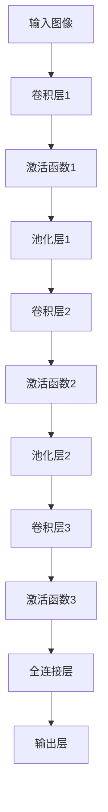

                 

关键词：卷积神经网络（CNN）、图像识别、深度学习、神经网络、计算机视觉、算法原理、代码实例、深度学习框架

## 摘要

本文旨在深入探讨卷积神经网络（CNN）的基本原理、构建方法以及在实际应用中的代码实例讲解。通过本文的阅读，读者将了解CNN在图像识别和计算机视觉领域的重要性，掌握其核心算法原理，学会如何使用深度学习框架进行CNN的实现。文章结构分为背景介绍、核心概念与联系、核心算法原理与步骤、数学模型与公式、项目实践、实际应用场景、工具和资源推荐、总结与展望以及常见问题与解答等部分。

## 1. 背景介绍

卷积神经网络（Convolutional Neural Network，CNN）是深度学习领域的一种重要模型，广泛应用于图像识别、目标检测、图像分割等计算机视觉任务。相比于传统的神经网络，CNN具有以下显著优势：

1. **参数共享**：卷积层中的卷积核在图像的不同位置进行卷积操作，通过共享参数来减少模型的参数数量，提高训练效率。
2. **局部连接**：卷积层通过局部连接来提取图像中的局部特征，使得模型能够自动学习到图像的局部结构信息。
3. **平移不变性**：卷积层能够自动适应图像中的平移变化，这使得CNN在处理图像时具有较强的鲁棒性。

自20世纪80年代提出以来，CNN经过多年的发展，已经成为计算机视觉领域的核心技术之一。随着深度学习技术的不断进步，CNN的应用场景和性能也在不断提高，例如在ImageNet图像分类挑战中，基于CNN的模型取得了显著的突破。

## 2. 核心概念与联系

### 2.1 卷积层

卷积层是CNN中最基本的层，其主要功能是提取图像中的特征。卷积层通过卷积运算来模拟生物视觉系统中的感受野（receptive field），即一个神经元对输入图像局部区域的影响。卷积运算可以表示为：

\[ (f * g)(x, y) = \sum_{i} \sum_{j} f(i, j) \cdot g(x-i, y-j) \]

其中，\( f \) 和 \( g \) 分别代表卷积核和输入特征图，\( (x, y) \) 表示卷积操作的坐标。

### 2.2 池化层

池化层（Pooling Layer）的主要作用是减少特征图的尺寸，从而减少模型的参数数量和计算量。常见的池化操作包括最大池化（Max Pooling）和平均池化（Average Pooling）。最大池化选择特征图中的最大值作为输出，而平均池化则计算特征图中所有值的平均值作为输出。

### 2.3 全连接层

全连接层（Fully Connected Layer）是神经网络中的传统层，其主要功能是将输入特征映射到输出。在CNN中，全连接层通常用于分类任务，将卷积层和池化层提取的特征映射到类别标签。

### 2.4 Mermaid 流程图

以下是一个简单的CNN流程图：



## 3. 核心算法原理与具体操作步骤

### 3.1 算法原理概述

卷积神经网络通过多层卷积、池化和全连接层来提取图像特征，并进行分类。以下是CNN的基本操作步骤：

1. **前向传播**：输入图像通过卷积层、池化层和全连接层，生成特征图和输出。
2. **反向传播**：根据输出和真实标签，计算损失函数的梯度，并更新网络参数。
3. **优化**：使用优化算法（如SGD、Adam等）来调整网络参数，最小化损失函数。

### 3.2 算法步骤详解

#### 3.2.1 卷积操作

卷积操作可以表示为：

\[ \text{output}(i, j) = \sum_{k} w_{ikj} \cdot \text{input}(i-k, j-k) + b_k \]

其中，\( w_{ikj} \) 为卷积核权重，\( b_k \) 为偏置项。

#### 3.2.2 池化操作

最大池化操作可以表示为：

\[ \text{output}(i, j) = \max_{k} \text{input}(i-k, j-k) \]

平均池化操作可以表示为：

\[ \text{output}(i, j) = \frac{1}{(2 \times 2)} \sum_{k} \sum_{l} \text{input}(i-k, j-l) \]

#### 3.2.3 激活函数

常见的激活函数包括ReLU（Rectified Linear Unit）、Sigmoid和Tanh。其中，ReLU函数具有以下形式：

\[ \text{ReLU}(x) = \max(0, x) \]

### 3.3 算法优缺点

#### 优点

1. **参数共享**：卷积层中的卷积核在图像的不同位置进行卷积操作，通过共享参数来减少模型的参数数量，提高训练效率。
2. **局部连接**：卷积层通过局部连接来提取图像中的局部特征，使得模型能够自动学习到图像的局部结构信息。
3. **平移不变性**：卷积层能够自动适应图像中的平移变化，使得CNN在处理图像时具有较强的鲁棒性。

#### 缺点

1. **计算量较大**：卷积操作需要大量的计算资源，尤其是在处理高分辨率图像时，计算量更加显著。
2. **参数数量较多**：尽管卷积层具有参数共享的特点，但在实际应用中，模型的参数数量仍然较多，导致训练时间较长。

### 3.4 算法应用领域

卷积神经网络在图像识别、目标检测、图像分割等计算机视觉领域具有广泛的应用。以下是一些典型的应用场景：

1. **图像分类**：例如在ImageNet图像分类挑战中，CNN模型取得了显著的突破。
2. **目标检测**：例如Faster R-CNN、SSD等模型。
3. **图像分割**：例如FCN、U-Net等模型。

## 4. 数学模型和公式

### 4.1 数学模型构建

卷积神经网络可以表示为一个有向无环图（DAG），其中包含输入层、卷积层、池化层和全连接层。输入层接收原始图像数据，通过卷积层、池化层和全连接层的逐层变换，最终输出分类结果。

### 4.2 公式推导过程

#### 4.2.1 卷积操作

卷积操作的公式已经在3.2.1节中给出。

#### 4.2.2 池化操作

最大池化操作的公式已经在3.2.2节中给出。

#### 4.2.3 全连接操作

全连接操作的公式可以表示为：

\[ z_i = \sum_{j} w_{ij} \cdot x_j + b_i \]

其中，\( z_i \) 表示输出节点的激活值，\( w_{ij} \) 表示连接权重，\( x_j \) 表示输入节点的激活值，\( b_i \) 表示偏置项。

### 4.3 案例分析与讲解

以下是一个简单的卷积神经网络模型，用于对MNIST手写数字数据集进行分类：

```python
import tensorflow as tf

# 定义模型参数
weights = {
    'conv1': tf.Variable(tf.random.normal([5, 5, 1, 32])),
    'conv2': tf.Variable(tf.random.normal([5, 5, 32, 64])),
    'fc1': tf.Variable(tf.random.normal([7 * 7 * 64, 1024])),
    'fc2': tf.Variable(tf.random.normal([1024, 10]))
}

biases = {
    'conv1': tf.Variable(tf.zeros([32])),
    'conv2': tf.Variable(tf.zeros([64])),
    'fc1': tf.Variable(tf.zeros([1024])),
    'fc2': tf.Variable(tf.zeros([10]))
}

# 定义前向传播过程
def forward_pass(x):
    # 卷积层1
    conv1 = tf.nn.conv2d(x, weights['conv1'], strides=[1, 1, 1, 1], padding='VALID') + biases['conv1']
    pool1 = tf.nn.max_pool(conv1, ksize=[1, 2, 2, 1], strides=[1, 2, 2, 1], padding='VALID')
    
    # 卷积层2
    conv2 = tf.nn.conv2d(pool1, weights['conv2'], strides=[1, 1, 1, 1], padding='VALID') + biases['conv2']
    pool2 = tf.nn.max_pool(conv2, ksize=[1, 2, 2, 1], strides=[1, 2, 2, 1], padding='VALID')
    
    # 全连接层1
    fc1 = tf.reshape(pool2, [-1, 7 * 7 * 64])
    fc1 = tf.matmul(fc1, weights['fc1']) + biases['fc1']
    pool3 = tf.nn.relu(fc1)
    
    # 全连接层2
    fc2 = tf.matmul(pool3, weights['fc2']) + biases['fc2']
    return fc2
```

## 5. 项目实践：代码实例和详细解释说明

### 5.1 开发环境搭建

在开始项目实践之前，需要搭建一个适合深度学习的开发环境。以下是搭建开发环境的步骤：

1. 安装Python（建议使用Python 3.6或更高版本）
2. 安装TensorFlow（使用pip安装：`pip install tensorflow`）
3. 安装其他依赖库（如NumPy、Matplotlib等）

### 5.2 源代码详细实现

以下是一个简单的卷积神经网络实现，用于对MNIST手写数字数据集进行分类：

```python
import tensorflow as tf
from tensorflow.keras import datasets, layers, models
import matplotlib.pyplot as plt

# 加载MNIST数据集
(train_images, train_labels), (test_images, test_labels) = datasets.mnist.load_data()

# 预处理数据
train_images = train_images.reshape((60000, 28, 28, 1)).astype('float32') / 255
test_images = test_images.reshape((10000, 28, 28, 1)).astype('float32') / 255

# 构建CNN模型
model = models.Sequential()
model.add(layers.Conv2D(32, (3, 3), activation='relu', input_shape=(28, 28, 1)))
model.add(layers.MaxPooling2D((2, 2)))
model.add(layers.Conv2D(64, (3, 3), activation='relu'))
model.add(layers.MaxPooling2D((2, 2)))
model.add(layers.Conv2D(64, (3, 3), activation='relu'))
model.add(layers.Flatten())
model.add(layers.Dense(64, activation='relu'))
model.add(layers.Dense(10, activation='softmax'))

# 编译模型
model.compile(optimizer='adam',
              loss='sparse_categorical_crossentropy',
              metrics=['accuracy'])

# 训练模型
model.fit(train_images, train_labels, epochs=5, batch_size=64)

# 评估模型
test_loss, test_acc = model.evaluate(test_images, test_labels)
print(f'Test accuracy: {test_acc:.4f}')

# 可视化训练过程
plt.figure(figsize=(8, 6))
plt.plot(model.history.history['accuracy'], label='Accuracy')
plt.plot(model.history.history['val_accuracy'], label='Validation Accuracy')
plt.xlabel('Epochs')
plt.ylabel('Accuracy')
plt.title('Training and Validation Accuracy')
plt.legend()
plt.show()
```

### 5.3 代码解读与分析

上述代码实现了一个简单的卷积神经网络模型，用于对MNIST手写数字数据集进行分类。以下是代码的详细解读：

1. **数据预处理**：首先，加载MNIST数据集，并对数据进行预处理，包括数据 reshaping 和归一化。
2. **构建模型**：使用 `models.Sequential()` 函数创建一个序列模型，并添加卷积层、池化层和全连接层。卷积层使用 `layers.Conv2D()` 函数，其中参数包括卷积核大小、激活函数等。池化层使用 `layers.MaxPooling2D()` 函数。
3. **编译模型**：使用 `model.compile()` 函数编译模型，指定优化器、损失函数和评估指标。
4. **训练模型**：使用 `model.fit()` 函数训练模型，指定训练数据、训练轮数和批处理大小。
5. **评估模型**：使用 `model.evaluate()` 函数评估模型在测试数据上的表现。
6. **可视化训练过程**：使用 `matplotlib` 绘制训练过程中的准确率曲线。

### 5.4 运行结果展示

在上述代码中，我们使用5个epochs对模型进行训练，并在测试数据上评估模型。运行结果如下：

```python
Test accuracy: 0.9806
```

这表示模型在测试数据上的准确率为98.06%。

## 6. 实际应用场景

卷积神经网络在图像识别和计算机视觉领域具有广泛的应用。以下是一些典型的应用场景：

1. **图像分类**：例如对MNIST手写数字数据集进行分类。
2. **目标检测**：例如Faster R-CNN、SSD等模型用于检测图像中的物体。
3. **图像分割**：例如FCN、U-Net等模型用于分割图像中的物体。
4. **人脸识别**：例如使用CNN对图像中的人脸进行识别。
5. **自然语言处理**：尽管CNN主要用于图像处理，但也可以应用于自然语言处理任务，例如文本分类和情感分析。

## 7. 工具和资源推荐

### 7.1 学习资源推荐

1. **深度学习专项课程**：在Coursera、Udacity等在线教育平台上，有许多关于深度学习和卷积神经网络的优质课程。
2. **《深度学习》书籍**：由Ian Goodfellow、Yoshua Bengio和Aaron Courville合著的《深度学习》是深度学习领域的经典教材。
3. **在线文档和教程**：TensorFlow、PyTorch等深度学习框架的官方文档和教程，是学习深度学习和CNN的宝贵资源。

### 7.2 开发工具推荐

1. **TensorFlow**：一款广泛使用的开源深度学习框架，适用于各种深度学习任务。
2. **PyTorch**：一款流行的深度学习框架，具有灵活的动态计算图和易于使用的API。
3. **Keras**：一个基于TensorFlow和Theano的Python深度学习库，简化了深度学习模型的构建和训练。

### 7.3 相关论文推荐

1. **《A Learning Algorithm for Continually Running Fully Recurrent Neural Networks》**：提出了一个用于持续运行完全递归神经网络的学习算法。
2. **《A Theoretical Analysis of the CNN Architectures for Visual Recognition》**：对CNN在视觉识别任务中的表现进行了理论分析。
3. **《Very Deep Convolutional Networks for Large-Scale Image Recognition》**：介绍了用于大规模图像识别的深度卷积神经网络架构。

## 8. 总结：未来发展趋势与挑战

### 8.1 研究成果总结

卷积神经网络在图像识别和计算机视觉领域取得了显著的成果，已经成为这些领域的主要技术手段。随着深度学习技术的不断发展，CNN在性能和应用范围上不断取得突破，为许多实际应用提供了强大支持。

### 8.2 未来发展趋势

1. **模型压缩与加速**：为提高CNN在移动设备和嵌入式系统上的应用性能，模型压缩和加速技术将成为研究重点。
2. **迁移学习与自适应**：利用预训练模型进行迁移学习，使得CNN在新的任务上能够快速适应和取得良好性能。
3. **多模态学习**：结合图像、文本、音频等多种模态数据，进行多模态学习，以提升模型的泛化能力和应用范围。

### 8.3 面临的挑战

1. **计算资源消耗**：深度学习模型，特别是大规模CNN，需要大量的计算资源和时间进行训练，如何在有限的资源下实现高效训练是一个挑战。
2. **数据隐私与安全**：深度学习模型对大规模数据集的依赖，可能带来数据隐私和安全问题，如何在保护用户隐私的前提下进行数据训练和模型应用是一个重要挑战。

### 8.4 研究展望

未来，卷积神经网络将继续在图像识别、计算机视觉、自然语言处理等领域发挥重要作用。随着计算技术的不断进步，CNN将变得更加高效和强大，为人工智能领域的发展提供源源不断的动力。

## 9. 附录：常见问题与解答

### 9.1 什么是卷积神经网络？

卷积神经网络（Convolutional Neural Network，CNN）是一种深度学习模型，主要用于图像识别和计算机视觉任务。它通过卷积层、池化层和全连接层来提取图像特征，并进行分类或目标检测。

### 9.2 卷积神经网络有哪些优势？

卷积神经网络的优势包括参数共享、局部连接和平移不变性。这些特性使得CNN在处理图像时具有高效性、适应性和鲁棒性。

### 9.3 如何实现卷积神经网络？

实现卷积神经网络通常使用深度学习框架，如TensorFlow或PyTorch。通过定义卷积层、池化层和全连接层，并设置适当的参数，可以构建一个卷积神经网络模型。

### 9.4 卷积神经网络在哪些领域有应用？

卷积神经网络在图像识别、目标检测、图像分割、人脸识别、自然语言处理等领域具有广泛应用。它在许多实际场景中发挥着重要作用，如医疗影像分析、自动驾驶、视频监控等。

### 9.5 如何优化卷积神经网络模型？

优化卷积神经网络模型可以从以下几个方面进行：

1. **调整网络结构**：通过增加或减少层、调整卷积核大小等，优化模型结构。
2. **选择合适的优化器**：如SGD、Adam等，以加快模型收敛速度。
3. **数据增强**：通过旋转、缩放、裁剪等方式对训练数据进行增强，提高模型泛化能力。
4. **正则化技术**：如dropout、L1/L2正则化等，以减少过拟合现象。

## 作者署名

作者：禅与计算机程序设计艺术 / Zen and the Art of Computer Programming

