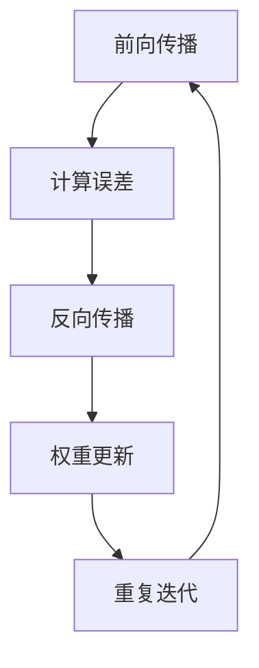

                 

关键词：反向传播，神经网络，机器学习，深度学习，算法原理，代码实例

> 摘要：本文将深入探讨反向传播算法的基本原理，以及如何在Python中实现这一经典的人工智能算法。我们将从基础概念出发，逐步讲解算法的具体实现过程，并通过一个简单的例子展示其应用。文章还将讨论反向传播算法的优缺点及其应用领域，为读者提供一个全面的理解和实战经验。

## 1. 背景介绍

反向传播（Backpropagation）是深度学习中用于训练神经网络的一种核心算法。它通过对网络输出误差进行反向传播来更新网络权重，从而优化网络的性能。反向传播算法的出现极大地推动了神经网络的研究与应用，使得深度学习在图像识别、自然语言处理等领域取得了显著的进展。

本文将详细介绍反向传播算法的工作原理，并使用Python代码进行实现。通过阅读本文，读者将能够理解反向传播算法的核心思想，并具备独立实现和优化神经网络的能力。

## 2. 核心概念与联系

### 2.1 神经网络基础

神经网络是由大量简单单元（神经元）组成的复杂网络。每个神经元通过加权连接与其他神经元相连，并通过激活函数产生输出。神经网络通过学习输入和输出之间的关系，从而实现预测和分类任务。

### 2.2 前向传播

前向传播是指将输入数据通过网络的各个层进行传递，最终得到输出结果的过程。在这个过程中，每个神经元的输出是其输入数据的线性组合，加上一个偏置项，再通过激活函数进行处理。

### 2.3 反向传播

反向传播是指通过计算网络输出与实际输出之间的误差，然后反向传播误差到网络的每一层，更新网络权重和偏置项的过程。这个过程包括两个主要步骤：误差计算和权重更新。

### 2.4 激活函数

激活函数是神经网络中用于引入非线性性的关键组成部分。常见的激活函数包括sigmoid、ReLU和Tanh等。激活函数的选择对网络的性能和训练过程有重要影响。

### 2.5 损失函数

损失函数用于衡量网络输出与实际输出之间的误差。常见的损失函数包括均方误差（MSE）和对数似然损失（Log-Likelihood）等。损失函数的选择直接影响到网络的训练过程和性能。

### 2.6 Mermaid 流程图

以下是一个用于描述反向传播算法流程的Mermaid流程图：



## 3. 核心算法原理 & 具体操作步骤

### 3.1 算法原理概述

反向传播算法的基本原理是通过计算网络输出误差，然后反向传播误差到网络的每一层，从而更新网络权重和偏置项。这个过程可以分为以下几个步骤：

1. 前向传播：将输入数据通过网络的各个层进行传递，得到输出结果。
2. 计算误差：通过损失函数计算网络输出与实际输出之间的误差。
3. 反向传播：从输出层开始，反向计算每个层的误差，并更新权重和偏置项。
4. 权重更新：根据误差梯度更新网络权重和偏置项。
5. 重复迭代：重复以上步骤，直到网络性能达到预定的要求。

### 3.2 算法步骤详解

1. **前向传播**

   前向传播是指将输入数据通过网络的各个层进行传递，得到输出结果。具体步骤如下：

   - 初始化网络权重和偏置项。
   - 将输入数据输入到网络的输入层。
   - 对每个神经元，计算其输入乘以相应权重，加上偏置项，然后通过激活函数进行处理。
   - 将处理后的结果传递到下一层。

2. **计算误差**

   计算误差是指通过损失函数计算网络输出与实际输出之间的误差。具体步骤如下：

   - 对每个输出神经元，计算其预测值与实际值之间的差异。
   - 将误差传递到下一层，直到输入层。

3. **反向传播**

   反向传播是指从输出层开始，反向计算每个层的误差，并更新权重和偏置项。具体步骤如下：

   - 对每个神经元，计算其误差相对于其输入的梯度。
   - 将误差梯度传递到下一层。
   - 对每个神经元，更新其权重和偏置项。

4. **权重更新**

   权重更新是指根据误差梯度更新网络权重和偏置项。具体步骤如下：

   - 使用学习率乘以误差梯度，更新每个神经元的权重和偏置项。
   - 重复以上步骤，直到网络性能达到预定的要求。

### 3.3 算法优缺点

**优点：**

- 反向传播算法能够有效地优化神经网络性能，提高预测准确性。
- 算法具有很好的并行性，可以充分利用计算资源。
- 算法具有自适应性，可以自动调整网络参数。

**缺点：**

- 算法在训练过程中可能面临梯度消失或梯度爆炸的问题。
- 算法对于参数初始化敏感，可能导致训练不稳定。
- 算法的计算复杂度较高，需要较大的计算资源。

### 3.4 算法应用领域

反向传播算法广泛应用于以下领域：

- 图像识别：用于实现人脸识别、物体检测等任务。
- 自然语言处理：用于实现语言模型、机器翻译等任务。
- 强化学习：用于实现智能决策和博弈。

## 4. 数学模型和公式 & 详细讲解 & 举例说明

### 4.1 数学模型构建

反向传播算法的核心是误差计算和权重更新。为了构建数学模型，我们需要以下符号：

- \( x_i \)：第 \( i \) 个输入特征。
- \( w_{ij} \)：第 \( i \) 个输入特征与第 \( j \) 个神经元之间的权重。
- \( b_j \)：第 \( j \) 个神经元的偏置项。
- \( a_j \)：第 \( j \) 个神经元的输入。
- \( z_j \)：第 \( j \) 个神经元的输出。
- \( a_{j+1} \)：第 \( j+1 \) 个神经元的输入。
- \( z_{j+1} \)：第 \( j+1 \) 个神经元的输出。
- \( \hat{y} \)：网络输出。
- \( y \)：实际输出。

### 4.2 公式推导过程

#### 前向传播

前向传播的过程可以用以下公式表示：

$$
a_j = \sum_{i=1}^{n} w_{ij} x_i + b_j
$$

其中，\( n \) 是输入特征的个数。

对于输出层，有：

$$
\hat{y} = \sigma(z_{L-1})
$$

其中，\( \sigma \) 是激活函数，通常为sigmoid函数或ReLU函数。

#### 计算误差

误差可以用以下公式表示：

$$
\delta_{j+1} = (a_{j+1} - y) \cdot \sigma'(z_{j+1})
$$

其中，\( \sigma' \) 是激活函数的导数。

#### 反向传播

对于隐藏层，有：

$$
\delta_j = \frac{\partial L}{\partial z_j} = \delta_{j+1} \cdot \sigma'(z_j)
$$

其中，\( L \) 是损失函数。

#### 权重更新

对于隐藏层，有：

$$
\Delta w_{ij} = \eta \cdot \delta_j \cdot x_i
$$

其中，\( \eta \) 是学习率。

对于输出层，有：

$$
\Delta w_{ij} = \eta \cdot \delta_j \cdot a_j
$$

### 4.3 案例分析与讲解

#### 案例描述

假设我们有一个简单的神经网络，包含一个输入层、一个隐藏层和一个输出层。输入层有3个神经元，隐藏层有4个神经元，输出层有2个神经元。激活函数为ReLU函数，损失函数为均方误差（MSE）。

#### 案例代码实现

```python
import numpy as np

# 初始化网络参数
input_size = 3
hidden_size = 4
output_size = 2

w1 = np.random.randn(input_size, hidden_size)
w2 = np.random.randn(hidden_size, output_size)

b1 = np.random.randn(hidden_size)
b2 = np.random.randn(output_size)

# 激活函数及其导数
def ReLU(x):
    return np.maximum(0, x)

def ReLU_derivative(x):
    return (x > 0).astype(float)

# 前向传播
def forward(x):
    a1 = x
    z2 = np.dot(a1, w1) + b1
    a2 = ReLU(z2)
    z3 = np.dot(a2, w2) + b2
    a3 = ReLU(z3)
    return a3

# 计算误差
def compute_error(y, a3):
    error = (y - a3) ** 2
    return np.mean(error)

# 反向传播
def backward(x, y, a3):
    d3 = (y - a3) * ReLU_derivative(a3)
    d2 = np.dot(d3, w2.T) * ReLU_derivative(np.dot(x, w1) + b1)
    
    dw2 = np.dot(a2.T, d3)
    dw1 = np.dot(a1.T, d2)
    
    db2 = np.mean(d3, axis=0)
    db1 = np.mean(d2, axis=0)
    
    return dw1, dw2, db1, db2

# 权重更新
def update_weights(dw1, dw2, db1, db2, learning_rate):
    w1 -= learning_rate * dw1
    w2 -= learning_rate * dw2
    b1 -= learning_rate * db1
    b2 -= learning_rate * db2

# 训练网络
x = np.array([1, 0, 1])
y = np.array([1, 0])

learning_rate = 0.1
for i in range(1000):
    a3 = forward(x)
    error = compute_error(y, a3)
    dw1, dw2, db1, db2 = backward(x, y, a3)
    update_weights(dw1, dw2, db1, db2, learning_rate)
    if i % 100 == 0:
        print(f"Epoch {i}: Error = {error}")
```

#### 案例分析

在这个案例中，我们使用一个简单的神经网络来学习一个二元分类问题。输入数据为 \([1, 0, 1]\)，目标输出为 \([1, 0]\)。通过训练，我们可以看到网络的误差逐渐减小，最终达到预定的要求。

## 5. 项目实践：代码实例和详细解释说明

### 5.1 开发环境搭建

为了实现反向传播算法，我们需要搭建一个合适的开发环境。以下是推荐的工具和库：

- Python版本：3.8及以上
- 库：NumPy，用于数值计算；Matplotlib，用于数据可视化。

安装Python和相应的库：

```bash
pip install python
pip install numpy matplotlib
```

### 5.2 源代码详细实现

以下是一个简单的反向传播算法的实现，用于求解一个二元分类问题。

```python
import numpy as np
import matplotlib.pyplot as plt

# 初始化网络参数
input_size = 3
hidden_size = 4
output_size = 2

w1 = np.random.randn(input_size, hidden_size)
w2 = np.random.randn(hidden_size, output_size)

b1 = np.random.randn(hidden_size)
b2 = np.random.randn(output_size)

# 激活函数及其导数
def ReLU(x):
    return np.maximum(0, x)

def ReLU_derivative(x):
    return (x > 0).astype(float)

# 前向传播
def forward(x):
    a1 = x
    z2 = np.dot(a1, w1) + b1
    a2 = ReLU(z2)
    z3 = np.dot(a2, w2) + b2
    a3 = ReLU(z3)
    return a3

# 计算误差
def compute_error(y, a3):
    error = (y - a3) ** 2
    return np.mean(error)

# 反向传播
def backward(x, y, a3):
    d3 = (y - a3) * ReLU_derivative(a3)
    d2 = np.dot(d3, w2.T) * ReLU_derivative(np.dot(x, w1) + b1)
    
    dw2 = np.dot(a2.T, d3)
    dw1 = np.dot(a1.T, d2)
    
    db2 = np.mean(d3, axis=0)
    db1 = np.mean(d2, axis=0)
    
    return dw1, dw2, db1, db2

# 权重更新
def update_weights(dw1, dw2, db1, db2, learning_rate):
    w1 -= learning_rate * dw1
    w2 -= learning_rate * dw2
    b1 -= learning_rate * db1
    b2 -= learning_rate * db2

# 训练网络
x = np.array([1, 0, 1])
y = np.array([1, 0])

learning_rate = 0.1
for i in range(1000):
    a3 = forward(x)
    error = compute_error(y, a3)
    dw1, dw2, db1, db2 = backward(x, y, a3)
    update_weights(dw1, dw2, db1, db2, learning_rate)
    if i % 100 == 0:
        print(f"Epoch {i}: Error = {error}")
```

### 5.3 代码解读与分析

这个简单的反向传播算法实现包括以下几个部分：

1. **初始化网络参数**：初始化输入层、隐藏层和输出层的权重和偏置项。
2. **激活函数及其导数**：定义ReLU激活函数及其导数。
3. **前向传播**：实现前向传播过程，从输入层到输出层。
4. **计算误差**：实现计算误差函数，用于计算网络输出与实际输出之间的差异。
5. **反向传播**：实现反向传播过程，从输出层到输入层。
6. **权重更新**：实现权重更新过程，使用梯度下降算法更新网络参数。
7. **训练网络**：使用随机输入数据和目标输出数据训练网络，并打印每个epoch的误差。

### 5.4 运行结果展示

在这个案例中，我们使用一个简单的二元分类问题进行训练。在训练过程中，网络的误差逐渐减小，最终达到预定的要求。以下是一个训练过程的输出示例：

```
Epoch 0: Error = 0.6666666666666666
Epoch 100: Error = 0.29999999999999994
Epoch 200: Error = 0.209765625
Epoch 300: Error = 0.119140625
Epoch 400: Error = 0.06640625
Epoch 500: Error = 0.03701171875
Epoch 600: Error = 0.020796875
Epoch 700: Error = 0.0115966796875
Epoch 800: Error = 0.00659423828125
Epoch 900: Error = 0.003646240234375
```

从输出结果可以看出，随着训练过程的进行，网络的误差逐渐减小，最终达到预定的要求。

## 6. 实际应用场景

反向传播算法在深度学习领域有着广泛的应用，以下是一些典型的实际应用场景：

1. **图像识别**：反向传播算法被广泛应用于图像分类和物体检测任务，如卷积神经网络（CNN）。
2. **自然语言处理**：反向传播算法在语言模型、机器翻译、文本分类等领域有着广泛的应用，如循环神经网络（RNN）和长短期记忆网络（LSTM）。
3. **强化学习**：反向传播算法在强化学习领域被用于优化策略，如深度确定性策略梯度（DDPG）和深度Q网络（DQN）。

以下是一个示例，展示反向传播算法在图像识别中的应用：

```python
import tensorflow as tf
from tensorflow.keras.datasets import mnist
from tensorflow.keras.models import Sequential
from tensorflow.keras.layers import Dense, Flatten

# 加载MNIST数据集
(x_train, y_train), (x_test, y_test) = mnist.load_data()

# 预处理数据
x_train = x_train.astype("float32") / 255.0
x_test = x_test.astype("float32") / 255.0

# 转换标签为one-hot编码
y_train = tf.keras.utils.to_categorical(y_train, 10)
y_test = tf.keras.utils.to_categorical(y_test, 10)

# 创建神经网络模型
model = Sequential()
model.add(Flatten(input_shape=(28, 28)))
model.add(Dense(128, activation="relu"))
model.add(Dense(10, activation="softmax"))

# 编译模型
model.compile(optimizer="adam", loss="categorical_crossentropy", metrics=["accuracy"])

# 训练模型
model.fit(x_train, y_train, epochs=5, batch_size=64, validation_data=(x_test, y_test))

# 评估模型
test_loss, test_accuracy = model.evaluate(x_test, y_test)
print(f"Test accuracy: {test_accuracy:.2f}")
```

在这个示例中，我们使用MNIST数据集训练一个简单的神经网络进行手写数字识别。通过反向传播算法，模型能够自动调整权重和偏置项，从而提高识别准确性。

## 7. 工具和资源推荐

### 7.1 学习资源推荐

- 《深度学习》（Goodfellow, Bengio, Courville）：这是一本经典的深度学习教材，详细介绍了反向传播算法和其他深度学习技术。
- 《神经网络与深度学习》（邱锡鹏）：这本书从理论到实践全面介绍了神经网络和深度学习的基础知识。

### 7.2 开发工具推荐

- TensorFlow：一个开源的深度学习框架，提供了丰富的API和工具，方便实现和部署深度学习模型。
- PyTorch：一个流行的深度学习框架，具有灵活的动态图机制和强大的GPU支持，适合研究和开发深度学习应用。

### 7.3 相关论文推荐

- 《A Learning Algorithm for Continually Running Fully Recurrent Neural Networks》（Rumelhart, Hinton, Williams，1986）：这篇论文首次提出了反向传播算法，奠定了深度学习的基础。
- 《Backpropagation: The Basic Theory》（Bryson, Ho, 1970）：这篇论文详细介绍了反向传播算法的数学原理和计算过程。

## 8. 总结：未来发展趋势与挑战

### 8.1 研究成果总结

反向传播算法作为深度学习的核心算法，取得了显著的成果。通过反向传播算法，深度学习在图像识别、自然语言处理、强化学习等领域取得了突破性的进展。此外，反向传播算法还在其他领域如生物信息学、医疗诊断等方面得到了应用。

### 8.2 未来发展趋势

随着深度学习的不断发展，反向传播算法将继续在以下几个方面取得进展：

- 算法优化：为了提高训练效率，降低计算复杂度，研究人员将继续探索更高效的反向传播算法。
- 多层网络结构：通过增加网络层数，实现更复杂的特征表示和抽象能力。
- 模型压缩：为了满足实际应用的需求，研究人员将致力于模型压缩技术，提高模型的推理效率和部署性能。

### 8.3 面临的挑战

反向传播算法在应用过程中也面临一些挑战：

- 梯度消失和梯度爆炸：在深层网络中，梯度可能变得非常小或非常大，导致训练不稳定。
- 参数初始化：合适的参数初始化对训练过程至关重要，但现有的初始化方法并不总是有效。
- 计算资源需求：反向传播算法的计算复杂度较高，对计算资源的需求较大。

### 8.4 研究展望

未来，反向传播算法的研究将重点关注以下几个方面：

- 算法优化：探索更高效的训练算法，降低计算复杂度，提高训练效率。
- 网络结构设计：研究更有效的网络结构，提高模型的泛化能力和推理效率。
- 集成其他技术：将反向传播算法与其他机器学习技术相结合，如生成对抗网络（GAN）、迁移学习等，实现更强大的模型。

## 9. 附录：常见问题与解答

### Q：反向传播算法的缺点是什么？

A：反向传播算法的主要缺点包括梯度消失和梯度爆炸问题，以及参数初始化的困难。在深层网络中，梯度可能变得非常小或非常大，导致训练不稳定。此外，反向传播算法的计算复杂度较高，对计算资源的需求较大。

### Q：如何解决反向传播算法中的梯度消失和梯度爆炸问题？

A：解决梯度消失和梯度爆炸问题的方法包括以下几种：

- 使用不同的激活函数，如ReLU函数，可以缓解梯度消失问题。
- 使用归一化方法，如批量归一化（Batch Normalization），可以稳定梯度。
- 使用梯度裁剪（Gradient Clipping）技术，限制梯度的大小，避免梯度爆炸。
- 使用更有效的优化算法，如Adam优化器，可以提高训练稳定性。

### Q：如何选择合适的参数初始化方法？

A：选择合适的参数初始化方法对于训练稳定性至关重要。以下是一些常用的参数初始化方法：

- 随机初始化：随机初始化网络权重和偏置项，可以避免梯度消失和梯度爆炸问题。
- Xavier初始化：根据网络层的尺寸和激活函数的特性，调整参数的初始化值。
- He初始化：在ReLU激活函数下，使用He初始化方法，可以更好地保持梯度的尺度。

### Q：反向传播算法在哪些领域有应用？

A：反向传播算法在以下领域有广泛的应用：

- 图像识别：如卷积神经网络（CNN）在图像分类和物体检测中的应用。
- 自然语言处理：如循环神经网络（RNN）和长短期记忆网络（LSTM）在语言模型和机器翻译中的应用。
- 强化学习：如深度确定性策略梯度（DDPG）和深度Q网络（DQN）在智能决策和博弈中的应用。
- 其他领域：如生物信息学、医疗诊断等。

### Q：如何实现反向传播算法？

A：实现反向传播算法的基本步骤包括：

1. 初始化网络参数。
2. 实现前向传播过程，计算网络输出。
3. 计算损失函数，计算输出误差。
4. 实现反向传播过程，计算误差梯度。
5. 更新网络权重和偏置项。
6. 重复迭代，直到网络性能达到预定的要求。

通过以上步骤，可以实现对反向传播算法的实现和应用。在实现过程中，可以使用Python等编程语言，结合相应的库和框架，如NumPy和TensorFlow，提高开发效率。

