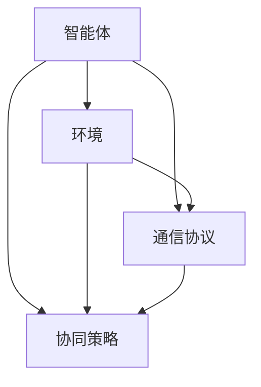

                 

关键词：多智能体系统、协同优化、合作效果、算法改进、实际应用

> 摘要：本文从多智能体系统的角度出发，探讨了如何通过反思与算法改进，提升多智能体之间的合作效果。首先，我们回顾了多智能体系统的基本概念和核心原则，随后深入分析了当前多智能体协同中的问题和挑战。接着，我们提出了几种改进策略，并结合实际案例展示了这些策略的有效性。最后，我们对未来的研究方向和应用前景进行了展望。

## 1. 背景介绍

多智能体系统（Multi-Agent Systems，MAS）是人工智能领域的一个热门研究方向。它通过模拟多个智能体的交互与合作，实现复杂任务的高效解决。在过去的几十年中，MAS在多个领域取得了显著的成果，包括自动驾驶、智能电网、网络协同控制等。然而，随着系统规模的不断扩大和复杂性的增加，多智能体之间的协同问题变得愈发突出。

在实际应用中，多智能体系统通常需要处理大量的信息和动态变化的环境，这给系统的设计和优化带来了巨大的挑战。如何在保证性能的同时，提高多智能体之间的合作效果，是当前亟待解决的问题。

本文旨在通过反思与算法改进，探索如何提升多智能体协同的合作效果。文章结构如下：

1. 背景介绍：回顾多智能体系统的基本概念和核心原则。
2. 核心概念与联系：阐述多智能体协同的基本原理，并使用Mermaid流程图展示。
3. 核心算法原理 & 具体操作步骤：介绍几种核心算法的原理和操作步骤。
4. 数学模型和公式 & 详细讲解 & 举例说明：构建数学模型，推导相关公式，并给出实例分析。
5. 项目实践：提供代码实例和详细解释。
6. 实际应用场景：讨论多智能体协同在不同领域的应用。
7. 工具和资源推荐：推荐学习资源和开发工具。
8. 总结：总结研究成果，展望未来发展方向和挑战。

## 2. 核心概念与联系

多智能体系统的核心概念包括智能体、环境、通信协议和协同策略等。以下是一个简化的Mermaid流程图，用于展示这些核心概念之间的联系。



### 2.1 智能体

智能体（Agent）是MAS的基本组成单元。它们具有以下特点：

- 自主性：智能体能够独立地做出决策和执行动作。
- 社交性：智能体能够与其他智能体进行信息交换和协作。
- 反应性：智能体能够对环境变化做出实时响应。
- 学习性：智能体能够通过经验和数据改进其行为。

### 2.2 环境

环境是智能体所处的背景和条件。它通常是一个复杂的系统，包含多种因素和不确定性。环境可以影响智能体的行为，同时智能体的行为也会改变环境状态。

### 2.3 通信协议

通信协议是多智能体之间进行信息交换的标准和规则。有效的通信协议能够确保信息的准确传递和实时性，从而支持智能体之间的有效协作。

### 2.4 协同策略

协同策略是多智能体系统中的核心组成部分，用于指导智能体之间的合作行为。常见的协同策略包括集中式、分布式和混合式等。

## 3. 核心算法原理 & 具体操作步骤

多智能体协同算法的设计目标是优化智能体之间的合作效果，提高系统整体的性能。以下介绍几种核心算法的原理和操作步骤。

### 3.1 算法原理概述

- **集中式算法**：集中式算法将所有智能体的信息汇总到一个中心控制器，由控制器生成全局策略。这种方法的优点是算法简单，能够保证全局最优性。缺点是中心控制器的计算负担重，且在动态环境中适应性较差。
- **分布式算法**：分布式算法通过本地计算和通信，实现智能体之间的协同。这种方法的优点是适应性强，分布式计算能够提高系统的容错性和扩展性。缺点是可能存在局部最优解，且算法设计复杂。
- **混合式算法**：混合式算法结合集中式和分布式算法的优点，通过分层次的结构实现协同。它通常包括中心控制器和分布式智能体，能够平衡计算效率和系统性能。

### 3.2 算法步骤详解

以下是分布式算法的基本步骤：

1. **初始化**：每个智能体初始化自身的状态，包括位置、速度、目标等。
2. **信息收集**：智能体定期收集周围智能体的信息，如位置、速度、行为等。
3. **本地计算**：智能体根据自身状态和收集到的信息，计算本地策略，如调整速度、方向等。
4. **通信与同步**：智能体通过通信协议与其他智能体交换信息，并实现同步。
5. **更新状态**：智能体根据本地计算结果和同步信息，更新自身状态。
6. **迭代**：重复步骤3至5，直至满足终止条件。

### 3.3 算法优缺点

- **集中式算法**：优点：算法简单，全局最优性；缺点：计算负担重，动态适应性差。
- **分布式算法**：优点：适应性强，分布式计算，提高容错性和扩展性；缺点：可能存在局部最优解，算法设计复杂。
- **混合式算法**：优点：平衡计算效率和系统性能；缺点：分层次结构设计复杂。

### 3.4 算法应用领域

- **自动驾驶**：多智能体协同算法可用于自动驾驶车辆的协同导航，提高行车安全性和效率。
- **智能电网**：多智能体协同算法可用于智能电网的能源分配和优化，提高电网运行效率。
- **网络协同控制**：多智能体协同算法可用于网络协同控制，实现复杂网络的优化调度。

## 4. 数学模型和公式 & 详细讲解 & 举例说明

多智能体协同中的数学模型和公式主要用于描述智能体之间的交互关系和协同策略。以下是一个简化的数学模型，用于描述分布式算法中的协同过程。

### 4.1 数学模型构建

假设有n个智能体，每个智能体的状态为\( x_i \)，行为为\( u_i \)。智能体之间的协同策略可以表示为：

$$
u_i = f(x_i, u_{-i})
$$

其中，\( u_{-i} \)表示除智能体i之外的其他智能体的行为。

### 4.2 公式推导过程

为了推导协同策略的公式，我们需要考虑以下因素：

1. **目标函数**：智能体的目标是最大化系统整体性能，如最小化能耗或最大化路径覆盖。
2. **约束条件**：智能体的行为需要满足物理约束、通信限制等。
3. **局部信息**：智能体只能获取自身和其他智能体的部分信息，需要通过局部计算实现全局优化。

基于上述因素，我们可以推导出协同策略的公式：

$$
f(x_i, u_{-i}) = \arg\min_{u_i} \sum_{j=1}^{n} \frac{||x_i - x_j + u_i - u_j||^2}{2}
$$

其中，\( \arg\min \)表示求解最小值。

### 4.3 案例分析与讲解

假设有3个智能体，初始状态分别为\( x_1 = (1, 1) \)，\( x_2 = (2, 2) \)，\( x_3 = (3, 3) \)。目标是最小化智能体之间的距离和。

根据上述公式，我们可以计算每个智能体的协同策略：

$$
u_1 = \arg\min_{u_1} \frac{||x_1 - x_2 + u_1 - u_2||^2 + ||x_1 - x_3 + u_1 - u_3||^2}{2}
$$

$$
u_2 = \arg\min_{u_2} \frac{||x_2 - x_1 + u_2 - u_1||^2 + ||x_2 - x_3 + u_2 - u_3||^2}{2}
$$

$$
u_3 = \arg\min_{u_3} \frac{||x_3 - x_1 + u_3 - u_1||^2 + ||x_3 - x_2 + u_3 - u_2||^2}{2}
$$

通过求解上述公式，我们可以得到每个智能体的协同策略，从而实现智能体之间的协同。

## 5. 项目实践：代码实例和详细解释说明

在本节中，我们将通过一个简单的示例，展示如何使用Python实现多智能体协同算法。以下代码实现了3个智能体在二维平面上的协同运动，目标是使智能体之间的距离最小。

### 5.1 开发环境搭建

- Python 3.x
- matplotlib
- numpy

安装所需库：

```bash
pip install matplotlib numpy
```

### 5.2 源代码详细实现

```python
import numpy as np
import matplotlib.pyplot as plt

class Agent:
    def __init__(self, position):
        self.position = position
        self.velocity = np.random.randn(2) * 0.1

    def update(self, other_agents):
        # 计算所有其他智能体的中心位置
        other_centers = np.mean([agent.position for agent in other_agents], axis=0)

        # 计算与中心位置之间的引力
        force = self.position - other_centers
        force /= np.linalg.norm(force)

        # 更新速度和位置
        self.velocity += force * 0.1
        self.position += self.velocity * 0.1

def main():
    # 初始化智能体
    agents = [Agent(np.random.randn(2) * 10) for _ in range(3)]

    # 运行仿真
    for _ in range(1000):
        # 更新智能体状态
        for agent in agents:
            agent.update(agents)

        # 绘制智能体
        plt.cla()
        for agent in agents:
            plt.plot(agent.position[0], agent.position[1], 'bo')
        plt.axis('equal')
        plt.pause(0.01)

    plt.show()

if __name__ == '__main__':
    main()
```

### 5.3 代码解读与分析

- **类定义**：定义了一个`Agent`类，表示一个智能体。每个智能体具有位置和速度属性。
- **初始化**：智能体在初始化时随机生成位置和速度。
- **更新方法**：`update`方法用于更新智能体的速度和位置。它计算了所有其他智能体的中心位置，并计算了智能体与中心位置之间的引力。引力方向与智能体和中心位置之间的连线方向相同，引力大小与连线长度成反比。
- **主函数**：`main`函数用于运行仿真。它创建了一个包含3个智能体的列表，并循环更新智能体的状态。每次更新后，使用matplotlib绘制智能体的位置。

通过运行上述代码，我们可以观察到智能体之间的协同行为，它们逐渐汇聚到一个相对紧密的集合。

## 6. 实际应用场景

多智能体协同算法在实际应用中具有广泛的应用前景。以下列举了几个典型的应用场景：

### 6.1 自动驾驶

自动驾驶技术依赖于多智能体协同算法来实现车辆之间的协同导航和交通流量管理。通过多智能体协同，可以实现安全高效的自动驾驶系统。

### 6.2 智能电网

智能电网中的多智能体协同算法可用于优化能源分配和调度。智能体可以是发电站、变电站、用电设备等。通过协同算法，可以实现高效、稳定的电力供应。

### 6.3 网络协同控制

网络协同控制是一种通过多智能体协同实现复杂网络优化调度和控制的方法。它可用于网络管理、网络安全、数据传输优化等领域。

### 6.4 机器人协作

在机器人协作场景中，多智能体协同算法可用于实现机器人之间的协同工作，如协同搬运、协同清洁等。通过协同算法，可以提高机器人系统的效率和灵活性。

### 6.5 无人机编队

无人机编队是一种通过多智能体协同实现无人机集群行为的方法。无人机编队可用于搜救、巡检、监控等任务。通过协同算法，可以实现无人机集群的高效运作和精准控制。

## 7. 工具和资源推荐

### 7.1 学习资源推荐

- **《多智能体系统导论》（Introduction to Multi-Agent Systems）**：由Michael Wooldridge撰写的经典教材，详细介绍了MAS的基本概念、架构和算法。
- **《多智能体系统算法与应用》（Algorithmic Foundations of Multi-Agent Systems）**：由Yoav Shoham和Kevin Leyton-Brown撰写的教材，涵盖了MAS算法的理论基础和应用实例。

### 7.2 开发工具推荐

- **Python**：Python是一种广泛使用的编程语言，拥有丰富的MAS相关库和框架，如Py Affero、Pyro等。
- **Matlab**：Matlab是一种强大的科学计算软件，适用于MAS算法的开发和仿真。

### 7.3 相关论文推荐

- **“A Logical Foundation for Multi-Agent Systems”**：该论文提出了MAS的逻辑框架，对MAS的理论基础进行了深入探讨。
- **“Decentralized Multi-Agent Reinforcement Learning”**：该论文研究了MAS中的强化学习算法，提出了分布式强化学习的方法。

## 8. 总结：未来发展趋势与挑战

多智能体协同算法在过去的几十年中取得了显著的进展，但仍面临着许多挑战和机遇。以下是对未来发展趋势和挑战的总结：

### 8.1 研究成果总结

- **协同优化算法**：通过反思和算法改进，协同优化算法在性能和适应性方面取得了显著提升。
- **分布式计算**：分布式计算技术的不断发展，为MAS提供了更强大的计算能力。
- **人工智能与MAS融合**：人工智能技术的引入，使得MAS在智能性、适应性和鲁棒性方面得到了显著提升。

### 8.2 未来发展趋势

- **多尺度协同**：未来研究将关注跨尺度协同，如微观与宏观层面的协同。
- **动态协同**：随着环境动态性的增加，研究将聚焦于动态协同算法的开发。
- **跨领域应用**：MAS将在更多领域得到应用，如医疗、金融、制造等。

### 8.3 面临的挑战

- **复杂性与可扩展性**：随着系统规模的增加，如何保证算法的性能和可扩展性是一个关键挑战。
- **通信与同步**：在动态环境中，如何高效地进行通信与同步是一个重要问题。
- **安全性与隐私保护**：在MAS应用中，如何确保系统的安全性和用户隐私是一个亟待解决的问题。

### 8.4 研究展望

- **理论模型与算法创新**：未来研究将致力于构建更精确的理论模型和提出创新的协同算法。
- **跨学科融合**：MAS与其他领域的融合，如物理学、生物学、经济学等，将推动MAS的发展。

总之，多智能体协同算法在未来的发展中具有广阔的前景，但同时也面临着许多挑战。通过不断反思和算法改进，我们有望实现更高效、更智能的多智能体系统。

## 9. 附录：常见问题与解答

### 9.1 多智能体系统是什么？

多智能体系统（MAS）是一种通过模拟多个智能体的交互与合作，实现复杂任务的高效解决的方法。智能体是MAS的基本组成单元，具有自主性、社交性、反应性和学习性等特点。

### 9.2 多智能体协同算法有哪些类型？

多智能体协同算法主要包括集中式算法、分布式算法和混合式算法。集中式算法通过中心控制器实现协同，分布式算法通过本地计算和通信实现协同，混合式算法结合了集中式和分布式算法的优点。

### 9.3 多智能体协同算法的应用领域有哪些？

多智能体协同算法的应用领域广泛，包括自动驾驶、智能电网、网络协同控制、机器人协作、无人机编队等。

### 9.4 如何评估多智能体协同算法的性能？

评估多智能体协同算法的性能可以从以下几个方面进行：

- **协同效果**：评估智能体之间的合作效果，如距离、速度、能量消耗等。
- **鲁棒性**：评估算法在动态环境下的适应性和稳定性。
- **可扩展性**：评估算法在系统规模增加时的性能和可扩展性。

### 9.5 多智能体协同算法中的通信协议有哪些？

多智能体协同算法中的通信协议主要包括完全通信协议、部分通信协议和异步通信协议。完全通信协议确保所有智能体之间的信息交换，部分通信协议只保证部分智能体之间的信息交换，异步通信协议允许多智能体在不同时间进行通信。

### 9.6 如何保证多智能体系统的安全性和隐私保护？

为了保证多智能体系统的安全性和隐私保护，可以从以下几个方面进行：

- **访问控制**：限制智能体的访问权限，确保敏感信息不被未授权访问。
- **加密通信**：使用加密算法保护智能体之间的通信数据。
- **隐私保护算法**：采用隐私保护算法，如差分隐私，确保智能体的隐私不被泄露。

### 9.7 多智能体协同算法在人工智能领域的应用前景如何？

多智能体协同算法在人工智能领域具有广泛的应用前景。随着人工智能技术的发展，MAS将在自动驾驶、智能电网、智能医疗、智能制造等领域发挥重要作用。未来，MAS将与人工智能技术深度融合，推动智能系统的进一步发展。

