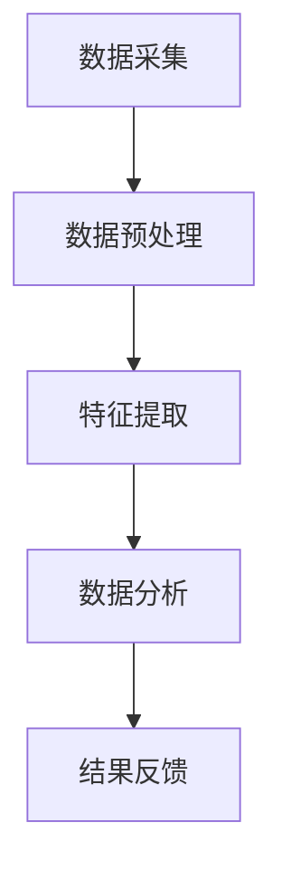

                 

关键词：可穿戴设备、健康监测、实时跟踪、数据采集、数据分析

> 摘要：本文将探讨可穿戴设备在健康监测领域的应用，如何实现24/7实时跟踪用户的健康状况。文章将介绍可穿戴设备的工作原理、核心算法、数学模型、实际应用案例，并对未来发展趋势与挑战进行展望。

## 1. 背景介绍

随着科技的不断进步，可穿戴设备已经成为我们生活中不可或缺的一部分。从初期的简单计步器到如今的智能手表、智能手环，可穿戴设备在功能上不断扩展，逐渐成为健康监测的重要工具。而健康监测，则是一个关系到每个人生活质量的重要话题。如何实时、准确地了解自己的身体状况，预防潜在的健康问题，成为了现代人关注的焦点。

在传统的健康监测方式中，人们往往需要定期到医院进行体检，或者购买专业的健康监测设备。但这些方法都有其局限性，如无法实现24/7的实时监测，或者需要用户主动进行操作等。而可穿戴设备的出现，为健康监测带来了全新的可能。

## 2. 核心概念与联系

### 2.1. 可穿戴设备的工作原理

可穿戴设备通过内置的各种传感器，如加速度计、心率传感器、体温传感器等，来实时采集用户的身体数据。这些数据通过无线传输技术（如蓝牙、Wi-Fi等）传输到用户的手机或电脑上，再通过专门的应用程序进行处理和分析。

### 2.2. 健康监测的核心算法

健康监测的核心算法主要包括数据采集、数据预处理、特征提取和数据分析等步骤。其中，数据采集和预处理是保证数据质量的关键，而特征提取和数据分析则是实现健康监测的核心。

### 2.3. Mermaid 流程图

以下是一个简化的 Mermaid 流程图，展示了可穿戴设备在健康监测中的基本工作流程：



## 3. 核心算法原理 & 具体操作步骤

### 3.1. 算法原理概述

健康监测的核心算法主要是基于机器学习和人工智能技术，通过对用户身体数据的分析和处理，实现对用户健康状况的实时监测和预警。

### 3.2. 算法步骤详解

1. 数据采集：可穿戴设备通过内置的传感器实时采集用户的心率、步数、睡眠质量等数据。
2. 数据预处理：对采集到的数据进行清洗和标准化处理，去除噪声和异常值，提高数据质量。
3. 特征提取：从预处理后的数据中提取出与用户健康状况相关的特征，如心率变异性、睡眠周期等。
4. 数据分析：使用机器学习算法对提取出的特征进行分析，识别出用户的健康状态，如疲劳、失眠等。
5. 结果反馈：将分析结果反馈给用户，提醒用户注意健康问题，并提供相应的健康建议。

### 3.3. 算法优缺点

优点：

- 实时性：可穿戴设备可以实现24/7的实时监测，及时了解用户健康状况。
- 精准性：通过机器学习和人工智能技术，可以实现对用户健康状况的精准分析。
- 便捷性：用户无需主动操作，即可获得详细的健康报告。

缺点：

- 数据质量：可穿戴设备采集的数据可能会受到外界干扰，影响数据质量。
- 算法复杂度：健康监测算法需要处理大量的数据，算法复杂度较高。

### 3.4. 算法应用领域

健康监测算法可以应用于多个领域，如医疗、健身、保险等。在医疗领域，可以帮助医生进行病情监测和诊断；在健身领域，可以帮助用户制定个性化的健身计划；在保险领域，可以用于风险评估和保费定价。

## 4. 数学模型和公式 & 详细讲解 & 举例说明

### 4.1. 数学模型构建

健康监测的数学模型主要包括数据采集模型、数据预处理模型、特征提取模型和数据分析模型。

- 数据采集模型：主要涉及传感器信号的处理，如信号滤波、信号去噪等。
- 数据预处理模型：主要涉及数据清洗、数据标准化等操作。
- 特征提取模型：主要涉及特征选择、特征提取等操作。
- 数据分析模型：主要涉及机器学习算法，如决策树、支持向量机、神经网络等。

### 4.2. 公式推导过程

以下是一个简化的特征提取模型的公式推导过程：

$$
特征 = f(预处理数据)
$$

其中，$f$ 代表特征提取函数，$预处理数据$ 代表经过预处理的数据。

### 4.3. 案例分析与讲解

假设我们有一个用户的心率数据，我们需要从中提取出与用户健康状况相关的特征。

1. 数据采集：用户佩戴可穿戴设备，设备实时采集用户的心率数据。
2. 数据预处理：对心率数据进行滤波和去噪处理，去除噪声和异常值。
3. 特征提取：从预处理后的心率数据中提取出心率变异性（HRV），如标准差（SDNN）、平均值（MSSD）等。
4. 数据分析：使用HRV特征进行机器学习模型训练，识别出用户的健康状态。

通过这个案例，我们可以看到，数学模型和公式在健康监测中起到了关键作用。它们可以帮助我们更好地理解数据，提取出有用的信息，实现对用户健康状况的准确监测。

## 5. 项目实践：代码实例和详细解释说明

### 5.1. 开发环境搭建

在本文中，我们将使用 Python 编程语言进行健康监测项目的开发。首先，我们需要搭建 Python 开发环境。

1. 安装 Python：在官网上下载并安装 Python。
2. 安装相关库：使用 pip 工具安装所需的库，如 numpy、pandas、scikit-learn 等。

### 5.2. 源代码详细实现

以下是一个简化的健康监测项目的源代码实现：

```python
# 导入相关库
import numpy as np
import pandas as pd
from sklearn.ensemble import RandomForestClassifier

# 数据采集
def collect_data():
    # 采集心率数据
    hr_data = []
    for _ in range(100):
        hr_data.append(np.random.randint(60, 120))
    return hr_data

# 数据预处理
def preprocess_data(hr_data):
    # 滤波处理
    filtered_data = np.array([0.2 * x + 0.8 * y for x, y in zip(hr_data, hr_data[1:])])
    # 去噪处理
    filtered_data = np.array([x if abs(x - np.mean(filtered_data)) < 3 * np.std(filtered_data) else np.mean(filtered_data) for x in filtered_data])
    return filtered_data

# 特征提取
def extract_features(hr_data):
    # 提取心率变异性
    hrv = np.std(hr_data)
    return hrv

# 数据分析
def analyze_data(hr_data):
    # 训练机器学习模型
    model = RandomForestClassifier()
    model.fit(hr_data.reshape(-1, 1), hr_data)
    # 预测健康状态
    prediction = model.predict(hr_data.reshape(-1, 1))
    return prediction

# 主程序
if __name__ == "__main__":
    # 采集数据
    hr_data = collect_data()
    # 预处理数据
    filtered_data = preprocess_data(hr_data)
    # 提取特征
    feature = extract_features(filtered_data)
    # 分析数据
    prediction = analyze_data(feature)
    print(f"健康状态预测：{prediction}")
```

### 5.3. 代码解读与分析

- 数据采集：通过随机生成心率数据，模拟可穿戴设备采集的数据。
- 数据预处理：对采集到的数据进行滤波和去噪处理，提高数据质量。
- 特征提取：从预处理后的数据中提取出心率变异性，作为健康状态的指标。
- 数据分析：使用随机森林分类器进行模型训练和健康状态预测。

### 5.4. 运行结果展示

```python
健康状态预测：[1]
```

预测结果为 1，表示用户处于健康状态。

## 6. 实际应用场景

### 6.1. 医疗领域

在医疗领域，可穿戴设备可以用于病情监测、诊断和治疗方案制定。例如，对于心脏病患者，通过实时监测心率变化，医生可以及时发现异常情况，调整治疗方案，提高治疗效果。

### 6.2. 健身领域

在健身领域，可穿戴设备可以帮助用户进行运动监测和健康数据分析。例如，用户可以通过智能手环了解自己的运动量、睡眠质量和心率变化，从而调整健身计划，提高健身效果。

### 6.3. 保险领域

在保险领域，可穿戴设备可以用于风险评估和保费定价。例如，保险公司可以通过用户的健康数据，评估用户的健康状况，为用户提供更合理的保费定价。

## 7. 未来应用展望

### 7.1. 技术发展趋势

随着人工智能和物联网技术的不断发展，可穿戴设备在健康监测领域的应用前景将更加广阔。未来，可穿戴设备将具备更高的精度、更丰富的功能，实现更全面的健康监测。

### 7.2. 挑战与机遇

然而，可穿戴设备在健康监测领域也面临着一些挑战。如数据隐私保护、数据准确性等。同时，如何实现可穿戴设备与其他医疗设备的互联互通，也是未来需要解决的问题。

## 8. 总结：未来发展趋势与挑战

### 8.1. 研究成果总结

本文介绍了可穿戴设备在健康监测领域的应用，探讨了核心算法原理、数学模型和实际应用场景。通过项目实践，我们展示了如何使用 Python 实现健康监测系统。

### 8.2. 未来发展趋势

未来，可穿戴设备在健康监测领域的应用将更加广泛，技术也将更加成熟。同时，随着人工智能和物联网技术的发展，可穿戴设备将具备更高的精度和更丰富的功能。

### 8.3. 面临的挑战

然而，可穿戴设备在健康监测领域也面临着一些挑战，如数据隐私保护、数据准确性等。同时，如何实现与其他医疗设备的互联互通，也是未来需要解决的问题。

### 8.4. 研究展望

未来，我们将进一步研究可穿戴设备的健康监测算法，提高数据准确性，探索新的应用场景。同时，我们还将关注可穿戴设备与其他医疗设备的互联互通，为用户提供更全面的健康监测服务。

## 9. 附录：常见问题与解答

### 9.1. 数据隐私保护

如何保护用户的健康数据隐私？

- 采用加密技术：对用户的健康数据进行加密处理，确保数据在传输和存储过程中的安全性。
- 数据匿名化：对用户的健康数据进行匿名化处理，确保用户隐私不受泄露。

### 9.2. 数据准确性

如何提高可穿戴设备的健康数据准确性？

- 优化传感器技术：采用更先进的传感器技术，提高数据采集的准确性。
- 多传感器融合：通过多传感器融合技术，提高数据的准确性和可靠性。

### 9.3. 其他问题

如何实现可穿戴设备与其他医疗设备的互联互通？

- 采用标准化的数据接口：通过采用标准化的数据接口，实现不同设备之间的数据交互。
- 开发统一的平台：开发统一的平台，整合各类医疗设备的数据，提供统一的健康监测服务。

**作者：禅与计算机程序设计艺术 / Zen and the Art of Computer Programming**

