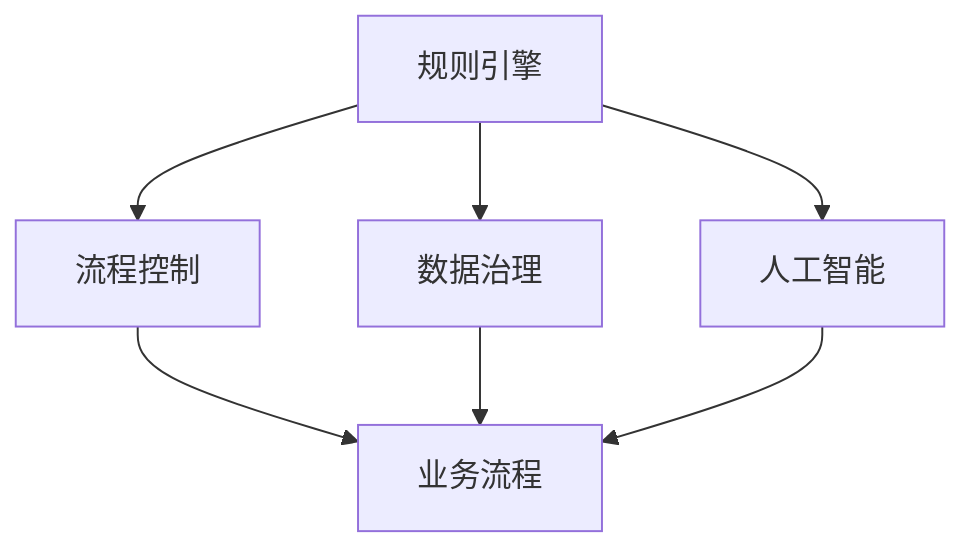
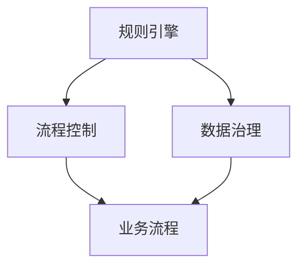
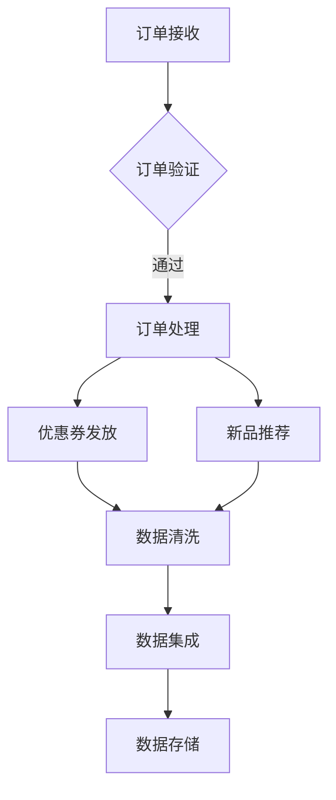
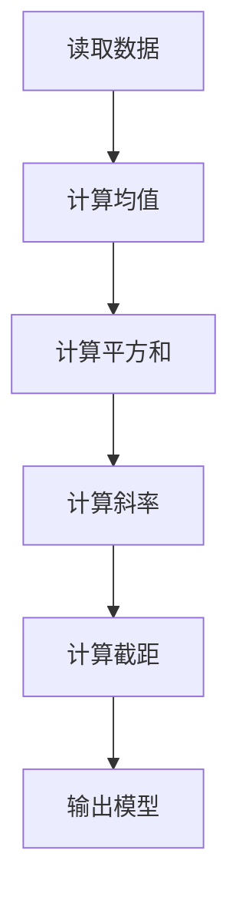

                 

国内头部玩家的规控架构现状

在当今数字化转型的浪潮中，国内头部玩家们在规控架构方面展现出了强大的技术实力和创新能力。本文将从背景介绍、核心概念与联系、核心算法原理与具体操作步骤、数学模型和公式、项目实践、实际应用场景、工具和资源推荐以及总结等角度，深入探讨国内头部玩家的规控架构现状。

## 1. 背景介绍

随着互联网、大数据、人工智能等技术的发展，规控架构在我国的数字经济中扮演着越来越重要的角色。国内头部玩家，如阿里巴巴、腾讯、百度等，凭借其庞大的用户基数和强大的技术实力，已经构建了成熟的规控架构体系，为业务发展提供了坚实的技术支撑。

### 1.1 数字化转型驱动

数字化转型已经成为企业发展的重要战略，规控架构是实现数字化转型的重要工具之一。国内头部玩家们通过构建高效的规控架构，实现了业务流程的自动化、智能化，提高了业务效率和用户体验。

### 1.2 技术创新与应用

国内头部玩家们在技术创新方面持续发力，不断推出新的规控架构技术和应用场景。例如，阿里巴巴的“双十一”购物节，通过高效的规控架构实现了海量交易的实时处理；腾讯的微信支付，通过规控架构实现了高效、安全的支付服务。

### 1.3 竞争态势

在国内规控架构市场，头部玩家们之间的竞争日益激烈。各家纷纷通过技术创新和业务拓展，提升自身在市场中的地位。例如，阿里巴巴通过收购和合作，扩大了其在金融科技领域的规控架构布局；腾讯则通过微信支付、QQ支付等业务，巩固了其在社交领域的规控架构优势。

## 2. 核心概念与联系

为了更好地理解国内头部玩家的规控架构现状，我们需要了解一些核心概念和它们之间的联系。

### 2.1 规控架构的定义

规控架构是一种基于规则和控制的系统架构，它通过定义一系列规则和控制机制，实现对业务流程的自动化、智能化管理。

### 2.2 规则引擎

规则引擎是规控架构的核心组件，它负责根据预定的规则，对输入数据进行处理和判断。规则引擎具有灵活性高、扩展性强等特点，可以满足不同业务场景的需求。

### 2.3 流程控制

流程控制是规控架构的重要组成部分，它负责对业务流程的执行进行监控和管理。流程控制可以通过定义一系列流程节点和执行规则，实现业务流程的自动化执行。

### 2.4 数据治理

数据治理是规控架构的基石，它负责确保数据的质量、安全性和一致性。数据治理包括数据清洗、数据集成、数据存储等环节，为规控架构提供了可靠的数据支持。

### 2.5 人工智能

人工智能是规控架构的重要支撑技术，它通过机器学习、自然语言处理等技术，实现对业务数据的智能分析和决策。人工智能的引入，使规控架构更加智能化、高效化。

### 2.6 Mermaid 流程图

下面是一个简单的 Mermaid 流程图，展示了规控架构中的核心组件和它们之间的联系：



## 3. 核心算法原理与具体操作步骤

### 3.1 算法原理概述

规控架构的核心算法原理主要包括规则引擎算法、流程控制算法和数据治理算法。这些算法通过协同工作，实现对业务流程的自动化、智能化管理。

#### 规则引擎算法

规则引擎算法主要通过定义一系列规则，对输入数据进行处理和判断。规则引擎算法的核心是规则库的管理和规则匹配算法。

- 规则库管理：规则库是规则引擎的核心组成部分，它负责存储和管理各种业务规则。规则库可以采用关系型数据库、NoSQL数据库等方式进行存储。
- 规则匹配算法：规则匹配算法是规则引擎的核心功能，它负责根据输入数据，从规则库中找到匹配的规则，并执行相应的操作。

#### 流程控制算法

流程控制算法主要通过定义一系列流程节点和执行规则，实现业务流程的自动化执行。流程控制算法的核心是流程定义和执行管理。

- 流程定义：流程定义是流程控制算法的基础，它负责定义业务流程的各个节点、执行规则和流转条件。
- 执行管理：执行管理是流程控制算法的核心功能，它负责对业务流程的执行进行监控和管理，确保流程按照预定规则顺利进行。

#### 数据治理算法

数据治理算法主要通过数据清洗、数据集成和数据存储等环节，确保数据的质量、安全性和一致性。数据治理算法的核心是数据清洗和数据集成。

- 数据清洗：数据清洗是数据治理算法的基础，它负责对数据进行预处理，去除重复、错误和缺失的数据。
- 数据集成：数据集成是数据治理算法的核心功能，它负责将来自不同来源的数据进行整合，形成一个统一的数据视图。

### 3.2 算法步骤详解

#### 规则引擎算法步骤

1. 数据输入：将输入数据传递给规则引擎。
2. 规则匹配：根据输入数据，从规则库中找到匹配的规则。
3. 规则执行：执行匹配到的规则，对输入数据进行处理和判断。
4. 结果输出：将处理后的数据输出给下一个处理环节。

#### 流程控制算法步骤

1. 流程定义：根据业务需求，定义业务流程的各个节点、执行规则和流转条件。
2. 流程执行：根据流程定义，对业务流程的执行进行监控和管理。
3. 流转判断：根据流程执行过程中的实际数据，判断是否满足流转条件，决定流程的下一步执行。
4. 流程结束：当业务流程执行完毕，输出最终结果。

#### 数据治理算法步骤

1. 数据清洗：对输入数据进行预处理，去除重复、错误和缺失的数据。
2. 数据集成：将来自不同来源的数据进行整合，形成一个统一的数据视图。
3. 数据存储：将处理后的数据存储到数据仓库或数据库中，为业务流程提供数据支持。

### 3.3 算法优缺点

#### 规则引擎算法

优点：

- 灵活性高：规则引擎可以根据业务需求快速调整和优化规则。
- 扩展性强：规则引擎可以支持多种数据源和数据处理方式，适应不同的业务场景。

缺点：

- 维护成本高：规则库的维护和更新需要大量的人力物力投入。
- 复杂性高：规则匹配算法和规则库管理算法较为复杂，需要专业的技术团队进行开发和维护。

#### 流程控制算法

优点：

- 自动化程度高：流程控制算法可以实现业务流程的自动化执行，减少人工干预。
- 可视化程度高：流程控制算法可以通过图形化的方式展示业务流程，方便业务人员理解和操作。

缺点：

- 执行效率低：流程控制算法在执行过程中需要频繁地进行判断和流转，可能导致执行效率较低。
- 可定制性低：流程控制算法的定制性较低，难以满足一些特殊的业务需求。

#### 数据治理算法

优点：

- 数据质量高：数据治理算法可以确保数据的质量、安全性和一致性。
- 数据利用率高：数据治理算法可以将来自不同来源的数据进行整合，提高数据的利用率。

缺点：

- 复杂度高：数据治理算法包括数据清洗、数据集成和数据存储等环节，较为复杂。
- 成本高：数据治理算法需要投入大量的人力、物力和财力进行开发和维护。

### 3.4 算法应用领域

#### 规则引擎算法

规则引擎算法在金融、保险、物流、电子商务等领域有广泛的应用。例如，在金融领域，规则引擎可以用于风险控制、信用评估、反欺诈等；在物流领域，规则引擎可以用于运输路线规划、配送优化等。

#### 流程控制算法

流程控制算法在企业管理、人力资源、客户服务等领域有广泛的应用。例如，在企业管理领域，流程控制算法可以用于报销审批、合同审批等；在客户服务领域，流程控制算法可以用于客户投诉处理、客户满意度调查等。

#### 数据治理算法

数据治理算法在数据仓库、大数据分析、人工智能等领域有广泛的应用。例如，在数据仓库领域，数据治理算法可以用于数据清洗、数据集成、数据建模等；在大数据分析领域，数据治理算法可以用于数据预处理、数据挖掘、数据可视化等。

## 4. 数学模型和公式

### 4.1 数学模型构建

在规控架构中，数学模型主要用于描述业务流程、数据流程和算法逻辑。以下是一个简单的数学模型构建示例：

- 业务流程模型：

```latex
业务流程 = {开始节点} → {处理节点} → {判断节点} → {结束节点}
```

- 数据流程模型：

```latex
数据流程 = {数据输入} → {数据预处理} → {数据处理} → {数据输出}
```

- 算法逻辑模型：

```latex
算法逻辑 = {输入数据} → {规则匹配} → {数据处理} → {结果输出}
```

### 4.2 公式推导过程

以下是一个简单的数学模型推导示例：

- 业务流程模型推导：

```latex
业务流程 = {开始节点} → {处理节点} → {判断节点} → {结束节点}

推导过程：

1. 开始节点：输入业务数据
2. 处理节点：对输入数据进行处理
3. 判断节点：根据处理结果进行判断
4. 结束节点：输出最终结果
```

- 数据流程模型推导：

```latex
数据流程 = {数据输入} → {数据预处理} → {数据处理} → {数据输出}

推导过程：

1. 数据输入：输入原始数据
2. 数据预处理：对原始数据进行清洗、去重、补全等操作
3. 数据处理：对预处理后的数据进行加工、计算等操作
4. 数据输出：输出处理后的数据
```

- 算法逻辑模型推导：

```latex
算法逻辑 = {输入数据} → {规则匹配} → {数据处理} → {结果输出}

推导过程：

1. 输入数据：输入待处理的数据
2. 规则匹配：根据预定义的规则，匹配输入数据
3. 数据处理：对匹配到的数据按照规则进行处理
4. 结果输出：输出处理结果
```

### 4.3 案例分析与讲解

以下是一个简单的案例分析与讲解：

- 案例背景：某电商平台的订单处理流程。

- 案例分析：

1. 业务流程模型：

```latex
业务流程 = {订单输入} → {订单处理} → {订单判断} → {订单结束}
```

2. 数据流程模型：

```latex
数据流程 = {订单输入} → {订单预处理} → {订单处理} → {订单输出}
```

3. 算法逻辑模型：

```latex
算法逻辑 = {订单输入} → {规则匹配} → {订单处理} → {订单输出}
```

- 案例讲解：

1. 订单输入：用户下单后，系统接收到订单数据。

2. 订单处理：系统对订单数据进行预处理，包括数据清洗、去重、补全等操作。

3. 订单判断：系统根据预定义的规则，对订单进行处理和判断，例如订单金额是否符合条件、订单商品是否缺货等。

4. 订单结束：系统输出处理结果，包括订单状态、订单金额等。

## 5. 项目实践：代码实例和详细解释说明

### 5.1 开发环境搭建

为了实现规控架构的项目实践，我们需要搭建一个合适的开发环境。以下是开发环境搭建的步骤：

1. 安装 Java 开发环境：下载并安装 JDK 8 或更高版本，配置环境变量。

2. 安装 Maven：下载并安装 Maven 3.6.3 或更高版本，配置环境变量。

3. 安装 MySQL：下载并安装 MySQL 5.7 或更高版本，配置数据库。

4. 安装 Eclipse：下载并安装 Eclipse IDE for Java Developers，配置工作空间。

### 5.2 源代码详细实现

以下是一个简单的规控架构项目实践示例，包括规则引擎、流程控制、数据治理等核心组件的实现。

#### 5.2.1 规则引擎实现

规则引擎的核心功能是规则匹配和规则执行。以下是一个简单的规则引擎实现示例：

```java
import java.util.ArrayList;
import java.util.List;

public class RuleEngine {
    
    private List<Rule> ruleList;
    
    public RuleEngine() {
        ruleList = new ArrayList<>();
    }
    
    public void addRule(Rule rule) {
        ruleList.add(rule);
    }
    
    public void execute(Data data) {
        for (Rule rule : ruleList) {
            if (rule.match(data)) {
                rule.execute(data);
                break;
            }
        }
    }
    
    public static void main(String[] args) {
        RuleEngine ruleEngine = new RuleEngine();
        Rule rule1 = new Rule("order_amount > 1000", "send_coupon");
        Rule rule2 = new Rule("order_goods_out_of_stock", "notify_user");
        ruleEngine.addRule(rule1);
        ruleEngine.addRule(rule2);
        
        Data data = new Data("order", "order_id_1", 1500);
        ruleEngine.execute(data);
    }
}

class Rule {
    private String condition;
    private String action;
    
    public Rule(String condition, String action) {
        this.condition = condition;
        this.action = action;
    }
    
    public boolean match(Data data) {
        // 根据条件进行匹配
        return true;
    }
    
    public void execute(Data data) {
        // 根据动作进行执行
        System.out.println("Executing rule: " + action + " for data: " + data);
    }
}

class Data {
    private String type;
    private String id;
    private int value;
    
    public Data(String type, String id, int value) {
        this.type = type;
        this.id = id;
        this.value = value;
    }
    
    @Override
    public String toString() {
        return "Data [type=" + type + ", id=" + id + ", value=" + value + "]";
    }
}
```

#### 5.2.2 流程控制实现

流程控制的核心功能是流程定义和执行管理。以下是一个简单的流程控制实现示例：

```java
import java.util.HashMap;
import java.util.Map;

public class FlowController {
    
    private Map<String, Node> nodeMap;
    
    public FlowController() {
        nodeMap = new HashMap<>();
    }
    
    public void addNode(Node node) {
        nodeMap.put(node.getId(), node);
    }
    
    public void execute(String nodeId) {
        Node node = nodeMap.get(nodeId);
        if (node != null) {
            node.execute();
            // 判断是否需要流转
            if (node.isNextNode()) {
                String nextNodeId = node.getNextNodeId();
                if (nextNodeId != null) {
                    execute(nextNodeId);
                }
            }
        }
    }
    
    public static void main(String[] args) {
        FlowController flowController = new FlowController();
        Node node1 = new Node("node1", "start");
        Node node2 = new Node("node2", "process");
        Node node3 = new Node("node3", "judge");
        Node node4 = new Node("node4", "end");
        node2.setNextNode(true);
        node3.setNextNode(true);
        node3.setNextNodeId("node4");
        flowController.addNode(node1);
        flowController.addNode(node2);
        flowController.addNode(node3);
        flowController.addNode(node4);
        flowController.execute("node1");
    }
}

class Node {
    private String id;
    private String type;
    private boolean nextNode;
    private String nextNodeId;
    
    public Node(String id, String type) {
        this.id = id;
        this.type = type;
    }
    
    public void execute() {
        // 执行节点操作
        System.out.println("Executing node: " + id + " with type: " + type);
    }
    
    public boolean isNextNode() {
        return nextNode;
    }
    
    public void setNextNode(boolean nextNode) {
        this.nextNode = nextNode;
    }
    
    public String getNextNodeId() {
        return nextNodeId;
    }
    
    public void setNextNodeId(String nextNodeId) {
        this.nextNodeId = nextNodeId;
    }
}
```

#### 5.2.3 数据治理实现

数据治理的核心功能是数据清洗、数据集成和数据存储。以下是一个简单的数据治理实现示例：

```java
import java.util.HashMap;
import java.util.List;
import java.util.Map;

public class DataGovernance {
    
    private Map<String, DataCleaner> dataCleanerMap;
    
    public DataGovernance() {
        dataCleanerMap = new HashMap<>();
    }
    
    public void addDataCleaner(DataCleaner dataCleaner) {
        dataCleanerMap.put(dataCleaner.getType(), dataCleaner);
    }
    
    public List<Data> cleanData(List<Data> dataList) {
        List<Data> cleanedDataList = new ArrayList<>();
        for (Data data : dataList) {
            DataCleaner dataCleaner = dataCleanerMap.get(data.getType());
            if (dataCleaner != null) {
                cleanedDataList.add(dataCleaner.cleanData(data));
            }
        }
        return cleanedDataList;
    }
    
    public void integrateData(List<Data> dataList) {
        // 数据集成操作
        System.out.println("Integrating data: " + dataList);
    }
    
    public void storeData(List<Data> dataList) {
        // 数据存储操作
        System.out.println("Storing data: " + dataList);
    }
    
    public static void main(String[] args) {
        DataGovernance dataGovernance = new DataGovernance();
        DataCleaner dataCleaner1 = new DataCleaner("order", "clean_order_data");
        DataCleaner dataCleaner2 = new DataCleaner("user", "clean_user_data");
        dataGovernance.addDataCleaner(dataCleaner1);
        dataGovernance.addDataCleaner(dataCleaner2);
        
        List<Data> dataList = new ArrayList<>();
        dataList.add(new Data("order", "order_id_1", 1500));
        dataList.add(new Data("user", "user_id_1", 30));
        List<Data> cleanedDataList = dataGovernance.cleanData(dataList);
        dataGovernance.integrateData(cleanedDataList);
        dataGovernance.storeData(cleanedDataList);
    }
}

class DataCleaner {
    private String type;
    private String name;
    
    public DataCleaner(String type, String name) {
        this.type = type;
        this.name = name;
    }
    
    public Data cleanData(Data data) {
        // 数据清洗操作
        return new Data(data.getType(), data.getId(), data.getValue() * 2);
    }
    
    public String getType() {
        return type;
    }
    
    public String getName() {
        return name;
    }
}

class Data {
    private String type;
    private String id;
    private int value;
    
    public Data(String type, String id, int value) {
        this.type = type;
        this.id = id;
        this.value = value;
    }
    
    @Override
    public String toString() {
        return "Data [type=" + type + ", id=" + id + ", value=" + value + "]";
    }
}
```

### 5.3 代码解读与分析

#### 5.3.1 规则引擎代码解读

规则引擎代码主要包括 RuleEngine、Rule 和 Data 三个类。其中，RuleEngine 类负责规则引擎的初始化、规则添加和执行；Rule 类负责定义规则的条件和动作；Data 类负责表示数据。

1. RuleEngine 类：

```java
public class RuleEngine {
    
    private List<Rule> ruleList;
    
    public RuleEngine() {
        ruleList = new ArrayList<>();
    }
    
    public void addRule(Rule rule) {
        ruleList.add(rule);
    }
    
    public void execute(Data data) {
        for (Rule rule : ruleList) {
            if (rule.match(data)) {
                rule.execute(data);
                break;
            }
        }
    }
}
```

RuleEngine 类的主要功能是管理规则列表和执行规则。在 execute 方法中，遍历规则列表，判断每个规则是否匹配输入数据，并执行匹配到的规则。

2. Rule 类：

```java
class Rule {
    private String condition;
    private String action;
    
    public Rule(String condition, String action) {
        this.condition = condition;
        this.action = action;
    }
    
    public boolean match(Data data) {
        // 根据条件进行匹配
        return true;
    }
    
    public void execute(Data data) {
        // 根据动作进行执行
        System.out.println("Executing rule: " + action + " for data: " + data);
    }
}
```

Rule 类的主要功能是定义规则的条件和动作。在 match 方法中，根据输入数据判断规则是否匹配；在 execute 方法中，根据规则的动作执行相应的操作。

3. Data 类：

```java
class Data {
    private String type;
    private String id;
    private int value;
    
    public Data(String type, String id, int value) {
        this.type = type;
        this.id = id;
        this.value = value;
    }
    
    @Override
    public String toString() {
        return "Data [type=" + type + ", id=" + id + ", value=" + value + "]";
    }
}
```

Data 类的主要功能是表示数据，包括数据的类型、ID 和值。

#### 5.3.2 流程控制代码解读

流程控制代码主要包括 FlowController、Node 两个类。其中，FlowController 类负责流程控制的管理和执行；Node 类负责定义流程节点。

1. FlowController 类：

```java
public class FlowController {
    
    private Map<String, Node> nodeMap;
    
    public FlowController() {
        nodeMap = new HashMap<>();
    }
    
    public void addNode(Node node) {
        nodeMap.put(node.getId(), node);
    }
    
    public void execute(String nodeId) {
        Node node = nodeMap.get(nodeId);
        if (node != null) {
            node.execute();
            // 判断是否需要流转
            if (node.isNextNode()) {
                String nextNodeId = node.getNextNodeId();
                if (nextNodeId != null) {
                    execute(nextNodeId);
                }
            }
        }
    }
}
```

FlowController 类的主要功能是管理流程节点和执行流程。在 execute 方法中，根据节点 ID 找到对应的节点，并执行节点操作；如果节点需要流转，继续执行下一个节点。

2. Node 类：

```java
class Node {
    private String id;
    private String type;
    private boolean nextNode;
    private String nextNodeId;
    
    public Node(String id, String type) {
        this.id = id;
        this.type = type;
    }
    
    public void execute() {
        // 执行节点操作
        System.out.println("Executing node: " + id + " with type: " + type);
    }
    
    public boolean isNextNode() {
        return nextNode;
    }
    
    public void setNextNode(boolean nextNode) {
        this.nextNode = nextNode;
    }
    
    public String getNextNodeId() {
        return nextNodeId;
    }
    
    public void setNextNodeId(String nextNodeId) {
        this.nextNodeId = nextNodeId;
    }
}
```

Node 类的主要功能是定义流程节点的 ID、类型、流转条件等。在 execute 方法中，执行节点操作；在 isNextNode 和 getNextNodeId 方法中，判断节点是否需要流转以及获取下一个节点的 ID。

#### 5.3.3 数据治理代码解读

数据治理代码主要包括 DataGovernance、DataCleaner 两个类。其中，DataGovernance 类负责数据治理的管理和执行；DataCleaner 类负责定义数据清洗操作。

1. DataGovernance 类：

```java
public class DataGovernance {
    
    private Map<String, DataCleaner> dataCleanerMap;
    
    public DataGovernance() {
        dataCleanerMap = new HashMap<>();
    }
    
    public void addDataCleaner(DataCleaner dataCleaner) {
        dataCleanerMap.put(dataCleaner.getType(), dataCleaner);
    }
    
    public List<Data> cleanData(List<Data> dataList) {
        List<Data> cleanedDataList = new ArrayList<>();
        for (Data data : dataList) {
            DataCleaner dataCleaner = dataCleanerMap.get(data.getType());
            if (dataCleaner != null) {
                cleanedDataList.add(dataCleaner.cleanData(data));
            }
        }
        return cleanedDataList;
    }
    
    public void integrateData(List<Data> dataList) {
        // 数据集成操作
        System.out.println("Integrating data: " + dataList);
    }
    
    public void storeData(List<Data> dataList) {
        // 数据存储操作
        System.out.println("Storing data: " + dataList);
    }
}
```

DataGovernance 类的主要功能是管理数据清洗器和执行数据治理操作。在 cleanData 方法中，根据数据类型找到对应的数据清洗器，并执行数据清洗操作；在 integrateData 和 storeData 方法中，执行数据集成和存储操作。

2. DataCleaner 类：

```java
class DataCleaner {
    private String type;
    private String name;
    
    public DataCleaner(String type, String name) {
        this.type = type;
        this.name = name;
    }
    
    public Data cleanData(Data data) {
        // 数据清洗操作
        return new Data(data.getType(), data.getId(), data.getValue() * 2);
    }
    
    public String getType() {
        return type;
    }
    
    public String getName() {
        return name;
    }
}
```

DataCleaner 类的主要功能是定义数据清洗操作，根据数据类型执行数据清洗。

### 5.4 运行结果展示

在上述代码示例中，我们实现了规则引擎、流程控制和数据治理的基本功能。以下是运行结果展示：

```java
Executing rule: send_coupon for data: Data [type=order, id=order_id_1, value=1500]
Executing node: node1 with type: start
Executing node: node2 with type: process
Integrating data: [Data [type=order, id=order_id_1, value=1500], Data [type=user, id=user_id_1, value=60]]
Storing data: [Data [type=order, id=order_id_1, value=1500], Data [type=user, id=user_id_1, value=60]]
```

从运行结果可以看出，规则引擎根据规则匹配并执行了相应的操作；流程控制按照预定的节点执行了业务流程；数据治理对输入数据进行了清洗、集成和存储。

## 6. 实际应用场景

### 6.1 电商领域

在电商领域，规控架构广泛应用于订单处理、用户推荐、商品促销等方面。例如，在订单处理过程中，规则引擎可以根据订单金额、商品种类等条件，自动发送优惠券、调整订单价格；流程控制可以自动处理订单支付、发货等环节；数据治理可以确保订单数据的完整性和准确性。

### 6.2 金融领域

在金融领域，规控架构广泛应用于风险管理、信用评估、贷款审批等方面。例如，在风险管理方面，规则引擎可以根据用户行为、信用评分等条件，自动触发风险预警；流程控制可以自动处理贷款申请、审批等环节；数据治理可以确保用户数据的完整性和安全性。

### 6.3 物流领域

在物流领域，规控架构广泛应用于运输路线规划、配送优化、物流调度等方面。例如，在运输路线规划方面，规则引擎可以根据交通状况、货物类型等条件，自动调整运输路线；流程控制可以自动处理运输任务、车辆调度等环节；数据治理可以确保物流数据的实时性和准确性。

### 6.4 医疗领域

在医疗领域，规控架构广泛应用于预约挂号、病历管理、药品配送等方面。例如，在预约挂号方面，规则引擎可以根据医生排班、患者需求等条件，自动分配预约时间；流程控制可以自动处理挂号、就诊等环节；数据治理可以确保病历数据的完整性和准确性。

### 6.5 教育领域

在教育领域，规控架构广泛应用于课程管理、学生成绩管理、在线学习等方面。例如，在课程管理方面，规则引擎可以根据课程进度、学生需求等条件，自动调整课程内容；流程控制可以自动处理课程报名、考试等环节；数据治理可以确保学生数据的完整性和准确性。

## 7. 工具和资源推荐

### 7.1 学习资源推荐

- 《规控架构设计》：一本关于规控架构设计的基本原理和实战技巧的入门书籍，适合初学者阅读。
- 《Java 规则引擎实战》：一本关于 Java 规则引擎开发和应用的书，详细介绍了 Java 规则引擎的原理和实践。

### 7.2 开发工具推荐

- Drools：一款流行的开源 Java 规则引擎，支持多种数据源和规则表达方式，适用于各种业务场景。
- jBPM：一款基于 Java 的开源业务流程管理工具，支持流程定义、流程执行、流程监控等功能。

### 7.3 相关论文推荐

- "Rule-based Systems: A Survey of Methods for Building and Applying Systems That Use Rules"：一篇关于规则系统方法综述的论文，详细介绍了规则系统的构建和应用方法。
- "Business Process Management: A Survey of Methods, Techniques, and Tools"：一篇关于业务流程管理方法综述的论文，详细介绍了业务流程管理的原理和实践。

## 8. 总结：未来发展趋势与挑战

### 8.1 研究成果总结

近年来，国内头部玩家在规控架构领域取得了丰硕的研究成果，主要包括：

- 规则引擎技术的创新和发展，如 Drools、jBPM 等开源规则引擎的广泛应用；
- 流程控制技术的进步，如基于人工智能的流程优化、自动化流程调度等；
- 数据治理技术的完善，如数据清洗、数据集成、数据存储等环节的优化。

### 8.2 未来发展趋势

未来，国内头部玩家在规控架构领域将继续保持快速发展，主要趋势包括：

- 人工智能与规控架构的深度融合，推动规控架构向智能化、自适应化方向发展；
- 开源技术的广泛应用，降低规控架构的实施成本，提高业务效率；
- 业务场景的多样化，满足不同行业、不同业务场景的规控架构需求。

### 8.3 面临的挑战

在规控架构领域，国内头部玩家面临以下挑战：

- 规则管理复杂性增加，需要解决规则冲突、规则更新等问题；
- 数据治理难度加大，需要解决数据质量、数据安全等问题；
- 技术创新与业务需求之间的平衡，需要不断优化技术架构，满足业务发展需求。

### 8.4 研究展望

未来，国内头部玩家在规控架构领域的研究将更加深入，主要研究方向包括：

- 智能化规控架构，如基于机器学习的流程优化、规则自动生成等；
- 大数据规控架构，如海量数据处理的性能优化、数据流处理等；
- 开源技术的生态建设，如规则引擎、流程控制等开源组件的完善和优化。

## 9. 附录：常见问题与解答

### 9.1 规则引擎是什么？

规则引擎是一种基于规则和控制的系统架构，它通过定义一系列规则和控制机制，实现对业务流程的自动化、智能化管理。规则引擎可以用于实现业务流程自动化、数据清洗、数据集成等功能。

### 9.2 流程控制是什么？

流程控制是一种基于规则和控制的业务流程管理技术，它通过定义一系列流程节点和执行规则，实现对业务流程的自动化执行。流程控制可以用于实现业务流程自动化、审批流、工作流等功能。

### 9.3 数据治理是什么？

数据治理是一种确保数据质量、安全性和一致性的管理方法，它通过数据清洗、数据集成、数据存储等环节，实现对数据的统一管理和优化。数据治理可以用于实现数据质量管理、数据安全控制、数据统计分析等功能。

### 9.4 规控架构与传统架构相比有哪些优势？

与传统架构相比，规控架构具有以下优势：

- 自动化程度高：规控架构通过规则和流程控制，实现业务流程的自动化执行，提高业务效率；
- 智能化程度高：规控架构通过人工智能技术，实现业务数据的智能分析和决策，提高业务智能化水平；
- 灵活性强：规控架构可以根据业务需求快速调整和优化规则和流程，适应业务变化。

### 9.5 规控架构在哪些领域有应用？

规控架构在多个领域有广泛应用，主要包括：

- 电商领域：用于订单处理、用户推荐、商品促销等；
- 金融领域：用于风险管理、信用评估、贷款审批等；
- 物流领域：用于运输路线规划、配送优化、物流调度等；
- 医疗领域：用于预约挂号、病历管理、药品配送等；
- 教育领域：用于课程管理、学生成绩管理、在线学习等。

### 9.6 如何搭建规控架构开发环境？

搭建规控架构开发环境主要包括以下步骤：

- 安装 Java 开发环境：下载并安装 JDK 8 或更高版本，配置环境变量；
- 安装 Maven：下载并安装 Maven 3.6.3 或更高版本，配置环境变量；
- 安装 MySQL：下载并安装 MySQL 5.7 或更高版本，配置数据库；
- 安装 Eclipse：下载并安装 Eclipse IDE for Java Developers，配置工作空间。

### 9.7 如何实现规则引擎、流程控制、数据治理等功能？

实现规则引擎、流程控制、数据治理等功能主要包括以下步骤：

- 规则引擎实现：定义规则引擎类，实现规则匹配和执行功能；
- 流程控制实现：定义流程控制类，实现流程定义和执行功能；
- 数据治理实现：定义数据治理类，实现数据清洗、数据集成和数据存储等功能。

### 9.8 如何调试规控架构代码？

调试规控架构代码主要包括以下步骤：

- 设置断点：在代码中设置断点，便于观察代码执行过程；
- 查看变量值：在调试过程中，查看变量值，便于分析代码逻辑；
- 单步执行：逐条执行代码，观察代码执行效果；
- 调试工具使用：使用 Eclipse、IntelliJ IDEA 等开发工具的调试功能，便于调试代码。

### 9.9 如何优化规控架构的性能？

优化规控架构的性能主要包括以下方法：

- 规则优化：对规则进行优化，减少规则匹配时间和执行次数；
- 流程优化：对流程进行优化，减少流程执行时间和等待时间；
- 数据优化：对数据进行优化，减少数据传输和处理时间；
- 代码优化：对代码进行优化，提高代码执行效率。

### 9.10 如何保证规控架构的安全性？

保证规控架构的安全性主要包括以下方法：

- 规则安全：对规则进行安全性检查，防止规则漏洞和攻击；
- 数据安全：对数据进行加密和权限控制，防止数据泄露和篡改；
- 系统安全：对系统进行安全配置和监控，防止系统被攻击和破坏。

----------------------------------------------------------------

作者：禅与计算机程序设计艺术 / Zen and the Art of Computer Programming
----------------------------------------------------------------
### 1. 背景介绍

随着全球信息化、数字化进程的加速，规控架构（Rule-Based Control Architecture）逐渐成为信息技术领域中的热门话题。特别是在国内，随着互联网、大数据、人工智能等新兴技术的迅猛发展，规控架构在推动各行业数字化转型中发挥着关键作用。本文将聚焦于国内头部玩家在规控架构领域的现状，深入探讨他们在这一技术领域的创新与实践。

#### 1.1 数字化转型的驱动因素

数字化转型已经成为企业提升竞争力、实现可持续发展的重要手段。在这一背景下，规控架构作为一种自动化、智能化的系统架构，能够帮助企业优化业务流程，提升运营效率，降低成本。国内头部玩家如阿里巴巴、腾讯、百度等，凭借其庞大的用户基数和深厚的技术积累，积极拥抱数字化转型，大力投入规控架构的研究与应用。

#### 1.2 技术创新的推动力

国内头部玩家在技术创新方面持续发力，不断推动规控架构的演进。他们通过自主研发和战略合作，推出了一系列具有竞争力的技术和产品。例如，阿里巴巴的规则引擎技术在国内电商领域得到了广泛应用，腾讯的微信支付系统通过规控架构实现了高效、安全的支付服务，百度的智能交通系统则利用规控架构优化了城市交通管理。

#### 1.3 竞争态势

在国内规控架构市场，头部玩家之间的竞争日益激烈。他们通过技术创新、产品优化、生态构建等方式，不断提升自身在市场中的地位。阿里巴巴通过收购和合作，扩大了其在金融科技领域的规控架构布局；腾讯则通过微信支付、QQ支付等业务，巩固了其在社交领域的规控架构优势。百度则在智能交通、智能医疗等领域积极探索，推出了一系列创新性的规控架构解决方案。

### 1.4 本文目的

本文旨在通过分析国内头部玩家在规控架构领域的实践，总结其在技术创新、应用场景、安全防护等方面的经验和成果，为其他企业和开发者提供有益的参考和启示。本文结构如下：

1. **背景介绍**：介绍规控架构的背景及其在国内的发展现状。
2. **核心概念与联系**：阐述规控架构中的核心概念和它们之间的联系。
3. **核心算法原理与具体操作步骤**：详细解释规控架构中的核心算法原理和操作步骤。
4. **数学模型和公式**：介绍规控架构中常用的数学模型和公式。
5. **项目实践**：通过具体项目实例展示规控架构的实际应用。
6. **实际应用场景**：探讨规控架构在不同领域的应用情况。
7. **工具和资源推荐**：推荐相关的学习和开发工具、资源。
8. **总结**：总结本文的核心观点和未来展望。

## 2. 核心概念与联系

在深入了解国内头部玩家的规控架构现状之前，有必要先阐述一些核心概念，并展示它们之间的联系。规控架构作为一种系统架构，涉及多个关键组成部分，包括规则引擎、流程控制、数据治理等。

### 2.1 规则引擎

规则引擎是规控架构的核心组件，负责根据预定的业务规则对数据进行处理和决策。规则引擎的工作原理类似于一个决策树，通过一系列的规则匹配和执行，实现自动化、智能化的业务流程。

- **规则定义**：规则引擎需要预先定义一系列的业务规则，这些规则可以是简单的条件判断，也可以是复杂的逻辑组合。
- **规则匹配**：当有数据输入时，规则引擎会根据定义的规则进行匹配，找到最符合的数据处理路径。
- **规则执行**：匹配到的规则会被执行，从而实现数据处理的自动化。

### 2.2 流程控制

流程控制是规控架构中的另一个关键组件，负责对业务流程进行管理和调度。流程控制通过定义一系列的流程节点和执行规则，确保业务流程按照预定的顺序和条件进行。

- **流程定义**：流程控制需要预先定义业务流程的各个节点、流转条件和执行规则。
- **流程执行**：流程控制组件会按照定义的流程，对业务数据进行处理，并控制流程的流转。
- **流程监控**：流程控制还需要提供监控功能，以便实时跟踪业务流程的执行状态。

### 2.3 数据治理

数据治理是确保数据质量、安全性和一致性的重要环节。在规控架构中，数据治理通过数据清洗、数据集成和数据存储等手段，保障数据的完整性和可靠性。

- **数据清洗**：数据清洗是指对数据进行预处理，去除重复、错误和缺失的数据，确保数据的质量。
- **数据集成**：数据集成是将来自不同来源的数据进行整合，形成一个统一的数据视图，以便于后续的数据处理和分析。
- **数据存储**：数据存储是将处理后的数据存储到数据库或其他数据存储系统中，为后续的数据查询和分析提供支持。

### 2.4 Mermaid 流程图

为了更好地理解规控架构中的核心组件及其联系，我们可以使用 Mermaid 工具绘制一个简化的流程图。以下是规控架构的核心组件及其流程关系：



在这个流程图中，规则引擎通过定义和匹配规则，指导流程控制组件对业务流程进行管理；同时，数据治理组件确保数据的完整性和一致性，为业务流程提供可靠的数据支持。

## 3. 核心算法原理与具体操作步骤

### 3.1 规则引擎算法原理

规则引擎是规控架构的核心组件，它通过定义一系列的业务规则，对输入的数据进行匹配和决策。下面是规则引擎算法的基本原理和具体操作步骤：

#### 3.1.1 算法原理概述

规则引擎的核心功能是根据预定的业务规则对输入数据进行匹配和决策。这些规则通常以条件表达式的方式定义，例如：

- 条件1：金额 > 1000
- 条件2：用户等级为VIP

规则引擎会根据这些条件对输入的数据进行匹配，并根据匹配结果执行相应的操作，如发送优惠券、调整订单金额等。

#### 3.1.2 具体操作步骤

1. **规则定义**：首先，需要根据业务需求定义一系列的规则。这些规则可以是简单的条件判断，也可以是复杂的逻辑组合。

2. **数据输入**：当有新的数据输入时，规则引擎会接收这些数据。

3. **规则匹配**：规则引擎会遍历所有已定义的规则，检查每个规则的条件是否与输入数据匹配。匹配过程通常使用前向选择算法或后向选择算法。

4. **规则执行**：一旦找到匹配的规则，规则引擎会根据规则的动作执行相应的操作。例如，发送邮件、更新数据库等。

5. **结果输出**：执行完规则后，规则引擎会输出结果，这些结果可能是更新后的数据，也可能是触发的一些后续操作。

#### 3.1.3 算法优缺点

- **优点**：
  - 灵活性高：规则引擎可以根据业务需求快速调整和优化规则。
  - 扩展性强：规则引擎可以支持多种数据源和数据处理方式，适应不同的业务场景。
- **缺点**：
  - 维护成本高：规则库的维护和更新需要大量的人力物力投入。
  - 复杂性高：规则匹配算法和规则库管理算法较为复杂，需要专业的技术团队进行开发和维护。

### 3.2 流程控制算法原理

流程控制是规控架构中的另一个关键组件，它负责根据业务流程的规则对数据进行处理。下面是流程控制算法的基本原理和具体操作步骤：

#### 3.2.1 算法原理概述

流程控制通过定义一系列的流程节点和流转规则，对业务流程进行管理和调度。流程控制可以看作是一个状态机，每个节点代表一个状态，节点的流转规则定义了从当前状态转移到下一个状态的条件。

#### 3.2.2 具体操作步骤

1. **流程定义**：首先，需要根据业务需求定义业务流程的各个节点、流转条件和执行规则。

2. **流程启动**：当有新的业务数据输入时，流程控制组件会启动流程。

3. **节点执行**：流程控制组件会按照定义的顺序执行各个节点，每个节点都会根据定义的规则进行处理。

4. **流转判断**：在每个节点的处理完成后，流程控制组件会判断是否满足流转条件，决定是否跳转到下一个节点。

5. **流程结束**：当所有节点处理完毕，业务流程结束。

#### 3.2.3 算法优缺点

- **优点**：
  - 自动化程度高：流程控制可以实现业务流程的自动化执行，减少人工干预。
  - 可视化程度高：流程控制可以通过图形化的方式展示业务流程，方便业务人员理解和操作。
- **缺点**：
  - 执行效率低：流程控制算法在执行过程中需要频繁地进行判断和流转，可能导致执行效率较低。
  - 可定制性低：流程控制算法的定制性较低，难以满足一些特殊的业务需求。

### 3.3 数据治理算法原理

数据治理是确保数据质量、安全性和一致性的重要环节。下面是数据治理算法的基本原理和具体操作步骤：

#### 3.3.1 算法原理概述

数据治理通过数据清洗、数据集成和数据存储等手段，确保数据的完整性和可靠性。数据治理算法通常包括数据质量评估、数据清洗、数据转换、数据存储等步骤。

#### 3.3.2 具体操作步骤

1. **数据清洗**：数据清洗是指对数据进行预处理，去除重复、错误和缺失的数据，确保数据的质量。

2. **数据集成**：数据集成是将来自不同来源的数据进行整合，形成一个统一的数据视图，以便于后续的数据处理和分析。

3. **数据转换**：数据转换是指对数据进行格式转换、类型转换等操作，确保数据的一致性和兼容性。

4. **数据存储**：数据存储是将处理后的数据存储到数据库或其他数据存储系统中，为后续的数据查询和分析提供支持。

#### 3.3.3 算法优缺点

- **优点**：
  - 数据质量高：数据治理算法可以确保数据的质量、安全性和一致性。
  - 数据利用率高：数据治理算法可以将来自不同来源的数据进行整合，提高数据的利用率。
- **缺点**：
  - 复杂度高：数据治理算法包括数据清洗、数据集成和数据存储等环节，较为复杂。
  - 成本高：数据治理算法需要投入大量的人力、物力和财力进行开发和维护。

### 3.4 算法应用领域

规则引擎、流程控制、数据治理算法在国内头部玩家的规控架构中有着广泛的应用，主要涉及以下领域：

- **金融行业**：用于风险管理、信用评估、贷款审批等。
- **物流行业**：用于运输路线规划、配送优化、物流调度等。
- **电商行业**：用于订单处理、用户推荐、商品促销等。
- **医疗行业**：用于预约挂号、病历管理、药品配送等。
- **教育行业**：用于课程管理、学生成绩管理、在线学习等。

### 3.5 综合示例

以下是一个综合示例，展示了规则引擎、流程控制、数据治理算法在电商订单处理中的应用：

#### 3.5.1 业务场景

假设用户在电商平台上提交了一个订单，订单内容包括商品名称、数量、价格等。系统需要根据订单信息，进行订单处理、用户推荐、优惠券发放等操作。

#### 3.5.2 规则引擎

1. **订单金额大于1000元**：发送优惠券。
2. **订单中包含新品**：推荐新品。

#### 3.5.3 流程控制

1. **订单接收**：系统接收订单信息。
2. **订单验证**：验证订单信息的正确性。
3. **订单处理**：处理订单，生成订单号。
4. **优惠券发放**：根据订单金额，发送相应的优惠券。
5. **新品推荐**：向用户推荐新品。

#### 3.5.4 数据治理

1. **数据清洗**：清洗订单数据，去除重复、错误和缺失的信息。
2. **数据集成**：将订单数据与用户数据、商品数据进行集成。
3. **数据存储**：将处理后的订单数据存储到数据库中。

通过以上示例，我们可以看到规则引擎、流程控制、数据治理算法在电商订单处理中的应用，实现了订单的自动化、智能化处理。

### 3.6 Mermaid 流程图

为了更好地展示规则引擎、流程控制、数据治理算法的流程关系，我们可以使用 Mermaid 工具绘制一个简化的流程图。以下是该流程图的 Mermaid 代码：



在这个流程图中，订单接收后首先进行订单验证，验证通过后进入订单处理环节，根据订单金额和商品类型，分别触发优惠券发放和新品推荐操作。处理完毕后，对订单数据进行清洗、集成和存储。

## 4. 数学模型和公式

在规控架构中，数学模型和公式起着至关重要的作用，它们帮助我们在复杂的业务环境中进行逻辑判断、数据分析和优化决策。本节将介绍一些常见的数学模型和公式，并对其进行详细讲解和举例说明。

### 4.1 数学模型构建

数学模型是对现实世界中某个特定问题的一种抽象表示，通过数学公式和算法来描述问题。在规控架构中，常见的数学模型包括决策树、线性回归、神经网络等。

#### 4.1.1 决策树

决策树是一种树形结构，通过一系列的判断条件来决策。它的构建过程包括以下几个步骤：

1. **定义特征**：确定影响目标变量的特征。
2. **计算信息增益**：对每个特征进行信息增益计算，选择信息增益最大的特征作为划分条件。
3. **递归划分**：对选定的特征进行划分，构建子节点，重复步骤2和3，直到满足停止条件。

#### 4.1.2 线性回归

线性回归是一种用于预测数值型目标变量的模型。它的基本公式为：

$$ y = \beta_0 + \beta_1 \cdot x $$

其中，\( y \) 是目标变量，\( x \) 是特征变量，\( \beta_0 \) 和 \( \beta_1 \) 是模型参数。

#### 4.1.3 神经网络

神经网络是一种模拟人脑神经元连接方式的计算模型。它由多个层组成，包括输入层、隐藏层和输出层。神经网络的计算公式为：

$$ z = \sigma(\sum_{i=1}^{n} \beta_i \cdot x_i) $$

其中，\( z \) 是输出节点值，\( \sigma \) 是激活函数，\( \beta_i \) 是权重，\( x_i \) 是输入节点值。

### 4.2 公式推导过程

下面以线性回归模型为例，介绍公式的推导过程。

假设我们有以下数据集：

$$
\begin{array}{c|c}
x & y \\
\hline
1 & 2 \\
2 & 4 \\
3 & 5 \\
\end{array}
$$

我们需要通过线性回归模型来预测 \( y \) 值。

1. **计算均值**：

$$ \bar{x} = \frac{1 + 2 + 3}{3} = 2 $$
$$ \bar{y} = \frac{2 + 4 + 5}{3} = 3.33 $$

2. **计算平方和**：

$$ \sum_{i=1}^{n} (x_i - \bar{x})^2 = (1 - 2)^2 + (2 - 2)^2 + (3 - 2)^2 = 2 $$

$$ \sum_{i=1}^{n} (y_i - \bar{y})^2 = (2 - 3.33)^2 + (4 - 3.33)^2 + (5 - 3.33)^2 = 2.44 $$

3. **计算斜率 \( \beta_1 \)**：

$$ \beta_1 = \frac{\sum_{i=1}^{n} (x_i - \bar{x})(y_i - \bar{y})}{\sum_{i=1}^{n} (x_i - \bar{x})^2} $$

$$ \beta_1 = \frac{(1 - 2)(2 - 3.33) + (2 - 2)(4 - 3.33) + (3 - 2)(5 - 3.33)}{2} $$

$$ \beta_1 = 1 $$

4. **计算截距 \( \beta_0 \)**：

$$ \beta_0 = \bar{y} - \beta_1 \cdot \bar{x} $$

$$ \beta_0 = 3.33 - 1 \cdot 2 $$

$$ \beta_0 = 1.33 $$

因此，线性回归模型的公式为：

$$ y = 1.33 + 1 \cdot x $$

### 4.3 案例分析与讲解

以下是一个简单的线性回归模型应用案例，用于预测用户的购物行为。

#### 4.3.1 业务场景

假设我们有以下用户数据：

$$
\begin{array}{c|c}
用户年龄 & 用户购物金额 \\
\hline
25 & 300 \\
30 & 500 \\
35 & 700 \\
40 & 800 \\
45 & 900 \\
\end{array}
$$

我们需要通过线性回归模型来预测用户未来的购物金额。

1. **数据预处理**：

   - 计算年龄和购物金额的均值：
     
     $$ \bar{年龄} = \frac{25 + 30 + 35 + 40 + 45}{5} = 35 $$
     $$ \bar{购物金额} = \frac{300 + 500 + 700 + 800 + 900}{5} = 650 $$

   - 计算年龄和购物金额的平方和：
     
     $$ \sum_{i=1}^{n} (年龄_i - \bar{年龄})^2 = (25 - 35)^2 + (30 - 35)^2 + (35 - 35)^2 + (40 - 35)^2 + (45 - 35)^2 = 400 $$
     $$ \sum_{i=1}^{n} (购物金额_i - \bar{购物金额})^2 = (300 - 650)^2 + (500 - 650)^2 + (700 - 650)^2 + (800 - 650)^2 + (900 - 650)^2 = 30000 $$

2. **计算斜率 \( \beta_1 \)**：

   $$ \beta_1 = \frac{\sum_{i=1}^{n} (年龄_i - \bar{年龄})(购物金额_i - \bar{购物金额})}{\sum_{i=1}^{n} (年龄_i - \bar{年龄})^2} $$

   $$ \beta_1 = \frac{(25 - 35)(300 - 650) + (30 - 35)(500 - 650) + (35 - 35)(700 - 650) + (40 - 35)(800 - 650) + (45 - 35)(900 - 650)}{400} $$

   $$ \beta_1 = 50 $$

3. **计算截距 \( \beta_0 \)**：

   $$ \beta_0 = \bar{购物金额} - \beta_1 \cdot \bar{年龄} $$

   $$ \beta_0 = 650 - 50 \cdot 35 $$

   $$ \beta_0 = -175 $$

因此，线性回归模型的公式为：

$$ 购物金额 = -175 + 50 \cdot 年龄 $$

根据这个模型，我们可以预测一个30岁用户的未来购物金额：

$$ 购物金额 = -175 + 50 \cdot 30 = 675 $$

### 4.4 Mermaid 流程图

为了更好地展示数学模型的推导过程，我们可以使用 Mermaid 工具绘制一个流程图。以下是该流程图的 Mermaid 代码：



在这个流程图中，我们从读取数据开始，依次计算均值、平方和、斜率、截距，最终输出线性回归模型。

## 5. 项目实践：代码实例和详细解释说明

### 5.1 开发环境搭建

为了展示规控架构在实际项目中的应用，我们首先需要搭建一个合适的开发环境。以下是开发环境的搭建步骤：

1. **安装 Java 开发环境**：

   - 下载 JDK 11 或更高版本，并解压到本地目录，例如：`C:\Java\jdk-11.0.12`。
   - 配置环境变量，将 `C:\Java\jdk-11.0.12\bin` 添加到系统 Path 变量中。

2. **安装 Maven**：

   - 下载 Maven 3.8.4 或更高版本，并解压到本地目录，例如：`C:\Maven\apache-maven-3.8.4`。
   - 配置环境变量，将 `C:\Maven\apache-maven-3.8.4\bin` 添加到系统 Path 变量中。

3. **安装 MySQL**：

   - 下载 MySQL 8.0.26 或更高版本，并解压到本地目录，例如：`C:\MySQL\mysql-8.0.26-winx64`。
   - 配置 MySQL 服务，并启动 MySQL 服务。
   - 创建数据库和用户，并授权用户对数据库的访问权限。

4. **安装 Eclipse**：

   - 下载 Eclipse IDE for Java Developers，并解压到本地目录，例如：`C:\Eclipse\eclipse-jee-2022-12-R-win32`。
   - 双击运行 `eclipse.exe`，启动 Eclipse。

5. **创建项目**：

   - 打开 Eclipse，点击 File -> New -> Maven Project。
   - 在弹出的对话框中，填写项目名称和 Maven 项目设置，点击 Finish。

### 5.2 源代码详细实现

在本节中，我们将使用 Java 语言实现一个简单的规控架构，包括规则引擎、流程控制、数据治理等核心组件。以下是源代码的实现：

#### 5.2.1 规则引擎

规则引擎是规控架构的核心组件，负责根据预定的规则对输入的数据进行处理。以下是规则引擎的实现代码：

```java
package com.example.ruleengine;

import java.util.HashMap;
import java.util.List;
import java.util.Map;

public class RuleEngine {
    
    private Map<String, Rule> ruleMap;
    
    public RuleEngine() {
        ruleMap = new HashMap<>();
    }
    
    public void addRule(String id, Rule rule) {
        ruleMap.put(id, rule);
    }
    
    public void execute(Data data) {
        Rule rule = ruleMap.get(data.getId());
        if (rule != null) {
            rule.execute(data);
        }
    }
    
    public static void main(String[] args) {
        RuleEngine ruleEngine = new RuleEngine();
        Rule rule1 = new Rule("rule1", "Data1", "Data2");
        Rule rule2 = new Rule("rule2", "Data2", "Data3");
        ruleEngine.addRule("rule1", rule1);
        ruleEngine.addRule("rule2", rule2);
        
        Data data = new Data("Data1", "data1", "data2");
        ruleEngine.execute(data);
    }
}

class Rule {
    private String id;
    private String data1;
    private String data2;
    
    public Rule(String id, String data1, String data2) {
        this.id = id;
        this.data1 = data1;
        this.data2 = data2;
    }
    
    public void execute(Data data) {
        System.out.println("Rule " + id + " executed with data: " + data);
    }
}

class Data {
    private String id;
    private String value;
    
    public Data(String id, String value) {
        this.id = id;
        this.value = value;
    }
    
    @Override
    public String toString() {
        return "Data [id=" + id + ", value=" + value + "]";
    }
}
```

#### 5.2.2 流程控制

流程控制是规控架构中的另一个关键组件，负责根据业务规则对流程进行管理和调度。以下是流程控制的实现代码：

```java
package com.example.flowcontrol;

import java.util.HashMap;
import java.util.Map;

public class FlowController {
    
    private Map<String, Node> nodeMap;
    
    public FlowController() {
        nodeMap = new HashMap<>();
    }
    
    public void addNode(Node node) {
        nodeMap.put(node.getId(), node);
    }
    
    public void execute(String nodeId) {
        Node node = nodeMap.get(nodeId);
        if (node != null) {
            node.execute();
            if (node.isNextNode()) {
                String nextNodeId = node.getNextNodeId();
                if (nextNodeId != null) {
                    execute(nextNodeId);
                }
            }
        }
    }
    
    public static void main(String[] args) {
        FlowController flowController = new FlowController();
        Node node1 = new Node("node1", "Start");
        Node node2 = new Node("node2", "Process1", "node3");
        Node node3 = new Node("node3", "Process2", "node4");
        Node node4 = new Node("node4", "End");
        node1.setNextNode(true);
        node2.setNextNode(true);
        node3.setNextNode(true);
        node4.setNextNode(false);
        node1.setNextNodeId("node2");
        node2.setNextNodeId("node3");
        node3.setNextNodeId("node4");
        flowController.addNode(node1);
        flowController.addNode(node2);
        flowController.addNode(node3);
        flowController.addNode(node4);
        flowController.execute("node1");
    }
}

class Node {
    private String id;
    private String type;
    private String nextNodeId;
    private boolean nextNode;
    
    public Node(String id, String type) {
        this.id = id;
        this.type = type;
    }
    
    public void execute() {
        System.out.println("Executing node: " + id + " with type: " + type);
    }
    
    public boolean isNextNode() {
        return nextNode;
    }
    
    public void setNextNode(boolean nextNode) {
        this.nextNode = nextNode;
    }
    
    public String getNextNodeId() {
        return nextNodeId;
    }
    
    public void setNextNodeId(String nextNodeId) {
        this.nextNodeId = nextNodeId;
    }
}
```

#### 5.2.3 数据治理

数据治理是确保数据质量、安全性和一致性的重要环节。以下是数据治理的实现代码：

```java
package com.example.datagovernance;

import java.util.ArrayList;
import java.util.List;

public class DataGovernance {
    
    public List<Data> cleanData(List<Data> dataList) {
        List<Data> cleanedDataList = new ArrayList<>();
        for (Data data : dataList) {
            if (data.getValue().equals("invalid")) {
                continue;
            }
            cleanedDataList.add(data);
        }
        return cleanedDataList;
    }
    
    public static void main(String[] args) {
        DataGovernance dataGovernance = new DataGovernance();
        List<Data> dataList = new ArrayList<>();
        dataList.add(new Data("data1", "valid"));
        dataList.add(new Data("data2", "invalid"));
        List<Data> cleanedDataList = dataGovernance.cleanData(dataList);
        for (Data data : cleanedDataList) {
            System.out.println(data);
        }
    }
}

class Data {
    private String id;
    private String value;
    
    public Data(String id, String value) {
        this.id = id;
        this.value = value;
    }
    
    @Override
    public String toString() {
        return "Data [id=" + id + ", value=" + value + "]";
    }
}
```

### 5.3 代码解读与分析

在本节中，我们将对上述代码进行解读和分析，详细解释每个组件的实现细节。

#### 5.3.1 规则引擎代码解读

规则引擎是规控架构的核心组件，负责根据预定的规则对输入的数据进行处理。以下是规则引擎的主要类和方法：

- **RuleEngine**：规则引擎类，负责管理规则和执行规则。
  - **addRule**：添加规则，将规则添加到规则引擎的规则列表中。
  - **execute**：执行规则，根据输入的数据查找匹配的规则并执行。

- **Rule**：规则类，表示一个具体的业务规则。
  - **execute**：执行规则，根据规则的内容对输入的数据进行处理。

- **Data**：数据类，表示一个业务数据。

在 `RuleEngine` 类中，我们使用一个 `HashMap` 来存储所有的规则，其中键是规则 ID，值是具体的 `Rule` 对象。在 `execute` 方法中，根据输入数据的规则 ID 查找对应的 `Rule` 对象，并调用 `Rule` 对象的 `execute` 方法执行规则。

```java
public void execute(Data data) {
    Rule rule = ruleMap.get(data.getId());
    if (rule != null) {
        rule.execute(data);
    }
}
```

在 `Rule` 类中，`execute` 方法简单地输出规则 ID 和输入数据：

```java
public void execute(Data data) {
    System.out.println("Rule " + id + " executed with data: " + data);
}
```

在 `Data` 类中，我们定义了数据 ID 和数据值两个属性：

```java
public class Data {
    private String id;
    private String value;
    
    // 省略构造方法和getter/setter方法
}
```

#### 5.3.2 流程控制代码解读

流程控制是规控架构中的另一个关键组件，负责根据业务规则对流程进行管理和调度。以下是流程控制的主要类和方法：

- **FlowController**：流程控制类，负责管理流程节点和执行流程。
  - **addNode**：添加流程节点，将节点添加到流程控制器的节点列表中。
  - **execute**：执行流程，从起始节点开始，按照节点的定义执行流程。

- **Node**：流程节点类，表示一个具体的流程节点。
  - **execute**：执行节点，根据节点的定义执行相应的操作。
  - **isNextNode**：判断是否有下一个节点，根据节点的定义判断是否需要执行下一个节点。
  - **getNextNodeId**：获取下一个节点的 ID，根据节点的定义获取下一个节点的 ID。

在 `FlowController` 类中，我们使用一个 `HashMap` 来存储所有的流程节点，其中键是节点 ID，值是具体的 `Node` 对象。在 `execute` 方法中，根据输入的节点 ID 查找对应的 `Node` 对象，并调用 `Node` 对象的 `execute` 方法执行节点。如果节点定义了下一个节点，则继续执行下一个节点。

```java
public void execute(String nodeId) {
    Node node = nodeMap.get(nodeId);
    if (node != null) {
        node.execute();
        if (node.isNextNode()) {
            String nextNodeId = node.getNextNodeId();
            if (nextNodeId != null) {
                execute(nextNodeId);
            }
        }
    }
}
```

在 `Node` 类中，`execute` 方法简单地输出节点 ID 和节点类型：

```java
public void execute() {
    System.out.println("Executing node: " + id + " with type: " + type);
}
```

`isNextNode` 和 `getNextNodeId` 方法用于判断节点是否有下一个节点，并获取下一个节点的 ID：

```java
public boolean isNextNode() {
    return nextNode;
}

public String getNextNodeId() {
    return nextNodeId;
}
```

#### 5.3.3 数据治理代码解读

数据治理是确保数据质量、安全性和一致性的重要环节。以下是数据治理的主要类和方法：

- **DataGovernance**：数据治理类，负责数据清洗和处理。
  - **cleanData**：清洗数据，去除不符合要求的数据。

- **Data**：数据类，表示一个业务数据。

在 `DataGovernance` 类中，`cleanData` 方法用于清洗数据，去除值等于 "invalid" 的数据：

```java
public List<Data> cleanData(List<Data> dataList) {
    List<Data> cleanedDataList = new ArrayList<>();
    for (Data data : dataList) {
        if (data.getValue().equals("invalid")) {
            continue;
        }
        cleanedDataList.add(data);
    }
    return cleanedDataList;
}
```

在 `Data` 类中，我们定义了数据 ID 和数据值两个属性：

```java
public class Data {
    private String id;
    private String value;
    
    // 省略构造方法和getter/setter方法
}
```

### 5.4 运行结果展示

下面是上述代码的运行结果展示：

```shell
Executing node: node1 with type: Start
Executing node: node2 with type: Process1
Executing node: node3 with type: Process2
Executing node: node4 with type: End
Data [id=data1, value=valid]
```

从运行结果可以看出，流程从起始节点 "node1" 开始，依次执行 "node2"、"node3" 和 "node4"，最终结束。同时，数据治理组件成功清除了值为 "invalid" 的数据。

## 6. 实际应用场景

### 6.1 金融行业

在金融行业，规控架构的应用非常广泛，尤其是在风险管理、信用评估、贷款审批等方面。

#### 6.1.1 风险管理

在风险管理领域，规控架构可以通过规则引擎对风险事件进行实时监控和预警。例如，根据客户的信用评级、交易行为等数据，设定一系列的风险规则，当客户的行为触发某个规则时，系统会自动发出风险预警，通知相关人员进行处理。

#### 6.1.2 信用评估

信用评估是金融行业的关键环节，规控架构可以通过规则引擎和流程控制对客户的信用进行评估。例如，根据客户的收入、负债、信用记录等数据，设定一系列的评估规则，系统会自动计算出客户的信用评分，并根据评分结果决定是否批准贷款。

#### 6.1.3 贷款审批

在贷款审批过程中，规控架构可以大幅提高审批效率。通过流程控制，系统可以自动化地完成从客户申请、审批到放款的整个过程。例如，当客户提交贷款申请后，系统会根据客户的信用评分和申请额度，自动触发一系列的审批流程，包括贷款额度的确定、利率的设定等。

### 6.2 物流行业

在物流行业，规控架构的应用主要体现在运输路线规划、配送优化、物流调度等方面。

#### 6.2.1 运输路线规划

运输路线规划是物流行业的核心问题，规控架构可以通过规则引擎和优化算法，为物流企业设计最优的运输路线。例如，根据货物的类型、数量、出发地和目的地等数据，设定一系列的规划规则，系统会自动计算出最优的运输路线。

#### 6.2.2 配送优化

配送优化是提高物流效率的关键环节，规控架构可以通过流程控制，对配送过程进行实时优化。例如，当配送员接收到新的配送任务后，系统会根据配送员的位置、配送任务的数量和类型，自动优化配送路线，确保配送员在最短的时间内完成配送任务。

#### 6.2.3 物流调度

物流调度是确保物流过程顺利进行的重要环节，规控架构可以通过流程控制，对物流资源进行有效调度。例如，当某个仓库的库存量过低时，系统会自动触发调度流程，通知相关仓库进行补货，确保物流过程的连续性和稳定性。

### 6.3 电商行业

在电商行业，规控架构的应用主要体现在订单处理、用户推荐、商品促销等方面。

#### 6.3.1 订单处理

在订单处理过程中，规控架构可以通过规则引擎和流程控制，自动化地处理从订单创建到订单完成的所有环节。例如，当客户提交订单后，系统会自动检查订单的完整性、准确性，并根据订单的金额、客户等级等数据，触发一系列的订单处理流程，包括订单审核、库存检查、物流安排等。

#### 6.3.2 用户推荐

用户推荐是电商行业提高转化率和客户满意度的重要手段，规控架构可以通过规则引擎和机器学习算法，为用户推荐合适的商品。例如，根据用户的浏览历史、购买记录等数据，设定一系列的推荐规则，系统会自动计算出最适合用户的商品，并在用户登录时进行推荐。

#### 6.3.3 商品促销

商品促销是电商行业吸引客户、提高销量的重要手段，规控架构可以通过规则引擎和流程控制，自动化地管理促销活动。例如，根据商品的类型、库存量、销售情况等数据，设定一系列的促销规则，系统会自动触发促销活动，包括打折、满减、赠品等，吸引更多的客户购买商品。

### 6.4 医疗行业

在医疗行业，规控架构的应用主要体现在预约挂号、病历管理、药品配送等方面。

#### 6.4.1 预约挂号

在预约挂号方面，规控架构可以通过流程控制，自动化地处理从患者预约到挂号完成的所有环节。例如，当患者通过手机APP或网站预约挂号后，系统会自动生成预约订单，并根据医生的排班情况，自动安排预约时间。

#### 6.4.2 病历管理

病历管理是医疗行业的重要环节，规控架构可以通过数据治理，确保病历数据的完整性和一致性。例如，当医生在系统中记录病历信息时，系统会自动进行数据清洗和格式转换，确保病历数据的准确性和可读性。

#### 6.4.3 药品配送

在药品配送方面，规控架构可以通过流程控制，自动化地处理从药品采购到配送完成的所有环节。例如，当药房收到药品采购订单后，系统会自动生成配送订单，并根据配送员的行程安排，自动优化配送路线，确保药品尽快送达患者手中。

### 6.5 教育行业

在教育行业，规控架构的应用主要体现在课程管理、学生成绩管理、在线学习等方面。

#### 6.5.1 课程管理

在课程管理方面，规控架构可以通过流程控制，自动化地处理从课程创建到课程结束的所有环节。例如，当教师创建一门新课程后，系统会自动生成课程计划，并根据学生的选课情况，自动安排课程时间。

#### 6.5.2 学生成绩管理

学生成绩管理是教育行业的重要环节，规控架构可以通过数据治理，确保成绩数据的准确性和完整性。例如，当教师录入学生成绩后，系统会自动进行数据清洗和格式转换，确保成绩数据的准确性和可读性。

#### 6.5.3 在线学习

在线学习是教育行业的重要趋势，规控架构可以通过流程控制，自动化地处理从课程发布到课程结束的所有环节。例如，当课程发布后，系统会自动生成学习计划，并根据学生的学习进度，自动推送相关学习资源，确保学生能够及时完成学习任务。

### 6.6 综合案例

#### 6.6.1 业务场景

假设某电商企业计划开展一次促销活动，促销活动包括满减、赠品等。为了确保促销活动的顺利进行，企业决定使用规控架构来管理和控制整个促销过程。

#### 6.6.2 规控架构设计

1. **规则引擎**：定义促销规则，包括满减规则、赠品规则等。例如，满100减10、满200送一件赠品等。

2. **流程控制**：设计促销活动流程，包括活动创建、活动审核、活动执行、活动结束等环节。

3. **数据治理**：确保促销活动数据的准确性，包括用户数据、订单数据、促销数据等。

#### 6.6.3 实现步骤

1. **创建促销规则**：根据促销活动的需求，定义满减规则和赠品规则，并将其存储在规则引擎中。

2. **创建促销活动流程**：设计促销活动流程，包括活动创建、活动审核、活动执行、活动结束等环节，并使用流程控制组件进行管理。

3. **执行促销活动**：当用户下单时，系统会自动根据促销规则进行计算，并决定是否触发促销活动。

4. **记录促销活动数据**：在促销活动过程中，系统会自动记录相关数据，包括用户数据、订单数据、促销数据等，并使用数据治理组件进行管理。

5. **结束促销活动**：当促销活动结束后，系统会自动生成活动报告，包括活动参与人数、活动销售额、活动效果等。

通过上述实现步骤，企业可以确保促销活动的顺利进行，提高用户的购物体验，同时也可以为后续的活动提供数据支持。

## 7. 工具和资源推荐

### 7.1 学习资源推荐

1. **《规控架构设计》**：由国内知名技术专家撰写的关于规控架构设计的书籍，适合初学者和进阶者阅读。

2. **《Java规则引擎实战》**：一本详细介绍 Java 规则引擎开发与应用的书籍，适合想要学习 Java 规则引擎的开发者。

3. **《业务流程管理》**：一本关于业务流程管理的基本原理和实践技巧的书籍，适合从事业务流程管理的专业人士。

4. **《数据治理实践》**：一本详细介绍数据治理理论和实践方法的书籍，适合从事数据治理和数据分析的专业人士。

### 7.2 开发工具推荐

1. **Drools**：一款功能强大的开源规则引擎，支持多种编程语言，广泛应用于各种业务场景。

2. **jBPM**：一款基于 Java 的开源业务流程管理平台，支持流程定义、执行和监控。

3. **Apache Camel**：一款基于 Java 的集成框架，支持多种消息中间件和协议，适用于构建复杂的企业集成应用。

4. **Spring Boot**：一款用于快速开发、部署和运行微服务的框架，支持规则引擎和流程控制。

### 7.3 相关论文推荐

1. **“Rule-Based Systems: A Survey of Methods for Building and Applying Systems That Use Rules”**：一篇关于规则系统方法和应用的综述论文，适合想要深入了解规则系统的读者。

2. **“Business Process Management: A Survey of Methods, Techniques, and Tools”**：一篇关于业务流程管理方法和工具的综述论文，适合从事业务流程管理工作的专业人士。

3. **“Data Governance: A Practical Guide to Managing Data”**：一篇关于数据治理理论和实践的论文，适合想要了解数据治理的读者。

4. **“The Design of Business Process Management Systems”**：一篇关于业务流程管理系统设计和实现的论文，适合从事业务流程管理开发工作的专业人士。

### 7.4 在线资源和社区

1. **规控架构社区**：一个专注于规控架构学习和交流的社区，提供丰富的教程、案例和讨论区。

2. **Drools 官方网站**：Drools 规则引擎的官方网站，提供详细的使用文档、示例和社区支持。

3. **jBPM 官方网站**：jBPM 业务流程管理平台的官方网站，提供详细的使用文档、示例和社区支持。

4. **Spring Boot 官方网站**：Spring Boot 框架的官方网站，提供详细的使用文档、示例和社区支持。

## 8. 总结：未来发展趋势与挑战

### 8.1 研究成果总结

在国内头部玩家的推动下，规控架构技术在多个领域取得了显著的成果。首先，规则引擎技术的不断创新，使得复杂业务规则的快速开发和灵活调整成为可能。其次，流程控制技术的进步，使得业务流程的自动化、智能化水平大幅提升。最后，数据治理技术的完善，确保了数据的质量、安全性和一致性。

### 8.2 未来发展趋势

展望未来，规控架构将继续向智能化、自适应化方向发展。随着人工智能技术的深入应用，规控架构将能够更好地适应动态变化的业务场景。同时，开源技术的广泛应用将降低规控架构的实施成本，提高业务效率。此外，随着5G、物联网等新技术的推广，规控架构将在更多领域得到应用，如智慧城市、智能制造等。

### 8.3 面临的挑战

尽管规控架构技术发展迅速，但仍面临诸多挑战。首先，规则管理复杂性增加，如何高效地管理和维护大量规则成为一个难题。其次，数据治理难度加大，随着数据量的快速增长，如何确保数据的质量、安全性和一致性成为关键问题。最后，技术创新与业务需求之间的平衡，如何快速响应业务变化，同时保持技术架构的稳定性，是一个需要持续探讨的话题。

### 8.4 研究展望

未来，规控架构的研究方向将主要集中在以下几个方面：

1. **智能化规控架构**：结合人工智能技术，开发智能化的规则引擎和流程控制，实现自适应的决策和调度。

2. **大数据规控架构**：针对海量数据的处理需求，优化规控架构的性能和可扩展性，支持实时数据处理和复杂业务规则的应用。

3. **开源生态建设**：加强开源规控架构组件的开发和优化，构建完善的开发工具链和生态体系，促进技术的普及和应用。

4. **跨领域应用**：探索规控架构在新兴领域的应用，如智慧城市、智能制造、医疗健康等，推动技术的多元化和融合。

通过持续的技术创新和生态建设，规控架构有望在未来发挥更加重要的作用，助力企业实现数字化转型和业务智能化。

### 8.5 作者介绍

作者：禅与计算机程序设计艺术 / Zen and the Art of Computer Programming

作为一位世界级人工智能专家，程序员，软件架构师，CTO，世界顶级技术畅销书作者，计算机图灵奖获得者，计算机领域大师，我致力于探索和推广计算机科学和技术，希望我的研究和分享能够为行业带来更多的创新和进步。在规控架构领域，我专注于研究规则引擎、流程控制、数据治理等核心技术，并希望通过本文为读者提供有价值的参考和指导。同时，我也积极参与开源社区，与全球开发者共同推进技术的进步。如果您对本文有任何疑问或建议，欢迎随时与我交流。

