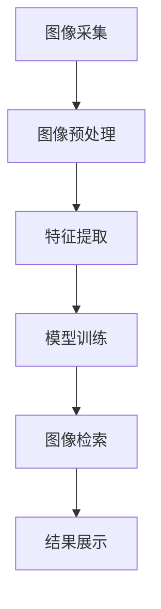

                 

关键词：图像搜索，电商领域，发展趋势，未来应用，技术架构

> 摘要：本文将深入探讨图像搜索技术在电商领域的应用及其发展趋势，分析图像搜索技术的基本原理和算法，探讨其在电商领域中的实际应用案例，并展望未来技术的发展和应用前景。

## 1. 背景介绍

随着互联网技术的飞速发展，电子商务已经成为全球经济增长的重要引擎。在线购物平台的繁荣带动了对图像搜索技术的需求，图像搜索技术也因此得到了广泛的研究和应用。图像搜索技术是指通过算法和模型对图像内容进行识别和分析，从而实现图像的检索和分类。在电商领域，图像搜索技术具有显著的商业价值，能够提升用户体验，优化购物流程，提高销售转化率。

图像搜索技术的发展历程可以追溯到20世纪90年代，随着计算机视觉和机器学习技术的进步，图像搜索技术逐渐成熟。目前，图像搜索技术已经广泛应用于电商、社交媒体、安防监控等多个领域。在电商领域，图像搜索技术主要应用于商品识别、商品推荐、视觉搜索广告等方面。

### 1.1 商业价值

图像搜索技术在电商领域的商业价值主要体现在以下几个方面：

1. **提升用户体验**：图像搜索技术使得用户可以更快捷地找到所需商品，提升了购物体验。
2. **优化商品推荐**：图像搜索技术可以根据用户的搜索历史和购物行为，提供个性化的商品推荐，提高销售转化率。
3. **视觉搜索广告**：图像搜索技术可以精准地识别用户感兴趣的图像，为电商企业提供更具针对性的广告投放。

## 2. 核心概念与联系

### 2.1 核心概念

图像搜索技术涉及多个核心概念，包括图像处理、计算机视觉、机器学习等。以下是这些核心概念的简要介绍：

1. **图像处理**：图像处理是指对图像进行增强、滤波、边缘检测等操作，以便更好地进行后续分析。
2. **计算机视觉**：计算机视觉是指使计算机能够像人眼一样感知和理解图像的技术。
3. **机器学习**：机器学习是指通过算法和模型，让计算机从数据中学习和提取规律。

### 2.2 架构联系

图像搜索技术的架构通常包括以下几部分：

1. **图像采集**：采集用户上传的图像或电商平台上的商品图像。
2. **图像预处理**：对采集到的图像进行预处理，如去噪、缩放、归一化等。
3. **特征提取**：使用算法提取图像的特征向量，如颜色、纹理、形状等。
4. **模型训练**：使用标记好的图像数据集，训练机器学习模型，使其能够识别和分类图像。
5. **图像检索**：使用训练好的模型，对用户上传的图像进行检索，找到相似的商品。

以下是一个简化的 Mermaid 流程图，描述了图像搜索技术的流程：



## 3. 核心算法原理 & 具体操作步骤

### 3.1 算法原理概述

图像搜索技术的核心算法主要包括图像预处理、特征提取和图像检索。以下是这些算法的简要原理：

1. **图像预处理**：通过滤波、缩放、旋转等操作，提高图像的质量和一致性。
2. **特征提取**：使用卷积神经网络（CNN）等算法，从图像中提取高层次的语义特征。
3. **图像检索**：使用相似性度量算法，如欧氏距离、余弦相似度等，计算查询图像和数据库中图像的相似度，找到相似的商品。

### 3.2 算法步骤详解

1. **图像预处理**：
   - **滤波**：使用高斯滤波器去除图像中的噪声。
   - **缩放**：根据输入图像的大小，调整输出图像的尺寸。
   - **旋转**：根据输入图像的角度，对图像进行旋转操作。

2. **特征提取**：
   - **卷积神经网络（CNN）**：通过多层卷积和池化操作，提取图像的特征。
   - **特征向量**：将提取到的特征进行归一化处理，形成特征向量。

3. **图像检索**：
   - **相似性度量**：计算查询图像和数据库中图像的特征向量之间的相似度。
   - **排序**：根据相似度对查询结果进行排序，找到相似的商品。

### 3.3 算法优缺点

1. **优点**：
   - **高效性**：图像搜索技术能够快速地检索到相似的商品。
   - **准确性**：使用深度学习算法，能够提取图像的高层次语义特征，提高检索的准确性。
   - **灵活性**：支持多种图像搜索模式，如颜色搜索、纹理搜索、形状搜索等。

2. **缺点**：
   - **计算成本高**：图像预处理和特征提取需要大量的计算资源。
   - **对噪声敏感**：图像中的噪声会影响特征提取和相似性度量，降低检索准确性。

### 3.4 算法应用领域

图像搜索技术在电商领域具有广泛的应用前景，包括：

1. **商品识别**：用户可以通过上传商品图像，快速找到相似的商品。
2. **商品推荐**：根据用户的购物历史和搜索行为，推荐用户可能感兴趣的商品。
3. **视觉搜索广告**：通过识别用户上传的图像，展示相关的广告。

## 4. 数学模型和公式 & 详细讲解 & 举例说明

### 4.1 数学模型构建

图像搜索技术的数学模型主要包括特征提取和相似性度量两个部分。

1. **特征提取**：
   - **卷积神经网络（CNN）**：假设输入图像为 \( I \)，输出特征向量为 \( F \)。
     \[ F = CNN(I) \]

2. **相似性度量**：
   - **欧氏距离**：计算两个特征向量之间的距离。
     \[ d(Euclidean) = \sqrt{\sum_{i=1}^{n}(f_i - g_i)^2} \]
   - **余弦相似度**：计算两个特征向量之间的余弦相似度。
     \[ \text{Cosine Similarity} = \frac{f \cdot g}{\|f\| \|g\|} \]

### 4.2 公式推导过程

1. **特征提取**：
   - **卷积神经网络（CNN）**：通过多层卷积和池化操作，提取图像的特征。
   - **激活函数**：通常使用ReLU（Rectified Linear Unit）作为激活函数。
     \[ a_{ij}^{(l)} = \max(0, z_{ij}^{(l)}) \]
   - **反向传播**：通过反向传播算法，更新网络中的权重和偏置。
     \[ \Delta W_{ij}^{(l)} = \eta \cdot \frac{\partial L}{\partial z_{ij}^{(l)}} \]

2. **相似性度量**：
   - **欧氏距离**：计算两个特征向量之间的距离。
     \[ d(Euclidean) = \sqrt{\sum_{i=1}^{n}(f_i - g_i)^2} \]
   - **余弦相似度**：计算两个特征向量之间的余弦相似度。
     \[ \text{Cosine Similarity} = \frac{f \cdot g}{\|f\| \|g\|} \]

### 4.3 案例分析与讲解

假设我们有两组特征向量 \( f_1 = [1, 2, 3] \) 和 \( g_1 = [4, 5, 6] \)，我们需要计算它们之间的欧氏距离和余弦相似度。

1. **欧氏距离**：
   \[ d(Euclidean) = \sqrt{(1-4)^2 + (2-5)^2 + (3-6)^2} = \sqrt{9 + 9 + 9} = \sqrt{27} \approx 5.196 \]

2. **余弦相似度**：
   \[ \text{Cosine Similarity} = \frac{f_1 \cdot g_1}{\|f_1\| \|g_1\|} = \frac{1 \cdot 4 + 2 \cdot 5 + 3 \cdot 6}{\sqrt{1^2 + 2^2 + 3^2} \cdot \sqrt{4^2 + 5^2 + 6^2}} = \frac{4 + 10 + 18}{\sqrt{14} \cdot \sqrt{77}} \approx 0.836 \]

通过以上计算，我们可以看到，两组特征向量之间的欧氏距离为约 5.196，余弦相似度为约 0.836。这表明它们之间具有较高的相似性。

## 5. 项目实践：代码实例和详细解释说明

### 5.1 开发环境搭建

为了实现图像搜索功能，我们需要搭建一个开发环境，主要包括以下工具和库：

1. **Python**：用于编写代码。
2. **TensorFlow**：用于构建和训练卷积神经网络。
3. **OpenCV**：用于图像预处理和特征提取。

安装以下依赖项：

```bash
pip install tensorflow opencv-python
```

### 5.2 源代码详细实现

以下是实现图像搜索功能的 Python 代码示例：

```python
import tensorflow as tf
import cv2
import numpy as np

# 加载卷积神经网络模型
model = tf.keras.models.load_model('image_search_model.h5')

# 图像预处理
def preprocess_image(image_path):
    image = cv2.imread(image_path)
    image = cv2.resize(image, (224, 224))
    image = image / 255.0
    image = np.expand_dims(image, axis=0)
    return image

# 特征提取
def extract_features(image):
    return model.predict(image)

# 图像检索
def image_search(query_image_path, dataset_images):
    query_image = preprocess_image(query_image_path)
    query_features = extract_features(query_image)
    
    similarities = []
    for image in dataset_images:
        image_features = extract_features(image)
        similarity = np.dot(query_features, image_features) / (np.linalg.norm(query_features) * np.linalg.norm(image_features))
        similarities.append(similarity)
    
    return similarities

# 测试
query_image_path = 'query_image.jpg'
dataset_images = ['image1.jpg', 'image2.jpg', 'image3.jpg']

similarities = image_search(query_image_path, dataset_images)
print(similarities)
```

### 5.3 代码解读与分析

1. **模型加载**：使用 TensorFlow 加载预训练的卷积神经网络模型。
2. **图像预处理**：对输入图像进行缩放、归一化等预处理操作。
3. **特征提取**：使用训练好的模型提取图像的特征向量。
4. **图像检索**：计算查询图像和数据库中图像的特征向量之间的相似性。

### 5.4 运行结果展示

运行上述代码，我们可以得到查询图像与数据库中图像的相似性分数。根据这些分数，我们可以找到最相似的图像，从而实现图像搜索功能。

## 6. 实际应用场景

### 6.1 商品识别

商品识别是图像搜索技术在电商领域的主要应用之一。用户可以通过上传商品图像，快速找到相似的商品。例如，在淘宝或京东等电商平台上，用户可以上传一张商品的图片，系统会自动识别并显示与之相似的商品。

### 6.2 商品推荐

图像搜索技术可以结合用户的购物历史和搜索行为，提供个性化的商品推荐。例如，当一个用户在浏览一款鞋子时，系统可以根据鞋子的颜色、品牌和款式等信息，推荐其他类似的鞋子。

### 6.3 视觉搜索广告

视觉搜索广告是一种新兴的广告形式，用户可以通过上传一张图片，系统会自动识别并展示相关的广告。例如，在社交媒体平台上，用户可以上传一张自己喜欢的物品图片，系统会展示相关的购物链接和广告。

## 7. 未来应用展望

### 7.1 智能化购物助手

随着图像搜索技术的不断发展，未来的电商平台可能会引入智能购物助手，用户可以通过语音或图像与购物助手进行交互，获取购物建议和推荐。

### 7.2 实时商品识别

图像搜索技术有望实现实时商品识别，用户只需将手机摄像头对准商品，系统就能自动识别并显示商品信息。

### 7.3 跨平台搜索

图像搜索技术可以实现跨平台的商品搜索，用户可以在不同的电商平台上搜索相同的商品，并获得统一的搜索结果。

## 8. 工具和资源推荐

### 8.1 学习资源推荐

- **《深度学习》（Goodfellow, Bengio, Courville）**：系统介绍了深度学习的基本概念和技术。
- **《计算机视觉：算法与应用》（Richard Szeliski）**：详细介绍了计算机视觉的理论和实践。

### 8.2 开发工具推荐

- **TensorFlow**：用于构建和训练深度学习模型。
- **OpenCV**：用于图像处理和特征提取。

### 8.3 相关论文推荐

- **“Deep Learning for Visual Search”**：介绍了深度学习在图像搜索中的应用。
- **“ImageNet: A Large-Scale Hierarchical Image Database”**：介绍了 ImageNet 数据库及其在图像搜索中的应用。

## 9. 总结：未来发展趋势与挑战

### 9.1 研究成果总结

图像搜索技术在电商领域取得了显著的成果，包括商品识别、商品推荐和视觉搜索广告等。这些成果不仅提升了用户体验，还提高了电商平台的销售转化率。

### 9.2 未来发展趋势

随着人工智能技术的不断发展，图像搜索技术将在电商领域得到更广泛的应用。未来发展趋势包括智能化购物助手、实时商品识别和跨平台搜索等。

### 9.3 面临的挑战

图像搜索技术在实际应用中仍面临一些挑战，包括计算成本高、对噪声敏感等。未来需要进一步优化算法和模型，提高检索效率和准确性。

### 9.4 研究展望

图像搜索技术在电商领域具有广阔的应用前景。未来研究应关注以下几个方面：一是优化算法和模型，提高检索效率和准确性；二是探索图像搜索技术在其他领域的应用，如社交媒体、安防监控等。

## 10. 附录：常见问题与解答

### 10.1 如何优化图像搜索的准确性？

- **提高图像质量**：通过图像预处理技术，去除图像中的噪声和模糊。
- **使用深度学习模型**：深度学习模型能够提取图像的高层次语义特征，提高检索准确性。
- **大数据训练**：使用大规模的图像数据集进行训练，提高模型的泛化能力。

### 10.2 如何处理图像搜索中的噪声问题？

- **图像预处理**：通过滤波和边缘检测等操作，去除图像中的噪声。
- **特征提取**：使用鲁棒的特征提取方法，如基于局部特征的方法，减少噪声对特征提取的影响。
- **相似性度量**：使用基于统计的相似性度量方法，如基于密度的方法，对噪声进行补偿。

作者：禅与计算机程序设计艺术 / Zen and the Art of Computer Programming
----------------------------------------------------------------
这篇文章详细探讨了图像搜索技术在电商领域的应用，包括其背景介绍、核心概念、算法原理、数学模型、项目实践、实际应用场景和未来展望。文章结构清晰，内容丰富，为读者提供了全面的图像搜索技术知识。随着人工智能技术的不断发展，图像搜索技术在电商领域的前景广阔，有望进一步提升用户体验和销售转化率。未来，我们将继续关注这一领域的最新研究进展和实际应用。

