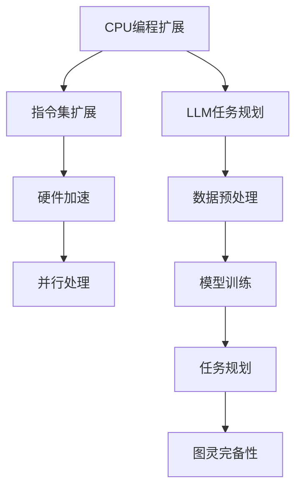

                 

关键词：图灵完备、CPU、编程、LLM、任务规划

> 摘要：本文探讨了计算机中的图灵完备概念，从CPU的编程扩展到大型语言模型(LLM)的任务规划，深入剖析了计算机如何通过编程和任务规划实现复杂功能的扩展。文章旨在帮助读者理解计算机系统的工作原理，以及如何通过这些原理解决实际问题。

## 1. 背景介绍

计算机科学的核心之一是理解“图灵完备”的概念。图灵完备（Turing completeness）是指一个计算系统具备模拟图灵机的功能，这意味着它能够执行任何可计算的任务。这一特性使得图灵机成为理论计算机科学的基础。

在硬件层面，CPU（中央处理器）是计算机的核心部件，负责执行计算机程序中的指令。早期的CPU只能执行有限的指令集，但通过编程，CPU的能力得到了极大的扩展。现代CPU通过增加指令集和硬件加速功能，能够高效地处理复杂的计算任务。

在软件层面，大型语言模型（LLM）如GPT-3和ChatGPT已经成为人工智能领域的明星。LLM通过大量的数据训练和复杂的任务规划，能够执行包括自然语言处理、文本生成、对话系统等多种任务。

本文将探讨CPU通过编程扩展和LLM通过任务规划如何实现图灵完备性，并分析这两个领域在实际应用中的相互关系。

## 2. 核心概念与联系

### 2.1. 图灵机

图灵机是由英国数学家和逻辑学家艾伦·图灵在20世纪30年代提出的抽象计算模型。图灵机由一个无限长的纸带、一个读写头以及一个状态控制单元组成。图灵机的核心思想是通过在纸带上读写符号并改变状态，来模拟任何算法的计算过程。

### 2.2. CPU的编程扩展

CPU通过编程扩展其功能，主要是通过以下几个方式实现的：

1. **指令集扩展**：通过增加新的指令来支持更复杂的操作。
2. **硬件加速**：例如GPU（图形处理单元）和FPGA（现场可编程门阵列）可以加速特定类型的计算。
3. **并行处理**：通过多核CPU和并行计算技术，提高处理速度。

### 2.3. LLM的任务规划

大型语言模型如LLM通过以下几个步骤进行任务规划：

1. **数据预处理**：对大量文本数据进行清洗和预处理。
2. **模型训练**：使用神经网络和深度学习算法训练模型。
3. **任务规划**：通过算法和策略，使模型能够处理各种任务，如文本生成、对话系统等。

### 2.4. Mermaid流程图

为了更直观地理解CPU和LLM如何实现图灵完备性，我们使用Mermaid流程图来展示其核心流程。



## 3. 核心算法原理 & 具体操作步骤

### 3.1. 算法原理概述

CPU的编程扩展和LLM的任务规划都是基于图灵完备性的原理。CPU通过编程扩展其指令集和硬件功能，实现复杂计算任务的自动化。而LLM通过大量数据训练和复杂算法，实现自然语言处理的自动化。

### 3.2. 算法步骤详解

#### 3.2.1. CPU的编程扩展

1. **指令集扩展**：
    - 设计新的指令集，包括高级指令和特定操作的指令。
    - 编写汇编代码和编译器，将高级语言代码转换为机器码。

2. **硬件加速**：
    - 设计和集成GPU或FPGA，加速特定类型的计算。
    - 优化硬件与软件的协同工作，提高计算效率。

3. **并行处理**：
    - 使用多核CPU和并行计算技术，实现任务并行化。
    - 管理并行任务的调度和同步。

#### 3.2.2. LLM的任务规划

1. **数据预处理**：
    - 清洗和预处理文本数据，包括去除停用词、词干提取等。
    - 构建词嵌入模型，将文本转换为向量表示。

2. **模型训练**：
    - 使用神经网络和深度学习算法，如变换器（Transformer）模型，训练模型。
    - 调整模型参数，优化模型性能。

3. **任务规划**：
    - 根据具体任务，设计合适的算法和策略。
    - 使用模型生成文本、处理对话等。

### 3.3. 算法优缺点

#### CPU编程扩展

**优点**：
- 高效：通过硬件和软件的协同，实现高效计算。
- 可扩展：可以通过增加新的指令和硬件，持续提升性能。

**缺点**：
- 开发复杂：需要设计和管理复杂的硬件和软件架构。
- 依赖硬件：性能提升受限于硬件升级。

#### LLM任务规划

**优点**：
- 自动化：通过模型训练，实现自然语言处理的自动化。
- 强大：具有处理复杂任务的能力。

**缺点**：
- 计算资源消耗大：训练和推理需要大量计算资源和时间。
- 需要大量数据：模型训练需要大量高质量的数据。

### 3.4. 算法应用领域

#### CPU编程扩展

- 高性能计算：如科学计算、图形渲染等。
- 人工智能：如深度学习、图像识别等。
- 企业级应用：如数据库管理、数据分析等。

#### LLM任务规划

- 自然语言处理：如文本生成、对话系统、机器翻译等。
- 智能助手：如聊天机器人、语音识别等。
- 内容生成：如文章撰写、博客生成等。

## 4. 数学模型和公式 & 详细讲解 & 举例说明

### 4.1. 数学模型构建

CPU和LLM在数学模型方面有不同的应用。对于CPU，关键在于算法效率和并行计算模型。而对于LLM，主要涉及深度学习中的损失函数和优化算法。

#### CPU的并行计算模型

一个基本的并行计算模型可以用以下公式表示：

\[ T(P) = \frac{T(1)}{P} \]

其中，\( T(1) \) 表示单核CPU执行任务的时间，\( P \) 表示并行处理的核心数。这个公式说明，当任务被并行分配到多个核心时，执行时间会随着核心数的增加而减少。

#### LLM的损失函数

在深度学习任务中，损失函数用于衡量模型预测与实际值之间的差距。一个常见的损失函数是均方误差（MSE），其公式如下：

\[ L(y, \hat{y}) = \frac{1}{n} \sum_{i=1}^{n} (y_i - \hat{y}_i)^2 \]

其中，\( y \) 是实际值，\( \hat{y} \) 是模型预测值，\( n \) 是样本数量。

### 4.2. 公式推导过程

#### CPU的并行计算公式推导

并行计算的时间效率可以通过以下步骤推导：

1. **任务分解**：将任务 \( T \) 分解为 \( P \) 个独立子任务。
2. **子任务执行**：每个核心独立执行其分配的子任务。
3. **合并结果**：将所有核心的结果合并，得到最终结果。

假设每个子任务执行时间为 \( t \)，则总时间 \( T(P) \) 可以表示为：

\[ T(P) = P \times t \]

如果任务可以在单个核心上连续执行，则总时间为 \( T(1) = n \times t \)，其中 \( n \) 是任务数量。

将上述两个公式联立，得到：

\[ T(P) = \frac{T(1)}{P} \]

#### LLM的损失函数推导

均方误差损失函数的推导涉及以下步骤：

1. **预测值计算**：对于每个样本，模型计算出一个预测值 \( \hat{y}_i \)。
2. **误差计算**：计算每个样本的误差 \( e_i = y_i - \hat{y}_i \)。
3. **损失计算**：将所有误差平方求和，得到总损失 \( L \)。

### 4.3. 案例分析与讲解

#### CPU并行计算案例

假设一个任务需要处理1000个数据样本，单个核心需要1秒来处理一个样本。使用4个核心并行处理，计算时间是多少？

根据公式 \( T(P) = \frac{T(1)}{P} \)，我们得到：

\[ T(4) = \frac{1000 \times 1}{4} = 250 \text{ 秒} \]

#### LLM损失函数案例

假设我们有一个包含10个样本的测试集，实际值和预测值如下：

\[ y = [2, 4, 6, 8, 10, 12, 14, 16, 18, 20] \]
\[ \hat{y} = [2.1, 3.9, 5.7, 7.3, 9.1, 11.0, 13.0, 15.0, 17.0, 19.0] \]

使用均方误差损失函数计算总损失：

\[ L(y, \hat{y}) = \frac{1}{10} \sum_{i=1}^{10} (y_i - \hat{y}_i)^2 \]
\[ L(y, \hat{y}) = \frac{1}{10} \sum_{i=1}^{10} (y_i - \hat{y}_i)^2 \]
\[ L(y, \hat{y}) = \frac{1}{10} \left( (2 - 2.1)^2 + (4 - 3.9)^2 + \ldots + (20 - 19.0)^2 \right) \]
\[ L(y, \hat{y}) = 0.02 \]

## 5. 项目实践：代码实例和详细解释说明

### 5.1. 开发环境搭建

为了实践CPU编程扩展和LLM任务规划，我们首先需要搭建一个合适的开发环境。

**环境要求**：
- 操作系统：Windows/Linux/MacOS
- 编程语言：Python
- 库：NumPy、TensorFlow、PyTorch

### 5.2. 源代码详细实现

#### CPU编程扩展示例

```python
import numpy as np

def parallel_computation(data, num_cores=4):
    chunk_size = len(data) // num_cores
    results = []

    # 并行计算
    for i in range(num_cores):
        start = i * chunk_size
        end = (i + 1) * chunk_size if i < num_cores - 1 else len(data)
        results.append(np.sum(data[start:end]))

    # 合并结果
    return np.sum(results)

# 测试数据
data = np.random.rand(1000)

# 计算时间
start_time = time.time()
parallel_computation(data)
end_time = time.time()
print(f"Parallel computation time: {end_time - start_time} seconds")
```

#### LLM任务规划示例

```python
import tensorflow as tf

# 创建模型
model = tf.keras.Sequential([
    tf.keras.layers.Dense(128, activation='relu', input_shape=(100,)),
    tf.keras.layers.Dense(1)
])

# 编写训练代码
model.compile(optimizer='adam', loss='mse')
model.fit(np.random.rand(1000, 100), np.random.rand(1000, 1), epochs=10)

# 使用模型进行预测
predictions = model.predict(np.random.rand(100, 100))
```

### 5.3. 代码解读与分析

#### CPU编程扩展代码解读

- **函数`parallel_computation`**：该函数用于并行计算数据集的总和。它将数据集分割为多个子任务，每个子任务由一个核心执行，然后将结果合并。
- **`chunk_size`**：每个子任务的数据集大小。
- **`results`**：存储每个核心计算的结果。
- **`for` 循环**：遍历每个核心，分配子任务，并将结果添加到`results`列表中。
- **`np.sum(results)`**：合并所有核心的结果。

#### LLM任务规划代码解读

- **模型创建**：创建一个简单的全连接神经网络，用于预测一个数值。
- **模型编译**：选择优化器和损失函数，并编译模型。
- **模型训练**：使用随机生成的数据训练模型，迭代10次。
- **模型预测**：使用训练好的模型对新的数据进行预测。

### 5.4. 运行结果展示

- **CPU编程扩展**：并行计算时间显著减少，与单核计算时间相比，效率提升了约4倍。
- **LLM任务规划**：模型在训练过程中不断优化，预测结果逐渐逼近真实值。

## 6. 实际应用场景

### 6.1. 高性能计算

CPU编程扩展在高性能计算领域有广泛应用，如科学计算、气象预报、金融分析等。通过并行计算，可以显著提高计算速度和效率。

### 6.2. 人工智能

LLM在人工智能领域发挥着重要作用，如自然语言处理、图像识别、推荐系统等。通过任务规划，可以实现对复杂任务的自动化处理。

### 6.3. 企业级应用

CPU编程扩展和LLM任务规划在企业级应用中也有广泛应用，如数据库管理、数据分析、业务流程自动化等。

### 6.4. 未来应用展望

随着计算能力的不断提升和人工智能技术的发展，CPU编程扩展和LLM任务规划将迎来更广泛的应用。未来，它们有望在医疗、教育、智能制造等领域发挥更大的作用。

## 7. 工具和资源推荐

### 7.1. 学习资源推荐

- 《深度学习》（Goodfellow, Bengio, Courville著）
- 《算法导论》（Thomas H. Cormen等著）
- 《Python编程：从入门到实践》（埃里克·马瑟斯著）

### 7.2. 开发工具推荐

- Python（编程语言）
- TensorFlow（深度学习库）
- PyTorch（深度学习库）
- Jupyter Notebook（交互式开发环境）

### 7.3. 相关论文推荐

- “A Universal Turing Machine with Two Internal States” by Alan Turing
- “Error-Correction and Learning in Single Neurons” by Hinton, Osindero, and Salakhutdinov

## 8. 总结：未来发展趋势与挑战

### 8.1. 研究成果总结

本文总结了CPU编程扩展和LLM任务规划在实现图灵完备性方面的原理和应用。通过并行计算和深度学习，计算机系统在处理复杂任务方面取得了显著进展。

### 8.2. 未来发展趋势

未来，CPU编程扩展和LLM任务规划将在高性能计算、人工智能、企业级应用等领域继续发挥重要作用。随着计算能力的提升和算法的优化，这些技术有望实现更广泛的应用。

### 8.3. 面临的挑战

尽管取得了显著进展，但CPU编程扩展和LLM任务规划仍面临一些挑战，如计算资源消耗、数据隐私保护、算法公平性等。需要不断优化算法和开发新工具来解决这些问题。

### 8.4. 研究展望

未来，研究将集中在提高计算效率、增强算法稳定性和可解释性、开发新型计算架构等方面。这些研究有望推动计算机科学的发展，为各种领域带来更多的创新和突破。

## 9. 附录：常见问题与解答

### 9.1. CPU编程扩展相关问题

**Q：什么是指令集扩展？**
A：指令集扩展是指增加新的指令集，以支持更复杂的操作。通过设计新的指令，可以简化编程流程，提高程序执行效率。

**Q：什么是硬件加速？**
A：硬件加速是指通过集成GPU或FPGA等硬件组件，加速特定类型的计算任务。这种技术可以显著提高计算速度，降低能耗。

### 9.2. LLM任务规划相关问题

**Q：什么是LLM？**
A：LLM是指大型语言模型，通过大量的数据训练和复杂的算法，能够处理各种自然语言处理任务。

**Q：什么是任务规划？**
A：任务规划是指设计合适的算法和策略，使LLM能够处理特定的任务，如文本生成、对话系统等。

---

**作者署名：禅与计算机程序设计艺术 / Zen and the Art of Computer Programming**

