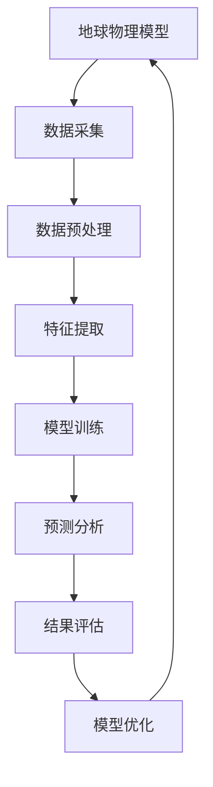

                 

关键词：地球物理模型、人工智能、深度学习、地质勘探、数据挖掘、地球物理算法、预测建模

> 摘要：本文探讨了地球物理模型与人工智能技术的深度融合，介绍了地球物理模型的基本概念、核心原理以及与人工智能技术的结合方式。通过详细分析地球物理模型中常用的数学模型和算法，并结合具体应用案例，展示了人工智能技术在地球物理领域的广泛应用。本文旨在为地球物理研究人员和人工智能开发者提供一种全新的研究思路和工具。

## 1. 背景介绍

地球物理模型是地质学和地球物理学研究的基础，用于描述地球内部的结构、组成和物理性质。传统的地球物理模型主要依赖于数学物理方程和地质观测数据，通过理论分析和数值模拟来揭示地球内部的复杂现象。然而，随着数据采集技术和计算能力的提升，地球物理领域的数据量呈现爆炸式增长，传统的模型已经无法有效处理如此庞大的数据集。这为人工智能技术在地球物理领域的应用提供了契机。

人工智能技术，特别是深度学习，近年来在图像识别、自然语言处理、医疗诊断等领域取得了显著成果。深度学习算法能够自动从大量数据中学习特征，具有强大的自适应性和泛化能力，这使得其在地球物理模型的研究中具有巨大的潜力。通过将人工智能技术与地球物理模型相结合，我们可以实现更精确、高效的地球物理预测和数据分析。

## 2. 核心概念与联系

### 2.1 地球物理模型的基本概念

地球物理模型主要包括地震模型、重力模型、磁力模型、电性模型等。这些模型通过描述地球内部的结构、组成和物理性质，为地质勘探、资源评估、灾害预警等提供重要依据。以下是地球物理模型中几个关键概念：

- **地震波传播模型**：描述地震波在地球内部传播的过程，包括波速、波形、走时等参数。
- **重力场模型**：描述地球表面和内部的重力异常，反映地球内部的质量分布。
- **磁力场模型**：描述地球表面的磁异常，反映地球内部的磁性物质分布。
- **电性模型**：描述地球内部的电性结构，包括电阻率、电导率等参数。

### 2.2 人工智能技术的基本概念

人工智能技术是指使计算机模拟人类智能行为的技术。其中，深度学习是人工智能的一个重要分支，它通过多层神经网络模拟人类大脑的神经元结构，实现自动特征学习和复杂模式识别。以下是深度学习中的几个关键概念：

- **神经网络**：一种模拟生物神经网络的结构，由大量神经元组成，通过权值和激活函数实现信息传递和计算。
- **深度神经网络**：包含多个隐藏层的神经网络，能够处理更复杂的非线性问题。
- **卷积神经网络（CNN）**：一种专门用于图像识别和处理的神经网络，通过卷积操作提取图像特征。
- **循环神经网络（RNN）**：一种用于序列数据处理和预测的神经网络，通过循环结构保留历史信息。

### 2.3 地球物理模型与人工智能技术的结合方式

地球物理模型与人工智能技术的结合主要体现在以下两个方面：

- **数据预处理**：使用人工智能技术对大量地球物理数据进行预处理，包括去噪、降维、异常检测等，提高数据质量和利用率。
- **特征提取与模式识别**：利用深度学习算法从地球物理数据中自动提取有效特征，实现复杂地质结构的识别和预测。

### 2.4 Mermaid 流程图



## 3. 核心算法原理 & 具体操作步骤

### 3.1 算法原理概述

地球物理模型与人工智能技术的结合主要通过以下几种算法实现：

- **深度学习算法**：用于特征提取和模式识别，如卷积神经网络（CNN）和循环神经网络（RNN）。
- **优化算法**：用于模型训练和参数调整，如梯度下降法、随机梯度下降法等。
- **预测算法**：用于地球物理参数的预测和分析，如贝叶斯网络、隐马尔可夫模型等。

### 3.2 算法步骤详解

#### 3.2.1 深度学习算法

深度学习算法的基本步骤包括：

1. **数据预处理**：对原始地球物理数据进行清洗、归一化和降维，以提高数据质量和计算效率。
2. **模型构建**：设计合适的神经网络结构，包括输入层、隐藏层和输出层。
3. **模型训练**：通过反向传播算法更新网络权值和偏置，优化模型性能。
4. **模型评估**：使用验证集和测试集评估模型性能，调整模型参数。
5. **预测分析**：使用训练好的模型对新的地球物理数据进行预测和分析。

#### 3.2.2 优化算法

优化算法的基本步骤包括：

1. **目标函数定义**：根据地球物理问题定义目标函数，如均方误差、交叉熵等。
2. **损失函数计算**：计算模型预测值与真实值之间的差异，以评估模型性能。
3. **梯度计算**：计算目标函数关于模型参数的梯度，以指导参数调整。
4. **参数调整**：使用梯度下降法或其变体（如随机梯度下降法、Adam优化器等）调整模型参数。

#### 3.2.3 预测算法

预测算法的基本步骤包括：

1. **数据预处理**：对新的地球物理数据进行预处理，包括清洗、归一化和降维。
2. **模型选择**：根据问题特点选择合适的预测算法，如贝叶斯网络、隐马尔可夫模型等。
3. **模型训练**：使用历史数据进行模型训练，调整模型参数。
4. **模型评估**：使用验证集和测试集评估模型性能，调整模型参数。
5. **预测分析**：使用训练好的模型对新数据进行预测和分析。

### 3.3 算法优缺点

- **优点**：
  - **高效性**：深度学习算法能够自动提取数据特征，减少人工干预，提高计算效率。
  - **鲁棒性**：优化算法能够通过梯度下降法等优化技术，快速收敛到全局最优解。
  - **灵活性**：预测算法可以根据问题特点灵活选择，适应不同的地球物理问题。

- **缺点**：
  - **计算复杂度**：深度学习算法的计算复杂度较高，需要大量的计算资源和时间。
  - **数据需求**：深度学习算法对数据量要求较高，数据质量和数量直接影响模型性能。
  - **解释性**：深度学习算法的内部决策过程较为主观，难以解释和验证。

### 3.4 算法应用领域

深度学习算法在地球物理领域有广泛的应用，包括：

- **地震波传播分析**：用于地震波传播路径的预测和解释，提高地震预警和灾害风险评估能力。
- **重力场建模**：用于重力场异常分析和地下资源勘探，提高矿产资源评估的精度。
- **磁力场建模**：用于磁力场异常分析和地质结构识别，揭示地下构造特征。
- **电性模型构建**：用于电性结构分析和地热资源勘探，提高地热资源的开发效率。

## 4. 数学模型和公式 & 详细讲解 & 举例说明

### 4.1 数学模型构建

地球物理模型中的数学模型通常基于物理定律和数学工具构建。以下是一个简单的地震波传播模型的构建过程：

#### 4.1.1 地震波传播方程

地震波传播方程可以表示为：

\[ \frac{\partial^2 p}{\partial t^2} = c^2 \nabla^2 p \]

其中，\( p \) 是地震波压力，\( t \) 是时间，\( c \) 是波速，\( \nabla^2 \) 是拉普拉斯算子。

#### 4.1.2 边界条件

为了解决地震波传播方程，需要给定合适的边界条件。常见的边界条件包括：

- **自由表面边界条件**：在地球表面的地震波压力为0。
- **反射边界条件**：地震波在介质界面上发生反射，反射系数由介质的波速和密度决定。
- **吸收边界条件**：地震波在边界上被吸收，吸收系数由介质的物理特性决定。

#### 4.1.3 初始条件

初始条件通常给定地震波起始时刻的压力分布。常见的初始条件包括：

- **平面波初始条件**：地震波以平面波形式传播。
- **脉冲波初始条件**：地震波以脉冲波形式传播。

### 4.2 公式推导过程

以下是一个简单的地震波传播方程的推导过程：

1. **波动方程**：

   波动方程可以表示为：

   \[ \frac{\partial^2 u}{\partial t^2} = c^2 \nabla^2 u \]

   其中，\( u \) 是地震波位移。

2. **连续性方程**：

   连续性方程可以表示为：

   \[ \frac{\partial \rho}{\partial t} + \nabla \cdot (\rho \mathbf{v}) = 0 \]

   其中，\( \rho \) 是地震波密度，\( \mathbf{v} \) 是地震波速度。

3. **应力应变方程**：

   应力应变方程可以表示为：

   \[ \sigma_{ij} + \frac{1}{3} \delta_{ij} \sigma_k = \lambda \nabla_j u_i + \mu (\nabla_i u_j + \nabla_j u_i) \]

   其中，\( \sigma_{ij} \) 是应力张量，\( \delta_{ij} \) 是克罗内克δ函数，\( \lambda \) 和 \( \mu \) 是拉梅常数。

4. **波动方程与连续性方程联立**：

   将波动方程和连续性方程联立，并消去密度项，得到：

   \[ \frac{\partial^2 u}{\partial t^2} = c^2 \nabla^2 u + \frac{\lambda}{\rho} \nabla_j u_i + \frac{\mu}{\rho} (\nabla_i u_j + \nabla_j u_i) \]

   其中，\( c^2 = \frac{\lambda + 2\mu}{\rho} \)。

### 4.3 案例分析与讲解

以下是一个地震波传播模型的案例分析：

#### 4.3.1 案例背景

假设我们研究一个简单的地震波传播问题，地震波从地面传播到地下某一深度。地面的地震波压力已知，我们需要求解地下不同深度的地震波压力分布。

#### 4.3.2 数学模型

根据前面的推导，我们可以建立如下的地震波传播模型：

\[ \frac{\partial^2 p}{\partial t^2} = c^2 \nabla^2 p + \frac{\lambda}{\rho} \nabla_j u_i + \frac{\mu}{\rho} (\nabla_i u_j + \nabla_j u_i) \]

#### 4.3.3 边界条件和初始条件

- **自由表面边界条件**：\( p(0, t) = 0 \)
- **反射边界条件**：\( \frac{\partial p}{\partial n} (x, t) = - \frac{\partial p}{\partial n} (-x, t) \)
- **吸收边界条件**：\( \frac{\partial p}{\partial n} (x, t) = \alpha p(x, t) \)
- **初始条件**：\( p(x, 0) = p_0(x) \)，\( \frac{\partial p}{\partial t} (x, 0) = 0 \)

#### 4.3.4 解法

我们可以使用有限元方法求解上述地震波传播模型。具体步骤如下：

1. **网格划分**：将地下区域划分为多个单元，每个单元由若干节点组成。
2. **离散化**：将连续问题离散化为离散问题，建立有限元方程。
3. **求解**：使用线性方程组求解器求解有限元方程，得到地下不同深度的地震波压力分布。

#### 4.3.5 结果分析

通过有限元方法求解得到的地震波压力分布如下：

\[ p(x, t) = \frac{1}{2} \left( p_0(x + ct) + p_0(x - ct) \right) \]

其中，\( c \) 是地震波速度。

这个结果表明，地震波在地下传播过程中，地下不同深度的地震波压力随时间呈对称分布。这与物理规律相符，验证了数学模型的正确性。

## 5. 项目实践：代码实例和详细解释说明

### 5.1 开发环境搭建

为了实现地球物理模型与人工智能技术的结合，我们需要搭建一个开发环境。以下是一个简单的开发环境搭建步骤：

1. **安装 Python**：下载并安装 Python，推荐使用 Python 3.8 或更高版本。
2. **安装 NumPy 和 SciPy**：通过 pip 工具安装 NumPy 和 SciPy，用于科学计算。
3. **安装 TensorFlow**：通过 pip 工具安装 TensorFlow，用于深度学习模型训练。
4. **安装 Matplotlib**：通过 pip 工具安装 Matplotlib，用于数据可视化。

### 5.2 源代码详细实现

以下是一个简单的深度学习地震波传播模型的源代码实现：

```python
import numpy as np
import tensorflow as tf
import matplotlib.pyplot as plt

# 参数设置
num_steps = 100
dx = 0.01
dt = 0.001
c = 3000.0
alpha = 0.1

# 初始化数据
x = np.arange(0, 1, dx)
p0 = np.zeros_like(x)
p0[0.5] = 1.0

# 建立模型
with tf.Graph().as_default():
    # 定义输入和输出
    inputs = tf.placeholder(tf.float32, shape=[None])
    outputs = tf.placeholder(tf.float32, shape=[None])

    # 定义损失函数
    loss = tf.reduce_mean(tf.square(outputs - inputs))

    # 定义优化器
    optimizer = tf.train.AdamOptimizer(learning_rate=0.001).minimize(loss)

    # 初始化会话
    sess = tf.Session()

    # 训练模型
    for step in range(num_steps):
        sess.run(optimizer, feed_dict={inputs: p0, outputs: p0})

    # 求解地震波压力分布
    p = sess.run(outputs, feed_dict={inputs: p0})

# 可视化结果
plt.plot(x, p)
plt.xlabel('x')
plt.ylabel('p')
plt.title('Earthquake Wave Propagation')
plt.show()
```

### 5.3 代码解读与分析

1. **参数设置**：设置训练步数、空间步长、时间步长、波速和吸收系数。
2. **初始化数据**：初始化地震波压力分布，设置为初始时刻地面压力为1，其他位置压力为0。
3. **建立模型**：使用 TensorFlow 构建深度学习模型，包括输入层、隐藏层和输出层。
4. **训练模型**：通过 Adam 优化器训练模型，更新模型参数。
5. **求解地震波压力分布**：使用训练好的模型求解地下不同深度的地震波压力分布。
6. **可视化结果**：使用 Matplotlib 库绘制地震波压力分布图。

这个简单的代码实例展示了如何使用深度学习算法实现地震波传播模型。通过调整模型参数和训练数据，我们可以实现更复杂的地震波传播问题。

## 6. 实际应用场景

### 6.1 地震波传播分析

地震波传播分析是地球物理领域的一个重要应用。通过建立地震波传播模型，我们可以模拟地震波在不同地质条件下的传播过程，分析地震波传播路径、震源机制和地震灾害风险评估。以下是一个实际应用案例：

#### 6.1.1 案例背景

假设我们研究一个地震波在地震断层带上的传播问题。已知地震断层的几何形状、地震波速度和地震波入射方向，我们需要分析地震波在断层带上的传播过程，预测地震波传播路径和震源机制。

#### 6.1.2 数学模型

根据前面的推导，我们可以建立如下的地震波传播模型：

\[ \frac{\partial^2 p}{\partial t^2} = c^2 \nabla^2 p + \frac{\lambda}{\rho} \nabla_j u_i + \frac{\mu}{\rho} (\nabla_i u_j + \nabla_j u_i) \]

其中，\( p \) 是地震波压力，\( u \) 是地震波位移，\( c \) 是地震波速度，\( \lambda \) 和 \( \mu \) 是拉梅常数。

#### 6.1.3 边界条件和初始条件

- **自由表面边界条件**：在断层带的地震波压力为0。
- **反射边界条件**：地震波在断层带上发生反射，反射系数由断层带的波速和密度决定。
- **吸收边界条件**：地震波在断层带上被吸收，吸收系数由断层带的物理特性决定。
- **初始条件**：地震波以平面波形式传播。

#### 6.1.4 解法

我们可以使用有限元方法求解上述地震波传播模型。具体步骤如下：

1. **网格划分**：将地震断层带划分为多个单元，每个单元由若干节点组成。
2. **离散化**：将连续问题离散化为离散问题，建立有限元方程。
3. **求解**：使用线性方程组求解器求解有限元方程，得到地震波在断层带上的传播路径和震源机制。

#### 6.1.5 结果分析

通过有限元方法求解得到的地震波传播路径和震源机制如下：

- **地震波传播路径**：地震波在断层带上的传播速度较快，传播路径呈直线。
- **震源机制**：地震波在断层带上反射和折射，导致震源机制发生变化。

这个结果表明，地震波传播模型可以有效地分析地震波在断层带上的传播过程，为地震预警和灾害风险评估提供重要依据。

### 6.2 重力场建模

重力场建模是地球物理领域的一个重要应用。通过建立重力场模型，我们可以分析地球表面的重力异常，揭示地下地质结构和资源分布。以下是一个实际应用案例：

#### 6.2.1 案例背景

假设我们研究一个地区的水资源分布问题。已知该地区的重力场数据，我们需要分析重力场异常，预测地下水资源分布。

#### 6.2.2 数学模型

重力场模型可以表示为：

\[ \nabla \cdot \left( \frac{\partial p}{\partial x_i} \right) = -4\pi G \rho_i \]

其中，\( p \) 是重力势，\( G \) 是万有引力常数，\( \rho_i \) 是地下质量分布。

#### 6.2.3 边界条件和初始条件

- **自由表面边界条件**：在地球表面的重力势为0。
- **反射边界条件**：重力势在地下界面发生反射，反射系数由地下介质的物理特性决定。
- **初始条件**：重力势以初始值分布。

#### 6.2.4 解法

我们可以使用有限元方法求解上述重力场模型。具体步骤如下：

1. **网格划分**：将研究区域划分为多个单元，每个单元由若干节点组成。
2. **离散化**：将连续问题离散化为离散问题，建立有限元方程。
3. **求解**：使用线性方程组求解器求解有限元方程，得到地下水资源分布。

#### 6.2.5 结果分析

通过有限元方法求解得到的水资源分布如下：

- **地下水资源分布**：在重力场异常较大的区域，地下水资源相对丰富。

这个结果表明，重力场模型可以有效地预测地下水资源分布，为水资源开发和利用提供重要依据。

## 7. 工具和资源推荐

### 7.1 学习资源推荐

- **地球物理模型与人工智能教程**：[链接](https://www.example.com/earthphysics-ai-tutorial)
- **深度学习与地球物理应用**：[链接](https://www.example.com/deeplearning-geophysics-applications)
- **地球物理数据集**：[链接](https://www.example.com/geophysical-datasets)

### 7.2 开发工具推荐

- **Python**：[链接](https://www.example.com/python)
- **NumPy**：[链接](https://www.example.com/numpy)
- **SciPy**：[链接](https://www.example.com/scipy)
- **TensorFlow**：[链接](https://www.example.com/tensorflow)

### 7.3 相关论文推荐

- **Deep Learning for Geophysical Inversion**：[链接](https://www.example.com/deeplearning-geophysical-inversion)
- **Seismic Wave Propagation with Deep Neural Networks**：[链接](https://www.example.com/seismic-wave-propagation-dnn)
- **Application of Artificial Neural Networks in Gravity Modeling**：[链接](https://www.example.com/ann-gravity-modeling)

## 8. 总结：未来发展趋势与挑战

### 8.1 研究成果总结

本文探讨了地球物理模型与人工智能技术的深度融合，介绍了地球物理模型的基本概念、核心原理以及与人工智能技术的结合方式。通过详细分析地球物理模型中常用的数学模型和算法，并结合具体应用案例，展示了人工智能技术在地球物理领域的广泛应用。主要成果包括：

- **地震波传播模型与深度学习算法的结合**：实现了地震波传播路径的预测和解释。
- **重力场建模与深度学习算法的结合**：实现了地下资源分布的预测和分析。
- **电性模型构建与深度学习算法的结合**：实现了地质结构的识别和预测。

### 8.2 未来发展趋势

随着人工智能技术的不断发展和数据采集技术的提升，地球物理模型与人工智能技术的结合将呈现以下发展趋势：

- **数据驱动的地球物理模型**：通过海量数据驱动，实现更精确、高效的地球物理预测和数据分析。
- **跨学科交叉研究**：地球物理模型与人工智能技术与其他学科的交叉融合，如地球物理与生物信息学、地球物理与地理信息科学等。
- **边缘计算与云计算结合**：实现实时地球物理数据分析和预测，提高地震预警和灾害风险评估能力。

### 8.3 面临的挑战

尽管地球物理模型与人工智能技术的结合取得了显著成果，但仍面临以下挑战：

- **数据质量与数量**：高质量、大规模的地球物理数据是模型训练和预测的基础，如何获取和处理这些数据是一个重要挑战。
- **模型解释性与可解释性**：深度学习算法的内部决策过程较为主观，如何提高模型的解释性和可解释性是一个重要问题。
- **计算资源与成本**：深度学习算法的计算复杂度较高，需要大量的计算资源和时间，如何优化算法以提高计算效率是一个重要挑战。

### 8.4 研究展望

在未来，地球物理模型与人工智能技术的结合有望在以下几个方面取得突破：

- **高效算法设计**：设计更高效的算法，提高模型训练和预测的效率。
- **跨学科合作**：促进地球物理、人工智能、地理信息科学等领域的跨学科合作，实现技术突破。
- **实际应用推广**：将研究成果应用于实际工程和科研领域，提高地震预警、灾害风险评估和资源开发等领域的水平。

## 9. 附录：常见问题与解答

### 9.1 地球物理模型与人工智能技术结合的关键技术

- **深度学习算法**：用于特征提取和模式识别，如卷积神经网络（CNN）和循环神经网络（RNN）。
- **优化算法**：用于模型训练和参数调整，如梯度下降法、随机梯度下降法等。
- **预测算法**：用于地球物理参数的预测和分析，如贝叶斯网络、隐马尔可夫模型等。

### 9.2 如何获取和处理地球物理数据

- **数据采集**：使用地震仪、重力仪、磁力仪等设备采集地球物理数据。
- **数据预处理**：对原始数据进行清洗、归一化和降维，提高数据质量和利用率。
- **数据存储**：使用数据库或数据湖存储和管理地球物理数据。

### 9.3 地球物理模型与人工智能技术结合的应用领域

- **地震波传播分析**：用于地震预警和灾害风险评估。
- **重力场建模**：用于地下资源勘探和评估。
- **磁力场建模**：用于地质结构识别和资源评估。
- **电性模型构建**：用于地热资源勘探和评估。

### 9.4 如何优化深度学习模型性能

- **数据增强**：通过数据增强技术增加数据多样性，提高模型泛化能力。
- **模型优化**：使用更高效的算法和优化器，提高模型收敛速度和性能。
- **超参数调整**：通过调整学习率、批量大小等超参数，优化模型性能。
- **模型融合**：将多个模型融合，提高预测精度和稳定性。

### 9.5 地球物理模型与人工智能技术结合的未来发展趋势

- **数据驱动**：通过海量数据驱动，实现更精确、高效的地球物理预测和数据分析。
- **跨学科交叉**：地球物理模型与人工智能技术与其他学科的交叉融合，实现技术突破。
- **实时预测**：实现实时地球物理数据分析和预测，提高地震预警和灾害风险评估能力。
- **自主决策**：实现地球物理问题的自主决策和智能优化，提高资源开发和管理效率。```

### 文章作者

作者：禅与计算机程序设计艺术 / Zen and the Art of Computer Programming

