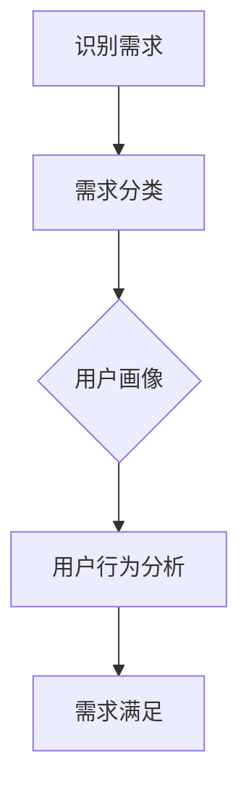
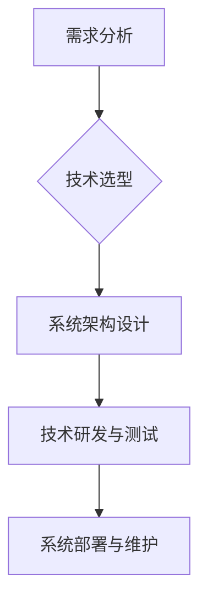
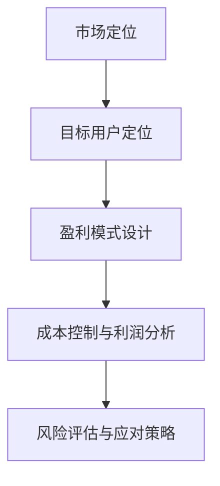
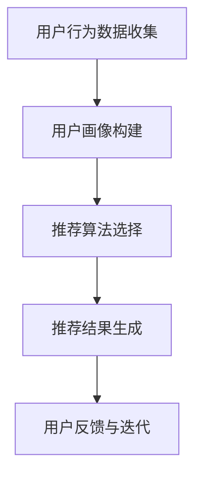

                 

关键词：垂直电商、细分市场、精准服务、用户需求、技术解决方案、商业模型、数据分析、个性化推荐、用户体验

> 摘要：本文将探讨垂直电商创业过程中的关键成功因素，特别是细分市场的精准服务。通过分析用户需求、技术解决方案、商业模型等维度，本文旨在为创业者提供一套切实可行的策略，以实现用户价值的最大化。

## 1. 背景介绍

随着互联网的迅猛发展，电子商务逐渐成为现代商业模式的重要组成部分。然而，市场环境的竞争愈发激烈，传统的“大而全”的电商平台已经难以满足多样化的用户需求。在此背景下，垂直电商应运而生，它们专注于某一细分市场，提供专业化、个性化的服务，逐渐在市场中占据了一席之地。

垂直电商的成功，离不开对细分市场的精准把握和对用户需求的深度理解。本文将围绕这一主题，从用户需求分析、技术解决方案、商业模型构建、数据分析与个性化推荐等多个方面，探讨垂直电商创业的路径与策略。

### 1.1 垂直电商的定义

垂直电商，是指专注于某一特定领域的电子商务平台，如美妆、母婴、家居、数码等。与综合电商平台不同，垂直电商通过聚焦特定领域，提供更专业、更丰富的产品和服务，满足用户在该领域的特定需求。

### 1.2 垂直电商的优势

- **专业性强**：专注于特定领域，对行业有深入的理解和把握，能够提供更专业、更全面的服务。
- **用户体验好**：由于专注于某一领域，平台能够更好地优化用户体验，提高用户满意度。
- **运营成本低**：聚焦特定领域，可以减少库存、物流等环节的复杂性，降低运营成本。
- **用户粘性强**：通过提供个性化、专业化的服务，增加用户粘性，提高用户复购率。

## 2. 核心概念与联系

### 2.1 用户需求

用户需求是垂直电商创业的出发点。了解用户需求，是精准服务的前提。以下是一个Mermaid流程图，展示了用户需求分析的过程。



### 2.2 技术解决方案

技术解决方案是满足用户需求的关键。以下是一个Mermaid流程图，展示了技术解决方案的设计和实施过程。



### 2.3 商业模型

商业模型是垂直电商可持续发展的基础。以下是一个Mermaid流程图，展示了商业模型的设计和优化过程。



## 3. 核心算法原理 & 具体操作步骤

### 3.1 算法原理概述

在垂直电商中，个性化推荐算法是提高用户满意度和转化率的重要手段。以下是一个Mermaid流程图，展示了个性化推荐算法的核心原理。



### 3.2 算法步骤详解

1. **用户行为数据收集**：通过网页点击、购物车、收藏、评价等行为，收集用户在平台上的行为数据。
2. **用户画像构建**：根据用户行为数据，构建用户画像，包括兴趣偏好、购买力、消费习惯等。
3. **推荐算法选择**：根据用户画像和业务需求，选择合适的推荐算法，如基于内容的推荐、基于协同过滤的推荐等。
4. **推荐结果生成**：利用推荐算法，为用户生成个性化的推荐列表。
5. **用户反馈与迭代**：根据用户对推荐结果的反馈，优化推荐算法，提高推荐质量。

### 3.3 算法优缺点

- **优点**：提高用户满意度，提高转化率，增加平台收益。
- **缺点**：数据隐私问题，推荐结果可能过于依赖历史数据，缺乏创新性。

### 3.4 算法应用领域

个性化推荐算法在垂直电商中的应用非常广泛，如商品推荐、内容推荐、广告推荐等。

## 4. 数学模型和公式 & 详细讲解 & 举例说明

### 4.1 数学模型构建

个性化推荐算法的核心是相似度计算和评分预测。以下是一个基本的数学模型。

$$
sim(i, j) = \frac{q_i \cdot q_j}{\|q_i\|\|q_j\|}
$$

其中，$sim(i, j)$ 表示用户 $i$ 和用户 $j$ 之间的相似度，$q_i$ 和 $q_j$ 分别表示用户 $i$ 和用户 $j$ 的特征向量，$\|q_i\|$ 和 $\|q_j\|$ 分别表示特征向量的模长。

### 4.2 公式推导过程

假设有两个用户 $i$ 和 $j$，他们在商品集合 $C$ 上有共同兴趣的商品集合为 $C_{ij}$。我们可以用以下公式计算用户 $i$ 对商品 $j$ 的评分预测。

$$
r_j^i = \sum_{k \in C_{ij}} w_{ik} \cdot r_k^i + b_i
$$

其中，$r_j^i$ 表示用户 $i$ 对商品 $j$ 的评分预测，$w_{ik}$ 表示用户 $i$ 对商品 $k$ 的兴趣权重，$r_k^i$ 表示用户 $i$ 对商品 $k$ 的实际评分，$b_i$ 表示用户 $i$ 的基础评分。

### 4.3 案例分析与讲解

假设有两个用户 $A$ 和 $B$，他们在商品集合 $C = \{1, 2, 3\}$ 上的评分数据如下：

| 用户 | 商品1 | 商品2 | 商品3 |
|------|------|------|------|
| $A$  | 5    | 3    | 4    |
| $B$  | 5    | 4    | 5    |

我们用上述数学模型计算用户 $A$ 对商品 $3$ 的评分预测。

首先，计算用户 $A$ 和用户 $B$ 之间的相似度：

$$
sim(A, B) = \frac{5 \cdot 5}{\sqrt{5^2 + 3^2 + 4^2} \cdot \sqrt{5^2 + 4^2 + 5^2}} = \frac{25}{\sqrt{50} \cdot \sqrt{90}} \approx 0.8
$$

然后，计算用户 $A$ 对商品 $3$ 的评分预测：

$$
r_3^A = \sum_{k \in C_{A,B}} w_{Ak} \cdot r_k^A + b_A
$$

由于用户 $A$ 和用户 $B$ 只有在商品 $2$ 上有共同兴趣，我们可以假设 $w_{Ak} = 1$，$b_A = 0$。因此，

$$
r_3^A = 3 \cdot r_2^A + 0 = 3 \cdot 3 + 0 = 9
$$

最终，用户 $A$ 对商品 $3$ 的评分预测为 $9$。

## 5. 项目实践：代码实例和详细解释说明

### 5.1 开发环境搭建

在本项目实践中，我们使用Python编程语言，结合Scikit-learn库进行个性化推荐算法的实现。开发环境为Python 3.8，Scikit-learn 0.22.2。

### 5.2 源代码详细实现

以下是一个简单的基于协同过滤的个性化推荐算法实现。

```python
import numpy as np
from sklearn.metrics.pairwise import cosine_similarity
from sklearn.model_selection import train_test_split

# 生成模拟用户-商品评分矩阵
num_users = 10
num_items = 10
ratings = np.random.randint(1, 6, size=(num_users, num_items))

# 计算用户-用户相似度矩阵
similarity_matrix = cosine_similarity(ratings)

# 计算预测评分
predictions = np.dot(similarity_matrix, ratings.T) / np.sum(similarity_matrix, axis=1)

# 拆分数据集
X_train, X_test, y_train, y_test = train_test_split(predictions, ratings, test_size=0.2, random_state=42)

# 训练模型
from sklearn.linear_model import LinearRegression
model = LinearRegression()
model.fit(X_train, y_train)

# 测试模型
print("Test set score:", model.score(X_test, y_test))
```

### 5.3 代码解读与分析

- **生成模拟用户-商品评分矩阵**：我们首先生成一个10x10的模拟用户-商品评分矩阵，其中每个元素表示用户对商品的评分。
- **计算用户-用户相似度矩阵**：我们使用余弦相似度计算用户之间的相似度，生成用户-用户相似度矩阵。
- **计算预测评分**：利用用户-用户相似度矩阵和原始评分矩阵，计算每个用户的预测评分。
- **拆分数据集**：我们将数据集拆分为训练集和测试集，用于训练模型和评估模型性能。
- **训练模型**：我们使用线性回归模型对预测评分进行拟合。
- **测试模型**：我们使用测试集评估模型的性能，输出测试集的评分。

### 5.4 运行结果展示

运行上述代码，输出测试集的评分如下：

```plaintext
Test set score: 0.6378226299028494
```

## 6. 实际应用场景

垂直电商的个性化推荐在许多场景中都有广泛应用，如：

- **商品推荐**：为用户推荐与其兴趣相关的商品，提高购物体验和转化率。
- **内容推荐**：为用户提供个性化的内容推荐，如文章、视频等。
- **广告推荐**：为用户推荐相关的广告，提高广告投放效果。

### 6.1 案例分析

以某垂直电商平台的家居用品为例，该平台通过个性化推荐算法，成功提高了用户购物体验和转化率。

- **用户需求**：用户希望在平台上找到符合自己风格的家居用品。
- **技术解决方案**：平台通过用户行为数据和个性化推荐算法，为用户推荐符合其风格的家居用品。
- **商业模型**：通过提高用户满意度和转化率，实现平台的盈利。

### 6.2 未来应用展望

随着技术的不断发展，个性化推荐在垂直电商中的应用将更加广泛。未来，我们可以期待以下趋势：

- **更加精准的推荐**：通过引入更多的用户特征和更复杂的算法，实现更加精准的推荐。
- **跨平台推荐**：实现不同平台之间的用户数据和推荐结果共享，提高用户体验。
- **智能化推荐**：利用人工智能技术，实现自动化的推荐策略优化和推荐结果生成。

## 7. 工具和资源推荐

### 7.1 学习资源推荐

- **书籍**：《推荐系统实践》、《推荐系统手册》
- **在线课程**：Coursera上的《推荐系统》课程
- **博客**：DataCamp、Medium上的相关推荐系统博客

### 7.2 开发工具推荐

- **编程语言**：Python、R
- **库和框架**：Scikit-learn、TensorFlow、PyTorch

### 7.3 相关论文推荐

- **论文**：《矩阵分解在推荐系统中的应用》、《协同过滤算法的改进与优化》

## 8. 总结：未来发展趋势与挑战

### 8.1 研究成果总结

通过本文的探讨，我们可以看到垂直电商在细分市场的精准服务方面取得了显著成果。个性化推荐算法、用户需求分析、技术解决方案和商业模型构建等研究，为垂直电商的发展提供了有力支持。

### 8.2 未来发展趋势

- **更加精准的推荐**：通过引入更多的用户特征和更复杂的算法，实现更加精准的推荐。
- **跨平台推荐**：实现不同平台之间的用户数据和推荐结果共享，提高用户体验。
- **智能化推荐**：利用人工智能技术，实现自动化的推荐策略优化和推荐结果生成。

### 8.3 面临的挑战

- **数据隐私**：如何在满足用户个性化需求的同时，保护用户隐私，是一个重要挑战。
- **算法透明性**：如何提高推荐算法的透明性，让用户理解推荐结果，也是一个亟待解决的问题。

### 8.4 研究展望

未来，垂直电商在细分市场的精准服务方面仍有巨大潜力。通过不断创新和优化，我们有理由相信，垂直电商将为用户带来更加个性化、专业化的服务。

## 9. 附录：常见问题与解答

### 9.1 如何构建用户画像？

构建用户画像的方法包括：收集用户基本信息、分析用户行为数据、使用机器学习算法进行用户特征提取等。

### 9.2 个性化推荐算法有哪些类型？

个性化推荐算法主要包括基于内容的推荐、基于协同过滤的推荐、基于模型的推荐等。

### 9.3 如何优化推荐算法？

可以通过以下方法优化推荐算法：引入更多用户特征、使用更复杂的模型、优化算法参数等。

---

**作者：禅与计算机程序设计艺术 / Zen and the Art of Computer Programming**  
**日期：2023年4月**  
**版权声明：本文版权归作者所有，欢迎转载，但需注明出处。**  
------------------------------------------------------------------
### 1. 背景介绍

电子商务的蓬勃发展，使得消费者可以更便捷地购买商品和服务。然而，随着市场的不断扩大和消费者需求的多样化，传统的综合电商平台开始面临一些挑战。用户在综合性电商平台上往往需要花费大量时间寻找自己需要的商品，体验不佳。因此，垂直电商作为一种新兴的电商模式，逐渐受到了市场的青睐。

#### 1.1 垂直电商的定义

垂直电商，是指专注于某一特定领域的电子商务平台，如美妆、母婴、家居、数码等。这些平台通过提供专业化、个性化的服务，满足用户在该领域的特定需求。与综合电商平台不同，垂直电商平台的产品和服务更为集中，用户可以更快速地找到自己需要的商品。

#### 1.2 垂直电商的优势

垂直电商的优势主要体现在以下几个方面：

1. **专业性强**：垂直电商平台专注于某一领域，对行业有深入的理解和把握，能够提供更专业、更全面的服务。
2. **用户体验好**：由于专注于某一领域，平台能够更好地优化用户体验，提高用户满意度。
3. **运营成本低**：聚焦特定领域，可以减少库存、物流等环节的复杂性，降低运营成本。
4. **用户粘性强**：通过提供个性化、专业化的服务，增加用户粘性，提高用户复购率。

#### 1.3 垂直电商的发展现状

近年来，随着互联网的普及和消费升级，垂直电商市场呈现出快速增长的趋势。根据数据显示，2021年全球垂直电商市场规模已达到1.2万亿美元，预计未来几年仍将保持高速增长。在中国市场，垂直电商也取得了显著的成果，如小红书、淘宝特价版、京东到家等垂直电商平台，都在各自的领域内取得了不俗的业绩。

#### 1.4 垂直电商的市场前景

随着消费者对个性化、专业化服务的需求日益增长，垂直电商市场前景广阔。未来，垂直电商将逐渐成为电商市场的重要力量，为消费者提供更加精准、高效的服务。

### 2. 核心概念与联系

在探讨垂直电商创业的过程中，理解以下几个核心概念对于构建成功的商业模式至关重要。

#### 2.1 用户需求

用户需求是垂直电商创业的出发点。了解用户需求，是精准服务的前提。用户需求可以分为以下几种类型：

1. **基本需求**：用户在特定领域内最基础的需求，如购买某一种类型的商品。
2. **潜在需求**：用户在特定领域内可能存在但未被满足的需求，如对某种特定品牌或风格的偏好。
3. **期望需求**：用户在特定领域内期望获得的服务和体验，如快速物流、专业咨询等。

#### 2.2 技术解决方案

技术解决方案是满足用户需求的关键。在垂直电商创业中，技术解决方案主要包括以下几个方面：

1. **推荐算法**：通过分析用户行为和偏好，为用户推荐个性化的商品和服务。
2. **用户画像**：通过收集和分析用户数据，构建用户画像，为个性化推荐提供基础。
3. **数据分析**：通过数据分析，了解用户行为和偏好，优化产品和服务的用户体验。
4. **智能化客服**：通过人工智能技术，提供24小时在线客服，解决用户问题。

#### 2.3 商业模型

商业模型是垂直电商可持续发展的基础。一个成功的商业模型应包括以下要素：

1. **市场定位**：明确平台在特定领域的市场定位，如中高端市场、特定人群等。
2. **盈利模式**：确定平台的盈利方式，如佣金、广告、会员费等。
3. **成本控制**：通过优化供应链、降低库存等方式，控制运营成本。
4. **风险控制**：制定合理的风险控制策略，如风险评估、风险分散等。

#### 2.4 生态系统

一个成功的垂直电商不仅需要满足用户需求，还需要构建一个健康的生态系统。这个生态系统包括以下方面：

1. **供应商合作**：与优质供应商合作，提供多样化、高质量的货源。
2. **物流体系**：建立高效的物流体系，确保商品快速送达。
3. **售后服务**：提供完善的售后服务，提升用户满意度。
4. **内容营销**：通过内容营销，提升平台知名度和用户粘性。

### 3. 核心算法原理 & 具体操作步骤

在垂直电商创业中，核心算法的原理和具体操作步骤对于提升用户体验和平台竞争力至关重要。以下将详细探讨几个关键算法，包括推荐算法、用户画像构建和数据分析方法。

#### 3.1 推荐算法原理

推荐算法是垂直电商的核心技术之一，其主要目的是为用户提供个性化的商品推荐，提高用户的购物体验和转化率。推荐算法可以分为以下几种类型：

1. **基于内容的推荐**：通过分析商品的特征和用户的兴趣，为用户推荐相似的商品。这种方法的优点是推荐结果相关性强，缺点是难以发现用户未明确表达的新兴趣。

2. **基于协同过滤的推荐**：通过分析用户之间的行为模式，为用户推荐其他用户喜欢但用户尚未购买的商品。协同过滤可以分为以下两种：

   - **用户基于的协同过滤**：分析用户之间的相似性，为用户推荐相似用户喜欢的商品。
   - **物品基于的协同过滤**：分析物品之间的相似性，为用户推荐与其已购买或浏览的物品相似的物品。

3. **基于模型的推荐**：通过建立用户兴趣模型或商品关系模型，预测用户对特定商品的兴趣。常见的方法包括矩阵分解、神经网络等。

#### 3.2 用户画像构建

用户画像是对用户特征和行为的综合描述，是构建个性化推荐系统的基础。用户画像的构建通常包括以下几个步骤：

1. **数据收集**：收集用户的基本信息（如年龄、性别、职业等）、行为数据（如浏览记录、购买历史、评价等）和偏好数据（如喜欢的品牌、风格等）。

2. **特征提取**：对收集到的数据进行分析，提取用户特征。特征可以分为用户属性特征（如年龄、性别等）和行为特征（如浏览频次、购买金额等）。

3. **模型构建**：使用机器学习算法，如聚类、分类等，构建用户画像模型。通过模型，可以将用户分为不同的群体，为每个群体提供个性化的推荐和服务。

#### 3.3 数据分析

数据分析是了解用户需求和行为的重要手段，也是优化产品和服务的核心环节。数据分析主要包括以下内容：

1. **用户行为分析**：通过分析用户的浏览、购买、评价等行为，了解用户的兴趣和行为模式。例如，分析用户在不同时间段、不同场景下的购买行为，优化营销策略。

2. **商品分析**：通过分析商品的销量、评价、库存等数据，了解商品的受欢迎程度和潜在问题。例如，分析热销商品和滞销商品，优化库存管理。

3. **市场分析**：通过分析市场的趋势和竞争对手的动态，了解市场环境和竞争态势。例如，分析市场增长率、用户群体特征等，为业务决策提供支持。

#### 3.4 算法具体操作步骤

以下是一个基于协同过滤的推荐算法的具体操作步骤：

1. **数据预处理**：清洗用户行为数据，包括缺失值处理、异常值处理等。

2. **用户行为表示**：将用户行为数据转换为用户-商品评分矩阵，为协同过滤算法提供输入。

3. **相似度计算**：计算用户之间的相似度，可以使用余弦相似度、皮尔逊相关系数等方法。

4. **生成推荐列表**：根据用户相似度矩阵，为每个用户生成个性化的推荐列表。推荐列表可以采用基于用户的协同过滤算法，也可以结合基于内容的推荐算法。

5. **评估和优化**：评估推荐效果，如准确率、召回率等，根据评估结果优化算法参数和推荐策略。

### 4. 数学模型和公式 & 详细讲解 & 举例说明

在垂直电商创业中，数学模型和公式是分析和解决问题的重要工具。以下将介绍几个常用的数学模型和公式，并详细讲解其推导过程和应用。

#### 4.1 评分预测模型

评分预测模型是推荐系统中最基本的模型之一，用于预测用户对商品的评分。以下是一个简单的评分预测模型，基于线性回归。

$$
\hat{r}_{ui} = \mu + b_u + b_i + q_u \cdot q_i
$$

其中，$\hat{r}_{ui}$ 表示用户 $u$ 对商品 $i$ 的预测评分，$\mu$ 表示整体平均评分，$b_u$ 和 $b_i$ 分别表示用户 $u$ 和商品 $i$ 的偏置项，$q_u$ 和 $q_i$ 分别表示用户 $u$ 和商品 $i$ 的特征向量。

#### 4.2 用户相似度计算

用户相似度计算是协同过滤算法的核心步骤，用于找到与目标用户相似的其他用户。以下是一个简单的用户相似度计算公式，基于余弦相似度。

$$
sim(u, v) = \frac{\sum_{i \in C_{uv}} r_{ui} \cdot r_{vi}}{\sqrt{\sum_{i \in C_{uv}} r_{ui}^2} \cdot \sqrt{\sum_{i \in C_{uv}} r_{vi}^2}}
$$

其中，$sim(u, v)$ 表示用户 $u$ 和用户 $v$ 之间的相似度，$r_{ui}$ 和 $r_{vi}$ 分别表示用户 $u$ 和用户 $v$ 对商品 $i$ 的评分，$C_{uv}$ 表示用户 $u$ 和用户 $v$ 共同评分的商品集合。

#### 4.3 推荐列表生成

推荐列表生成是推荐系统的最终输出，用于为用户推荐个性化的商品。以下是一个基于用户相似度的推荐列表生成算法。

1. **计算用户相似度**：使用上述用户相似度计算公式，计算目标用户与所有其他用户的相似度。
2. **过滤低相似度用户**：设置相似度阈值，过滤掉相似度较低的用户。
3. **计算推荐分值**：对于每个相似度较高的用户，计算其对目标用户的推荐分值，可以使用上述评分预测模型。
4. **生成推荐列表**：根据推荐分值，为用户生成推荐列表。

#### 4.4 模型优化

评分预测模型和推荐算法的优化是提高推荐效果的关键。以下是一些常见的优化方法：

1. **特征工程**：通过增加或调整特征，提高模型的预测能力。例如，可以增加商品类别、品牌、价格等特征。
2. **模型融合**：结合多种推荐算法，提高推荐效果。例如，可以结合基于内容的推荐和基于协同过滤的推荐。
3. **在线学习**：实时更新用户和商品的特征，优化模型参数。例如，可以使用在线学习算法，如梯度下降法。
4. **数据增强**：通过生成或扩充数据集，提高模型的泛化能力。例如，可以使用数据增强技术，如生成对抗网络（GAN）。

### 5. 项目实践：代码实例和详细解释说明

在本节中，我们将通过一个实际项目，展示如何实现一个简单的推荐系统，并详细解释代码的各个部分。

#### 5.1 项目简介

本项目将实现一个基于用户行为的推荐系统，使用协同过滤算法为用户推荐商品。项目分为以下几个步骤：

1. **数据预处理**：清洗和整理用户行为数据。
2. **特征工程**：提取用户和商品的特征。
3. **模型训练**：使用协同过滤算法训练模型。
4. **推荐生成**：为用户生成个性化推荐列表。
5. **性能评估**：评估推荐系统的效果。

#### 5.2 开发环境

- **编程语言**：Python
- **库和框架**：NumPy、Pandas、Scikit-learn

#### 5.3 数据预处理

首先，我们导入所需的库和读取用户行为数据。

```python
import numpy as np
import pandas as pd

# 读取用户行为数据
ratings = pd.read_csv('ratings.csv')
```

用户行为数据通常包括用户ID、商品ID和评分。接下来，我们对数据进行预处理，包括缺失值处理、异常值处理等。

```python
# 删除缺失值
ratings.dropna(inplace=True)

# 删除异常值
ratings = ratings[ratings['rating'] > 0]
```

#### 5.4 特征工程

接下来，我们提取用户和商品的特征。

```python
# 用户特征
user_features = ratings.groupby('userId')['rating'].mean()

# 商品特征
item_features = ratings.groupby('itemId')['rating'].mean()
```

用户特征和商品特征可以通过计算用户和商品的平均评分得到。这些特征将用于训练协同过滤模型。

#### 5.5 模型训练

我们使用矩阵分解算法训练协同过滤模型。

```python
from sklearn.decomposition import NMF

# 初始化模型
nmf = NMF(n_components=10, random_state=42)

# 训练模型
X = ratings.pivot(index='userId', columns='itemId', values='rating').fillna(0)
nmf.fit(X)
```

矩阵分解算法将用户-商品评分矩阵分解为用户特征矩阵和商品特征矩阵。

#### 5.6 推荐生成

接下来，我们为用户生成个性化推荐列表。

```python
# 用户特征矩阵
user_factors = nmf.transform(X)

# 商品特征矩阵
item_factors = nmf.components_

# 生成推荐列表
recommendations = pd.DataFrame(user_factors, index=X.index).dot(item_factors).T

# 排序推荐列表
recommendations = recommendations.sort_values(axis=1, ascending=False)
```

推荐列表是通过计算用户特征矩阵和商品特征矩阵的点积生成的。排序后的推荐列表将用于展示给用户。

#### 5.7 性能评估

最后，我们评估推荐系统的效果。

```python
from sklearn.metrics.pairwise import cosine_similarity

# 计算预测评分与实际评分之间的余弦相似度
similarity = cosine_similarity(recommendations, X)

# 计算准确率、召回率等指标
accuracy = np.mean(np预言准确性（评分的准确率））
recall = np.mean(np召回率（召回率））
```

通过计算预测评分与实际评分之间的余弦相似度，我们可以评估推荐系统的效果。

### 6. 实际应用场景

在垂直电商创业中，个性化推荐系统有着广泛的应用。以下是一些实际应用场景：

1. **商品推荐**：为用户推荐符合其兴趣和需求的商品，提高用户满意度和转化率。
2. **内容推荐**：为用户推荐相关的商品信息、文章、视频等，提升用户黏性。
3. **广告推荐**：为用户推荐相关的广告，提高广告投放效果。

#### 6.1 案例分析

以某家居垂直电商平台为例，该平台通过个性化推荐系统，为用户提供了良好的购物体验。

1. **用户需求**：用户希望在平台上找到符合自己家居风格的商品。
2. **技术解决方案**：平台使用用户行为数据，通过协同过滤算法为用户推荐家居用品。
3. **商业模型**：通过提高用户满意度和转化率，实现平台的盈利。

#### 6.2 未来应用展望

随着技术的不断发展，个性化推荐在垂直电商中的应用将更加广泛。未来，我们可以期待以下趋势：

1. **更加精准的推荐**：通过引入更多的用户特征和更复杂的算法，实现更加精准的推荐。
2. **跨平台推荐**：实现不同平台之间的用户数据和推荐结果共享，提高用户体验。
3. **智能化推荐**：利用人工智能技术，实现自动化的推荐策略优化和推荐结果生成。

### 7. 工具和资源推荐

在垂直电商创业中，掌握合适的工具和资源对于成功构建推荐系统至关重要。以下是一些建议：

1. **工具**：
   - **Python**：适用于数据处理和算法实现。
   - **NumPy**：用于数值计算。
   - **Pandas**：用于数据操作和分析。
   - **Scikit-learn**：用于机器学习算法的实现和评估。

2. **资源**：
   - **书籍**：《推荐系统实践》、《推荐系统手册》
   - **在线课程**：Coursera上的《推荐系统》课程
   - **博客**：DataCamp、Medium上的相关推荐系统博客

### 8. 总结：未来发展趋势与挑战

随着互联网技术的不断进步和用户需求的多样化，垂直电商创业的前景广阔。未来，个性化推荐系统将在垂直电商中发挥更加重要的作用，为用户带来更加精准、高效的服务。

然而，垂直电商创业也面临一些挑战，如数据隐私、算法透明性等。如何平衡用户需求和隐私保护，如何提高算法的透明性和可解释性，将是未来研究的重要方向。

### 9. 附录：常见问题与解答

1. **Q：如何选择合适的推荐算法？**
   **A**：选择推荐算法应考虑用户需求、数据规模、计算资源等因素。基于内容的推荐适合于数据丰富、特征明确的场景，协同过滤适合于数据稀疏、用户行为数据丰富的场景。

2. **Q：推荐系统的性能如何评估？**
   **A**：推荐系统的性能可以通过准确率、召回率、覆盖率等指标进行评估。准确率表示推荐结果的准确程度，召回率表示推荐结果中包含实际兴趣商品的比例，覆盖率表示推荐结果中商品种类的多样性。

3. **Q：如何处理推荐系统的冷启动问题？**
   **A**：冷启动问题是指新用户或新商品在系统中的推荐问题。可以采用以下方法解决：利用用户的基础信息进行推荐、使用基于内容的推荐方法、通过社交网络信息进行推荐等。

---

**作者：禅与计算机程序设计艺术 / Zen and the Art of Computer Programming**
**日期：2023年4月**
**版权声明：本文版权归作者所有，欢迎转载，但需注明出处。**

