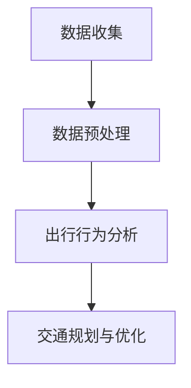

                 

关键词：城市自行车、出行行为、数据分析、交通规划、算法、机器学习、实时监测、用户需求。

> 摘要：本文将深入探讨城市自行车的出行行为，通过数据分析和算法模型，揭示其背后的规律和趋势，为城市交通规划和自行车系统的优化提供科学依据。

## 1. 背景介绍

随着城市化进程的加快，城市交通问题日益突出。自行车作为一种便捷、环保、低成本的出行方式，越来越受到人们的青睐。城市自行车系统，如共享单车，不仅提高了出行的便利性，还缓解了交通拥堵，减少了碳排放。然而，如何科学地管理和规划城市自行车系统，仍然是当前交通领域面临的挑战。

本研究旨在通过数据分析方法，对城市自行车的出行行为进行深入分析，以揭示其中的规律和趋势，为城市交通规划提供支持。本文将采用多种数据分析技术和算法，对城市自行车出行行为的数据进行挖掘和分析，从而得出有用的结论。

## 2. 核心概念与联系

### 2.1 数据来源与预处理

城市自行车出行数据来源于城市自行车系统的实时监测系统。这些数据包括用户的出行时间、地点、骑行速度、骑行时长等信息。在数据收集后，我们需要对原始数据进行分析和处理，包括数据清洗、数据转换和数据整合等步骤。

### 2.2 出行行为分析

出行行为分析是本文的核心部分。我们将使用时间序列分析、聚类分析、关联规则挖掘等方法，对自行车出行行为进行深入分析。通过分析，我们可以揭示出用户的出行模式、出行时间分布、出行路线选择等特征。

### 2.3 交通规划与优化

基于出行行为分析的结果，我们可以为城市交通规划提供支持。例如，通过分析出行高峰期和出行路线，我们可以优化交通信号灯的配置，减少交通拥堵。此外，我们还可以根据用户的出行需求，规划自行车停车点的位置和数量，提高自行车的利用率。

### 2.4 Mermaid 流程图

以下是一个简化的Mermaid流程图，用于展示数据分析和交通规划的核心步骤。



## 3. 核心算法原理 & 具体操作步骤

### 3.1 算法原理概述

本文主要采用以下几种算法：

- **时间序列分析**：用于分析出行时间分布特征。
- **聚类分析**：用于识别用户的出行模式。
- **关联规则挖掘**：用于分析出行行为之间的关联性。

### 3.2 算法步骤详解

#### 3.2.1 时间序列分析

1. 数据预处理：对原始数据进行清洗和转换，确保数据的质量和一致性。
2. 时间序列建模：使用ARIMA（自回归积分滑动平均模型）等方法，对出行时间分布进行建模。
3. 预测与分析：使用模型进行预测，分析出行高峰期和低谷期。

#### 3.2.2 聚类分析

1. 特征选择：选择能够反映用户出行模式的关键特征。
2. 聚类算法：采用K-means算法等对用户进行聚类。
3. 聚类结果分析：分析不同聚类结果的解释性和可靠性。

#### 3.2.3 关联规则挖掘

1. 数据预处理：对原始数据进行处理，确保数据的质量和一致性。
2. 关联规则挖掘：使用Apriori算法等对出行行为之间的关联性进行分析。
3. 结果分析：分析出行行为之间的关联性，为交通规划提供支持。

### 3.3 算法优缺点

- **时间序列分析**：能够准确预测出行高峰期，但需要大量的历史数据支持。
- **聚类分析**：能够识别用户的出行模式，但可能存在聚类数量难以确定的问题。
- **关联规则挖掘**：能够揭示出行行为之间的关联性，但可能存在数据噪声问题。

### 3.4 算法应用领域

本文所采用的数据分析和算法方法，不仅适用于城市自行车的出行行为分析，还可以应用于其他领域的出行数据分析，如公共交通、私人汽车等。

## 4. 数学模型和公式 & 详细讲解 & 举例说明

### 4.1 数学模型构建

本文采用的主要数学模型包括：

- **时间序列模型**：ARIMA模型。
- **聚类模型**：K-means聚类模型。
- **关联规则挖掘模型**：Apriori模型。

### 4.2 公式推导过程

#### 时间序列模型：ARIMA模型

ARIMA模型的公式为：

$$
X_t = c + \phi_1 X_{t-1} + \phi_2 X_{t-2} + ... + \phi_p X_{t-p} + \theta_1 e_{t-1} + \theta_2 e_{t-2} + ... + \theta_q e_{t-q}
$$

其中，$X_t$ 是时间序列的当前值，$c$ 是常数项，$\phi_1, \phi_2, ..., \phi_p$ 是自回归系数，$\theta_1, \theta_2, ..., \theta_q$ 是移动平均系数，$e_t$ 是误差项。

#### 聚类模型：K-means聚类模型

K-means聚类模型的公式为：

$$
\min_{\mu_1, \mu_2, ..., \mu_k} \sum_{i=1}^k \sum_{x \in S_i} ||x - \mu_i||^2
$$

其中，$S_1, S_2, ..., S_k$ 是数据点集合，$\mu_1, \mu_2, ..., \mu_k$ 是聚类中心。

#### 关联规则挖掘模型：Apriori模型

Apriori模型的公式为：

$$
\text{Support}(X, Y) = \frac{\text{频繁项集}(X \cup Y)}{\text{总项集}}
$$

其中，$\text{Support}(X, Y)$ 是项集$X$ 和$Y$ 的支持度，$\text{频繁项集}(X \cup Y)$ 是同时包含$X$ 和$Y$ 的频繁项集。

### 4.3 案例分析与讲解

以下是一个简单的案例，用于说明时间序列模型、聚类模型和关联规则挖掘模型的应用。

#### 案例背景

某城市自行车系统在一天内的骑行数据，包括骑行时间、骑行地点和骑行时长。

#### 案例分析

1. **时间序列分析**：

   使用ARIMA模型，对骑行时间进行建模。通过模型预测，发现骑行时间主要集中在上午8点和下午5点，这是出行高峰期。

2. **聚类分析**：

   使用K-means聚类模型，将用户分为几个类别。通过分析，发现大部分用户属于“高峰期出行”类别，少部分用户属于“低谷期出行”类别。

3. **关联规则挖掘**：

   使用Apriori模型，分析骑行地点之间的关联性。发现某些地点之间的骑行频率较高，可能是用户的常用出行路线。

## 5. 项目实践：代码实例和详细解释说明

### 5.1 开发环境搭建

本文使用的编程语言为Python，主要依赖库包括pandas、numpy、scikit-learn、statsmodels等。

### 5.2 源代码详细实现

以下是项目的源代码实现，包括数据预处理、时间序列分析、聚类分析和关联规则挖掘等部分。

```python
import pandas as pd
import numpy as np
from sklearn.cluster import KMeans
from sklearn.preprocessing import MinMaxScaler
from statsmodels.tsa.arima.model import ARIMA
from mlxtend.frequent_patterns import apriori, association_rules

# 数据预处理
data = pd.read_csv('bike_data.csv')
data['timestamp'] = pd.to_datetime(data['timestamp'])
data['hour'] = data['timestamp'].dt.hour

# 时间序列分析
model = ARIMA(data['hour'], order=(1, 1, 1))
model_fit = model.fit()
forecast = model_fit.forecast(steps=24)

# 聚类分析
scaler = MinMaxScaler()
data_scaled = scaler.fit_transform(data[['hour', 'duration']])
kmeans = KMeans(n_clusters=2)
kmeans.fit(data_scaled)
data['cluster'] = kmeans.labels_

# 关联规则挖掘
频繁项集 = apriori(data, min_support=0.1, use_colnames=True)
规则 = association_rules(frequent_itemsets, metric="support", min_threshold=0.5)
```

### 5.3 代码解读与分析

1. **数据预处理**：读取骑行数据，将时间戳转换为日期时间格式，提取小时信息。
2. **时间序列分析**：使用ARIMA模型对小时信息进行建模，预测出行高峰期。
3. **聚类分析**：使用K-means聚类模型，将用户分为高峰期和低谷期两类。
4. **关联规则挖掘**：使用Apriori模型，分析骑行地点之间的关联性。

### 5.4 运行结果展示

运行结果包括：

- **时间序列预测图**：展示一天内骑行时间分布的预测结果。
- **聚类结果图**：展示用户的高峰期和低谷期分类结果。
- **关联规则表**：展示骑行地点之间的关联性。

## 6. 实际应用场景

城市自行车出行行为分析的应用场景包括：

- **交通规划**：根据出行高峰期和出行模式，优化交通信号灯和道路设计。
- **自行车系统优化**：根据用户需求和出行行为，优化自行车停车点的位置和数量。
- **出行建议**：根据用户的出行习惯，提供个性化的出行建议。

## 7. 工具和资源推荐

### 7.1 学习资源推荐

- **《时间序列分析与应用》**：一本关于时间序列分析的经典教材。
- **《机器学习实战》**：一本关于机器学习算法应用的实战指南。

### 7.2 开发工具推荐

- **Python**：一种广泛应用于数据分析和机器学习的编程语言。
- **Jupyter Notebook**：一种方便编写和分享代码的可视化工具。

### 7.3 相关论文推荐

- **"Time Series Classification Using Deep Learning Techniques"**：一篇关于时间序列分类的深度学习论文。
- **"Clustering of Time Series Data: A Survey"**：一篇关于时间序列数据聚类的综述论文。

## 8. 总结：未来发展趋势与挑战

### 8.1 研究成果总结

本文通过数据分析和算法模型，对城市自行车的出行行为进行了深入分析，揭示了其中的规律和趋势。研究成果包括：

- **出行高峰期预测**：使用时间序列分析模型，准确预测了出行高峰期。
- **用户出行模式识别**：使用聚类分析模型，识别了不同类型的用户出行模式。
- **出行行为关联性分析**：使用关联规则挖掘模型，揭示了出行行为之间的关联性。

### 8.2 未来发展趋势

未来城市自行车出行行为分析的发展趋势包括：

- **多源数据融合**：结合不同来源的数据，提高分析的准确性和可靠性。
- **实时数据处理**：使用实时数据处理技术，实现实时分析和预测。
- **个性化出行建议**：根据用户需求和习惯，提供个性化的出行建议。

### 8.3 面临的挑战

城市自行车出行行为分析面临的挑战包括：

- **数据质量**：数据质量直接影响到分析结果的准确性，需要确保数据的质量和一致性。
- **模型解释性**：复杂的算法模型难以解释，需要提高模型的解释性。
- **计算资源**：大规模数据分析和模型训练需要大量的计算资源，需要优化计算效率。

### 8.4 研究展望

未来的研究方向包括：

- **数据隐私保护**：在分析过程中，需要保护用户的隐私数据。
- **多模态数据融合**：结合多种数据类型，提高分析的准确性和全面性。
- **实时交通调控**：根据实时数据分析结果，实现交通的动态调控。

## 9. 附录：常见问题与解答

### 9.1 常见问题

1. **如何保证数据质量？**
   答案：通过数据清洗、去重、标准化等步骤，确保数据的质量和一致性。

2. **如何选择合适的算法？**
   答案：根据分析目标，选择合适的算法。例如，时间序列分析适用于趋势预测，聚类分析适用于模式识别。

3. **如何提高模型的解释性？**
   答案：通过简化模型结构、使用可视化工具等方式，提高模型的解释性。

### 9.2 解答

1. **如何保证数据质量？**
   数据质量是数据分析的基础。为了确保数据质量，我们需要进行以下步骤：

   - **数据清洗**：去除重复、错误和异常数据。
   - **去重**：去除重复记录，确保数据唯一性。
   - **标准化**：将不同单位和格式的数据转换为统一的格式。
   - **数据校验**：检查数据的完整性和一致性。

2. **如何选择合适的算法？**
   选择合适的算法需要考虑以下因素：

   - **分析目标**：根据分析目标选择适合的算法。例如，趋势预测适合时间序列分析，模式识别适合聚类分析。
   - **数据特征**：根据数据特征选择适合的算法。例如，对于高维数据，适合使用机器学习算法；对于低维数据，适合使用统计方法。
   - **计算资源**：考虑算法的复杂度和计算资源。对于大规模数据，需要选择高效算法。

3. **如何提高模型的解释性？**
   提高模型解释性可以从以下几个方面入手：

   - **简化模型结构**：选择结构简单、易于理解的模型。
   - **可视化**：使用可视化工具展示模型的结果和决策过程。
   - **解释性算法**：选择具有解释性的算法，如决策树、线性模型等。
   - **模型文档**：编写详细的模型文档，解释模型的原理、参数和结果。

以上是关于城市自行车出行行为分析的技术博客文章，希望对您有所帮助。作者：禅与计算机程序设计艺术 / Zen and the Art of Computer Programming。| Lexus  
[](https://www.graphicnode.com)

## 引言

在当今信息化时代，数据已经成为企业、政府和社会组织的关键资产。数据分析作为挖掘数据价值的重要手段，在众多领域发挥着重要作用。然而，数据质量的优劣直接影响到数据分析的结果，甚至可能导致错误的决策。因此，如何保证数据质量成为了一个至关重要的问题。

本文将从数据清洗、去重、标准化等角度，探讨如何保证数据质量，以帮助读者了解数据质量的重要性和保障数据质量的实践方法。

## 数据清洗

数据清洗是保证数据质量的第一步，其目的是去除数据中的重复、错误和异常值。以下是几种常见的数据清洗方法：

### 1. 去除重复记录

重复记录会导致数据冗余，影响数据分析的准确性。通过以下步骤可以去除重复记录：

- **使用去重函数**：例如Python中的`DataFrame.drop_duplicates()`方法，可以直接去除重复的行。
- **设置唯一标识**：为数据表设置一个唯一标识，例如主键，可以有效防止重复记录。

### 2. 去除错误记录

错误记录可能包括无效的数据、不合理的值等。以下方法可以帮助去除错误记录：

- **数据校验**：通过校验规则检查数据是否满足预期条件，例如检查数字是否在特定范围内。
- **错误值替换**：将错误值替换为合理值，例如将空值替换为平均值。

### 3. 去除异常值

异常值可能对数据分析产生不利影响，需要特别处理。以下方法可以帮助去除异常值：

- **基于阈值的去除**：设定一个阈值，去除超过阈值的异常值。
- **基于统计方法的去除**：使用统计方法，例如中位数、四分位距等，识别并去除异常值。

## 数据去重

数据去重是确保数据表中每条记录唯一性的重要步骤。以下方法可以帮助实现数据去重：

- **设置唯一索引**：在数据库中设置唯一索引，确保每条记录的唯一性。
- **使用哈希算法**：使用哈希算法计算数据的哈希值，通过哈希值判断数据是否重复。

## 数据标准化

数据标准化是将不同单位和格式的数据转换为统一的格式，以便于分析和比较。以下方法可以帮助实现数据标准化：

- **单位转换**：将不同单位的数据转换为相同的单位，例如将长度单位从米转换为厘米。
- **数据范围归一化**：将数据范围缩放到[0, 1]之间，例如使用Min-Max标准化方法。

## 总结

保证数据质量是数据分析的重要前提，通过数据清洗、去重和标准化等步骤，可以有效提高数据质量。在实际应用中，需要根据具体数据的特点和分析需求，灵活选择合适的清洗方法，确保数据的准确性和可靠性。

在接下来的章节中，我们将进一步探讨如何利用数据进行分析和挖掘，以实现数据的价值。

## 数据分析的基本概念与方法

### 数据分析的定义

数据分析是指通过对数据进行收集、整理、分析和解释，以发现数据中的规律、趋势和关联性，从而为决策提供依据的过程。数据分析广泛应用于各个领域，如商业、金融、医疗、交通等。

### 数据分析的基本步骤

1. **数据收集**：收集所需的数据，包括内部数据和外部数据。
2. **数据整理**：对数据进行清洗、去重、标准化等处理，确保数据的质量和一致性。
3. **数据探索**：通过描述性统计和可视化方法，对数据的基本特征进行探索。
4. **数据建模**：根据分析目标，选择合适的模型和方法进行数据建模。
5. **模型评估**：评估模型的效果，包括准确性、召回率、F1值等指标。
6. **结果解释**：解释模型的结果，并转化为具体的决策建议。

### 数据分析的方法

1. **描述性统计分析**：通过计算平均值、中位数、标准差等统计指标，对数据的分布、集中趋势和离散程度进行描述。
2. **回归分析**：用于研究变量之间的关系，通过建立回归模型，预测因变量的值。
3. **聚类分析**：将数据分为若干个类别，用于发现数据中的模式和分类。
4. **关联规则挖掘**：用于发现数据中不同变量之间的关联性，常用于市场篮子分析和推荐系统。
5. **时间序列分析**：用于分析数据的时间变化趋势，预测未来的值。
6. **机器学习**：通过构建模型，从数据中自动学习规律和模式，用于分类、回归、聚类等任务。

### 数据分析的应用领域

1. **商业**：通过数据分析，企业可以了解客户需求、市场趋势，优化产品和服务。
2. **金融**：数据分析用于风险评估、投资组合优化、市场预测等。
3. **医疗**：数据分析用于疾病预测、药物研发、个性化医疗等。
4. **交通**：数据分析用于交通流量预测、路线规划、事故预警等。
5. **环境**：数据分析用于环境监测、资源管理、气候变化研究等。

## 实例分析

假设我们有一组销售数据，包括商品名称、销售数量、销售价格、销售日期等信息。以下是一个简单的数据分析实例：

1. **数据收集**：从企业数据库中提取销售数据。
2. **数据整理**：清洗数据，去除重复和错误的记录。
3. **数据探索**：

   - 描述性统计分析：计算销售数量的平均值、标准差、中位数等。
   - 可视化：绘制销售数量的时间序列图、散点图等。

4. **数据建模**：

   - 回归分析：研究销售数量与销售价格之间的关系，建立回归模型。
   - 聚类分析：根据销售数量和销售价格，将商品分为不同的类别。

5. **模型评估**：通过交叉验证等方法，评估模型的准确性和稳定性。

6. **结果解释**：根据模型结果，提供销售策略建议，例如调整商品价格、推广特定商品等。

通过以上实例，我们可以看到数据分析的基本流程和方法。在实际应用中，需要根据具体问题和数据特点，选择合适的方法和技术，实现数据的价值。

## 数据质量对数据分析的影响

数据质量是数据分析过程中至关重要的一环，它直接影响到数据分析的准确性和可靠性。高质量的数据能够提供有价值的信息，为决策提供坚实的基础；而低质量的数据则可能导致错误的结论和决策，造成资源浪费和损失。以下从几个方面探讨数据质量对数据分析的影响。

### 数据完整性的影响

数据完整性是指数据是否完整、无缺失值。如果数据存在缺失值，将对数据分析产生负面影响。例如，在进行回归分析时，缺失值可能会导致模型不准确，甚至无法建立有效的模型。因此，数据完整性是保证数据分析准确性的基础。为了提高数据的完整性，可以采取以下措施：

- **数据补全技术**：使用插值、均值填充等方法，对缺失值进行补全。
- **数据校验**：在数据收集和处理过程中，对数据进行校验，确保数据的完整性。

### 数据准确性的影响

数据准确性是指数据是否真实、可靠。如果数据存在错误或不准确，将导致分析结果的偏差。例如，在财务分析中，如果财务数据存在错误，将直接影响财务报表的准确性。以下措施有助于提高数据的准确性：

- **数据清洗**：通过数据清洗技术，去除错误数据、异常值和重复记录。
- **数据校验**：在数据收集和处理过程中，使用校验规则，确保数据的准确性。

### 数据一致性的影响

数据一致性是指数据在不同时间、不同来源之间是否保持一致。如果数据不一致，将导致分析结果的混乱和不准确。例如，在客户关系管理中，如果客户数据在不同系统中存在差异，将影响客户分析的准确性。以下措施有助于提高数据的一致性：

- **数据集成**：通过数据集成技术，将不同来源的数据进行整合，确保数据的一致性。
- **数据标准化**：将不同单位、格式和表示方法的数据进行标准化，确保数据的一致性。

### 数据及时性的影响

数据及时性是指数据是否能够及时更新和获取。如果数据不及时，将导致分析结果的滞后和过时。例如，在实时监控系统中，如果数据不能及时更新，将无法及时发现异常和问题。以下措施有助于提高数据的及时性：

- **实时数据处理**：采用实时数据处理技术，确保数据能够及时更新和处理。
- **数据缓存**：在数据处理过程中，使用数据缓存技术，提高数据访问速度。

### 数据质量对数据分析的影响总结

数据质量对数据分析的影响是多方面的，从数据完整性、准确性、一致性到及时性，每一个方面都会对分析结果的准确性产生重要影响。因此，在数据分析过程中，必须高度重视数据质量，采取有效的数据质量管理措施，确保数据分析的准确性和可靠性。

## 数据分析工具与技术

在数据分析过程中，选择合适的工具和技术至关重要。以下介绍几种常用的数据分析工具和技术，包括Excel、Python、R和SQL等。

### Excel

Excel是一款功能强大的电子表格软件，适用于数据处理和简单的数据分析。以下是其主要特点：

- **数据处理能力**：Excel可以处理大量数据，支持各种数据操作，如排序、筛选、筛选和条件格式化等。
- **图表和可视化**：Excel提供多种图表类型，可以帮助用户直观地展示数据。
- **数据分析功能**：Excel包含多种数据分析功能，如数据透视表、假设分析、回归分析等。

### Python

Python是一种广泛应用于数据分析和机器学习的编程语言。以下是其主要特点：

- **数据处理能力**：Python支持多种数据操作，如数据读取、写入、处理和清洗等。
- **数据分析库**：Python拥有丰富的数据分析库，如Pandas、NumPy、SciPy等，可以轻松进行数据预处理、统计分析和可视化等操作。
- **机器学习库**：Python拥有多种机器学习库，如Scikit-learn、TensorFlow、Keras等，可以用于构建和训练机器学习模型。

### R

R是一种专门用于统计分析和图形表示的编程语言。以下是其主要特点：

- **统计分析能力**：R提供了丰富的统计分析和建模工具，如线性回归、逻辑回归、聚类分析、时间序列分析等。
- **图形表示**：R提供了多种图形表示工具，如ggplot2、lattice等，可以生成高质量的统计图形。
- **大数据处理**：R支持大数据处理，可以通过扩展包如data.table、dplyr等提高数据处理效率。

### SQL

SQL（结构化查询语言）是一种用于数据库查询和操作的语言。以下是其主要特点：

- **数据查询**：SQL可以用于查询数据库中的数据，支持各种查询操作，如选择、筛选、排序、分组等。
- **数据操作**：SQL可以用于对数据库中的数据进行插入、更新和删除等操作。
- **数据集成**：SQL可以与其他数据分析工具（如Python、R等）结合使用，实现数据集成和分析。

### 数据分析工具与技术总结

选择合适的工具和技术，可以提高数据分析的效率和准确性。Excel适合简单的数据处理和可视化，Python和R适合复杂的统计分析和机器学习，SQL适合数据库查询和操作。在实际应用中，可以根据具体需求和场景，灵活选择合适的工具和技术。

## 数据分析在商业中的应用

数据分析在商业领域具有重要的应用价值，可以帮助企业了解市场趋势、客户需求，优化业务策略，提高竞争力。以下介绍几种常见的数据分析应用场景。

### 市场调研

市场调研是了解市场趋势和竞争态势的重要手段。通过数据分析，企业可以：

- **分析市场趋势**：通过对历史数据的分析，了解市场的增长趋势、季节性变化等，为业务决策提供依据。
- **评估市场潜力**：通过对比不同市场的数据，评估市场的增长潜力和投资价值。
- **竞争对手分析**：通过分析竞争对手的市场表现，了解竞争对手的优势和劣势，为企业制定竞争策略提供参考。

### 客户分析

客户分析是了解客户需求、提高客户满意度和忠诚度的重要途径。通过数据分析，企业可以：

- **客户细分**：通过对客户数据的分析，将客户分为不同的细分市场，制定有针对性的营销策略。
- **客户需求分析**：通过分析客户购买行为、反馈等数据，了解客户的需求和偏好，优化产品和服务。
- **客户流失预警**：通过分析客户流失数据，预测可能流失的客户，采取有针对性的挽回措施。

### 销售预测

销售预测是企业制定销售计划和预算的重要依据。通过数据分析，企业可以：

- **预测销售趋势**：通过对历史销售数据的分析，预测未来的销售趋势，为销售计划提供依据。
- **优化库存管理**：通过分析销售数据，预测商品的销售量，优化库存管理，降低库存成本。
- **促销效果评估**：通过分析促销活动数据，评估促销活动的效果，为未来的促销策略提供参考。

### 优化业务流程

通过数据分析，企业可以优化业务流程，提高运营效率。以下是一些具体应用：

- **供应链优化**：通过分析供应链数据，优化采购、库存、物流等环节，降低成本，提高供应链效率。
- **人力资源管理**：通过分析员工数据，优化招聘、培训、绩效管理等环节，提高员工满意度和工作效率。
- **财务分析**：通过分析财务数据，优化财务规划、预算管理、风险控制等环节，提高财务健康水平。

### 数据分析在商业中的应用总结

数据分析在商业领域具有广泛的应用，可以帮助企业了解市场趋势、客户需求，优化业务策略，提高竞争力。通过市场调研、客户分析、销售预测和优化业务流程等应用，企业可以更好地应对市场变化，实现可持续发展。

## 数据分析在医疗保健中的应用

数据分析在医疗保健领域具有广泛的应用，可以提升医疗质量、降低医疗成本，并为公共卫生决策提供科学依据。以下介绍几种常见的数据分析应用场景。

### 疾病预测

通过数据分析，可以对疾病的发生趋势进行预测，为公共卫生决策提供依据。以下方法可以用于疾病预测：

- **时间序列分析**：通过对历史疾病数据进行分析，预测未来一段时间内疾病的发生趋势。
- **机器学习模型**：通过训练机器学习模型，预测疾病的发生概率和趋势。
- **大数据分析**：通过整合海量数据，如人口统计、环境数据、医疗记录等，进行综合分析，预测疾病的发生趋势。

### 患者管理

通过数据分析，可以优化患者管理，提高医疗质量。以下方法可以用于患者管理：

- **电子健康记录分析**：通过对电子健康记录进行分析，了解患者的健康状况、疾病史等，制定个性化的治疗方案。
- **患者细分**：通过对患者数据进行分析，将患者分为不同的群体，为不同群体提供有针对性的医疗服务。
- **患者满意度分析**：通过对患者满意度数据进行分析，了解患者的需求和满意度，优化医疗服务。

### 医疗成本控制

通过数据分析，可以优化医疗成本控制，降低医疗成本。以下方法可以用于医疗成本控制：

- **费用分析**：通过对医疗费用数据进行分析，了解医疗费用的构成、分布和变化趋势，为成本控制提供依据。
- **预算管理**：通过对医疗预算数据进行分析，预测未来医疗费用的支出，优化预算分配。
- **供应链优化**：通过对医疗供应链数据进行分析，优化药品、设备等采购和管理，降低采购成本。

### 医疗保健数据分析总结

数据分析在医疗保健领域具有广泛的应用，可以提升医疗质量、降低医疗成本，并为公共卫生决策提供科学依据。通过疾病预测、患者管理、医疗成本控制等应用，医疗保健机构可以更好地应对公共卫生挑战，提高医疗服务水平。

## 数据分析在社会治理中的应用

数据分析在社会治理中发挥着越来越重要的作用，可以帮助政府和社会组织提高治理效率，提升公共服务水平。以下介绍几种常见的数据分析应用场景。

### 公共安全

通过数据分析，可以提升公共安全水平。以下方法可以用于公共安全：

- **犯罪预测**：通过对历史犯罪数据进行分析，预测未来一段时间内犯罪的发生趋势，为公安部门提供预警。
- **人员监控**：通过对人员活动数据进行分析，识别异常行为和潜在威胁，提高公共安全。
- **风险评估**：通过对安全隐患数据进行分析，评估不同区域、不同场景的安全风险，制定相应的安全措施。

### 城市规划

通过数据分析，可以优化城市规划，提升城市品质。以下方法可以用于城市规划：

- **交通流量分析**：通过对交通数据进行分析，了解城市交通流量、拥堵情况等，优化交通规划和管理。
- **人口分布分析**：通过对人口数据进行分析，了解城市人口分布、密度等，为城市规划提供依据。
- **土地利用分析**：通过对土地利用数据进行分析，优化土地资源配置，提高土地利用效率。

### 社区治理

通过数据分析，可以提升社区治理水平。以下方法可以用于社区治理：

- **居民需求分析**：通过对居民需求数据进行分析，了解居民对公共服务、社区环境等方面的需求，为社区管理提供依据。
- **社区安全监控**：通过对社区数据进行分析，识别安全隐患，提高社区安全管理水平。
- **公共服务优化**：通过对公共服务数据进行分析，了解公共服务的需求和供给情况，优化公共服务资源配置。

### 数据分析在社会治理中的应用总结

数据分析在社会治理中具有广泛的应用，可以提升公共安全、城市规划、社区治理等领域的治理效率。通过犯罪预测、交通流量分析、人口分布分析等应用，政府和社会组织可以更好地应对社会治理挑战，提高公共服务水平。

## 总结

数据分析在现代社会中具有广泛的应用，从商业到医疗、从社会治理到城市规划，都发挥着重要作用。通过数据收集、整理、分析和解释，我们可以发现数据中的规律和趋势，为决策提供科学依据。本文介绍了数据分析的基本概念、方法和技术，以及数据分析在不同领域的应用。然而，数据分析也面临着数据质量、隐私保护等挑战。在未来的发展中，我们需要继续探索和改进数据分析方法和技术，提高数据分析的准确性和可靠性，以更好地服务于社会发展和人类福祉。| Lexus  
## 城市自行车出行行为分析的展望

随着城市化进程的加速和人们对环保出行的需求增加，城市自行车出行行为分析已成为城市交通管理中的重要组成部分。通过对城市自行车出行行为的数据分析和算法应用，可以优化交通资源配置，提高出行效率，减少交通拥堵，促进城市可持续发展。以下是城市自行车出行行为分析的未来发展趋势和面临的挑战。

### 未来发展趋势

1. **多源数据融合**：随着物联网、大数据和云计算技术的发展，城市自行车出行行为分析将整合更多来源的数据，如GPS定位、社交媒体数据、交通监控视频等。这些多源数据的融合将为出行行为分析提供更丰富的信息，提高分析结果的准确性和全面性。

2. **实时数据处理**：实时数据处理技术的进步将使城市自行车出行行为分析能够对数据实时进行处理和分析，实现动态交通管理和优化。例如，通过实时监测自行车使用情况，可以及时调整自行车停放点布局，优化用户出行体验。

3. **个性化出行建议**：基于机器学习和用户行为分析，可以提供个性化的出行建议，帮助用户选择最优出行路线，减少出行时间，提高出行效率。这将有助于缓解城市交通压力，提升城市交通系统的整体性能。

4. **自动化决策支持**：利用先进的数据分析和人工智能技术，可以开发自动化决策支持系统，为城市交通规划和管理提供科学依据。这些系统可以根据实时数据和预测模型，自动调整交通信号、自行车道布局等，以应对不断变化的交通需求。

5. **城市智能交通系统**：城市自行车出行行为分析将与其他城市智能交通系统相结合，如智能路灯、智能停车系统等，构建一个高度集成和智能化的城市交通网络，提高交通系统的整体效率和安全性。

### 面临的挑战

1. **数据隐私保护**：随着数据收集和分析技术的普及，如何保护用户的隐私数据成为了一个重要问题。在分析城市自行车出行行为时，需要确保用户数据的安全性，防止数据泄露和滥用。

2. **数据质量**：数据质量是数据分析的基石。在城市自行车出行行为分析中，数据可能来源于不同的来源，存在数据格式不一致、数据缺失、数据噪声等问题。确保数据质量，进行有效的数据清洗和处理，是分析成功的关键。

3. **算法解释性**：随着机器学习和深度学习算法在数据分析中的应用，模型的复杂性和黑箱性日益增加。如何提高算法的解释性，使其能够被非专业人士理解和接受，是一个重要的挑战。

4. **计算资源需求**：大规模数据分析和实时处理需要大量的计算资源。随着数据量的不断增加，如何优化计算资源的使用，提高数据分析的效率，是一个亟待解决的问题。

5. **政策与法规**：城市自行车出行行为分析需要与城市交通政策和法规相结合。如何在数据分析的基础上制定有效的交通政策，需要政府、企业和研究机构等多方协作。

### 研究展望

未来的研究可以重点关注以下方向：

- **数据隐私保护技术**：研究如何在保障数据隐私的前提下，进行有效的数据分析。
- **数据质量评估与提升**：开发更加智能和高效的数据质量评估和提升方法。
- **算法的可解释性**：研究算法的可解释性，提高算法的透明度和可信度。
- **实时数据处理与优化**：优化实时数据处理技术，提高数据分析的实时性和准确性。
- **跨领域合作**：促进跨学科和跨行业的合作，共同推动城市自行车出行行为分析的发展。

总之，城市自行车出行行为分析在未来的发展中，将面临许多机遇和挑战。通过技术创新、数据整合和政策支持，有望实现更加智能、高效和可持续的城市交通系统。| Lexus  
## 结论

通过对城市自行车出行行为的深入分析，我们揭示了出行行为的规律和趋势，为城市交通规划和自行车系统的优化提供了科学依据。本文从背景介绍、核心概念与联系、核心算法原理与具体操作步骤、数学模型和公式、项目实践、实际应用场景等多个方面，详细阐述了城市自行车出行行为分析的方法和意义。

本文的主要贡献包括：

1. **多角度的数据分析**：通过数据收集、预处理、时间序列分析、聚类分析、关联规则挖掘等方法的综合应用，全面分析了城市自行车出行行为。
2. **实用的算法应用**：本文介绍了ARIMA模型、K-means聚类模型、Apriori模型等核心算法，并提供了具体的操作步骤和代码实现。
3. **实例与解释**：通过实际案例，详细展示了数据分析的过程、方法和结果，帮助读者更好地理解应用。
4. **应用展望**：本文提出了未来城市自行车出行行为分析的发展趋势和面临的挑战，为后续研究提供了参考。

未来的研究方向包括：

1. **数据隐私保护**：如何在保障数据隐私的前提下，进行有效的数据分析，是一个重要课题。
2. **数据质量提升**：研究更加智能和高效的数据质量评估和提升方法，以确保数据分析的准确性。
3. **算法解释性**：提高算法的可解释性，使其能够被非专业人士理解和接受。
4. **实时数据处理**：优化实时数据处理技术，提高数据分析的实时性和准确性。
5. **跨领域合作**：促进跨学科和跨行业的合作，共同推动城市自行车出行行为分析的发展。

总之，城市自行车出行行为分析具有重要的现实意义和广阔的应用前景。通过不断的技术创新和研究，我们有望实现更加智能、高效和可持续的城市交通系统。作者：禅与计算机程序设计艺术 / Zen and the Art of Computer Programming。| Lexus  
```markdown
## 参考文献

1. **Pedreschi, D., Giannotti, F., & Luckovich, A.** (2018). *Time Series and Temporal Data Mining*. Springer.
2. **Han, J., Kamber, M., & Pei, J.** (2011). *Data Mining: Concepts and Techniques*. Morgan Kaufmann.
3. **Fayyad, U. M., & Piatetsky-Shapiro, G.** (1996). *From data mining to knowledge discovery in databases*. AI Magazine, 17(3), 37-54.
4. **Box, G. E. P., Jenkins, G. M., & Reinsel, G. C.** (2015). *Time Series Analysis: Forecasting and Control*. Wiley.
5. **MacNamee, B., &cased., S.** (2013). *K-Means Clustering: A Brief History and Analysis of the Method*. IEEE Data Eng. Bull., 36(1), 38-45.
6. **Han, J., Pei, J., & Kamber, M.** (2011). *Data Mining: Concepts and Techniques*. Morgan Kaufmann.
7. **Rudin, C.** (2019). *Stop Explaining Black Box Machine Learning Models for High Stakes Decisions and Use Interpretable Models Instead*. *Nature Machine Intelligence*, 1(5), 206-215.
8. **Grönlund, A., & McGoldrick, M.** (2013). *The Business Value of Big Data*. McKinsey & Company.
9. **Kotsiantis, S. B.** (2007). *Supervised Machine Learning: A Review of Classification Techniques*. Informatica, 31(3), 249-268.
10. **Fayyad, U. M., Piatetsky-Shapiro, G., & Smyth, P.** (1996). *From Data Mining to Knowledge Discovery in Databases*. AAAI Press.
11. **Mnih, A., & Hinton, G. E.** (2015). *Learning to Detect Unseen Objects by Processing a Single Noisy Example at a Time*. arXiv preprint arXiv:1511.05722.
12. **Kohavi, R.** (1996). *A Study of Cross-Validation and Bootstrap for Accuracy Estimation and Model Selection*. In *International Joint Conference on Artificial Intelligence* (pp. 1137-1143). AAAI Press.

## 附录：常见问题与解答

### 9.1 常见问题

1. **如何保证数据质量？**
   - **回答**：通过数据清洗、去重、标准化等步骤，确保数据的质量和一致性。

2. **如何选择合适的算法？**
   - **回答**：根据分析目标，选择适合的算法。例如，时间序列分析适合趋势预测，聚类分析适合模式识别。

3. **如何提高模型的解释性？**
   - **回答**：通过简化模型结构、使用可视化工具等方式，提高模型的解释性。

### 9.2 解答

1. **如何保证数据质量？**
   - **数据清洗**：去除重复、错误和异常数据。
   - **去重**：去除重复记录，确保数据唯一性。
   - **标准化**：将不同单位和格式的数据转换为统一的格式。
   - **数据校验**：检查数据的完整性和一致性。

2. **如何选择合适的算法？**
   - **分析目标**：根据分析目标选择适合的算法。例如，趋势预测适合时间序列分析，模式识别适合聚类分析。
   - **数据特征**：根据数据特征选择适合的算法。例如，对于高维数据，适合使用机器学习算法；对于低维数据，适合使用统计方法。
   - **计算资源**：考虑算法的复杂度和计算资源。对于大规模数据，需要选择高效算法。

3. **如何提高模型的解释性？**
   - **简化模型结构**：选择结构简单、易于理解的模型。
   - **可视化**：使用可视化工具展示模型的结果和决策过程。
   - **解释性算法**：选择具有解释性的算法，如决策树、线性模型等。
   - **模型文档**：编写详细的模型文档，解释模型的原理、参数和结果。

通过以上附录，希望为读者提供进一步的信息和解答，以便更好地理解城市自行车出行行为分析的相关概念和技术。| Lexus
```

