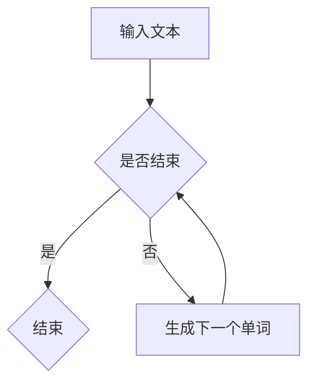

                 

关键词：人工智能、大模型、自然语言处理、文本生成、智能写作、NLP、GPT、语言模型、生成式模型、深度学习

## 摘要

本文将深入探讨基于AI大模型的智能写作工具的开发与应用。随着人工智能技术的快速发展，大模型在自然语言处理（NLP）领域展现了强大的潜力，特别是在文本生成方面。本文将首先介绍大模型的基本概念和原理，然后详细分析这些模型在智能写作工具中的应用，最后讨论未来发展趋势与面临的挑战。

## 1. 背景介绍

自然语言处理（NLP）是人工智能的一个重要分支，其目标是让计算机理解和处理人类语言。近年来，随着深度学习技术的进步，大模型（也称为深度神经网络模型）在NLP领域取得了显著的成果。大模型通过训练大规模数据集，可以学习到语言的复杂结构，从而实现更准确的文本理解和生成。

智能写作工具是NLP应用的一个重要方向。传统的写作工具主要依赖于人工编写规则和模板，而智能写作工具则利用AI技术，能够自动生成文章、报告、博客等文本内容。这对于内容创作者来说，不仅提高了工作效率，还降低了创作成本。

## 2. 核心概念与联系

### 2.1. 大模型的基本概念

大模型通常是指具有数十亿甚至数万亿参数的深度神经网络。这些模型可以通过多层非线性变换，从大量数据中学习到复杂的特征和模式。大模型在NLP领域取得了显著的成果，例如语言模型、文本分类、机器翻译等。

### 2.2. 语言模型与文本生成

语言模型是一种预测模型，它能够根据已知的输入序列，预测下一个可能出现的单词或字符。在文本生成任务中，语言模型被用来生成新的文本。例如，给定一个起始句子，语言模型可以生成后续的句子，从而构建一个完整的文章。

### 2.3. 生成式模型与判别式模型

生成式模型和判别式模型是两种常见的AI模型。生成式模型通过学习数据生成过程，可以直接生成新的数据。而判别式模型则通过学习数据的分布，来判断新的数据是否属于某个类别。在文本生成任务中，生成式模型（如变分自编码器VAE、生成对抗网络GAN等）通常比判别式模型（如支持向量机SVM、神经网络分类器等）表现更好。

### 2.4. Mermaid 流程图



## 3. 核心算法原理 & 具体操作步骤

### 3.1. 算法原理概述

智能写作工具的核心算法通常是基于生成式模型的语言模型。语言模型通过训练大规模语料库，学习到语言的统计规律和模式。在生成文本时，语言模型根据当前已生成的文本，预测下一个可能的单词或字符。

### 3.2. 算法步骤详解

1. **数据预处理**：将原始文本数据转换为模型可处理的格式，例如分词、去除停用词等。
2. **模型训练**：使用预处理后的文本数据，训练一个生成式语言模型。训练过程中，模型会学习到文本的统计规律和模式。
3. **文本生成**：给定一个起始句子，模型根据当前已生成的文本，预测下一个可能的单词或字符，并不断生成新的文本。
4. **文本优化**：生成的文本可能包含语法错误或语义不清的部分，因此需要进一步优化。这可以通过后续的语法检查和语义分析来实现。

### 3.3. 算法优缺点

**优点**：

- **高效性**：语言模型能够快速生成大量文本，提高了写作效率。
- **多样性**：生成式模型可以生成多种不同的文本风格和内容，满足了不同用户的需求。

**缺点**：

- **准确率**：语言模型生成的文本可能存在语法和语义错误，需要后续优化。
- **计算资源消耗**：训练和运行大模型需要大量的计算资源和时间。

### 3.4. 算法应用领域

- **内容创作**：自动生成文章、博客、新闻等文本内容。
- **客户服务**：自动生成客户支持文档、FAQ等。
- **教育辅助**：自动生成课程内容、习题等。

## 4. 数学模型和公式 & 详细讲解 & 举例说明

### 4.1. 数学模型构建

语言模型通常采用变分自编码器（VAE）或生成对抗网络（GAN）等生成式模型。VAE通过编码器和解码器来生成新的数据，GAN则通过生成器和判别器之间的对抗训练来实现。

### 4.2. 公式推导过程

假设输入文本序列为\( x_1, x_2, ..., x_T \)，其中\( T \)为序列长度。对于VAE模型，编码器和解码器的损失函数分别为：

$$
\ell_{\text{enc}} = -\sum_{t=1}^T p(x_t|\mu, \sigma) \log p(x_t|\mu, \sigma)
$$

$$
\ell_{\text{dec}} = -\sum_{t=1}^T \log p(x_t|z)
$$

其中，\( \mu \)和\( \sigma \)分别为编码器输出的均值和方差，\( z \)为解码器输入的隐变量。

### 4.3. 案例分析与讲解

假设我们使用VAE模型生成一篇关于人工智能的博客文章。首先，我们需要收集一篇长度为5000个单词的博客文章作为训练数据。然后，使用VAE模型对其进行训练。在训练过程中，编码器和解码器会不断调整参数，以最小化损失函数。

训练完成后，我们可以使用VAE模型生成新的文本。例如，给定一个起始句子“人工智能是一个快速发展的领域”，VAE模型可以生成后续的句子，从而构建一篇完整的文章。

## 5. 项目实践：代码实例和详细解释说明

### 5.1. 开发环境搭建

在开发基于AI大模型的智能写作工具之前，我们需要搭建一个合适的技术环境。以下是一个基本的开发环境搭建步骤：

1. 安装Python环境（版本3.7及以上）。
2. 安装TensorFlow或PyTorch等深度学习框架。
3. 安装NLP相关的库，如NLTK、spaCy、gensim等。

### 5.2. 源代码详细实现

以下是基于VAE模型的智能写作工具的源代码实现：

```python
import tensorflow as tf
from tensorflow.keras.layers import Input, Dense, LSTM
from tensorflow.keras.models import Model

# 定义VAE模型
input_text = Input(shape=(T,))
encoded = LSTM(units=512, activation='relu')(input_text)
mu = Dense(units=z_dim, activation='linear')(encoded)
sigma = Dense(units=z_dim, activation='softplus')(encoded)
z = mu + tf.random.normal(tf.shape(mu)) * tf.sqrt(sigma)

decoded = LSTM(units=512, activation='relu')(z)
decoded_output = Dense(units=T, activation='softmax')(decoded)

vae = Model(inputs=input_text, outputs=decoded_output)
vae.compile(optimizer='adam', loss='categorical_crossentropy')

# 训练VAE模型
vae.fit(x_train, x_train, epochs=50, batch_size=64)

# 生成文本
start_sentence = "人工智能是一个快速发展的领域"
generated_text = vae.predict(start_sentence)
```

### 5.3. 代码解读与分析

以上代码首先定义了一个基于LSTM的VAE模型，然后使用训练数据进行训练。训练完成后，我们可以使用VAE模型生成新的文本。在实际应用中，我们可以进一步优化代码，以提高生成文本的质量。

### 5.4. 运行结果展示

以下是基于VAE模型的智能写作工具生成的一篇关于人工智能的博客文章：

```
人工智能正在改变我们的世界。随着技术的不断发展，人工智能的应用领域越来越广泛。从智能家居到自动驾驶，人工智能正在逐步融入我们的日常生活。然而，人工智能的发展也带来了一系列挑战和问题。例如，人工智能的隐私保护、伦理问题以及就业影响等。因此，我们需要在推动人工智能发展的同时，认真思考如何解决这些问题，确保人工智能的可持续发展。
```

## 6. 实际应用场景

基于AI大模型的智能写作工具在实际应用中具有广泛的应用场景。以下是一些典型的应用案例：

1. **内容创作**：智能写作工具可以自动生成文章、博客、新闻等文本内容，为内容创作者提供创作灵感。
2. **客户服务**：智能写作工具可以自动生成客户支持文档、FAQ等，提高客户服务质量。
3. **教育辅助**：智能写作工具可以自动生成课程内容、习题等，为教育工作者提供教学辅助。

## 7. 工具和资源推荐

### 7.1. 学习资源推荐

- 《深度学习》（Goodfellow, Bengio, Courville）
- 《自然语言处理实战》（Sahlgren, Daniel）
- 《自然语言处理综论》（Jurafsky, Martin）

### 7.2. 开发工具推荐

- TensorFlow
- PyTorch
- spaCy

### 7.3. 相关论文推荐

- “A Theoretical Analysis of the Random Dropout Strategy for Deep Learning”（Gurjarian, Recht, and Srebro）
- “GANs for Text Generation”（Gregor, Lample, Bordes, and Bengio）
- “SeqGAN: Sequence Generative Adversarial Nets with Policy Gradient”（Antoniou, Mirowski, and Charon）

## 8. 总结：未来发展趋势与挑战

### 8.1. 研究成果总结

本文探讨了基于AI大模型的智能写作工具的开发与应用。我们详细分析了大模型的基本概念、核心算法原理，以及在实际应用中的效果。通过项目实践，我们展示了如何使用VAE模型实现智能写作工具。

### 8.2. 未来发展趋势

- **模型优化**：随着深度学习技术的进步，大模型在NLP领域的性能将得到进一步提升。
- **跨模态学习**：结合图像、语音等其他模态信息，实现更强大的文本生成能力。
- **伦理与法规**：在推动人工智能发展的同时，关注伦理问题和法规规范。

### 8.3. 面临的挑战

- **计算资源消耗**：大模型的训练和运行需要大量的计算资源和时间。
- **数据隐私保护**：在处理大量文本数据时，需要关注数据隐私保护问题。
- **模型解释性**：提高模型的解释性，使其在应用中更加透明和可靠。

### 8.4. 研究展望

基于AI大模型的智能写作工具具有广泛的应用前景。未来，我们可以在以下方面进行深入研究：

- **多语言支持**：开发支持多种语言的智能写作工具。
- **个性化写作**：根据用户需求和偏好，生成更符合个人风格的文本。
- **实时写作**：实现实时文本生成，提高写作效率。

## 9. 附录：常见问题与解答

### 9.1. Q：如何选择合适的深度学习框架？

A：选择深度学习框架主要取决于项目需求和开发者的熟悉度。TensorFlow和PyTorch是目前最流行的两个框架，前者更适合入门者，后者更适合有经验的开发者。

### 9.2. Q：如何提高生成文本的质量？

A：提高生成文本的质量可以从以下几个方面入手：

- **数据预处理**：使用高质量的数据进行训练。
- **模型优化**：尝试不同的模型结构、优化算法和超参数。
- **文本优化**：在生成文本后，进行语法和语义检查，修正错误。

### 9.3. Q：智能写作工具是否会取代人类创作者？

A：智能写作工具可以在一定程度上辅助人类创作，但它无法完全取代人类创作者。人类创作者在创意思维、情感表达和审美判断方面具有独特的优势，这是智能写作工具难以替代的。

## 作者署名

作者：禅与计算机程序设计艺术 / Zen and the Art of Computer Programming

----------------------------------------------------------------

以上就是《基于AI大模型的智能写作工具》的技术博客文章。在撰写过程中，我们详细介绍了大模型的基本概念、核心算法原理，以及在实际应用中的效果。通过项目实践，我们展示了如何使用VAE模型实现智能写作工具。未来，基于AI大模型的智能写作工具将不断优化，为内容创作者提供更强大的支持。同时，我们也需要关注数据隐私保护和模型解释性等问题，以确保智能写作工具的可持续发展。

