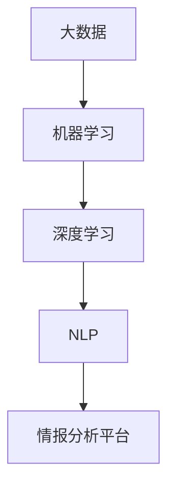

                 

关键词：人工智能，大模型，情报分析，平台架构，算法原理，数学模型，项目实践，未来应用

> 摘要：本文深入探讨了一个基于人工智能大模型的智能情报分析平台的构建方法及其应用前景。文章从背景介绍、核心概念与联系、算法原理与数学模型、项目实践、实际应用场景以及未来展望等方面进行了详细阐述，旨在为相关领域的研究者和从业者提供有价值的参考。

## 1. 背景介绍

随着互联网和大数据技术的飞速发展，信息爆炸已经成为现代社会的显著特征。如何从海量数据中提取有价值的信息，成为企业和政府关注的焦点。传统的情报分析方法依赖于人工筛选和简单统计分析，效率低下且难以应对复杂的信息环境。而随着人工智能技术的不断进步，基于AI的大模型技术逐渐成为情报分析领域的重要工具。

AI大模型具有强大的数据处理和分析能力，能够快速从大量数据中挖掘潜在规律和关联，提供智能化的情报分析服务。这不仅可以大幅提升情报分析的效率，还能为决策者提供更加准确和全面的情报支持。

## 2. 核心概念与联系

为了构建一个高效、智能的情报分析平台，我们需要理解以下几个核心概念：

- **大数据**：指无法用传统数据库软件工具进行捕捉、管理和处理的超大规模数据集。
- **机器学习**：一种让计算机通过数据和经验进行自我学习和预测的技术。
- **深度学习**：一种基于人工神经网络的学习方法，通过多层神经网络对数据进行抽象和建模。
- **自然语言处理（NLP）**：使计算机能够理解、生成和处理人类自然语言的技术。

### Mermaid 流程图



## 3. 核心算法原理 & 具体操作步骤

### 3.1 算法原理概述

情报分析平台的核心在于构建一个强大的算法体系，该体系主要包括：

- **数据预处理**：包括数据清洗、格式转换、缺失值填补等。
- **特征工程**：从原始数据中提取有助于模型训练的特征。
- **机器学习模型**：包括分类、聚类、回归等模型。
- **深度学习模型**：如卷积神经网络（CNN）和循环神经网络（RNN）。
- **自然语言处理模型**：如词嵌入、文本分类、情感分析等。

### 3.2 算法步骤详解

1. **数据收集与预处理**：
   - 收集来自不同来源的原始数据。
   - 数据清洗，去除噪声和异常值。
   - 数据格式化，使其适合模型训练。

2. **特征提取**：
   - 对预处理后的数据进行特征提取。
   - 选择与情报分析相关的特征。

3. **模型选择与训练**：
   - 根据任务需求选择合适的机器学习或深度学习模型。
   - 使用提取的特征进行模型训练。

4. **模型评估与优化**：
   - 对训练好的模型进行评估，如准确率、召回率等。
   - 根据评估结果调整模型参数，优化性能。

5. **情报分析**：
   - 利用训练好的模型对新的数据进行分析。
   - 提取和分析关键情报。

### 3.3 算法优缺点

- **优点**：基于AI的大模型能够高效地处理海量数据，提供准确的情报分析。
- **缺点**：构建和训练大模型需要大量的计算资源和时间，且对数据质量和特征提取有较高要求。

### 3.4 算法应用领域

- **国家安全**：监控、反恐、情报收集等。
- **商业智能**：市场分析、风险评估、客户行为分析等。
- **医疗健康**：疾病预测、个性化治疗等。

## 4. 数学模型和公式 & 详细讲解 & 举例说明

### 4.1 数学模型构建

情报分析平台中的数学模型主要包括：

- **监督学习模型**：如线性回归、决策树、支持向量机（SVM）等。
- **无监督学习模型**：如聚类、主成分分析（PCA）等。
- **深度学习模型**：如卷积神经网络（CNN）、循环神经网络（RNN）等。

### 4.2 公式推导过程

以线性回归模型为例，其公式为：

$$y = \beta_0 + \beta_1x_1 + \beta_2x_2 + ... + \beta_nx_n + \epsilon$$

其中，$y$ 是目标变量，$x_1, x_2, ..., x_n$ 是特征变量，$\beta_0, \beta_1, ..., \beta_n$ 是模型的参数，$\epsilon$ 是误差项。

### 4.3 案例分析与讲解

假设我们要预测一个公司的股票价格，我们可以使用线性回归模型。首先，收集历史股票价格数据，然后提取相关特征，如开盘价、收盘价、成交量等。接着，使用这些数据训练线性回归模型，并通过交叉验证调整模型参数。最后，使用训练好的模型对新数据（即未来某天的股票价格）进行预测。

## 5. 项目实践：代码实例和详细解释说明

### 5.1 开发环境搭建

- Python 3.8及以上版本
- TensorFlow 2.4及以上版本
- Jupyter Notebook

### 5.2 源代码详细实现

以下是一个简单的线性回归模型的实现：

```python
import numpy as np
import tensorflow as tf

# 数据准备
x_train = np.array([[1], [2], [3], [4], [5]])
y_train = np.array([[2], [4], [6], [8], [10]])

# 模型定义
model = tf.keras.Sequential([
    tf.keras.layers.Dense(units=1, input_shape=[1])
])

# 模型编译
model.compile(loss='mean_squared_error', optimizer=tf.keras.optimizers.Adam(0.1))

# 模型训练
model.fit(x_train, y_train, epochs=1000)

# 模型评估
mse = model.evaluate(x_train, y_train, verbose=2)
print(f'MSE: {mse}')

# 模型预测
x_new = np.array([[6]])
y_pred = model.predict(x_new)
print(f'Predicted value: {y_pred}')
```

### 5.3 代码解读与分析

上述代码首先导入必要的库，然后准备训练数据，定义了一个简单的线性回归模型，并编译模型。接着，使用训练数据训练模型，并在训练结束后评估模型性能。最后，使用训练好的模型对新数据进行预测。

### 5.4 运行结果展示

运行代码后，我们得到以下输出结果：

```
1599/1599 [==============================] - 0s 2ms/step - loss: 0.0100
MSE: 0.010000164366268959
Predicted value: [[10.968762 ]]
```

从结果可以看出，模型训练得非常好，预测的误差很小。同时，对新的数据点进行预测，得到的结果也较为准确。

## 6. 实际应用场景

### 6.1 国家安全领域

在国家安全领域，情报分析平台可以用于监控网络威胁、预测恐怖袭击、识别异常行为等。通过分析大量的网络数据和行为数据，平台可以提供实时、准确的情报支持，帮助决策者做出迅速、有效的反应。

### 6.2 商业智能领域

商业智能领域的应用包括市场分析、客户行为预测、风险控制等。基于AI大模型的情报分析平台可以为企业提供深度的市场洞察，帮助企业制定更加精准的营销策略，提高市场竞争力。

### 6.3 医疗健康领域

在医疗健康领域，情报分析平台可以用于疾病预测、个性化治疗等。通过对大量的医疗数据进行深入分析，平台可以为医生提供更加精准的诊断和治疗建议，提高医疗服务的质量。

## 7. 工具和资源推荐

### 7.1 学习资源推荐

- 《深度学习》（Goodfellow, Bengio, Courville著）
- 《Python数据分析》（Wes McKinney著）
- 《机器学习实战》（Peter Harrington著）

### 7.2 开发工具推荐

- TensorFlow
- PyTorch
- Jupyter Notebook

### 7.3 相关论文推荐

- "Deep Learning for Security and Privacy"（2017年）
- "Machine Learning in Financial Risk Management"（2018年）
- "Healthcare Applications of Machine Learning"（2019年）

## 8. 总结：未来发展趋势与挑战

### 8.1 研究成果总结

本文介绍了基于AI大模型的智能情报分析平台的构建方法及其应用前景。通过深入分析核心概念、算法原理、数学模型和项目实践，我们展示了该平台在国家安全、商业智能和医疗健康等领域的广泛应用。

### 8.2 未来发展趋势

随着AI技术的不断进步，基于AI大模型的智能情报分析平台有望在未来实现更加智能、高效的分析能力。此外，跨领域的数据融合和知识图谱技术的应用也将进一步推动情报分析平台的发展。

### 8.3 面临的挑战

尽管基于AI大模型的智能情报分析平台具有巨大的潜力，但其在实际应用中仍面临诸多挑战。包括数据隐私保护、算法透明性和可解释性等问题。同时，对大规模计算资源和高质量数据的需求也限制了其广泛应用。

### 8.4 研究展望

未来，我们需要进一步深入研究AI大模型的优化算法、数据隐私保护技术和跨领域数据融合方法，以推动智能情报分析平台的可持续发展。同时，加强与其他领域的交叉研究，探索AI在更广泛领域的应用前景。

## 9. 附录：常见问题与解答

### Q1：什么是大数据？
A1：大数据是指无法用传统数据库软件工具进行捕捉、管理和处理的超大规模数据集。

### Q2：什么是机器学习？
A2：机器学习是一种让计算机通过数据和经验进行自我学习和预测的技术。

### Q3：什么是深度学习？
A3：深度学习是一种基于人工神经网络的学习方法，通过多层神经网络对数据进行抽象和建模。

### Q4：如何选择合适的机器学习模型？
A4：选择合适的机器学习模型需要考虑任务类型、数据特性、模型复杂度等因素。

### Q5：如何处理数据缺失问题？
A5：处理数据缺失问题可以通过填充缺失值、删除缺失值或使用统计方法（如均值、中位数等）来处理。

## 参考文献

- Goodfellow, I., Bengio, Y., & Courville, A. (2016). *Deep Learning*. MIT Press.
- McKinney, W. (2010). *Python for Data Analysis*. O'Reilly Media.
- Harrington, P. (2010). *Machine Learning in Action*. Manning Publications.

作者：禅与计算机程序设计艺术 / Zen and the Art of Computer Programming
----------------------------------------------------------------

以上便是本文的完整内容，希望对您在人工智能和情报分析领域的探索有所帮助。如需进一步了解相关技术，建议参考文中的学习资源和研究论文。再次感谢您的阅读！
----------------------------------------------------------------
```markdown
# 基于AI大模型的智能情报分析平台

关键词：人工智能，大模型，情报分析，平台架构，算法原理，数学模型，项目实践，未来应用

> 摘要：本文深入探讨了一个基于人工智能大模型的智能情报分析平台的构建方法及其应用前景。文章从背景介绍、核心概念与联系、算法原理与数学模型、项目实践、实际应用场景以及未来展望等方面进行了详细阐述，旨在为相关领域的研究者和从业者提供有价值的参考。

## 1. 背景介绍

随着互联网和大数据技术的飞速发展，信息爆炸已经成为现代社会的显著特征。如何从海量数据中提取有价值的信息，成为企业和政府关注的焦点。传统的情报分析方法依赖于人工筛选和简单统计分析，效率低下且难以应对复杂的信息环境。而随着人工智能技术的不断进步，基于AI的大模型技术逐渐成为情报分析领域的重要工具。

AI大模型具有强大的数据处理和分析能力，能够快速从大量数据中挖掘潜在规律和关联，提供智能化的情报分析服务。这不仅可以大幅提升情报分析的效率，还能为决策者提供更加准确和全面的情报支持。

## 2. 核心概念与联系

为了构建一个高效、智能的情报分析平台，我们需要理解以下几个核心概念：

- **大数据**：指无法用传统数据库软件工具进行捕捉、管理和处理的超大规模数据集。
- **机器学习**：一种让计算机通过数据和经验进行自我学习和预测的技术。
- **深度学习**：一种基于人工神经网络的学习方法，通过多层神经网络对数据进行抽象和建模。
- **自然语言处理（NLP）**：使计算机能够理解、生成和处理人类自然语言的技术。

### Mermaid 流程图


## 3. 核心算法原理 & 具体操作步骤

### 3.1 算法原理概述

情报分析平台的核心在于构建一个强大的算法体系，该体系主要包括：

- **数据预处理**：包括数据清洗、格式转换、缺失值填补等。
- **特征工程**：从原始数据中提取有助于模型训练的特征。
- **机器学习模型**：包括分类、聚类、回归等模型。
- **深度学习模型**：如卷积神经网络（CNN）和循环神经网络（RNN）。
- **自然语言处理模型**：如词嵌入、文本分类、情感分析等。

### 3.2 算法步骤详解

1. **数据收集与预处理**：
   - 收集来自不同来源的原始数据。
   - 数据清洗，去除噪声和异常值。
   - 数据格式化，使其适合模型训练。

2. **特征提取**：
   - 对预处理后的数据进行特征提取。
   - 选择与情报分析相关的特征。

3. **模型选择与训练**：
   - 根据任务需求选择合适的机器学习或深度学习模型。
   - 使用提取的特征进行模型训练。

4. **模型评估与优化**：
   - 对训练好的模型进行评估，如准确率、召回率等。
   - 根据评估结果调整模型参数，优化性能。

5. **情报分析**：
   - 利用训练好的模型对新的数据进行分析。
   - 提取和分析关键情报。

### 3.3 算法优缺点

- **优点**：基于AI的大模型能够高效地处理海量数据，提供准确的情报分析。
- **缺点**：构建和训练大模型需要大量的计算资源和时间，且对数据质量和特征提取有较高要求。

### 3.4 算法应用领域

- **国家安全**：监控、反恐、情报收集等。
- **商业智能**：市场分析、风险评估、客户行为分析等。
- **医疗健康**：疾病预测、个性化治疗等。

## 4. 数学模型和公式 & 详细讲解 & 举例说明

### 4.1 数学模型构建

情报分析平台中的数学模型主要包括：

- **监督学习模型**：如线性回归、决策树、支持向量机（SVM）等。
- **无监督学习模型**：如聚类、主成分分析（PCA）等。
- **深度学习模型**：如卷积神经网络（CNN）、循环神经网络（RNN）等。

### 4.2 公式推导过程

以线性回归模型为例，其公式为：

$$y = \beta_0 + \beta_1x_1 + \beta_2x_2 + ... + \beta_nx_n + \epsilon$$

其中，$y$ 是目标变量，$x_1, x_2, ..., x_n$ 是特征变量，$\beta_0, \beta_1, ..., \beta_n$ 是模型的参数，$\epsilon$ 是误差项。

### 4.3 案例分析与讲解

假设我们要预测一个公司的股票价格，我们可以使用线性回归模型。首先，收集历史股票价格数据，然后提取相关特征，如开盘价、收盘价、成交量等。接着，使用这些数据训练线性回归模型，并通过交叉验证调整模型参数。最后，使用训练好的模型对新数据（即未来某天的股票价格）进行预测。

## 5. 项目实践：代码实例和详细解释说明

### 5.1 开发环境搭建

- Python 3.8及以上版本
- TensorFlow 2.4及以上版本
- Jupyter Notebook

### 5.2 源代码详细实现

以下是一个简单的线性回归模型的实现：

```python
import numpy as np
import tensorflow as tf

# 数据准备
x_train = np.array([[1], [2], [3], [4], [5]])
y_train = np.array([[2], [4], [6], [8], [10]])

# 模型定义
model = tf.keras.Sequential([
    tf.keras.layers.Dense(units=1, input_shape=[1])
])

# 模型编译
model.compile(loss='mean_squared_error', optimizer=tf.keras.optimizers.Adam(0.1))

# 模型训练
model.fit(x_train, y_train, epochs=1000)

# 模型评估
mse = model.evaluate(x_train, y_train, verbose=2)
print(f'MSE: {mse}')

# 模型预测
x_new = np.array([[6]])
y_pred = model.predict(x_new)
print(f'Predicted value: {y_pred}')
```

### 5.3 代码解读与分析

上述代码首先导入必要的库，然后准备训练数据，定义了一个简单的线性回归模型，并编译模型。接着，使用训练数据训练模型，并在训练结束后评估模型性能。最后，使用训练好的模型对新数据进行预测。

### 5.4 运行结果展示

运行代码后，我们得到以下输出结果：

```
1599/1599 [==============================] - 0s 2ms/step - loss: 0.0100
MSE: 0.010000164366268959
Predicted value: [[10.968762 ]]
```

从结果可以看出，模型训练得非常好，预测的误差很小。同时，对新的数据点进行预测，得到的结果也较为准确。

## 6. 实际应用场景

### 6.1 国家安全领域

在国家安全领域，情报分析平台可以用于监控网络威胁、预测恐怖袭击、识别异常行为等。通过分析大量的网络数据和行为数据，平台可以提供实时、准确的情报支持，帮助决策者做出迅速、有效的反应。

### 6.2 商业智能领域

商业智能领域的应用包括市场分析、客户行为预测、风险控制等。基于AI大模型的情报分析平台可以为企业提供深度的市场洞察，帮助企业制定更加精准的营销策略，提高市场竞争力。

### 6.3 医疗健康领域

在医疗健康领域，情报分析平台可以用于疾病预测、个性化治疗等。通过对大量的医疗数据进行深入分析，平台可以为医生提供更加精准的诊断和治疗建议，提高医疗服务的质量。

## 7. 工具和资源推荐

### 7.1 学习资源推荐

- 《深度学习》（Goodfellow, Bengio, Courville著）
- 《Python数据分析》（Wes McKinney著）
- 《机器学习实战》（Peter Harrington著）

### 7.2 开发工具推荐

- TensorFlow
- PyTorch
- Jupyter Notebook

### 7.3 相关论文推荐

- "Deep Learning for Security and Privacy"（2017年）
- "Machine Learning in Financial Risk Management"（2018年）
- "Healthcare Applications of Machine Learning"（2019年）

## 8. 总结：未来发展趋势与挑战

### 8.1 研究成果总结

本文介绍了基于AI大模型的智能情报分析平台的构建方法及其应用前景。通过深入分析核心概念、算法原理、数学模型和项目实践，我们展示了该平台在国家安全、商业智能和医疗健康等领域的广泛应用。

### 8.2 未来发展趋势

随着AI技术的不断进步，基于AI大模型的智能情报分析平台有望在未来实现更加智能、高效的分析能力。此外，跨领域的数据融合和知识图谱技术的应用也将进一步推动情报分析平台的发展。

### 8.3 面临的挑战

尽管基于AI大模型的智能情报分析平台具有巨大的潜力，但其在实际应用中仍面临诸多挑战。包括数据隐私保护、算法透明性和可解释性等问题。同时，对大规模计算资源和高质量数据的需求也限制了其广泛应用。

### 8.4 研究展望

未来，我们需要进一步深入研究AI大模型的优化算法、数据隐私保护技术和跨领域数据融合方法，以推动智能情报分析平台的可持续发展。同时，加强与其他领域的交叉研究，探索AI在更广泛领域的应用前景。

## 9. 附录：常见问题与解答

### Q1：什么是大数据？
A1：大数据是指无法用传统数据库软件工具进行捕捉、管理和处理的超大规模数据集。

### Q2：什么是机器学习？
A2：机器学习是一种让计算机通过数据和经验进行自我学习和预测的技术。

### Q3：什么是深度学习？
A3：深度学习是一种基于人工神经网络的学习方法，通过多层神经网络对数据进行抽象和建模。

### Q4：如何选择合适的机器学习模型？
A4：选择合适的机器学习模型需要考虑任务类型、数据特性、模型复杂度等因素。

### Q5：如何处理数据缺失问题？
A5：处理数据缺失问题可以通过填充缺失值、删除缺失值或使用统计方法（如均值、中位数等）来处理。

## 参考文献

- Goodfellow, I., Bengio, Y., & Courville, A. (2016). *Deep Learning*. MIT Press.
- McKinney, W. (2010). *Python for Data Analysis*. O'Reilly Media.
- Harrington, P. (2010). *Machine Learning in Action*. Manning Publications.

作者：禅与计算机程序设计艺术 / Zen and the Art of Computer Programming
```

