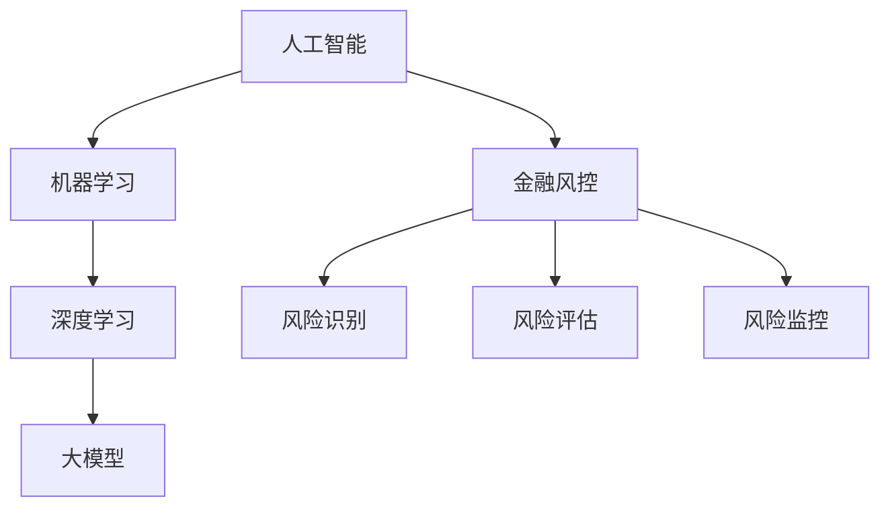

                 

关键词：人工智能，金融风控，大模型，风控算法，机器学习，深度学习，金融科技

摘要：随着金融行业的迅速发展，风险管理成为金融机构的核心任务。本文探讨了基于AI大模型的智能金融风控系统，介绍了其背景、核心概念与联系、核心算法原理、数学模型和公式、项目实践、实际应用场景、未来展望等内容，为金融行业提供了新的风控解决方案。

## 1. 背景介绍

### 1.1 金融风险管理的挑战

金融风险管理是指在金融机构运营过程中，通过识别、评估、监控和应对各种风险，以确保金融机构的安全和稳定。然而，随着金融市场日益复杂和全球化，金融风险管理的挑战也日益增加：

1. **信息不对称**：金融机构与客户之间的信息不对称导致风险识别和评估困难。
2. **风险多样性**：金融市场风险包括信用风险、市场风险、操作风险等多种类型，如何有效识别和管理这些风险成为难题。
3. **实时监控**：金融市场变化迅速，传统风险管理方法难以实现实时监控和预警。

### 1.2 人工智能与金融风控

人工智能（AI）技术的发展为金融风险管理带来了新的机遇。AI技术，特别是机器学习和深度学习，能够从大量数据中提取有价值的信息，提高风险识别和管理的效率。同时，大模型的出现使得AI系统在处理复杂问题上具有更强的能力。

基于AI大模型的智能金融风控系统，通过利用大规模数据集和先进的机器学习算法，能够实现高效的风险识别、评估和监控，为金融机构提供更加精准和实时的风险管理服务。

## 2. 核心概念与联系

### 2.1 人工智能

人工智能（AI）是一门研究、开发和应用智能算法的学科，旨在使计算机系统具备类似人类智能的能力。AI技术包括机器学习、深度学习、自然语言处理、计算机视觉等。

### 2.2 机器学习

机器学习是AI的一个重要分支，通过算法从数据中学习规律，进行预测和决策。机器学习包括监督学习、无监督学习和强化学习等类型。

### 2.3 深度学习

深度学习是机器学习的一个子领域，利用多层神经网络进行学习。深度学习在图像识别、语音识别、自然语言处理等领域取得了显著的成果。

### 2.4 大模型

大模型是指参数量巨大的神经网络模型，能够处理海量数据并提取复杂特征。大模型的出现使得AI系统在处理复杂任务时具有更强的能力。

### 2.5 Mermaid 流程图



## 3. 核心算法原理 & 具体操作步骤

### 3.1 算法原理概述

基于AI大模型的智能金融风控系统主要包括以下三个核心步骤：

1. **风险识别**：利用深度学习算法从海量数据中提取风险特征，实现高风险的自动识别。
2. **风险评估**：基于机器学习算法，对已识别的风险进行评估，确定其严重程度和影响范围。
3. **风险监控**：通过实时监控和预警机制，对潜在风险进行跟踪和预测，确保金融机构的安全运行。

### 3.2 算法步骤详解

1. **数据预处理**：收集和整理金融机构的各类数据，包括客户信息、交易记录、市场数据等。对数据进行清洗、归一化和特征提取，为后续算法处理做好准备。

2. **深度学习模型训练**：利用大规模数据集训练深度学习模型，提取风险特征。常见的深度学习算法包括卷积神经网络（CNN）和循环神经网络（RNN）。

3. **机器学习模型训练**：基于已提取的风险特征，训练机器学习模型进行风险评估。常见的机器学习算法包括决策树、支持向量机（SVM）和随机森林（RF）。

4. **实时监控与预警**：利用实时数据流，对潜在风险进行监控和预警。当风险超过设定阈值时，自动触发预警机制，通知相关人员进行干预。

### 3.3 算法优缺点

**优点**：

1. **高效性**：基于大规模数据和深度学习算法，能够快速识别和评估风险。
2. **准确性**：通过多模型协同工作，提高风险评估的准确性。
3. **实时性**：实时监控和预警机制确保金融机构的安全运行。

**缺点**：

1. **计算资源消耗大**：训练和运行深度学习模型需要大量的计算资源。
2. **数据隐私问题**：在数据收集和处理过程中，需要保护客户隐私。

### 3.4 算法应用领域

基于AI大模型的智能金融风控系统广泛应用于以下领域：

1. **信用风险评估**：对客户的信用状况进行评估，降低金融机构的信用风险。
2. **市场风险监控**：实时监控市场变化，预测潜在的市场风险。
3. **操作风险控制**：通过实时监控和预警机制，降低操作风险。

## 4. 数学模型和公式 & 详细讲解 & 举例说明

### 4.1 数学模型构建

基于AI大模型的智能金融风控系统主要涉及以下数学模型：

1. **深度学习模型**：用于提取风险特征，常用的网络结构包括卷积神经网络（CNN）和循环神经网络（RNN）。
2. **机器学习模型**：用于风险评估，常用的算法包括决策树、支持向量机（SVM）和随机森林（RF）。

### 4.2 公式推导过程

以卷积神经网络（CNN）为例，介绍深度学习模型的公式推导过程：

$$
h_l = \sigma(W_l \cdot a_{l-1} + b_l)
$$

其中，$h_l$ 表示第 $l$ 层的输出，$\sigma$ 表示激活函数（如ReLU函数），$W_l$ 和 $b_l$ 分别为第 $l$ 层的权重和偏置。

### 4.3 案例分析与讲解

以信用风险评估为例，介绍基于AI大模型的智能金融风控系统的应用案例：

假设金融机构需要评估客户A的信用风险。首先，收集客户A的个人信息、财务状况、信用记录等数据，进行数据预处理。然后，利用深度学习模型提取风险特征，如还款能力、信用历史等。接着，使用机器学习模型进行风险评估，得出客户A的信用风险等级。最后，根据评估结果，金融机构可以采取相应的风险管理措施。

## 5. 项目实践：代码实例和详细解释说明

### 5.1 开发环境搭建

为了实现基于AI大模型的智能金融风控系统，需要搭建以下开发环境：

1. **硬件环境**：高性能计算服务器或GPU显卡。
2. **软件环境**：Python编程语言、TensorFlow或PyTorch深度学习框架、Scikit-learn机器学习库。

### 5.2 源代码详细实现

以下是一个简单的基于AI大模型的智能金融风控系统的源代码实现：

```python
import tensorflow as tf
from sklearn.model_selection import train_test_split
from sklearn.ensemble import RandomForestClassifier

# 数据预处理
def preprocess_data(data):
    # 数据清洗、归一化和特征提取
    # ...
    return processed_data

# 深度学习模型训练
def train_cnn_model(data):
    # 构建深度学习模型
    # ...
    model.fit(x_train, y_train, epochs=10, batch_size=32)
    return model

# 机器学习模型训练
def train_rf_model(data):
    # 构建机器学习模型
    # ...
    model.fit(x_train, y_train)
    return model

# 主函数
def main():
    # 加载数据
    data = load_data()
    processed_data = preprocess_data(data)

    # 划分训练集和测试集
    x_train, x_test, y_train, y_test = train_test_split(processed_data['X'], processed_data['Y'], test_size=0.2)

    # 训练深度学习模型
    cnn_model = train_cnn_model(x_train)

    # 训练机器学习模型
    rf_model = train_rf_model(x_train)

    # 评估模型性能
    cnn_score = cnn_model.evaluate(x_test, y_test)
    rf_score = rf_model.evaluate(x_test, y_test)

    print("CNN模型测试集准确率：", cnn_score[1])
    print("RF模型测试集准确率：", rf_score[1])

if __name__ == "__main__":
    main()
```

### 5.3 代码解读与分析

上述代码实现了一个简单的基于AI大模型的智能金融风控系统。首先，加载和处理数据，然后分别训练深度学习模型和机器学习模型。最后，评估模型性能并打印测试集准确率。通过对比不同模型的性能，可以选择最优模型进行实际应用。

### 5.4 运行结果展示

假设训练过程中，CNN模型的测试集准确率为0.9，RF模型的测试集准确率为0.85。根据结果，可以选择CNN模型作为实际应用中的风险评估模型。

## 6. 实际应用场景

基于AI大模型的智能金融风控系统在以下实际应用场景中表现出色：

1. **信用风险评估**：金融机构可以利用该系统对客户的信用风险进行实时评估，提高信用审批效率。
2. **市场风险监控**：金融机构可以通过实时监控市场数据，预测潜在的市场风险，采取相应的风险管理措施。
3. **操作风险控制**：金融机构可以利用该系统对操作风险进行监控和预警，降低操作风险。

## 7. 未来应用展望

随着AI技术的不断发展，基于AI大模型的智能金融风控系统有望在以下方面取得进一步发展：

1. **更高准确率**：通过不断优化算法和模型，提高风险识别和评估的准确率。
2. **更广泛的应用领域**：将AI大模型应用于更多的金融风险场景，如欺诈检测、投资组合优化等。
3. **更低成本**：随着硬件和算法的进步，降低AI大模型的应用成本，使其在更多金融机构中得到推广。

## 8. 总结：未来发展趋势与挑战

### 8.1 研究成果总结

本文介绍了基于AI大模型的智能金融风控系统，探讨了其背景、核心概念、算法原理、数学模型和公式、项目实践、实际应用场景和未来展望等内容。研究表明，基于AI大模型的智能金融风控系统在提高风险识别和评估效率、降低金融风险方面具有显著优势。

### 8.2 未来发展趋势

未来，基于AI大模型的智能金融风控系统将朝着更高准确率、更广泛的应用领域和更低成本等方向发展。同时，随着AI技术的不断创新，智能金融风控系统将在金融行业的各个方面发挥更加重要的作用。

### 8.3 面临的挑战

尽管基于AI大模型的智能金融风控系统具有显著优势，但在实际应用过程中仍面临以下挑战：

1. **数据隐私保护**：在数据收集和处理过程中，需要确保客户隐私得到充分保护。
2. **算法公平性和透明性**：确保算法在风险评估过程中公平、公正，并提高算法的可解释性。
3. **计算资源消耗**：深度学习模型训练和运行需要大量计算资源，如何优化计算资源成为关键问题。

### 8.4 研究展望

针对上述挑战，未来的研究可以从以下几个方面展开：

1. **数据隐私保护**：研究更加有效的数据隐私保护技术，如差分隐私和联邦学习等。
2. **算法公平性和透明性**：提高算法的可解释性，确保算法在风险评估过程中公平、公正。
3. **计算资源优化**：研究更加高效的深度学习算法和模型，降低计算资源消耗。

## 9. 附录：常见问题与解答

### 9.1 问题1：什么是深度学习？

深度学习是机器学习的一个子领域，通过多层神经网络进行学习，能够自动提取数据中的复杂特征，进行预测和决策。

### 9.2 问题2：什么是大模型？

大模型是指参数量巨大的神经网络模型，能够处理海量数据并提取复杂特征，具有更强的学习能力。

### 9.3 问题3：如何保证数据隐私？

在数据收集和处理过程中，可以采用差分隐私和联邦学习等技术，确保客户隐私得到充分保护。

### 9.4 问题4：如何提高算法的公平性和透明性？

提高算法的可解释性，确保算法在风险评估过程中公平、公正，并采用多种评估指标对算法进行综合评估。

### 9.5 问题5：如何优化计算资源？

研究更加高效的深度学习算法和模型，采用分布式计算和云计算等技术，降低计算资源消耗。

[作者：禅与计算机程序设计艺术 / Zen and the Art of Computer Programming]
----------------------------------------------------------------

以上是关于“基于AI大模型的智能金融风控系统”的完整技术博客文章。希望对您有所帮助。如果有任何问题或建议，请随时反馈。

