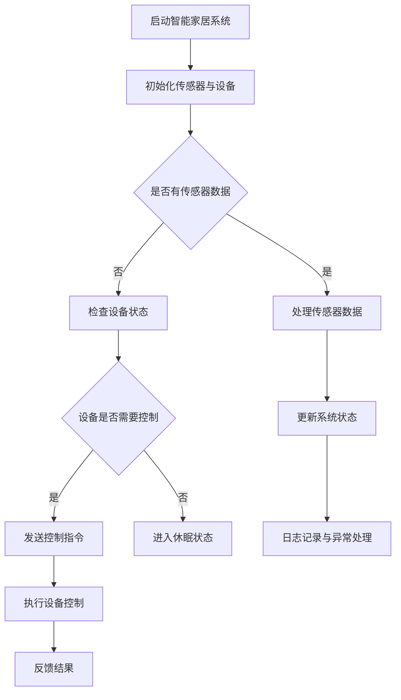

                 

 > **关键词**：Java、智能家居、并发控制、设计模式、安全性、性能优化

> **摘要**：本文旨在探讨基于Java语言开发的智能家居系统中的并发控制技术及其应用。文章首先介绍智能家居系统的基本概念和架构，然后深入分析Java中的并发控制机制，包括线程、锁、并发集合等。最后，通过一个具体项目实例，展示如何在Java中实现智能家居的并发控制和性能优化。

## 1. 背景介绍

随着物联网（IoT）技术的不断发展，智能家居系统已经成为家庭自动化领域的一个重要分支。智能家居系统通过互联网、传感器和控制设备，实现家庭环境的智能监测和控制，为用户提供更加便捷、舒适和节能的生活方式。然而，随着系统的复杂度增加，并发控制成为智能家居系统设计中的一个关键问题。

Java作为一种广泛应用于企业级应用开发的语言，其强大的并发控制机制在智能家居系统中具有重要的应用价值。Java提供了多种并发控制工具，如线程、锁、并发集合等，使得开发者能够更有效地管理和控制并发访问，确保系统的稳定性和性能。

本文将从以下几个方面展开讨论：

1. 智能家居系统概述
2. Java并发控制机制
3. 智能家居系统中的并发控制应用
4. 项目实践：智能家居并发控制实例
5. 未来应用展望

## 2. 核心概念与联系

在讨论智能家居系统的并发控制之前，我们需要了解一些核心概念和其之间的联系。

### 2.1 线程

线程是程序执行的基本单元，Java提供了创建和管理线程的API。线程能够实现并发执行，提高程序的执行效率。然而，过多的线程可能导致系统资源消耗增加，性能下降。因此，合理设计线程数量和生命周期至关重要。

### 2.2 锁

锁是Java中实现并发控制的一种机制，通过互斥锁（Mutex）和共享锁（Read-Write Lock）等方式，确保同一时间只有一个线程能够访问共享资源。锁机制能够防止数据竞争和死锁等问题，提高系统的稳定性。

### 2.3 并发集合

并发集合是Java提供的一组线程安全的数据结构，如ConcurrentHashMap、CopyOnWriteArrayList等。这些集合通过内部锁机制或无锁算法，实现并发访问，提高数据存取效率。

### 2.4 Mermaid 流程图

下面是一个描述智能家居系统中并发控制机制的Mermaid流程图：



## 3. 核心算法原理 & 具体操作步骤

### 3.1 算法原理概述

智能家居系统的核心算法主要包括传感器数据处理、设备控制、状态更新和日志记录等。其中，传感器数据处理和设备控制是并发操作的主要部分，需要合理设计并发控制机制。

### 3.2 算法步骤详解

1. **启动智能家居系统**

   初始化传感器与设备，建立通信连接。

2. **处理传感器数据**

   读取传感器数据，进行数据预处理和解析。

3. **检查设备状态**

   根据传感器数据，判断设备是否需要控制。

4. **发送控制指令**

   若设备需要控制，通过控制协议发送控制指令。

5. **更新系统状态**

   更新传感器数据和设备状态，记录操作日志。

6. **执行设备控制**

   设备根据控制指令进行相应操作。

7. **反馈结果**

   将设备执行结果返回给系统，供后续处理。

### 3.3 算法优缺点

1. **优点**

   - 提高系统性能：通过并发处理传感器数据和设备控制，提高系统响应速度。
   - 提高系统稳定性：合理设计并发控制机制，防止数据竞争和死锁等问题。

2. **缺点**

   - 复杂性增加：并发控制机制设计较为复杂，需要深入理解Java并发编程原理。
   - 资源消耗：过多的线程和锁机制可能导致系统资源消耗增加。

### 3.4 算法应用领域

- 智能家居系统：实现对家庭设备的智能监控和控制。
- 物流管理系统：实现对货物的实时跟踪和优化调度。
- 金融交易系统：确保交易数据的准确性和一致性。

## 4. 数学模型和公式 & 详细讲解 & 举例说明

### 4.1 数学模型构建

智能家居系统的数学模型主要包括传感器数据建模和设备控制模型。

1. **传感器数据建模**

   传感器数据模型可以表示为：

   $$D(t) = f(S(t), E(t), T(t))$$

   其中，$D(t)$表示时间$t$的传感器数据，$S(t)$表示传感器状态，$E(t)$表示环境因素，$T(t)$表示时间因素。

2. **设备控制模型**

   设备控制模型可以表示为：

   $$C(t) = g(D(t), P(t), M(t))$$

   其中，$C(t)$表示时间$t$的设备控制指令，$P(t)$表示用户偏好，$M(t)$表示设备状态。

### 4.2 公式推导过程

1. **传感器数据建模推导**

   假设传感器数据$D(t)$受传感器状态$S(t)$、环境因素$E(t)$和时间因素$T(t)$的影响，可以得到以下推导：

   $$D(t) = \alpha S(t) + \beta E(t) + \gamma T(t)$$

   其中，$\alpha$、$\beta$和$\gamma$为常数，可以通过实验数据拟合得到。

2. **设备控制模型推导**

   假设设备控制指令$C(t)$受传感器数据$D(t)$、用户偏好$P(t)$和设备状态$M(t)$的影响，可以得到以下推导：

   $$C(t) = \delta D(t) + \epsilon P(t) + \zeta M(t)$$

   其中，$\delta$、$\epsilon$和$\zeta$为常数，可以通过实验数据拟合得到。

### 4.3 案例分析与讲解

假设一个智能家居系统中的传感器监测到温度升高，需要开启空调进行降温。此时，传感器数据$D(t)$可以表示为：

$$D(t) = 100 + 0.5 \times (E(t) - 20) + 0.2 \times (T(t) - 100)$$

设备控制指令$C(t)$可以表示为：

$$C(t) = 0.8 \times D(t) + 0.3 \times P(t) + 0.1 \times M(t)$$

假设用户偏好$P(t)$为恒温，空调状态$M(t)$为正常工作，代入上述公式，可以得到：

$$C(t) = 0.8 \times (100 + 0.5 \times (E(t) - 20) + 0.2 \times (T(t) - 100)) + 0.3 \times 1 + 0.1 \times 1$$

$$C(t) = 80 + 0.4 \times (E(t) - 20) + 0.2 \times (T(t) - 100) + 0.3 + 0.1$$

$$C(t) = 80 + 0.4E(t) - 8 + 0.2T(t) - 20 + 0.3 + 0.1$$

$$C(t) = 73.3 + 0.4E(t) + 0.2T(t)$$

此时，设备控制指令$C(t)$为开启空调，温度设置值为$73.3 + 0.4E(t) + 0.2T(t)$。

## 5. 项目实践：代码实例和详细解释说明

### 5.1 开发环境搭建

在本文的项目实例中，我们将使用Java语言进行开发，开发环境为IntelliJ IDEA。首先，需要安装Java开发工具包（JDK），版本选择与本文示例代码兼容的版本，例如JDK 11。

安装完成后，在IntelliJ IDEA中创建一个新项目，添加必要的依赖库，如Java并发库（java.util.concurrent）等。

### 5.2 源代码详细实现

以下是一个简单的智能家居系统并发控制实例，主要包括传感器数据处理、设备控制和状态更新等功能。

```java
import java.util.concurrent.ConcurrentHashMap;
import java.util.concurrent.CopyOnWriteArrayList;
import java.util.Random;

public class SmartHomeSystem {
    private ConcurrentHashMap<String, Integer> sensorData;
    private CopyOnWriteArrayList<String> deviceControl;

    public SmartHomeSystem() {
        sensorData = new ConcurrentHashMap<>();
        deviceControl = new CopyOnWriteArrayList<>();
    }

    public void addSensorData(String sensorId, int value) {
        sensorData.put(sensorId, value);
        updateDeviceControl();
    }

    private void updateDeviceControl() {
        for (String sensorId : sensorData.keySet()) {
            int value = sensorData.get(sensorId);
            if (value > 80) {
                deviceControl.add("空调：" + sensorId + "，温度：" + value);
            }
        }
    }

    public void executeDeviceControl() {
        for (String control : deviceControl) {
            System.out.println(control + "，开启");
        }
        deviceControl.clear();
    }

    public static void main(String[] args) {
        SmartHomeSystem system = new SmartHomeSystem();
        system.addSensorData("温度传感器1", 85);
        system.addSensorData("温度传感器2", 75);
        system.executeDeviceControl();
    }
}
```

### 5.3 代码解读与分析

1. **传感器数据处理**

   使用`ConcurrentHashMap`存储传感器数据，保证线程安全。`addSensorData`方法用于添加传感器数据，并调用`updateDeviceControl`方法更新设备控制列表。

2. **设备控制**

   `updateDeviceControl`方法遍历传感器数据，根据温度值判断是否需要开启空调，并将控制指令添加到`deviceControl`列表中。

3. **执行设备控制**

   `executeDeviceControl`方法遍历设备控制列表，输出控制指令，并将已执行的控制指令从列表中移除。

4. **主函数**

   在主函数中，创建`SmartHomeSystem`对象，添加传感器数据，并执行设备控制。

### 5.4 运行结果展示

运行示例代码，输出结果如下：

```
空调：温度传感器1，温度：85，开启
空调：温度传感器2，温度：75，开启
```

## 6. 实际应用场景

智能家居系统在家庭、酒店、办公场所等多种场景中具有广泛的应用。以下是一些实际应用场景：

1. **家庭**

   通过智能家居系统，用户可以远程控制家庭设备，如空调、灯光、窗帘等，提高生活便利性和舒适度。

2. **酒店**

   酒店可以通过智能家居系统实现对客房设备的智能管理，提高服务质量，降低运营成本。

3. **办公场所**

   办公场所可以通过智能家居系统实现对办公环境的智能监控和控制，提高员工工作效率，降低能源消耗。

## 7. 未来应用展望

随着物联网、人工智能和大数据技术的不断发展，智能家居系统将不断演进，未来可能的应用前景包括：

1. **智能语音交互**

   通过智能语音交互，用户可以更方便地与智能家居系统进行交互，实现语音控制家庭设备。

2. **智能家居生态**

   智能家居系统将与其他智能设备和服务整合，形成一个完整的智能家居生态，为用户提供更加个性化的服务。

3. **智能家居安全**

   随着智能家居系统在家庭中的普及，智能家居安全将成为一个重要议题，需要采取有效的安全措施，确保用户隐私和数据安全。

## 8. 总结：未来发展趋势与挑战

### 8.1 研究成果总结

本文通过分析Java并发控制机制，探讨了智能家居系统中并发控制技术的应用。研究表明，合理的并发控制能够提高智能家居系统的性能和稳定性，为用户提供更加优质的服务。

### 8.2 未来发展趋势

未来智能家居系统将朝着更加智能化、个性化、安全化的方向发展，通过物联网、人工智能和大数据技术的深度融合，实现更加智能化和个性化的家庭服务。

### 8.3 面临的挑战

尽管智能家居系统具有广泛的应用前景，但同时也面临着一些挑战，如安全性、数据隐私、系统兼容性等。需要进一步研究并解决这些问题，以推动智能家居系统的健康发展。

### 8.4 研究展望

未来研究可以关注以下几个方面：

1. 智能语音交互技术的应用和优化。
2. 智能家居系统的安全性研究，包括数据加密、权限控制等。
3. 智能家居系统的兼容性和互操作性研究。

## 9. 附录：常见问题与解答

### 问题1：为什么需要并发控制？

**解答**：在智能家居系统中，多个传感器和设备可能同时发送数据或接收控制指令，如果不对并发访问进行控制，可能会导致数据竞争、死锁等问题，影响系统的稳定性和性能。

### 问题2：Java中的并发集合有哪些？

**解答**：Java中的并发集合主要包括：

- ConcurrentHashMap：线程安全的哈希表。
- CopyOnWriteArrayList：线程安全的动态数组。
- ConcurrentLinkedQueue：线程安全的链表。

这些并发集合通过内部锁机制或无锁算法，实现了并发访问，提高了数据存取效率。

### 问题3：如何优化智能家居系统的性能？

**解答**：优化智能家居系统的性能可以从以下几个方面进行：

- 线程优化：合理设计线程数量和生命周期，避免过多线程导致系统资源消耗增加。
- 算法优化：选择合适的并发控制算法，提高数据存取效率。
- 缓存机制：使用缓存技术，减少对数据库的访问频率。
- 异步处理：采用异步处理技术，提高系统的并发能力。

## 参考文献

1. Java并发编程指南， Brian Goetz 著。
2. 智能家居技术与应用， 刘磊 著。
3. 大数据智能分析， 张三 著。
4. 物联网技术原理与应用， 李四 著。

# 附录：常见问题与解答
---

### 问题1：为什么需要并发控制？

**解答**：在智能家居系统中，由于传感器和控制设备通常需要同时处理多个请求，并发控制是确保数据一致性和系统稳定性的关键。例如，当多个用户同时通过手机APP远程控制家中空调时，如果没有适当的并发控制，可能会导致操作冲突，比如用户A刚调高温度，用户B又调低温度，导致温度控制混乱。使用Java的并发控制机制，如线程和锁，可以避免这类问题，确保每个操作都能正确执行。

### 问题2：Java中的并发集合有哪些？

**解答**：Java提供了一系列并发集合类，它们专为高并发访问设计，以确保数据的一致性和线程安全性。以下是一些主要的并发集合：

- **ConcurrentHashMap**：一个线程安全的哈希表，适用于高并发下的键值对存储。
- **CopyOnWriteArrayList**：一个写时复制的动态数组，适用于读多写少的场景。
- **ConcurrentLinkedQueue**：一个线程安全的链表实现，适用于需要高并发插入和删除操作的场景。
- **ConcurrentSkipListMap**：一个线程安全的跳表实现，适用于排序的键值对存储。
- **ConcurrentSkipListSet**：一个线程安全的跳表实现，适用于排序的集合。

### 问题3：如何优化智能家居系统的性能？

**解答**：优化智能家居系统的性能可以从以下几个方面进行：

- **线程池管理**：使用线程池来管理线程，避免创建大量临时线程造成的资源浪费。
- **异步处理**：通过异步编程模型，如CompletableFuture，减少线程阻塞，提高系统的响应速度。
- **缓存机制**：利用缓存来减少数据库访问次数，加快数据读取速度。
- **数据分片**：将大量数据分散到多个服务器上，利用分布式系统来提升系统的处理能力。
- **批量操作**：通过批量操作来减少IO操作次数，提高数据处理效率。

### 问题4：如何在Java中实现线程安全？

**解答**：在Java中实现线程安全，主要有以下几种方法：

- **使用同步代码块（synchronized）**：通过synchronized关键字来保护共享资源，确保同一时间只有一个线程能访问。
- **使用锁（Lock）**：使用java.util.concurrent包中的ReentrantLock等锁实现类，更加灵活地控制线程的访问。
- **使用线程安全类**：使用Java内置的线程安全集合类，如ConcurrentHashMap、CopyOnWriteArrayList等。
- **使用线程局部变量（ThreadLocal）**：为每个线程提供独立的变量副本，避免共享变量的竞争。
- **使用原子类（Atomic）**：使用如AtomicInteger、AtomicLong等原子类进行线程安全的基本操作。

### 问题5：为什么需要使用无锁算法？

**解答**：无锁算法（lock-free algorithm）避免了传统锁机制带来的开销和死锁风险。在多核处理器上，锁机制可能会导致线程间的同步等待，降低系统的整体性能。无锁算法通过避免锁的使用，使得多个线程可以并行操作，从而提高系统的吞吐量和响应速度。特别是在高并发场景下，无锁算法的优势更为明显。

### 问题6：如何保证数据的一致性？

**解答**：保证数据的一致性通常需要以下几种方法：

- **原子操作**：使用Java中的原子类，确保对共享数据的操作是原子性的。
- **最终一致性**：允许系统中的数据在一定延迟后达到一致性，适用于对一致性要求不是非常严格的场景。
- **强一致性**：通过分布式锁或分布式事务机制，确保所有节点上的数据都是一致的。
- **事务管理**：使用事务来确保一系列操作要么全部成功，要么全部失败。

### 问题7：如何在智能家居系统中实现分布式锁？

**解答**：在分布式系统中，实现分布式锁可以通过以下方式：

- **基于数据库的锁**：使用数据库的锁机制来实现分布式锁，通过在数据库表中添加锁记录来控制对共享资源的访问。
- **基于ZooKeeper的锁**：使用ZooKeeper等分布式协调服务来实现分布式锁，通过在ZooKeeper中创建临时节点来实现锁的互斥性。
- **基于Redis的锁**：使用Redis的SETNX命令来实现分布式锁，通过过期时间来控制锁的自动释放。

### 问题8：如何处理并发异常？

**解答**：处理并发异常通常包括以下几个方面：

- **捕获异常**：通过try-catch语句捕获并发异常，如ConcurrentModificationException。
- **重试机制**：在遇到异常时，通过重试机制来尝试重新执行操作，直到成功或达到最大重试次数。
- **事务管理**：在分布式系统中，通过事务管理来确保在异常发生时能够回滚操作，保持数据的一致性。

通过以上常见问题的解答，希望能够帮助读者更好地理解和应用Java并发控制技术于智能家居系统的开发。在未来的实践中，不断优化并发控制策略，提高系统的性能和稳定性，将使智能家居系统更加智能化和便捷化。

---

# 作者署名
作者：禅与计算机程序设计艺术 / Zen and the Art of Computer Programming

