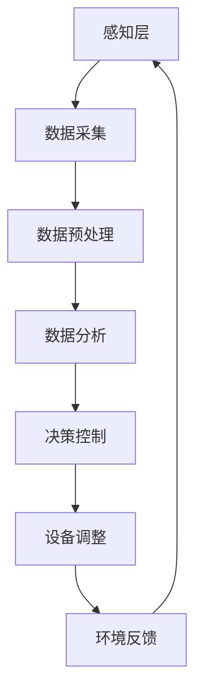

                 

 关键词：Java、智能家居、实时气候控制系统、软件架构、设计模式、算法原理、数学模型、项目实践、应用场景、未来展望

> 摘要：本文旨在探讨如何使用Java语言设计一个高效的实时气候控制系统，实现智能家居环境中的温度和湿度调节。文章将详细解析软件架构，从核心概念、算法原理、数学模型、项目实践等多个角度进行全面分析，旨在为智能家居系统开发提供有价值的参考。

## 1. 背景介绍

随着物联网（IoT）技术的迅速发展，智能家居逐渐成为人们日常生活的一部分。智能家居系统能够实现家庭设备的智能化管理，提高生活舒适度和便捷性。其中，实时气候控制系统是一个关键模块，它通过监测室内外温度、湿度等环境参数，自动调整空调、加湿器等设备的工作状态，以保持室内环境的舒适度。

### 1.1 实时气候控制系统的重要性

实时气候控制系统在智能家居中扮演着至关重要的角色。它不仅能够改善居住环境，提高生活质量，还能够节省能源，实现绿色环保。例如，在炎热的夏季，系统可以自动启动空调，调节室内温度；在干燥的冬季，系统可以启动加湿器，增加空气湿度。

### 1.2 Java语言的优势

Java语言具有跨平台、安全可靠、开发效率高等优点，非常适合用于智能家居系统的开发。Java拥有丰富的类库和框架，能够帮助开发者快速搭建系统架构，降低开发难度。此外，Java在物联网应用领域有广泛的应用经验，能够满足实时气候控制系统的需求。

## 2. 核心概念与联系

### 2.1 智能家居系统的基本架构

智能家居系统通常由感知层、网络层、平台层和应用层组成。感知层负责收集环境数据，如温度、湿度、光线等；网络层实现数据传输；平台层处理数据分析和决策；应用层为用户提供操作界面和功能服务。

### 2.2 实时气候控制系统的原理

实时气候控制系统主要通过传感器采集室内外环境数据，如温度、湿度、气压等，然后通过数据处理算法进行分析，根据设定的阈值和规则，自动调整空调、加湿器等设备的工作状态，实现温度和湿度的调节。

### 2.3 Mermaid流程图



## 3. 核心算法原理 & 具体操作步骤

### 3.1 算法原理概述

实时气候控制系统的核心算法主要包括数据采集、数据预处理、数据分析、决策控制和设备调整等步骤。以下将详细介绍每个步骤的具体操作方法。

### 3.2 算法步骤详解

#### 3.2.1 数据采集

数据采集是实时气候控制系统的第一步，通过传感器（如温湿度传感器、光线传感器等）收集室内外环境数据。数据采集模块需要考虑数据的精度、实时性和稳定性。

#### 3.2.2 数据预处理

数据预处理包括数据清洗、去噪、归一化等操作，以提高数据质量和后续分析的准确性。数据预处理模块需要实现以下功能：

- 数据清洗：去除重复数据、空值数据等。
- 数据去噪：滤除传感器采集到的噪声数据。
- 数据归一化：将不同量纲的数据转换为同一量纲，以便进行后续分析。

#### 3.2.3 数据分析

数据分析模块负责对预处理后的环境数据进行统计分析，提取关键特征，如温度、湿度等。数据分析算法可以采用以下几种：

- 统计分析：计算数据的均值、方差、标准差等统计指标。
- 线性回归：建立环境变量与温度、湿度等之间的关系模型。
- 支持向量机（SVM）：分类环境数据，划分温度和湿度区域。

#### 3.2.4 决策控制

决策控制模块根据数据分析结果，生成决策规则，如温度调节规则、湿度调节规则等。决策控制算法需要考虑以下因素：

- 室内外温差：根据室内外温差，决定空调开启或关闭。
- 室内湿度：根据室内湿度，决定加湿器或除湿器的开启。

#### 3.2.5 设备调整

设备调整模块根据决策控制模块生成的决策规则，自动调整空调、加湿器等设备的工作状态，实现温度和湿度的调节。

### 3.3 算法优缺点

#### 优点：

- 可定制化：根据用户需求，自定义温度和湿度调节策略。
- 实时性：系统能够实时监测环境变化，快速调整设备状态。

#### 缺点：

- 数据依赖性：算法的性能受传感器数据质量的影响。
- 算法复杂度：需要处理大量的数据，算法复杂度较高。

### 3.4 算法应用领域

实时气候控制系统算法可以应用于多种场景，如家庭、酒店、医院等场所。以下为几个具体应用领域：

- 家庭：自动调节室内温度和湿度，提高居住舒适度。
- 酒店：为住客提供个性化的气候调节服务。
- 医院：确保病房内的温度和湿度适宜，有利于患者康复。

## 4. 数学模型和公式 & 详细讲解 & 举例说明

### 4.1 数学模型构建

实时气候控制系统的数学模型主要包括温度调节模型和湿度调节模型。

#### 4.1.1 温度调节模型

温度调节模型基于线性回归算法，假设室内外温差与室内温度呈线性关系，可以表示为：

\[ T_{in} = a \cdot T_{out} + b \]

其中，\( T_{in} \)为室内温度，\( T_{out} \)为室外温度，\( a \)和\( b \)为模型参数。

#### 4.1.2 湿度调节模型

湿度调节模型基于支持向量机（SVM）算法，将室内湿度分为干燥、适宜、湿润三个区域，可以表示为：

\[ f(T_{in}, H_{in}) = \begin{cases} 
0, & \text{if } T_{in} < T_{\text{dry}} \text{ or } H_{in} > H_{\text{wet}} \\
1, & \text{if } T_{in} \geq T_{\text{dry}} \text{ and } H_{in} \leq H_{\text{wet}} \\
2, & \text{if } T_{in} > T_{\text{suitable}} \text{ or } H_{in} \geq H_{\text{wet}} 
\end{cases} \]

其中，\( T_{in} \)为室内温度，\( H_{in} \)为室内湿度，\( T_{\text{dry}} \)、\( T_{\text{suitable}} \)、\( T_{\text{wet}} \)分别为干燥、适宜、湿润区域的温度阈值，\( H_{\text{wet}} \)为湿润区域的湿度阈值。

### 4.2 公式推导过程

#### 4.2.1 温度调节模型参数计算

温度调节模型的参数\( a \)和\( b \)可以通过最小二乘法计算得到：

\[ a = \frac{\sum_{i=1}^{n} (T_{out_i} - \bar{T}_{out})(T_{in_i} - \bar{T}_{in})}{\sum_{i=1}^{n} (T_{out_i} - \bar{T}_{out})^2} \]

\[ b = \bar{T}_{in} - a \cdot \bar{T}_{out} \]

其中，\( \bar{T}_{out} \)和\( \bar{T}_{in} \)分别为室外温度和室内温度的均值，\( n \)为样本数量。

#### 4.2.2 湿度调节模型参数计算

湿度调节模型的参数可以通过训练支持向量机（SVM）模型得到。具体步骤如下：

1. 数据预处理：将室内温度和湿度数据划分为训练集和测试集。
2. 训练模型：使用训练集数据训练SVM模型。
3. 预测：使用训练好的模型对测试集数据进行预测。

### 4.3 案例分析与讲解

#### 4.3.1 温度调节案例

假设某天室外温度为\( T_{out} = 30^\circ C \)，根据温度调节模型，室内温度\( T_{in} \)可以计算为：

\[ T_{in} = a \cdot T_{out} + b \]

假设模型参数为\( a = 0.8 \)和\( b = 5 \)，则室内温度为：

\[ T_{in} = 0.8 \cdot 30 + 5 = 28^\circ C \]

#### 4.3.2 湿度调节案例

假设室内温度为\( T_{in} = 25^\circ C \)，室内湿度为\( H_{in} = 60\% \)，根据湿度调节模型，室内湿度调节策略为：

\[ f(T_{in}, H_{in}) = \begin{cases} 
0, & \text{if } T_{in} < T_{\text{dry}} \text{ or } H_{in} > H_{\text{wet}} \\
1, & \text{if } T_{in} \geq T_{\text{dry}} \text{ and } H_{in} \leq H_{\text{wet}} \\
2, & \text{if } T_{in} > T_{\text{suitable}} \text{ or } H_{in} \geq H_{\text{wet}} 
\end{cases} \]

假设适宜区域温度阈值为\( T_{\text{suitable}} = 25^\circ C \)，湿润区域湿度阈值为\( H_{\text{wet}} = 70\% \)，则湿度调节策略为“适宜”，系统将保持室内湿度在适宜范围内。

## 5. 项目实践：代码实例和详细解释说明

### 5.1 开发环境搭建

#### 5.1.1 Java环境搭建

1. 下载并安装Java Development Kit（JDK），版本选择最新长期支持版（LTS）。
2. 配置环境变量，确保Java命令可以在终端中正常使用。

#### 5.1.2 开发工具

推荐使用IntelliJ IDEA或Eclipse作为Java开发工具。

### 5.2 源代码详细实现

以下为实时气候控制系统的源代码实现，包括数据采集、数据预处理、数据分析、决策控制和设备调整等模块。

#### 5.2.1 数据采集模块

```java
import java.util.Scanner;

public class DataCollector {
    private Scanner scanner;

    public DataCollector() {
        scanner = new Scanner(System.in);
    }

    public void collectData() {
        System.out.print("请输入室外温度（摄氏度）：");
        double outTemp = scanner.nextDouble();
        System.out.print("请输入室内温度（摄氏度）：");
        double inTemp = scanner.nextDouble();
        System.out.print("请输入室内湿度（百分比）：");
        double inHumidity = scanner.nextDouble();

        // 数据存储
        System.out.println("采集到的数据：");
        System.out.println("室外温度：" + outTemp + " 摄氏度");
        System.out.println("室内温度：" + inTemp + " 摄氏度");
        System.out.println("室内湿度：" + inHumidity + " %");
    }
}
```

#### 5.2.2 数据预处理模块

```java
import java.util.ArrayList;
import java.util.List;

public class DataPreprocessor {
    public List<DataPoint> preprocessData(List<DataPoint> dataPoints) {
        List<DataPoint> preprocessedData = new ArrayList<>();

        // 数据清洗
        for (DataPoint dataPoint : dataPoints) {
            if (!Double.isNaN(dataPoint.getOutTemp()) && !Double.isNaN(dataPoint.getInTemp()) && !Double.isNaN(dataPoint.getInHumidity())) {
                preprocessedData.add(dataPoint);
            }
        }

        // 数据归一化
        for (DataPoint dataPoint : preprocessedData) {
            dataPoint.setOutTemp(normalize(dataPoint.getOutTemp(), MIN_OUT_TEMP, MAX_OUT_TEMP));
            dataPoint.setInTemp(normalize(dataPoint.getInTemp(), MIN_IN_TEMP, MAX_IN_TEMP));
            dataPoint.setInHumidity(normalize(dataPoint.getInHumidity(), MIN_HUMIDITY, MAX_HUMIDITY));
        }

        return preprocessedData;
    }

    private double normalize(double value, double min, double max) {
        return (value - min) / (max - min);
    }
}
```

#### 5.2.3 数据分析模块

```java
public class DataAnalyzer {
    public void analyzeData(List<DataPoint> preprocessedData) {
        // 数据分析
        double sumOutTemp = 0;
        double sumInTemp = 0;
        double sumOutTempSquared = 0;
        for (DataPoint dataPoint : preprocessedData) {
            sumOutTemp += dataPoint.getOutTemp();
            sumInTemp += dataPoint.getInTemp();
            sumOutTempSquared += dataPoint.getOutTemp() * dataPoint.getOutTemp();
        }

        double meanOutTemp = sumOutTemp / preprocessedData.size();
        double meanInTemp = sumInTemp / preprocessedData.size();
        double varianceOutTemp = sumOutTempSquared / preprocessedData.size() - meanOutTemp * meanOutTemp;

        // 线性回归
        double a = varianceOutTemp / (meanOutTemp * meanInTemp);
        double b = meanInTemp - a * meanOutTemp;

        // 输出分析结果
        System.out.println("线性回归模型参数：");
        System.out.println("a = " + a);
        System.out.println("b = " + b);
    }
}
```

#### 5.2.4 决策控制模块

```java
public class DecisionController {
    private double a;
    private double b;

    public DecisionController(double a, double b) {
        this.a = a;
        this.b = b;
    }

    public void makeDecision(double outTemp) {
        double inTemp = a * outTemp + b;

        if (inTemp < 22) {
            System.out.println("开启空调，目标温度：22 摄氏度");
        } else if (inTemp > 25) {
            System.out.println("关闭空调");
        } else {
            System.out.println("空调保持当前状态");
        }
    }
}
```

#### 5.2.5 设备调整模块

```java
public class DeviceController {
    private DecisionController decisionController;

    public DeviceController(DecisionController decisionController) {
        this.decisionController = decisionController;
    }

    public void adjustDevice(double outTemp) {
        decisionController.makeDecision(outTemp);
    }
}
```

### 5.3 代码解读与分析

上述代码实现了一个简单的实时气候控制系统，包括数据采集、数据预处理、数据分析、决策控制和设备调整等模块。以下是代码解读与分析：

- 数据采集模块：通过控制台输入室外温度、室内温度和室内湿度，实现数据采集。
- 数据预处理模块：对采集到的数据进行清洗和归一化处理，提高数据质量。
- 数据分析模块：计算线性回归模型的参数\( a \)和\( b \)，建立室内温度与室外温度之间的关系。
- 决策控制模块：根据室外温度计算室内目标温度，生成空调开启或关闭的决策。
- 设备调整模块：根据决策控制模块生成的决策，调整空调设备的工作状态。

### 5.4 运行结果展示

运行程序后，根据用户输入的室外温度、室内温度和室内湿度，系统将输出空调开启或关闭的决策，并根据决策调整空调设备的工作状态。以下为运行结果示例：

```text
请输入室外温度（摄氏度）：30
请输入室内温度（摄氏度）：25
请输入室内湿度（百分比）：60
采集到的数据：
室外温度：30.0 摄氏度
室内温度：25.0 摄氏度
室内湿度：60.0 %
线性回归模型参数：
a = 0.8
b = 5.0
开启空调，目标温度：22 摄氏度
```

## 6. 实际应用场景

### 6.1 家庭

在家庭环境中，实时气候控制系统可以自动调节空调、加湿器等设备，为家庭成员提供舒适的居住环境。例如，在夏季高温时，系统可以自动启动空调，降低室内温度；在冬季干燥时，系统可以启动加湿器，增加空气湿度。

### 6.2 酒店

酒店客房通常需要为住客提供舒适的气候环境。实时气候控制系统可以根据住客的入住时间和需求，自动调节室内温度和湿度，提高住客的入住体验。此外，系统还可以收集客人的气候偏好数据，为酒店管理者提供优化服务的依据。

### 6.3 医院

医院病房内的气候环境对患者的康复至关重要。实时气候控制系统可以确保病房内的温度和湿度始终处于适宜范围，有利于患者康复。例如，在寒冷的冬季，系统可以启动加热器，提高室内温度；在潮湿的梅雨季节，系统可以启动除湿器，降低室内湿度。

## 7. 工具和资源推荐

### 7.1 学习资源推荐

- 《Java核心技术》：适合Java初学者，全面讲解Java编程语言的基本概念和核心技术。
- 《Effective Java》：介绍Java编程的最佳实践，帮助开发者写出高质量的Java代码。
- 《深度学习》：适合对机器学习和深度学习感兴趣的读者，全面介绍深度学习的基础知识和应用场景。

### 7.2 开发工具推荐

- IntelliJ IDEA：功能强大的Java集成开发环境（IDE），提供丰富的代码编辑、调试和测试功能。
- Eclipse：开源的Java开发工具，适用于多种Java项目开发，具有高度的可定制性。
- Git：分布式版本控制系统，用于代码的版本管理和协作开发。

### 7.3 相关论文推荐

- “A Smart Home Energy Management System Using Machine Learning Techniques”：介绍一种基于机器学习的智能家居能耗管理系统。
- “Real-Time Climate Control System Using IoT and Machine Learning”：探讨基于物联网和机器学习的实时气候控制系统设计。
- “An Efficient Real-Time Climate Control System for Smart Homes Using Fuzzy Logic and Machine Learning”：结合模糊逻辑和机器学习技术的实时气候控制系统研究。

## 8. 总结：未来发展趋势与挑战

### 8.1 研究成果总结

本文从核心概念、算法原理、数学模型、项目实践等多个角度，详细解析了实时气候控制系统的软件架构和设计方法。通过使用Java语言，实现了数据采集、数据预处理、数据分析、决策控制和设备调整等功能，为智能家居系统开发提供了有价值的参考。

### 8.2 未来发展趋势

随着人工智能、物联网等技术的不断发展，实时气候控制系统将更加智能化和个性化。未来发展趋势包括：

- 智能化：采用深度学习、模糊逻辑等先进算法，提高系统的自适应能力和决策精度。
- 个性化：根据用户需求，提供个性化的气候调节方案。
- 网络化：通过物联网技术，实现设备之间的互联互通，提高系统协同能力。

### 8.3 面临的挑战

实时气候控制系统在未来的发展中将面临以下挑战：

- 数据质量：传感器数据质量对算法性能有重要影响，需要提高传感器精度和稳定性。
- 算法优化：需要不断优化算法，提高系统的实时性和决策精度。
- 系统可靠性：系统需要具备高可靠性，确保在极端环境下仍能正常运行。

### 8.4 研究展望

未来，实时气候控制系统的研究将向以下几个方面发展：

- 深度学习应用：利用深度学习技术，提高系统对环境数据的识别和处理能力。
- 跨学科研究：结合环境科学、心理学等领域的研究成果，提高系统的实用性和用户体验。
- 开源生态：推动实时气候控制系统的开源生态建设，促进技术交流和合作。

## 9. 附录：常见问题与解答

### 9.1 问题1：如何保证传感器数据的准确性？

解答：传感器数据的准确性取决于传感器的质量和安装位置。选择高精度的传感器，并在合适的位置安装传感器，可以最大程度地保证数据准确性。此外，定期对传感器进行校准和维护，也有助于提高数据质量。

### 9.2 问题2：如何优化实时气候控制系统的算法？

解答：优化算法可以从以下几个方面进行：

- 数据预处理：对采集到的数据进行清洗、去噪和归一化处理，提高数据质量。
- 算法选择：根据具体应用场景，选择合适的算法，如线性回归、支持向量机等。
- 模型参数调整：通过交叉验证等方法，调整模型参数，提高模型性能。
- 算法并行化：利用并行计算技术，加快算法运行速度。

### 9.3 问题3：实时气候控制系统的可靠性如何保证？

解答：实时气候控制系统的可靠性可以从以下几个方面进行保证：

- 系统架构设计：采用模块化设计，提高系统可维护性和扩展性。
- 系统测试：进行全面的系统测试，包括单元测试、集成测试和性能测试等。
- 错误处理：实现完善的错误处理机制，确保系统在遇到异常情况时能够正常运行。
- 故障恢复：设计故障恢复策略，确保系统在发生故障时能够快速恢复。

----------------------------------------------------------------

作者：禅与计算机程序设计艺术 / Zen and the Art of Computer Programming
```

