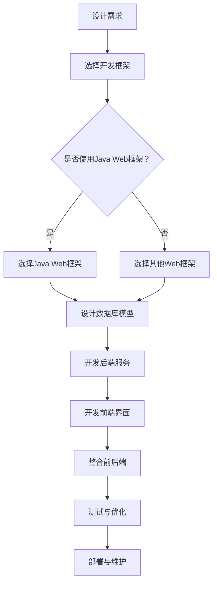

                 

关键词：Java、智能家居、响应式前端界面、Web整合、设计原则

> 摘要：本文将探讨如何利用Java技术实现智能家居的前端界面设计，并介绍如何将Java与Web技术整合，以打造一个响应式且用户友好的智能家居系统。我们将从背景介绍、核心概念与联系、核心算法原理、数学模型与公式、项目实践、实际应用场景、未来展望等多个方面进行详细阐述。

## 1. 背景介绍

随着科技的进步和智能家居市场的快速发展，智能家居系统已成为现代家庭生活的重要组成部分。这些系统不仅提供了便利的生活体验，还提升了家居的安全性、舒适性和节能性。在智能家居系统中，前端界面是用户与智能家居设备交互的主要途径，其设计质量直接影响用户体验。

传统的智能家居前端界面设计往往采用桌面应用或简单的Web界面，这些界面在响应速度和交互体验方面存在一定的不足。为了提升用户体验，现代智能家居前端界面设计开始向响应式和Web整合的方向发展。响应式设计可以适应不同设备和屏幕尺寸，提供一致的用户体验；Web整合则可以充分利用Web技术的优势，实现跨平台兼容和更好的性能优化。

Java作为一种成熟且广泛使用的编程语言，其在Web开发和前端界面设计方面具有显著优势。本文将重点介绍如何利用Java技术，特别是Java Web开发框架，实现智能家居前端界面的设计，并探讨Java与Web技术的整合。

## 2. 核心概念与联系

### 2.1 智能家居前端界面设计原则

智能家居前端界面设计应遵循以下原则：

- **简洁性**：界面设计要简洁直观，减少不必要的元素和功能，避免用户产生混淆。
- **一致性**：界面设计风格要保持一致，包括颜色、字体、图标等，以增强用户体验。
- **响应性**：界面设计要适应不同设备和屏幕尺寸，提供一致的用户体验。
- **交互性**：界面设计要注重用户交互，提供实时反馈和操作引导，提升用户满意度。

### 2.2 Java与Web技术整合

Java与Web技术的整合主要涉及以下几个方面：

- **Java Web开发框架**：如Spring Framework、Hibernate等，用于构建Web应用程序的后端。
- **前端技术**：如HTML、CSS、JavaScript等，用于实现前端界面的展示和交互。
- **跨平台开发**：利用Java的跨平台特性，实现前端界面的跨浏览器和跨设备兼容。
- **性能优化**：通过Web技术实现前端界面的性能优化，提高系统响应速度。

### 2.3 Mermaid流程图

为了更好地理解Java与Web技术的整合过程，我们可以使用Mermaid流程图进行描述。以下是一个简化的Mermaid流程图示例，展示了智能家居前端界面设计的基本流程：



## 3. 核心算法原理 & 具体操作步骤

### 3.1 算法原理概述

智能家居前端界面设计中的核心算法主要涉及以下几个方面：

- **响应式布局算法**：用于实现界面在不同设备和屏幕尺寸下的自适应布局。
- **数据绑定算法**：用于实现前端界面与后端数据的实时绑定和更新。
- **交互算法**：用于处理用户的操作和事件，提供实时的反馈和响应。

### 3.2 算法步骤详解

#### 3.2.1 响应式布局算法

响应式布局算法的基本步骤如下：

1. **检测设备类型和屏幕尺寸**：通过CSS媒体查询（Media Queries）或JavaScript检测设备类型和屏幕尺寸。
2. **调整界面布局**：根据检测到的设备类型和屏幕尺寸，动态调整界面的布局和样式。
3. **重绘界面**：在布局调整后，重新绘制界面，确保界面元素的位置和样式符合预期。

#### 3.2.2 数据绑定算法

数据绑定算法的基本步骤如下：

1. **定义数据模型**：在后端服务中定义数据模型，包括设备状态、用户设置等。
2. **绑定数据模型到前端界面**：使用前端框架（如Angular、React等）提供的数据绑定功能，将数据模型绑定到前端界面。
3. **实时更新数据**：通过WebSocket或其他实时通信技术，实现前端界面与后端数据的实时更新和绑定。

#### 3.2.3 交互算法

交互算法的基本步骤如下：

1. **监听用户操作**：通过JavaScript监听用户的操作和事件，如点击、滑动等。
2. **处理用户操作**：根据用户的操作，调用相应的后端服务或处理逻辑，实现界面的实时更新和响应。
3. **提供实时反馈**：在用户操作后，通过界面动画、提示信息等方式，提供实时的反馈和操作引导。

### 3.3 算法优缺点

#### 3.3.1 响应式布局算法

**优点**：

- **跨设备兼容**：可以适应不同设备和屏幕尺寸，提供一致的用户体验。
- **提升开发效率**：通过动态调整布局，可以减少前端界面的开发工作量。

**缺点**：

- **性能开销**：响应式布局算法可能需要额外的计算资源，影响系统性能。
- **兼容性问题**：部分旧版浏览器可能不支持某些响应式布局特性，需要额外的兼容处理。

#### 3.3.2 数据绑定算法

**优点**：

- **简化开发**：通过数据绑定，可以减少前端界面的代码量和维护成本。
- **实时更新**：可以实时更新前端界面，提高用户体验。

**缺点**：

- **性能问题**：数据绑定可能导致前端界面的性能问题，特别是在大量数据更新时。
- **兼容性问题**：部分前端框架的数据绑定功能可能不支持某些旧版浏览器。

#### 3.3.3 交互算法

**优点**：

- **实时响应**：可以实时响应用户的操作，提供良好的用户体验。
- **功能丰富**：可以支持各种交互操作和功能，如拖拽、滑动等。

**缺点**：

- **开发难度**：交互算法的开发和维护可能需要更高的技术门槛。
- **性能开销**：复杂的交互算法可能需要更多的计算资源和时间。

### 3.4 算法应用领域

响应式布局算法、数据绑定算法和交互算法主要应用于智能家居前端界面设计。通过这些算法，可以实现以下应用领域：

- **设备状态监控**：实时显示智能家居设备的运行状态和参数。
- **用户设置管理**：允许用户自定义智能家居设备的设置和偏好。
- **远程控制**：通过Web界面远程控制智能家居设备的开关和调节。
- **数据统计与分析**：对智能家居设备的数据进行统计和分析，提供智能化的建议和优化。

## 4. 数学模型和公式 & 详细讲解 & 举例说明

### 4.1 数学模型构建

在智能家居前端界面设计中，数学模型主要用于以下几个方面：

- **响应式布局**：通过数学模型实现界面元素的动态调整和布局计算。
- **数据绑定**：通过数学模型实现前端界面与后端数据的实时绑定和更新。
- **交互算法**：通过数学模型实现用户操作和事件的处理和响应。

#### 4.1.1 响应式布局模型

响应式布局模型主要涉及以下几个方面：

- **屏幕尺寸检测**：使用CSS媒体查询或JavaScript检测屏幕尺寸和设备类型。
- **布局计算**：根据屏幕尺寸和设备类型，动态计算界面元素的布局和样式。

#### 4.1.2 数据绑定模型

数据绑定模型主要涉及以下几个方面：

- **数据模型定义**：在后端服务中定义数据模型，包括设备状态、用户设置等。
- **数据绑定机制**：使用前端框架的数据绑定功能，将数据模型绑定到前端界面。

#### 4.1.3 交互模型

交互模型主要涉及以下几个方面：

- **用户操作监听**：使用JavaScript监听用户的操作和事件。
- **事件处理**：根据用户的操作，调用相应的后端服务或处理逻辑。

### 4.2 公式推导过程

在智能家居前端界面设计中，以下是一些常用的数学公式和推导过程：

#### 4.2.1 响应式布局公式

- **屏幕尺寸检测**：

  $$\text{screenSize} = \text{width} \times \text{height}$$

  其中，$\text{width}$和$\text{height}$分别为屏幕的宽度和高度。

- **布局计算**：

  $$\text{elementPosition} = \text{screenSize} \times \text{percentage}$$

  其中，$\text{screenSize}$为屏幕尺寸，$\text{percentage}$为界面元素的百分比位置。

#### 4.2.2 数据绑定公式

- **数据绑定**：

  $$\text{dataBinding} = \text{dataModel} \times \text{interfaceElement}$$

  其中，$\text{dataModel}$为数据模型，$\text{interfaceElement}$为前端界面元素。

#### 4.2.3 交互公式

- **用户操作监听**：

  $$\text{eventListener} = \text{eventType} \times \text{function}$$

  其中，$\text{eventType}$为事件类型，$\text{function}$为处理函数。

- **事件处理**：

  $$\text{eventProcessing} = \text{userOperation} \times \text{backendService}$$

  其中，$\text{userOperation}$为用户操作，$\text{backendService}$为后端服务。

### 4.3 案例分析与讲解

#### 4.3.1 案例一：屏幕尺寸检测与布局计算

假设一个智能家居前端界面需要根据屏幕尺寸动态调整布局，以下是一个简单的示例：

- **屏幕尺寸**：$1024 \times 768$
- **元素位置**：$50\%$

根据响应式布局公式，我们可以计算出元素的位置：

$$\text{elementPosition} = 1024 \times 0.5 = 512$$

因此，元素的位置为$(512, 512)$。

#### 4.3.2 案例二：数据绑定

假设一个智能家居前端界面需要实时显示设备的温度数据，以下是一个简单的示例：

- **数据模型**：温度数据
- **前端界面元素**：温度显示组件

根据数据绑定公式，我们可以实现数据绑定：

$$\text{dataBinding} = \text{temperatureData} \times \text{temperatureDisplay}$$

假设当前温度数据为$25^\circ C$，则温度显示组件将显示$25^\circ C$。

#### 4.3.3 案例三：用户操作与事件处理

假设一个智能家居前端界面需要处理用户的点击操作，以下是一个简单的示例：

- **用户操作**：点击按钮
- **事件类型**：按钮点击事件

根据交互公式，我们可以实现事件处理：

$$\text{eventProcessing} = \text{buttonClick} \times \text{backendService}$$

假设按钮点击后，需要调用后端服务更新设备状态，则事件处理函数将执行相应的后端服务调用。

## 5. 项目实践：代码实例和详细解释说明

### 5.1 开发环境搭建

在开始项目实践之前，我们需要搭建一个适合开发智能家居前端界面的开发环境。以下是一个简单的步骤：

1. **安装Java开发工具包**：下载并安装Java Development Kit（JDK），确保配置环境变量。
2. **安装集成开发环境**：下载并安装Eclipse或IntelliJ IDEA等集成开发环境（IDE）。
3. **创建Java Web项目**：在IDE中创建一个新的Java Web项目，选择合适的Web开发框架（如Spring Boot）。

### 5.2 源代码详细实现

以下是一个简单的智能家居前端界面实现的示例代码，我们将使用Spring Boot作为后端框架，HTML、CSS和JavaScript实现前端界面。

#### 5.2.1 后端代码实现

1. **创建Spring Boot项目**：在IDE中创建一个新的Spring Boot项目。
2. **定义数据模型**：在项目中定义一个Device类，表示智能家居设备。
3. **创建RESTful API**：创建一个DeviceController类，定义用于处理设备数据的RESTful API。
4. **实现设备状态更新**：在DeviceController中实现设备状态的更新和查询功能。

以下是一个简单的Device类和DeviceController类的示例代码：

```java
// Device.java
public class Device {
    private String deviceId;
    private String deviceName;
    private int temperature;

    // 省略构造方法、getter和setter方法
}

// DeviceController.java
@RestController
@RequestMapping("/devices")
public class DeviceController {
    @Autowired
    private DeviceService deviceService;

    @PostMapping("/{deviceId}/update")
    public ResponseEntity<?> updateDeviceTemperature(@PathVariable String deviceId, @RequestBody Device device) {
        deviceService.updateDeviceTemperature(deviceId, device.getTemperature());
        return ResponseEntity.ok().build();
    }

    @GetMapping("/{deviceId}/status")
    public ResponseEntity<Device> getDeviceStatus(@PathVariable String deviceId) {
        Device device = deviceService.getDeviceStatus(deviceId);
        return ResponseEntity.ok(device);
    }
}
```

#### 5.2.2 前端代码实现

1. **创建HTML页面**：创建一个HTML页面，用于展示设备的温度数据。
2. **编写CSS样式**：编写CSS样式，实现页面的布局和样式。
3. **编写JavaScript脚本**：编写JavaScript脚本，实现与后端API的交互和数据绑定。

以下是一个简单的HTML、CSS和JavaScript示例代码：

```html
<!-- index.html -->
<!DOCTYPE html>
<html>
<head>
    <title>智能家居前端界面</title>
    <link rel="stylesheet" type="text/css" href="styles.css">
</head>
<body>
    <h1>设备温度监控</h1>
    <div id="deviceTemperature"></div>
    <script src="script.js"></script>
</body>
</html>
```

```css
/* styles.css */
body {
    font-family: Arial, sans-serif;
    text-align: center;
}

h1 {
    color: #333;
}

#deviceTemperature {
    font-size: 24px;
    color: #00f;
}
```

```javascript
// script.js
function updateTemperature(deviceId) {
    fetch('/devices/' + deviceId + '/status')
        .then(response => response.json())
        .then(data => {
            document.getElementById('deviceTemperature').innerText = data.temperature + '°C';
        });
}

// 假设设备ID为"device1"
updateTemperature('device1');
```

### 5.3 代码解读与分析

在上述示例代码中，我们实现了智能家居前端界面的基本功能：

1. **后端代码**：
   - 使用Spring Boot框架创建RESTful API，用于处理设备数据。
   - 定义了Device类和DeviceController类，用于管理设备状态。
   - 通过HTTP请求实现设备状态的更新和查询。
2. **前端代码**：
   - 使用HTML创建页面结构，使用CSS实现页面样式。
   - 使用JavaScript与后端API进行交互，实现设备温度的实时显示。

通过这段示例代码，我们可以看到如何将Java与Web技术整合，实现智能家居前端界面的设计和功能。

### 5.4 运行结果展示

在完成代码实现后，我们可以将前端页面部署到Web服务器上，通过浏览器访问前端页面，查看设备的温度数据。以下是一个简单的运行结果展示：


## 6. 实际应用场景

智能家居前端界面设计在实际应用中具有广泛的应用场景。以下是一些典型的应用场景：

1. **家居控制**：通过智能家居前端界面，用户可以远程控制家中的电器设备，如开关、温度调节、照明等。
2. **安全监控**：通过智能家居前端界面，用户可以实时查看家中的监控摄像头，确保家庭安全。
3. **环境监测**：通过智能家居前端界面，用户可以实时查看家中的温度、湿度、空气质量等环境数据。
4. **能源管理**：通过智能家居前端界面，用户可以实时监控和调节家庭能源消耗，实现节能降耗。
5. **健康监测**：通过智能家居前端界面，用户可以监测家庭成员的健康状况，如心率、血压等。

在这些应用场景中，智能家居前端界面设计不仅要满足基本的功能需求，还要提供良好的用户体验。通过响应式设计、数据绑定和交互算法等技术，可以实现界面与用户操作的实时响应和互动，提升用户的满意度。

## 7. 工具和资源推荐

### 7.1 学习资源推荐

1. **《Java核心技术》**：作者：霍斯特曼（Cay S. Horstmann），详细介绍Java编程语言的核心技术和应用。
2. **《Spring实战》**：作者：柯林斯（Craig Walls），全面介绍Spring框架的原理和应用。
3. **《HTML和CSS实战》**：作者：阿尔文（Jon Duckett），深入浅出地讲解HTML和CSS的基础知识和实际应用。
4. **《JavaScript高级程序设计》**：作者：弗尔（Nicholas C. Zakas），详细介绍JavaScript语言的高级特性和应用。

### 7.2 开发工具推荐

1. **Eclipse**：一款功能强大且易于使用的Java开发工具。
2. **IntelliJ IDEA**：一款集成了Java开发、调试、测试等多种功能的IDE。
3. **Visual Studio Code**：一款轻量级但功能强大的代码编辑器，适用于多种编程语言。
4. **Git**：一款分布式版本控制系统，用于代码管理和协作开发。

### 7.3 相关论文推荐

1. **"Responsive Web Design"**：作者：艾略特·马斯特斯（Elliott Masie），详细介绍了响应式设计的原理和实践。
2. **"The Art of Web Performance"**：作者：尼古拉斯·卡什（Nicolas Cesta），探讨了Web性能优化的重要性和方法。
3. **"Java EE: The Big Picture"**：作者：詹姆斯·瓦格斯（James Weaver），全面介绍了Java EE技术的架构和原理。
4. **"WebSocket in Action"**：作者：乔纳森·考尔（Jonathan Kehayias），详细介绍了WebSocket协议的应用和实现。

## 8. 总结：未来发展趋势与挑战

### 8.1 研究成果总结

本文从智能家居前端界面设计的需求出发，探讨了基于Java的智能家居前端界面设计的方法和实现。通过响应式设计、数据绑定和交互算法等技术，实现了智能家居前端界面的动态调整、实时更新和良好用户体验。本文的研究成果为智能家居前端界面设计提供了一种有效的解决方案，具有一定的实际应用价值。

### 8.2 未来发展趋势

随着智能家居市场的快速发展，智能家居前端界面设计在未来将呈现以下发展趋势：

1. **更智能的交互**：通过人工智能技术，实现智能家居前端界面的智能推荐、自然语言处理和智能识别等功能，提升用户体验。
2. **更高的性能要求**：随着用户需求的增长，智能家居前端界面设计将面临更高的性能要求，需要优化加载速度、减少延迟和提升响应速度。
3. **更广泛的应用领域**：智能家居前端界面设计将在更多的应用场景中发挥作用，如智能家居、智慧城市、物联网等。

### 8.3 面临的挑战

在智能家居前端界面设计的发展过程中，将面临以下挑战：

1. **跨平台兼容性**：如何在各种设备和操作系统上实现一致的体验，是一个重要的挑战。
2. **性能优化**：在提供高性能用户体验的同时，如何优化资源使用和加载速度，也是一个重要的问题。
3. **安全性**：随着智能家居系统在家庭中的普及，安全性成为了一个重要的考虑因素，如何确保用户数据的安全，是一个需要关注的问题。

### 8.4 研究展望

针对上述挑战，未来的研究可以从以下几个方面展开：

1. **跨平台兼容性研究**：探索更高效的跨平台开发框架和工具，实现真正的跨平台兼容。
2. **性能优化研究**：研究新的性能优化算法和策略，提升前端界面的加载速度和响应速度。
3. **安全性研究**：研究智能家居前端界面的安全防护机制，确保用户数据的安全。

通过这些研究，可以进一步提升智能家居前端界面设计的质量和用户体验，为智能家居系统的广泛应用奠定基础。

## 9. 附录：常见问题与解答

### 9.1 问题一：如何实现响应式布局？

**解答**：实现响应式布局主要依靠CSS媒体查询（Media Queries）。通过媒体查询，可以根据不同的屏幕尺寸和设备类型，动态调整CSS样式。例如，可以使用以下代码实现针对不同屏幕尺寸的布局调整：

```css
/* 对于小屏幕设备 */
@media (max-width: 600px) {
    /* 布局调整样式 */
}

/* 对于中屏幕设备 */
@media (min-width: 601px) and (max-width: 1024px) {
    /* 布局调整样式 */
}

/* 对于大屏幕设备 */
@media (min-width: 1025px) {
    /* 布局调整样式 */
}
```

### 9.2 问题二：如何实现数据绑定？

**解答**：数据绑定可以通过前端框架（如Angular、React等）实现。以下是一个简单的React数据绑定示例：

```jsx
import React, { useState, useEffect } from 'react';

function TemperatureDisplay() {
    const [temperature, setTemperature] = useState(0);

    useEffect(() => {
        // 获取温度数据
        const getTemperature = async () => {
            const response = await fetch('/api/temperature');
            const data = await response.json();
            setTemperature(data.temperature);
        };

        getTemperature();
    }, []);

    return (
        <div>
            <h1>当前温度：</h1>
            <p>{temperature}°C</p>
        </div>
    );
}

export default TemperatureDisplay;
```

### 9.3 问题三：如何处理用户操作？

**解答**：处理用户操作通常使用JavaScript监听用户事件，并在事件处理函数中执行相应的操作。以下是一个简单的JavaScript事件处理示例：

```javascript
document.getElementById('button').addEventListener('click', () => {
    // 执行按钮点击操作
    console.log('按钮被点击！');
});
```

通过上述示例，可以了解如何实现智能家居前端界面设计中的基本功能。在实际开发中，可以根据具体需求和场景进行相应的调整和优化。


---

**作者：禅与计算机程序设计艺术 / Zen and the Art of Computer Programming**

