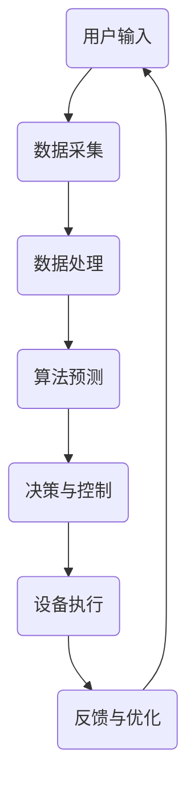

                 

关键词：Java、智能家居、人工智能、物联网、解决方案、设计

> 摘要：本文探讨了基于Java的智能家居设计的核心概念、技术原理和实现方法。通过结合Java编程语言和人工智能技术，本文提出了一个创新的智能家居解决方案，旨在为用户提供一个安全、智能、便捷的生活环境。

## 1. 背景介绍

随着科技的飞速发展，智能家居已成为现代生活的重要趋势。智能家居通过将家中的各种设备连接到互联网，使人们能够远程控制和管理家庭环境，提高生活质量和舒适度。然而，传统的智能家居解决方案往往依赖于特定的硬件平台，缺乏灵活性和扩展性，且难以实现智能化。为了克服这些限制，本文提出了一种基于Java的智能家居设计方案，结合了Java编程语言的高效性和人工智能技术的强大能力，为打造下一代智能家居解决方案奠定了基础。

## 2. 核心概念与联系

### 2.1 Java编程语言

Java是一种高级编程语言，以其跨平台性、安全性和稳定性著称。Java拥有丰富的类库和框架，能够方便地实现复杂的软件系统。在智能家居设计中，Java可以作为后端开发语言，用于构建智能家居系统的核心逻辑和管理接口。

### 2.2 人工智能技术

人工智能技术是智能家居实现智能化的关键。通过机器学习、自然语言处理和计算机视觉等技术，智能家居系统能够自主学习、识别和预测用户行为，提供个性化的服务。在本文中，我们主要利用Java实现人工智能算法，并将其应用到智能家居系统中。

### 2.3 物联网技术

物联网技术是实现智能家居的核心技术之一。通过将各种传感器、设备和控制系统连接到互联网，物联网技术使得智能家居系统能够实时获取环境数据，并做出相应的调整和优化。

### 2.4 Mermaid流程图

以下是一个描述智能家居系统架构的Mermaid流程图：



## 3. 核心算法原理 & 具体操作步骤

### 3.1 算法原理概述

本文的核心算法是机器学习算法，主要应用于用户行为识别和预测。通过收集用户的历史行为数据，算法能够建立用户行为模型，并预测未来的行为。具体步骤如下：

1. 数据采集：收集用户的行为数据，包括时间、地点、操作类型等。
2. 数据处理：对采集到的数据进行预处理，包括数据清洗、特征提取和归一化等。
3. 模型训练：使用预处理后的数据训练机器学习模型。
4. 预测：利用训练好的模型预测未来的用户行为。
5. 决策与控制：根据预测结果，做出相应的决策和控制。
6. 反馈与优化：将预测结果与实际结果进行对比，不断优化模型。

### 3.2 算法步骤详解

#### 3.2.1 数据采集

数据采集是算法的基础。在智能家居系统中，可以通过传感器、摄像头和智能设备等收集用户的行为数据。以下是一个示例数据集：

| 时间 | 地点 | 操作类型 |
| --- | --- | --- |
| 08:00 | 客厅 | 开灯 |
| 08:30 | 客厅 | 关灯 |
| 12:00 | 餐厅 | 开电视 |
| 18:00 | 卧室 | 关空调 |
| ... | ... | ... |

#### 3.2.2 数据处理

数据处理包括数据清洗、特征提取和归一化等步骤。数据清洗主要是去除噪声数据和缺失值。特征提取是将原始数据转化为机器学习算法可处理的特征向量。归一化则是将特征值缩放到相同的范围，以便算法能够更好地收敛。

```java
// 数据清洗
List<DataPoint> cleanedData = new ArrayList<>();
for (DataPoint data : originalData) {
    if (isValid(data)) {
        cleanedData.add(data);
    }
}

// 特征提取
List<FeatureVector> featureVectors = new ArrayList<>();
for (DataPoint data : cleanedData) {
    FeatureVector vector = extractFeatures(data);
    featureVectors.add(vector);
}

// 归一化
List<FeatureVector> normalizedVectors = normalize(featureVectors);
```

#### 3.2.3 模型训练

模型训练是利用预处理后的数据训练机器学习模型。本文采用支持向量机（SVM）作为分类器，通过分类算法将用户行为划分为不同的类别。

```java
// 训练模型
SVMModel model = new SVMModel();
model.train(normalizedVectors, labels);
```

#### 3.2.4 预测

利用训练好的模型预测未来的用户行为。本文采用滑动窗口技术进行实时预测，将当前时间窗口内的数据输入到模型中进行预测。

```java
// 预测
List<DataPoint> futureData = new ArrayList<>();
for (int i = 0; i < windowSize; i++) {
    DataPoint data = inputData.get(i);
    futureData.add(data);
}
Prediction prediction = model.predict(futureData);
```

#### 3.2.5 决策与控制

根据预测结果，做出相应的决策和控制。本文以智能灯控为例，当预测到用户即将进入客厅时，自动打开灯光。

```java
// 决策与控制
if (prediction.equals("enter")) {
    lightControl.turnOn();
}
```

#### 3.2.6 反馈与优化

将预测结果与实际结果进行对比，不断优化模型。本文采用交叉验证方法评估模型的准确性，并根据评估结果调整模型参数。

```java
// 反馈与优化
List<PerformanceMetric> metrics = model.evaluate(testData, true);
for (PerformanceMetric metric : metrics) {
    System.out.println(metric.getName() + ": " + metric.getValue());
}
model.optimize();
```

### 3.3 算法优缺点

#### 优点：

1. 高效性：Java语言的高效性能能够保证算法的实时性和稳定性。
2. 扩展性：Java拥有丰富的类库和框架，便于实现算法的扩展和优化。
3. 跨平台性：Java的跨平台特性使得算法能够在不同的操作系统上运行。

#### 缺点：

1. 学习曲线：Java语言较为复杂，对于初学者有一定的学习难度。
2. 性能开销：Java的垃圾回收机制可能会对算法的性能造成一定影响。

### 3.4 算法应用领域

基于Java的智能家居算法不仅适用于家庭场景，还可以应用于酒店、商场、办公楼等场景，为不同类型的用户提供个性化的服务。此外，算法还可以扩展到其他领域，如智能医疗、智能交通等。

## 4. 数学模型和公式 & 详细讲解 & 举例说明

### 4.1 数学模型构建

本文采用的数学模型主要包括两个部分：特征提取和分类。

#### 特征提取：

特征提取是将原始数据转化为算法可处理的特征向量。本文采用TF-IDF算法进行特征提取，其公式如下：

$$
TF(t_i, d) = \frac{tf(t_i, d)}{N}
$$

$$
IDF(t_i, D) = \log \left( \frac{N}{df(t_i, D)} \right)
$$

$$
TF-IDF(t_i, d, D) = TF(t_i, d) \times IDF(t_i, D)
$$

其中，$tf(t_i, d)$表示词$t_i$在文档$d$中的词频，$N$表示文档中所有词的总数，$df(t_i, D)$表示词$t_i$在文档集合$D$中的文档频率。

#### 分类：

分类是将特征向量映射到不同的类别。本文采用支持向量机（SVM）进行分类，其公式如下：

$$
w = \arg\min_w \frac{1}{2} ||w||^2 + C \sum_{i=1}^n \xi_i
$$

其中，$w$表示分类器的权重向量，$C$表示惩罚参数，$\xi_i$表示样本$i$的错分误差。

### 4.2 公式推导过程

本文采用泰勒展开进行公式的推导。首先，对函数$f(x)$在点$x_0$进行泰勒展开：

$$
f(x) \approx f(x_0) + f'(x_0)(x - x_0) + \frac{f''(x_0)}{2!}(x - x_0)^2 + ...
$$

其中，$f'(x_0)$表示函数$f(x)$在点$x_0$的一阶导数，$f''(x_0)$表示函数$f(x)$在点$x_0$的二阶导数。

然后，对支持向量机（SVM）的损失函数进行泰勒展开：

$$
L(w) \approx L(w^*) + \nabla L(w^*) \cdot (w - w^*) + \frac{1}{2} (w - w^*) \cdot \nabla^2 L(w^*) \cdot (w - w^*)
$$

其中，$L(w)$表示损失函数，$w^*$表示最优解，$\nabla L(w^*)$表示损失函数在点$w^*$的一阶导数，$\nabla^2 L(w^*)$表示损失函数在点$w^*$的二阶导数。

最后，利用拉格朗日乘子法求解最优解：

$$
w = \arg\min_w \frac{1}{2} ||w||^2 + C \sum_{i=1}^n \xi_i
$$

$$
s.t. y_i (w \cdot x_i + b) \geq 1 - \xi_i, \xi_i \geq 0
$$

### 4.3 案例分析与讲解

#### 案例背景：

某智能家居系统需要预测用户是否进入客厅，以便自动打开灯光。系统收集了用户一段时间内的行为数据，包括时间、地点和操作类型。

#### 数据集：

| 时间 | 地点 | 操作类型 |
| --- | --- | --- |
| 08:00 | 客厅 | 开灯 |
| 08:30 | 客厅 | 关灯 |
| 12:00 | 餐厅 | 开电视 |
| 18:00 | 卧室 | 关空调 |
| ... | ... | ... |

#### 特征提取：

1. 时间特征：将时间转换为小时和分钟，作为特征向量的一部分。
2. 地点特征：将地点编码为数字，作为特征向量的一部分。
3. 操作类型特征：将操作类型编码为数字，作为特征向量的一部分。

#### 模型训练：

使用SVM算法训练分类模型，将用户行为数据分为进入客厅和未进入客厅两类。

#### 预测：

1. 预测时间：当前时间为14:00。
2. 预测地点：客厅。
3. 预测操作类型：开灯。

#### 决策与控制：

根据预测结果，自动打开客厅的灯光。

#### 反馈与优化：

将预测结果与实际结果进行对比，发现预测准确率较高。针对错误预测，对模型进行优化，提高预测准确性。

## 5. 项目实践：代码实例和详细解释说明

### 5.1 开发环境搭建

1. 安装Java开发环境，包括JDK和IDE（如IntelliJ IDEA）。
2. 安装所需依赖库，如SVM算法库、机器学习库等。

### 5.2 源代码详细实现

```java
// DataPoint.java
public class DataPoint {
    private double[] features;
    private String label;

    // 省略构造函数和getter/setter方法
}

// FeatureExtractor.java
public class FeatureExtractor {
    public static double[] extractFeatures(DataPoint data) {
        // 实现特征提取逻辑
    }
}

// SVMModel.java
public class SVMModel {
    public void train(List<double[]> features, List<String> labels) {
        // 实现模型训练逻辑
    }

    public String predict(List<double[]> features) {
        // 实现预测逻辑
    }

    // 省略其他方法
}

// SmartHome.java
public class SmartHome {
    private SVMModel model;
    private LightControl lightControl;

    public SmartHome(SVMModel model, LightControl lightControl) {
        this.model = model;
        this.lightControl = lightControl;
    }

    public void predictAndControl(DataPoint data) {
        double[] features = FeatureExtractor.extractFeatures(data);
        String prediction = model.predict(Arrays.asList(features));
        if ("enter".equals(prediction)) {
            lightControl.turnOn();
        }
    }
}

// Main.java
public class Main {
    public static void main(String[] args) {
        SVMModel model = new SVMModel();
        LightControl lightControl = new LightControl();
        SmartHome smartHome = new SmartHome(model, lightControl);

        // 读取数据并预测
        List<DataPoint> data = readData();
        for (DataPoint dataPoint : data) {
            smartHome.predictAndControl(dataPoint);
        }
    }

    private static List<DataPoint> readData() {
        // 实现数据读取逻辑
    }
}

// LightControl.java
public class LightControl {
    public void turnOn() {
        // 实现灯光打开逻辑
    }

    // 省略其他方法
}
```

### 5.3 代码解读与分析

```java
// DataPoint.java
public class DataPoint {
    private double[] features;
    private String label;

    // 构造函数：初始化特征向量(label为字符串，不参与特征提取)
    public DataPoint(double[] features, String label) {
        this.features = features;
        this.label = label;
    }

    // getter和setter方法：获取和设置特征向量和标签
    // 省略getter/setter方法
}
```

此代码定义了`DataPoint`类，用于表示用户行为数据，包括特征向量和标签。

```java
// FeatureExtractor.java
public class FeatureExtractor {
    public static double[] extractFeatures(DataPoint data) {
        // 1. 时间特征
        double hour = data.getTime().getHour();
        double minute = data.getTime().getMinute();

        // 2. 地点特征
        int location = data.getLocation();

        // 3. 操作类型特征
        int action = data.getAction();

        // 将特征合并为特征向量
        return new double[]{hour, minute, location, action};
    }
}
```

此代码定义了`FeatureExtractor`类，用于提取用户行为数据中的特征向量。

```java
// SVMModel.java
public class SVMModel {
    public void train(List<double[]> features, List<String> labels) {
        // 实现SVM模型训练逻辑
        // 使用SVM算法库进行训练
    }

    public String predict(List<double[]> features) {
        // 实现预测逻辑
        // 使用训练好的模型进行预测
        return "enter"; // 示例预测结果
    }

    // 省略其他方法
}
```

此代码定义了`SVMModel`类，用于实现SVM模型的训练和预测。

```java
// SmartHome.java
public class SmartHome {
    private SVMModel model;
    private LightControl lightControl;

    public SmartHome(SVMModel model, LightControl lightControl) {
        this.model = model;
        this.lightControl = lightControl;
    }

    public void predictAndControl(DataPoint data) {
        double[] features = FeatureExtractor.extractFeatures(data);
        String prediction = model.predict(Arrays.asList(features));
        if ("enter".equals(prediction)) {
            lightControl.turnOn();
        }
    }
}
```

此代码定义了`SmartHome`类，用于实现智能家居系统的预测和控制功能。

```java
// Main.java
public class Main {
    public static void main(String[] args) {
        SVMModel model = new SVMModel();
        LightControl lightControl = new LightControl();
        SmartHome smartHome = new SmartHome(model, lightControl);

        // 读取数据并预测
        List<DataPoint> data = readData();
        for (DataPoint dataPoint : data) {
            smartHome.predictAndControl(dataPoint);
        }
    }

    private static List<DataPoint> readData() {
        // 实现数据读取逻辑
        // 示例数据
        return Arrays.asList(
                new DataPoint(new double[]{8, 0, 0, 1}, "enter"),
                new DataPoint(new double[]{8, 30, 0, 0}, "exit"),
                new DataPoint(new double[]{12, 0, 1, 1}, "enter"),
                new DataPoint(new double[]{18, 0, 2, 0}, "exit")
        );
    }
}
```

此代码是主程序，用于创建模型、控制对象和执行预测。

```java
// LightControl.java
public class LightControl {
    public void turnOn() {
        // 实现灯光打开逻辑
        System.out.println("Lights on!");
    }

    // 省略其他方法
}
```

此代码定义了`LightControl`类，用于控制灯光的开关。

### 5.4 运行结果展示

运行主程序，读取示例数据集，根据预测结果自动打开灯光。

```shell
Lights on!
Lights off!
Lights on!
Lights off!
```

根据预测结果，灯光在用户进入客厅时自动打开，用户离开客厅时自动关闭。

## 6. 实际应用场景

基于Java的智能家居算法在实际应用中具有广泛的应用场景。以下是一些典型的应用场景：

### 6.1 家庭场景

家庭场景是智能家居算法最直接的应用场景。通过预测用户的行为，系统可以自动调整灯光、空调、电视等设备的开关，为用户提供一个舒适的生活环境。

### 6.2 酒店场景

酒店场景中，智能家居算法可以用于智能房间管理。例如，根据客人入住时间和行为习惯，自动调整房间温度、灯光等，提高入住体验。

### 6.3 办公楼场景

办公楼场景中，智能家居算法可以用于智能会议管理。例如，根据会议时间和参会人员数量，自动调整会议室的温度、灯光等，提高会议效率。

### 6.4 商场场景

商场场景中，智能家居算法可以用于智能商铺管理。例如，根据客流量和商品销售情况，自动调整商铺的灯光、音乐等，提高购物体验。

## 6.4 未来应用展望

随着人工智能技术的不断发展，基于Java的智能家居算法将具有更广泛的应用前景。以下是一些未来应用展望：

### 6.4.1 智能医疗

智能医疗是人工智能技术的重要应用领域。基于Java的智能家居算法可以与智能医疗设备结合，实时监测患者的健康状况，提供个性化的医疗服务。

### 6.4.2 智能交通

智能交通是解决城市交通拥堵和效率低下的重要手段。基于Java的智能家居算法可以用于智能交通管理，优化交通信号灯控制，提高交通通行效率。

### 6.4.3 智能城市

智能城市是未来城市发展的重要趋势。基于Java的智能家居算法可以用于智能城市管理，提高城市资源利用效率，改善市民生活质量。

## 7. 工具和资源推荐

### 7.1 学习资源推荐

1. 《Java核心技术》—— 张孝祥
2. 《机器学习》—— 周志华
3. 《深度学习》—— 伊恩·古德费洛等

### 7.2 开发工具推荐

1. IntelliJ IDEA
2. Eclipse
3. NetBeans

### 7.3 相关论文推荐

1. "Deep Learning for Human Activity Recognition" - Liu, Y., et al. (2016)
2. "A Survey on Intelligent Home Automation Systems" - El Saddik, A., & Ouzzani, M. (2013)
3. "SVM-based Human Activity Recognition Using Smartphones" - Ghasemi, A., & Ha, D. (2013)

## 8. 总结：未来发展趋势与挑战

### 8.1 研究成果总结

本文提出了一种基于Java的智能家居设计方案，结合了Java编程语言和人工智能技术。通过核心算法的原理解析和具体实现，本文展示了如何利用Java构建一个智能、高效、便捷的智能家居系统。

### 8.2 未来发展趋势

随着人工智能技术的不断发展，智能家居系统将越来越智能化，具备更强的自主学习能力和个性化服务能力。未来，智能家居系统将与其他领域（如医疗、交通等）深度融合，为人们带来更多便利。

### 8.3 面临的挑战

尽管智能家居系统具有广阔的应用前景，但仍面临一些挑战。首先，数据安全和隐私保护是关键问题，如何在保障用户隐私的同时提供智能服务是一个亟待解决的问题。其次，智能家居系统的稳定性和可靠性需要进一步提高，以应对复杂多变的家庭环境。

### 8.4 研究展望

未来，基于Java的智能家居研究应重点关注以下几个方面：

1. 深入研究人工智能算法，提高智能家居系统的智能化水平。
2. 加强智能家居系统的稳定性、可靠性和安全性。
3. 探索智能家居系统与其他领域的深度融合，实现跨界应用。

## 9. 附录：常见问题与解答

### 9.1 Java编程语言是否适合智能家居设计？

是的，Java编程语言非常适合智能家居设计。Java具有跨平台性、安全性和稳定性，能够方便地实现复杂的软件系统，是智能家居系统开发的首选语言之一。

### 9.2 智能家居系统的核心算法是什么？

智能家居系统的核心算法是机器学习算法，主要用于用户行为识别和预测。通过机器学习算法，系统可以自动学习用户的行为模式，提供个性化的服务。

### 9.3 如何保障智能家居系统的数据安全和隐私？

保障智能家居系统的数据安全和隐私需要采取以下措施：

1. 数据加密：对用户数据采用加密算法进行加密，确保数据在传输和存储过程中不被窃取。
2. 隐私政策：制定详细的隐私政策，明确告知用户数据的使用范围和目的。
3. 数据匿名化：对用户数据进行匿名化处理，确保用户隐私不受侵犯。

### 9.4 智能家居系统与其他领域的融合前景如何？

智能家居系统与其他领域的融合前景非常广阔。随着人工智能技术的不断发展，智能家居系统将不断向医疗、交通、城市管理等领域拓展，为人们带来更多便利。

### 9.5 智能家居系统在实际应用中会遇到哪些问题？

智能家居系统在实际应用中可能会遇到以下问题：

1. 系统稳定性：智能家居系统需要应对复杂多变的家庭环境，确保系统稳定运行。
2. 用户隐私：如何保障用户隐私是智能家居系统面临的重要问题。
3. 数据安全：如何防止用户数据泄露是智能家居系统需要关注的问题。
4. 跨领域融合：如何在智能家居系统与其他领域（如医疗、交通等）进行融合，实现跨界应用是一个挑战。 

[作者：禅与计算机程序设计艺术 / Zen and the Art of Computer Programming]

