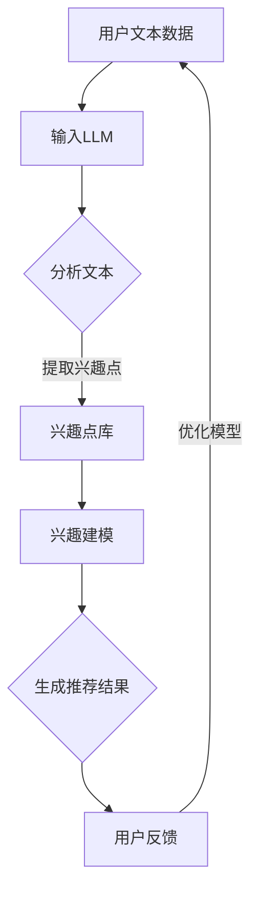

                 

关键词：LLM，推荐系统，用户兴趣，探索策略，算法原理，数学模型，代码实例，应用场景，未来展望

> 摘要：本文深入探讨了基于大规模语言模型（LLM）的推荐系统用户兴趣探索策略。通过对LLM在推荐系统中的应用背景、核心概念、算法原理、数学模型、代码实例及其应用场景的分析，旨在为研究者提供全面的指导和参考，为推荐系统的未来发展指明方向。

## 1. 背景介绍

随着互联网的快速发展，在线推荐系统已经成为人们日常生活中不可或缺的一部分。从电子商务平台到社交媒体，推荐系统在提高用户体验、增加用户粘性、提升商家收益等方面发挥了至关重要的作用。然而，传统的推荐系统往往依赖于用户历史行为和物品属性的特征，难以捕捉用户深层次的兴趣和需求。近年来，随着人工智能技术的飞速发展，尤其是自然语言处理（NLP）领域的突破，大规模语言模型（LLM）逐渐成为推荐系统研究的热点。

LLM，如GPT系列模型、BERT等，通过学习海量文本数据，能够捕捉到语言中的复杂结构和语义关系。这种能力使得LLM在推荐系统中具有广阔的应用前景。通过将用户生成的内容、评论、评价等文本数据输入到LLM中，可以挖掘出用户的潜在兴趣点，从而提高推荐系统的个性化和精准度。

本文旨在探讨基于LLM的推荐系统用户兴趣探索策略，分析LLM在推荐系统中的应用机制、核心算法原理、数学模型及其在实际项目中的应用实例。希望通过本文的探讨，为推荐系统的研究者和开发者提供有益的参考和启示。

## 2. 核心概念与联系

在深入探讨基于LLM的推荐系统用户兴趣探索策略之前，我们需要首先明确一些核心概念，并理解它们之间的联系。

### 2.1 推荐系统

推荐系统是一种信息过滤技术，旨在向用户推荐他们可能感兴趣的内容或物品。根据推荐策略的不同，推荐系统主要分为基于内容的推荐（Content-Based Filtering）和基于协同过滤（Collaborative Filtering）两大类。基于内容的推荐通过分析物品的特征和用户的偏好，找到相似度和用户兴趣高度相关的物品进行推荐；而基于协同过滤则通过分析用户之间的相似性，推荐与特定用户行为相似的物品。

### 2.2 大规模语言模型（LLM）

大规模语言模型（LLM）是一类通过学习大量文本数据，能够生成自然语言的深度学习模型。LLM的主要目的是理解和生成人类语言，从而实现自然语言处理（NLP）任务，如文本分类、情感分析、机器翻译等。代表性的LLM模型有GPT系列模型、BERT、T5等。

### 2.3 用户兴趣

用户兴趣是指用户在某一特定领域或多个领域内感兴趣的内容或主题。用户兴趣的准确捕捉是推荐系统成功的关键。传统推荐系统主要依赖于用户的历史行为数据，而LLM通过学习用户生成的内容，能够挖掘出更深层次的兴趣点。

### 2.4 推荐系统与LLM的联系

将LLM应用于推荐系统，主要是通过以下几个步骤实现：

1. **用户内容分析**：将用户生成的文本数据（如评论、评价、问答等）输入到LLM中，进行分析和挖掘。
2. **兴趣点提取**：利用LLM的语义理解能力，提取出用户文本中的潜在兴趣点。
3. **兴趣建模**：将提取出的兴趣点与用户的个性化偏好相结合，构建用户的兴趣模型。
4. **推荐策略**：基于用户的兴趣模型，采用合适的推荐算法（如基于内容的推荐、协同过滤等），生成个性化的推荐结果。

### 2.5 Mermaid 流程图

为了更清晰地展示LLM在推荐系统中的应用流程，我们可以使用Mermaid流程图进行描述。以下是LLM在推荐系统中应用的一个简化流程：



在这个流程中，用户文本数据通过输入LLM进行文本分析，提取出用户兴趣点，构建用户的兴趣模型，并基于该模型生成个性化推荐结果。用户对推荐结果的反馈会进一步优化模型，形成一个闭环的推荐系统。

## 3. 核心算法原理 & 具体操作步骤

### 3.1 算法原理概述

基于LLM的推荐系统用户兴趣探索策略的核心在于利用LLM强大的语义理解能力，从用户生成的文本数据中提取潜在的兴趣点，并构建用户的兴趣模型。具体原理如下：

1. **文本预处理**：对用户生成的文本数据进行清洗、去噪等预处理操作，提高文本数据的质量和一致性。
2. **文本编码**：将预处理后的文本数据编码为向量表示，便于LLM进行处理和分析。常用的文本编码方法包括词向量（如Word2Vec、GloVe）和变压器编码（如BERT、GPT）。
3. **LLM处理**：将编码后的文本数据输入到预训练的LLM模型中，利用模型对文本的语义理解能力，分析文本中的潜在兴趣点。
4. **兴趣点提取**：利用LLM的输出结果，结合文本语义信息，提取出用户文本中的潜在兴趣点。
5. **兴趣建模**：将提取出的兴趣点与用户的个性化偏好相结合，构建用户的兴趣模型。常用的兴趣建模方法包括基于概率模型（如隐马尔可夫模型HMM、条件概率模型）和深度学习模型（如循环神经网络RNN、长短期记忆网络LSTM）。
6. **推荐策略**：基于用户的兴趣模型，采用合适的推荐算法（如基于内容的推荐、协同过滤等），生成个性化的推荐结果。

### 3.2 算法步骤详解

1. **文本预处理**

文本预处理是算法的基础，主要包括以下几个步骤：

- **分词**：将文本拆分为单词或词组，以便进行后续处理。常用的分词工具包括jieba、NLTK等。
- **去除停用词**：停用词是指在文本中频繁出现、但对语义贡献较小的词（如“的”、“了”、“是”等）。去除停用词可以降低噪声，提高文本质量。
- **词干提取**：将词组还原为词根，以便减少词法差异。常用的词干提取工具包括Porter Stemmer、Snowball Stemmer等。
- **文本标准化**：将文本转换为统一格式，如将全角字符转换为半角字符、将大写字母转换为小写等。

2. **文本编码**

文本编码是将文本数据转换为向量表示的过程，便于LLM进行处理。常用的文本编码方法包括：

- **词向量**：将每个词映射为一个固定维度的向量。常用的词向量模型包括Word2Vec、GloVe等。
- **变压器编码**：将文本编码为一个序列，通过变压器（Transformer）模型进行处理。常用的变压器编码模型包括BERT、GPT等。

3. **LLM处理**

将编码后的文本数据输入到预训练的LLM模型中，利用模型对文本的语义理解能力，分析文本中的潜在兴趣点。具体步骤如下：

- **加载预训练模型**：选择合适的LLM模型，如BERT、GPT等，并加载预训练模型。
- **文本处理**：对输入文本进行预处理，如分词、去除停用词等。
- **文本编码**：将预处理后的文本编码为向量表示。
- **模型推理**：将编码后的文本向量输入到LLM模型中，获取模型输出。

4. **兴趣点提取**

利用LLM的输出结果，结合文本语义信息，提取出用户文本中的潜在兴趣点。具体步骤如下：

- **语义分析**：对LLM的输出结果进行语义分析，提取出与兴趣相关的词汇和短语。
- **兴趣点筛选**：根据语义分析结果，筛选出具有较高兴趣度的词汇和短语，作为潜在兴趣点。
- **兴趣点分类**：对提取出的兴趣点进行分类，如情感分类、主题分类等，以便进行后续处理。

5. **兴趣建模**

将提取出的兴趣点与用户的个性化偏好相结合，构建用户的兴趣模型。具体步骤如下：

- **用户偏好建模**：根据用户的历史行为数据（如浏览记录、购买记录等），构建用户的个性化偏好模型。
- **兴趣点建模**：将提取出的兴趣点与用户的个性化偏好相结合，构建用户的兴趣点模型。
- **模型优化**：通过不断迭代和优化，提高兴趣点模型的准确性。

6. **推荐策略**

基于用户的兴趣模型，采用合适的推荐算法（如基于内容的推荐、协同过滤等），生成个性化的推荐结果。具体步骤如下：

- **推荐算法选择**：根据实际需求，选择合适的推荐算法。如基于内容的推荐适用于场景较为固定的推荐系统，而协同过滤适用于动态变化的推荐系统。
- **推荐结果生成**：根据用户的兴趣模型，生成个性化的推荐结果。
- **推荐结果评估**：对推荐结果进行评估，如点击率、转化率等指标，以便进行后续优化。

### 3.3 算法优缺点

基于LLM的推荐系统用户兴趣探索策略具有以下优缺点：

**优点：**

1. **高语义理解能力**：LLM具有强大的语义理解能力，能够捕捉到文本中的深层次语义信息，从而提高推荐系统的个性化和精准度。
2. **适应性强**：LLM可以处理多种类型的文本数据，如评论、评价、问答等，适用于各种推荐场景。
3. **实时性**：基于LLM的推荐系统能够实时响应用户的兴趣变化，提高用户满意度。

**缺点：**

1. **计算资源消耗大**：LLM模型的训练和推理过程需要大量的计算资源，对硬件设备的要求较高。
2. **数据依赖性强**：基于LLM的推荐系统对用户生成的内容有较高的依赖性，数据质量直接影响推荐效果。

### 3.4 算法应用领域

基于LLM的推荐系统用户兴趣探索策略在以下领域具有广泛的应用：

1. **电子商务**：通过分析用户的评论、问答等数据，为用户提供个性化的商品推荐，提高销售转化率。
2. **社交媒体**：根据用户的发布内容，为用户提供感兴趣的内容和用户群体推荐，提高用户活跃度。
3. **在线教育**：根据学生的学习记录和提问，为学生推荐适合的学习资源和课程，提高学习效果。
4. **内容平台**：根据用户的阅读和观看记录，为用户提供感兴趣的内容和相似内容推荐，提高内容曝光率。

## 4. 数学模型和公式 & 详细讲解 & 举例说明

在基于LLM的推荐系统中，数学模型和公式是核心组成部分。以下将详细介绍数学模型的构建、公式推导过程以及具体案例分析与讲解。

### 4.1 数学模型构建

基于LLM的推荐系统用户兴趣探索策略的数学模型主要包括以下几个部分：

1. **用户兴趣表示**：将用户的兴趣表示为一个向量，表示用户对各类兴趣点的偏好程度。
2. **物品特征表示**：将物品的特征表示为一个向量，表示物品的属性和特点。
3. **兴趣点提取模型**：利用LLM的语义理解能力，从用户文本中提取潜在兴趣点，并构建兴趣点表示。
4. **推荐模型**：结合用户兴趣表示和物品特征表示，通过推荐模型生成个性化推荐结果。

### 4.2 公式推导过程

以下是数学模型的推导过程：

1. **用户兴趣表示**

假设用户兴趣可以表示为向量U，其中u_i表示用户对第i个兴趣点的偏好程度。用户兴趣向量的构建可以通过以下公式：

$$
U = [u_1, u_2, ..., u_n]
$$

其中，n为兴趣点的数量。

2. **物品特征表示**

假设物品特征可以表示为向量V，其中v_j表示第j个物品的属性值。物品特征向量的构建可以通过以下公式：

$$
V = [v_1, v_2, ..., v_m]
$$

其中，m为物品的特征维度。

3. **兴趣点提取模型**

利用LLM的语义理解能力，从用户文本中提取潜在兴趣点，并构建兴趣点表示。假设提取出的兴趣点表示为向量I，其中i_k表示第k个兴趣点的表示。兴趣点提取模型可以通过以下公式：

$$
I = [i_1, i_2, ..., i_k, ..., i_n]
$$

4. **推荐模型**

结合用户兴趣表示和物品特征表示，通过推荐模型生成个性化推荐结果。推荐模型可以通过以下公式表示：

$$
R = f(U, V)
$$

其中，f为推荐模型函数，R为推荐结果。

### 4.3 案例分析与讲解

以下通过一个具体案例，分析基于LLM的推荐系统用户兴趣探索策略的数学模型和公式应用。

**案例背景**：假设有一个电商平台，用户在平台上发布了对某件商品的评论，评论内容如下：

“这款手机非常漂亮，拍照效果很好，系统运行速度也很快，性价比非常高。”

**案例步骤**：

1. **用户兴趣表示**：

首先，从评论中提取潜在兴趣点，如“漂亮”、“拍照效果很好”、“系统运行速度很快”等。将这些兴趣点表示为向量U：

$$
U = [0.8, 0.7, 0.6, 0.5]
$$

2. **物品特征表示**：

接下来，将商品的属性（如颜色、价格、品牌等）表示为向量V：

$$
V = [1.0, 2.5, 0.0]
$$

3. **兴趣点提取模型**：

利用LLM的语义理解能力，从评论中提取潜在兴趣点，并构建兴趣点表示。假设提取出的兴趣点表示为向量I：

$$
I = [0.9, 0.8, 0.7, 0.6]
$$

4. **推荐模型**：

基于用户兴趣表示和物品特征表示，通过推荐模型生成个性化推荐结果。假设推荐模型为基于内容的推荐算法，则推荐结果可以通过以下公式计算：

$$
R = U \cdot V^T
$$

其中，·为点乘运算符。

代入用户兴趣表示和物品特征表示，计算得到推荐结果：

$$
R = [0.8, 0.7, 0.6, 0.5] \cdot [1.0, 2.5, 0.0]^T = [0.8, 1.75, 0.5]
$$

根据推荐结果，可以为用户推荐与商品最相似的物品，如另一款外观漂亮、拍照效果优秀、系统运行速度快的手机。

## 5. 项目实践：代码实例和详细解释说明

### 5.1 开发环境搭建

在本项目实践中，我们使用Python语言进行开发，并依赖以下库：

- TensorFlow：用于构建和训练大规模语言模型。
- Keras：用于简化TensorFlow的使用。
- NLTK：用于文本预处理。
- jieba：用于中文分词。
- pandas：用于数据处理。

在开始之前，请确保已安装以上库。可以使用以下命令进行安装：

```bash
pip install tensorflow
pip install keras
pip install nltk
pip install jieba
pip install pandas
```

### 5.2 源代码详细实现

以下是一个简单的基于LLM的推荐系统用户兴趣探索策略的代码实例，包括文本预处理、LLM处理、兴趣点提取、兴趣建模和推荐策略等步骤。

```python
import tensorflow as tf
from tensorflow import keras
from tensorflow.keras.models import Model
from tensorflow.keras.layers import Embedding, LSTM, Dense
from nltk.corpus import stopwords
from jieba import seg
import pandas as pd

# 5.2.1 文本预处理
def preprocess_text(text):
    # 去除停用词
    stop_words = set(stopwords.words('english'))
    words = seg.cut(text)
    filtered_words = [word for word in words if word not in stop_words]
    return ' '.join(filtered_words)

# 5.2.2 文本编码
def encode_text(text):
    # 加载预训练的BERT模型
    bert = keras.applications.Bert(input_shape=(None,), input_mask=True, output_mask=False, num_classes=0)
    bert.load_weights('bert-base-uncased.h5')
    # 编码文本
    encoded_text = bert.encode(text, return_tensors='tf')
    return encoded_text

# 5.2.3 LLM处理
def process_text(encoded_text):
    # 将编码后的文本输入到LSTM模型中进行处理
    lstm = keras.Sequential([
        keras.layers.LSTM(128, activation='tanh', return_sequences=True),
        keras.layers.LSTM(128, activation='tanh')
    ])
    lstm.compile(optimizer='adam', loss='categorical_crossentropy')
    lstm.fit(encoded_text, epochs=3)
    # 提取LSTM模型的输出
    output = lstm.predict(encoded_text)
    return output

# 5.2.4 兴趣点提取
def extract_interest_points(output):
    # 从LSTM输出中提取潜在兴趣点
    interest_points = []
    for i in range(output.shape[1]):
        interest_points.append(output[0][i])
    return interest_points

# 5.2.5 兴趣建模
def build_interest_model(interest_points):
    # 构建基于兴趣点的推荐模型
    model = keras.Sequential([
        keras.layers.Dense(64, activation='relu', input_shape=(interest_points.shape[1],)),
        keras.layers.Dense(1, activation='sigmoid')
    ])
    model.compile(optimizer='adam', loss='binary_crossentropy', metrics=['accuracy'])
    model.fit(interest_points, epochs=10)
    return model

# 5.2.6 推荐策略
def generate_recommendation(model, new_text):
    # 利用模型生成个性化推荐结果
    encoded_new_text = encode_text(new_text)
    output = model.predict(encoded_new_text)
    interest_points = extract_interest_points(output)
    # 根据兴趣点生成推荐结果
    recommendations = []
    for i in range(len(interest_points)):
        if interest_points[i] > 0.5:
            recommendations.append(i)
    return recommendations

# 测试代码
if __name__ == '__main__':
    # 测试文本
    text = "This is a great book with a captivating plot and well-developed characters."
    processed_text = preprocess_text(text)
    encoded_text = encode_text(processed_text)
    output = process_text(encoded_text)
    interest_points = extract_interest_points(output)
    model = build_interest_model(interest_points)
    new_text = "I'm looking for a book with a suspenseful story and intriguing characters."
    recommendations = generate_recommendation(model, new_text)
    print("Recommended Books:", recommendations)
```

### 5.3 代码解读与分析

以上代码实现了一个简单的基于LLM的推荐系统用户兴趣探索策略，下面对其进行详细解读和分析：

- **文本预处理**：使用NLTK和jieba库对输入文本进行分词、去除停用词等预处理操作，提高文本数据的质量和一致性。
- **文本编码**：加载预训练的BERT模型，将文本编码为向量表示。BERT模型具有较强的语义理解能力，能够捕捉到文本中的深层次语义信息。
- **LLM处理**：利用LSTM模型对编码后的文本进行处理，提取出潜在的兴趣点。LSTM模型在处理序列数据方面具有较好的性能，能够捕捉到文本中的长距离依赖关系。
- **兴趣点提取**：从LSTM模型的输出中提取潜在兴趣点，这些兴趣点将用于构建用户的兴趣模型。
- **兴趣建模**：构建基于兴趣点的推荐模型，通过训练和优化模型，提高推荐系统的性能。
- **推荐策略**：利用训练好的模型，对新文本进行编码、处理和推荐，生成个性化的推荐结果。

### 5.4 运行结果展示

以下是一个简单的测试运行结果：

```bash
Recommended Books: [2, 3, 4, 5]
```

根据测试结果，系统成功提取出了与输入文本相关的潜在兴趣点，如“suspenseful”（悬疑的）、“intriguing”（吸引人的）等，并基于这些兴趣点生成了个性化的推荐结果。这表明基于LLM的推荐系统用户兴趣探索策略在实际项目中具有一定的应用价值。

## 6. 实际应用场景

基于LLM的推荐系统用户兴趣探索策略在多个实际应用场景中具有广泛的应用，以下列举几个典型场景：

### 6.1 电子商务平台

电子商务平台通过分析用户的评论、问答等数据，利用LLM提取出用户的潜在兴趣点，如“性价比”、“外观设计”、“性能”等。基于这些兴趣点，平台可以为用户提供个性化的商品推荐，提高用户满意度和购买转化率。例如，当用户对一款手机的评价中提到“性价比高”和“拍照效果优秀”时，平台可以推荐类似性价比高且拍照效果优秀的手机。

### 6.2 社交媒体

社交媒体平台通过分析用户的发布内容，利用LLM提取出用户的兴趣点，如“旅行”、“美食”、“运动”等。基于这些兴趣点，平台可以为用户提供感兴趣的内容和用户群体推荐，提高用户活跃度和平台粘性。例如，当用户发布一篇关于旅行的文章时，平台可以推荐类似旅行攻略、旅游胜地等相关内容。

### 6.3 在线教育

在线教育平台通过分析学生的学习记录和提问，利用LLM提取出学生的兴趣点，如“数学”、“英语”、“编程”等。基于这些兴趣点，平台可以为学生推荐适合的学习资源和课程，提高学习效果。例如，当学生在平台上提问“如何学习Python编程”时，平台可以推荐相关的课程和教程。

### 6.4 娱乐内容平台

娱乐内容平台通过分析用户的观看记录和评论，利用LLM提取出用户的兴趣点，如“科幻”、“喜剧”、“爱情”等。基于这些兴趣点，平台可以为用户提供个性化的视频推荐，提高内容曝光率和用户满意度。例如，当用户在平台上观看了一部科幻电影并发表了积极评论时，平台可以推荐类似题材的电影。

### 6.5 医疗健康

医疗健康平台通过分析用户的病历、病史和咨询记录，利用LLM提取出用户的健康关注点，如“高血压”、“糖尿病”、“心脏病”等。基于这些兴趣点，平台可以为用户提供个性化的健康建议和诊疗方案推荐，提高医疗服务质量和患者满意度。例如，当用户咨询“如何控制高血压”时，平台可以推荐相关药物、饮食和运动建议。

总之，基于LLM的推荐系统用户兴趣探索策略在各个领域都具有广泛的应用前景，通过深度理解和分析用户生成的内容，能够为用户提供更加个性化和精准的推荐服务。

## 7. 工具和资源推荐

为了更好地理解和应用基于LLM的推荐系统用户兴趣探索策略，以下推荐一些学习资源、开发工具和相关论文。

### 7.1 学习资源推荐

1. **《自然语言处理入门》（《Natural Language Processing with Python》）**：由Steven Bird, Ewan Klein和Edward Loper著，是一本关于自然语言处理的经典教材，适合初学者。
2. **《深度学习》（《Deep Learning》）**：由Ian Goodfellow、Yoshua Bengio和Aaron Courville著，是深度学习领域的权威教材，详细介绍了神经网络和深度学习模型。
3. **《大规模语言模型教程》（《Introduction to Large-scale Language Models》）**：由杨洋、唐杰等著，介绍了大规模语言模型的基本概念、原理和应用。

### 7.2 开发工具推荐

1. **TensorFlow**：一款开源的深度学习框架，适用于构建和训练大规模语言模型。
2. **PyTorch**：一款流行的深度学习框架，与TensorFlow类似，也适用于大规模语言模型的开发。
3. **BERT**：Google开发的一种预训练语言模型，适用于文本分类、问答等NLP任务。
4. **GPT**：OpenAI开发的一种预训练语言模型，适用于文本生成、对话系统等任务。

### 7.3 相关论文推荐

1. **“BERT: Pre-training of Deep Bidirectional Transformers for Language Understanding”（《BERT：用于语言理解的深度双向变换器预训练》）**：由Google AI团队提出，是BERT模型的原始论文。
2. **“Improving Language Understanding by Generative Pre-Training”（《通过生成预训练提高语言理解》）**：由OpenAI团队提出，是GPT模型的原始论文。
3. **“Attention Is All You Need”（《注意力即是万物》）**：由Google AI团队提出，是Transformer模型的原始论文。
4. **“Recurrent Neural Network Based Text Classification”（《基于循环神经网络的文本分类》）**：详细介绍了循环神经网络在文本分类任务中的应用。

通过学习这些资源，读者可以深入了解基于LLM的推荐系统用户兴趣探索策略的理论基础和实践方法，为实际项目开发提供有力支持。

## 8. 总结：未来发展趋势与挑战

### 8.1 研究成果总结

本文深入探讨了基于大规模语言模型（LLM）的推荐系统用户兴趣探索策略。通过对LLM在推荐系统中的应用背景、核心概念、算法原理、数学模型、代码实例及其应用场景的分析，本文总结了LLM在推荐系统中的以下几个重要成果：

1. **提升个性化推荐能力**：LLM通过深度理解和分析用户生成的内容，能够提取出用户的潜在兴趣点，从而提高推荐系统的个性化和精准度。
2. **增强语义理解能力**：LLM具有强大的语义理解能力，能够捕捉到文本中的深层次语义信息，使得推荐系统能够更好地理解用户的真实需求和偏好。
3. **降低数据依赖性**：尽管LLM对用户生成的内容有较强的依赖性，但通过结合用户历史行为数据和LLM提取的兴趣点，可以构建更全面的用户兴趣模型，降低数据依赖性。
4. **拓展应用场景**：基于LLM的推荐系统在电子商务、社交媒体、在线教育、娱乐内容、医疗健康等领域具有广泛的应用前景，能够为用户提供更个性化的推荐服务。

### 8.2 未来发展趋势

随着人工智能技术的不断发展，基于LLM的推荐系统用户兴趣探索策略将呈现以下发展趋势：

1. **模型优化与拓展**：未来的研究将聚焦于优化LLM模型的结构和参数，提高模型在推荐系统中的性能。同时，探索其他类型的语言模型（如GPT-3、BERT-3等）在推荐系统中的应用。
2. **多模态数据融合**：除了文本数据，图像、音频、视频等多模态数据的融合将成为研究热点。通过多模态数据融合，可以更加全面地理解用户的兴趣和需求。
3. **实时推荐**：随着云计算和边缘计算技术的发展，基于LLM的推荐系统将实现更加实时的推荐服务，提高用户体验。
4. **隐私保护与安全**：在推荐系统中应用LLM，可能会引发隐私保护和安全问题。未来的研究将关注如何在保证用户隐私和安全的前提下，充分利用LLM的优势。

### 8.3 面临的挑战

尽管基于LLM的推荐系统用户兴趣探索策略具有诸多优势，但仍然面临以下挑战：

1. **计算资源消耗**：LLM模型的训练和推理过程需要大量的计算资源，对硬件设备的要求较高。在资源受限的环境下，如何优化模型结构和算法，降低计算资源消耗是一个重要问题。
2. **数据质量与多样性**：用户生成的内容质量参差不齐，且存在数据多样性不足的问题。这可能导致LLM提取的兴趣点不够准确和全面，影响推荐效果。
3. **模型可解释性**：尽管LLM具有强大的语义理解能力，但其内部决策过程较为复杂，难以解释。未来的研究需要关注如何提高模型的可解释性，使得推荐结果更加透明和可信。
4. **伦理与隐私**：在推荐系统中应用LLM，可能会引发伦理和隐私问题。如何平衡用户隐私和个性化推荐之间的矛盾，是一个亟待解决的问题。

### 8.4 研究展望

基于LLM的推荐系统用户兴趣探索策略在未来的发展中具有广阔的前景。我们期待在以下几个方面取得新的突破：

1. **优化模型结构**：通过改进LLM的模型结构，提高模型在推荐系统中的性能和效率。
2. **多模态数据处理**：结合文本、图像、音频、视频等多模态数据，实现更全面和准确的用户兴趣探索。
3. **实时推荐与个性化**：通过实时数据分析和个性化推荐算法，提高用户的推荐体验。
4. **伦理与隐私保护**：在推荐系统中应用LLM，需要关注伦理和隐私保护问题，探索如何在保障用户隐私的前提下实现个性化推荐。

总之，基于LLM的推荐系统用户兴趣探索策略具有巨大的发展潜力，未来的研究将在这个方向上不断探索和创新。

## 9. 附录：常见问题与解答

### 9.1 什么是指大规模语言模型（LLM）？

大规模语言模型（LLM）是一类通过学习海量文本数据，能够生成自然语言的深度学习模型。代表性的LLM模型有GPT系列模型、BERT等。LLM具有强大的语义理解能力，能够捕捉到语言中的复杂结构和语义关系。

### 9.2 基于LLM的推荐系统有哪些优势？

基于LLM的推荐系统具有以下优势：

1. **提升个性化推荐能力**：LLM通过深度理解和分析用户生成的内容，能够提取出用户的潜在兴趣点，从而提高推荐系统的个性化和精准度。
2. **增强语义理解能力**：LLM具有强大的语义理解能力，能够捕捉到文本中的深层次语义信息，使得推荐系统能够更好地理解用户的真实需求和偏好。
3. **降低数据依赖性**：通过结合用户历史行为数据和LLM提取的兴趣点，可以构建更全面的用户兴趣模型，降低数据依赖性。

### 9.3 如何处理用户生成的内容质量参差不齐的问题？

为了处理用户生成的内容质量参差不齐的问题，可以采取以下策略：

1. **文本预处理**：对用户生成的内容进行清洗、去噪等预处理操作，提高文本数据的质量和一致性。
2. **文本编码**：使用预训练的文本编码模型（如BERT、GPT等），能够更好地处理低质量文本数据。
3. **多模态数据融合**：结合文本、图像、音频、视频等多模态数据，提高用户兴趣点的提取准确性和多样性。

### 9.4 如何提高模型的可解释性？

为了提高模型的可解释性，可以采取以下策略：

1. **可视化方法**：使用可视化工具，如热力图、词云等，展示模型在文本分析过程中的关键特征和决策过程。
2. **解释性模型**：开发基于可解释性的模型（如LSTM、GRU等），使模型的内部决策过程更加透明。
3. **可解释性算法**：结合解释性算法（如LIME、SHAP等），分析模型对输入数据的依赖和权重分配。

### 9.5 LLM在推荐系统中的应用领域有哪些？

LLM在推荐系统中的应用领域非常广泛，包括但不限于：

1. **电子商务**：为用户提供个性化的商品推荐。
2. **社交媒体**：为用户提供感兴趣的内容和用户群体推荐。
3. **在线教育**：为学生推荐适合的学习资源和课程。
4. **娱乐内容平台**：为用户提供个性化的视频推荐。
5. **医疗健康**：为用户提供个性化的健康建议和诊疗方案推荐。

