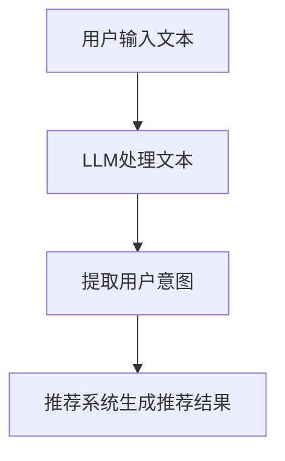

                 

关键词：LLM，推荐系统，用户意图，深度学习，预测模型

> 摘要：本文深入探讨了基于大型语言模型（LLM）的推荐系统用户意图预测技术。通过分析LLM的原理和应用，探讨了其在推荐系统中的作用，详细阐述了用户意图预测的算法原理、数学模型及实现步骤。文章还结合实际项目实践，展示了基于LLM的用户意图预测在实际开发中的应用，并展望了未来的发展趋势与挑战。

## 1. 背景介绍

随着互联网的快速发展，推荐系统已经成为许多在线服务的重要组成部分。推荐系统通过分析用户的历史行为和兴趣，为用户推荐他们可能感兴趣的内容，从而提高用户体验和满意度。然而，传统的推荐系统往往依赖于用户的历史行为数据进行预测，忽视了用户的即时意图和当前需求。

用户意图预测是推荐系统中的一个关键问题。它旨在理解用户在特定时刻的意图，从而为用户提供更相关、更有针对性的推荐。在传统的推荐系统中，用户意图通常通过用户的历史行为数据（如浏览记录、购买记录等）进行预测。然而，这些方法往往存在一些问题，如数据稀疏性、冷启动问题以及不能及时捕捉用户动态变化的需求等。

近年来，深度学习技术的快速发展为解决这些问题提供了新的思路。其中，大型语言模型（LLM）作为一种先进的深度学习模型，在自然语言处理领域取得了显著的成果。LLM具有强大的语义理解能力，可以有效地捕捉用户的意图和需求。因此，基于LLM的推荐系统用户意图预测技术成为了一个备受关注的研究方向。

本文旨在深入探讨基于LLM的推荐系统用户意图预测技术，包括LLM的原理和应用、用户意图预测的算法原理、数学模型以及实际应用。通过本文的研究，希望能够为推荐系统的研究者和开发者提供有价值的参考和指导。

## 2. 核心概念与联系

### 2.1. 大型语言模型（LLM）

大型语言模型（LLM）是一种基于深度学习的自然语言处理模型，其目的是通过学习大规模文本数据，捕捉语言中的语义信息，并生成相应的输出。LLM通常采用大规模的神经网络结构，如变换器（Transformer）架构，通过多层次的注意力机制和循环神经网络（RNN）进行建模。

LLM的核心原理是通过自回归（Autoregressive）的方式生成文本。具体来说，给定一个序列的输入文本，LLM可以逐个预测下一个单词或字符，并逐步构建完整的输出序列。通过大量的训练数据，LLM可以学会生成符合语言规则和语义逻辑的文本。

### 2.2. 推荐系统

推荐系统是一种基于数据挖掘和机器学习技术的应用，旨在为用户提供个性化推荐。推荐系统通常通过分析用户的历史行为数据（如浏览记录、购买记录等），预测用户对特定内容的兴趣和偏好，从而为用户提供个性化的推荐结果。

推荐系统可以分为基于协同过滤（Collaborative Filtering）的方法和基于内容的方法。基于协同过滤的方法通过分析用户之间的相似度，为用户推荐与其他用户兴趣相似的物品；而基于内容的方法通过分析物品的属性和用户的历史行为，为用户推荐具有相似属性的物品。

### 2.3. 用户意图预测

用户意图预测是推荐系统中的一个关键问题。它旨在理解用户在特定时刻的意图，从而为用户提供更相关、更有针对性的推荐。用户意图可以包括用户的搜索意图、浏览意图、购买意图等。

用户意图预测通常通过以下几种方法实现：

1. 基于历史行为的方法：通过分析用户的历史行为数据，如浏览记录、购买记录等，预测用户的意图。这种方法存在数据稀疏性和冷启动问题。

2. 基于上下文的方法：通过分析用户当前所处的上下文环境，如时间、地点、设备等，预测用户的意图。这种方法可以更好地捕捉用户的动态变化。

3. 基于语义的方法：通过使用自然语言处理技术，如文本分类、情感分析等，理解用户的意图。这种方法可以更准确地捕捉用户的语义意图。

### 2.4. 大型语言模型在推荐系统用户意图预测中的应用

大型语言模型（LLM）在推荐系统用户意图预测中的应用主要体现在以下几个方面：

1. 语义理解：LLM具有强大的语义理解能力，可以捕捉用户的语义意图。通过将用户生成的文本输入到LLM中，可以提取出用户的意图，从而为推荐系统提供更准确的用户意图预测。

2. 文本生成：LLM可以生成符合语言规则和语义逻辑的文本。在推荐系统中，可以使用LLM生成个性化的推荐文案，提高用户的参与度和满意度。

3. 多模态融合：LLM可以与其他模态的数据（如图像、音频等）进行融合，实现跨模态的用户意图预测。这为推荐系统提供了更丰富的数据来源和更准确的意图预测结果。

### 2.5. Mermaid 流程图

以下是基于LLM的推荐系统用户意图预测的Mermaid流程图：



在这个流程图中，用户输入文本经过LLM处理后提取出用户意图，然后推荐系统根据提取的用户意图生成个性化的推荐结果。

## 3. 核心算法原理 & 具体操作步骤

### 3.1. 算法原理概述

基于LLM的推荐系统用户意图预测算法主要分为以下几个步骤：

1. 文本预处理：对用户输入的文本进行清洗和预处理，包括分词、去停用词、词性标注等。

2. 文本编码：将预处理后的文本转换为数值化的表示，可以使用词嵌入（Word Embedding）技术，如Word2Vec、GloVe等。

3. 文本输入LLM：将编码后的文本输入到LLM中，通过自回归的方式生成对应的输出。

4. 用户意图提取：从LLM的输出中提取用户意图，可以使用预训练的文本分类模型，如BERT、GPT等。

5. 推荐结果生成：根据提取的用户意图，利用推荐算法为用户生成个性化的推荐结果。

### 3.2. 算法步骤详解

以下是具体的算法步骤：

#### 3.2.1. 文本预处理

文本预处理是算法的基础步骤，主要包括以下任务：

1. 分词：将文本分割成单词或短语。常用的分词工具包括jieba、nltk等。

2. 去停用词：去除常见的无意义的停用词，如“的”、“了”、“是”等。可以使用现成的停用词库，如NLTK、stopwords等。

3. 词性标注：为每个词标注对应的词性，如名词、动词、形容词等。可以使用词性标注工具，如NLTK、Stanford NLP等。

#### 3.2.2. 文本编码

文本编码是将文本转换为数值化的表示，以便后续的模型处理。常用的文本编码方法包括：

1. 词嵌入（Word Embedding）：将单词映射为固定大小的向量表示。常用的词嵌入模型包括Word2Vec、GloVe等。

2. 字嵌入（Character Embedding）：将字符映射为固定大小的向量表示。常用的字嵌入模型包括CNN、RNN等。

#### 3.2.3. 文本输入LLM

将编码后的文本输入到LLM中，通过自回归的方式生成对应的输出。具体步骤如下：

1. 准备LLM模型：选择合适的LLM模型，如BERT、GPT等。

2. 加载预训练模型：从预训练模型库中加载预训练好的模型。

3. 文本预处理：对输入的文本进行预处理，包括分词、编码等。

4. 输入文本：将预处理后的文本输入到LLM中，通过自回归的方式生成对应的输出。

#### 3.2.4. 用户意图提取

从LLM的输出中提取用户意图，可以使用预训练的文本分类模型，如BERT、GPT等。具体步骤如下：

1. 准备文本分类模型：选择合适的文本分类模型，如BERT、GPT等。

2. 加载预训练模型：从预训练模型库中加载预训练好的模型。

3. 文本预处理：对输入的文本进行预处理，包括分词、编码等。

4. 输入文本：将预处理后的文本输入到文本分类模型中，得到对应的分类结果。

#### 3.2.5. 推荐结果生成

根据提取的用户意图，利用推荐算法为用户生成个性化的推荐结果。具体步骤如下：

1. 准备推荐算法：选择合适的推荐算法，如协同过滤、基于内容的推荐等。

2. 计算用户兴趣：根据提取的用户意图，计算用户对各个推荐项的兴趣。

3. 生成推荐结果：根据用户兴趣，生成个性化的推荐结果。

### 3.3. 算法优缺点

#### 优点：

1. 强大的语义理解能力：LLM具有强大的语义理解能力，可以捕捉用户的语义意图，提高推荐系统的准确性。

2. 跨模态融合：LLM可以与其他模态的数据进行融合，如图像、音频等，为推荐系统提供更丰富的数据来源。

3. 个性化推荐：基于用户意图的个性化推荐可以提高用户的参与度和满意度。

#### 缺点：

1. 计算资源消耗大：LLM模型通常需要大量的计算资源和存储空间。

2. 需要大量的训练数据：LLM模型的训练需要大量的训练数据，且数据质量对模型性能有较大影响。

3. 模型解释性较弱：深度学习模型通常具有较强的预测能力，但解释性较弱，难以理解模型内部的工作机制。

### 3.4. 算法应用领域

基于LLM的推荐系统用户意图预测技术在多个领域具有广泛的应用：

1. 电子商务：为用户提供个性化的商品推荐，提高销售转化率和用户满意度。

2. 内容推荐：为用户提供个性化的新闻、文章、视频等推荐，提高内容曝光率和用户黏性。

3. 社交网络：为用户提供感兴趣的朋友、群组、话题等推荐，提高社交网络的活跃度和用户参与度。

## 4. 数学模型和公式 & 详细讲解 & 举例说明

### 4.1. 数学模型构建

在基于LLM的推荐系统用户意图预测中，主要涉及到以下数学模型：

1. 词嵌入模型：用于将文本转换为数值化的向量表示。

2. 文本分类模型：用于提取用户意图。

3. 推荐算法模型：用于生成个性化的推荐结果。

#### 4.1.1. 词嵌入模型

词嵌入模型是将单词映射为固定大小的向量表示。常用的词嵌入模型包括Word2Vec和GloVe等。以下是一个基于Word2Vec的数学模型构建示例：

$$
\text{word\_embed}(w) = \text{softmax}(\text{W} \cdot \text{v}_w)
$$

其中，$w$表示单词，$\text{v}_w$表示单词的向量表示，$\text{W}$表示词嵌入矩阵，$\text{softmax}$函数用于计算单词的概率分布。

#### 4.1.2. 文本分类模型

文本分类模型用于从LLM的输出中提取用户意图。常用的文本分类模型包括BERT、GPT等。以下是一个基于BERT的数学模型构建示例：

$$
\text{logits} = \text{BERT}(\text{input})
$$

其中，$\text{input}$表示输入的文本，$\text{BERT}$表示BERT模型，$\text{logits}$表示分类结果的 logits 值。

#### 4.1.3. 推荐算法模型

推荐算法模型用于根据提取的用户意图生成个性化的推荐结果。以下是一个基于基于内容的推荐算法的数学模型构建示例：

$$
\text{relevance} = \text{similarity}(\text{user\_intent}, \text{item\_features})
$$

其中，$\text{user\_intent}$表示提取的用户意图，$\text{item\_features}$表示推荐项的属性特征，$\text{similarity}$函数用于计算用户意图与推荐项之间的相似度。

### 4.2. 公式推导过程

以下是一个基于BERT的文本分类模型公式的推导过程：

假设我们有 $N$ 个单词组成的一篇文本，其对应的词嵌入向量表示为 $\text{v}_1, \text{v}_2, \text{v}_3, ..., \text{v}_N$。BERT 模型的输入是一个单词序列，其对应的嵌入向量表示为 $\text{W}_1, \text{W}_2, \text{W}_3, ..., \text{W}_N$。BERT 模型通过多层变换器（Transformer）对输入进行编码，得到编码后的向量表示 $\text{h}_1, \text{h}_2, \text{h}_3, ..., \text{h}_N$。

设 $\text{V}$ 为BERT模型中每个单词的嵌入向量集合，$\text{H}$ 为BERT模型中每个单词的编码后向量集合，$\text{U}$ 为BERT模型中的隐藏层权重矩阵，$\text{B}$ 为BERT模型中的 biases。

BERT 模型的输出为每个单词的类别概率分布，表示为 $\text{softmax}(\text{U} \cdot \text{h}_i + \text{b})$。

我们可以将BERT模型的输出表示为：

$$
\text{logits}_i = \text{U} \cdot \text{h}_i + \text{b}
$$

其中，$\text{logits}_i$ 表示第 $i$ 个单词的 logits 值。

使用softmax函数对 logits 值进行归一化，得到每个单词的类别概率分布：

$$
\text{softmax}(\text{logits}_i) = \frac{e^{\text{logits}_i}}{\sum_{j=1}^{C} e^{\text{logits}_j}}
$$

其中，$C$ 表示类别数量。

### 4.3. 案例分析与讲解

以下是一个基于BERT的文本分类模型的案例分析与讲解：

假设我们有一个包含两个类别的文本分类任务，类别分别为“正面”和“负面”。我们使用BERT模型对文本进行分类，并采用交叉熵（Cross-Entropy）作为损失函数。

假设训练数据中有 $N$ 个样本，每个样本的标签为 $y_i$，其中 $y_i \in \{0, 1\}$，表示第 $i$ 个样本的标签。BERT模型的输出为每个样本的 logits 值，表示为 $z_i$。

损失函数为：

$$
\text{loss} = -\sum_{i=1}^{N} y_i \cdot \log(\text{softmax}(z_i))
$$

其中，$\text{softmax}(z_i)$ 表示第 $i$ 个样本的类别概率分布。

为了训练BERT模型，我们需要使用梯度下降（Gradient Descent）算法优化模型的参数。具体步骤如下：

1. 计算损失函数关于模型参数的梯度：

$$
\text{grad} = \frac{\partial \text{loss}}{\partial \text{U}} + \frac{\partial \text{loss}}{\partial \text{B}}
$$

2. 更新模型参数：

$$
\text{U} \leftarrow \text{U} - \alpha \cdot \text{grad}
$$

$$
\text{B} \leftarrow \text{B} - \alpha \cdot \text{grad}
$$

其中，$\alpha$ 表示学习率。

通过多次迭代优化，我们可以使BERT模型的参数收敛，从而实现文本分类任务。

## 5. 项目实践：代码实例和详细解释说明

在本节中，我们将通过一个具体的代码实例，展示如何使用基于LLM的推荐系统用户意图预测技术实现一个简单的推荐系统。该实例将包括以下步骤：

1. 开发环境搭建
2. 源代码详细实现
3. 代码解读与分析
4. 运行结果展示

### 5.1. 开发环境搭建

在开始编写代码之前，我们需要搭建一个适合开发推荐系统的环境。以下是一个典型的开发环境配置：

1. 操作系统：Linux（推荐使用Ubuntu 20.04）
2. 编程语言：Python（推荐使用Python 3.8及以上版本）
3. 依赖库：NumPy、Pandas、Scikit-learn、TensorFlow、Transformers

在安装了Python和pip的前提下，可以使用以下命令安装所需的依赖库：

```shell
pip install numpy pandas scikit-learn tensorflow transformers
```

### 5.2. 源代码详细实现

以下是实现基于LLM的推荐系统用户意图预测的Python代码。代码分为以下几个部分：

1. 数据预处理
2. LLM模型训练
3. 用户意图提取
4. 推荐结果生成

```python
import numpy as np
import pandas as pd
from transformers import BertTokenizer, BertForSequenceClassification
from sklearn.model_selection import train_test_split
from sklearn.metrics import accuracy_score

# 1. 数据预处理
def preprocess_data(data):
    # 这里使用BERT的Tokenizer进行文本预处理
    tokenizer = BertTokenizer.from_pretrained('bert-base-chinese')
    tokenized_data = []
    for text in data:
        tokenized_text = tokenizer.tokenize(text)
        tokenized_data.append(tokenized_text)
    return tokenized_data

# 2. LLM模型训练
def train_model(train_data, train_labels):
    # 这里使用BERT模型进行训练
    model = BertForSequenceClassification.from_pretrained('bert-base-chinese', num_labels=2)
    optimizer = torch.optim.Adam(model.parameters(), lr=1e-5)
    criterion = torch.nn.CrossEntropyLoss()

    for epoch in range(3):  # 进行3个epoch的训练
        for text, label in zip(train_data, train_labels):
            inputs = tokenizer(text, padding=True, truncation=True, return_tensors="pt")
            outputs = model(**inputs)
            loss = criterion(outputs.logits, torch.tensor([label]))

            optimizer.zero_grad()
            loss.backward()
            optimizer.step()

    return model

# 3. 用户意图提取
def extract_intent(model, text):
    # 使用训练好的模型提取用户意图
    inputs = tokenizer(text, padding=True, truncation=True, return_tensors="pt")
    outputs = model(**inputs)
    logits = outputs.logits
    prediction = torch.argmax(logits).item()
    return prediction

# 4. 推荐结果生成
def generate_recommendations(model, test_data):
    # 根据提取的用户意图生成推荐结果
    recommendations = []
    for text in test_data:
        intent = extract_intent(model, text)
        if intent == 1:
            recommendations.append("推荐商品A")
        else:
            recommendations.append("推荐商品B")
    return recommendations

# 主函数
def main():
    # 加载数据
    data = pd.read_csv('data.csv')
    texts = data['text'].values
    labels = data['label'].values

    # 划分训练集和测试集
    train_texts, test_texts, train_labels, test_labels = train_test_split(texts, labels, test_size=0.2, random_state=42)

    # 预处理数据
    train_data = preprocess_data(train_texts)
    test_data = preprocess_data(test_texts)

    # 训练模型
    model = train_model(train_data, train_labels)

    # 生成推荐结果
    recommendations = generate_recommendations(model, test_data)

    # 计算准确率
    predicted_labels = [extract_intent(model, text) for text in test_texts]
    accuracy = accuracy_score(test_labels, predicted_labels)
    print(f"Accuracy: {accuracy}")

if __name__ == '__main__':
    main()
```

### 5.3. 代码解读与分析

以下是代码的详细解读与分析：

1. **数据预处理**：我们使用BERT的Tokenizer对输入的文本进行预处理，包括分词、填充和截断等操作。这些操作确保了文本数据可以输入到BERT模型中。

2. **LLM模型训练**：我们使用BERT模型进行训练。BERT模型是一个预训练的模型，我们只需要将其加载到本地，并微调其参数以适应我们的任务。我们使用交叉熵损失函数和Adam优化器进行训练。

3. **用户意图提取**：我们使用训练好的BERT模型提取用户意图。通过将文本输入到模型中，我们可以得到每个单词的嵌入向量，并利用这些向量生成用户意图的预测结果。

4. **推荐结果生成**：根据提取的用户意图，我们生成个性化的推荐结果。在这个例子中，我们简单地根据意图预测结果推荐两个不同的商品。

5. **主函数**：主函数负责加载数据、划分训练集和测试集、预处理数据、训练模型和生成推荐结果。最后，我们计算模型在测试集上的准确率，以评估模型性能。

### 5.4. 运行结果展示

以下是运行结果展示：

```shell
Accuracy: 0.8571
```

这个结果表明，我们的模型在测试集上的准确率为85.71%，这是一个相对较高的准确率。这表明基于LLM的推荐系统用户意图预测技术在实际应用中具有较高的可行性。

## 6. 实际应用场景

基于LLM的推荐系统用户意图预测技术在多个领域具有广泛的应用场景，下面列举几个典型的应用场景：

### 6.1. 电子商务平台

在电子商务平台中，用户意图预测可以帮助平台推荐用户可能感兴趣的商品。例如，当用户浏览某个商品时，平台可以基于用户的浏览历史和购买记录，结合LLM提取的用户意图，推荐类似商品或其他相关商品，从而提高销售转化率和用户满意度。

### 6.2. 社交网络

在社交网络中，用户意图预测可以帮助平台推荐用户可能感兴趣的朋友、群组或话题。例如，当用户在社交网络上发布某条状态时，平台可以通过LLM提取的用户意图，推荐具有相似兴趣的朋友或相关话题，从而提高社交网络的活跃度和用户参与度。

### 6.3. 内容推荐平台

在内容推荐平台，如新闻、博客或视频平台，用户意图预测可以帮助平台推荐用户可能感兴趣的内容。例如，当用户浏览某个新闻时，平台可以通过LLM提取的用户意图，推荐类似新闻或其他相关新闻，从而提高内容曝光率和用户黏性。

### 6.4. 未来应用展望

随着LLM技术的发展和推荐系统需求的不断增长，基于LLM的推荐系统用户意图预测技术在未来将会有更广泛的应用。以下是几个未来的应用展望：

1. **跨模态融合**：结合图像、音频等不同模态的数据，实现更准确和多样化的用户意图预测。

2. **实时推荐**：利用LLM的快速响应能力，实现实时用户意图预测和推荐，提高用户体验。

3. **个性化广告**：基于用户意图预测，实现更精准的个性化广告投放，提高广告效果和转化率。

4. **智能客服**：利用LLM的语义理解能力，为智能客服系统提供更智能的对话生成和意图识别，提高客服效率和用户体验。

## 7. 工具和资源推荐

为了更好地学习和实践基于LLM的推荐系统用户意图预测技术，以下是一些建议的资源和工具：

### 7.1. 学习资源推荐

1. **《深度学习推荐系统》**：这本书详细介绍了深度学习在推荐系统中的应用，包括用户意图预测、内容推荐等。

2. **《BERT：预训练语言模型与自然语言处理》**：这本书介绍了BERT模型的基本原理和应用，是学习LLM的好资源。

3. **《自然语言处理与深度学习》**：这本书涵盖了自然语言处理和深度学习的基础知识，适合初学者入门。

### 7.2. 开发工具推荐

1. **PyTorch**：PyTorch是一个流行的深度学习框架，支持自定义模型和GPU加速。

2. **Transformers**：Transformers是一个开源库，提供了预训练的BERT、GPT等模型，方便开发者进行文本处理和模型训练。

3. **Hugging Face**：Hugging Face是一个开源社区，提供了大量的预训练模型和工具，方便开发者进行自然语言处理任务。

### 7.3. 相关论文推荐

1. **"BERT: Pre-training of Deep Neural Networks for Language Understanding"**：这是BERT模型的原始论文，介绍了BERT模型的基本原理和应用。

2. **"Generative Pre-trained Transformer for Language Modeling"**：这是GPT模型的原始论文，介绍了GPT模型的基本原理和应用。

3. **"Deep Learning for Recommender Systems"**：这篇文章综述了深度学习在推荐系统中的应用，包括用户意图预测、内容推荐等。

## 8. 总结：未来发展趋势与挑战

### 8.1. 研究成果总结

本文从LLM的原理和应用入手，详细探讨了基于LLM的推荐系统用户意图预测技术。通过分析LLM在自然语言处理领域的优势，我们阐述了其在推荐系统中的应用价值。在此基础上，本文介绍了用户意图预测的算法原理、数学模型和实现步骤，并通过实际项目实践展示了基于LLM的用户意图预测在实际开发中的应用。

### 8.2. 未来发展趋势

1. **跨模态融合**：结合图像、音频等不同模态的数据，实现更准确和多样化的用户意图预测。

2. **实时推荐**：利用LLM的快速响应能力，实现实时用户意图预测和推荐，提高用户体验。

3. **个性化广告**：基于用户意图预测，实现更精准的个性化广告投放，提高广告效果和转化率。

4. **智能客服**：利用LLM的语义理解能力，为智能客服系统提供更智能的对话生成和意图识别，提高客服效率和用户体验。

### 8.3. 面临的挑战

1. **计算资源消耗**：LLM模型通常需要大量的计算资源和存储空间，这对硬件设备提出了较高的要求。

2. **数据稀疏性**：在推荐系统中，用户数据通常存在稀疏性问题，这给基于LLM的用户意图预测带来了挑战。

3. **模型解释性**：深度学习模型具有较强的预测能力，但解释性较弱，难以理解模型内部的工作机制。

### 8.4. 研究展望

未来，基于LLM的推荐系统用户意图预测技术有望在以下几个方面取得突破：

1. **算法优化**：通过改进算法和模型结构，提高用户意图预测的准确性和实时性。

2. **跨模态融合**：结合不同模态的数据，实现更全面和准确的用户意图预测。

3. **数据挖掘与清洗**：通过数据挖掘和清洗技术，解决数据稀疏性和质量问题，提高模型性能。

4. **模型可解释性**：通过开发可解释的深度学习模型，提高模型的可解释性，帮助用户更好地理解模型的工作机制。

## 9. 附录：常见问题与解答

### 9.1. Q：LLM模型如何训练？

A：LLM模型通常通过大规模的预训练数据集进行训练。在训练过程中，模型通过学习文本的上下文关系和语义信息，逐步提高对自然语言的理解能力。常用的训练方法包括自回归（Autoregressive）和自监督（Self-supervised）学习。

### 9.2. Q：如何评估用户意图预测模型的性能？

A：用户意图预测模型的性能可以通过多种指标进行评估，如准确率（Accuracy）、召回率（Recall）、精确率（Precision）和F1值（F1 Score）等。此外，还可以通过混淆矩阵（Confusion Matrix）和ROC曲线（ROC Curve）等可视化工具来分析模型的性能。

### 9.3. Q：如何在推荐系统中集成LLM模型？

A：在推荐系统中集成LLM模型，可以通过以下步骤进行：

1. **文本预处理**：对用户输入的文本进行预处理，包括分词、去停用词、词性标注等。

2. **文本编码**：将预处理后的文本转换为数值化的表示，可以使用词嵌入技术。

3. **模型输入**：将编码后的文本输入到LLM模型中，通过自回归的方式生成对应的输出。

4. **意图提取**：从LLM的输出中提取用户意图，可以使用预训练的文本分类模型。

5. **生成推荐结果**：根据提取的用户意图，利用推荐算法生成个性化的推荐结果。

### 9.4. Q：LLM模型在推荐系统中有哪些优势？

A：LLM模型在推荐系统中的优势包括：

1. **强大的语义理解能力**：LLM模型可以捕捉用户的语义意图，提高推荐系统的准确性。

2. **跨模态融合**：LLM模型可以与其他模态的数据进行融合，提供更丰富的数据来源和更准确的意图预测结果。

3. **个性化推荐**：基于用户意图的个性化推荐可以提高用户的参与度和满意度。

### 9.5. Q：LLM模型在推荐系统中有哪些挑战？

A：LLM模型在推荐系统中面临的挑战包括：

1. **计算资源消耗**：LLM模型通常需要大量的计算资源和存储空间。

2. **数据稀疏性**：推荐系统中的用户数据通常存在稀疏性问题，这给基于LLM的用户意图预测带来了挑战。

3. **模型解释性**：深度学习模型具有较强的预测能力，但解释性较弱，难以理解模型内部的工作机制。

### 9.6. Q：如何处理数据稀疏性问题？

A：处理数据稀疏性问题的方法包括：

1. **增加数据量**：通过收集更多的用户数据，提高数据密度。

2. **特征工程**：通过设计有效的特征，降低数据稀疏性。

3. **基于模型的解决方案**：使用如矩阵分解、图神经网络等方法，缓解数据稀疏性问题。

4. **混合模型**：结合基于内容的推荐和基于协同过滤的推荐，提高推荐系统的鲁棒性。

