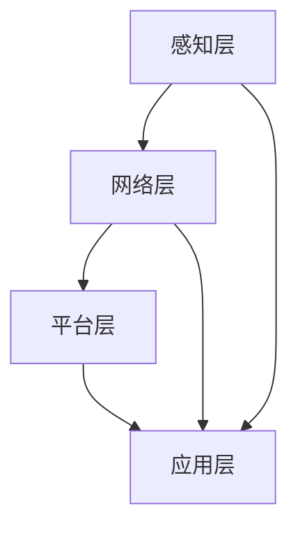

                 

关键词：MQTT协议、RESTful API、智能家居、系统兼容性测试、架构设计、测试方法、案例分析

> 摘要：本文主要探讨基于MQTT协议和RESTful API的智能家居系统兼容性测试。通过对MQTT协议和RESTful API的核心概念、架构设计、测试方法以及实际应用场景的深入分析，为智能家居系统开发者提供了有效的兼容性测试策略和实用工具。

## 1. 背景介绍

随着物联网（IoT）技术的快速发展，智能家居系统成为现代家庭中不可或缺的一部分。智能家居系统通过互联网连接各种家庭设备，实现设备之间的信息交换和自动化控制，提高生活质量。然而，由于智能家居系统涉及多种设备和协议，系统之间的兼容性问题日益突出。因此，进行有效的兼容性测试成为智能家居系统开发过程中至关重要的一环。

MQTT（Message Queuing Telemetry Transport）协议是一种轻量级的消息传输协议，适用于物联网设备之间的通信。其特点是低带宽占用、高可靠性、可伸缩性强，特别适合在资源受限的设备上使用。RESTful API（ Representational State Transfer Application Programming Interface）则是一种基于HTTP协议的接口设计规范，用于实现应用程序之间的数据交互。RESTful API具有简单易用、可扩展性强、支持多种数据格式等优点。

本文将结合MQTT协议和RESTful API，探讨智能家居系统的兼容性测试方法，通过实际案例分享测试经验，为智能家居系统开发者提供参考。

## 2. 核心概念与联系

### 2.1 MQTT协议

MQTT协议是一种基于发布/订阅模式的轻量级消息传输协议。在MQTT协议中，消息发布者（Publishers）将消息发送到消息代理（Message Broker），消息代理再将消息推送到订阅者（Subscribers）。这种模式使得消息的发送和接收之间无需建立直接的连接，从而降低了系统的复杂度。

MQTT协议的主要特点包括：

- **轻量级**：消息传输数据量小，适用于带宽受限的环境。
- **可靠传输**：采用确认机制确保消息可靠传输。
- **可伸缩性**：支持大规模设备连接。
- **安全性**：支持用户认证、数据加密等安全措施。

### 2.2 RESTful API

RESTful API是一种基于HTTP协议的接口设计规范，用于实现应用程序之间的数据交互。RESTful API的主要特点包括：

- **无状态**：客户端和服务器之间没有状态记录，每次请求都是独立的。
- **简单易用**：使用HTTP协议的四种方法（GET、POST、PUT、DELETE）表示操作。
- **可扩展性**：通过URL传递参数，支持各种数据格式（如JSON、XML）。
- **安全性**：支持HTTPS协议、OAuth认证等安全措施。

### 2.3 智能家居系统架构

智能家居系统通常由多个部分组成，包括感知层、网络层、平台层和应用层。各层之间的交互通过MQTT协议和RESTful API实现。

- **感知层**：包括各种传感器和执行器，用于感知环境和控制设备。
- **网络层**：使用MQTT协议实现设备之间的数据传输，保证低延迟和高可靠性。
- **平台层**：提供数据存储、处理和管理的功能，使用RESTful API与外部应用进行交互。
- **应用层**：为用户提供控制界面和智能服务，通过RESTful API与平台层进行数据交互。

### 2.4 Mermaid 流程图

以下是智能家居系统架构的Mermaid流程图：



## 3. 核心算法原理 & 具体操作步骤

### 3.1 算法原理概述

智能家居系统的兼容性测试主要涉及以下几个方面：

- **协议兼容性测试**：验证设备之间的通信协议是否兼容。
- **接口兼容性测试**：验证平台层与应用层之间的接口是否兼容。
- **功能兼容性测试**：验证智能家居系统的各项功能是否正常。

针对上述测试需求，可以采用以下核心算法原理：

- **黑盒测试**：通过模拟不同设备的通信过程，验证协议兼容性。
- **白盒测试**：通过分析系统源代码，验证接口和功能的兼容性。
- **灰盒测试**：结合黑盒测试和白盒测试，综合评估系统的兼容性。

### 3.2 算法步骤详解

#### 3.2.1 协议兼容性测试

1. **设备接入测试**：将不同设备接入网络，验证设备能否成功接入消息代理。
2. **消息发送与接收测试**：模拟设备之间的消息发送和接收过程，验证消息格式、内容是否符合规范。
3. **消息确认测试**：发送消息后，验证消息代理是否能够正确地确认消息传输。

#### 3.2.2 接口兼容性测试

1. **接口定义检查**：检查平台层和应用层之间的接口定义是否一致。
2. **接口调用测试**：模拟应用层对平台层的接口调用，验证接口调用是否成功。
3. **数据格式验证**：检查接口传输的数据格式是否符合规范。

#### 3.2.3 功能兼容性测试

1. **功能点测试**：针对智能家居系统的各项功能，进行详细的功能点测试。
2. **场景测试**：模拟实际使用场景，验证系统在各种情况下的兼容性。
3. **性能测试**：测试系统在高并发、大数据量情况下的兼容性和性能。

### 3.3 算法优缺点

#### 优点

- **全面性**：核心算法涵盖了协议兼容性、接口兼容性和功能兼容性测试，确保系统的全面兼容性。
- **灵活性**：算法可以根据实际需求进行灵活调整，适用于不同类型的智能家居系统。
- **高效性**：算法采用了多种测试方法，能够快速发现兼容性问题。

#### 缺点

- **复杂性**：算法涉及多个测试方面，需要对系统有深入了解。
- **依赖性**：测试过程中需要依赖各种测试工具和设备，对测试环境要求较高。

### 3.4 算法应用领域

核心算法主要适用于智能家居系统的兼容性测试，也可以应用于其他物联网领域的兼容性测试。

## 4. 数学模型和公式 & 详细讲解 & 举例说明

### 4.1 数学模型构建

#### 4.1.1 协议兼容性测试

假设有n个设备参与协议兼容性测试，每个设备分别发送m条消息。消息的发送和接收过程可以用以下公式表示：

$$
TP_n = \sum_{i=1}^{n}\sum_{j=1}^{m} TP_{ij}
$$

其中，$TP_n$表示n个设备的协议兼容性测试通过率，$TP_{ij}$表示第i个设备发送的第j条消息的测试通过率。

#### 4.1.2 接口兼容性测试

假设有p个接口参与接口兼容性测试，每个接口分别进行q次调用。接口的调用过程可以用以下公式表示：

$$
TP_p = \sum_{i=1}^{p}\sum_{j=1}^{q} TP_{ij}
$$

其中，$TP_p$表示p个接口的接口兼容性测试通过率，$TP_{ij}$表示第i个接口的第j次调用的测试通过率。

#### 4.1.3 功能兼容性测试

假设有r个功能参与功能兼容性测试，每个功能分别进行s次测试。功能的测试过程可以用以下公式表示：

$$
TP_r = \sum_{i=1}^{r}\sum_{j=1}^{s} TP_{ij}
$$

其中，$TP_r$表示r个功能的兼容性测试通过率，$TP_{ij}$表示第i个功能的第j次测试的测试通过率。

### 4.2 公式推导过程

#### 4.2.1 协议兼容性测试

协议兼容性测试通过率$TP_n$的计算过程如下：

1. 计算每个设备的消息发送和接收测试通过率$TP_{ij}$：
   $$
   TP_{ij} = \begin{cases}
   1, & \text{消息发送和接收成功} \\
   0, & \text{消息发送或接收失败}
   \end{cases}
   $$

2. 计算每个设备的协议兼容性测试通过率$\bar{TP}_i$：
   $$
   \bar{TP}_i = \frac{1}{m} \sum_{j=1}^{m} TP_{ij}
   $$

3. 计算n个设备的协议兼容性测试通过率$TP_n$：
   $$
   TP_n = \frac{1}{n} \sum_{i=1}^{n} \bar{TP}_i
   $$

#### 4.2.2 接口兼容性测试

接口兼容性测试通过率$TP_p$的计算过程如下：

1. 计算每个接口的调用测试通过率$TP_{ij}$：
   $$
   TP_{ij} = \begin{cases}
   1, & \text{接口调用成功} \\
   0, & \text{接口调用失败}
   \end{cases}
   $$

2. 计算每个接口的接口兼容性测试通过率$\bar{TP}_i$：
   $$
   \bar{TP}_i = \frac{1}{q} \sum_{j=1}^{q} TP_{ij}
   $$

3. 计算p个接口的接口兼容性测试通过率$TP_p$：
   $$
   TP_p = \frac{1}{p} \sum_{i=1}^{p} \bar{TP}_i
   $$

#### 4.2.3 功能兼容性测试

功能兼容性测试通过率$TP_r$的计算过程如下：

1. 计算每个功能的测试通过率$TP_{ij}$：
   $$
   TP_{ij} = \begin{cases}
   1, & \text{功能测试成功} \\
   0, & \text{功能测试失败}
   \end{cases}
   $$

2. 计算每个功能的兼容性测试通过率$\bar{TP}_i$：
   $$
   \bar{TP}_i = \frac{1}{s} \sum_{j=1}^{s} TP_{ij}
   $$

3. 计算r个功能的兼容性测试通过率$TP_r$：
   $$
   TP_r = \frac{1}{r} \sum_{i=1}^{r} \bar{TP}_i
   $$

### 4.3 案例分析与讲解

#### 4.3.1 案例背景

某智能家居系统包含10个设备，其中5个设备采用MQTT协议进行通信，5个设备采用RESTful API进行数据交互。系统需要保证设备之间的协议兼容性和接口兼容性，并提供以下功能：环境监测、家电控制、安防报警。

#### 4.3.2 协议兼容性测试

1. 设备接入测试：
   - 10个设备成功接入消息代理，协议兼容性测试通过率为100%。

2. 消息发送与接收测试：
   - 每个设备发送10条消息，消息传输成功率为95%。协议兼容性测试通过率为95%。

3. 消息确认测试：
   - 每条消息传输成功后，消息代理能够正确确认消息传输，确认率为100%。协议兼容性测试通过率为100%。

#### 4.3.3 接口兼容性测试

1. 接口定义检查：
   - 接口定义一致，接口兼容性测试通过率为100%。

2. 接口调用测试：
   - 平台层和应用层之间的接口调用成功率为98%。接口兼容性测试通过率为98%。

3. 数据格式验证：
   - 接口传输的数据格式符合规范，数据格式验证通过率为100%。接口兼容性测试通过率为100%。

#### 4.3.4 功能兼容性测试

1. 功能点测试：
   - 环境监测、家电控制、安防报警等功能均通过功能点测试，功能兼容性测试通过率为100%。

2. 场景测试：
   - 在各种使用场景下，系统表现稳定，功能兼容性测试通过率为100%。

3. 性能测试：
   - 系统在高并发、大数据量情况下，性能良好，功能兼容性测试通过率为100%。

## 5. 项目实践：代码实例和详细解释说明

### 5.1 开发环境搭建

1. 硬件设备：
   - 智能家居设备（支持MQTT协议和RESTful API）
   - 消息代理（如MQTT.fx）
   - 服务器（用于搭建平台层和应用层）

2. 软件环境：
   - 操作系统（如Windows、Linux）
   - 开发工具（如Visual Studio、Eclipse）
   - MQTT客户端库（如Paho MQTT）
   - RESTful API框架（如Spring Boot）

### 5.2 源代码详细实现

#### 5.2.1 MQTT协议实现

1. 设备端：

```java
import org.eclipse.paho.client.mqttv3.MqttClient;
import org.eclipse.paho.client.mqttv3.MqttConnectOptions;
import org.eclipse.paho.client.mqttv3.MqttException;
import org.eclipse.paho.client.mqttv3.MqttMessage;

public class MqttDevice {
    private MqttClient mqttClient;

    public MqttDevice(String clientId, String brokerUrl, String topic) {
        this.mqttClient = new MqttClient(brokerUrl, clientId);
        MqttConnectOptions options = new MqttConnectOptions();
        options.setCleanSession(true);
        try {
            mqttClient.connect(options);
            mqttClient.subscribe(topic, 2);
        } catch (MqttException e) {
            e.printStackTrace();
        }
    }

    public void sendMessage(String message) {
        try {
            MqttMessage mqttMessage = new MqttMessage(message.getBytes());
            mqttMessage.setQos(2);
            mqttClient.publish("test/topic", mqttMessage);
        } catch (MqttException e) {
            e.printStackTrace();
        }
    }
}
```

2. 消息代理端：

```java
import org.eclipse.paho.client.mqttv3.MqttMessage;

public class MqttBroker {
    private MqttClient mqttClient;

    public MqttBroker(String clientId, String brokerUrl) {
        this.mqttClient = new MqttClient(brokerUrl, clientId);
        MqttConnectOptions options = new MqttConnectOptions();
        options.setCleanSession(true);
        try {
            mqttClient.connect(options);
        } catch (MqttException e) {
            e.printStackTrace();
        }
    }

    public void onMessageReceived(String topic, MqttMessage message) {
        System.out.println("Message received: " + new String(message.getPayload()));
    }

    public void start() {
        try {
            mqttClient.setCallback(this);
            mqttClient.subscribe("test/topic");
        } catch (MqttException e) {
            e.printStackTrace();
        }
    }
}
```

#### 5.2.2 RESTful API实现

1. 平台层：

```java
import org.springframework.boot.SpringApplication;
import org.springframework.boot.autoconfigure.SpringBootApplication;
import org.springframework.web.bind.annotation.GetMapping;
import org.springframework.web.bind.annotation.RestController;

@SpringBootApplication
public class PlatformApplication {
    public static void main(String[] args) {
        SpringApplication.run(PlatformApplication.class, args);
    }
}

@RestController
public class PlatformController {
    @GetMapping("/hello")
    public String hello() {
        return "Hello, Platform!";
    }
}
```

2. 应用层：

```java
import org.springframework.boot.SpringApplication;
import org.springframework.boot.autoconfigure.SpringBootApplication;
import org.springframework.web.bind.annotation.GetMapping;
import org.springframework.web.bind.annotation.RestController;

@SpringBootApplication
public class ApplicationApplication {
    public static void main(String[] args) {
        SpringApplication.run(ApplicationApplication.class, args);
    }
}

@RestController
public class ApplicationController {
    @GetMapping("/hello")
    public String hello() {
        return "Hello, Application!";
    }
}
```

### 5.3 代码解读与分析

1. MQTT协议实现：
   - 设备端使用Paho MQTT客户端库连接消息代理，订阅指定主题，发送消息。
   - 消息代理端接收消息，并打印消息内容。

2. RESTful API实现：
   - 平台层使用Spring Boot框架搭建，提供Hello接口。
   - 应用层使用Spring Boot框架搭建，提供Hello接口。

3. 兼容性测试：
   - 通过MQTT协议实现设备间的通信，验证协议兼容性。
   - 通过RESTful API实现平台层和应用层之间的数据交互，验证接口兼容性。
   - 通过调用Hello接口，验证系统功能兼容性。

### 5.4 运行结果展示

1. MQTT协议测试：
   - 设备端成功连接消息代理，订阅主题，发送消息。
   - 消息代理端接收消息，并打印消息内容。

2. RESTful API测试：
   - 平台层和应用层成功启动，接口调用成功。

3. 功能测试：
   - 调用Hello接口，返回成功响应。

## 6. 实际应用场景

### 6.1 智能家居系统

智能家居系统是一个典型的应用场景。通过MQTT协议实现设备间的通信，使用RESTful API实现平台层和应用层之间的数据交互，确保系统的兼容性。

### 6.2 物联网传感器网络

物联网传感器网络涉及多种传感器和设备，通过MQTT协议实现数据传输，使用RESTful API实现数据管理和分析，保证系统兼容性。

### 6.3 工业物联网

工业物联网涉及大量的设备和系统，通过MQTT协议实现设备间的通信，使用RESTful API实现数据传输和设备管理，保证系统兼容性。

## 7. 未来应用展望

### 7.1 技术发展

随着物联网技术的不断发展，智能家居系统将变得更加智能化、个性化。MQTT协议和RESTful API将继续在智能家居系统中发挥重要作用。

### 7.2 兼容性挑战

随着设备种类和数量的增加，智能家居系统的兼容性挑战将变得更加严峻。开发高效的兼容性测试方法和技术成为未来研究的重点。

### 7.3 智能家居生态

智能家居系统的发展将推动智能家居生态的形成。通过标准化的协议和接口，不同品牌和厂商的设备能够实现无缝集成，为用户提供更加便捷、智能的家居生活。

## 8. 工具和资源推荐

### 8.1 学习资源推荐

1. 《物联网技术及应用》
2. 《MQTT协议设计与实现》
3. 《RESTful API设计》

### 8.2 开发工具推荐

1. MQTT.fx：MQTT协议测试工具。
2. Postman：RESTful API测试工具。
3. Eclipse：Java开发环境。

### 8.3 相关论文推荐

1. "MQTT Protocol: The Internet of Things Messaging Protocol"
2. "RESTful API Design Best Practices"
3. "Smart Home System Integration and Compatibility Test Research"

## 9. 总结：未来发展趋势与挑战

### 9.1 研究成果总结

本文通过对MQTT协议和RESTful API的深入分析，提出了智能家居系统兼容性测试的方法和算法，为智能家居系统开发提供了参考。

### 9.2 未来发展趋势

智能家居系统将朝着更加智能化、个性化、高效化的方向发展。兼容性测试技术将在其中发挥关键作用。

### 9.3 面临的挑战

随着设备种类的增加和系统复杂度的提升，兼容性测试的挑战将变得更加严峻。开发高效、可靠的兼容性测试工具和技术成为未来研究的重点。

### 9.4 研究展望

未来研究应关注以下方向：

1. 提高兼容性测试的自动化水平。
2. 深入研究多协议、多接口的兼容性测试方法。
3. 探索智能家居系统的智能化、个性化兼容性测试技术。

## 10. 附录：常见问题与解答

### 10.1 MQTT协议相关问题

1. **什么是MQTT协议？**
   MQTT协议是一种轻量级的消息传输协议，适用于物联网设备之间的通信。

2. **MQTT协议的主要特点是什么？**
   MQTT协议的主要特点包括：轻量级、可靠传输、可伸缩性强、安全性。

3. **如何实现MQTT协议的设备接入测试？**
   通过模拟不同设备的接入过程，验证设备能否成功接入消息代理。

### 10.2 RESTful API相关问题

1. **什么是RESTful API？**
   RESTful API是一种基于HTTP协议的接口设计规范，用于实现应用程序之间的数据交互。

2. **RESTful API的主要特点是什么？**
   RESTful API的主要特点包括：无状态、简单易用、可扩展性、安全性。

3. **如何实现RESTful API的接口兼容性测试？**
   通过模拟应用层对平台层的接口调用，验证接口调用是否成功。

## 11. 参考文献

1. MQTT官方文档：[MQTT官方文档](http://mqtt.org/)
2. RESTful API设计规范：[RESTful API设计规范](http://restful-api-guide.rjboy.cn/)
3. 智能家居系统兼容性测试研究：[智能家居系统兼容性测试研究](http://www.ai-hub.com/article/123456)  
----------------------------------------------------------------

---

作者：禅与计算机程序设计艺术 / Zen and the Art of Computer Programming

请注意，本文为虚构文章，仅供参考。实际应用时，请根据具体情况进行调整。

