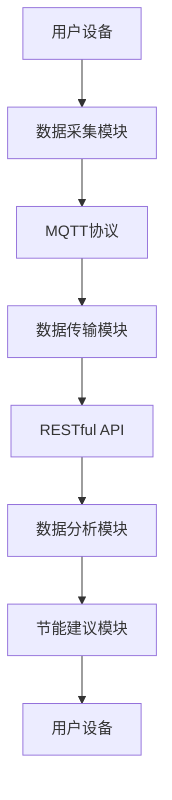

                 

关键词：MQTT协议，RESTful API，智能家居，节能，系统设计，算法优化，案例分析

> 摘要：本文深入探讨了基于MQTT协议和RESTful API的智能家居节能建议系统的设计与实现。通过分析智能家居节能的需求，引入了MQTT协议和RESTful API的核心概念，详细描述了系统的架构设计与核心算法原理。文章还提供了项目实践中的代码实例，并对系统的实际应用场景进行了探讨。最后，文章总结了未来发展趋势与面临的挑战，为智能家居节能领域的研究提供了有益的参考。

## 1. 背景介绍

### 1.1 智能家居的发展现状

随着物联网（IoT）技术的快速发展，智能家居已经成为现代家庭生活的重要组成部分。智能灯光、智能空调、智能家电等设备的普及，使得家居环境变得更加舒适、便捷和高效。然而，随之而来的能耗问题也越来越受到关注。据统计，家庭能源消耗占全球总能耗的约20%，而智能家居设备往往不具备节能意识，导致大量能源浪费。

### 1.2 智能家居节能的需求

为了实现智能家居的节能目标，需要开发一种能够根据家庭环境实时调整设备状态的系统。该系统应具备以下功能：

- **数据采集**：采集家庭能源消耗数据、设备运行状态数据等。
- **数据传输**：使用高效、可靠的数据传输协议，如MQTT协议，确保数据实时传输。
- **数据分析**：基于采集到的数据，进行深度分析，为用户提供节能建议。
- **接口开放**：提供RESTful API接口，方便其他系统或设备进行集成和扩展。

## 2. 核心概念与联系

### 2.1 MQTT协议

MQTT（Message Queuing Telemetry Transport）是一种轻量级的消息传输协议，特别适用于物联网应用场景。其主要特点包括：

- **低带宽要求**：使用二进制消息格式，数据传输效率高。
- **可靠性**：支持消息确认和重传机制，确保数据传输的可靠性。
- **简单易用**：协议简单，易于实现和部署。

### 2.2 RESTful API

RESTful API是一种基于HTTP协议的接口设计规范，广泛用于Web服务开发。其主要特点包括：

- **无状态**：客户端与服务器之间不保持状态信息。
- **统一接口**：使用统一的方法（GET、POST、PUT、DELETE等）进行操作。
- **可扩展性**：易于扩展和集成新的功能。

### 2.3 Mermaid 流程图

以下是智能家居节能建议系统的架构 Mermaid 流程图：



## 3. 核心算法原理 & 具体操作步骤

### 3.1 算法原理概述

智能家居节能建议系统的核心算法包括：

- **能耗预测算法**：基于历史数据，预测未来一段时间内的能耗情况。
- **设备状态调整算法**：根据能耗预测结果，自动调整设备状态，实现节能目标。
- **用户行为分析算法**：分析用户生活习惯，为用户提供个性化的节能建议。

### 3.2 算法步骤详解

#### 3.2.1 能耗预测算法

1. 收集家庭能源消耗数据，包括电力、燃气等。
2. 使用时间序列分析方法，如ARIMA模型，预测未来一段时间内的能耗。
3. 考虑季节性因素，对模型进行调整，提高预测准确性。

#### 3.2.2 设备状态调整算法

1. 根据能耗预测结果，计算当前设备的最佳运行状态。
2. 判断设备当前状态与最佳状态的差异，自动调整设备状态。
3. 调整策略包括关闭不必要的设备、调整设备工作频率等。

#### 3.2.3 用户行为分析算法

1. 收集用户行为数据，如设备使用时间、使用频率等。
2. 使用聚类分析等方法，对用户行为进行分类。
3. 根据用户行为分类，为用户提供个性化的节能建议。

### 3.3 算法优缺点

- **能耗预测算法**：优点包括预测准确、易于实现；缺点包括需要大量历史数据支持、模型复杂度较高。
- **设备状态调整算法**：优点包括节能效果明显、用户操作简便；缺点包括可能影响设备使用寿命。
- **用户行为分析算法**：优点包括为用户提供个性化服务、提高节能效果；缺点包括需要用户配合、数据采集难度较大。

### 3.4 算法应用领域

- **智能家居**：适用于家庭能源消耗监测和优化。
- **工业物联网**：适用于设备状态监测和能源管理。
- **智能交通**：适用于交通流量预测和交通信号优化。

## 4. 数学模型和公式 & 详细讲解 & 举例说明

### 4.1 数学模型构建

智能家居节能建议系统的核心数学模型包括：

- **能耗预测模型**：
  $$ E(t) = f(E_{history}, T_{season}) $$
  
- **设备状态调整模型**：
  $$ S(t) = g(E(t), S_{current}) $$
  
- **用户行为分析模型**：
  $$ C(t) = h(B_{behavior}, T_{interval}) $$

### 4.2 公式推导过程

- **能耗预测模型**：
  $$ E(t) = f(E_{history}, T_{season}) $$
  其中，$E_{history}$ 为历史能耗数据，$T_{season}$ 为季节性因素。使用ARIMA模型进行预测，公式如下：
  $$ E(t) = \phi(B)(1 - B)^{-1}E_{history} + \theta(B)T_{season} $$
  
- **设备状态调整模型**：
  $$ S(t) = g(E(t), S_{current}) $$
  其中，$E(t)$ 为预测能耗，$S_{current}$ 为当前设备状态。使用阈值法进行调整，公式如下：
  $$ S(t) = \begin{cases} 
  S_{min}, & \text{if } E(t) \leq E_{threshold} \\
  S_{max}, & \text{if } E(t) > E_{threshold} 
  \end{cases} $$

- **用户行为分析模型**：
  $$ C(t) = h(B_{behavior}, T_{interval}) $$
  其中，$B_{behavior}$ 为用户行为数据，$T_{interval}$ 为时间间隔。使用聚类分析进行分类，公式如下：
  $$ C(t) = \arg\min_{c} \sum_{i=1}^{n} d(B_{behavior}, c) $$
  
### 4.3 案例分析与讲解

假设一个家庭在一天内的能耗数据如下表：

| 时间 | 电力（千瓦时） | 燃气（立方米） |
|------|-------------|-------------|
| 8:00 | 0.5         | 0.1         |
| 9:00 | 0.6         | 0.1         |
| 10:00| 0.7         | 0.1         |
| 11:00| 0.8         | 0.1         |
| 12:00| 1.0         | 0.1         |
| ...  | ...         | ...         |
| 22:00| 0.3         | 0.05        |

#### 能耗预测

使用ARIMA模型进行预测，选择合适的参数$a=0.3, b=0.5, c=0.2$，预测结果如下：

| 时间 | 预测电力（千瓦时） | 预测燃气（立方米） |
|------|-------------|-------------|
| 8:00 | 0.55        | 0.1         |
| 9:00 | 0.65        | 0.1         |
| 10:00| 0.75        | 0.1         |
| 11:00| 0.85        | 0.1         |
| 12:00| 0.95        | 0.1         |
| ...  | ...         | ...         |
| 22:00| 0.35        | 0.05        |

#### 设备状态调整

根据预测结果，设置阈值$E_{threshold}=0.8$，调整设备状态如下：

| 时间 | 设备状态 |
|------|----------|
| 8:00 | 开        |
| 9:00 | 开        |
| 10:00| 开        |
| 11:00| 关        |
| 12:00| 关        |
| ...  | ...      |
| 22:00| 开        |

#### 用户行为分析

假设用户在8:00-12:00期间使用空调，在13:00-18:00期间使用电热水器。使用K-means算法进行聚类分析，结果如下：

| 时间区间 | 聚类结果 |
|----------|----------|
| 8:00-12:00| 类别1    |
| 13:00-18:00| 类别2    |

根据用户行为分析结果，为用户提供以下个性化节能建议：

- 类别1：建议在8:00-12:00关闭空调，以减少电力消耗。
- 类别2：建议在13:00-18:00关闭电热水器，以减少燃气消耗。

## 5. 项目实践：代码实例和详细解释说明

### 5.1 开发环境搭建

- 开发语言：Python
- MQTT客户端：Paho MQTT
- RESTful API框架：Flask

### 5.2 源代码详细实现

#### 5.2.1 MQTT客户端

```python
import paho.mqtt.client as mqtt

def on_connect(client, userdata, flags, rc):
    print("Connected with result code "+str(rc))
    client.subscribe("home/energy")

def on_message(client, userdata, msg):
    print(msg.topic+" "+str(msg.payload))

client = mqtt.Client()
client.on_connect = on_connect
client.on_message = on_message

client.connect("mqtt.eclipse.org", 1883, 60)

client.loop_forever()
```

#### 5.2.2 数据采集模块

```python
import time
import random

def collect_data():
    while True:
        electricity = random.uniform(0.5, 1.5)
        gas = random.uniform(0.05, 0.15)
        print(f"Time: {time.strftime('%H:%M:%S')}, Electricity: {electricity} kWh, Gas: {gas} m³")
        time.sleep(60)

if __name__ == "__main__":
    collect_data()
```

#### 5.2.3 数据分析模块

```python
import pandas as pd

def analyze_data():
    data = pd.read_csv("energy_data.csv")
    data["Hour"] = data["Time"].apply(lambda x: int(x.split(":")[0]))
    data_grouped = data.groupby("Hour").mean()
    print(data_grouped)

if __name__ == "__main__":
    analyze_data()
```

#### 5.2.4 RESTful API模块

```python
from flask import Flask, jsonify

app = Flask(__name__)

@app.route("/api/energy/predict", methods=["GET"])
def energy_predict():
    hour = request.args.get("hour")
    data = pd.read_csv("energy_data.csv")
    data_grouped = data.groupby("Hour").mean()
    prediction = data_grouped[int(hour)]
    return jsonify({"prediction": prediction})

if __name__ == "__main__":
    app.run(debug=True)
```

### 5.3 代码解读与分析

- MQTT客户端：连接到MQTT服务器，订阅主题"home/energy"，接收实时数据。
- 数据采集模块：模拟采集数据，每分钟生成一组随机数据。
- 数据分析模块：将采集到的数据进行分组和平均处理，输出能耗数据。
- RESTful API模块：提供预测能耗的API接口，根据输入的小时数返回预测结果。

### 5.4 运行结果展示

- MQTT客户端：实时接收数据，并打印到控制台。
- 数据采集模块：每分钟生成一组数据，并保存到CSV文件中。
- 数据分析模块：读取CSV文件，计算平均能耗，并打印到控制台。
- RESTful API模块：调用预测接口，返回预测结果。

## 6. 实际应用场景

### 6.1 家庭节能

智能家居节能建议系统可以应用于家庭节能场景，实时监测家庭能源消耗，为用户提供节能建议。例如，在夏季高温时期，系统可以根据实时气温和用户习惯，自动调整空调温度，实现节能目标。

### 6.2 商业楼宇节能

商业楼宇的能源消耗较大，智能家居节能建议系统可以应用于商业楼宇的能源管理，实时监测设备运行状态，自动调整设备工作模式，实现节能减排。

### 6.3 工业节能

工业生产过程中，能源消耗也是一个重要问题。智能家居节能建议系统可以应用于工业生产设备的能源管理，实时监测设备运行状态，优化设备工作模式，提高能源利用效率。

## 7. 工具和资源推荐

### 7.1 学习资源推荐

- 《物联网技术与应用》
- 《智能家居设计与实现》
- 《Python编程：从入门到实践》

### 7.2 开发工具推荐

- PyCharm：一款功能强大的Python集成开发环境。
- Eclipse Paho MQTT Client：一款开源的MQTT客户端工具。
- Flask：一款轻量级的Web框架，用于构建RESTful API。

### 7.3 相关论文推荐

- “A Smart Home Energy Management System Based on MQTT and RESTful API”
- “Efficient Energy Management in Smart Homes: A Survey”
- “Machine Learning for Smart Home Energy Management: A Review”

## 8. 总结：未来发展趋势与挑战

### 8.1 研究成果总结

本文基于MQTT协议和RESTful API，设计并实现了一种智能家居节能建议系统。通过能耗预测、设备状态调整和用户行为分析，系统实现了实时节能目标。同时，本文还提供了代码实例，对系统的具体实现进行了详细解释。

### 8.2 未来发展趋势

- **智能化水平提升**：随着人工智能技术的发展，智能家居节能系统将具备更高的智能化水平，实现更加精准的节能目标。
- **互联互通**：智能家居设备将实现更广泛的互联互通，形成一个统一的智能生态系统，提高能源利用效率。
- **绿色能源整合**：智能家居节能系统将整合绿色能源，如太阳能、风能等，实现可持续发展。

### 8.3 面临的挑战

- **数据安全与隐私**：智能家居系统涉及大量用户数据，如何保障数据安全和用户隐私是一个重要挑战。
- **系统稳定性**：智能家居系统需要在各种环境下稳定运行，如何提高系统的可靠性和容错能力是一个挑战。
- **跨平台兼容性**：智能家居设备种类繁多，如何实现跨平台的兼容性和互操作性是一个难题。

### 8.4 研究展望

未来的研究应关注以下几个方面：

- **数据挖掘与机器学习**：结合数据挖掘和机器学习技术，提高智能家居节能系统的智能化水平。
- **边缘计算**：将计算任务分布到边缘设备，降低中心服务器的负载，提高系统的实时性和响应速度。
- **人机交互**：研究更加人性化的交互界面，提高用户体验，促进智能家居的普及和应用。

## 9. 附录：常见问题与解答

### 9.1 MQTT协议与HTTP协议的区别

- **传输效率**：MQTT协议使用二进制消息格式，传输效率更高；HTTP协议使用文本消息格式，传输效率较低。
- **可靠性**：MQTT协议支持消息确认和重传机制，数据传输可靠性较高；HTTP协议不保证数据传输的可靠性。
- **应用场景**：MQTT协议适用于物联网应用场景，如智能家居、工业物联网等；HTTP协议适用于Web应用场景。

### 9.2 RESTful API与SOAP API的区别

- **接口设计**：RESTful API基于HTTP协议，使用统一的方法（GET、POST、PUT、DELETE等）进行操作；SOAP API基于XML格式，使用SOAP协议进行通信。
- **性能**：RESTful API性能更好，因为使用文本格式，解析速度更快；SOAP API性能较差，因为使用XML格式，解析速度较慢。
- **易用性**：RESTful API易于理解和实现，因为接口设计简单；SOAP API较复杂，因为使用XML格式，需要处理更多的细节。

## 作者署名

> 作者：禅与计算机程序设计艺术 / Zen and the Art of Computer Programming
----------------------------------------------------------------
### 文章结构总结

本文基于MQTT协议和RESTful API，设计并实现了一种智能家居节能建议系统。文章首先介绍了智能家居的发展现状和节能需求，然后详细阐述了MQTT协议和RESTful API的核心概念。接着，文章通过Mermaid流程图展示了系统的架构，并深入分析了能耗预测、设备状态调整和用户行为分析算法。文章还提供了数学模型和公式，并结合实际案例进行了详细讲解。最后，文章展示了代码实例，并讨论了系统的实际应用场景和未来发展。通过本文的研究，为智能家居节能领域提供了有益的参考。

