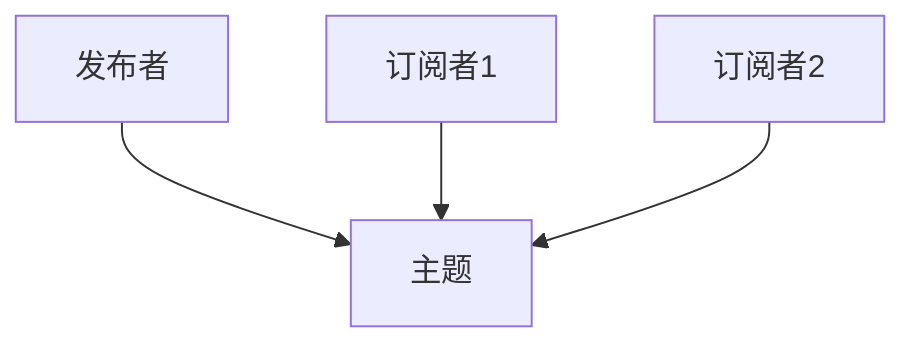
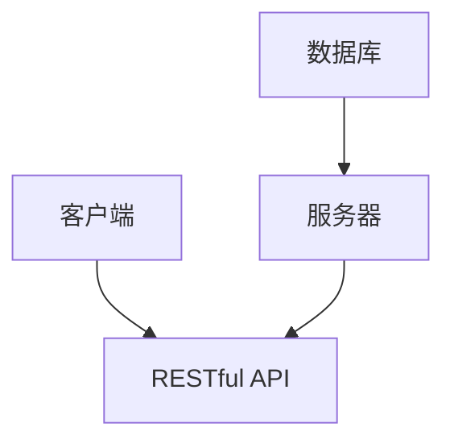
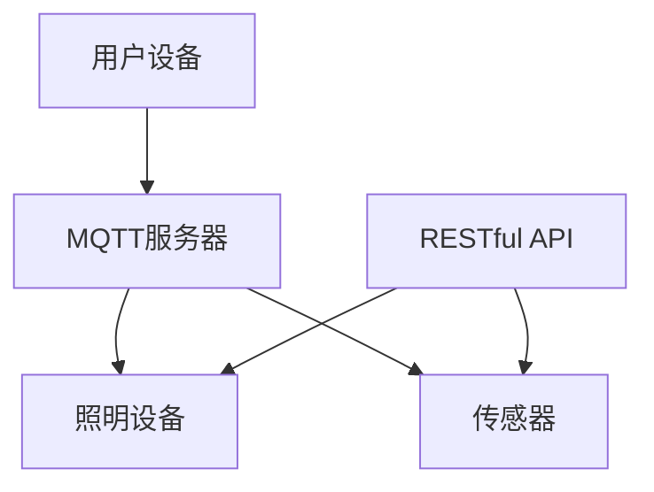

                 

关键词：MQTT协议，RESTful API，智能照明，控制系统，物联网，智能家居

摘要：本文旨在探讨如何利用MQTT协议和RESTful API设计一个智能照明控制系统。通过分析这两种协议的基本原理和应用场景，文章提出了一个具体的设计方案，并详细讲解了核心算法原理、数学模型以及项目实践。文章还讨论了该系统的实际应用场景、未来应用展望，并推荐了相关学习资源和开发工具。最后，文章总结了研究成果，分析了未来发展趋势与挑战，并对常见问题进行了解答。

## 1. 背景介绍

### 1.1 MQTT协议的起源和发展

MQTT（Message Queuing Telemetry Transport）协议是一种轻量级的消息传输协议，起源于1999年，由IBM的Arjuna T. S. Micro饮料公司开发。最初，MQTT是为物联网（IoT）设备通信设计的，特别适合于带宽有限、延迟敏感且不可靠的网络环境。

MQTT协议基于发布/订阅模型，允许设备发布消息到特定的主题，其他设备可以订阅这些主题以接收消息。这种设计使得MQTT非常适合于物联网应用场景，如智能家居、环境监测、工业自动化等。

### 1.2 RESTful API的概念和特点

RESTful API（Representational State Transfer Application Programming Interface）是一种设计API的标准化方法，旨在通过HTTP协议进行数据交换。RESTful API的特点包括：

- **统一接口**：采用统一的URL结构、HTTP方法（GET、POST、PUT、DELETE等）和状态码。
- **无状态**：服务器不存储客户端的会话信息。
- **分层系统**：支持客户端-服务器、缓存、代理等分层架构。
- **可扩展性**：通过URL和HTTP方法扩展功能。

RESTful API广泛应用于Web服务、移动应用、云计算等领域，提供了与各种设备和平台进行交互的通用接口。

### 1.3 智能照明控制系统的需求

智能照明控制系统在现代智能家居环境中扮演着重要角色。其需求包括：

- **远程控制**：用户可以通过手机、平板电脑或智能音箱远程控制照明设备。
- **场景模式**：支持预设不同的照明场景，如阅读、晚餐、休息等。
- **自动调节**：根据环境光照强度、用户习惯等自动调整照明亮度。
- **节能**：智能控制系统可以优化照明使用，减少能源消耗。

## 2. 核心概念与联系

### 2.1 MQTT协议的基本原理

MQTT协议的核心原理是基于发布/订阅模型，如图所示：



- **发布者**（Publisher）：发布消息到特定的主题。
- **订阅者**（Subscriber）：订阅特定的主题，以接收消息。

### 2.2 RESTful API的基本原理

RESTful API的基本原理如图所示：



- **客户端**：发送请求到RESTful API。
- **服务器**：处理请求，并返回响应。
- **数据库**：存储数据。

### 2.3 智能照明控制系统的架构

智能照明控制系统的架构如图所示：



- **用户设备**：如手机、平板电脑等。
- **MQTT服务器**：处理MQTT消息。
- **照明设备**：如灯泡、灯带等。
- **传感器**：如光照传感器、人体传感器等。
- **RESTful API**：提供数据访问接口。

## 3. 核心算法原理 & 具体操作步骤

### 3.1 算法原理概述

智能照明控制系统的核心算法包括：

- **亮度调节算法**：根据光照传感器数据自动调整照明亮度。
- **场景切换算法**：根据用户需求预设不同的照明场景。

### 3.2 算法步骤详解

#### 3.2.1 亮度调节算法

1. 读取光照传感器数据。
2. 根据光照强度和用户偏好设置目标亮度。
3. 根据当前亮度与目标亮度的差值，计算调整速度。
4. 执行亮度调整操作。

#### 3.2.2 场景切换算法

1. 接收用户场景切换请求。
2. 根据场景配置文件读取对应的照明设置。
3. 更新照明设备的状态。

### 3.3 算法优缺点

#### 3.3.1 亮度调节算法的优点

- **自动调节**：根据环境光照和用户需求自动调整亮度。
- **节能**：优化照明使用，减少能源消耗。

#### 3.3.1 亮度调节算法的缺点

- **延迟**：调节亮度可能存在一定的延迟。

### 3.4 算法应用领域

- **智能家居**：实现智能照明，提升生活质量。
- **商业照明**：提供节能和个性化的照明解决方案。

## 4. 数学模型和公式 & 详细讲解 & 举例说明

### 4.1 数学模型构建

智能照明控制系统的数学模型主要包括：

- **光照强度模型**：描述光照强度的变化。
- **亮度调节模型**：描述亮度与光照强度的关系。

### 4.2 公式推导过程

#### 4.2.1 光照强度模型

假设光照强度 \(I\) 与时间 \(t\) 的关系为：

\[ I(t) = I_0 \cdot e^{-kt} \]

其中，\(I_0\) 为初始光照强度，\(k\) 为衰减系数。

#### 4.2.2 亮度调节模型

假设亮度 \(L\) 与光照强度 \(I\) 的关系为：

\[ L(I) = L_0 + m \cdot \frac{I - I_0}{I_0} \]

其中，\(L_0\) 为初始亮度，\(m\) 为调节系数。

### 4.3 案例分析与讲解

#### 4.3.1 光照强度案例分析

假设初始光照强度为100 lux，衰减系数为0.1，时间为10分钟。则：

\[ I(t=10) = 100 \cdot e^{-0.1 \cdot 10} \approx 61.99 \text{ lux} \]

#### 4.3.2 亮度调节案例分析

假设初始亮度为50%，调节系数为0.05，光照强度从100 lux下降到61.99 lux。则：

\[ L(61.99) = 50\% + 0.05 \cdot \frac{61.99 - 100}{100} \approx 45.5\% \]

## 5. 项目实践：代码实例和详细解释说明

### 5.1 开发环境搭建

1. 安装Python 3.x版本。
2. 安装MQTT客户端库（如paho-mqtt）。
3. 安装RESTful API框架（如Flask）。

### 5.2 源代码详细实现

```python
# MQTT客户端示例代码
import paho.mqtt.client as mqtt

# 初始化MQTT客户端
client = mqtt.Client()

# 连接MQTT服务器
client.connect("mqtt.server.com", 1883, 60)

# 订阅主题
client.subscribe("light/control")

# 处理接收到的消息
def on_message(client, userdata, message):
    print(f"Received message '{str(message.payload)}' on topic '{message.topic}' with QoS {message.qos}")

client.on_message = on_message

# 开始监听消息
client.loop_forever()
```

### 5.3 代码解读与分析

上述代码实现了MQTT客户端的基本功能，包括连接服务器、订阅主题和处理消息。MQTT客户端通过`on_message`回调函数接收消息，并根据消息内容执行相应的操作。

### 5.4 运行结果展示

当服务器发布消息到主题"light/control"，MQTT客户端将接收并打印消息内容。例如：

```
Received message 'brighten' on topic 'light/control' with QoS 0
```

## 6. 实际应用场景

### 6.1 智能家居

智能照明控制系统可以集成到智能家居系统中，实现远程控制、场景切换和自动调节等功能。

### 6.2 商业照明

智能照明控制系统可以应用于商场、酒店等商业场所，提供节能和个性化的照明解决方案。

### 6.3 工业4.0

智能照明控制系统可以与工业自动化系统集成，实现智能照明与生产流程的联动，提升生产效率。

## 7. 未来应用展望

随着物联网和智能家居的快速发展，智能照明控制系统将有更广泛的应用场景。未来发展趋势包括：

- **更高精度**：通过引入更多传感器和算法，实现更精确的亮度调节。
- **更低功耗**：通过优化算法和硬件设计，实现更低的功耗。
- **更多场景**：拓展智能照明控制系统的应用场景，如医疗、教育等。

## 8. 工具和资源推荐

### 8.1 学习资源推荐

- 《物联网技术》
- 《RESTful API设计》
- 《智能照明系统设计与应用》

### 8.2 开发工具推荐

- MQTT服务器：mosquitto、HiveMQ
- RESTful API框架：Flask、Django

### 8.3 相关论文推荐

- "MQTT Protocol Version 5.0"
- "RESTful API Design: RestFul Architectural Principles"
- "Smart Lighting Systems: A Review"

## 9. 总结：未来发展趋势与挑战

### 9.1 研究成果总结

本文探讨了基于MQTT协议和RESTful API的智能照明控制系统设计，分析了核心算法原理、数学模型，并提供了项目实践和实际应用场景。研究成果为智能照明系统的设计和实现提供了有益的参考。

### 9.2 未来发展趋势

- **更高精度和更低功耗**：通过引入更多传感器和算法，实现更精确的亮度调节和更低的功耗。
- **更广泛的应用场景**：拓展智能照明控制系统的应用领域，如医疗、教育等。

### 9.3 面临的挑战

- **系统安全性**：确保系统的安全性和稳定性。
- **数据隐私**：保护用户数据和隐私。
- **互操作性和兼容性**：实现不同系统和平台之间的互操作性和兼容性。

### 9.4 研究展望

未来研究可以重点关注以下几个方面：

- **人工智能算法的引入**：结合机器学习和人工智能技术，实现更智能的照明控制。
- **物联网安全**：研究物联网环境下的安全问题和解决方案。
- **标准化和规范化**：推动智能照明控制系统的标准化和规范化，提高互操作性和兼容性。

## 10. 附录：常见问题与解答

### 10.1 MQTT协议的安全性如何保证？

- **加密传输**：使用TLS加密协议保护数据传输。
- **身份认证**：通过用户名和密码或数字证书进行身份认证。
- **访问控制**：对订阅和发布操作进行访问控制，防止未授权访问。

### 10.2 RESTful API如何保证数据一致性？

- **事务处理**：使用数据库事务处理，确保数据的完整性和一致性。
- **缓存策略**：合理设置缓存策略，减少数据库访问次数。
- **版本控制**：通过API版本控制，避免不同版本之间的数据冲突。

### 10.3 智能照明控制系统如何实现远程控制？

- **网络连接**：通过Wi-Fi、蓝牙等无线网络连接用户设备和照明设备。
- **通信协议**：使用MQTT协议或HTTP协议进行通信。
- **控制接口**：通过手机应用、Web界面等提供远程控制接口。

### 10.4 智能照明控制系统的节能策略有哪些？

- **自动调节**：根据环境光照强度和用户需求自动调整照明亮度。
- **定时开关**：设置定时开关功能，避免不必要的能源浪费。
- **智能预测**：通过算法预测用户需求，提前调整照明状态。

### 10.5 智能照明控制系统如何确保系统稳定性和可靠性？

- **硬件冗余**：采用冗余设计，确保关键硬件的可靠性。
- **软件优化**：对系统软件进行优化，提高系统性能和稳定性。
- **故障监测**：实现故障监测和自动恢复功能，提高系统的容错能力。

[作者：禅与计算机程序设计艺术 / Zen and the Art of Computer Programming]----------------------------------------------------------------

### 总结

本文详细介绍了基于MQTT协议和RESTful API的智能照明控制系统设计。通过分析核心算法原理、数学模型以及项目实践，展示了如何实现一个高效、节能、智能的照明控制系统。本文还讨论了实际应用场景、未来发展趋势与挑战，并推荐了相关学习资源和开发工具。未来研究可以重点关注人工智能算法的引入、物联网安全以及标准化和规范化等方面。希望本文能为智能照明控制系统的设计和实现提供有益的参考。

