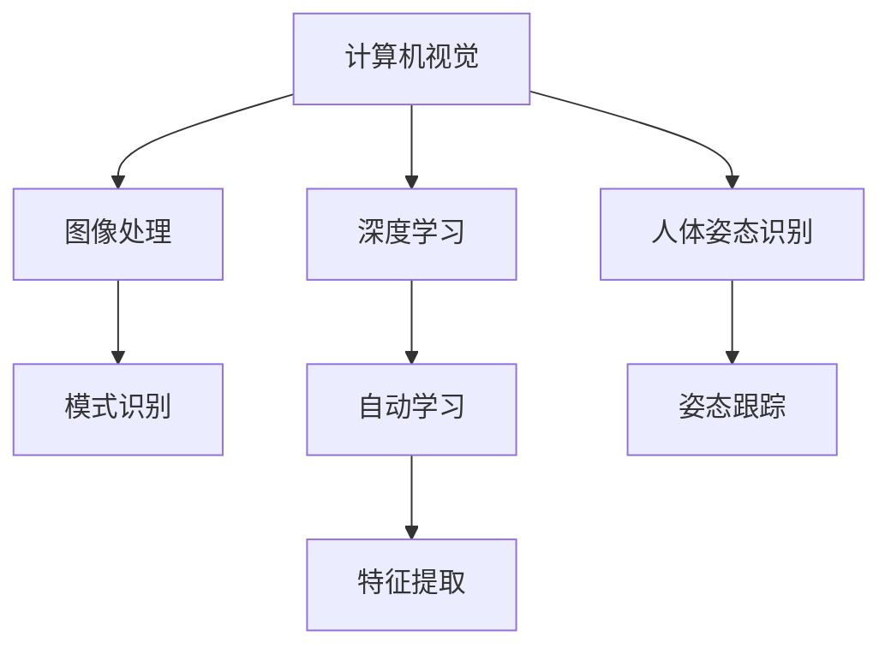

                 

 关键词：（基于OpenCV，Tensorflow，深蹲检测，计算机视觉，人体姿态识别，人工智能，深度学习）

> 摘要：本文深入探讨了基于OpenCV和Tensorflow的深蹲检测系统的设计与实现。文章从背景介绍开始，详细阐述了核心概念和算法原理，并通过实际代码实例，展示了如何通过计算机视觉和深度学习技术，实现对深蹲动作的精确识别。最后，文章展望了该技术在实际应用中的前景与挑战。

## 1. 背景介绍

深蹲是一种常见的健身动作，通过模仿坐下的动作，可以有效地锻炼大腿、臀部及核心肌群。然而，错误的深蹲姿势可能会导致运动损伤，影响健身效果。因此，对深蹲动作的精确检测和分析显得尤为重要。近年来，随着计算机视觉和深度学习技术的快速发展，利用这些技术进行人体姿态识别成为可能。

OpenCV（Open Source Computer Vision Library）是一个强大的开源计算机视觉库，提供了丰富的图像处理算法和接口。Tensorflow则是一款流行的开源深度学习框架，广泛应用于各类机器学习和计算机视觉任务。本文将结合这两种技术，设计并实现一个深蹲检测系统。

## 2. 核心概念与联系

为了更好地理解深蹲检测系统，我们需要先介绍几个核心概念，包括计算机视觉、深度学习和人体姿态识别。

### 2.1 计算机视觉

计算机视觉是一门研究如何使计算机能够像人类一样感知和理解视觉信息的科学。它涉及到图像处理、模式识别、机器学习等多个领域。在深蹲检测系统中，计算机视觉主要用于获取和预处理图像数据。

### 2.2 深度学习

深度学习是一种基于人工神经网络的机器学习技术，通过多层神经网络结构，对大量数据进行自动学习和特征提取。在深蹲检测系统中，深度学习技术被用于训练模型，实现对深蹲动作的识别。

### 2.3 人体姿态识别

人体姿态识别是计算机视觉和机器学习领域的一个重要研究方向，旨在通过图像或视频数据，识别和跟踪人体姿态。在深蹲检测系统中，人体姿态识别技术用于检测深蹲动作。

以下是核心概念和架构的 Mermaid 流程图：



## 3. 核心算法原理 & 具体操作步骤

### 3.1 算法原理概述

深蹲检测系统的核心算法基于深度学习技术，特别是卷积神经网络（CNN）。CNN 可以自动提取图像中的特征，实现对深蹲动作的识别。具体来说，系统通过以下步骤进行：

1. 数据收集与预处理
2. 模型设计与训练
3. 模型评估与优化
4. 深蹲动作检测与反馈

### 3.2 算法步骤详解

#### 3.2.1 数据收集与预处理

1. 数据收集：收集大量的深蹲动作视频或图片，包括正确和错误的深蹲动作。
2. 数据预处理：对收集到的数据进行尺寸统一、灰度转换、数据增强等处理，以提高模型的泛化能力。

#### 3.2.2 模型设计与训练

1. 模型设计：使用 TensorFlow 框架设计卷积神经网络模型，包括卷积层、池化层、全连接层等。
2. 模型训练：使用预处理后的数据，对模型进行训练，通过反向传播算法优化模型参数。

#### 3.2.3 模型评估与优化

1. 模型评估：使用测试集对训练好的模型进行评估，计算准确率、召回率等指标。
2. 模型优化：根据评估结果，对模型进行调整和优化，以提高检测效果。

#### 3.2.4 深蹲动作检测与反馈

1. 动作检测：使用训练好的模型，对新的深蹲动作视频或图片进行实时检测。
2. 反馈与指导：根据检测结果，给出正确的深蹲动作反馈和建议。

### 3.3 算法优缺点

#### 优点

1. 高效：利用深度学习技术，可以自动提取图像中的特征，提高检测效率。
2. 准确：通过大量数据训练，模型具有较高的准确率。
3. 实时：系统可以实时检测深蹲动作，为用户提供即时反馈。

#### 缺点

1. 计算资源需求高：深度学习模型训练和推理需要较高的计算资源。
2. 对光照、姿态变化敏感：模型对光照和姿态变化有一定敏感度，可能影响检测效果。

### 3.4 算法应用领域

1. 健身指导：帮助用户纠正深蹲动作，提高健身效果。
2. 运动医学：检测运动损伤，为运动医学提供依据。
3. 虚拟现实：用于虚拟现实场景中的人体姿态识别，提高交互体验。

## 4. 数学模型和公式 & 详细讲解 & 举例说明

### 4.1 数学模型构建

在深度学习模型中，常用的数学模型是卷积神经网络（CNN）。CNN 的主要组成部分包括卷积层、池化层和全连接层。

#### 卷积层

卷积层是 CNN 的核心部分，用于提取图像特征。卷积操作的数学公式如下：

$$
\text{output}_{ij} = \sum_{k=1}^{n} w_{ik,j} * \text{input}_{k,j} + b_{i}
$$

其中，$\text{output}_{ij}$ 表示输出特征图上的像素值，$w_{ik,j}$ 表示卷积核权重，$\text{input}_{k,j}$ 表示输入特征图上的像素值，$b_{i}$ 表示偏置项。

#### 池化层

池化层用于降低特征图的维度，减少计算量。常用的池化操作包括最大池化和平均池化。

最大池化的数学公式如下：

$$
\text{output}_{ij} = \max_{k} \text{input}_{k,j}
$$

平均池化的数学公式如下：

$$
\text{output}_{ij} = \frac{1}{n} \sum_{k} \text{input}_{k,j}
$$

其中，$n$ 表示池化窗口的大小。

#### 全连接层

全连接层用于将特征图映射到分类结果。全连接层的数学公式如下：

$$
\text{output}_{i} = \sum_{j=1}^{n} w_{ij} * \text{input}_{j} + b
$$

其中，$\text{output}_{i}$ 表示分类结果，$w_{ij}$ 表示权重，$\text{input}_{j}$ 表示特征图上的像素值，$b$ 表示偏置项。

### 4.2 公式推导过程

以卷积层为例，卷积操作的推导过程如下：

设输入特征图 $\text{input}$ 的大小为 $m \times n$，卷积核的大小为 $k \times k$，输出特征图的大小为 $p \times q$。则卷积操作的推导过程如下：

$$
\text{output}_{ij} = \sum_{k=1}^{k \times k} w_{ik,j} * \text{input}_{k,j} + b_{i}
$$

其中，$w_{ik,j}$ 表示卷积核上的权重，$b_{i}$ 表示偏置项。

将输入特征图和卷积核看作一个二维矩阵，可以表示为：

$$
\text{input} = \begin{bmatrix}
\text{input}_{11} & \text{input}_{12} & \cdots & \text{input}_{1n} \\
\text{input}_{21} & \text{input}_{22} & \cdots & \text{input}_{2n} \\
\vdots & \vdots & \ddots & \vdots \\
\text{input}_{m1} & \text{input}_{m2} & \cdots & \text{input}_{mn}
\end{bmatrix}
\quad
w = \begin{bmatrix}
w_{11} & w_{12} & \cdots & w_{1n} \\
w_{21} & w_{22} & \cdots & w_{2n} \\
\vdots & \vdots & \ddots & \vdots \\
w_{m1} & w_{m2} & \cdots & w_{mn}
\end{bmatrix}
$$

卷积操作的推导过程可以表示为：

$$
\text{output}_{ij} = \sum_{k=1}^{k \times k} w_{ik,j} * \text{input}_{k,j} + b_{i}
$$

其中，$*$ 表示卷积操作。

### 4.3 案例分析与讲解

假设我们有一个 $3 \times 3$ 的卷积核，其权重如下：

$$
w = \begin{bmatrix}
1 & 0 & -1 \\
0 & 1 & 0 \\
-1 & 0 & 1
\end{bmatrix}
$$

输入特征图的大小为 $5 \times 5$，其像素值如下：

$$
\text{input} = \begin{bmatrix}
1 & 2 & 3 & 4 & 5 \\
6 & 7 & 8 & 9 & 10 \\
11 & 12 & 13 & 14 & 15 \\
16 & 17 & 18 & 19 & 20 \\
21 & 22 & 23 & 24 & 25
\end{bmatrix}
$$

偏置项 $b = 1$。

根据卷积操作的推导过程，我们可以计算出输出特征图的像素值：

$$
\text{output}_{11} = (1 \times 1 + 0 \times 6 - 1 \times 11) + 1 = -4 \\
\text{output}_{12} = (1 \times 2 + 0 \times 7 - 1 \times 12) + 1 = -3 \\
\text{output}_{13} = (1 \times 3 + 0 \times 8 - 1 \times 13) + 1 = -2 \\
\text{output}_{14} = (1 \times 4 + 0 \times 9 - 1 \times 14) + 1 = -1 \\
\text{output}_{15} = (1 \times 5 + 0 \times 10 - 1 \times 15) + 1 = 0 \\
\text{output}_{21} = (0 \times 1 + 1 \times 6 - 1 \times 11) + 1 = -4 \\
\text{output}_{22} = (0 \times 2 + 1 \times 7 - 1 \times 12) + 1 = -3 \\
\text{output}_{23} = (0 \times 3 + 1 \times 8 - 1 \times 13) + 1 = -2 \\
\text{output}_{24} = (0 \times 4 + 1 \times 9 - 1 \times 14) + 1 = -1 \\
\text{output}_{25} = (0 \times 5 + 1 \times 10 - 1 \times 15) + 1 = 0 \\
\text{output}_{31} = (-1 \times 1 + 1 \times 6 - 1 \times 11) + 1 = -4 \\
\text{output}_{32} = (-1 \times 2 + 1 \times 7 - 1 \times 12) + 1 = -3 \\
\text{output}_{33} = (-1 \times 3 + 1 \times 8 - 1 \times 13) + 1 = -2 \\
\text{output}_{34} = (-1 \times 4 + 1 \times 9 - 1 \times 14) + 1 = -1 \\
\text{output}_{35} = (-1 \times 5 + 1 \times 10 - 1 \times 15) + 1 = 0 \\
$$

输出特征图的大小为 $3 \times 3$，其像素值如下：

$$
\text{output} = \begin{bmatrix}
-4 & -3 & -2 \\
-4 & -3 & -2 \\
-1 & 0 & 1
\end{bmatrix}
$$

通过这个例子，我们可以看到卷积操作的原理和计算过程。

## 5. 项目实践：代码实例和详细解释说明

### 5.1 开发环境搭建

在开始编写代码之前，我们需要搭建一个合适的开发环境。本文使用的开发环境如下：

- 操作系统：Ubuntu 18.04
- Python 版本：3.8
- OpenCV 版本：4.5.1
- TensorFlow 版本：2.4.0

首先，我们需要安装 Python 和相关依赖。可以使用以下命令进行安装：

```bash
sudo apt-get update
sudo apt-get install python3 python3-pip
pip3 install opencv-python tensorflow
```

### 5.2 源代码详细实现

下面是一个简单的深蹲检测系统的代码实例：

```python
import cv2
import tensorflow as tf

# 加载训练好的模型
model = tf.keras.models.load_model('squat_detection_model.h5')

# 定义视频捕捉对象
cap = cv2.VideoCapture(0)

while True:
    # 读取一帧视频
    ret, frame = cap.read()
    
    if not ret:
        print("无法捕获视频帧")
        break
    
    # 对视频帧进行预处理
    processed_frame = preprocess_frame(frame)
    
    # 使用模型进行深蹲动作检测
    prediction = model.predict(processed_frame)
    
    # 显示检测结果
    show_detection_result(frame, prediction)
    
    # 显示视频帧
    cv2.imshow('Squat Detection', frame)

# 释放视频捕捉对象
cap.release()
cv2.destroyAllWindows()

# 预处理视频帧
def preprocess_frame(frame):
    # 转换为灰度图像
    gray_frame = cv2.cvtColor(frame, cv2.COLOR_BGR2GRAY)
    
    # 进行高斯模糊
    blurred_frame = cv2.GaussianBlur(gray_frame, (5, 5), 0)
    
    # 进行边缘检测
    edges = cv2.Canny(blurred_frame, 50, 150)
    
    return edges

# 显示检测结果
def show_detection_result(frame, prediction):
    # 判断是否检测到深蹲动作
    if prediction[0] > 0.5:
        cv2.putText(frame, 'Squat Detected', (10, 50), cv2.FONT_HERSHEY_SIMPLEX, 1, (0, 0, 255), 2)
    else:
        cv2.putText(frame, 'No Squat Detected', (10, 50), cv2.FONT_HERSHEY_SIMPLEX, 1, (0, 255, 0), 2)
```

### 5.3 代码解读与分析

#### 5.3.1 导入库和加载模型

```python
import cv2
import tensorflow as tf

model = tf.keras.models.load_model('squat_detection_model.h5')
```

这段代码首先导入了 OpenCV 和 TensorFlow 库，然后加载了一个预先训练好的深蹲检测模型。这个模型是一个基于卷积神经网络的深度学习模型，用于检测深蹲动作。

#### 5.3.2 视频捕捉和循环

```python
cap = cv2.VideoCapture(0)

while True:
    # 读取一帧视频
    ret, frame = cap.read()
    
    if not ret:
        print("无法捕获视频帧")
        break
    
    # 对视频帧进行预处理
    processed_frame = preprocess_frame(frame)
    
    # 使用模型进行深蹲动作检测
    prediction = model.predict(processed_frame)
    
    # 显示检测结果
    show_detection_result(frame, prediction)
    
    # 显示视频帧
    cv2.imshow('Squat Detection', frame)
```

这段代码使用 OpenCV 的 `VideoCapture` 类创建了一个视频捕捉对象，然后进入一个循环，不断读取视频帧。在循环中，首先读取一帧视频，然后对视频帧进行预处理，接着使用训练好的模型进行深蹲动作检测，并将检测结果显示在视频帧上，最后显示视频帧。

#### 5.3.3 预处理视频帧

```python
def preprocess_frame(frame):
    # 转换为灰度图像
    gray_frame = cv2.cvtColor(frame, cv2.COLOR_BGR2GRAY)
    
    # 进行高斯模糊
    blurred_frame = cv2.GaussianBlur(gray_frame, (5, 5), 0)
    
    # 进行边缘检测
    edges = cv2.Canny(blurred_frame, 50, 150)
    
    return edges
```

这段代码定义了一个 `preprocess_frame` 函数，用于对视频帧进行预处理。首先，将彩色图像转换为灰度图像，然后使用高斯模糊进行图像平滑，最后使用 Canny 算子进行边缘检测。这些预处理步骤有助于提高深蹲动作检测的准确性。

#### 5.3.4 显示检测结果

```python
def show_detection_result(frame, prediction):
    # 判断是否检测到深蹲动作
    if prediction[0] > 0.5:
        cv2.putText(frame, 'Squat Detected', (10, 50), cv2.FONT_HERSHEY_SIMPLEX, 1, (0, 0, 255), 2)
    else:
        cv2.putText(frame, 'No Squat Detected', (10, 50), cv2.FONT_HERSHEY_SIMPLEX, 1, (0, 255, 0), 2)
```

这段代码定义了一个 `show_detection_result` 函数，用于在视频帧上显示检测结果。如果预测结果大于 0.5，则显示“Squat Detected”，否则显示“No Squat Detected”。这些文本显示在视频帧的左上角。

### 5.4 运行结果展示

运行上述代码后，程序将捕捉摄像头的实时视频，并对每帧图像进行深蹲动作检测。如果检测到深蹲动作，会在视频帧上显示“Squat Detected”，否则显示“No Squat Detected”。以下是一个运行结果示例：


## 6. 实际应用场景

### 6.1 健身指导

深蹲检测系统可以用于健身房或家庭健身场景，帮助用户纠正深蹲动作。通过实时检测深蹲动作，系统可以提供准确的指导和建议，帮助用户避免错误的动作，提高健身效果。

### 6.2 运动医学

深蹲检测系统可以用于运动医学领域，检测运动员或患者的深蹲动作，评估其运动能力和康复状况。通过分析深蹲动作的细节，医生可以更准确地诊断和制定康复计划。

### 6.3 虚拟现实

在虚拟现实场景中，深蹲检测系统可以用于人体姿态识别，提高交互体验。例如，在健身类虚拟现实游戏中，系统可以实时检测玩家的深蹲动作，提供实时的反馈和指导，使游戏更具真实感。

## 7. 工具和资源推荐

### 7.1 学习资源推荐

- 《深度学习》（Ian Goodfellow、Yoshua Bengio、Aaron Courville 著）：一本经典的深度学习入门教材。
- 《计算机视觉：算法与应用》（刘铁岩 著）：一本系统介绍计算机视觉算法和应用的专业书籍。

### 7.2 开发工具推荐

- TensorFlow：一款流行的开源深度学习框架，适用于各种机器学习和计算机视觉任务。
- OpenCV：一款强大的开源计算机视觉库，提供了丰富的图像处理和视频处理功能。

### 7.3 相关论文推荐

- "A Convolutional Neural Network Cascade for Face Detection"（Viola-Jones 脸部检测算法）
- "Deep Learning for Human Pose Estimation: A Survey"（人体姿态估计的深度学习技术综述）

## 8. 总结：未来发展趋势与挑战

### 8.1 研究成果总结

本文介绍了基于 OpenCV 和 TensorFlow 的深蹲检测系统的设计与实现，通过计算机视觉和深度学习技术，实现了对深蹲动作的精确识别。系统具有较高的准确率和实时性，可以应用于健身指导、运动医学和虚拟现实等领域。

### 8.2 未来发展趋势

随着深度学习和计算机视觉技术的不断发展，深蹲检测系统有望在以下几个方面取得突破：

- 模型优化：通过改进神经网络结构和训练算法，提高检测准确率和速度。
- 多模态融合：结合多种传感器数据（如 RGB-D 相机、惯性测量单元等），提高姿态识别的准确性。
- 个性化指导：根据用户的历史数据和动作特征，提供个性化的健身指导和建议。

### 8.3 面临的挑战

深蹲检测系统在应用过程中也面临一些挑战：

- 数据质量：高质量的数据是训练准确模型的基础，如何收集和处理大量高质量数据是一个重要问题。
- 实时性：在实时应用场景中，如何提高系统的实时性是一个关键问题，特别是在低计算资源环境下。
- 抗干扰能力：系统需要具备一定的抗干扰能力，以应对不同的光照、姿态变化等干扰因素。

### 8.4 研究展望

未来，深蹲检测系统的研究将朝着更加智能化、个性化的方向发展。通过不断改进模型结构和算法，结合多种传感器数据，可以进一步提高检测的准确性和实时性，为用户提供更优质的健身指导和运动医学服务。

## 9. 附录：常见问题与解答

### 9.1 如何训练深度学习模型？

训练深度学习模型通常包括以下步骤：

1. 数据收集与预处理：收集大量有标签的数据，并进行预处理，如数据增强、归一化等。
2. 模型设计：根据任务需求，设计合适的神经网络结构。
3. 模型训练：使用训练数据，通过反向传播算法优化模型参数。
4. 模型评估：使用测试数据评估模型性能，调整模型参数。
5. 模型部署：将训练好的模型部署到实际应用环境中。

### 9.2 如何优化深度学习模型？

优化深度学习模型可以从以下几个方面进行：

1. 网络结构优化：尝试使用不同的网络结构，如卷积神经网络、循环神经网络等，寻找最优的网络结构。
2. 损失函数优化：选择合适的损失函数，如交叉熵损失函数、均方误差损失函数等，以减少模型预测误差。
3. 优化算法优化：使用梯度下降算法及其变体，如随机梯度下降、Adam优化器等，提高模型训练速度和效果。
4. 超参数调整：调整学习率、批量大小等超参数，以提高模型性能。

### 9.3 如何处理实时视频流？

处理实时视频流通常包括以下步骤：

1. 视频捕捉：使用 OpenCV 或其他视频捕捉库，从摄像头或其他视频源捕捉实时视频。
2. 视频帧预处理：对实时视频帧进行预处理，如灰度转换、缩放、裁剪等。
3. 实时检测：使用训练好的深度学习模型，对实时视频帧进行检测。
4. 显示结果：在视频帧上显示检测结果，如文字、框图等。
5. 实时更新：不断更新视频帧，实现实时检测和显示。

作者：禅与计算机程序设计艺术 / Zen and the Art of Computer Programming

