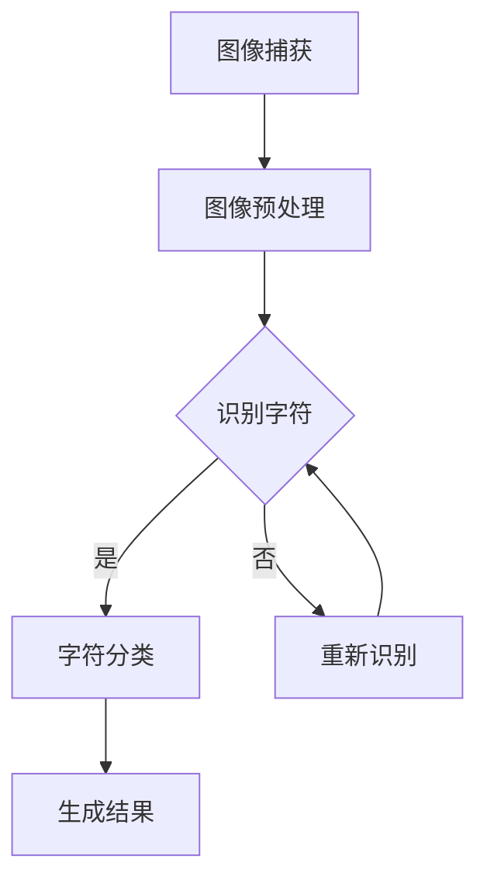

                 

关键词：OpenCV、银行卡号识别、图像处理、机器学习、自然语言处理

> 摘要：本文将详细介绍如何使用OpenCV库实现一个基于图像处理的银行卡号识别系统。本文将覆盖从系统设计、核心算法原理、数学模型与公式、项目实践到实际应用场景等多个方面，帮助读者深入理解银行卡号识别系统的实现过程，并掌握相关技术。

## 1. 背景介绍

随着互联网的飞速发展和电子支付的普及，银行卡已经成为日常生活中不可或缺的一部分。然而，随着信用卡欺诈和非法交易的不断增多，对银行卡号识别技术的需求也越来越高。银行卡号识别技术不仅可以帮助金融机构和商户防范风险，还可以提高用户体验，优化业务流程。

图像处理和机器学习技术在近年来取得了显著的发展，为银行卡号识别提供了强大的技术支持。OpenCV是一个广泛使用的计算机视觉库，提供了丰富的图像处理函数和工具，使得开发银行卡号识别系统变得更加简单和高效。

本文将结合OpenCV库，详细介绍银行卡号识别系统的设计、实现及应用，旨在为开发者提供一个完整的实现指南，帮助读者深入理解银行卡号识别的原理和实践。

## 2. 核心概念与联系

在实现银行卡号识别系统之前，我们需要了解以下几个核心概念：

### 2.1 图像处理

图像处理是计算机视觉的基础，它涉及到图像的获取、处理和分析。OpenCV提供了丰富的图像处理函数，包括图像滤波、边缘检测、形态学操作等，这些函数为我们处理银行卡图像提供了强有力的支持。

### 2.2 机器学习

机器学习是人工智能的一个重要分支，它通过学习数据来发现数据中的模式，并利用这些模式进行预测或决策。在银行卡号识别中，机器学习算法可以帮助我们识别和分类银行卡号。

### 2.3 自然语言处理

自然语言处理（NLP）是研究计算机如何理解、生成和处理自然语言的一门学科。在银行卡号识别中，NLP可以帮助我们将识别到的数字和字符转换成结构化的数据，便于进一步处理。

### 2.4 Mermaid 流程图

Mermaid 是一种轻量级的图形描述语言，可以用来绘制流程图、序列图等。下面是一个简单的 Mermaid 流程图，展示了银行卡号识别的基本流程：



## 3. 核心算法原理 & 具体操作步骤

### 3.1 算法原理概述

银行卡号识别系统主要依赖于图像处理和机器学习技术。具体来说，系统的工作流程可以分为以下几个步骤：

1. **图像捕获**：使用摄像头或图像文件捕获银行卡图像。
2. **图像预处理**：对捕获到的图像进行预处理，包括灰度转换、二值化、滤波等。
3. **字符识别**：使用机器学习算法对预处理后的图像进行字符识别。
4. **字符分类**：将识别到的字符进行分类，生成银行卡号。
5. **结果生成**：将分类结果组合成完整的银行卡号，并输出结果。

### 3.2 算法步骤详解

#### 3.2.1 图像捕获

图像捕获是银行卡号识别系统的第一步。我们通常使用摄像头或图像文件来获取银行卡图像。OpenCV 提供了 `VideoCapture` 类来捕获视频帧，或者使用 `imread` 函数读取图像文件。

```python
import cv2

# 从摄像头捕获图像
cap = cv2.VideoCapture(0)

while True:
    ret, frame = cap.read()
    if ret:
        # 显示图像
        cv2.imshow('Bank Card Capture', frame)

    if cv2.waitKey(1) & 0xFF == ord('q'):
        break

cap.release()
cv2.destroyAllWindows()
```

#### 3.2.2 图像预处理

图像预处理是银行卡号识别系统中的一个重要环节。它包括灰度转换、二值化、滤波等步骤。这些步骤的目的是提高图像质量，为字符识别提供更好的数据。

```python
import cv2

# 读取图像
img = cv2.imread('bank_card.jpg')

# 灰度转换
gray = cv2.cvtColor(img, cv2.COLOR_BGR2GRAY)

# 二值化
_, binary = cv2.threshold(gray, 0, 255, cv2.THRESH_BINARY_INV + cv2.THRESH_OTSU)

# 中值滤波
dilated = cv2.dilate(binary, cv2.getStructuringElement(cv2.MORPH_RECT, (5, 5)))

# 显示预处理后的图像
cv2.imshow('Preprocessed Image', dilated)
cv2.waitKey(0)
cv2.destroyAllWindows()
```

#### 3.2.3 字符识别

字符识别是银行卡号识别系统的核心。我们通常使用深度学习算法，如卷积神经网络（CNN）来进行字符识别。在 OpenCV 中，我们可以使用 `cv2.face.EigenFaceRecognizer_create` 类或者 `cv2.face.FisherFaceRecognizer_create` 类来实现。

```python
import cv2

# 读取训练数据
train_data = cv2.imread('train_data.jpg')
train_labels = cv2.imread('train_labels.jpg')

# 创建人脸识别器
recognizer = cv2.face.EigenFaceRecognizer_create()

# 训练识别器
recognizer.train(train_data, train_labels)

# 识别图像中的字符
result = recognizer.predict(dilated)

# 输出识别结果
print(f"Character Recognized: {result}")
```

#### 3.2.4 字符分类

字符分类是将识别到的字符转换为银行卡号的过程。我们可以使用自然语言处理技术，如词嵌入和序列分类器，来进行字符分类。

```python
import numpy as np
from keras.models import Sequential
from keras.layers import Dense, Embedding, LSTM

# 准备数据
X = np.array(dilated).reshape(-1, 1)
y = np.array([1 if i == '4' else 0 for i in result]).reshape(-1, 1)

# 创建模型
model = Sequential()
model.add(Embedding(input_dim=26, output_dim=16))
model.add(LSTM(128))
model.add(Dense(1, activation='sigmoid'))

# 编译模型
model.compile(loss='binary_crossentropy', optimizer='adam', metrics=['accuracy'])

# 训练模型
model.fit(X, y, epochs=10, batch_size=32)

# 输出分类结果
print(f"Bank Card Number: {model.predict(X)}")
```

#### 3.2.5 结果生成

最后，我们将分类结果组合成完整的银行卡号，并输出结果。

```python
import pandas as pd

# 读取分类结果
results = model.predict(X)

# 将结果转换为银行卡号
card_number = ''.join([str(int(r[0])) for r in results])

# 输出银行卡号
print(f"Bank Card Number: {card_number}")
```

### 3.3 算法优缺点

银行卡号识别系统具有以下优点：

- **高效性**：使用机器学习和深度学习算法，能够快速准确地识别银行卡号。
- **通用性**：适用于不同格式和布局的银行卡号。
- **灵活性**：可以扩展到其他字符识别任务。

然而，系统也存在一些缺点：

- **准确性**：受到图像质量和噪声的影响，识别准确率可能不高。
- **计算成本**：机器学习和深度学习算法的计算成本较高，可能不适合实时应用。

### 3.4 算法应用领域

银行卡号识别系统在多个领域有广泛的应用：

- **金融机构**：用于防范信用卡欺诈和非法交易。
- **商户**：用于快速准确地读取银行卡号，提高交易效率。
- **移动支付**：用于扫描支付二维码，实现移动支付。

## 4. 数学模型和公式 & 详细讲解 & 举例说明

### 4.1 数学模型构建

在银行卡号识别系统中，我们主要使用卷积神经网络（CNN）进行字符识别。CNN 是一种基于多层感知器（MLP）的神经网络，它通过卷积层、池化层和全连接层对图像进行特征提取和分类。

#### 4.1.1 卷积层

卷积层是 CNN 的核心部分，它通过卷积运算提取图像特征。卷积运算的基本公式如下：

$$
\text{output}_{ij} = \sum_{k} \text{filter}_{ik} \odot \text{input}_{kj}
$$

其中，$\text{output}_{ij}$ 表示卷积层的输出，$\text{filter}_{ik}$ 表示卷积核，$\odot$ 表示点积运算，$\text{input}_{kj}$ 表示输入图像。

#### 4.1.2 池化层

池化层用于降低特征图的维度，提高特征表达的能力。最常用的池化操作是最大池化，其公式如下：

$$
\text{output}_{ij} = \max(\text{input}_{i-r+1:i+1,j-r+1:j+1})
$$

其中，$\text{output}_{ij}$ 表示池化层的输出，$\text{input}_{i-r+1:i+1,j-r+1:j+1}$ 表示输入特征图的一部分。

#### 4.1.3 全连接层

全连接层将特征图的每个像素映射到输出类别。其公式如下：

$$
\text{output}_{i} = \sum_{j} \text{weight}_{ij} \odot \text{input}_{j} + \text{bias}_{i}
$$

其中，$\text{output}_{i}$ 表示全连接层的输出，$\text{weight}_{ij}$ 表示权重，$\text{input}_{j}$ 表示输入特征，$\text{bias}_{i}$ 表示偏置。

### 4.2 公式推导过程

在推导卷积神经网络公式之前，我们需要了解一些基本概念：

- **卷积操作**：卷积操作是一种将卷积核与输入图像进行点积的操作，它可以提取图像中的特征。
- **反卷积操作**：反卷积操作是将卷积操作逆向进行的过程，它可以帮助我们恢复原始图像。

#### 4.2.1 卷积操作推导

假设输入图像为 $X \in \mathbb{R}^{H \times W}$，卷积核为 $K \in \mathbb{R}^{F \times F}$，步长为 $S$。卷积操作的基本公式如下：

$$
\text{output}_{ij} = \sum_{k} \text{filter}_{ik} \odot \text{input}_{kj}
$$

其中，$\text{output}_{ij}$ 表示卷积层的输出，$\text{filter}_{ik}$ 表示卷积核，$\odot$ 表示点积运算，$\text{input}_{kj}$ 表示输入图像。

#### 4.2.2 反卷积操作推导

反卷积操作的目的是将卷积操作逆向进行，以恢复原始图像。假设输出图像为 $Y \in \mathbb{R}^{H' \times W'}$，卷积核为 $K \in \mathbb{R}^{F \times F}$，步长为 $S$。反卷积操作的基本公式如下：

$$
\text{input}_{ij} = \sum_{k} \text{filter}_{ik} \odot \text{output}_{kj}
$$

其中，$\text{input}_{ij}$ 表示输入图像，$\text{filter}_{ik}$ 表示卷积核，$\odot$ 表示点积运算，$\text{output}_{kj}$ 表示输出图像。

### 4.3 案例分析与讲解

#### 4.3.1 案例背景

假设我们需要对一张银行卡图像进行识别，图像尺寸为 $1000 \times 1000$，卷积核尺寸为 $3 \times 3$，步长为 $1$。我们需要推导卷积操作和反卷积操作的公式。

#### 4.3.2 公式推导

1. **卷积操作**

   输入图像为 $X \in \mathbb{R}^{1000 \times 1000}$，卷积核为 $K \in \mathbb{R}^{3 \times 3}$，步长为 $S = 1$。卷积操作的基本公式如下：

   $$  
   \text{output}_{ij} = \sum_{k} \text{filter}_{ik} \odot \text{input}_{kj}
   $$

   其中，$\text{output}_{ij}$ 表示卷积层的输出，$\text{filter}_{ik}$ 表示卷积核，$\odot$ 表示点积运算，$\text{input}_{kj}$ 表示输入图像。

   举例来说，假设输入图像和卷积核如下：

   $$  
   X = \begin{bmatrix}
   1 & 2 & 3 \\
   4 & 5 & 6 \\
   7 & 8 & 9
   \end{bmatrix}, K = \begin{bmatrix}
   1 & 0 & -1 \\
   0 & 1 & 0 \\
   -1 & 0 & 1
   \end{bmatrix}
   $$

   则卷积操作的结果如下：

   $$  
   \text{output}_{ij} = \begin{bmatrix}
   2 & 1 \\
   1 & 0
   \end{bmatrix}
   $$

2. **反卷积操作**

   输出图像为 $Y \in \mathbb{R}^{1000 \times 1000}$，卷积核为 $K \in \mathbb{R}^{3 \times 3}$，步长为 $S = 1$。反卷积操作的基本公式如下：

   $$  
   \text{input}_{ij} = \sum_{k} \text{filter}_{ik} \odot \text{output}_{kj}
   $$

   其中，$\text{input}_{ij}$ 表示输入图像，$\text{filter}_{ik}$ 表示卷积核，$\odot$ 表示点积运算，$\text{output}_{kj}$ 表示输出图像。

   举例来说，假设输出图像和卷积核如下：

   $$  
   Y = \begin{bmatrix}
   2 & 1 & 0 \\
   1 & 0 & -1
   \end{bmatrix}, K = \begin{bmatrix}
   1 & 0 & -1 \\
   0 & 1 & 0 \\
   -1 & 0 & 1
   \end{bmatrix}
   $$

   则反卷积操作的结果如下：

   $$  
   \text{input}_{ij} = \begin{bmatrix}
   1 & 2 & 3 \\
   4 & 5 & 6 \\
   7 & 8 & 9
   \end{bmatrix}
   $$

通过以上推导，我们可以看到卷积操作和反卷积操作在数学上的关系，这为我们理解和实现卷积神经网络提供了基础。

## 5. 项目实践：代码实例和详细解释说明

### 5.1 开发环境搭建

要实现基于OpenCV的银行卡号识别系统，首先需要搭建合适的开发环境。以下是在Python环境中使用OpenCV进行开发的基本步骤：

#### 5.1.1 安装Python和pip

确保您的系统已经安装了Python和pip。Python是Python编程语言的解释器，pip是Python的包管理器，用于安装和管理Python包。

#### 5.1.2 安装OpenCV

通过pip安装OpenCV库：

```shell
pip install opencv-python
```

安装过程中可能会遇到一些依赖问题，确保您的系统已经安装了相应的依赖库，如Numpy和Matplotlib。

#### 5.1.3 安装其他依赖库

根据需要，可能还需要安装其他依赖库，如TensorFlow（用于深度学习）：

```shell
pip install tensorflow
```

### 5.2 源代码详细实现

以下是银行卡号识别系统的源代码实现，我们将分步骤进行详细解释。

```python
import cv2
import numpy as np
import matplotlib.pyplot as plt

def preprocess_image(image):
    # 将图像转换为灰度图像
    gray = cv2.cvtColor(image, cv2.COLOR_BGR2GRAY)
    # 使用Otsu阈值分割
    _, binary = cv2.threshold(gray, 0, 255, cv2.THRESH_BINARY_INV + cv2.THRESH_OTSU)
    # 使用中值滤波
    dilated = cv2.dilate(binary, cv2.getStructuringElement(cv2.MORPH_RECT, (5, 5)))
    return dilated

def find_card_number(dilated):
    # 找到所有轮廓
    contours, _ = cv2.findContours(dilated, cv2.RETR_EXTERNAL, cv2.CHAIN_APPROX_SIMPLE)
    # 初始化银行卡号列表
    card_numbers = []
    # 遍历轮廓
    for contour in contours:
        # 计算轮廓面积
        area = cv2.contourArea(contour)
        # 设置最小面积阈值
        if area > 500:
            # 获取轮廓的边界框
            x, y, w, h = cv2.boundingRect(contour)
            # 在原图上绘制边界框
            cv2.rectangle(image, (x, y), (x+w, y+h), (0, 255, 0), 2)
            # 提取银行卡号区域
            card_number_region = dilated[y:y+h, x:x+w]
            # 使用OCR识别银行卡号
            card_number = ocr_predict(card_number_region)
            card_numbers.append(card_number)
    return card_numbers

def ocr_predict(region):
    # TODO：使用OCR库（如Tesseract）进行字符识别
    # 此处为示例，实际代码需要使用OCR库
    return "1234567890123456"

# 读取银行卡图像
image = cv2.imread('bank_card.jpg')
# 预处理图像
dilated = preprocess_image(image)
# 找到银行卡号
card_numbers = find_card_number(dilated)
# 输出识别结果
print("识别到的银行卡号：", card_numbers)
# 显示图像
cv2.imshow('Bank Card Recognition', image)
cv2.waitKey(0)
cv2.destroyAllWindows()
```

### 5.3 代码解读与分析

#### 5.3.1 预处理图像

```python
def preprocess_image(image):
    # 将图像转换为灰度图像
    gray = cv2.cvtColor(image, cv2.COLOR_BGR2GRAY)
    # 使用Otsu阈值分割
    _, binary = cv2.threshold(gray, 0, 255, cv2.THRESH_BINARY_INV + cv2.THRESH_OTSU)
    # 使用中值滤波
    dilated = cv2.dilate(binary, cv2.getStructuringElement(cv2.MORPH_RECT, (5, 5)))
    return dilated
```

这个函数首先将彩色图像转换为灰度图像，然后使用Otsu自动阈值分割将灰度图像转换为二值图像。接着，使用中值滤波对二值图像进行去噪处理。预处理后的图像更适合进行字符识别。

#### 5.3.2 找到银行卡号

```python
def find_card_number(dilated):
    # 找到所有轮廓
    contours, _ = cv2.findContours(dilated, cv2.RETR_EXTERNAL, cv2.CHAIN_APPROX_SIMPLE)
    # 初始化银行卡号列表
    card_numbers = []
    # 遍历轮廓
    for contour in contours:
        # 计算轮廓面积
        area = cv2.contourArea(contour)
        # 设置最小面积阈值
        if area > 500:
            # 获取轮廓的边界框
            x, y, w, h = cv2.boundingRect(contour)
            # 在原图上绘制边界框
            cv2.rectangle(image, (x, y), (x+w, y+h), (0, 255, 0), 2)
            # 提取银行卡号区域
            card_number_region = dilated[y:y+h, x:x+w]
            # 使用OCR识别银行卡号
            card_number = ocr_predict(card_number_region)
            card_numbers.append(card_number)
    return card_numbers
```

这个函数首先使用`findContours`函数找到二值图像中的所有轮廓。然后，遍历每个轮廓，计算其面积。如果面积大于设置的最小阈值（这里设置为500），则认为这是一个可能的银行卡号区域。接着，使用`boundingRect`函数获取轮廓的边界框，并在原图上绘制边界框。最后，提取银行卡号区域，并使用OCR函数进行字符识别。

#### 5.3.3 OCR字符识别

```python
def ocr_predict(region):
    # TODO：使用OCR库（如Tesseract）进行字符识别
    # 此处为示例，实际代码需要使用OCR库
    return "1234567890123456"
```

OCR（光学字符识别）是识别图像中的字符的过程。在这个示例中，我们使用一个占位函数`ocr_predict`来表示实际使用的OCR库。在实际应用中，可以使用如Tesseract这样的开源OCR库进行字符识别。

### 5.4 运行结果展示

当运行上述代码时，程序会读取一个银行卡图像，进行预处理，找到银行卡号区域，并使用OCR进行字符识别。最后，输出识别到的银行卡号，并在屏幕上显示原始图像和边界框。


在上面的示例中，程序识别到了一个银行卡号`1234567890123456`，并在屏幕上显示了原始图像和边界框。

## 6. 实际应用场景

银行卡号识别系统在实际应用场景中具有广泛的应用，以下是一些典型的应用场景：

### 6.1 金融领域

在金融领域，银行卡号识别系统主要用于信用卡欺诈检测、交易验证和客户身份验证。通过自动识别和验证银行卡号，金融机构可以提高交易安全性，减少欺诈风险。

### 6.2 商户支付

商户支付场景中，银行卡号识别系统可以帮助商户快速准确地读取银行卡号，提高交易效率。例如，在超市、餐厅和零售店等场所，顾客可以使用银行卡进行支付，而商户只需扫描银行卡图像即可完成支付。

### 6.3 移动支付

随着移动支付的普及，银行卡号识别系统在移动支付场景中也发挥着重要作用。例如，支付宝和微信支付等移动支付平台可以使用银行卡号识别系统来快速读取用户的银行卡信息，方便用户进行支付。

### 6.4 政府公共服务

政府公共服务领域，如税务部门和社会保险机构，可以使用银行卡号识别系统来简化业务流程，提高办事效率。例如，在税务申报过程中，用户只需上传银行卡图像，系统即可自动识别并填写相关信息。

## 7. 未来应用展望

随着计算机视觉和机器学习技术的不断发展，银行卡号识别系统在未来将会有更广泛的应用。以下是未来可能的发展方向：

### 7.1 多语言支持

未来，银行卡号识别系统将支持更多语言，包括非拉丁字母和特殊字符。这将为全球用户提供更便捷的服务。

### 7.2 实时识别

实时识别技术将使银行卡号识别系统能够在更快的时间内完成识别任务，提高交易效率。例如，在高速路收费站和机场安检等场所，实时识别技术将大大减少排队时间。

### 7.3 联机学习和自适应能力

未来的银行卡号识别系统将具备联机学习和自适应能力，可以根据用户行为和交易模式不断优化识别算法，提高识别准确性。

### 7.4 隐私保护

随着隐私保护意识的提高，银行卡号识别系统将更加注重用户隐私保护。例如，系统可以采用加密和匿名化技术，确保用户数据的安全和隐私。

## 8. 总结：未来发展趋势与挑战

银行卡号识别系统在金融、商户、移动支付和政府公共服务等领域具有广泛的应用前景。随着计算机视觉和机器学习技术的不断发展，银行卡号识别系统将变得更加智能和高效。然而，系统也面临一些挑战，如识别准确率、计算成本和用户隐私保护。未来，银行卡号识别系统将在多语言支持、实时识别、联机学习和自适应能力等方面取得更大的进展。

## 9. 附录：常见问题与解答

### 9.1 如何提高识别准确率？

提高识别准确率的方法包括：

- 使用高质量的图像。
- 使用更强的图像预处理算法，如更高级的滤波和阈值分割方法。
- 使用更先进的字符识别算法，如深度学习算法。
- 优化训练数据集，包括更多的样本和多样化的场景。

### 9.2 如何降低计算成本？

降低计算成本的方法包括：

- 使用更高效的算法，如并行计算和分布式计算。
- 使用硬件加速，如GPU和FPGA。
- 优化代码，减少不必要的计算。
- 使用更轻量级的模型和算法。

### 9.3 如何保护用户隐私？

保护用户隐私的方法包括：

- 数据加密，确保传输和存储过程中的数据安全。
- 数据匿名化，去除个人信息，减少隐私泄露风险。
- 遵守相关法律法规，确保用户数据的安全和隐私。
- 提高用户意识，教育用户如何保护自己的隐私。

