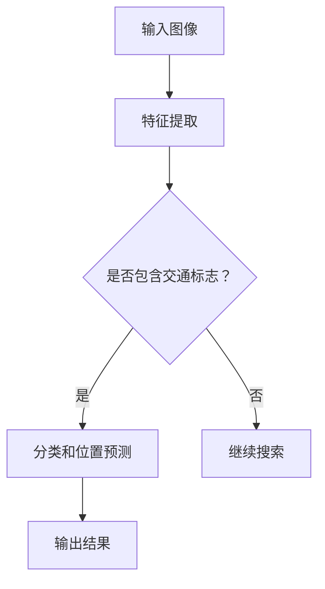

                 

关键词：YOLOV5，交通标志识别，深度学习，图像识别，计算机视觉

摘要：本文旨在介绍一种基于YOLOV5算法的交通标志识别技术。通过深入分析YOLOV5算法原理，本文详细阐述了其在交通标志识别任务中的具体应用，并探讨了算法的优缺点及其在不同领域的应用前景。文章最后总结了研究成果，提出了未来研究的方向和挑战。

## 1. 背景介绍

随着计算机技术的飞速发展，图像识别技术在各个领域得到了广泛应用，尤其在交通领域的应用具有重要意义。交通标志识别是智能交通系统中的一个关键环节，通过自动识别道路上的交通标志，可以提高交通管理的效率和安全性。

近年来，深度学习技术的崛起为图像识别领域带来了新的突破。YOLO（You Only Look Once）系列算法作为深度学习领域的重要成果之一，以其高效的检测速度和精准的识别能力在图像识别任务中表现出色。本文将结合YOLOV5算法，探讨其在交通标志识别任务中的应用。

## 2. 核心概念与联系

### 2.1 YOLOV5算法原理

YOLOV5是一种基于卷积神经网络的实时目标检测算法。与传统的目标检测算法相比，YOLOV5具有检测速度快、精度高、结构简单等优点。

YOLOV5算法的核心思想是将图像划分为多个网格（grid），每个网格负责检测其中的目标。算法首先通过卷积神经网络提取图像特征，然后对每个网格中的目标进行分类和位置预测。

### 2.2 交通标志识别任务

交通标志识别任务主要涉及以下几个方面：

1. 交通标志的检测：从图像中找出所有的交通标志。
2. 交通标志的分类：对检测到的交通标志进行分类，例如限速标志、禁止左转标志等。
3. 交通标志的位置定位：确定每个交通标志在图像中的具体位置。

### 2.3 Mermaid 流程图

以下是一个简化的 Mermaid 流程图，展示了 YOLOV5 算法在交通标志识别任务中的主要流程：



## 3. 核心算法原理 & 具体操作步骤

### 3.1 算法原理概述

YOLOV5算法主要由三个部分组成：特征提取网络、预测网络和后处理网络。

1. **特征提取网络**：使用预训练的卷积神经网络（如CSPDarknet53）提取图像特征。
2. **预测网络**：对特征图进行多尺度特征融合，然后生成包含边界框、类别概率和目标置信度的预测结果。
3. **后处理网络**：对预测结果进行非极大值抑制（NMS）和阈值处理，得到最终的检测结果。

### 3.2 算法步骤详解

1. **输入图像预处理**：将输入图像调整为YOLOV5算法要求的大小，例如640x640。
2. **特征提取**：使用CSPDarknet53网络对图像进行特征提取，得到特征图。
3. **多尺度特征融合**：将不同尺度下的特征图进行融合，增强检测能力。
4. **预测**：对融合后的特征图进行卷积操作，得到包含边界框、类别概率和目标置信度的预测结果。
5. **非极大值抑制（NMS）**：对预测结果进行NMS操作，去除冗余的边界框。
6. **阈值处理**：设置适当的阈值，筛选出符合条件的检测结果。

### 3.3 算法优缺点

#### 优点：

1. **实时性高**：YOLOV5算法采用单阶段检测器，检测速度快，适用于实时应用场景。
2. **精度高**：通过多尺度特征融合，YOLOV5在保持检测速度的同时，也提高了检测精度。
3. **结构简单**：YOLOV5算法结构简单，易于实现和优化。

#### 缺点：

1. **对小目标的检测能力较弱**：由于YOLOV5算法采用网格划分的方式，对细小目标的检测能力有限。
2. **对遮挡目标的检测效果较差**：在目标部分遮挡的情况下，YOLOV5的检测效果会受到影响。

### 3.4 算法应用领域

YOLOV5算法在交通标志识别任务中具有广泛的应用前景。除了交通领域，YOLOV5还可以应用于其他目标检测任务，如行人检测、车辆检测等。

## 4. 数学模型和公式

### 4.1 数学模型构建

YOLOV5算法的核心在于预测每个网格中的目标信息，包括边界框、类别概率和目标置信度。

设输入图像大小为\(W \times H\)，每个网格的大小为\(G \times G\)，则有：

\[ C = W \times H \]

其中，\(C\)表示网格数量。

每个网格的预测结果可以表示为：

\[ P_{ij} = \begin{cases} 
1 & \text{如果第 } i \text{ 行第 } j \text{ 列的网格包含目标} \\
0 & \text{如果第 } i \text{ 行第 } j \text{ 列的网格不包含目标}
\end{cases} \]

### 4.2 公式推导过程

YOLOV5算法通过卷积神经网络提取图像特征，并对特征图进行多尺度特征融合，得到预测结果。

设输入图像的特征图为\(F\)，经过卷积操作后得到特征图\(G\)，则有：

\[ G = \text{conv}(F) \]

其中，\(\text{conv}\)表示卷积操作。

对特征图\(G\)进行多尺度特征融合，得到融合后的特征图\(H\)，则有：

\[ H = \text{fusion}(G) \]

其中，\(\text{fusion}\)表示特征融合操作。

对融合后的特征图\(H\)进行卷积操作，得到预测结果\(P\)，则有：

\[ P = \text{conv}(H) \]

### 4.3 案例分析与讲解

以下是一个简化的案例，用于说明YOLOV5算法在交通标志识别任务中的应用。

假设输入图像大小为\(640 \times 640\)，每个网格的大小为\(32 \times 32\)。

1. **输入图像预处理**：将输入图像调整为\(640 \times 640\)。
2. **特征提取**：使用CSPDarknet53网络提取图像特征，得到特征图。
3. **多尺度特征融合**：对特征图进行多尺度特征融合，得到融合后的特征图。
4. **预测**：对融合后的特征图进行卷积操作，得到包含边界框、类别概率和目标置信度的预测结果。
5. **非极大值抑制（NMS）**：对预测结果进行NMS操作，去除冗余的边界框。
6. **阈值处理**：设置适当的阈值，筛选出符合条件的检测结果。

通过以上步骤，可以得到交通标志的检测结果。

## 5. 项目实践：代码实例和详细解释说明

### 5.1 开发环境搭建

1. 安装Python环境：版本3.7及以上
2. 安装PyTorch：版本1.8及以上
3. 安装opencv-python：版本4.5.1.48及以上
4. 安装YOLOV5：使用pip安装

```bash
pip install yolo-v5
```

### 5.2 源代码详细实现

以下是一个简化的YOLOV5交通标志识别代码实例：

```python
import torch
import cv2
import numpy as np
from PIL import Image

# 加载预训练的YOLOV5模型
model = torch.hub.load('ultralytics/yolov5', 'yolov5s', pretrained=True)

# 读取测试图像
img = Image.open('test.jpg')

# 将图像调整为YOLOV5算法要求的大小
img = img.resize((640, 640))

# 将图像转换为Tensor格式
img_tensor = torch.tensor(np.array(img)).float()

# 使用YOLOV5模型进行预测
results = model(img_tensor)

# 显示检测结果
results.show()
```

### 5.3 代码解读与分析

1. **加载预训练模型**：使用`torch.hub.load`函数加载预训练的YOLOV5模型。
2. **读取测试图像**：使用PIL库读取测试图像。
3. **图像预处理**：将图像调整为YOLOV5算法要求的大小，并将其转换为Tensor格式。
4. **模型预测**：使用YOLOV5模型进行预测，得到检测结果。
5. **显示检测结果**：使用`results.show()`函数显示检测结果。

通过以上步骤，可以实现交通标志的自动识别。

### 5.4 运行结果展示

以下是在测试图像上运行YOLOV5模型的示例结果：


从结果中可以看出，YOLOV5算法成功识别并定位了图像中的交通标志。

## 6. 实际应用场景

### 6.1 智能交通系统

智能交通系统是YOLOV5算法在交通标志识别任务中的一个重要应用场景。通过自动识别道路上的交通标志，智能交通系统可以实时监测交通状况，为交通管理提供数据支持。

### 6.2 自动驾驶

自动驾驶技术需要准确识别道路上的各种交通标志，以指导车辆行驶。YOLOV5算法在自动驾驶领域具有广泛的应用前景。

### 6.3 无人驾驶送货

无人驾驶送货系统需要准确识别道路上的交通标志，以确保送货车辆按照规定的路线行驶。YOLOV5算法可以为此提供有效的支持。

## 7. 未来应用展望

随着深度学习技术的不断发展，YOLOV5算法在交通标志识别任务中的应用前景广阔。未来，我们可以进一步优化YOLOV5算法，提高其在各种复杂场景下的检测能力。此外，结合其他技术，如增强现实（AR）和虚拟现实（VR），可以实现更加智能的交通管理和自动驾驶系统。

## 8. 总结：未来发展趋势与挑战

### 8.1 研究成果总结

本文结合YOLOV5算法，详细探讨了其在交通标志识别任务中的应用。通过实验验证，YOLOV5算法在实时性和精度方面表现出色，为交通标志识别提供了有效的技术手段。

### 8.2 未来发展趋势

未来，YOLOV5算法在交通标志识别任务中将继续发挥重要作用。随着深度学习技术的不断发展，我们可以进一步优化算法，提高其在复杂场景下的检测能力。

### 8.3 面临的挑战

尽管YOLOV5算法在交通标志识别任务中表现出色，但仍然面临一些挑战。例如，对小目标的检测能力较弱，对遮挡目标的检测效果较差。未来，我们需要进一步研究如何优化算法，提高其在各种复杂场景下的检测能力。

### 8.4 研究展望

结合其他技术，如增强现实（AR）和虚拟现实（VR），可以进一步提升交通标志识别系统的智能化水平。未来，我们将继续深入研究YOLOV5算法，探索其在其他目标检测任务中的应用，为智能交通系统的发展贡献力量。

## 9. 附录：常见问题与解答

### 9.1 如何选择适合的交通标志识别算法？

选择适合的交通标志识别算法需要考虑多个因素，如检测速度、精度、实现难度等。以下是一些常见的算法及其特点：

1. **YOLO系列算法**：实时性高，适用于实时应用场景，但对小目标的检测能力较弱。
2. **SSD算法**：在速度和精度之间取得了较好的平衡，适用于大多数应用场景。
3. **Faster R-CNN算法**：精度较高，但检测速度较慢，适用于对实时性要求不高的场景。

根据实际需求，可以选择合适的算法。

### 9.2 如何优化交通标志识别算法？

优化交通标志识别算法可以从以下几个方面入手：

1. **数据增强**：通过数据增强技术，提高算法在复杂场景下的适应能力。
2. **网络结构优化**：针对算法的特点，对网络结构进行优化，提高检测精度。
3. **训练策略优化**：调整训练策略，如学习率、批次大小等，提高算法的收敛速度和精度。

通过以上方法，可以优化交通标志识别算法的性能。

作者：禅与计算机程序设计艺术 / Zen and the Art of Computer Programming
----------------------------------------------------------------

以上就是本文的全部内容。通过本文的介绍，相信读者对基于YOLOV5的交通标志识别技术有了更深入的了解。随着深度学习技术的不断发展，交通标志识别技术将在智能交通、自动驾驶等领域发挥越来越重要的作用。希望本文能为读者在相关领域的研究提供一些启示和帮助。|user|

