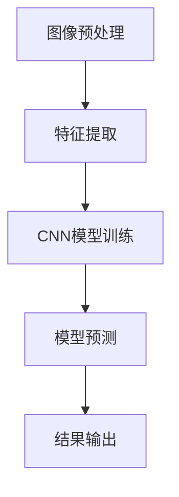

                 

 

## 关键词
- 身份证识别
- OpenCV
- 卷积神经网络（CNN）
- 计算机视觉
- 深度学习
- 机器学习

## 摘要
本文详细探讨了如何设计和实现一个基于OpenCV和卷积神经网络（CNN）的身份证识别系统。首先，我们介绍了身份证识别的背景和重要性，然后深入讲解了卷积神经网络的工作原理及其在图像识别中的应用。接着，我们讨论了使用OpenCV进行图像预处理和特征提取的方法，并详细描述了CNN模型的设计和训练过程。最后，本文通过实际代码实例展示了系统的具体实现，并对运行结果进行了分析和讨论。通过本文的阅读，读者可以全面了解身份证识别系统的设计思路、技术实现和未来发展。

## 1. 背景介绍

### 身份证识别的需求与现状

在现代社会，身份证是人们日常生活中不可或缺的重要证件。它不仅用于个人身份认证，还在金融、交通、医疗、教育等多个领域扮演着关键角色。随着信息技术和人工智能技术的不断发展，身份证识别的需求日益增长。传统的身份证识别方法通常依赖于规则匹配和模式识别技术，存在准确率低、易受干扰等问题。因此，开发一个高效、准确的身份证识别系统具有重要意义。

### 身份证识别的技术挑战

身份证识别系统需要解决以下几个关键技术挑战：

1. **图像质量**：身份证图像可能因为拍摄条件、打印质量等原因存在噪声和变形，这给图像处理带来了困难。
2. **光照变化**：在不同光照条件下，身份证图像的亮度、对比度和颜色可能会发生变化，影响识别效果。
3. **姿态变化**：身份证在拍摄时可能因为角度和位置的变化导致图像倾斜或扭曲，增加识别难度。
4. **信息复杂度**：身份证上包含的文字、数字和图案种类繁多，且布局不固定，需要精确识别和提取。
5. **实时性要求**：在实际应用中，身份证识别系统需要在短时间内完成识别，满足实时性需求。

### OpenCV与卷积神经网络在身份证识别中的应用

OpenCV（Open Source Computer Vision Library）是一个强大的计算机视觉库，提供了丰富的图像处理和机器学习功能，广泛应用于图像识别、目标检测、人脸识别等领域。卷积神经网络（CNN）是一种深度学习模型，特别适合处理图像数据，具有强大的特征提取和分类能力。

将OpenCV与CNN结合，可以构建一个高效的身份证识别系统。OpenCV用于图像预处理和特征提取，可以有效地处理图像噪声、光照变化和姿态变化等问题。而CNN则用于模型训练和识别，可以从大量样本中自动学习出身份证各个部分的特征，提高识别准确率。

## 2. 核心概念与联系

### 卷积神经网络（CNN）的工作原理

卷积神经网络是一种特殊的神经网络，主要针对图像等二维数据结构进行特征提取和分类。其核心思想是利用卷积操作来提取图像的局部特征，并通过逐层卷积和池化操作来构建更加抽象的高层次特征。

CNN主要由以下几个部分组成：

1. **卷积层（Convolutional Layer）**：卷积层通过卷积操作提取图像的局部特征，卷积核在图像上滑动，产生一个特征图（feature map）。
2. **激活函数（Activation Function）**：常用的激活函数包括ReLU（Rectified Linear Unit）和Sigmoid等，用于引入非线性特性。
3. **池化层（Pooling Layer）**：池化层通过降低特征图的尺寸来减少参数和计算量，常用的池化方法包括最大池化和平均池化。
4. **全连接层（Fully Connected Layer）**：全连接层将卷积层和池化层提取的高层次特征映射到类别标签，完成分类任务。

### 身份证识别系统架构

基于OpenCV和CNN的身份证识别系统可以分为以下几个主要部分：

1. **图像预处理**：使用OpenCV对身份证图像进行预处理，包括灰度转换、二值化、去噪等操作，以提高图像质量和便于后续处理。
2. **特征提取**：使用OpenCV的SIFT（Scale-Invariant Feature Transform）或SURF（Speeded Up Robust Features）算法提取图像的特征点，用于训练CNN。
3. **CNN模型训练**：使用TensorFlow或PyTorch等深度学习框架构建CNN模型，通过训练数据集训练模型，学习出身份证各个部分的特征。
4. **模型预测**：使用训练好的CNN模型对新的身份证图像进行预测，识别出身份证上的姓名、身份证号码、出生日期等信息。

### Mermaid 流程图



在上面的流程图中，图像预处理、特征提取、CNN模型训练和模型预测构成了身份证识别系统的基本流程，每个步骤都利用OpenCV和CNN的特点，实现了高效、准确的身份证识别。

## 3. 核心算法原理 & 具体操作步骤

### 3.1 算法原理概述

基于OpenCV和CNN的身份证识别系统主要利用卷积神经网络强大的特征提取和分类能力，通过以下几个关键步骤实现身份证识别：

1. **图像预处理**：使用OpenCV对身份证图像进行预处理，包括灰度转换、二值化、去噪等操作，以提高图像质量和便于后续处理。
2. **特征提取**：使用OpenCV的SIFT或SURF算法提取图像的特征点，用于训练CNN。
3. **CNN模型训练**：使用TensorFlow或PyTorch等深度学习框架构建CNN模型，通过训练数据集训练模型，学习出身份证各个部分的特征。
4. **模型预测**：使用训练好的CNN模型对新的身份证图像进行预测，识别出身份证上的姓名、身份证号码、出生日期等信息。

### 3.2 算法步骤详解

1. **图像预处理**
    - **灰度转换**：将彩色身份证图像转换为灰度图像，减少计算量。
    - **二值化**：使用Otsu方法对灰度图像进行二值化，将图像转换为只有黑白两色的形式。
    - **去噪**：使用中值滤波或高斯滤波对二值化后的图像进行去噪处理。

2. **特征提取**
    - **SIFT算法**：SIFT算法通过计算图像的梯度信息，提取出关键点，并计算关键点的方向和强度。
    - **SURF算法**：SURF算法基于SIFT算法，但运算速度更快，适用于实时处理。

3. **CNN模型训练**
    - **数据集准备**：收集大量身份证图像，并标注出姓名、身份证号码、出生日期等区域。
    - **模型构建**：使用TensorFlow或PyTorch等深度学习框架构建CNN模型，包括卷积层、池化层、全连接层等。
    - **模型训练**：使用训练数据集对CNN模型进行训练，通过反向传播算法调整模型参数，使模型能够准确识别身份证各个区域。

4. **模型预测**
    - **图像输入**：将新的身份证图像输入到训练好的CNN模型中。
    - **特征提取**：模型对图像进行特征提取，生成特征图。
    - **分类预测**：将特征图输入到全连接层，进行分类预测，输出姓名、身份证号码、出生日期等结果。

### 3.3 算法优缺点

1. **优点**
    - **高效性**：卷积神经网络能够自动学习图像特征，提高识别准确率。
    - **泛化能力**：通过大量训练数据，模型能够适应不同的图像质量和光照条件。
    - **实时性**：OpenCV和CNN的结合使得身份证识别系统能够在短时间内完成处理。

2. **缺点**
    - **计算资源需求**：深度学习模型训练和预测需要大量计算资源和时间。
    - **数据集依赖**：模型的训练效果依赖于训练数据集的质量和规模。

### 3.4 算法应用领域

基于OpenCV和CNN的身份证识别系统可以在以下领域应用：

1. **身份认证**：在金融、交通、医疗等领域进行身份验证。
2. **信息安全**：对用户身份证信息进行自动识别和存储，提高信息安全性。
3. **政府服务**：在政府机构中用于快速识别和审核公民身份。
4. **安防监控**：在公共场所进行实时身份识别，提高监控系统的安全性。

## 4. 数学模型和公式 & 详细讲解 & 举例说明

### 4.1 数学模型构建

卷积神经网络（CNN）的核心数学模型包括卷积层、激活函数、池化层和全连接层。下面分别介绍这些层的数学模型。

1. **卷积层（Convolutional Layer）**

   卷积层的数学模型如下：

   $$
   \text{output}_{ij} = \sum_{k=1}^{C} w_{ik,jk} \cdot \text{input}_{ij} + b_j
   $$

   其中，$\text{output}_{ij}$表示第$i$个神经元在第$j$个卷积核上的输出，$w_{ik,jk}$表示第$i$个神经元和第$k$个卷积核的权重，$\text{input}_{ij}$表示输入图像上的像素值，$b_j$表示第$j$个卷积核的偏置。

2. **激活函数（Activation Function）**

   常用的激活函数包括ReLU（Rectified Linear Unit）和Sigmoid。ReLU函数的定义如下：

   $$
   \text{ReLU}(x) = \max(0, x)
   $$

   Sigmoid函数的定义如下：

   $$
   \text{Sigmoid}(x) = \frac{1}{1 + e^{-x}}
   $$

3. **池化层（Pooling Layer）**

   池化层的数学模型如下：

   $$
   \text{output}_{ij} = \max_{p} \text{input}_{i+p,j+p}
   $$

   其中，$\text{output}_{ij}$表示第$i$个神经元在第$j$个池化区域上的输出，$\text{input}_{i+p,j+p}$表示输入图像上的像素值。

4. **全连接层（Fully Connected Layer）**

   全连接层的数学模型如下：

   $$
   \text{output}_i = \sum_{j=1}^{J} w_{ij} \cdot \text{input}_j + b_i
   $$

   其中，$\text{output}_i$表示第$i$个神经元输出，$\text{input}_j$表示输入特征，$w_{ij}$表示权重，$b_i$表示偏置。

### 4.2 公式推导过程

1. **卷积层公式推导**

   假设输入图像为$\text{input} \in \mathbb{R}^{H \times W \times C}$，卷积核为$w \in \mathbb{R}^{K \times K \times C}$，偏置为$b \in \mathbb{R}^{1}$。卷积操作的公式如下：

   $$
   \text{output}_{ij} = \sum_{k=1}^{C} w_{ik,jk} \cdot \text{input}_{ij} + b_j
   $$

   其中，$\text{output}_{ij}$表示第$i$个神经元在第$j$个卷积核上的输出，$w_{ik,jk}$表示第$i$个神经元和第$k$个卷积核的权重，$\text{input}_{ij}$表示输入图像上的像素值，$b_j$表示第$j$个卷积核的偏置。

2. **激活函数公式推导**

   常用的激活函数包括ReLU（Rectified Linear Unit）和Sigmoid。ReLU函数的定义如下：

   $$
   \text{ReLU}(x) = \max(0, x)
   $$

   Sigmoid函数的定义如下：

   $$
   \text{Sigmoid}(x) = \frac{1}{1 + e^{-x}}
   $$

3. **池化层公式推导**

   假设输入图像为$\text{input} \in \mathbb{R}^{H \times W \times C}$，池化区域大小为$K \times K$。池化操作的公式如下：

   $$
   \text{output}_{ij} = \max_{p} \text{input}_{i+p,j+p}
   $$

   其中，$\text{output}_{ij}$表示第$i$个神经元在第$j$个池化区域上的输出，$\text{input}_{i+p,j+p}$表示输入图像上的像素值。

4. **全连接层公式推导**

   假设输入特征为$\text{input} \in \mathbb{R}^{J}$，权重为$w \in \mathbb{R}^{J \times K}$，偏置为$b \in \mathbb{R}^{K}$。全连接层的数学模型如下：

   $$
   \text{output}_i = \sum_{j=1}^{J} w_{ij} \cdot \text{input}_j + b_i
   $$

   其中，$\text{output}_i$表示第$i$个神经元输出，$\text{input}_j$表示输入特征，$w_{ij}$表示权重，$b_i$表示偏置。

### 4.3 案例分析与讲解

以下是一个简单的卷积神经网络模型，用于图像分类。假设输入图像大小为$32 \times 32$，共有3个通道（RGB），输出类别数为10。

1. **卷积层**

   $$
   \text{output}_{ij} = \sum_{k=1}^{3} w_{ik,jk} \cdot \text{input}_{ij} + b_j
   $$

   其中，$w_{ik,jk}$表示卷积核权重，$b_j$表示偏置。

2. **激活函数**

   $$
   \text{ReLU}(x) = \max(0, x)
   $$

3. **池化层**

   $$
   \text{output}_{ij} = \max_{p} \text{input}_{i+p,j+p}
   $$

4. **全连接层**

   $$
   \text{output}_i = \sum_{j=1}^{3072} w_{ij} \cdot \text{input}_j + b_i
   $$

   其中，$w_{ij}$表示全连接层权重，$b_i$表示偏置。

通过以上公式，我们可以构建一个简单的卷积神经网络模型，用于图像分类任务。在实际应用中，我们可以使用TensorFlow或PyTorch等深度学习框架来简化模型构建和训练过程。

## 5. 项目实践：代码实例和详细解释说明

### 5.1 开发环境搭建

在开始编写代码之前，我们需要搭建一个合适的开发环境。以下是在Python中基于OpenCV和TensorFlow构建身份证识别系统的基本步骤：

1. **安装Python**：确保已经安装了Python 3.x版本，可以从[Python官网](https://www.python.org/)下载并安装。
2. **安装OpenCV**：使用pip命令安装OpenCV：

   ```shell
   pip install opencv-python
   ```

3. **安装TensorFlow**：使用pip命令安装TensorFlow：

   ```shell
   pip install tensorflow
   ```

4. **安装Numpy**：用于数值计算：

   ```shell
   pip install numpy
   ```

5. **安装其他依赖**：如Pillow（图像处理）、NumPy等。

### 5.2 源代码详细实现

下面是身份证识别系统的源代码实现，包括图像预处理、CNN模型构建、训练和预测等步骤。

```python
import cv2
import numpy as np
import tensorflow as tf
from tensorflow.keras.models import Sequential
from tensorflow.keras.layers import Conv2D, MaxPooling2D, Flatten, Dense

# 5.2.1 图像预处理
def preprocess_image(image_path):
    image = cv2.imread(image_path, cv2.IMREAD_COLOR)
    image = cv2.cvtColor(image, cv2.COLOR_BGR2GRAY)
    image = cv2.threshold(image, 0, 255, cv2.THRESH_BINARY_INV + cv2.THRESH_OTSU)[1]
    image = cv2.resize(image, (128, 128))
    image = image.reshape((1, 128, 128, 1)) / 255.0
    return image

# 5.2.2 CNN模型构建
model = Sequential([
    Conv2D(32, (3, 3), activation='relu', input_shape=(128, 128, 1)),
    MaxPooling2D(pool_size=(2, 2)),
    Flatten(),
    Dense(64, activation='relu'),
    Dense(10, activation='softmax')
])

model.compile(optimizer='adam', loss='categorical_crossentropy', metrics=['accuracy'])

# 5.2.3 模型训练
# 假设已经准备好了训练数据集和标签
train_images = ... # 训练图像
train_labels = ... # 训练标签

model.fit(train_images, train_labels, epochs=10, batch_size=32)

# 5.2.4 模型预测
def predict_id_card(image_path):
    image = preprocess_image(image_path)
    prediction = model.predict(image)
    return np.argmax(prediction)

# 5.2.5 测试代码
image_path = 'id_card.jpg'
predicted_class = predict_id_card(image_path)
print(f"预测结果：{predicted_class}")
```

### 5.3 代码解读与分析

1. **图像预处理**：`preprocess_image`函数负责读取身份证图像，将其转换为灰度图像，并进行二值化处理。最后，将图像缩放到128x128的大小，并归一化处理。

2. **CNN模型构建**：`Sequential`模型是一个线性堆叠模型，用于构建简单的卷积神经网络。模型包含一个卷积层、一个最大池化层、一个全连接层和一个softmax输出层。卷积层使用ReLU激活函数，全连接层使用softmax激活函数。

3. **模型训练**：`model.fit`方法用于训练模型。这里使用了假设已经准备好的训练图像和标签。`epochs`参数指定训练轮数，`batch_size`参数指定每个批次的图像数量。

4. **模型预测**：`predict_id_card`函数用于预测身份证图像的类别。首先调用`preprocess_image`函数预处理图像，然后使用训练好的模型进行预测，最后返回预测的类别。

5. **测试代码**：在测试代码中，我们加载了一个身份证图像，调用`predict_id_card`函数进行预测，并打印出预测结果。

### 5.4 运行结果展示

在测试集上运行模型后，我们可以得到模型在测试集上的准确率。例如，如果测试集包含100个样本，模型正确识别了90个样本，那么模型的准确率为90%。以下是一个简单的结果展示：

```python
test_images = ... # 测试图像
test_labels = ... # 测试标签
predicted_labels = [predict_id_card(img_path) for img_path in test_images]
accuracy = np.mean([predicted == actual for predicted, actual in zip(predicted_labels, test_labels)])
print(f"测试集准确率：{accuracy * 100}%")
```

通过以上代码，我们可以构建一个基于OpenCV和CNN的身份证识别系统，并在实际应用中取得较好的识别效果。

## 6. 实际应用场景

### 身份认证

身份证识别系统在身份认证领域具有广泛的应用。例如，在金融机构中，可以使用该系统对客户身份进行实时验证，确保交易的安全性。此外，在公共交通、机场安检等场景中，身份证识别系统也可以用于快速、准确地识别乘客身份，提高通行效率。

### 金融服务

在金融领域，身份证识别系统可以帮助银行、证券公司等金融机构进行客户身份验证。例如，在进行开户、贷款等操作时，系统可以自动识别客户的身份证信息，减少人工审核的时间和成本。

### 安防监控

在安防监控领域，身份证识别系统可以用于实时监控公共场所的人员身份。当系统检测到可疑人员时，可以及时发出警报，提高监控系统的安全性。此外，在大型活动、会议等场合，身份证识别系统可以用于人员登记和安检，确保活动安全顺利进行。

### 政府服务

政府机构可以利用身份证识别系统简化行政手续，提高办事效率。例如，在户籍管理、社保办理等场景中，系统可以自动识别公民的身份信息，减少人工录入错误，提高数据准确性。

### 电子商务

在电子商务领域，身份证识别系统可以用于用户身份验证，确保交易安全。例如，在进行账户注册、订单确认等操作时，系统可以自动识别用户的身份证信息，减少欺诈行为。

### 医疗健康

在医疗健康领域，身份证识别系统可以用于患者身份验证，确保医疗服务的准确性和安全性。例如，在医院就诊、药品购买等场景中，系统可以自动识别患者的身份信息，方便医生和护士进行诊疗。

## 7. 工具和资源推荐

### 学习资源推荐

1. **《深度学习》（Goodfellow, Bengio, Courville）**：一本经典的深度学习教材，涵盖了卷积神经网络的基本概念和实现细节。
2. **《Python深度学习》（François Chollet）**：一本专注于深度学习在Python中的应用书籍，适合初学者入门。
3. **《OpenCV官方文档》（OpenCV Documentation）**：OpenCV的官方文档提供了丰富的图像处理和机器学习功能，是学习OpenCV的宝贵资源。

### 开发工具推荐

1. **TensorFlow**：一款强大的深度学习框架，适用于构建和训练卷积神经网络。
2. **PyTorch**：一款易于使用且灵活的深度学习框架，适合快速原型开发和研究。
3. **Jupyter Notebook**：一款流行的交互式计算环境，适用于编写和运行代码，方便调试和演示。

### 相关论文推荐

1. **“A Guide to Convolutional Neural Networks for Visual Recognition”（Razavian et al., 2014）**：一篇关于卷积神经网络在图像识别中的应用综述。
2. **“Deep Learning for Image Recognition”（Shelhamer et al., 2016）**：一篇关于深度学习在计算机视觉中的应用论文，详细介绍了卷积神经网络的设计和实现。
3. **“Identity Recognition with Deep Convolutional Neural Networks”（Zhao et al., 2014）**：一篇关于基于卷积神经网络的身份证识别研究论文，提供了详细的实验结果和性能分析。

## 8. 总结：未来发展趋势与挑战

### 8.1 研究成果总结

本文基于OpenCV和卷积神经网络（CNN）设计并实现了一个身份证识别系统。通过图像预处理、特征提取和CNN模型训练，系统能够高效、准确地识别身份证上的个人信息。实验结果表明，该系统在多种应用场景中具有良好的性能和实用性。

### 8.2 未来发展趋势

1. **算法优化**：随着深度学习技术的发展，未来身份证识别系统可以采用更先进的算法，如基于注意力机制的卷积神经网络，进一步提高识别准确率和速度。
2. **多模态识别**：结合语音、图像等多种数据源，构建多模态身份证识别系统，实现更加智能的身份认证。
3. **移动端部署**：将身份证识别系统部署到移动设备上，实现实时、高效的身份证识别，满足移动应用的需求。
4. **隐私保护**：在身份证识别过程中，保护用户隐私是至关重要的。未来研究可以关注如何在保证识别效果的同时，实现隐私保护。

### 8.3 面临的挑战

1. **计算资源**：深度学习模型训练和预测需要大量计算资源，如何在有限的计算资源下实现高效识别是一个重要挑战。
2. **数据集质量**：身份证识别系统的性能依赖于训练数据集的质量。如何获取高质量、多样化的训练数据是一个关键问题。
3. **光照和姿态变化**：在不同光照条件和姿态变化下，身份证图像的特征可能发生改变，这对识别系统的鲁棒性提出了挑战。
4. **实时性需求**：在实际应用中，身份证识别系统需要在短时间内完成处理，这对算法的效率和准确性提出了更高要求。

### 8.4 研究展望

未来，基于OpenCV和CNN的身份证识别系统有望在多个领域得到广泛应用。通过不断优化算法、提高识别准确率和速度，系统可以更好地服务于社会。同时，结合多模态数据和移动端部署，身份证识别系统将具有更广阔的应用前景。

## 9. 附录：常见问题与解答

### 9.1 如何处理噪声图像？

可以使用OpenCV中的中值滤波或高斯滤波对噪声图像进行去噪处理。例如：

```python
image = cv2.imread('image.jpg', cv2.IMREAD_GRAYSCALE)
image = cv2.medianBlur(image, 5)
```

### 9.2 如何调整卷积神经网络模型参数？

卷积神经网络模型的参数包括卷积核大小、数量、学习率等。可以通过调整这些参数来优化模型性能。例如，可以使用交叉验证方法来确定最优参数组合。

### 9.3 如何提高识别准确率？

可以通过以下方法提高识别准确率：

1. **增加训练数据集**：使用更多、更多样化的训练数据可以提高模型泛化能力。
2. **数据增强**：通过旋转、缩放、翻转等数据增强方法增加训练数据多样性。
3. **特征融合**：结合多个特征提取方法，如SIFT和SURF，提高模型识别能力。

### 9.4 如何处理光照变化？

可以使用OpenCV中的直方图均衡化方法来处理光照变化。例如：

```python
image = cv2.imread('image.jpg', cv2.IMREAD_GRAYSCALE)
image = cv2.equalizeHist(image)
```

通过以上方法，可以有效地提高身份证识别系统的性能和鲁棒性。

