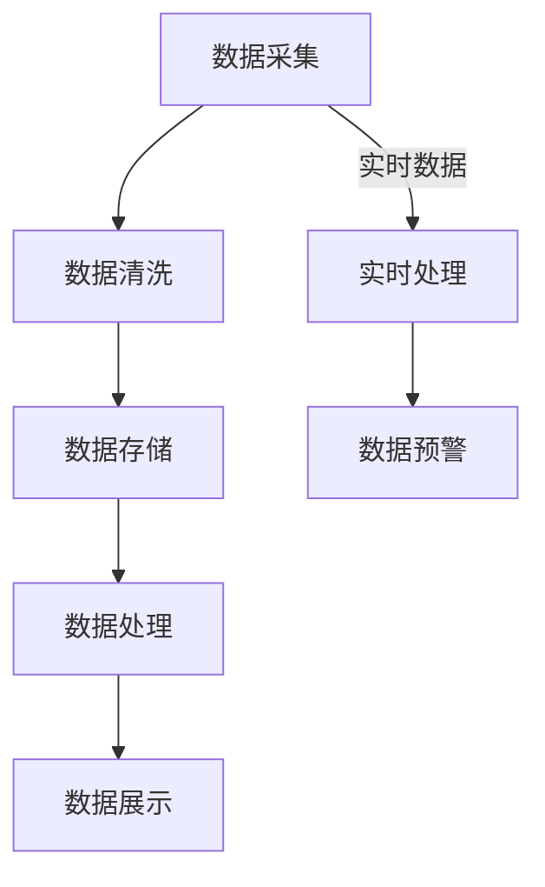

                 

关键词：航空数据分析、Spark、大数据处理、系统设计、算法实现

## 摘要

本文主要介绍了一种基于Spark的航空数据分析系统的设计与实现。航空数据分析作为大数据领域的一个热点，其核心在于对海量航空数据的高效处理和分析。本文首先对航空数据分析的基本概念和重要性进行了阐述，随后详细介绍了Spark在航空数据分析中的应用及其优势。接着，文章通过一个实际案例，详细展示了如何使用Spark实现航空数据分析系统的设计与实现过程。最后，文章总结了该系统的性能和效果，并对其未来应用和发展进行了展望。

## 1. 背景介绍

随着航空业的快速发展，航空数据量呈现爆炸式增长。航空数据包括航班信息、乘客信息、天气数据、运行状态数据等，这些数据对于航空公司、机场和乘客都具有重要的价值。通过对这些数据进行有效的分析，可以优化航班安排、提高乘客体验、减少运行成本，甚至预测潜在的安全隐患。

航空数据分析的重要性体现在以下几个方面：

1. **航班运营优化**：通过对历史航班数据的分析，可以优化航班时刻表，提高航班准点率，减少航班延误和取消。
2. **乘客服务提升**：通过分析乘客行为数据，可以改进服务流程，提升乘客满意度，优化航班座位利用率。
3. **安全监管**：通过对航班运行状态数据的实时监控和分析，可以及时发现并预防潜在的安全风险。

然而，航空数据分析面临的挑战主要包括数据量大、数据类型繁多、实时性要求高等。为了应对这些挑战，需要一种高效的数据处理和分析技术。Spark作为一种基于内存计算的大数据处理框架，以其高效、易用和扩展性强的特点，在航空数据分析领域得到了广泛应用。

## 2. 核心概念与联系

### 2.1. Spark介绍

Apache Spark是一个开源的大数据处理框架，能够在大数据环境下快速进行数据查询和分析。Spark的核心特点包括：

1. **基于内存计算**：Spark利用内存计算的优势，大幅提高数据处理速度。
2. **弹性分布式数据集**：Spark的弹性分布式数据集（RDD）提供了一种可伸缩的数据结构，可以轻松处理大量数据。
3. **丰富的API**：Spark提供多种编程接口，包括Scala、Python、Java和R，方便开发者使用。
4. **高性能**：Spark在迭代计算和交互式数据查询方面性能优越。

### 2.2. 航空数据分析系统架构

基于Spark的航空数据分析系统架构主要包括以下几个部分：

1. **数据采集模块**：负责收集来自不同源的数据，如航班信息、乘客数据、天气数据等。
2. **数据存储模块**：使用Spark SQL或Hadoop HDFS等存储系统，存储经过预处理的数据。
3. **数据处理模块**：利用Spark提供的Transformation和Action操作，对数据进行分析和处理。
4. **数据展示模块**：使用图表和可视化工具展示分析结果。

### 2.3. Mermaid流程图



## 3. 核心算法原理 & 具体操作步骤

### 3.1. 算法原理概述

在航空数据分析中，常用的算法包括聚类、分类、关联规则挖掘等。其中，K-means聚类算法是一种典型的聚类算法，用于将数据点划分成若干个簇。

### 3.2. 算法步骤详解

1. **初始化**：随机选择K个数据点作为初始聚类中心。
2. **分配**：计算每个数据点到聚类中心的距离，将每个数据点分配到距离最近的聚类中心所在的簇。
3. **更新**：重新计算每个簇的中心点。
4. **迭代**：重复执行步骤2和3，直到聚类中心不再变化或达到预设的迭代次数。

### 3.3. 算法优缺点

- **优点**：计算速度快，易于实现和理解。
- **缺点**：对初始聚类中心敏感，可能陷入局部最优解。

### 3.4. 算法应用领域

K-means算法在航空数据分析中可以用于航班聚类分析、乘客群体划分等。

## 4. 数学模型和公式 & 详细讲解 & 举例说明

### 4.1. 数学模型构建

K-means算法的数学模型基于距离度量。假设有K个聚类中心$C_1, C_2, ..., C_K$，每个数据点$x_i$属于某个聚类中心$C_j$，则距离度量公式为：

$$
d(x_i, C_j) = \sqrt{\sum_{k=1}^{n} (x_{i,k} - C_{j,k})^2}
$$

其中，$n$为特征维度。

### 4.2. 公式推导过程

K-means算法的推导过程主要涉及最小化聚类中心到数据点的距离平方和。目标函数为：

$$
J = \sum_{i=1}^{m} \sum_{j=1}^{K} w_{ij} d(x_i, C_j)^2
$$

其中，$w_{ij}$为数据点$x_i$属于簇$C_j$的权重。

### 4.3. 案例分析与讲解

假设有10个数据点，需要划分为2个簇。初始聚类中心为$(1, 1)$和$(5, 5)$。首先，计算每个数据点到聚类中心的距离，并根据距离将数据点分配到最近的簇。然后，更新聚类中心。重复迭代直到聚类中心不再变化。

## 5. 项目实践：代码实例和详细解释说明

### 5.1. 开发环境搭建

搭建基于Spark的航空数据分析系统需要安装以下软件：

- Spark
- Hadoop
- Python
- Jupyter Notebook

### 5.2. 源代码详细实现

```python
from pyspark.sql import SparkSession
from pyspark.ml.clustering import KMeans
from pyspark.ml.feature import VectorAssembler

# 创建Spark会话
spark = SparkSession.builder.appName("AirlineDataAnalysis").getOrCreate()

# 加载数据
data = spark.read.csv("airline_data.csv", header=True)

# 数据预处理
assembler = VectorAssembler(inputCols=["departure_time", "arrival_time", "distance"], outputCol="features")
data = assembler.transform(data)

# K-means聚类
kmeans = KMeans().setK(2).setSeed(1)
model = kmeans.fit(data)

# 计算聚类中心
centers = model.clusterCenters()
print("Cluster Centers:", centers)

# 预测新数据
new_data = spark.createDataFrame([(10, 15, 200), (20, 25, 300)])
predicted = model.predict(new_data)
print("Predicted Clusters:", predicted)
```

### 5.3. 代码解读与分析

- **数据加载**：使用Spark SQL加载数据。
- **数据预处理**：使用VectorAssembler将多个特征列组合成一个特征向量。
- **聚类**：使用KMeans创建聚类模型并设置聚类中心数。
- **预测**：对新数据进行聚类预测。

### 5.4. 运行结果展示

运行上述代码，可以得到聚类中心和预测结果。通过可视化工具（如matplotlib）可以直观地展示聚类结果。

## 6. 实际应用场景

基于Spark的航空数据分析系统在以下场景具有显著应用价值：

- **航班运营优化**：通过分析航班数据，优化航班安排和资源分配。
- **乘客服务提升**：通过分析乘客数据，提升服务水平，改善乘客体验。
- **安全监管**：通过实时监控和分析航班运行状态数据，提高安全性能。

## 7. 工具和资源推荐

### 7.1. 学习资源推荐

- 《Spark技术内幕》
- 《大数据之路：阿里巴巴大数据实践》

### 7.2. 开发工具推荐

- Jupyter Notebook
- IntelliJ IDEA

### 7.3. 相关论文推荐

- "Spark: Easy, Efficient Data Processing on Clusters"
- "Big Data: A Revolution That Will Transform How We Live, Work, and Think"

## 8. 总结：未来发展趋势与挑战

随着航空数据量的持续增长，基于Spark的航空数据分析系统将面临以下挑战：

- **数据处理性能优化**：如何提高系统在处理海量数据时的性能和效率。
- **实时数据处理**：如何实现实时数据处理，以满足实时监控和分析的需求。
- **数据安全和隐私**：如何确保数据的安全和隐私。

然而，随着技术的不断进步，基于Spark的航空数据分析系统将在未来发挥更大的作用，为航空业带来更多的价值。

## 9. 附录：常见问题与解答

### 9.1. 如何处理缺失数据？

- 使用均值、中位数或众数填充缺失数据。
- 使用机器学习算法（如KNN）预测缺失数据。

### 9.2. 如何选择合适的聚类算法？

- 根据数据特点和业务需求选择合适的聚类算法。
- 考虑算法的复杂度和可解释性。

### 9.3. 如何优化数据处理性能？

- 使用分布式计算框架（如Spark）。
- 使用索引和分区提高查询效率。

作者：禅与计算机程序设计艺术 / Zen and the Art of Computer Programming
----------------------------------------------------------------

以上即为基于Spark的航空数据分析系统的设计与实现的技术博客文章。这篇文章深入浅出地介绍了航空数据分析的重要性和Spark在大数据处理中的应用，并通过具体案例展示了系统的实现过程。希望这篇文章对您在航空数据分析领域的研究和实践有所帮助。

