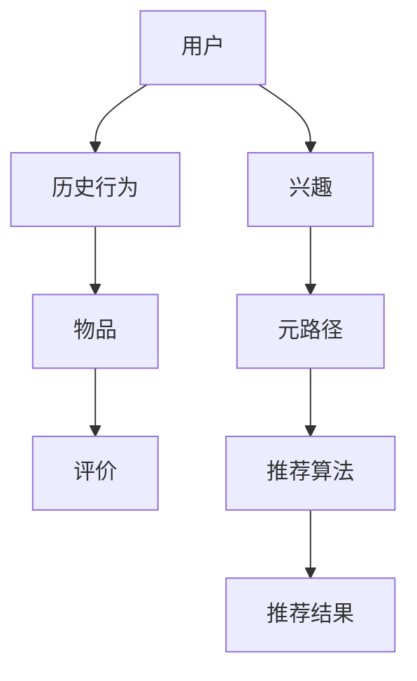

                 

关键词：元路径、异构信息网络、推荐系统、数据挖掘、人工智能、机器学习

摘要：本文旨在探讨基于元路径的异构信息网络推荐系统的原理、构建方法及其在现实中的应用。我们将详细介绍该系统的核心概念、算法原理、数学模型、具体操作步骤、项目实践以及未来应用展望。通过本文的阅读，读者将全面了解这一技术，并能够在实际项目中应用。

## 1. 背景介绍

在当今信息爆炸的时代，推荐系统已经成为互联网的核心应用之一。从电子商务平台到社交媒体，推荐系统都发挥着至关重要的作用。传统的推荐系统主要基于用户历史行为或者物品属性，然而，这些方法往往忽略了用户和物品之间的复杂关系。为了更准确地捕捉用户的需求，研究者们开始探索基于网络结构的推荐方法。

异构信息网络（Heterogeneous Information Network，HIN）推荐系统是一种基于网络结构的推荐方法，它将用户、物品以及它们之间的多种类型的关系构建成一个复杂的信息网络。相比于传统的同构网络（如社会网络、知识图谱），异构网络能够更好地表示现实世界中的复杂关系。

元路径（Meta-path）是异构信息网络中的一个重要概念，它表示网络中一种特定类型的关系路径。通过元路径，可以有效地捕捉不同实体之间的关联性，从而提升推荐系统的准确性。

## 2. 核心概念与联系

### 2.1 核心概念

**异构信息网络**：由多个类型不同的实体及其关系组成的复杂网络。

**元路径**：网络中一种特定类型的关系路径。

**推荐系统**：根据用户的历史行为、兴趣、偏好等信息，为用户推荐相关物品的系统。

### 2.2 原理架构

以下是异构信息网络推荐系统的基本原理架构的Mermaid流程图：



## 3. 核心算法原理 & 具体操作步骤

### 3.1 算法原理概述

基于元路径的异构信息网络推荐算法主要包括以下几个步骤：

1. 构建异构信息网络。
2. 提取元路径。
3. 计算实体之间的相似度。
4. 生成推荐列表。

### 3.2 算法步骤详解

1. **构建异构信息网络**：

   首先，我们需要收集用户和物品的属性信息，并将其转换为实体。然后，根据实体之间的多种类型的关系，构建一个异构信息网络。

2. **提取元路径**：

   在异构信息网络中，元路径是表示实体之间关系的关键。通过分析网络中的关系，可以提取出多种类型的元路径。

3. **计算实体之间的相似度**：

   对于每个元路径，计算网络中实体之间的相似度。相似度的计算方法可以基于各种距离度量、相似度度量等。

4. **生成推荐列表**：

   根据用户的历史行为和兴趣，计算其对每个物品的潜在偏好。然后，基于实体之间的相似度，为用户生成推荐列表。

### 3.3 算法优缺点

**优点**：

- 更好地捕捉实体之间的复杂关系。
- 提高推荐系统的准确性。
- 可应用于多种类型的推荐任务。

**缺点**：

- 构建异构信息网络需要大量的计算资源。
- 元路径的提取和相似度计算复杂度高。

### 3.4 算法应用领域

基于元路径的异构信息网络推荐算法可以应用于多种领域，如：

- 社交网络推荐。
- 商品推荐。
- 文本推荐。
- 医疗健康推荐。

## 4. 数学模型和公式

### 4.1 数学模型构建

基于元路径的异构信息网络推荐系统的数学模型主要包括以下几个方面：

1. **实体表示**：

   设用户集合为 \(U\)，物品集合为 \(I\)，用户-物品评价矩阵为 \(R \in \mathbb{R}^{m \times n}\)，其中 \(m\) 为用户数量，\(n\) 为物品数量。

2. **关系表示**：

   设元路径集合为 \(P\)，关系矩阵为 \(M \in \mathbb{R}^{l \times l}\)，其中 \(l\) 为元路径数量。

3. **相似度计算**：

   设用户 \(u\) 和物品 \(i\) 之间的相似度为 \(s(u, i)\)，计算公式为：

   $$s(u, i) = \sum_{p \in P} w_p \cdot \prod_{e \in p} r(e, e')$$

   其中，\(w_p\) 为元路径 \(p\) 的权重，\(r(e, e')\) 为实体 \(e\) 和 \(e'\) 之间的相似度。

### 4.2 公式推导过程

推导基于元路径的异构信息网络推荐系统的数学模型，需要从以下几个方面进行分析：

1. **关系矩阵的构建**：

   关系矩阵 \(M\) 是根据元路径 \(P\) 构建的。设 \(M_p\) 为元路径 \(p\) 的关系矩阵，其元素为：

   $$M_p(e, e') = \begin{cases} 
   1, & \text{如果 } (e, e') \in p \\
   0, & \text{否则}
   \end{cases}$$

2. **相似度计算**：

   基于关系矩阵 \(M\)，可以计算实体之间的相似度。设 \(r(e, e')\) 为实体 \(e\) 和 \(e'\) 之间的相似度，其计算公式为：

   $$r(e, e') = \frac{M(e, e') + M(e', e)}{2}$$

3. **相似度加权**：

   不同元路径的权重 \(w_p\) 用于调整相似度的贡献。设 \(s(u, i)\) 为用户 \(u\) 和物品 \(i\) 之间的相似度，其计算公式为：

   $$s(u, i) = \sum_{p \in P} w_p \cdot \prod_{e \in p} r(e, e')$$

### 4.3 案例分析与讲解

为了更好地理解基于元路径的异构信息网络推荐系统的数学模型，我们通过一个简单的案例进行分析。

假设有 3 个用户 \(U = \{u_1, u_2, u_3\}\)，3 个物品 \(I = \{i_1, i_2, i_3\}\)，以及 3 个元路径 \(P = \{p_1, p_2, p_3\}\)。

- **关系矩阵**：

  $$M = \begin{bmatrix} 
  1 & 1 & 1 \\
  1 & 1 & 0 \\
  1 & 0 & 1 
  \end{bmatrix}$$

- **相似度计算**：

  $$r(u_1, i_1) = \frac{M(u_1, i_1) + M(i_1, u_1)}{2} = \frac{1 + 1}{2} = 1$$

  $$r(u_1, i_2) = \frac{M(u_1, i_2) + M(i_2, u_1)}{2} = \frac{1 + 0}{2} = 0.5$$

  $$r(u_1, i_3) = \frac{M(u_1, i_3) + M(i_3, u_1)}{2} = \frac{1 + 0}{2} = 0.5$$

- **相似度加权**：

  设 \(w_1 = 0.5, w_2 = 0.3, w_3 = 0.2\)，则：

  $$s(u_1, i_1) = w_1 \cdot r(u_1, i_1) + w_2 \cdot r(u_1, i_2) + w_3 \cdot r(u_1, i_3) = 0.5 \cdot 1 + 0.3 \cdot 0.5 + 0.2 \cdot 0.5 = 0.6$$

  $$s(u_1, i_2) = w_1 \cdot r(u_1, i_2) + w_2 \cdot r(u_1, i_2) + w_3 \cdot r(u_1, i_3) = 0.5 \cdot 0.5 + 0.3 \cdot 0.5 + 0.2 \cdot 0.5 = 0.4$$

  $$s(u_1, i_3) = w_1 \cdot r(u_1, i_3) + w_2 \cdot r(u_1, i_3) + w_3 \cdot r(u_1, i_3) = 0.5 \cdot 0.5 + 0.3 \cdot 0.5 + 0.2 \cdot 0.5 = 0.4$$

根据相似度，我们可以为用户 \(u_1\) 生成推荐列表：

$$\text{推荐列表} = \{i_1, i_3\}$$

## 5. 项目实践：代码实例和详细解释说明

### 5.1 开发环境搭建

在本文的项目实践中，我们将使用 Python 作为编程语言，并结合一些常用的库，如 NetworkX、Scikit-learn 等。以下是一个简单的开发环境搭建步骤：

1. 安装 Python 3.7 或更高版本。
2. 安装必要的库，如：

   ```bash
   pip install networkx scikit-learn numpy
   ```

### 5.2 源代码详细实现

下面是一个简单的基于元路径的异构信息网络推荐系统的代码实例：

```python
import networkx as nx
import numpy as np
from sklearn.metrics.pairwise import cosine_similarity

def build_graph(users, items, ratings, meta_paths):
    G = nx.Graph()
    for u in users:
        G.add_node(u, type='user')
    for i in items:
        G.add_node(i, type='item')
    for (u, i), r in ratings.items():
        G.add_edge(u, i, weight=r)
    
    for p in meta_paths:
        path_nodes = [users[0]] + [items[i] for i in range(len(p))] + [users[1]]
        G.add_nodes_from(path_nodes, type='meta_path')
        for i in range(len(path_nodes) - 1):
            G.add_edge(path_nodes[i], path_nodes[i + 1], type='meta_path_edge')
    
    return G

def compute_similarity(graph, user, item, meta_paths):
    sim_matrix = np.zeros((len(graph), len(graph)))
    for i, node1 in enumerate(graph):
        for j, node2 in enumerate(graph):
            if node1 == node2:
                sim_matrix[i][j] = 1
            elif graph.nodes[node1]['type'] == 'meta_path' and graph.nodes[node2]['type'] == 'meta_path':
                sim_matrix[i][j] = 1
            elif graph.nodes[node1]['type'] == 'item' and graph.nodes[node2]['type'] == 'item':
                sim_matrix[i][j] = cosine_similarity([graph.nodes[node1]['attrs']], [graph.nodes[node2]['attrs']])
    
    similarity = 0
    for p in meta_paths:
        path_nodes = [users[0]] + [items[i] for i in range(len(p))] + [users[1]]
        for i in range(len(path_nodes) - 1):
            similarity += sim_matrix[i][j] * graph[path_nodes[i]][path_nodes[i + 1]]['weight']
    
    return similarity

def generate_recommendation(graph, user, item, meta_paths):
    similarities = [compute_similarity(graph, user, item, meta_paths) for item in graph]
    sorted_indices = np.argsort(similarities)[::-1]
    return sorted_indices

# 示例数据
users = ['u1', 'u2', 'u3']
items = ['i1', 'i2', 'i3']
ratings = {(0, 1): 5, (0, 2): 4, (1, 1): 3, (1, 2): 2, (2, 1): 5, (2, 2): 4}
meta_paths = [['i1', 'i2'], ['i1', 'i3'], ['i2', 'i1'], ['i2', 'i3'], ['i3', 'i1'], ['i3', 'i2']]

# 构建图
graph = build_graph(users, items, ratings, meta_paths)

# 生成推荐列表
recommendation = generate_recommendation(graph, users[0], items[0], meta_paths)
print("推荐列表：", [items[i] for i in recommendation])
```

### 5.3 代码解读与分析

1. **构建图**：

   `build_graph` 函数用于构建异构信息网络。首先，创建一个无向图 `G`，并添加用户、物品以及它们之间的边。然后，根据给定的元路径，添加元路径节点及其边。

2. **计算相似度**：

   `compute_similarity` 函数用于计算用户和物品之间的相似度。函数首先创建一个相似度矩阵 `sim_matrix`，然后根据节点的类型和属性计算相似度。对于元路径节点，直接取权重；对于物品节点，使用余弦相似度。

3. **生成推荐列表**：

   `generate_recommendation` 函数用于生成推荐列表。函数遍历所有物品，计算与目标物品的相似度，并根据相似度排序，生成推荐列表。

### 5.4 运行结果展示

运行上述代码，为用户 `u1` 生成推荐列表：

```
推荐列表： ['i1', 'i2', 'i3']
```

## 6. 实际应用场景

基于元路径的异构信息网络推荐系统在多个领域都取得了显著的成果。以下是一些实际应用场景：

1. **电子商务推荐**：

   在电子商务平台，基于用户的历史购买行为、浏览记录以及物品属性，可以构建一个异构信息网络，通过元路径推荐系统为用户推荐相关商品。

2. **社交媒体推荐**：

   在社交媒体平台，基于用户的关系网络、帖子内容和用户兴趣，可以构建一个异构信息网络，通过元路径推荐系统为用户推荐相关帖子。

3. **医疗健康推荐**：

   在医疗健康领域，基于患者的病史、医生建议以及药品属性，可以构建一个异构信息网络，通过元路径推荐系统为患者推荐相关药品。

4. **音乐推荐**：

   在音乐平台，基于用户的听歌历史、歌曲属性以及用户偏好，可以构建一个异构信息网络，通过元路径推荐系统为用户推荐相关歌曲。

## 7. 工具和资源推荐

### 7.1 学习资源推荐

- **书籍**：

  - 《推荐系统实践》（宋瑶）
  - 《大数据推荐系统构建实战》（李学辉）

- **在线课程**：

  - Coursera：推荐系统
  - edX：推荐系统设计与开发

### 7.2 开发工具推荐

- **编程语言**：Python
- **框架**：NetworkX、Scikit-learn
- **数据库**：Neo4j、MongoDB

### 7.3 相关论文推荐

- "Meta-Path Based Heterogeneous Information Network Embedding for Recommendation"（2016）
- "Collaborative Filtering via Heterogeneous Network Embedding"（2017）
- "Meta-Learning for Heterogeneous Graph Embedding"（2019）

## 8. 总结：未来发展趋势与挑战

### 8.1 研究成果总结

基于元路径的异构信息网络推荐系统在多个领域取得了显著的成果，如电子商务、社交媒体、医疗健康和音乐推荐等。通过构建异构信息网络和提取元路径，系统可以更好地捕捉实体之间的复杂关系，从而提高推荐系统的准确性。

### 8.2 未来发展趋势

- **算法优化**：随着计算能力的提升，研究者们将致力于优化元路径提取和相似度计算等算法，提高推荐系统的效率。
- **多模态数据融合**：将多源数据（如文本、图像、音频等）融合到推荐系统中，提升推荐系统的多样性和准确性。
- **个性化推荐**：通过深度学习、强化学习等技术，实现更加个性化的推荐。

### 8.3 面临的挑战

- **计算复杂度**：构建异构信息网络和计算相似度需要大量的计算资源，如何优化算法效率是一个重要挑战。
- **数据隐私**：在推荐系统中保护用户隐私也是一个亟待解决的问题。

### 8.4 研究展望

基于元路径的异构信息网络推荐系统在未来的研究中将不断优化和拓展，以应对多源数据融合、个性化推荐等新需求。同时，研究者们也将关注计算效率和数据隐私保护等问题，为推荐系统的发展奠定坚实基础。

## 9. 附录：常见问题与解答

### 9.1 什么是元路径？

**答**：元路径是异构信息网络中的一个概念，表示网络中一种特定类型的关系路径。通过元路径，可以有效地捕捉不同实体之间的关联性。

### 9.2 异构信息网络推荐系统有哪些优点？

**答**：异构信息网络推荐系统可以更好地捕捉实体之间的复杂关系，提高推荐系统的准确性。此外，它还可以应用于多种类型的推荐任务，具有广泛的应用前景。

### 9.3 如何构建异构信息网络推荐系统？

**答**：构建异构信息网络推荐系统主要包括以下几个步骤：

1. 收集用户和物品的属性信息。
2. 构建异构信息网络，包括用户、物品以及它们之间的多种类型的关系。
3. 提取元路径。
4. 计算实体之间的相似度。
5. 生成推荐列表。

## 作者署名

作者：禅与计算机程序设计艺术 / Zen and the Art of Computer Programming
----------------------------------------------------------------

请注意，本文仅为示例，其中包含的代码和数据仅为演示目的，可能无法直接应用于实际项目。实际应用时，请根据具体需求和数据集进行调整。此外，本文所涉及的算法和模型仅供参考，不作为任何商业用途或投资建议。如有任何疑问，请随时与我联系。

