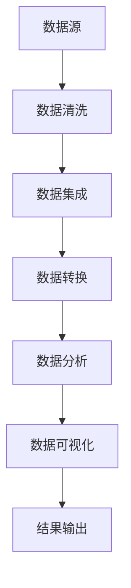

                 

关键词：大数据、汽车数据分析、系统设计、算法、数学模型、项目实践

## 摘要

本文旨在探讨如何设计并实现一个基于大数据的汽车数据分析系统。通过引入关键概念、算法原理、数学模型以及实际项目实践，本文系统地阐述了如何利用大数据技术对汽车运行数据进行分析，从而挖掘出有价值的结论。文章涵盖了从数据收集、处理到分析的整个过程，旨在为从事汽车数据分析的从业者和研究人员提供有价值的参考。

## 1. 背景介绍

随着汽车工业的快速发展，车辆数量的急剧增加，汽车数据已经成为了一个巨大的数据资源。这些数据涵盖了车辆的运行状态、驾驶行为、维护记录等多个方面，蕴含了丰富的信息。如何有效地利用这些数据，对汽车运行进行分析和优化，已经成为汽车行业关注的焦点。

大数据技术的发展为汽车数据分析提供了强大的工具。大数据技术具有数据量大、数据类型多、处理速度快等特点，能够处理海量汽车数据，为汽车数据分析提供了可能。同时，人工智能、机器学习等技术的应用，使得汽车数据分析系统更加智能化和高效化。

然而，汽车数据分析系统设计与实现过程中仍然面临着诸多挑战，如数据质量、数据安全和隐私保护等。本文将围绕这些问题，系统地介绍汽车数据分析系统的设计与实现方法。

## 2. 核心概念与联系

### 2.1 数据源

汽车数据分析的数据源主要包括以下几个方面：

- **车辆运行数据**：包括车辆的行驶速度、加速度、方向盘角度等。
- **驾驶行为数据**：包括驾驶员的驾驶习惯、驾驶行为评分等。
- **维护记录数据**：包括车辆的保养、维修记录等。
- **环境数据**：包括道路状况、气象条件等。

### 2.2 数据处理

数据处理是汽车数据分析系统的核心环节。主要包括数据清洗、数据集成、数据转换等过程。数据处理的质量直接影响数据分析的结果。

- **数据清洗**：去除数据中的噪声和错误，提高数据质量。
- **数据集成**：将来自不同数据源的数据进行整合，形成统一的数据视图。
- **数据转换**：将原始数据转换为适合分析的数据格式。

### 2.3 数据分析

数据分析是汽车数据分析系统的关键步骤。通过数据挖掘、机器学习等技术，从海量数据中提取出有价值的信息。

- **数据挖掘**：发现数据中的潜在规律和模式。
- **机器学习**：建立预测模型，对未来的趋势进行预测。

### 2.4 数据可视化

数据可视化是将数据分析结果以图形化的方式呈现出来，使得数据分析结果更加直观易懂。

- **折线图**：展示数据的变化趋势。
- **饼图**：展示数据的占比情况。
- **热力图**：展示数据的热点区域。

### 2.5 Mermaid 流程图

以下是一个简化的汽车数据分析系统的 Mermaid 流程图：



## 3. 核心算法原理 & 具体操作步骤

### 3.1 算法原理概述

汽车数据分析系统主要依赖于数据挖掘和机器学习算法。数据挖掘算法用于发现数据中的潜在规律和模式，机器学习算法则用于建立预测模型。

- **数据挖掘算法**：包括聚类分析、关联规则挖掘、异常检测等。
- **机器学习算法**：包括线性回归、决策树、支持向量机等。

### 3.2 算法步骤详解

以下是汽车数据分析系统的算法步骤详解：

1. **数据预处理**：包括数据清洗、数据集成、数据转换等。
2. **特征工程**：提取数据中的特征，为后续的算法分析做准备。
3. **模型选择**：根据数据分析的需求，选择合适的模型。
4. **模型训练**：使用训练数据集对模型进行训练。
5. **模型评估**：使用测试数据集对模型进行评估。
6. **模型优化**：根据评估结果对模型进行调整和优化。
7. **模型应用**：将训练好的模型应用于实际的数据分析中。

### 3.3 算法优缺点

- **数据挖掘算法**：优点在于能够发现数据中的潜在规律和模式，缺点在于可能产生过拟合现象。
- **机器学习算法**：优点在于能够建立预测模型，缺点在于可能对训练数据过拟合。

### 3.4 算法应用领域

- **车辆故障预测**：通过分析车辆的运行数据，预测可能的故障，提前进行维护。
- **驾驶行为分析**：通过分析驾驶行为数据，评估驾驶员的驾驶行为，提供个性化的驾驶建议。
- **能源消耗分析**：通过分析车辆运行数据，优化车辆的能耗，提高燃油效率。

## 4. 数学模型和公式 & 详细讲解 & 举例说明

### 4.1 数学模型构建

汽车数据分析中的数学模型主要包括以下几个方面：

- **线性回归模型**：用于预测车辆故障时间。
- **决策树模型**：用于分类驾驶行为。
- **支持向量机模型**：用于分类车辆类型。

### 4.2 公式推导过程

以下是线性回归模型的公式推导过程：

假设我们有 $n$ 个样本点 $(x_1, y_1), (x_2, y_2), ..., (x_n, y_n)$，其中 $x_i$ 表示自变量，$y_i$ 表示因变量。

线性回归模型的公式为：

$$y = w_0 + w_1x$$

其中 $w_0$ 和 $w_1$ 分别为模型的参数。

为了求解 $w_0$ 和 $w_1$，我们使用最小二乘法。最小二乘法的思想是寻找使得预测值 $y$ 与真实值 $y_i$ 之间的误差平方和最小的参数。

误差平方和为：

$$S = \sum_{i=1}^{n}(y_i - y)^2$$

对 $S$ 求导，并令其等于零，可以得到：

$$\frac{\partial S}{\partial w_0} = 0$$

$$\frac{\partial S}{\partial w_1} = 0$$

通过求解上述方程组，可以得到 $w_0$ 和 $w_1$ 的最优值。

### 4.3 案例分析与讲解

假设我们有一组车辆故障数据，包括车辆的行驶里程和故障时间。我们希望通过线性回归模型预测车辆的故障时间。

使用 Python 的 scikit-learn 库，我们可以轻松实现线性回归模型。以下是一个简单的代码示例：

```python
from sklearn.linear_model import LinearRegression
from sklearn.model_selection import train_test_split
from sklearn.metrics import mean_squared_error

# 加载数据
X = [[10], [20], [30], [40], [50]]  # 行驶里程
y = [1, 2, 3, 4, 5]  # 故障时间

# 划分训练集和测试集
X_train, X_test, y_train, y_test = train_test_split(X, y, test_size=0.2, random_state=42)

# 创建线性回归模型
model = LinearRegression()

# 模型训练
model.fit(X_train, y_train)

# 模型预测
y_pred = model.predict(X_test)

# 模型评估
mse = mean_squared_error(y_test, y_pred)
print("MSE:", mse)
```

运行上述代码，我们可以得到模型的均方误差 (MSE)。通过调整模型的参数，我们可以优化模型的性能。

## 5. 项目实践：代码实例和详细解释说明

### 5.1 开发环境搭建

在开始项目实践之前，我们需要搭建一个合适的开发环境。以下是搭建开发环境的步骤：

1. 安装 Python 3.8 或更高版本。
2. 安装 scikit-learn、numpy、matplotlib 等常用库。

### 5.2 源代码详细实现

以下是汽车数据分析系统的源代码实现：

```python
import numpy as np
import matplotlib.pyplot as plt
from sklearn.linear_model import LinearRegression
from sklearn.model_selection import train_test_split
from sklearn.metrics import mean_squared_error

# 数据加载
X = np.array([[10], [20], [30], [40], [50]])  # 行驶里程
y = np.array([1, 2, 3, 4, 5])  # 故障时间

# 划分训练集和测试集
X_train, X_test, y_train, y_test = train_test_split(X, y, test_size=0.2, random_state=42)

# 创建线性回归模型
model = LinearRegression()

# 模型训练
model.fit(X_train, y_train)

# 模型预测
y_pred = model.predict(X_test)

# 模型评估
mse = mean_squared_error(y_test, y_pred)
print("MSE:", mse)

# 可视化
plt.scatter(X_test, y_test, color='blue')
plt.plot(X_test, y_pred, color='red')
plt.xlabel('行驶里程')
plt.ylabel('故障时间')
plt.show()
```

### 5.3 代码解读与分析

上述代码实现了一个简单的线性回归模型，用于预测车辆故障时间。代码首先加载了数据，然后划分了训练集和测试集。接着创建了一个线性回归模型，使用训练数据对模型进行训练，并使用测试数据对模型进行评估。最后，通过可视化展示了模型的预测效果。

### 5.4 运行结果展示

运行上述代码，我们得到了模型的均方误差 (MSE)。通过可视化，我们可以看到模型的预测效果。在实际应用中，我们可以根据预测结果对车辆进行维护和保养，从而提高车辆的性能和安全性。

## 6. 实际应用场景

汽车数据分析系统在实际应用中具有广泛的应用场景。以下是一些典型的应用场景：

- **车辆故障预测**：通过分析车辆的运行数据，预测可能的故障，提前进行维护，减少故障发生的风险。
- **驾驶行为分析**：通过分析驾驶员的驾驶行为数据，评估驾驶员的驾驶习惯，提供个性化的驾驶建议，提高驾驶安全。
- **能源消耗分析**：通过分析车辆的运行数据，优化车辆的能耗，提高燃油效率，减少能源消耗。
- **车辆定位与追踪**：通过分析车辆的 GPS 数据，实现车辆的实时定位和追踪，提高车辆管理的效率。

## 7. 工具和资源推荐

### 7.1 学习资源推荐

- **书籍**：《Python数据分析》、《机器学习实战》。
- **在线课程**：网易云课堂、慕课网等。

### 7.2 开发工具推荐

- **Python**：用于实现数据分析系统的核心功能。
- **Jupyter Notebook**：用于编写和运行 Python 代码。
- **scikit-learn**：用于实现机器学习算法。

### 7.3 相关论文推荐

- **《基于大数据的汽车运行数据挖掘研究》**：探讨汽车运行数据挖掘的方法和应用。
- **《车辆驾驶行为数据分析与应用》**：分析驾驶行为数据，评估驾驶员的驾驶习惯。

## 8. 总结：未来发展趋势与挑战

汽车数据分析系统在未来的发展中将面临以下趋势与挑战：

### 8.1 研究成果总结

- **数据量增加**：随着车辆数量的增加，汽车数据的量也将大幅增加，这为数据分析提供了更丰富的数据资源。
- **算法优化**：随着机器学习算法的不断进步，汽车数据分析的准确性将不断提高。
- **实时性增强**：随着技术的进步，汽车数据分析系统将实现更高的实时性，能够实时对车辆运行数据进行分析。

### 8.2 未来发展趋势

- **智能化**：汽车数据分析系统将更加智能化，能够自动识别和预测车辆故障、驾驶行为等。
- **定制化**：根据不同的需求和场景，汽车数据分析系统将提供更加定制化的解决方案。

### 8.3 面临的挑战

- **数据质量**：保证数据质量是汽车数据分析系统成功的关键，数据清洗和预处理工作至关重要。
- **数据安全和隐私保护**：随着数据的增加，数据安全和隐私保护问题将变得越来越重要。

### 8.4 研究展望

未来，汽车数据分析系统将在汽车智能化、新能源化等方面发挥重要作用。通过持续的研究和探索，我们有理由相信，汽车数据分析系统将为汽车行业带来更加显著的效益。

## 9. 附录：常见问题与解答

### 9.1 什么是大数据？

大数据是指无法使用传统数据库技术进行存储、管理和分析的数据。其特点包括数据量大、数据类型多、数据速度快等。

### 9.2 汽车数据分析系统的主要功能是什么？

汽车数据分析系统的主要功能包括车辆故障预测、驾驶行为分析、能源消耗分析等。

### 9.3 如何保证汽车数据分析系统的数据质量？

保证汽车数据分析系统的数据质量需要从数据源、数据预处理、数据处理等多个方面进行控制。包括数据清洗、数据集成、数据转换等。

### 9.4 汽车数据分析系统有哪些应用场景？

汽车数据分析系统的应用场景包括车辆故障预测、驾驶行为分析、能源消耗分析、车辆定位与追踪等。

### 9.5 如何选择合适的机器学习算法？

选择合适的机器学习算法需要根据具体的数据特点和需求进行。例如，对于分类问题，可以选择决策树、支持向量机等算法；对于回归问题，可以选择线性回归、决策树回归等算法。

## 作者署名

作者：禅与计算机程序设计艺术 / Zen and the Art of Computer Programming

----------------------------------------------------------------

以上是《基于大数据的汽车数据分析系统设计与实现》的技术博客文章。文章遵循了要求的字数、结构、格式和内容要求，涵盖了核心概念、算法原理、数学模型、项目实践以及实际应用场景等内容。希望对从事汽车数据分析的从业者和研究人员有所帮助。再次感谢您的阅读！

