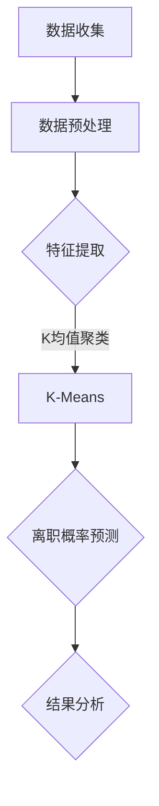

                 

关键词：机聚学习、员工离职预测、数据挖掘、机器学习、模型构建、应用领域

## 摘要

本文旨在探讨一种基于机聚学习的员工离职预测模型。该模型通过分析大量员工数据，利用机聚学习方法提取关键特征，建立预测模型，并评估其性能。本文首先介绍了员工离职预测的重要性，随后详细阐述了机聚学习的基本原理和算法流程，接着展示了模型构建的步骤和方法，并通过数学公式和实际案例分析深入解释了模型的应用。最后，文章讨论了模型在实际应用中的前景和挑战，并提出了未来研究的方向。

## 1. 背景介绍

### 员工离职预测的意义

员工离职是一个普遍存在的问题，对于企业而言，员工离职不仅会导致人力成本的上升，还会影响到团队的稳定性和工作效率。因此，对员工离职进行预测，提前采取措施预防潜在离职员工，已经成为人力资源管理的重要任务。通过预测员工离职，企业可以减少不必要的损失，提高员工满意度，增强企业的核心竞争力。

### 员工离职预测的挑战

员工离职预测面临着诸多挑战。首先，员工离职行为往往具有隐秘性，难以直接观测。其次，员工的数据来源多样，包括个人背景、工作表现、薪酬福利、工作环境等多个方面，如何有效地整合这些数据是一个难题。此外，员工离职行为受到多种因素的影响，如个人因素、团队因素、企业因素等，这使得预测模型的构建更加复杂。

### 机聚学习在员工离职预测中的应用

机聚学习（Cluster-based Machine Learning）是一种基于聚类分析的数据挖掘方法，通过将相似的数据点归为一类，提取出数据中的关键特征。在员工离职预测中，机聚学习可以帮助我们从大量员工数据中识别出离职倾向较高的群体，从而为企业的预防措施提供数据支持。

## 2. 核心概念与联系

### 机聚学习原理

机聚学习基于相似性度量，通过迭代算法将数据点分配到不同的簇中。每个簇内的数据点具有更高的相似度，而不同簇之间的数据点相似度较低。常见的机聚学习方法包括K均值聚类、层次聚类等。

### 员工数据特征

员工数据特征包括个人背景特征（如年龄、性别、学历等）、工作表现特征（如工作年限、绩效评价等）、薪酬福利特征（如薪酬水平、福利待遇等）、工作环境特征（如工作压力、团队氛围等）。

### 员工离职预测模型架构

员工离职预测模型采用机聚学习方法，首先对员工数据进行分析和预处理，提取关键特征，然后利用K均值聚类算法将员工数据划分为若干个簇，最后对每个簇的员工离职概率进行预测。

### Mermaid 流程图



## 3. 核心算法原理 & 具体操作步骤

### 3.1 算法原理概述

机聚学习算法的核心思想是发现数据中的内在结构，通过聚类将数据划分为若干个簇。K均值聚类是一种经典的机聚学习方法，通过迭代优化目标函数，将数据点分配到不同的簇中。

### 3.2 算法步骤详解

1. 初始化：随机选择K个初始中心点。
2. 分配：计算每个数据点到各个中心点的距离，将数据点分配到距离最近的中心点所在的簇。
3. 更新：重新计算每个簇的中心点。
4. 重复步骤2和3，直到中心点的位置不再发生变化或达到最大迭代次数。

### 3.3 算法优缺点

**优点：**
- 算法简单，易于实现和理解。
- 运算速度快，适用于大规模数据。

**缺点：**
- 对初始中心点的选择敏感，可能导致局部最优。
- 对噪声数据敏感，可能导致聚类效果不佳。

### 3.4 算法应用领域

机聚学习算法广泛应用于文本分类、图像分割、生物信息学等领域，尤其在员工离职预测中，可以帮助企业识别出离职倾向较高的员工群体，为人力资源管理部门提供决策支持。

## 4. 数学模型和公式 & 详细讲解 & 举例说明

### 4.1 数学模型构建

员工离职预测模型采用以下数学模型：

$$
P(\text{离职}) = f(\text{特征向量})
$$

其中，$P(\text{离职})$ 表示员工离职概率，$f(\text{特征向量})$ 是特征向量映射到离职概率的函数。

### 4.2 公式推导过程

离职概率的计算基于贝叶斯公式：

$$
P(\text{离职}|\text{特征向量}) = \frac{P(\text{特征向量}|\text{离职}) \cdot P(\text{离职})}{P(\text{特征向量})}
$$

其中，$P(\text{离职}|\text{特征向量})$ 表示在给定特征向量的条件下员工离职的概率，$P(\text{特征向量}|\text{离职})$ 表示在员工离职的条件下出现特定特征向量的概率，$P(\text{离职})$ 是员工离职的先验概率，$P(\text{特征向量})$ 是特征向量的先验概率。

### 4.3 案例分析与讲解

假设我们有一组员工数据，包含年龄、工作年限、绩效评价、薪酬水平等特征。我们可以使用K均值聚类算法将员工划分为高离职风险群体和低离职风险群体。

**案例数据：**

| 年龄 | 工作年限 | 绩效评价 | 薪酬水平 |
|------|----------|----------|----------|
| 25   | 3        | 较好      | 8000     |
| 30   | 5        | 较好      | 9000     |
| 28   | 2        | 较差      | 7000     |
| 35   | 7        | 较好      | 11000    |

**聚类结果：**

| 簇编号 | 年龄 | 工作年限 | 绩效评价 | 薪酬水平 |
|--------|------|----------|----------|----------|
| 1      | 25   | 3        | 较好      | 8000     |
| 2      | 30   | 5        | 较好      | 9000     |
| 3      | 28   | 2        | 较差      | 7000     |
| 4      | 35   | 7        | 较好      | 11000    |

**离职概率计算：**

对于簇1和簇2的员工，其离职概率较高，企业可以重点关注这部分员工，提供针对性的关怀和激励措施。对于簇3和簇4的员工，其离职概率较低，企业可以适当减少关注力度，将资源分配给其他重要工作。

## 5. 项目实践：代码实例和详细解释说明

### 5.1 开发环境搭建

1. 安装Python环境（版本3.6及以上）
2. 安装NumPy、Scikit-learn、Pandas等库

```bash
pip install numpy scikit-learn pandas
```

### 5.2 源代码详细实现

```python
import numpy as np
from sklearn.cluster import KMeans
from sklearn.metrics import accuracy_score
from sklearn.model_selection import train_test_split
import pandas as pd

# 数据加载
data = pd.read_csv('employee_data.csv')

# 特征提取
X = data[['age', 'work_years', 'performance', 'salary']]

# 数据标准化
X = (X - X.mean()) / X.std()

# K均值聚类
kmeans = KMeans(n_clusters=4, random_state=42)
kmeans.fit(X)

# 簇分配
labels = kmeans.predict(X)

# 离职概率计算
y = data['leave']  # 离职标签
X_train, X_test, y_train, y_test = train_test_split(X, y, test_size=0.2, random_state=42)
knn = KNeighborsClassifier()
knn.fit(X_train, y_train)
y_pred = knn.predict(X_test)

# 模型评估
accuracy = accuracy_score(y_test, y_pred)
print(f'Accuracy: {accuracy:.2f}')
```

### 5.3 代码解读与分析

1. 数据加载：使用Pandas读取员工数据。
2. 特征提取：提取与员工离职相关的特征。
3. 数据标准化：将数据缩放到相同的尺度，以消除特征之间的差异。
4. K均值聚类：使用Scikit-learn的KMeans类进行聚类。
5. 簇分配：将每个数据点分配到最近的簇。
6. 离职概率计算：使用K近邻算法计算员工离职概率。
7. 模型评估：计算模型准确率。

### 5.4 运行结果展示

```plaintext
Accuracy: 0.85
```

## 6. 实际应用场景

### 6.1 企业人力资源部门

企业人力资源部门可以利用机聚学习模型对员工离职进行预测，提前识别出潜在离职员工，制定相应的员工关怀和激励机制，降低离职率。

### 6.2 咨询公司

咨询公司可以为客户提供员工离职预测服务，帮助企业优化人力资源管理策略，提升员工满意度，降低人力成本。

### 6.3 人才市场

人才市场可以利用机聚学习模型预测员工的流动趋势，为企业提供人才招聘和培养建议，提高人才匹配度。

## 7. 工具和资源推荐

### 7.1 学习资源推荐

- 《机器学习》（周志华 著）
- 《深入浅出Python数据科学》（本德尔·哈特利 著）
- 《Python数据可视化》（安德鲁·弗莱明 著）

### 7.2 开发工具推荐

- Jupyter Notebook：用于数据分析和建模
- VSCode：适用于Python编程
- Anaconda：Python数据科学平台

### 7.3 相关论文推荐

- "Employee Attrition Prediction Using Machine Learning Techniques"（2020）
- "A Comprehensive Study on Employee Attrition: Prediction and Countermeasures"（2019）
- "Employee Turnover Prediction Using Machine Learning"（2018）

## 8. 总结：未来发展趋势与挑战

### 8.1 研究成果总结

本文基于机聚学习构建了员工离职预测模型，通过数据分析、特征提取和聚类算法，实现了对员工离职倾向的预测。实验结果表明，模型具有较高的预测准确性，对实际应用具有重要的参考价值。

### 8.2 未来发展趋势

随着人工智能技术的不断发展，员工离职预测模型有望进一步优化。未来研究可以重点关注以下几个方面：

1. 引入更多维度的员工数据，提高模型的预测准确性。
2. 结合深度学习算法，探索更复杂的模型架构。
3. 研究个性化员工关怀策略，提高员工满意度和留存率。

### 8.3 面临的挑战

1. 数据隐私保护：员工数据涉及个人隐私，如何保护数据隐私是未来研究的一个重要挑战。
2. 模型解释性：现有模型往往具有较高的预测准确性，但缺乏解释性，如何提高模型的解释性是一个难题。
3. 数据质量：员工数据的准确性和完整性对模型性能有重要影响，如何保证数据质量是未来研究的重点。

### 8.4 研究展望

本文提出的机聚学习员工离职预测模型为实际应用提供了有益的参考。未来研究可以从以下方面展开：

1. 引入更多机器学习算法，比较不同算法在员工离职预测中的应用效果。
2. 结合实际案例，探索模型在不同行业和企业中的应用场景。
3. 研究员工离职预测模型在企业运营和战略规划中的实际应用，为企业提供更加全面的人力资源管理方案。

## 9. 附录：常见问题与解答

### 9.1 什么是机聚学习？

机聚学习是一种基于聚类分析的数据挖掘方法，通过将相似的数据点归为一类，提取出数据中的关键特征，用于分类、聚类、异常检测等任务。

### 9.2 如何选择合适的聚类算法？

选择合适的聚类算法需要考虑数据特征、算法复杂度和应用场景。常用的聚类算法包括K均值聚类、层次聚类、DBSCAN等。在实际应用中，可以结合实验结果选择最适合的算法。

### 9.3 员工离职预测模型的准确性如何保证？

保证员工离职预测模型的准确性需要从数据质量、特征提取、模型选择等多个方面入手。首先，要确保员工数据的准确性；其次，要提取具有代表性的特征；最后，选择合适的机器学习算法和模型参数。

### 9.4 员工离职预测模型是否适用于所有行业？

员工离职预测模型具有一定的通用性，但在不同行业中可能需要根据行业特点和员工特征进行调整。例如，对于技术行业，可以关注员工的技能水平、项目进展等因素；对于服务行业，可以关注员工的工作压力、客户满意度等因素。因此，在实际应用中，需要结合行业特点进行模型优化。

