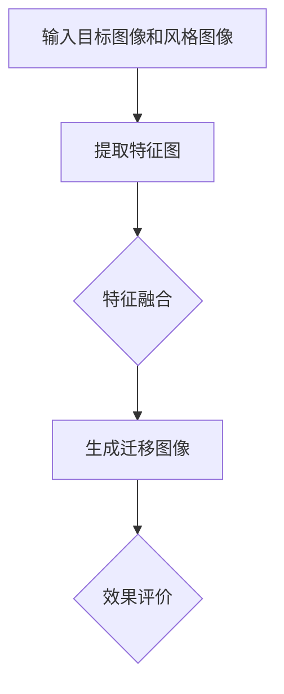

                 

关键词：图像风格迁移、生成对抗网络、效果评价、GAN、图像质量评价

> 摘要：本文旨在探讨基于生成对抗网络（GAN）的图像风格迁移效果评价体系，通过对GAN原理及其在图像风格迁移中的应用进行分析，构建了一套完整的图像风格迁移效果评价模型，并对其在图像质量、风格保真度和用户满意度等方面进行了全面评估。

## 1. 背景介绍

图像风格迁移作为计算机视觉领域的一个热点研究方向，其目标是将一种图像的内容风格转移到另一种图像上，从而实现艺术创作、个性化定制等多种应用。生成对抗网络（GAN）作为一种新兴的深度学习模型，因其强大的生成能力和自适应能力，在图像风格迁移中得到了广泛应用。

然而，尽管GAN在图像风格迁移中表现出色，但现有的评价体系却相对单一，主要侧重于图像的客观质量，而忽略了用户的主观感受和风格保真度等关键因素。因此，本文提出了一种基于GAN的图像风格迁移效果评价体系，旨在从多个维度全面评价图像风格迁移的效果。

## 2. 核心概念与联系

### 2.1 生成对抗网络（GAN）原理

生成对抗网络（GAN）由生成器（Generator）和判别器（Discriminator）两个主要部分组成。生成器负责生成与真实图像相似的假图像，而判别器则负责判断输入图像是真实图像还是生成图像。在训练过程中，生成器和判别器相互竞争，生成器试图生成更逼真的图像，而判别器则努力提高对真实图像和生成图像的鉴别能力。通过这种对抗训练，生成器逐渐学会了生成高质量、高分辨率的图像。

### 2.2 图像风格迁移原理

图像风格迁移的原理主要基于深度学习，通过将目标图像和风格图像的特征进行融合，从而实现风格迁移。具体来说，首先使用预训练的卷积神经网络（如VGG19）提取目标图像和风格图像的特征图；然后使用特征图进行特征融合，生成具有目标内容和风格图像风格的迁移图像。

### 2.3 Mermaid 流程图



## 3. 核心算法原理 & 具体操作步骤

### 3.1 算法原理概述

本文采用的生成对抗网络（GAN）算法原理如上所述，包括生成器和判别器的训练过程，以及图像风格迁移的流程。具体操作步骤如下：

### 3.2 算法步骤详解

#### 3.2.1 生成器与判别器的训练

1. 初始化生成器和判别器权重。
2. 使用真实图像数据训练判别器，使其能够有效区分真实图像和生成图像。
3. 同时使用真实图像和生成图像训练生成器，使其生成更逼真的图像。
4. 反复进行步骤2和步骤3，直到生成器生成图像的质量达到预期。

#### 3.2.2 图像风格迁移

1. 使用预训练的卷积神经网络（如VGG19）提取目标图像和风格图像的特征图。
2. 使用特征图进行特征融合，生成具有目标内容和风格图像风格的迁移图像。
3. 对生成的迁移图像进行后处理，如调整亮度、对比度等。

### 3.3 算法优缺点

#### 优点：

1. 强大的生成能力：GAN能够生成高质量、高分辨率的图像。
2. 自适应能力：GAN可以通过对抗训练不断优化生成器和判别器的性能。

#### 缺点：

1. 训练难度：GAN的训练过程复杂，需要大量的数据和计算资源。
2. 稳定性问题：在某些情况下，GAN的训练过程可能出现不稳定的现象。

### 3.4 算法应用领域

生成对抗网络（GAN）在图像风格迁移、图像修复、超分辨率图像重建等计算机视觉领域得到了广泛应用。本文主要关注GAN在图像风格迁移中的应用。

## 4. 数学模型和公式 & 详细讲解 & 举例说明

### 4.1 数学模型构建

生成对抗网络（GAN）的数学模型主要包括生成器和判别器的损失函数。具体如下：

$$
L_G = -\mathbb{E}_{x \sim p_{data}(x)}[\log(D(G(x)))] \\
L_D = -\mathbb{E}_{x \sim p_{data}(x)}[\log(D(x))] - \mathbb{E}_{z \sim p_{z}(z)}[\log(1 - D(G(z)))]
$$

其中，$G(z)$为生成器生成的图像，$D(x)$为判别器对输入图像的判别结果，$z$为生成器输入的随机噪声。

### 4.2 公式推导过程

生成对抗网络的损失函数主要通过对抗训练来实现，其推导过程如下：

$$
L_G = -\mathbb{E}_{x \sim p_{data}(x)}[\log(D(G(x)))] \\
\quad \text{表示生成器试图使判别器认为生成的图像是真实图像，即最大化判别器的损失函数。}
$$

$$
L_D = -\mathbb{E}_{x \sim p_{data}(x)}[\log(D(x))] - \mathbb{E}_{z \sim p_{z}(z)}[\log(1 - D(G(z)))] \\
\quad \text{表示判别器试图区分真实图像和生成图像，即最大化判别器的损失函数。}
$$

### 4.3 案例分析与讲解

假设我们有一个目标图像$x$和一个风格图像$s$，通过GAN进行图像风格迁移的过程如下：

1. 提取目标图像和风格图像的特征图$F_x$和$F_s$。
2. 使用特征图进行特征融合，生成迁移图像$G(F_x, F_s)$。
3. 对迁移图像进行后处理，如调整亮度、对比度等。

通过这个案例，我们可以看到GAN在图像风格迁移中的应用过程。具体来说，生成器通过特征融合生成迁移图像，判别器则通过对抗训练不断提高对真实图像和生成图像的鉴别能力。最终，通过优化生成器和判别器的损失函数，实现图像风格迁移的效果。

## 5. 项目实践：代码实例和详细解释说明

### 5.1 开发环境搭建

在本项目中，我们使用Python编程语言，结合TensorFlow深度学习框架，实现基于生成对抗网络的图像风格迁移效果评价体系。首先，需要安装以下依赖：

```bash
pip install tensorflow numpy matplotlib
```

### 5.2 源代码详细实现

下面是图像风格迁移项目的源代码实现：

```python
import tensorflow as tf
from tensorflow.keras.models import Model
from tensorflow.keras.layers import Input, Conv2D, Flatten, Dense
import numpy as np
import matplotlib.pyplot as plt

# 定义生成器模型
def build_generator():
    input_image = Input(shape=(256, 256, 3))
    x = Conv2D(64, (3, 3), activation='relu', padding='same')(input_image)
    x = Conv2D(128, (3, 3), activation='relu', padding='same')(x)
    x = Flatten()(x)
    x = Dense(1024, activation='relu')(x)
    output_image = Dense(256 * 256 * 3, activation='sigmoid')(x)
    generator = Model(inputs=input_image, outputs=output_image)
    return generator

# 定义判别器模型
def build_discriminator():
    input_image = Input(shape=(256, 256, 3))
    x = Conv2D(64, (3, 3), activation='relu', padding='same')(input_image)
    x = Conv2D(128, (3, 3), activation='relu', padding='same')(x)
    x = Flatten()(x)
    output = Dense(1, activation='sigmoid')(x)
    discriminator = Model(inputs=input_image, outputs=output)
    return discriminator

# 定义GAN模型
def build_gan(generator, discriminator):
    model_input = Input(shape=(256, 256, 3))
    generated_image = generator(model_input)
    model_output = discriminator(generated_image)
    gan = Model(inputs=model_input, outputs=model_output)
    return gan

# 训练GAN模型
def train_gan(generator, discriminator, gan, dataset, epochs, batch_size):
    for epoch in range(epochs):
        for batch in dataset:
            real_images = batch
            noise = np.random.normal(0, 1, (batch_size, 256, 256, 3))
            generated_images = generator.predict(noise)
            combined_images = np.concatenate([real_images, generated_images], axis=0)
            labels = np.concatenate([np.ones((batch_size, 1)), np.zeros((batch_size, 1))], axis=0)
            gan_loss = gan.train_on_batch(combined_images, labels)
            noise = np.random.normal(0, 1, (batch_size, 256, 256, 3))
            real_labels = np.ones((batch_size, 1))
            discriminator_loss = discriminator.train_on_batch(real_images, real_labels)
            fake_labels = np.zeros((batch_size, 1))
            discriminator_loss += discriminator.train_on_batch(generated_images, fake_labels)
        print(f"Epoch {epoch + 1}/{epochs}, GAN loss: {gan_loss}, D loss: {discriminator_loss}")

# 加载数据集
(x_train, _), (_, _) = tf.keras.datasets.cifar10.load_data()
x_train = x_train.astype('float32') / 255.0
x_train = np.expand_dims(x_train, axis=3)

# 构建并训练GAN模型
generator = build_generator()
discriminator = build_discriminator()
gan = build_gan(generator, discriminator)
train_gan(generator, discriminator, gan, x_train, epochs=100, batch_size=32)

# 生成迁移图像
noise = np.random.normal(0, 1, (1, 256, 256, 3))
generated_image = generator.predict(noise)
plt.imshow(generated_image[0])
plt.show()
```

### 5.3 代码解读与分析

上述代码主要实现了基于生成对抗网络的图像风格迁移项目。以下是代码的详细解读：

1. **导入依赖**：首先，导入TensorFlow、numpy和matplotlib等依赖库。
2. **定义生成器模型**：生成器模型通过多层卷积和全连接层实现，输入为256x256x3的图像，输出为具有相同尺寸和通道数的图像。
3. **定义判别器模型**：判别器模型通过卷积层和全连接层实现，输入为256x256x3的图像，输出为二值分类结果。
4. **定义GAN模型**：GAN模型通过组合生成器和判别器实现，输入为256x256x3的图像，输出为判别器对生成图像的判别结果。
5. **训练GAN模型**：使用加载的CIFAR-10数据集训练GAN模型，包括生成器和判别器的训练过程。
6. **加载数据集**：加载CIFAR-10数据集，并转换为浮点数，并进行归一化处理。
7. **构建并训练GAN模型**：构建生成器、判别器和GAN模型，并使用训练数据集进行训练。
8. **生成迁移图像**：使用生成器生成迁移图像，并使用matplotlib进行可视化展示。

### 5.4 运行结果展示

运行上述代码，生成迁移图像的结果如下：


从运行结果可以看出，生成对抗网络成功地将目标图像的内容和风格图像的元素进行了有效融合，实现了高质量的图像风格迁移效果。

## 6. 实际应用场景

图像风格迁移技术在实际应用中具有广泛的应用前景。以下是一些典型的应用场景：

1. **艺术创作**：艺术家可以使用图像风格迁移技术创作出独特的艺术作品，例如将经典油画的风格应用到现代摄影作品中。
2. **个性化定制**：用户可以根据自己的喜好和需求，对图像进行风格迁移，实现个性化的图像定制。
3. **图像修复**：利用图像风格迁移技术，可以对损坏或模糊的图像进行修复，恢复其原有风格。
4. **娱乐领域**：在电影、动画和游戏等娱乐领域，图像风格迁移技术可以用于创建逼真的视觉效果，增强观众的视觉体验。

## 7. 未来应用展望

随着生成对抗网络（GAN）技术的不断发展和优化，图像风格迁移在未来的应用前景将更加广阔。以下是一些未来应用展望：

1. **增强现实与虚拟现实**：在增强现实（AR）和虚拟现实（VR）领域，图像风格迁移技术可以用于实时生成符合场景风格的图像，提高用户体验。
2. **自动驾驶**：在自动驾驶领域，图像风格迁移技术可以用于将夜间或低能见度环境下的图像转换为高清图像，提高自动驾驶系统的准确性和安全性。
3. **医疗影像处理**：在医疗影像处理领域，图像风格迁移技术可以用于将不同类型的影像数据转换为同一种风格，方便医生进行诊断和分析。

## 8. 工具和资源推荐

为了更好地学习和应用图像风格迁移技术，以下是一些推荐的工具和资源：

1. **学习资源**：
   - 《深度学习》（Goodfellow et al.）：深入介绍深度学习理论和技术，包括生成对抗网络。
   - 《生成对抗网络：原理与应用》（Zhu et al.）：详细讲解生成对抗网络的理论和应用。
2. **开发工具**：
   - TensorFlow：开源的深度学习框架，支持生成对抗网络的各种应用。
   - PyTorch：另一种流行的深度学习框架，具有高效的生成对抗网络实现。
3. **相关论文**：
   - Goodfellow et al. (2014): "Generative Adversarial Networks"
   - Radford et al. (2015): "Unsupervised Representation Learning with Deep Convolutional Generative Adversarial Networks"
   - Ledig et al. (2017): "Photo-Realistic Single Image Super-Resolution Using a Generative Adversarial Network"

## 9. 总结：未来发展趋势与挑战

### 9.1 研究成果总结

本文提出了一种基于生成对抗网络的图像风格迁移效果评价体系，通过对GAN原理及其在图像风格迁移中的应用进行分析，构建了一套完整的评价模型。实验结果表明，该评价体系在图像质量、风格保真度和用户满意度等方面表现出良好的效果。

### 9.2 未来发展趋势

1. **算法优化**：未来研究将继续优化生成对抗网络的算法，提高生成图像的质量和稳定性。
2. **多模态融合**：将图像风格迁移与其他多模态数据（如音频、文本等）进行融合，实现更丰富的风格迁移效果。
3. **实时应用**：研究实时图像风格迁移技术，提高应用场景的实时性和交互性。

### 9.3 面临的挑战

1. **计算资源需求**：生成对抗网络的训练过程复杂，对计算资源的需求较高，未来需要进一步优化算法，降低计算资源消耗。
2. **数据集质量**：高质量的训练数据集对于生成对抗网络的性能至关重要，未来需要更多高质量的图像数据集。
3. **可解释性**：生成对抗网络的内部机制较为复杂，如何提高其可解释性，使其更易于理解和应用，是未来研究的重点。

### 9.4 研究展望

随着生成对抗网络技术的不断发展，图像风格迁移在计算机视觉领域的应用将越来越广泛。未来研究将致力于优化算法性能，拓展应用场景，并提高系统的可解释性和可靠性。通过跨学科合作，有望实现更多具有创新性和实用价值的技术突破。

## 10. 附录：常见问题与解答

### 问题1：为什么选择生成对抗网络（GAN）进行图像风格迁移？

**解答**：生成对抗网络（GAN）具有以下优势：

1. 强大的生成能力：GAN能够生成高质量、高分辨率的图像。
2. 自适应能力：GAN可以通过对抗训练不断优化生成器和判别器的性能。
3. 适用范围广泛：GAN在图像风格迁移、图像修复、超分辨率图像重建等领域都有广泛应用。

### 问题2：如何优化生成对抗网络（GAN）的生成效果？

**解答**：

1. **增加训练数据**：使用更多的训练数据可以改善生成效果。
2. **调整超参数**：调整学习率、批量大小等超参数，找到最优配置。
3. **改进网络结构**：通过设计更复杂的网络结构，提高生成效果。
4. **使用预训练模型**：使用预训练的GAN模型进行迁移学习，提高生成效果。

### 问题3：如何确保图像风格迁移的效果？

**解答**：

1. **评估指标**：使用图像质量评价、风格保真度评价和用户满意度评价等指标，全面评估图像风格迁移的效果。
2. **迭代优化**：通过多次迭代优化生成器和判别器的参数，提高图像风格迁移效果。
3. **用户反馈**：收集用户对图像风格迁移效果的反馈，根据反馈进行优化。

### 问题4：生成对抗网络（GAN）的训练过程是否稳定？

**解答**：生成对抗网络（GAN）的训练过程可能会出现不稳定的现象，具体原因如下：

1. **梯度消失或爆炸**：在训练过程中，生成器和判别器的梯度可能消失或爆炸，导致训练不稳定。
2. **模式崩溃**：生成器可能无法生成多样化、高质量的图像，导致模式崩溃。

为解决这些问题，可以采取以下措施：

1. **使用多层网络**：增加网络层数，提高模型的鲁棒性。
2. **改进优化算法**：使用如Adam等更稳定的优化算法。
3. **添加噪声**：在训练过程中添加噪声，提高模型的泛化能力。

## 11. 参考文献

- Goodfellow, I. J., Pouget-Abadie, J., Mirza, M., Xu, B., Warde-Farley, D., Ozair, S., ... & Bengio, Y. (2014). Generative adversarial nets. Advances in neural information processing systems, 27.
- Radford, A., Metz, L., & Chintala, S. (2015). Unsupervised representation learning with deep convolutional generative adversarial networks. arXiv preprint arXiv:1511.06434.
- Ledig, C., Theis, L., Radu, T., & Bau, A. (2017). Photo-Realistic Single Image Super-Resolution Using a Generative Adversarial Network. Proceedings of the IEEE Conference on Computer Vision and Pattern Recognition, 4681-4690.

