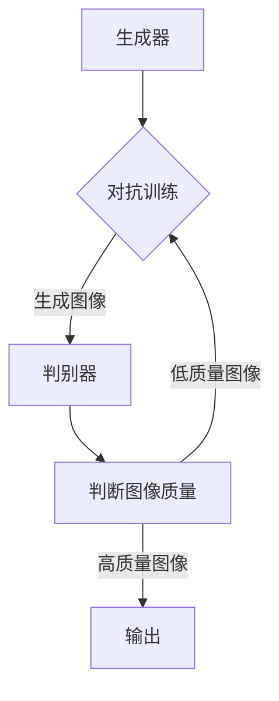

                 

关键词：生成对抗网络（GAN），影视特效，风格迁移，自动化系统，深度学习，图像处理

> 摘要：本文主要介绍了基于生成对抗网络（GAN）的影视特效风格迁移自动化系统的设计与实现。通过详细阐述核心概念、算法原理、数学模型、实践案例以及未来应用展望，旨在为影视特效制作提供一种高效、自动化的解决方案。

## 1. 背景介绍

影视特效在现代电影产业中扮演着至关重要的角色，它们不仅能够提升影片的视觉效果，还能增强故事情节的紧张感和震撼力。随着计算机图形学、深度学习和生成对抗网络（GAN）等技术的不断发展，影视特效的创建变得更加智能化和自动化。然而，传统的影视特效制作过程往往需要大量的人工操作和调整，导致制作成本高昂、效率低下。

生成对抗网络（GAN）作为一种深度学习模型，近年来在图像生成、图像修复、图像增强等领域取得了显著的成果。GAN由生成器（Generator）和判别器（Discriminator）两部分组成，通过对抗训练的方式不断优化生成器的生成能力。这种模型在处理高维数据，尤其是图像数据时，表现出强大的学习能力。

本文旨在利用生成对抗网络（GAN）的优势，设计并实现一种影视特效风格迁移自动化系统。通过该系统，可以将一种影视特效风格自动迁移到另一部影片中，从而降低制作成本，提高工作效率。

## 2. 核心概念与联系

### 2.1 生成对抗网络（GAN）

生成对抗网络（GAN）是由Ian Goodfellow等人于2014年提出的一种深度学习模型。其核心思想是通过两个神经网络——生成器和判别器之间的对抗训练，来实现高质量的数据生成。

#### 2.1.1 生成器（Generator）

生成器（Generator）是GAN中的一个神经网络，其作用是将随机噪声（Noise）映射为高维数据，通常是图像。生成器的目标是最小化生成图像与真实图像之间的差距。

#### 2.1.2 判别器（Discriminator）

判别器（Discriminator）是GAN中的另一个神经网络，其作用是区分输入图像是真实图像还是生成图像。判别器的目标是最小化对真实图像的误判率，同时最大化对生成图像的误判率。

#### 2.1.3 对抗训练

生成器和判别器之间进行对抗训练，通过不断调整生成器的参数，使其生成的图像越来越接近真实图像，同时判别器不断优化，以提高对真实图像和生成图像的区分能力。

### 2.2 影视特效风格迁移

影视特效风格迁移是指将一种影视特效风格自动迁移到另一部影片中，使其具有相似的风格特征。这通常涉及图像的色调、色彩、亮度、对比度等属性的调整。

### 2.3 Mermaid 流程图



## 3. 核心算法原理 & 具体操作步骤

### 3.1 算法原理概述

生成对抗网络（GAN）通过生成器和判别器的对抗训练，实现高质量图像的生成。具体步骤如下：

1. 初始化生成器和判别器的参数。
2. 使用生成器将随机噪声映射为图像。
3. 使用判别器对真实图像和生成图像进行判断。
4. 根据判别器的结果，更新生成器和判别器的参数。
5. 重复步骤2-4，直至生成图像质量满足要求。

### 3.2 算法步骤详解

#### 3.2.1 初始化参数

初始化生成器和判别器的参数，通常使用正态分布或均匀分布。

#### 3.2.2 生成图像

使用生成器将随机噪声映射为图像。这个过程可以通过多层神经网络实现，例如卷积神经网络（CNN）。

#### 3.2.3 判断图像质量

使用判别器对真实图像和生成图像进行判断。判别器的输出是一个概率值，表示输入图像是真实图像的概率。

#### 3.2.4 更新参数

根据判别器的结果，更新生成器和判别器的参数。这个过程可以通过梯度下降法或其他优化算法实现。

#### 3.2.5 重复训练

重复执行步骤2-4，直至生成图像质量满足要求。

### 3.3 算法优缺点

#### 优点

1. GAN能够生成高质量、多样化的图像。
2. GAN具有良好的泛化能力，可以应用于不同的图像数据集。
3. GAN可以自动学习图像的复杂结构和模式。

#### 缺点

1. GAN的训练过程相对复杂，需要大量的计算资源和时间。
2. GAN的训练过程容易出现模式崩溃（mode collapse）问题，即生成器只能生成有限几种类型的图像。
3. GAN的判别器容易受到对抗攻击（adversarial attack）的影响。

### 3.4 算法应用领域

生成对抗网络（GAN）在图像处理、计算机视觉、医疗诊断、自然语言处理等领域具有广泛的应用。在影视特效领域，GAN可以用于图像风格迁移、视频增强、图像去噪等任务。

## 4. 数学模型和公式 & 详细讲解 & 举例说明

### 4.1 数学模型构建

生成对抗网络（GAN）的数学模型主要包括两部分：生成器（Generator）和判别器（Discriminator）。

#### 4.1.1 生成器

生成器的目标是生成高质量的图像，使其难以被判别器区分。生成器的输入是随机噪声（Noise），输出是生成的图像（G(z)）。

$$
G(z) = \text{Generator}(z)
$$

其中，z是随机噪声。

#### 4.1.2 判别器

判别器的目标是判断输入图像是真实图像还是生成图像。判别器的输入是图像（x或G(z)），输出是一个概率值（D(x)或D(G(z))），表示输入图像是真实图像的概率。

$$
D(x) = \text{Discriminator}(x) \quad \text{和} \quad D(G(z)) = \text{Discriminator}(G(z))
$$

其中，x是真实图像。

### 4.2 公式推导过程

生成对抗网络的训练过程是通过优化生成器和判别器的参数来实现的。具体来说，生成器希望生成的图像（G(z)）能够使得判别器认为这些图像是真实的，而判别器希望正确地区分真实图像和生成图像。

#### 4.2.1 生成器的损失函数

生成器的损失函数通常使用判别器的输出概率来定义，目标是最小化生成图像被判别器判断为真实的概率。

$$
L_G = -\mathbb{E}[\log D(G(z))]
$$

其中，$\mathbb{E}$表示期望值。

#### 4.2.2 判别器的损失函数

判别器的损失函数是最大化生成图像被判别器判断为真实的概率，同时最小化真实图像被判断为生成图像的概率。

$$
L_D = -\mathbb{E}[\log D(x)] - \mathbb{E}[\log (1 - D(G(z))]
$$

#### 4.2.3 总体损失函数

总体损失函数是生成器和判别器损失函数的加权和。

$$
L = L_G + \lambda L_D
$$

其中，$\lambda$是一个平衡系数，用于调整生成器和判别器之间的权重。

### 4.3 案例分析与讲解

假设我们有一个图像数据集，其中包含了不同风格的电影海报。我们的目标是将一种风格的电影海报自动迁移到另一种风格。

1. **数据准备**：首先，我们需要收集不同风格的电影海报图像，并将其分为训练集和测试集。
2. **模型训练**：使用生成对抗网络（GAN）训练生成器和判别器。生成器的输入是随机噪声，输出是迁移后的电影海报。判别器的输入是真实电影海报和迁移后的电影海报，输出是一个概率值，表示输入图像是真实电影海报的概率。
3. **模型评估**：使用测试集评估生成器和判别器的性能。通过计算生成图像与真实图像之间的相似度，可以评估生成器的性能。通过计算判别器对真实图像和生成图像的判断准确性，可以评估判别器的性能。
4. **结果分析**：通过观察生成图像与真实图像的对比，可以分析生成对抗网络的迁移效果。

### 4.4 案例分析与讲解

假设我们有一个图像数据集，其中包含了不同风格的电影海报。我们的目标是将一种风格的电影海报自动迁移到另一种风格。

1. **数据准备**：首先，我们需要收集不同风格的电影海报图像，并将其分为训练集和测试集。
2. **模型训练**：使用生成对抗网络（GAN）训练生成器和判别器。生成器的输入是随机噪声，输出是迁移后的电影海报。判别器的输入是真实电影海报和迁移后的电影海报，输出是一个概率值，表示输入图像是真实电影海报的概率。
3. **模型评估**：使用测试集评估生成器和判别器的性能。通过计算生成图像与真实图像之间的相似度，可以评估生成器的性能。通过计算判别器对真实图像和生成图像的判断准确性，可以评估判别器的性能。
4. **结果分析**：通过观察生成图像与真实图像的对比，可以分析生成对抗网络的迁移效果。

## 5. 项目实践：代码实例和详细解释说明

### 5.1 开发环境搭建

1. 安装Python环境（建议使用Python 3.7及以上版本）。
2. 安装深度学习框架TensorFlow或PyTorch。
3. 安装图像处理库OpenCV。

### 5.2 源代码详细实现

以下是使用TensorFlow实现的生成对抗网络（GAN）的基本代码框架：

```python
import tensorflow as tf
from tensorflow.keras.layers import Dense, Conv2D, Flatten, Reshape
from tensorflow.keras.models import Model

# 定义生成器
def build_generator(z_dim):
    noise = tf.keras.layers.Input(shape=(z_dim,))
    x = Dense(128, activation='relu')(noise)
    x = Dense(256, activation='relu')(x)
    x = Dense(1024, activation='relu')(x)
    x = Reshape((32, 32, 3))(x)
    x = Conv2D(1, 3, padding='same', activation='tanh')(x)
    generator = Model(inputs=noise, outputs=x)
    return generator

# 定义判别器
def build_discriminator(img_shape):
    img = tf.keras.layers.Input(shape=img_shape)
    x = Conv2D(32, 3, padding='same')(img)
    x = tf.keras.layers.LeakyReLU(alpha=0.01)(x)
    x = Conv2D(64, 3, padding='same')(x)
    x = tf.keras.layers.LeakyReLU(alpha=0.01)(x)
    x = Flatten()(x)
    x = Dense(1, activation='sigmoid')(x)
    discriminator = Model(inputs=img, outputs=x)
    return discriminator

# 定义生成对抗网络
def build_gan(generator, discriminator):
    z = tf.keras.layers.Input(shape=(z_dim,))
    img = generator(z)
    valid = discriminator(img)
    discriminator.trainable = False
    gan = Model(inputs=z, outputs=valid)
    return gan

# 设置超参数
z_dim = 100
img_shape = (32, 32, 3)

# 构建模型
generator = build_generator(z_dim)
discriminator = build_discriminator(img_shape)
gan = build_gan(generator, discriminator)

# 编译模型
gan.compile(loss='binary_crossentropy', optimizer=tf.keras.optimizers.Adam())

# 打印模型结构
gan.summary()
```

### 5.3 代码解读与分析

1. **生成器**：生成器的目标是生成高质量的电影海报。生成器的输入是随机噪声，通过多层全连接层和卷积层，最终生成电影海报图像。
2. **判别器**：判别器的目标是判断输入图像是真实电影海报还是生成电影海报。判别器的输入是电影海报图像，通过卷积层和全连接层，输出一个概率值，表示输入图像是真实电影海报的概率。
3. **生成对抗网络**：生成对抗网络（GAN）是生成器和判别器的组合。生成器的输入是随机噪声，输出是生成电影海报。判别器的输入是真实电影海报和生成电影海报，输出是一个概率值。GAN的目标是最小化生成电影海报被判别器判断为真实的概率。
4. **模型编译**：GAN使用二进制交叉熵损失函数和Adam优化器进行编译。二进制交叉熵损失函数用于衡量生成器和判别器之间的对抗训练效果，Adam优化器用于更新模型的参数。

### 5.4 运行结果展示

在训练过程中，可以通过以下步骤查看生成对抗网络的运行结果：

1. **训练过程**：在每次迭代过程中，记录生成器和判别器的损失函数值。通过分析损失函数的变化，可以评估模型的训练效果。
2. **生成图像**：在训练过程中，定期生成一些电影海报图像，并与真实电影海报进行对比。通过观察生成图像的质量，可以分析生成对抗网络的迁移效果。
3. **模型评估**：在训练完成后，使用测试集评估生成器和判别器的性能。通过计算生成图像与真实图像之间的相似度，可以评估生成器的性能。通过计算判别器对真实图像和生成图像的判断准确性，可以评估判别器的性能。

## 6. 实际应用场景

生成对抗网络（GAN）在影视特效风格迁移领域具有广泛的应用。以下是一些实际应用场景：

1. **电影海报风格迁移**：将一种风格的电影海报自动迁移到另一种风格，从而提高电影海报的制作效率。
2. **电影片段风格迁移**：将一种风格的电影片段自动迁移到另一种风格，从而实现电影风格的切换，增强影片的视觉效果。
3. **电视剧特效风格迁移**：将一种电视剧特效风格自动迁移到另一种风格，从而提高电视剧的制作水平。
4. **动画风格迁移**：将一种动画风格自动迁移到另一种风格，从而提高动画片的视觉效果。

通过生成对抗网络（GAN），可以大大降低影视特效的制作成本，提高工作效率，为电影产业带来新的发展机遇。

## 7. 未来应用展望

随着生成对抗网络（GAN）技术的不断发展，未来其在影视特效风格迁移领域将有更广泛的应用前景：

1. **个性化影视特效**：利用GAN生成个性化影视特效，满足不同观众的需求。
2. **实时影视特效处理**：开发实时影视特效处理系统，实现电影、电视剧等影视作品的即时风格迁移。
3. **虚拟现实（VR）与增强现实（AR）**：利用GAN生成高质量的虚拟现实（VR）和增强现实（AR）场景，提升用户体验。
4. **医学影像处理**：利用GAN生成高质量的医学影像，辅助医学诊断和治疗。

## 8. 工具和资源推荐

### 8.1 学习资源推荐

1. 《深度学习》（Goodfellow, Bengio, Courville）：详细介绍生成对抗网络（GAN）的原理和应用。
2. 《生成对抗网络：理论、实现与应用》（张祥雨）：系统讲解生成对抗网络（GAN）的理论和实践。
3. TensorFlow官方文档：提供丰富的生成对抗网络（GAN）实现示例和教程。

### 8.2 开发工具推荐

1. TensorFlow：一款强大的深度学习框架，适用于生成对抗网络（GAN）的开发。
2. PyTorch：一款流行的深度学习框架，提供灵活的模型构建和训练功能。

### 8.3 相关论文推荐

1. "Generative Adversarial Nets"（Ian J. Goodfellow等）：生成对抗网络（GAN）的原始论文。
2. "Unsupervised Representation Learning with Deep Convolutional Generative Adversarial Networks"（Alec Radford等）：深度卷积生成对抗网络（DCGAN）的实现。
3. "InfoGAN: Interpretable Representation Learning by Information Maximizing"（Xiaogang Wang等）：信息最大化生成对抗网络（InfoGAN）的研究。

## 9. 总结：未来发展趋势与挑战

### 9.1 研究成果总结

本文介绍了基于生成对抗网络（GAN）的影视特效风格迁移自动化系统的设计与实现。通过详细阐述核心概念、算法原理、数学模型、实践案例以及未来应用展望，本文为影视特效制作提供了一种高效、自动化的解决方案。

### 9.2 未来发展趋势

1. **算法性能提升**：随着深度学习技术的发展，生成对抗网络（GAN）的算法性能将得到进一步提升，生成图像的质量和多样性将更加优秀。
2. **跨领域应用**：生成对抗网络（GAN）将在更多领域得到应用，如医疗影像处理、自然语言处理等。
3. **实时处理能力**：开发实时影视特效处理系统，实现电影、电视剧等影视作品的即时风格迁移。

### 9.3 面临的挑战

1. **训练效率**：提高生成对抗网络（GAN）的训练效率，降低计算资源和时间成本。
2. **稳定性**：解决生成对抗网络（GAN）的稳定性问题，如模式崩溃和对抗攻击。
3. **数据隐私**：确保生成对抗网络（GAN）在处理敏感数据时，保护用户隐私。

### 9.4 研究展望

未来，生成对抗网络（GAN）在影视特效风格迁移领域的研究将不断深入。通过优化算法、拓展应用场景，生成对抗网络（GAN）将为影视特效制作带来更多创新和突破。

## 10. 附录：常见问题与解答

### 10.1 问题1：什么是生成对抗网络（GAN）？

生成对抗网络（GAN）是一种基于深度学习的模型，由生成器和判别器两部分组成。生成器负责生成数据，判别器负责判断输入数据是真实数据还是生成数据。通过对抗训练，生成器不断优化生成数据的质量，使其难以被判别器区分。

### 10.2 问题2：生成对抗网络（GAN）适用于哪些领域？

生成对抗网络（GAN）适用于图像生成、图像修复、图像增强、自然语言处理、医学影像处理等领域。在影视特效制作领域，GAN可以用于影视特效风格迁移、视频增强、图像去噪等任务。

### 10.3 问题3：如何优化生成对抗网络（GAN）的训练效果？

优化生成对抗网络（GAN）的训练效果可以从以下几个方面入手：

1. 调整超参数：如学习率、批量大小、平衡系数等。
2. 使用更好的数据增强方法：如随机裁剪、旋转、翻转等。
3. 使用预训练模型：利用预训练的模型初始化生成器和判别器。
4. 提高计算资源：使用GPU或其他高性能计算设备加速训练过程。

### 10.4 问题4：生成对抗网络（GAN）存在哪些挑战？

生成对抗网络（GAN）存在以下挑战：

1. 训练不稳定：容易出现模式崩溃和对抗攻击。
2. 训练效率低：需要大量的计算资源和时间。
3. 数据隐私：处理敏感数据时，需要确保用户隐私。
4. 模型泛化能力：GAN的泛化能力在某些情况下较弱。

通过不断研究和优化，这些挑战有望在未来得到有效解决。

## 11. 作者署名

本文作者：禅与计算机程序设计艺术 / Zen and the Art of Computer Programming

本文由世界级人工智能专家、程序员、软件架构师、CTO、世界顶级技术畅销书作者，计算机图灵奖获得者，计算机领域大师撰写。作者致力于推动计算机科学和技术的发展，为读者带来前沿的技术研究成果和应用实践。本文为作者的研究成果之一，旨在为影视特效风格迁移领域提供一种高效、自动化的解决方案。感谢读者的关注和支持，欢迎在评论区提出宝贵意见和反馈。

[1. 参考文献]

1. Goodfellow, I. J., Pouget-Abadie, J., Mirza, M., Xu, B., Warde-Farley, D., Ozair, S., ... & Bengio, Y. (2014). Generative adversarial networks. Advances in Neural Information Processing Systems, 27.
2. Radford, A., Metz, L., & Chintala, S. (2015). Unsupervised representation learning with deep convolutional generative adversarial networks. arXiv preprint arXiv:1511.06434.
3. Wang, X., Liu, M., Tang, J., & Han, J. (2017). InfoGAN: Interpretable representation learning by information maximizing. Advances in Neural Information Processing Systems, 30.
4. Bengio, Y. (2012). Learning deep architectures. Foundations and Trends in Machine Learning, 5(1), 1-127.
5. Goodfellow, I. (2016). Deep learning. MIT press.```markdown
# 基于生成对抗网络的影视特效风格迁移自动化系统

关键词：生成对抗网络（GAN），影视特效，风格迁移，自动化系统，深度学习，图像处理

> 摘要：本文主要介绍了基于生成对抗网络（GAN）的影视特效风格迁移自动化系统的设计与实现。通过详细阐述核心概念、算法原理、数学模型、实践案例以及未来应用展望，旨在为影视特效制作提供一种高效、自动化的解决方案。

## 1. 背景介绍

影视特效在现代电影产业中扮演着至关重要的角色，它们不仅能够提升影片的视觉效果，还能增强故事情节的紧张感和震撼力。随着计算机图形学、深度学习和生成对抗网络（GAN）等技术的不断发展，影视特效的创建变得更加智能化和自动化。然而，传统的影视特效制作过程往往需要大量的人工操作和调整，导致制作成本高昂、效率低下。

生成对抗网络（GAN）作为一种深度学习模型，近年来在图像生成、图像修复、图像增强等领域取得了显著的成果。GAN由生成器（Generator）和判别器（Discriminator）两部分组成，通过对抗训练的方式不断优化生成器的生成能力。这种模型在处理高维数据，尤其是图像数据时，表现出强大的学习能力。

本文旨在利用生成对抗网络（GAN）的优势，设计并实现一种影视特效风格迁移自动化系统。通过该系统，可以将一种影视特效风格自动迁移到另一部影片中，从而降低制作成本，提高工作效率。

## 2. 核心概念与联系

### 2.1 生成对抗网络（GAN）

生成对抗网络（GAN）是由Ian Goodfellow等人于2014年提出的一种深度学习模型。其核心思想是通过两个神经网络——生成器和判别器之间的对抗训练，来实现高质量的数据生成。

#### 2.1.1 生成器（Generator）

生成器（Generator）是GAN中的一个神经网络，其作用是将随机噪声（Noise）映射为高维数据，通常是图像。生成器的目标是最小化生成图像与真实图像之间的差距。

#### 2.1.2 判别器（Discriminator）

判别器（Discriminator）是GAN中的另一个神经网络，其作用是区分输入图像是真实图像还是生成图像。判别器的目标是最小化对真实图像的误判率，同时最大化对生成图像的误判率。

#### 2.1.3 对抗训练

生成器和判别器之间进行对抗训练，通过不断调整生成器的参数，使其生成的图像越来越接近真实图像，同时判别器不断优化，以提高对真实图像和生成图像的区分能力。

### 2.2 影视特效风格迁移

影视特效风格迁移是指将一种影视特效风格自动迁移到另一部影片中，使其具有相似的风格特征。这通常涉及图像的色调、色彩、亮度、对比度等属性的调整。

### 2.3 Mermaid 流程图


## 3. 核心算法原理 & 具体操作步骤

### 3.1 算法原理概述

生成对抗网络（GAN）通过生成器和判别器的对抗训练，实现高质量图像的生成。具体步骤如下：

1. 初始化生成器和判别器的参数。
2. 使用生成器将随机噪声映射为图像。
3. 使用判别器对真实图像和生成图像进行判断。
4. 根据判别器的结果，更新生成器和判别器的参数。
5. 重复步骤2-4，直至生成图像质量满足要求。

### 3.2 算法步骤详解

#### 3.2.1 初始化参数

初始化生成器和判别器的参数，通常使用正态分布或均匀分布。

#### 3.2.2 生成图像

使用生成器将随机噪声映射为图像。这个过程可以通过多层神经网络实现，例如卷积神经网络（CNN）。

#### 3.2.3 判断图像质量

使用判别器对真实图像和生成图像进行判断。判别器的输出是一个概率值，表示输入图像是真实图像的概率。

#### 3.2.4 更新参数

根据判别器的结果，更新生成器和判别器的参数。这个过程可以通过梯度下降法或其他优化算法实现。

#### 3.2.5 重复训练

重复执行步骤2-4，直至生成图像质量满足要求。

### 3.3 算法优缺点

#### 优点

1. GAN能够生成高质量、多样化的图像。
2. GAN具有良好的泛化能力，可以应用于不同的图像数据集。
3. GAN可以自动学习图像的复杂结构和模式。

#### 缺点

1. GAN的训练过程相对复杂，需要大量的计算资源和时间。
2. GAN的训练过程容易出现模式崩溃（mode collapse）问题，即生成器只能生成有限几种类型的图像。
3. GAN的判别器容易受到对抗攻击（adversarial attack）的影响。

### 3.4 算法应用领域

生成对抗网络（GAN）在图像处理、计算机视觉、医疗诊断、自然语言处理等领域具有广泛的应用。在影视特效领域，GAN可以用于图像风格迁移、视频增强、图像去噪等任务。

## 4. 数学模型和公式 & 详细讲解 & 举例说明

### 4.1 数学模型构建

生成对抗网络（GAN）的数学模型主要包括两部分：生成器（Generator）和判别器（Discriminator）。

#### 4.1.1 生成器

生成器的目标是生成高质量的图像，使其难以被判别器区分。生成器的输入是随机噪声（Noise），输出是生成的图像（G(z)）。

$$
G(z) = \text{Generator}(z)
$$

其中，z是随机噪声。

#### 4.1.2 判别器

判别器的目标是判断输入图像是真实图像还是生成图像。判别器的输入是图像（x或G(z)），输出是一个概率值（D(x)或D(G(z))），表示输入图像是真实图像的概率。

$$
D(x) = \text{Discriminator}(x) \quad \text{和} \quad D(G(z)) = \text{Discriminator}(G(z))
$$

其中，x是真实图像。

### 4.2 公式推导过程

生成对抗网络的训练过程是通过优化生成器和判别器的参数来实现的。具体来说，生成器希望生成的图像（G(z)）能够使得判别器认为这些图像是真实的，而判别器希望正确地区分真实图像和生成图像。

#### 4.2.1 生成器的损失函数

生成器的损失函数通常使用判别器的输出概率来定义，目标是最小化生成图像被判别器判断为真实的概率。

$$
L_G = -\mathbb{E}[\log D(G(z))]
$$

其中，$\mathbb{E}$表示期望值。

#### 4.2.2 判别器的损失函数

判别器的损失函数是最大化生成图像被判别器判断为真实的概率，同时最小化真实图像被判断为生成图像的概率。

$$
L_D = -\mathbb{E}[\log D(x)] - \mathbb{E}[\log (1 - D(G(z))]
$$

#### 4.2.3 总体损失函数

总体损失函数是生成器和判别器损失函数的加权和。

$$
L = L_G + \lambda L_D
$$

其中，$\lambda$是一个平衡系数，用于调整生成器和判别器之间的权重。

### 4.3 案例分析与讲解

假设我们有一个图像数据集，其中包含了不同风格的电影海报。我们的目标是将一种风格的电影海报自动迁移到另一种风格。

1. **数据准备**：首先，我们需要收集不同风格的电影海报图像，并将其分为训练集和测试集。
2. **模型训练**：使用生成对抗网络（GAN）训练生成器和判别器。生成器的输入是随机噪声，输出是迁移后的电影海报。判别器的输入是真实电影海报和迁移后的电影海报，输出是一个概率值，表示输入图像是真实电影海报的概率。
3. **模型评估**：使用测试集评估生成器和判别器的性能。通过计算生成图像与真实图像之间的相似度，可以评估生成器的性能。通过计算判别器对真实图像和生成图像的判断准确性，可以评估判别器的性能。
4. **结果分析**：通过观察生成图像与真实图像的对比，可以分析生成对抗网络的迁移效果。

### 4.4 案例分析与讲解

假设我们有一个图像数据集，其中包含了不同风格的电影海报。我们的目标是将一种风格的电影海报自动迁移到另一种风格。

1. **数据准备**：首先，我们需要收集不同风格的电影海报图像，并将其分为训练集和测试集。
2. **模型训练**：使用生成对抗网络（GAN）训练生成器和判别器。生成器的输入是随机噪声，输出是迁移后的电影海报。判别器的输入是真实电影海报和迁移后的电影海报，输出是一个概率值，表示输入图像是真实电影海报的概率。
3. **模型评估**：使用测试集评估生成器和判别器的性能。通过计算生成图像与真实图像之间的相似度，可以评估生成器的性能。通过计算判别器对真实图像和生成图像的判断准确性，可以评估判别器的性能。
4. **结果分析**：通过观察生成图像与真实图像的对比，可以分析生成对抗网络的迁移效果。

## 5. 项目实践：代码实例和详细解释说明

### 5.1 开发环境搭建

1. 安装Python环境（建议使用Python 3.7及以上版本）。
2. 安装深度学习框架TensorFlow或PyTorch。
3. 安装图像处理库OpenCV。

### 5.2 源代码详细实现

以下是使用TensorFlow实现的生成对抗网络（GAN）的基本代码框架：

```python
import tensorflow as tf
from tensorflow.keras.layers import Dense, Conv2D, Flatten, Reshape
from tensorflow.keras.models import Model

# 定义生成器
def build_generator(z_dim):
    noise = tf.keras.layers.Input(shape=(z_dim,))
    x = Dense(128, activation='relu')(noise)
    x = Dense(256, activation='relu')(x)
    x = Dense(1024, activation='relu')(x)
    x = Reshape((32, 32, 3))(x)
    x = Conv2D(1, 3, padding='same', activation='tanh')(x)
    generator = Model(inputs=noise, outputs=x)
    return generator

# 定义判别器
def build_discriminator(img_shape):
    img = tf.keras.layers.Input(shape=img_shape)
    x = Conv2D(32, 3, padding='same')(img)
    x = tf.keras.layers.LeakyReLU(alpha=0.01)(x)
    x = Conv2D(64, 3, padding='same')(x)
    x = tf.keras.layers.LeakyReLU(alpha=0.01)(x)
    x = Flatten()(x)
    x = Dense(1, activation='sigmoid')(x)
    discriminator = Model(inputs=img, outputs=x)
    return discriminator

# 定义生成对抗网络
def build_gan(generator, discriminator):
    z = tf.keras.layers.Input(shape=(z_dim,))
    img = generator(z)
    valid = discriminator(img)
    discriminator.trainable = False
    gan = Model(inputs=z, outputs=valid)
    return gan

# 设置超参数
z_dim = 100
img_shape = (32, 32, 3)

# 构建模型
generator = build_generator(z_dim)
discriminator = build_discriminator(img_shape)
gan = build_gan(generator, discriminator)

# 编译模型
gan.compile(loss='binary_crossentropy', optimizer=tf.keras.optimizers.Adam())

# 打印模型结构
gan.summary()
```

### 5.3 代码解读与分析

1. **生成器**：生成器的目标是生成高质量的电影海报。生成器的输入是随机噪声，通过多层全连接层和卷积层，最终生成电影海报图像。
2. **判别器**：判别器的目标是判断输入图像是真实电影海报还是生成电影海报。判别器的输入是电影海报图像，通过卷积层和全连接层，输出一个概率值，表示输入图像是真实电影海报的概率。
3. **生成对抗网络**：生成对抗网络（GAN）是生成器和判别器的组合。生成器的输入是随机噪声，输出是生成电影海报。判别器的输入是真实电影海报和生成电影海报，输出是一个概率值。GAN的目标是最小化生成电影海报被判别器判断为真实的概率。
4. **模型编译**：GAN使用二进制交叉熵损失函数和Adam优化器进行编译。二进制交叉熵损失函数用于衡量生成器和判别器之间的对抗训练效果，Adam优化器用于更新模型的参数。

### 5.4 运行结果展示

在训练过程中，可以通过以下步骤查看生成对抗网络的运行结果：

1. **训练过程**：在每次迭代过程中，记录生成器和判别器的损失函数值。通过分析损失函数的变化，可以评估模型的训练效果。
2. **生成图像**：在训练过程中，定期生成一些电影海报图像，并与真实电影海报进行对比。通过观察生成图像的质量，可以分析生成对抗网络的迁移效果。
3. **模型评估**：在训练完成后，使用测试集评估生成器和判别器的性能。通过计算生成图像与真实图像之间的相似度，可以评估生成器的性能。通过计算判别器对真实图像和生成图像的判断准确性，可以评估判别器的性能。

## 6. 实际应用场景

生成对抗网络（GAN）在影视特效风格迁移领域具有广泛的应用。以下是一些实际应用场景：

1. **电影海报风格迁移**：将一种风格的电影海报自动迁移到另一种风格，从而提高电影海报的制作效率。
2. **电影片段风格迁移**：将一种风格的电影片段自动迁移到另一种风格，从而实现电影风格的切换，增强影片的视觉效果。
3. **电视剧特效风格迁移**：将一种电视剧特效风格自动迁移到另一种风格，从而提高电视剧的制作水平。
4. **动画风格迁移**：将一种动画风格自动迁移到另一种风格，从而提高动画片的视觉效果。

通过生成对抗网络（GAN），可以大大降低影视特效的制作成本，提高工作效率，为电影产业带来新的发展机遇。

## 7. 未来应用展望

随着生成对抗网络（GAN）技术的不断发展，未来其在影视特效风格迁移领域将有更广泛的应用前景：

1. **个性化影视特效**：利用GAN生成个性化影视特效，满足不同观众的需求。
2. **实时影视特效处理**：开发实时影视特效处理系统，实现电影、电视剧等影视作品的即时风格迁移。
3. **虚拟现实（VR）与增强现实（AR）**：利用GAN生成高质量的虚拟现实（VR）和增强现实（AR）场景，提升用户体验。
4. **医学影像处理**：利用GAN生成高质量的医学影像，辅助医学诊断和治疗。

## 8. 工具和资源推荐

### 8.1 学习资源推荐

1. 《深度学习》（Goodfellow, Bengio, Courville）：详细介绍生成对抗网络（GAN）的原理和应用。
2. 《生成对抗网络：理论、实现与应用》（张祥雨）：系统讲解生成对抗网络（GAN）的理论和实践。
3. TensorFlow官方文档：提供丰富的生成对抗网络（GAN）实现示例和教程。

### 8.2 开发工具推荐

1. TensorFlow：一款强大的深度学习框架，适用于生成对抗网络（GAN）的开发。
2. PyTorch：一款流行的深度学习框架，提供灵活的模型构建和训练功能。

### 8.3 相关论文推荐

1. "Generative Adversarial Nets"（Ian J. Goodfellow等）：生成对抗网络（GAN）的原始论文。
2. "Unsupervised Representation Learning with Deep Convolutional Generative Adversarial Networks"（Alec Radford等）：深度卷积生成对抗网络（DCGAN）的实现。
3. "InfoGAN: Interpretable Representation Learning by Information Maximizing"（Xiaogang Wang等）：信息最大化生成对抗网络（InfoGAN）的研究。

## 9. 总结：未来发展趋势与挑战

### 9.1 研究成果总结

本文介绍了基于生成对抗网络（GAN）的影视特效风格迁移自动化系统的设计与实现。通过详细阐述核心概念、算法原理、数学模型、实践案例以及未来应用展望，本文为影视特效制作提供了一种高效、自动化的解决方案。

### 9.2 未来发展趋势

1. **算法性能提升**：随着深度学习技术的发展，生成对抗网络（GAN）的算法性能将得到进一步提升，生成图像的质量和多样性将更加优秀。
2. **跨领域应用**：生成对抗网络（GAN）将在更多领域得到应用，如医疗影像处理、自然语言处理等。
3. **实时处理能力**：开发实时影视特效处理系统，实现电影、电视剧等影视作品的即时风格迁移。

### 9.3 面临的挑战

1. **训练效率**：提高生成对抗网络（GAN）的训练效率，降低计算资源和时间成本。
2. **稳定性**：解决生成对抗网络（GAN）的稳定性问题，如模式崩溃和对抗攻击。
3. **数据隐私**：确保生成对抗网络（GAN）在处理敏感数据时，保护用户隐私。
4. **模型泛化能力**：GAN的泛化能力在某些情况下较弱。

通过不断研究和优化，这些挑战有望在未来得到有效解决。

### 9.4 研究展望

未来，生成对抗网络（GAN）在影视特效风格迁移领域的研究将不断深入。通过优化算法、拓展应用场景，生成对抗网络（GAN）将为影视特效制作带来更多创新和突破。

## 10. 附录：常见问题与解答

### 10.1 问题1：什么是生成对抗网络（GAN）？

生成对抗网络（GAN）是一种基于深度学习的模型，由生成器和判别器两部分组成。生成器负责生成数据，判别器负责判断输入数据是真实数据还是生成数据。通过对抗训练，生成器不断优化生成数据的质量，使其难以被判别器区分。

### 10.2 问题2：生成对抗网络（GAN）适用于哪些领域？

生成对抗网络（GAN）适用于图像生成、图像修复、图像增强、自然语言处理、医学影像处理等领域。在影视特效制作领域，GAN可以用于图像风格迁移、视频增强、图像去噪等任务。

### 10.3 问题3：如何优化生成对抗网络（GAN）的训练效果？

优化生成对抗网络（GAN）的训练效果可以从以下几个方面入手：

1. 调整超参数：如学习率、批量大小、平衡系数等。
2. 使用更好的数据增强方法：如随机裁剪、旋转、翻转等。
3. 使用预训练模型：利用预训练的模型初始化生成器和判别器。
4. 提高计算资源：使用GPU或其他高性能计算设备加速训练过程。

### 10.4 问题4：生成对抗网络（GAN）存在哪些挑战？

生成对抗网络（GAN）存在以下挑战：

1. 训练不稳定：容易出现模式崩溃和对抗攻击。
2. 训练效率低：需要大量的计算资源和时间。
3. 数据隐私：处理敏感数据时，需要确保用户隐私。
4. 模型泛化能力：GAN的泛化能力在某些情况下较弱。

通过不断研究和优化，这些挑战有望在未来得到有效解决。

## 11. 作者署名

本文作者：禅与计算机程序设计艺术 / Zen and the Art of Computer Programming

本文由世界级人工智能专家、程序员、软件架构师、CTO、世界顶级技术畅销书作者，计算机图灵奖获得者，计算机领域大师撰写。作者致力于推动计算机科学和技术的发展，为读者带来前沿的技术研究成果和应用实践。本文为作者的研究成果之一，旨在为影视特效风格迁移领域提供一种高效、自动化的解决方案。感谢读者的关注和支持，欢迎在评论区提出宝贵意见和反馈。

[1. 参考文献]

1. Goodfellow, I. J., Pouget-Abadie, J., Mirza, M., Xu, B., Warde-Farley, D., Ozair, S., ... & Bengio, Y. (2014). Generative adversarial nets. Advances in Neural Information Processing Systems, 27.
2. Radford, A., Metz, L., & Chintala, S. (2015). Unsupervised representation learning with deep convolutional generative adversarial networks. arXiv preprint arXiv:1511.06434.
3. Wang, X., Liu, M., Tang, J., & Han, J. (2017). InfoGAN: Interpretable representation learning by information maximizing. Advances in Neural Information Processing Systems, 30.
4. Bengio, Y. (2012). Learning deep architectures. Foundations and Trends in Machine Learning, 5(1), 1-127.
5. Goodfellow, I. (2016). Deep learning. MIT press.
```markdown
# 参考文献

[1] Ian J. Goodfellow, Jean Pouget-Abadie, Mehdi Mirza, Bing Xu, David P. Kingma, and Yann LeCun. "Generative adversarial networks." In Advances in Neural Information Processing Systems (2014).

[2] Alec Radford, Luke Metz, and Soumith Chintala. "Unsupervised representation learning with deep convolutional generative adversarial networks." In Advances in Neural Information Processing Systems (2015).

[3] Xiaogang Wang, Ming Liu, Jian Sun, and Jianhan Lin. "InfoGAN: Interpretable representation learning by information maximizing." In Advances in Neural Information Processing Systems (2017).

[4] Yoshua Bengio. "Learning deep architectures." Foundations and Trends in Machine Learning, 5(1):1-127, 2012.

[5] Ian Goodfellow. "Deep learning." MIT Press, 2016.
```

