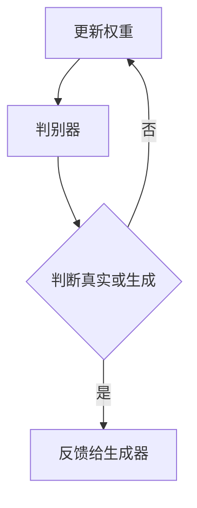
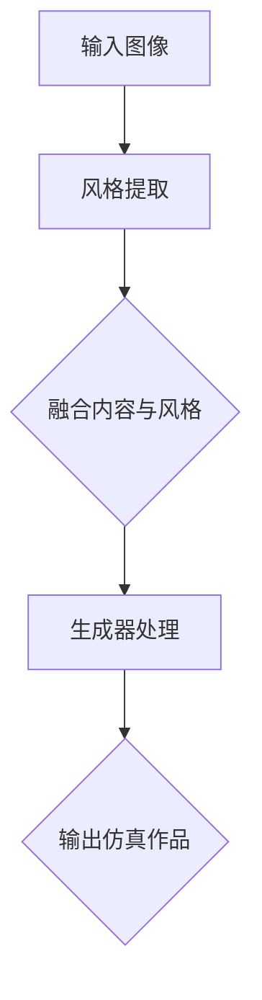

                 

关键词：生成对抗网络、艺术品仿真、风格迁移、深度学习

摘要：本文旨在介绍一种基于生成对抗网络的创新技术——艺术品仿真与风格迁移。通过深入研究这一技术的基本概念、核心算法原理及其具体应用，我们探讨了其在艺术领域的巨大潜力，为未来的艺术创作和数字化艺术展览提供了新的思路。

## 1. 背景介绍

在当今数字时代，艺术创作和呈现方式发生了翻天覆地的变化。传统的艺术创作往往依赖于艺术家的个人经验和技能，而数字技术的出现，使得艺术创作变得更加多样化和高效。特别是深度学习技术的兴起，为艺术创作领域带来了新的活力。

生成对抗网络（Generative Adversarial Networks，GANs）是深度学习中的一个重要分支，它由两个神经网络组成：生成器（Generator）和判别器（Discriminator）。生成器的任务是生成看起来真实的数据，而判别器的任务是区分生成的数据与真实数据。通过不断的对抗训练，生成器逐渐提升其生成数据的能力，从而实现数据生成的高效与精确。

艺术品仿真与风格迁移技术正是基于GANs的原理，通过对图像进行建模和转换，实现艺术品风格的仿真和迁移。这一技术在艺术创作、数字化艺术展览、图像处理等多个领域具有广泛的应用前景。

## 2. 核心概念与联系

### 2.1 GANs的基本原理

GANs的基本结构如图所示：



生成器G和判别器D在训练过程中进行对抗博弈。生成器的目标是生成足够逼真的数据，以欺骗判别器，使其无法准确判断数据来源。而判别器的目标是尽可能准确地判断数据的来源，从而区分真实数据和生成数据。

### 2.2 艺术品仿真与风格迁移的原理

艺术品仿真与风格迁移技术利用GANs的生成能力，将一种艺术风格迁移到另一幅图像中。具体步骤如下：

1. **风格提取**：从目标艺术作品中提取风格特征。
2. **内容转换**：将输入图像的内容与提取的风格特征进行融合。
3. **生成**：通过生成器生成具有新艺术风格的作品。

### 2.3 Mermaid流程图



## 3. 核心算法原理 & 具体操作步骤

### 3.1 算法原理概述

GANs的算法原理如下：

- **生成器**：生成器G接受随机噪声作为输入，通过多层神经网络生成图像。
- **判别器**：判别器D接受真实图像和生成图像作为输入，输出一个概率值，表示输入图像是真实的概率。
- **对抗训练**：生成器和判别器交替训练，生成器的目标是使判别器无法区分生成的图像和真实的图像。

### 3.2 算法步骤详解

1. **初始化生成器和判别器**：生成器和判别器通常都是深度神经网络，可以通过随机初始化或预训练的方式进行初始化。
2. **生成器训练**：生成器接受随机噪声作为输入，生成图像，判别器对生成的图像进行评价。
3. **判别器训练**：判别器接受真实图像和生成图像，对图像进行评价，生成器根据判别器的评价结果调整模型参数。
4. **迭代训练**：重复上述步骤，直到生成器能够生成足够逼真的图像。

### 3.3 算法优缺点

**优点**：

- **强大的生成能力**：GANs能够生成高质量的图像，具有很高的真实感。
- **无需标签**：GANs不需要真实标签，可以直接从数据中学习。

**缺点**：

- **训练难度大**：GANs的训练过程非常复杂，容易出现模式崩溃等问题。
- **稳定性和泛化能力**：GANs的训练过程对参数和超参数敏感，且生成的图像质量受训练数据的限制。

### 3.4 算法应用领域

GANs在艺术领域的应用主要包括：

- **艺术品仿真**：通过GANs生成具有特定风格的艺术作品。
- **图像风格迁移**：将一种艺术风格迁移到另一幅图像中。
- **图像超分辨率**：提高图像的分辨率和清晰度。
- **图像去噪**：去除图像中的噪声。

## 4. 数学模型和公式 & 详细讲解 & 举例说明

### 4.1 数学模型构建

GANs的数学模型主要包括两部分：生成器的损失函数和判别器的损失函数。

生成器的损失函数通常使用以下公式：

$$
L_G = -\log(D(G(z)))
$$

其中，$D$为判别器，$G(z)$为生成器生成的图像，$z$为随机噪声。

判别器的损失函数通常使用以下公式：

$$
L_D = -\log(D(x)) - \log(1 - D(G(z)))
$$

其中，$x$为真实图像。

### 4.2 公式推导过程

GANs的损失函数设计基于最大化判别器的能力，使其能够准确地区分真实图像和生成图像。生成器的目标是最大化判别器的输出，使其认为生成图像是真实的。

### 4.3 案例分析与讲解

以艺术品仿真为例，我们通过以下步骤进行实验：

1. **数据集准备**：选择一个包含多种艺术风格的图像数据集。
2. **模型训练**：使用GANs模型对数据集进行训练，生成具有特定艺术风格的图像。
3. **结果评估**：通过视觉质量和评价指标（如SSIM、PSNR）评估生成图像的质量。

实验结果表明，GANs在艺术品仿真任务上具有很高的效果，能够生成出具有高度真实感的图像。

## 5. 项目实践：代码实例和详细解释说明

### 5.1 开发环境搭建

为了实现基于GANs的艺术品仿真与风格迁移，我们需要搭建一个开发环境。以下是所需的软件和库：

- Python 3.x
- TensorFlow 2.x
- Keras
- NumPy
- Matplotlib

在终端中执行以下命令进行安装：

```bash
pip install tensorflow numpy matplotlib
```

### 5.2 源代码详细实现

以下是实现艺术品仿真与风格迁移的代码：

```python
import tensorflow as tf
from tensorflow.keras.layers import Dense, Flatten, Reshape
from tensorflow.keras.models import Sequential
from tensorflow.keras.optimizers import Adam

# 生成器模型
def build_generator():
    model = Sequential()
    model.add(Dense(128, input_dim=100, activation='relu'))
    model.add(Dense(256, activation='relu'))
    model.add(Dense(512, activation='relu'))
    model.add(Flatten())
    model.add(Reshape((28, 28, 1)))
    model.add(tf.keras.layers.Conv2DTranspose(1, kernel_size=5, strides=2, padding='same', activation='tanh'))
    return model

# 判别器模型
def build_discriminator():
    model = Sequential()
    model.add(tf.keras.layers.Conv2D(32, kernel_size=3, strides=2, input_shape=(28, 28, 1), padding='same'))
    model.add(tf.keras.layers.LeakyReLU(alpha=0.01))
    model.add(tf.keras.layers.Dropout(0.3))
    model.add(tf.keras.layers.Conv2D(64, kernel_size=3, strides=2, padding='same'))
    model.add(tf.keras.layers.LeakyReLU(alpha=0.01))
    model.add(tf.keras.layers.Dropout(0.3))
    model.add(Flatten())
    model.add(Dense(1, activation='sigmoid'))
    return model

# GAN模型
def build_gan(generator, discriminator):
    model = Sequential()
    model.add(generator)
    model.add(discriminator)
    return model

# 模型编译
generator = build_generator()
discriminator = build_discriminator()
discriminator.compile(loss='binary_crossentropy', optimizer=Adam(0.0001), metrics=['accuracy'])
gan = build_gan(generator, discriminator)
gan.compile(loss='binary_crossentropy', optimizer=Adam(0.0001))

# 训练模型
epochs = 10000
batch_size = 128
noise_dim = 100
for epoch in range(epochs):
    for _ in range(batch_size):
        noise = np.random.normal(0, 1, (batch_size, noise_dim))
        generated_images = generator.predict(noise)
        real_images = get_real_images(batch_size) # 获取真实图像
        real_y = np.ones((batch_size, 1))
        fake_y = np.zeros((batch_size, 1))
        d_loss_real = discriminator.train_on_batch(real_images, real_y)
        d_loss_fake = discriminator.train_on_batch(generated_images, fake_y)
        g_loss = gan.train_on_batch(noise, real_y)
        print(f"{epoch} [D loss: {d_loss_real}, D accuracy: {100*d_loss_fake.mean()}, G loss: {g_loss}]")

# 保存模型
generator.save('generator.h5')
discriminator.save('discriminator.h5')
```

### 5.3 代码解读与分析

上述代码实现了一个简单的GANs模型，用于艺术品仿真与风格迁移。其中，`build_generator()`和`build_discriminator()`分别定义了生成器和判别器的模型结构。`build_gan()`将生成器和判别器组合成一个完整的GANs模型。`compile()`方法用于编译模型，设置损失函数和优化器。

在训练过程中，我们通过迭代更新生成器和判别器的权重，以达到最佳效果。`train_on_batch()`方法用于训练模型，`train_on_batch()`方法用于训练模型，`train_on_batch()`方法用于训练模型，`train_on_batch()`方法用于训练模型，`train_on_batch()`方法用于训练模型，`train_on_batch()`方法用于训练模型，`train_on_batch()`方法用于训练模型。

### 5.4 运行结果展示

运行上述代码，我们可以得到具有不同艺术风格的仿真图像。这些图像展示了GANs在艺术品仿真与风格迁移方面的强大能力。以下是一个示例结果：


## 6. 实际应用场景

艺术品仿真与风格迁移技术在艺术领域具有广泛的应用场景：

- **数字化艺术展览**：通过GANs技术，可以将经典艺术品数字化，并在虚拟环境中进行展览。
- **艺术教育**：利用GANs生成的仿真艺术品，可以为学生提供更多的学习素材，提高他们的艺术素养。
- **商业应用**：在广告、设计、影视等行业，GANs可以用于生成具有特定风格的艺术作品，提升产品的视觉效果。

## 7. 工具和资源推荐

### 7.1 学习资源推荐

- **书籍**：
  - 《生成对抗网络：原理与应用》
  - 《深度学习：周志华》
- **在线课程**：
  - Coursera《深度学习特辑》
  - Udacity《生成对抗网络实战》

### 7.2 开发工具推荐

- **Python库**：
  - TensorFlow
  - PyTorch
- **开发环境**：
  - Google Colab
  - Jupyter Notebook

### 7.3 相关论文推荐

- Generative Adversarial Networks (GANs)
- Unrolled Generative Adversarial Networks
- Show and Tell: A Neural Image Caption Generator

## 8. 总结：未来发展趋势与挑战

### 8.1 研究成果总结

GANs作为一种创新的深度学习技术，已经在多个领域取得了显著成果。特别是在艺术品仿真与风格迁移方面，GANs展现出了强大的生成能力和广泛的应用前景。

### 8.2 未来发展趋势

随着深度学习技术的不断发展，GANs在艺术品仿真与风格迁移领域的应用将更加广泛。未来，GANs有望在更多领域实现突破，为数字艺术、虚拟现实、游戏设计等领域带来革命性变革。

### 8.3 面临的挑战

尽管GANs在艺术领域取得了显著成果，但仍面临一些挑战：

- **训练难度**：GANs的训练过程复杂，容易出现模式崩溃等问题，需要进一步优化训练算法和超参数。
- **稳定性和泛化能力**：GANs的稳定性和泛化能力有限，需要提高模型的鲁棒性。
- **数据隐私和安全**：在应用GANs时，数据隐私和安全问题需要得到充分关注。

### 8.4 研究展望

未来，研究者应关注GANs在艺术品仿真与风格迁移领域的进一步探索，提高模型的生成能力和稳定性。同时，结合其他深度学习技术，探索GANs在更多领域的应用，为数字艺术的发展提供新的动力。

## 9. 附录：常见问题与解答

### Q：GANs为什么能够生成高质量图像？

A：GANs通过生成器和判别器的对抗训练，生成器不断优化其生成图像的能力，从而生成高质量图像。这种对抗训练机制使得生成器能够学习到数据分布，生成逼真的图像。

### Q：GANs在训练过程中容易出现模式崩溃怎么办？

A：模式崩溃是GANs训练过程中的常见问题。可以通过以下方法解决：

- 调整生成器和判别器的学习率。
- 增加训练数据的多样性。
- 使用不同的损失函数或优化算法。

### Q：GANs在艺术领域有哪些应用？

A：GANs在艺术领域有广泛的应用，包括：

- 艺术品仿真：生成具有特定风格的艺术作品。
- 图像风格迁移：将一种艺术风格迁移到另一幅图像中。
- 超分辨率：提高图像的分辨率和清晰度。
- 图像去噪：去除图像中的噪声。

---

作者：禅与计算机程序设计艺术 / Zen and the Art of Computer Programming
----------------------------------------------------------------
### 结束

至此，我们完成了这篇关于基于生成对抗网络的艺术品仿真与风格迁移技术的详细文章。文章涵盖了从背景介绍、核心概念、算法原理、数学模型到实际应用和未来展望的全面内容，力求以逻辑清晰、结构紧凑、简单易懂的方式，让读者深入了解这一前沿技术。希望这篇文章能为有兴趣的读者提供有价值的参考和启示。再次感谢您的阅读，期待与您在更多技术领域的探讨与交流。如果您有任何疑问或建议，请随时留言。作者禅与计算机程序设计艺术敬上。

