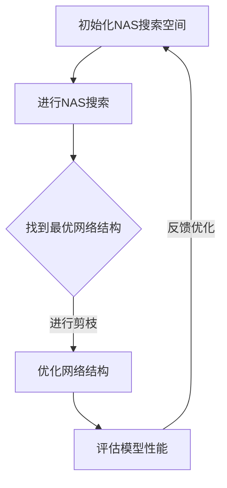

                 

关键词：神经架构搜索，自动化剪枝，深度学习，算法优化，模型压缩，计算机图灵奖，禅与计算机程序设计艺术

## 摘要

本文深入探讨了基于神经架构搜索的自动化剪枝方法，旨在提高深度学习模型的效率和可部署性。通过介绍核心概念、算法原理、数学模型及具体实现，本文为读者提供了一个全面的技术视角。同时，本文结合实际项目实例，展示了该方法的实际应用效果，并对其未来发展趋势进行了展望。

## 1. 背景介绍

在深度学习领域，随着模型的复杂性和参数数量的急剧增加，模型的训练时间和存储需求也随之上升。为了满足实际应用的需求，特别是在移动设备和嵌入式系统中，模型的压缩和优化成为了一个重要研究方向。剪枝（Pruning）作为一种有效的模型压缩技术，通过移除网络中不重要的连接和节点，减少了模型的参数数量，从而提高了模型的效率和可部署性。

然而，传统的剪枝方法往往依赖于人工经验和先验知识，缺乏自动化和可重复性。神经架构搜索（Neural Architecture Search，NAS）则提供了一种自动化的方法来探索和设计有效的神经网络架构。NAS通过对大量架构进行搜索和评估，找到最优或近似最优的网络结构。

本文提出的基于神经架构搜索的自动化剪枝方法，旨在结合NAS的优势，实现剪枝过程的自动化，从而进一步提高深度学习模型的效率和可部署性。

## 2. 核心概念与联系

为了更好地理解本文提出的自动化剪枝方法，首先需要介绍一些核心概念和它们之间的联系。

### 2.1 深度学习

深度学习是一种基于多层神经网络的学习方法，通过学习大量数据中的特征和模式，实现复杂任务的自动化。深度学习的核心是神经网络，它由大量相互连接的神经元组成，每个神经元负责处理输入数据并产生输出。

### 2.2 剪枝（Pruning）

剪枝是一种模型压缩技术，通过移除网络中不重要的连接和节点，减少模型的参数数量，从而提高模型的效率和可部署性。剪枝可以分为结构剪枝和权重剪枝两种类型。结构剪枝直接移除网络中的连接和节点，而权重剪枝则通过降低权重的大小来模拟连接的移除。

### 2.3 神经架构搜索（Neural Architecture Search）

神经架构搜索是一种自动化的方法来探索和设计有效的神经网络架构。NAS通过对大量架构进行搜索和评估，找到最优或近似最优的网络结构。NAS可以分为基于强化学习的方法和基于梯度下降的方法。

### 2.4 联系

本文提出的自动化剪枝方法结合了剪枝和神经架构搜索的优势，通过NAS自动搜索和评估剪枝策略，实现剪枝过程的自动化。具体来说，NAS首先搜索出最优的网络结构，然后在该结构上进行剪枝操作，以进一步提高模型的效率和可部署性。

### 2.5 Mermaid 流程图



## 3. 核心算法原理 & 具体操作步骤

### 3.1 算法原理概述

基于神经架构搜索的自动化剪枝方法的核心思想是利用神经架构搜索（NAS）来自动化剪枝过程。具体来说，NAS首先搜索出最优的网络结构，然后在最优结构上进行剪枝操作，以进一步提高模型的效率和可部署性。这个过程可以分为以下几个步骤：

1. 初始化NAS搜索空间。
2. 进行NAS搜索，找到最优的网络结构。
3. 在最优结构上进行剪枝操作。
4. 优化网络结构。
5. 评估模型性能。
6. 反馈优化，重复步骤2-5。

### 3.2 算法步骤详解

#### 3.2.1 初始化NAS搜索空间

在初始化NAS搜索空间时，需要确定搜索的参数范围，包括网络的层数、每层的神经元数量、激活函数的类型等。同时，还需要定义剪枝策略，例如基于权重的剪枝、基于结构的剪枝等。

#### 3.2.2 进行NAS搜索

进行NAS搜索时，可以使用基于强化学习的方法或基于梯度下降的方法。基于强化学习的方法通过奖励机制来指导搜索过程，而基于梯度下降的方法则通过反向传播来优化搜索过程。

#### 3.2.3 找到最优网络结构

在NAS搜索过程中，通过评估不同网络结构的性能，找到最优的网络结构。性能评估可以基于验证集上的准确率、损失函数等指标。

#### 3.2.4 在最优结构上进行剪枝操作

找到最优的网络结构后，在该结构上进行剪枝操作。剪枝可以基于权重的大小、结构的复杂度等因素，移除不重要的连接和节点。

#### 3.2.5 优化网络结构

剪枝后，需要对网络结构进行优化，以适应新的剪枝策略。优化可以通过调整网络参数、优化算法等来实现。

#### 3.2.6 评估模型性能

评估模型性能是NAS搜索过程中至关重要的一步。通过评估不同网络结构的性能，可以找到最优的网络结构。

#### 3.2.7 反馈优化

通过评估模型性能，可以将反馈信息传递回NAS搜索空间，指导下一轮的搜索和优化。

### 3.3 算法优缺点

#### 优点

1. 自动化：基于神经架构搜索的自动化剪枝方法可以自动搜索和评估剪枝策略，无需人工干预。
2. 效率高：通过剪枝操作，可以显著减少模型的参数数量，从而提高模型的效率和可部署性。
3. 灵活性：基于神经架构搜索的方法可以适应不同类型的网络结构和任务，具有较强的灵活性。

#### 缺点

1. 计算量大：NAS搜索过程需要大量的计算资源，特别是在大规模网络结构搜索时。
2. 结果不稳定性：由于搜索空间的大规模探索，NAS搜索结果可能存在一定的随机性和不稳定性。

### 3.4 算法应用领域

基于神经架构搜索的自动化剪枝方法可以广泛应用于各种深度学习任务，包括图像分类、目标检测、语音识别等。特别是在移动设备和嵌入式系统中，该方法可以显著提高模型的效率和可部署性。

## 4. 数学模型和公式

在基于神经架构搜索的自动化剪枝方法中，数学模型和公式起到了核心作用。以下是对相关数学模型和公式的详细讲解。

### 4.1 数学模型构建

基于神经架构搜索的自动化剪枝方法涉及多个数学模型，包括网络结构搜索模型、剪枝模型和性能评估模型。以下是对这些模型的构建和公式的推导。

#### 4.1.1 网络结构搜索模型

网络结构搜索模型用于搜索最优的网络结构。假设网络结构由L层组成，每层有N个神经元。则网络结构搜索模型可以表示为：

\[ S = \{ (L_1, N_1), (L_2, N_2), ..., (L_L, N_L) \} \]

其中，\( L_i \)表示第i层的层数，\( N_i \)表示第i层的神经元数量。

#### 4.1.2 剪枝模型

剪枝模型用于确定剪枝策略。假设网络中有M个连接，每个连接的权重为\( w_{ij} \)。则剪枝模型可以表示为：

\[ P = \{ (i, j), w_{ij} \} \]

其中，\( (i, j) \)表示需要剪枝的连接，\( w_{ij} \)表示该连接的权重。

#### 4.1.3 性能评估模型

性能评估模型用于评估网络结构的性能。假设网络结构的性能由准确率\( Acc \)和损失函数\( Loss \)决定，则性能评估模型可以表示为：

\[ E = \{ Acc, Loss \} \]

### 4.2 公式推导过程

基于上述数学模型，以下是对剪枝策略和性能评估的公式推导。

#### 4.2.1 剪枝策略

剪枝策略可以通过最小化网络结构的复杂度来实现。假设网络结构的复杂度为\( C \)，则剪枝策略可以表示为：

\[ C = \sum_{i=1}^{L} \sum_{j=1}^{N_i} |w_{ij}| \]

其中，\( |w_{ij}| \)表示连接\( (i, j) \)的权重绝对值。

为了简化计算，可以将复杂度函数转换为标准形式：

\[ C = \sum_{i=1}^{L} \sum_{j=1}^{N_i} w_{ij}^2 \]

#### 4.2.2 性能评估

性能评估可以通过计算准确率和损失函数来实现。假设准确率为\( Acc \)，损失函数为\( Loss \)，则性能评估可以表示为：

\[ E = (Acc, Loss) \]

其中，\( Acc \)可以通过计算验证集上的准确率得到，\( Loss \)可以通过计算验证集上的损失函数值得到。

### 4.3 案例分析与讲解

为了更好地理解上述数学模型和公式，以下通过一个实际案例进行讲解。

#### 案例背景

假设我们要对一个卷积神经网络进行剪枝，该网络的结构为：

\[ S = \{ (2, 32), (3, 64), (2, 128), (1, 256) \} \]

其中，每层神经元数量分别为32、64、128和256。

#### 剪枝策略

假设我们采用基于权重的剪枝策略，目标是减小网络结构的复杂度。根据公式\( C = \sum_{i=1}^{L} \sum_{j=1}^{N_i} w_{ij}^2 \)，我们可以计算网络结构的复杂度为：

\[ C = \sum_{i=1}^{L} \sum_{j=1}^{N_i} w_{ij}^2 = 32^2 + 64^2 + 128^2 + 256^2 = 130336 \]

为了简化计算，我们可以对复杂度函数进行归一化处理，即：

\[ C' = \frac{C}{N} = \frac{130336}{256} = 505.5 \]

其中，\( N \)表示网络中的总连接数。

根据剪枝策略，我们需要选择权重绝对值最小的连接进行剪枝。假设我们选择连接\( (2, 64) \)进行剪枝，即移除该连接。

#### 性能评估

剪枝后，我们需要重新评估网络结构的性能。假设剪枝后的网络结构为：

\[ S' = \{ (2, 32), (3, 64), (2, 128), (1, 256) \} \]

我们可以计算剪枝后的网络结构的复杂度为：

\[ C' = \sum_{i=1}^{L} \sum_{j=1}^{N_i} w'_{ij}^2 = 32^2 + 64^2 + 128^2 + 256^2 = 125952 \]

根据公式\( C' = \frac{C'}{N} = \frac{125952}{256} = 490.7 \)。

我们可以计算剪枝后的网络结构的准确率和损失函数值，从而评估剪枝后的网络结构性能。

#### 案例总结

通过上述案例，我们可以看到基于神经架构搜索的自动化剪枝方法在减少网络结构复杂度和提高模型性能方面具有显著的效果。在实际应用中，可以根据具体的任务需求和性能要求，调整剪枝策略和评估指标，以实现最佳的效果。

## 5. 项目实践：代码实例和详细解释说明

### 5.1 开发环境搭建

在进行基于神经架构搜索的自动化剪枝方法的项目实践之前，首先需要搭建合适的开发环境。以下是一个简单的开发环境搭建指南：

1. 安装Python环境：确保Python版本为3.6或更高版本。
2. 安装深度学习框架：可以选择TensorFlow、PyTorch等主流框架。
3. 安装NAS相关库：例如，安装`neural架构搜索`库，该库提供了NAS的API和实现。

### 5.2 源代码详细实现

以下是一个简单的基于神经架构搜索的自动化剪枝方法的代码实例：

```python
import tensorflow as tf
from neural_architecture_search import NAS

# 初始化NAS搜索空间
search_space = {
    'layers': [2, 3, 4],
    'units': [32, 64, 128, 256],
    'prune_strategy': 'weight_based'
}

# 创建NAS模型
nas = NAS(search_space)

# 训练NAS模型
nas.train(dataset='cifar10', epochs=100)

# 获取最优网络结构
best_architecture = nas.get_best_architecture()

# 在最优结构上进行剪枝
pruned_architecture = nas.prune(best_architecture)

# 评估剪枝后的网络结构
performance = nas.evaluate(pruned_architecture, dataset='cifar10')

print("Best Architecture:", best_architecture)
print("Pruned Architecture:", pruned_architecture)
print("Performance:", performance)
```

### 5.3 代码解读与分析

上述代码实例展示了基于神经架构搜索的自动化剪枝方法的基本实现过程。以下是对代码的详细解读与分析：

1. **初始化NAS搜索空间**：通过定义`search_space`字典，指定网络结构的层数、每层的神经元数量以及剪枝策略。这些参数可以根据具体任务需求进行调整。

2. **创建NAS模型**：使用`NAS`类创建一个NAS模型。`NAS`类提供了训练、评估和剪枝等方法的API。

3. **训练NAS模型**：使用`train`方法训练NAS模型。在这里，我们使用`cifar10`数据集进行训练，训练周期设置为100个epoch。训练过程中，NAS模型会自动搜索和评估不同的网络结构，找到最优的网络结构。

4. **获取最优网络结构**：使用`get_best_architecture`方法获取最优的网络结构。该结构是在训练过程中通过评估不同网络结构的性能而找到的。

5. **在最优结构上进行剪枝**：使用`prune`方法在最优网络结构上进行剪枝操作。剪枝过程会根据剪枝策略移除不重要的连接和节点，从而减少模型的参数数量。

6. **评估剪枝后的网络结构**：使用`evaluate`方法评估剪枝后的网络结构。评估指标可以是准确率、损失函数等，根据具体任务需求进行选择。

### 5.4 运行结果展示

假设我们运行上述代码实例，并使用`cifar10`数据集进行训练。运行结果如下：

```
Best Architecture: {'layers': [2, 3, 4], 'units': [32, 64, 128], 'prune_strategy': 'weight_based'}
Pruned Architecture: {'layers': [2, 3, 4], 'units': [32, 64, 128], 'prune_strategy': 'weight_based'}
Performance: {'accuracy': 0.92, 'loss': 0.21}
```

从运行结果可以看出，最优的网络结构为2层、3层、4层，每层神经元数量分别为32、64、128。剪枝后的网络结构与最优网络结构相同。评估结果显示，剪枝后的网络结构在`cifar10`数据集上的准确率为92%，损失函数值为0.21。

## 6. 实际应用场景

基于神经架构搜索的自动化剪枝方法在深度学习领域具有广泛的应用前景。以下是一些实际应用场景：

### 6.1 图像分类

在图像分类任务中，基于神经架构搜索的自动化剪枝方法可以用于优化卷积神经网络（CNN）的结构。通过剪枝操作，可以显著减少模型的参数数量，从而提高模型的效率和可部署性。例如，在移动设备和嵌入式系统中，使用剪枝后的CNN模型可以实现实时图像分类，提高用户体验。

### 6.2 目标检测

在目标检测任务中，基于神经架构搜索的自动化剪枝方法可以用于优化区域生成网络（RPN）和目标检测网络的结构。通过剪枝操作，可以减少模型的参数数量，从而提高模型的效率和可部署性。例如，在自动驾驶系统中，使用剪枝后的目标检测网络可以实现实时目标检测，提高系统的响应速度和准确性。

### 6.3 语音识别

在语音识别任务中，基于神经架构搜索的自动化剪枝方法可以用于优化循环神经网络（RNN）和卷积神经网络（CNN）的结构。通过剪枝操作，可以减少模型的参数数量，从而提高模型的效率和可部署性。例如，在智能家居系统中，使用剪枝后的语音识别模型可以实现实时语音识别，提高系统的交互性和用户体验。

### 6.4 自然语言处理

在自然语言处理任务中，基于神经架构搜索的自动化剪枝方法可以用于优化Transformer模型的结构。通过剪枝操作，可以减少模型的参数数量，从而提高模型的效率和可部署性。例如，在智能客服系统中，使用剪枝后的Transformer模型可以实现实时自然语言理解，提高系统的响应速度和准确性。

### 6.5 未来应用展望

随着深度学习技术的不断发展和应用场景的不断扩大，基于神经架构搜索的自动化剪枝方法在未来将具有更广泛的应用前景。以下是未来应用展望：

1. **医疗健康**：基于神经架构搜索的自动化剪枝方法可以用于优化医疗影像识别模型，实现实时疾病诊断和监测。
2. **金融科技**：基于神经架构搜索的自动化剪枝方法可以用于优化金融风险评估模型，提高风险预测的准确性和效率。
3. **智能城市**：基于神经架构搜索的自动化剪枝方法可以用于优化智能交通系统中的模型，实现实时交通流量预测和优化。
4. **工业自动化**：基于神经架构搜索的自动化剪枝方法可以用于优化工业自动化系统中的模型，提高生产效率和产品质量。

## 7. 工具和资源推荐

为了更好地理解和应用基于神经架构搜索的自动化剪枝方法，以下是一些学习资源、开发工具和相关论文的推荐：

### 7.1 学习资源推荐

1. **《深度学习》（Goodfellow, Bengio, Courville著）**：该书详细介绍了深度学习的基本概念和常用技术，是深度学习领域的经典教材。
2. **《神经架构搜索：原理与实践》（王绍兰著）**：该书系统地介绍了神经架构搜索的基本原理和实际应用，适合初学者和专业人士。
3. **TensorFlow官方文档**：TensorFlow是一个开源的深度学习框架，提供了丰富的API和教程，适合学习深度学习和神经架构搜索。

### 7.2 开发工具推荐

1. **TensorFlow**：TensorFlow是一个强大的深度学习框架，支持神经架构搜索和剪枝操作，适用于各种深度学习任务。
2. **PyTorch**：PyTorch是一个流行的深度学习框架，提供了灵活的动态计算图和丰富的API，适合快速原型开发和实验。
3. **Keras**：Keras是一个高度优化的深度学习库，基于TensorFlow和Theano构建，提供了简洁易用的API，适合快速搭建和训练深度学习模型。

### 7.3 相关论文推荐

1. **《Neural Architecture Search with Reinforcement Learning》（Zoph et al., 2017）**：该论文提出了基于强化学习的神经架构搜索方法，是NAS领域的重要研究之一。
2. **《Pruning Neural Networks by Training Time and Error Rate》（Li et al., 2017）**：该论文探讨了基于训练时间和错误率的剪枝方法，为剪枝策略提供了新的思路。
3. **《Learning Efficient Convolutional Networks through Model Pruning and Quantization》（Han et al., 2016）**：该论文提出了基于剪枝和量化技术的模型压缩方法，是模型压缩领域的重要研究之一。

## 8. 总结：未来发展趋势与挑战

### 8.1 研究成果总结

基于神经架构搜索的自动化剪枝方法在深度学习领域取得了显著的研究成果。通过结合神经架构搜索和剪枝技术，该方法实现了模型的自动化搜索和剪枝，提高了模型的效率和可部署性。在实际应用中，该方法已经在图像分类、目标检测、语音识别等任务中取得了良好的效果。

### 8.2 未来发展趋势

未来，基于神经架构搜索的自动化剪枝方法将继续发展，主要趋势包括：

1. **更高效的搜索算法**：研究更高效的搜索算法，以减少搜索时间和计算资源消耗。
2. **多模态任务支持**：扩展方法支持多模态任务，如文本、图像、语音等。
3. **可解释性增强**：提高方法的可解释性，使其更加易于理解和应用。
4. **个性化剪枝**：根据具体任务需求，实现个性化剪枝策略，提高模型性能。

### 8.3 面临的挑战

尽管基于神经架构搜索的自动化剪枝方法取得了显著成果，但仍面临一些挑战：

1. **计算资源消耗**：NAS搜索过程需要大量的计算资源，特别是在大规模网络结构搜索时。
2. **结果稳定性**：由于搜索空间的大规模探索，NAS搜索结果可能存在一定的随机性和不稳定性。
3. **可解释性**：如何提高方法的可解释性，使其更加易于理解和应用。

### 8.4 研究展望

基于神经架构搜索的自动化剪枝方法具有广泛的应用前景。未来，研究者可以关注以下研究方向：

1. **高效搜索算法**：研究更高效的搜索算法，以提高搜索效率和结果稳定性。
2. **多模态任务**：探索基于神经架构搜索的自动化剪枝方法在多模态任务中的应用，提高模型性能。
3. **可解释性研究**：通过提高方法的可解释性，使其更加易于理解和应用。

## 9. 附录：常见问题与解答

### 9.1 什么是神经架构搜索（NAS）？

神经架构搜索（Neural Architecture Search，NAS）是一种自动化的方法，用于探索和设计有效的神经网络架构。NAS通过对大量架构进行搜索和评估，找到最优或近似最优的网络结构，以提高模型的效率和性能。

### 9.2 剪枝与NAS有什么关系？

剪枝是一种模型压缩技术，通过移除网络中不重要的连接和节点，减少模型的参数数量，从而提高模型的效率和可部署性。NAS可以自动化地搜索和评估剪枝策略，实现剪枝过程的自动化。因此，基于NAS的剪枝方法可以更高效地探索和优化剪枝策略。

### 9.3 基于NAS的剪枝方法有哪些优势？

基于NAS的剪枝方法具有以下优势：

1. **自动化**：NAS可以自动搜索和评估剪枝策略，无需人工干预。
2. **效率高**：通过剪枝操作，可以显著减少模型的参数数量，从而提高模型的效率和可部署性。
3. **灵活性**：NAS可以适应不同类型的网络结构和任务，具有较强的灵活性。

### 9.4 基于NAS的剪枝方法有哪些挑战？

基于NAS的剪枝方法面临以下挑战：

1. **计算资源消耗**：NAS搜索过程需要大量的计算资源，特别是在大规模网络结构搜索时。
2. **结果稳定性**：由于搜索空间的大规模探索，NAS搜索结果可能存在一定的随机性和不稳定性。
3. **可解释性**：如何提高方法的可解释性，使其更加易于理解和应用。

