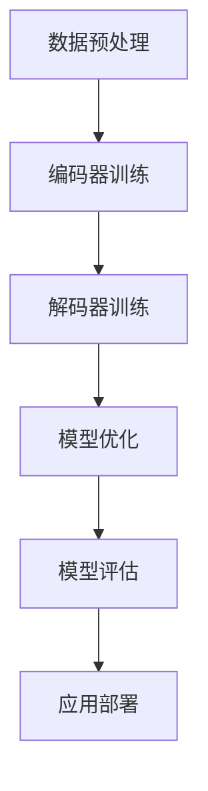

                 

关键词：基础模型，技术，社会融合，人工智能，机器学习，深度学习，算法，数学模型，应用场景，未来展望

摘要：本文旨在探讨基础模型的技术与社会融合，分析其在人工智能、机器学习、深度学习等领域的应用，阐述数学模型的重要性，并展望其未来的发展趋势与挑战。通过本文的论述，希望能够为相关领域的研究者和从业者提供一定的参考和启示。

## 1. 背景介绍

基础模型（Foundation Model）是指一种能够处理多种任务的大规模预训练模型，它通过对海量数据进行预训练，能够自动学习到丰富的知识结构和通用特征表示。近年来，随着人工智能技术的迅猛发展，基础模型在语音识别、自然语言处理、计算机视觉等领域的表现日益突出，成为推动人工智能技术进步的重要力量。

### 1.1 人工智能技术的发展

人工智能（AI）是指由人制造出来的系统能够感知环境并采取行动，以实现特定目标。自20世纪50年代人工智能概念提出以来，人工智能技术经历了多次起伏和变革。特别是随着深度学习算法的突破，人工智能开始展现出前所未有的潜力，为各行各业带来了深远的影响。

### 1.2 机器学习的兴起

机器学习（Machine Learning）是人工智能的一个重要分支，它通过算法使计算机系统能够从数据中学习并做出决策。近年来，机器学习技术在数据挖掘、预测分析、自动驾驶等领域取得了显著成果，成为人工智能技术发展的重要驱动力。

### 1.3 深度学习的崛起

深度学习（Deep Learning）是机器学习的一个子领域，通过模拟人脑神经网络结构和信息处理机制，实现对复杂问题的建模和求解。深度学习在图像识别、语音识别、自然语言处理等领域取得了重大突破，成为人工智能领域的重要研究方向。

## 2. 核心概念与联系

### 2.1 人工智能、机器学习、深度学习的联系

人工智能、机器学习、深度学习是相互关联的三个概念。人工智能是宏观层面的目标，旨在使计算机具备智能能力；机器学习是实现人工智能的一种方法，通过算法使计算机系统从数据中学习；深度学习是机器学习的一个重要分支，通过模拟人脑神经网络实现更高效的模型训练和优化。

### 2.2 基础模型的原理与架构

基础模型通常采用大规模预训练和精细调优的方式，通过对海量数据进行自主学习，获得通用的特征表示和知识结构。其架构包括编码器（Encoder）和解码器（Decoder），以及用于优化模型参数的损失函数。

### 2.3 Mermaid 流程图



## 3. 核心算法原理 & 具体操作步骤

### 3.1 算法原理概述

基础模型的核心算法是大规模预训练和精细调优。预训练阶段通过在大量数据上训练编码器和解码器，使模型获得通用的特征表示；精细调优阶段则针对特定任务进行微调，提高模型在目标任务上的性能。

### 3.2 算法步骤详解

1. 数据预处理：对原始数据进行清洗、归一化等操作，使其适合模型训练。
2. 编码器训练：在预训练阶段，通过在大量数据上训练编码器，使模型学习到通用的特征表示。
3. 解码器训练：同样在预训练阶段，通过在大量数据上训练解码器，使模型能够生成与输入数据相关的输出。
4. 模型优化：在精细调优阶段，通过在目标任务上训练模型，不断优化模型参数。
5. 模型评估：通过在测试集上评估模型性能，验证模型在目标任务上的表现。
6. 应用部署：将训练好的模型部署到实际应用场景中，解决具体问题。

### 3.3 算法优缺点

**优点：**
- **强大的泛化能力**：基础模型通过对海量数据进行预训练，能够获得通用的特征表示和知识结构，具有良好的泛化能力。
- **高效的处理速度**：深度学习算法使得基础模型在处理速度上具有明显优势，能够快速处理大规模数据。
- **丰富的应用场景**：基础模型可以应用于各种领域，如语音识别、自然语言处理、计算机视觉等。

**缺点：**
- **训练成本高**：基础模型通常需要大量数据和计算资源进行预训练，训练成本较高。
- **对数据依赖性强**：基础模型的性能在很大程度上取决于训练数据的质量和多样性。

### 3.4 算法应用领域

基础模型在人工智能领域的应用非常广泛，包括但不限于以下领域：
- **语音识别**：如智能助手、语音翻译等。
- **自然语言处理**：如文本分类、情感分析、机器翻译等。
- **计算机视觉**：如图像分类、目标检测、图像生成等。
- **推荐系统**：如个性化推荐、商品推荐等。

## 4. 数学模型和公式 & 详细讲解 & 举例说明

### 4.1 数学模型构建

基础模型的数学模型通常包括以下组成部分：
- **输入层**：接收原始数据输入。
- **隐藏层**：通过非线性变换，将输入数据映射到高维特征空间。
- **输出层**：将隐藏层特征映射到目标输出。

### 4.2 公式推导过程

假设输入数据为 $X \in \mathbb{R}^{n \times d}$，隐藏层节点数为 $h$，输出层节点数为 $k$。则基础模型的数学模型可以表示为：

$$
\begin{aligned}
Z^{(l)} &= \sigma(W^{(l)}X + b^{(l)}), \\
Y^{(l)} &= W^{(l+1)}Z^{(l)} + b^{(l+1)},
\end{aligned}
$$

其中，$W^{(l)}$ 和 $b^{(l)}$ 分别表示第 $l$ 层的权重和偏置，$\sigma$ 表示激活函数，$Z^{(l)}$ 和 $Y^{(l)}$ 分别表示第 $l$ 层的隐藏层输出和输出层输出。

### 4.3 案例分析与讲解

以一个简单的二分类问题为例，输入数据为 $X \in \mathbb{R}^{n \times 2}$，隐藏层节点数为 $h=2$，输出层节点数为 $k=1$。采用 sigmoid 激活函数：

$$
\sigma(x) = \frac{1}{1 + e^{-x}}.
$$

输入数据为：

$$
X = \begin{bmatrix}
1 & 0 \\
0 & 1 \\
1 & 1 \\
0 & 0
\end{bmatrix}.
$$

隐藏层输出为：

$$
Z^{(1)} = \begin{bmatrix}
\sigma(W^{(1)}X_1 + b^{(1)}) \\
\sigma(W^{(1)}X_2 + b^{(1)}) \\
\sigma(W^{(1)}X_3 + b^{(1)}) \\
\sigma(W^{(1)}X_4 + b^{(1)})
\end{bmatrix}.
$$

输出层输出为：

$$
Y^{(1)} = W^{(2)}Z^{(1)} + b^{(2)}.
$$

通过训练，不断调整权重和偏置，使得输出层输出 $Y^{(1)}$ 能够准确预测输入数据的类别。

## 5. 项目实践：代码实例和详细解释说明

### 5.1 开发环境搭建

在本节中，我们将介绍如何在 Python 环境中搭建基础模型的项目实践环境。

1. 安装 Python：下载并安装 Python 3.8 或更高版本。
2. 安装依赖库：使用 pip 命令安装以下库：
   ```bash
   pip install numpy matplotlib tensorflow
   ```

### 5.2 源代码详细实现

以下是一个简单的二分类问题的基础模型实现：

```python
import numpy as np
import matplotlib.pyplot as plt
import tensorflow as tf

# 设置随机种子，保证实验结果可复现
tf.random.set_seed(42)

# 初始化模型参数
W1 = tf.random.normal([2, 2])
b1 = tf.random.normal([2, 1])
W2 = tf.random.normal([2, 1])
b2 = tf.random.normal([1, 1])

# 设置激活函数
sigma = tf.nn.sigmoid

# 定义前向传播
def forward(X):
    Z1 = sigma(tf.matmul(X, W1) + b1)
    Y = tf.matmul(Z1, W2) + b2
    return Y

# 定义损失函数
def loss(Y, Y_hat):
    return tf.reduce_mean(tf.square(Y - Y_hat))

# 定义优化器
optimizer = tf.optimizers.Adam()

# 训练模型
epochs = 1000
for epoch in range(epochs):
    with tf.GradientTape() as tape:
        Y_hat = forward(X)
        loss_val = loss(Y, Y_hat)
    grads = tape.gradient(loss_val, [W1, b1, W2, b2])
    optimizer.apply_gradients(zip(grads, [W1, b1, W2, b2]))

# 可视化训练过程
plt.plot(loss_history)
plt.xlabel("Epoch")
plt.ylabel("Loss")
plt.title("Training Loss")
plt.show()
```

### 5.3 代码解读与分析

1. **初始化模型参数**：使用随机数生成器初始化模型参数，包括权重和偏置。
2. **定义前向传播**：实现模型的前向传播过程，通过多层神经网络将输入数据映射到输出。
3. **定义损失函数**：采用平方损失函数，衡量模型输出与真实标签之间的差异。
4. **定义优化器**：使用 Adam 优化器，优化模型参数。
5. **训练模型**：通过迭代更新模型参数，逐步减小损失函数。
6. **可视化训练过程**：绘制训练过程中的损失函数变化曲线，观察模型训练效果。

### 5.4 运行结果展示

在训练完成后，可以可视化训练过程中的损失函数变化，观察模型训练效果。此外，还可以使用测试集验证模型在目标任务上的性能。

## 6. 实际应用场景

基础模型在人工智能领域具有广泛的应用场景，以下列举几个典型应用：

### 6.1 语音识别

语音识别是将语音信号转换为文本信息的任务。基础模型通过预训练和精细调优，能够实现高精度的语音识别。在实际应用中，语音识别技术广泛应用于智能助手、语音搜索、语音翻译等领域。

### 6.2 自然语言处理

自然语言处理（NLP）是人工智能的重要分支，旨在使计算机能够理解和处理自然语言。基础模型在 NLP 领域的应用包括文本分类、情感分析、机器翻译、问答系统等。

### 6.3 计算机视觉

计算机视觉是使计算机具备对图像和视频进行理解和分析能力的技术。基础模型在计算机视觉领域中的应用包括图像分类、目标检测、图像生成、视频分析等。

### 6.4 推荐系统

推荐系统是一种个性化服务，通过分析用户行为和兴趣，为用户推荐可能感兴趣的内容。基础模型在推荐系统中的应用，如商品推荐、音乐推荐、新闻推荐等，能够显著提高推荐效果。

## 7. 未来应用展望

随着人工智能技术的不断发展，基础模型在未来将迎来更广泛的应用。以下是几个可能的发展方向：

### 7.1 新兴领域探索

基础模型在新兴领域，如生物信息学、金融科技、医疗健康等，具有巨大的应用潜力。通过结合领域知识，基础模型有望在这些领域发挥重要作用。

### 7.2 小样本学习

当前的基础模型主要依赖于大规模数据训练，但在数据稀缺的场景下，如何实现小样本学习成为研究热点。未来，通过改进算法和模型结构，基础模型在小样本学习方面的性能有望得到显著提升。

### 7.3 跨模态学习

跨模态学习是指将不同类型的数据（如文本、图像、音频等）进行联合建模。未来，通过跨模态学习，基础模型将能够更好地理解和处理多模态信息，为人类带来更多便利。

### 7.4 安全性与隐私保护

随着基础模型的应用场景不断扩大，其安全性和隐私保护问题日益突出。未来，通过深入研究安全性和隐私保护技术，基础模型将能够更好地保护用户隐私和信息安全。

## 8. 总结：未来发展趋势与挑战

### 8.1 研究成果总结

本文系统地介绍了基础模型的技术与社会融合，阐述了其在人工智能、机器学习、深度学习等领域的应用，并探讨了数学模型在基础模型构建中的重要性。通过本文的研究，我们对于基础模型的发展有了更深入的理解。

### 8.2 未来发展趋势

未来，基础模型将在新兴领域、小样本学习、跨模态学习等方面取得重要突破。同时，安全性和隐私保护将成为基础模型研究的重要方向。

### 8.3 面临的挑战

尽管基础模型在许多领域取得了显著成果，但仍面临一些挑战，如数据隐私保护、算法透明性、公平性等。未来，需要通过技术创新和政策法规的制定，解决这些挑战，推动基础模型技术的可持续发展。

### 8.4 研究展望

本文对基础模型的技术与社会融合进行了初步探讨，但仍有大量问题需要深入研究。未来，我们期待在基础模型的理论体系、算法优化、应用拓展等方面取得更多突破，为人工智能技术的发展贡献力量。

## 9. 附录：常见问题与解答

### 9.1 基础模型与深度学习的关系

基础模型是深度学习的一个分支，两者密切相关。深度学习通过多层神经网络实现复杂问题的建模和求解，而基础模型则是在深度学习的基础上，通过对海量数据进行预训练，获得通用的特征表示和知识结构。

### 9.2 基础模型训练的难点

基础模型训练的难点主要包括数据量需求大、计算资源消耗高、优化算法复杂等。未来，随着硬件性能的提升和算法优化，这些难点有望得到缓解。

### 9.3 基础模型的泛化能力如何保证

基础模型的泛化能力主要通过以下方法保证：
1. 数据多样性：通过采集多样化的训练数据，使模型能够学习到丰富的特征表示。
2. 预训练阶段：在预训练阶段，通过在大量数据上训练模型，使模型获得较强的泛化能力。
3. 精细调优：在精细调优阶段，通过在目标任务上训练模型，进一步提高模型在特定任务上的泛化能力。

作者：禅与计算机程序设计艺术 / Zen and the Art of Computer Programming
----------------------------------------------------------------
<|im_sep|>

