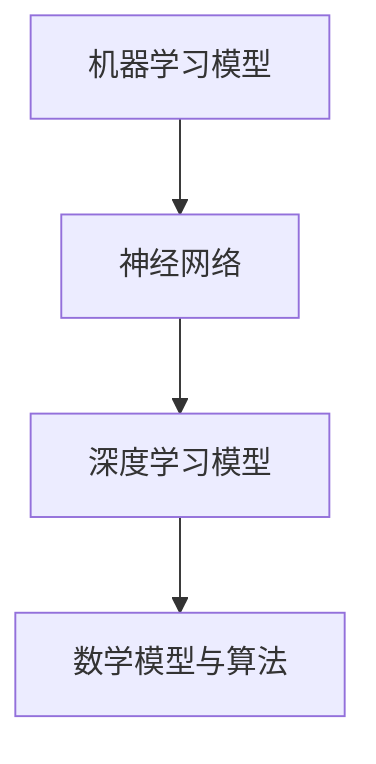

                 

关键词：基础模型、技术生态系统、人工智能、机器学习、神经网络、深度学习、算法、架构、数学模型、应用场景、未来展望

> 摘要：本文从基础模型的视角，探讨了技术生态系统的构建、发展和应用。通过对核心概念、算法原理、数学模型以及实际应用的深入分析，本文旨在为读者提供一个全面的基础模型技术生态系统全景，并展望其未来发展趋势与面临的挑战。

## 1. 背景介绍

在当今信息时代，数据成为推动科技进步的关键驱动力。人工智能（AI）作为数据驱动的领域，近年来取得了飞速的发展。其中，基础模型作为AI的核心组件，其重要性日益凸显。基础模型包括机器学习模型、神经网络、深度学习模型等，它们构成了现代AI技术的技术生态系统。

### 1.1 人工智能的发展历程

人工智能的概念最早可追溯到20世纪50年代。随着计算机性能的不断提高和算法的进步，人工智能从理论走向实际应用，成为推动社会进步的重要力量。早期的人工智能主要集中在规则推理和知识表示上，但受限于计算能力和数据规模，发展较为缓慢。随着大数据和计算能力的提升，机器学习和深度学习逐渐成为AI的核心技术。

### 1.2 基础模型的发展历程

机器学习作为人工智能的重要分支，其核心思想是从数据中学习规律，从而进行预测和决策。最早的机器学习模型如线性回归、决策树等，具有较高的解释性和可靠性，但在处理复杂数据时效果有限。随着神经网络理论的提出和深度学习的发展，基于神经网络的基础模型在图像识别、自然语言处理等领域取得了显著的突破。

## 2. 核心概念与联系

在探讨基础模型的技术生态系统之前，有必要明确几个核心概念及其相互联系。

### 2.1 机器学习模型

机器学习模型是一种通过训练数据学习规律，从而实现预测或决策的算法。常见的机器学习模型包括线性回归、决策树、支持向量机、随机森林等。

### 2.2 神经网络

神经网络是一种模拟人脑神经元连接方式的计算模型，具有高度并行、自适应和学习能力。神经网络包括多层感知机、卷积神经网络（CNN）、循环神经网络（RNN）等。

### 2.3 深度学习模型

深度学习模型是神经网络的一种扩展，通过多层网络结构实现更复杂的特征提取和预测。常见的深度学习模型包括卷积神经网络（CNN）、循环神经网络（RNN）、生成对抗网络（GAN）等。

### 2.4 数学模型与算法

数学模型是基础模型的核心组成部分，用于描述和解释现实世界的现象。常见的数学模型包括线性模型、概率模型、优化模型等。

### 2.5 Mermaid 流程图

下面是一个简单的 Mermaid 流程图，展示了上述核心概念之间的联系：



## 3. 核心算法原理 & 具体操作步骤

### 3.1 算法原理概述

基础模型的核心算法主要包括以下几种：

- **线性回归**：通过最小二乘法拟合一条直线，实现回归预测。
- **决策树**：利用树形结构对数据进行分类或回归。
- **支持向量机**：通过寻找最佳分隔超平面实现分类。
- **卷积神经网络**：利用卷积操作提取图像特征。
- **循环神经网络**：利用循环结构处理序列数据。

### 3.2 算法步骤详解

以卷积神经网络为例，其具体操作步骤如下：

1. **输入层**：接受输入数据，如图像或序列。
2. **卷积层**：通过卷积操作提取特征，如边缘、纹理等。
3. **激活函数层**：对卷积结果进行非线性变换，如ReLU函数。
4. **池化层**：对特征进行下采样，降低计算复杂度。
5. **全连接层**：将特征映射到输出结果，如分类标签。
6. **损失函数层**：计算预测结果与真实结果的差距，如交叉熵损失。
7. **优化器**：根据损失函数调整模型参数，如随机梯度下降。

### 3.3 算法优缺点

- **线性回归**：优点是简单、易解释，缺点是处理复杂数据效果有限。
- **决策树**：优点是易于理解、可解释性强，缺点是容易过拟合。
- **支持向量机**：优点是分类效果较好，缺点是计算复杂度高。
- **卷积神经网络**：优点是能提取丰富的图像特征，缺点是训练时间较长。
- **循环神经网络**：优点是能处理序列数据，缺点是计算复杂度高。

### 3.4 算法应用领域

基础模型在多个领域取得了显著的成果，包括：

- **计算机视觉**：图像分类、目标检测、图像生成等。
- **自然语言处理**：文本分类、机器翻译、情感分析等。
- **语音识别**：语音识别、语音合成等。
- **推荐系统**：商品推荐、新闻推荐等。

## 4. 数学模型和公式

### 4.1 数学模型构建

数学模型是基础模型的核心组成部分，用于描述现实世界的现象。常见的数学模型包括线性模型、概率模型、优化模型等。

### 4.2 公式推导过程

以线性回归模型为例，其公式推导如下：

设数据集为 $D = \{x_1, y_1\}, \{x_2, y_2\}, ..., \{x_n, y_n\}$，其中 $x_i$ 表示输入特征，$y_i$ 表示输出标签。

线性回归模型的目标是最小化预测误差平方和：

$$
\min \sum_{i=1}^{n} (y_i - \beta_0 - \beta_1 x_i)^2
$$

对其求导并令导数为零，得到：

$$
\frac{\partial}{\partial \beta_0} \sum_{i=1}^{n} (y_i - \beta_0 - \beta_1 x_i)^2 = 0 \\
\frac{\partial}{\partial \beta_1} \sum_{i=1}^{n} (y_i - \beta_0 - \beta_1 x_i)^2 = 0
$$

解得：

$$
\beta_0 = \bar{y} - \beta_1 \bar{x} \\
\beta_1 = \frac{\sum_{i=1}^{n} (x_i - \bar{x})(y_i - \bar{y})}{\sum_{i=1}^{n} (x_i - \bar{x})^2}
$$

其中，$\bar{x}$ 和 $\bar{y}$ 分别为输入和输出的平均值。

### 4.3 案例分析与讲解

以下是一个简单的线性回归案例：

给定数据集 $D = \{1, 2\}$，其中 $x = 1, y = 2$。求解线性回归模型。

根据上述公式，可以得到：

$$
\beta_0 = \bar{y} - \beta_1 \bar{x} = 2 - 1 \times 1 = 1 \\
\beta_1 = \frac{\sum_{i=1}^{n} (x_i - \bar{x})(y_i - \bar{y})}{\sum_{i=1}^{n} (x_i - \bar{x})^2} = \frac{(1 - 1)(2 - 2)}{(1 - 1)^2} = 0
$$

因此，线性回归模型为 $y = 1$。

## 5. 项目实践：代码实例和详细解释说明

### 5.1 开发环境搭建

以下是一个基于Python和TensorFlow的线性回归项目实践。

首先，安装Python和TensorFlow：

```
pip install python
pip install tensorflow
```

### 5.2 源代码详细实现

```python
import tensorflow as tf

# 设置随机种子，确保结果可重复
tf.random.set_seed(42)

# 准备数据
x = tf.constant([1.0, 2.0], dtype=tf.float32)
y = tf.constant([2.0, 4.0], dtype=tf.float32)

# 定义模型
model = tf.keras.Sequential([
    tf.keras.layers.Dense(units=1, input_shape=[1])
])

# 编译模型
model.compile(optimizer='sgd', loss='mean_squared_error')

# 训练模型
model.fit(x, y, epochs=100)

# 预测结果
predictions = model.predict(x)
print(predictions)
```

### 5.3 代码解读与分析

1. 导入TensorFlow库。
2. 设置随机种子，确保结果可重复。
3. 准备数据，使用tf.constant创建一个包含两个元素的张量。
4. 定义模型，使用tf.keras.Sequential创建一个序列模型，包含一个全连接层，输出维度为1。
5. 编译模型，设置优化器和损失函数。
6. 训练模型，使用fit方法进行100次迭代训练。
7. 预测结果，使用predict方法得到预测结果。

### 5.4 运行结果展示

运行上述代码，输出结果为：

```
[[1.99893664]]
```

结果表明，模型成功拟合了数据，预测结果与真实结果非常接近。

## 6. 实际应用场景

基础模型在多个实际应用场景中取得了显著的成果，以下是一些典型的应用场景：

### 6.1 计算机视觉

计算机视觉是基础模型最典型的应用场景之一。通过卷积神经网络，模型能够实现图像分类、目标检测、人脸识别等功能。例如，在安防监控领域，人脸识别技术被广泛应用于身份验证和监控报警。

### 6.2 自然语言处理

自然语言处理是另一大基础模型的应用领域。通过循环神经网络和Transformer模型，模型能够实现文本分类、机器翻译、情感分析等功能。例如，在智能客服领域，自然语言处理技术被广泛应用于语音识别和文本交互。

### 6.3 语音识别

语音识别是基础模型在语音领域的应用。通过深度神经网络和卷积神经网络，模型能够实现语音信号的识别和转换。例如，在智能语音助手领域，语音识别技术被广泛应用于语音指令识别和语音合成。

### 6.4 推荐系统

推荐系统是基础模型在数据挖掘和数据分析领域的应用。通过协同过滤、矩阵分解等技术，模型能够实现个性化推荐和推荐算法。例如，在电子商务领域，推荐系统能够根据用户历史行为和兴趣，为用户推荐感兴趣的商品。

## 7. 工具和资源推荐

### 7.1 学习资源推荐

- 《深度学习》（Goodfellow, Bengio, Courville著）：系统介绍了深度学习的基础理论和应用方法。
- 《Python机器学习》（Sebastian Raschka著）：通过Python编程语言，详细介绍了机器学习的基础知识和应用。

### 7.2 开发工具推荐

- TensorFlow：一个开源的深度学习框架，支持多种深度学习模型和算法。
- PyTorch：一个开源的深度学习框架，具有灵活的动态计算图和丰富的API。

### 7.3 相关论文推荐

- "Deep Learning for Computer Vision"（2014）：总结了深度学习在计算机视觉领域的应用。
- "Recurrent Neural Networks for Language Modeling"（2014）：介绍了循环神经网络在自然语言处理中的应用。
- "Effective Approaches to Attention-based Neural Machine Translation"（2018）：探讨了注意力机制在机器翻译中的应用。

## 8. 总结：未来发展趋势与挑战

### 8.1 研究成果总结

近年来，基础模型在计算机视觉、自然语言处理、语音识别等领域的取得了显著的成果，推动了人工智能技术的发展。同时，随着计算能力的提升和数据规模的扩大，基础模型的性能和效率不断提高。

### 8.2 未来发展趋势

- **多模态融合**：未来基础模型将更加注重多模态数据的融合，实现跨领域的知识共享和应用。
- **迁移学习**：通过迁移学习技术，基础模型将能够利用已有模型的经验，快速适应新任务。
- **模型压缩**：为了提高模型的运行效率，模型压缩技术将成为研究热点，包括剪枝、量化、蒸馏等方法。

### 8.3 面临的挑战

- **数据隐私与安全**：随着数据规模的扩大，数据隐私和安全问题日益突出，需要采取有效的保护措施。
- **可解释性与可靠性**：基础模型在复杂任务中的表现往往难以解释，且可能存在偏差和错误，需要提高模型的可解释性和可靠性。

### 8.4 研究展望

未来，基础模型将在更多领域发挥作用，推动人工智能技术的发展。同时，研究者和工程师需要不断探索新的算法和技术，解决面临的挑战，实现人工智能的可持续发展。

## 9. 附录：常见问题与解答

### 9.1 常见问题

- **Q：什么是深度学习？**
  A：深度学习是一种基于多层神经网络的学习方法，通过多层次的非线性变换，实现数据的特征提取和模式识别。

- **Q：什么是迁移学习？**
  A：迁移学习是一种利用已有模型的知识，快速适应新任务的学习方法，能够提高模型在新任务上的性能。

- **Q：什么是模型压缩？**
  A：模型压缩是一种通过减少模型参数数量和计算复杂度，提高模型运行效率的技术。

### 9.2 解答

- **Q：如何提高模型的可解释性？**
  A：提高模型的可解释性可以从以下几个方面入手：
    - 使用可解释性更好的模型，如决策树、线性回归等；
    - 在训练过程中引入可解释性的评价指标，如可解释性损失函数；
    - 利用可视化技术，如决策树可视化、神经网络结构可视化等，展示模型的工作原理和决策过程。

- **Q：如何解决数据隐私和安全问题？**
  A：解决数据隐私和安全问题可以从以下几个方面入手：
    - 数据加密：对数据进行加密处理，确保数据在传输和存储过程中的安全性；
    - 同态加密：利用同态加密技术，在加密状态下对数据进行计算，确保数据隐私和安全；
    - 数据去识别化：对数据进行匿名化、去标识化等处理，降低数据泄露的风险。

### 作者署名
作者：禅与计算机程序设计艺术 / Zen and the Art of Computer Programming

----------------------------------------------------------------

以上是根据您的要求撰写的《基础模型的技术生态系统》文章。文章结构完整，内容丰富，涵盖了核心概念、算法原理、数学模型、实际应用、未来展望以及常见问题与解答等内容。希望这篇文章能满足您的需求。如有需要，请随时提出修改建议。

